# Willkommen am Waldrain!

Carl-Keller-Weg 6, D-79539 Loerrach
&ndash; Gewann Wächtersholden am Huenerberg Suedwesthang
&ndash; [Ort](https://www.google.de/maps/place/Carl-Keller-Weg+6+79539+Loerrach)
&ndash; [Anfahrt](https://www.google.com/maps/dir//Carl-Keller-Weg+6+79539+Loerrach)
&ndash; [Bankverbindung](#bankverbindung)

Hinweis: Diese Webseite ist offen.
Unseres Wissens stehen keine Geheimnisse drin.
Jede, die hier etwas Vertrauliches entdeckt, moege das bitte schleunigst kundtun und melden, so dass wir es entfernen koennen.
Vielen Dank!

#### Inhaltsangabe

<div id="toc"></div>

## Gemeinschaft

### Waldraindokumente

Vorschlag von Moc zu einer [Charta](doc/genossenschaft/charta_waldrain.pdf); Anja betont Wichtigkeit, eine eigene zu machen.

- [Konzept](doc/genossenschaft/Konzept_Waldrain_10.pdf)
- [Satzungs](doc/genossenschaft/Satzung_Waldrain_10.pdf)
- [Jahresbericht und Jahresrechnung 2020](doc/genossenschaft/jahresbericht_2020.md) &ndash; in Arbeit, WIP (Work in progress)
- [Beteiligungserklaerung](doc/genossenschaft/Beteiligungserklaerung.pdf)
- [Grober Finanzplan Jeremy](doc/genossenschaft/waldrain_finanz_jeremy.xlsx)
 &ndash; [Ueberarbeitete Onlineversion von Joerg und Moc](https://docs.google.com/spreadsheets/d/1MXg0bzbI9AxGVAm-AVeboT5g0EfqtUOxwRGOtA5mdBM/edit?usp=sharing)
- [Waldrain Wuensche](https://docs.google.com/spreadsheets/d/1Ghl7LC5yZ14B5gDlxABWJrWnH_5UxBBB_vWW0tdEz3o/edit), details siehe [Fragenkatalog](#fragenkatalog)

<!-- - [Eine HTML-Version dieser Webseite zum Runterladen und Betrachtung offline](waldrain_offline.html) &ndash; leider ohne die automatisch generierte Inhaltsangabe -->

### Bankverbindung

Geschaeftskonto:

- Waldrain eG i.G.
 <br/>Carl-Keller-Weg 6, D-79539 Loerrach

- [Volksbank Dreiländereck EG](https://www.vb3.de)
 <br/>Tumringer Strasse 237, D-79537 Lörrach
 <br/>SWIFT/BIC: VOLODE66
 <br/>Kontonummer: 1623389

Euro-Konto fuer Zahlungen aus Deutschland und der EU:

- Bankleitzahl: 68390000
 <br/>IBAN: DE32 6839 0000 0001 6233 89

CHF-Konto fuer Zahlungen aus der Schweiz; die Einzahlung in CHF wird automatisch zu einem guten Kurs in EUR konvertiert:

- Bank code: 89093
 <br/>IBAN: CH08 8909 3000 0016 2338 9

### Leitfaden für Hausprojekte

Der [Leitfaden für Hausprojekte](doc/gemeinschaft/leitfadenhausprojekte.pdf) bietet
eine wichtige Grundlagenlektuere mit Aufsaetzen zu folgenden Themen:

2. Warum dieser Leitfaden?
3. Die Geschichte der Hausprojekte 
4. Grundlagen Rechtsformen 
6. Selbstverständnis
9. Rechtsform - Findung
10. Gängige Rechtsformen
12. Vergleich Genossenschaft - Mietshäuser Syndikat
14. Privateigentum & Selbstorganisierung
17. Haus - Findung
20. Umgang mit Banken 
22. Bank - Konditionen
23. Kritische Bankenwahl
24. Förderung
26. Die soziale Frage
28. Moderation und Mediation
31. Gruppenprozesse

### Wichtige Grundsatzentscheidung

Soll die Spekulation und Veraeusserung fuer immer und ewig verhindert werden?

- ja --> mietshaeusersyndikat, gmbh + verein
- nein --> genossenschaft

Will die Hausgemeinschaft unabhaengig bleiben?

- ja --> eigene kleine genossenschaft

### Konsum und Gemeinschaft

Eine Reportage des SRF zum Thema Konsum, mit einem interessanten Beispiel einer Gemeinschaft in der Schweiz:

- [SRF zwei im Kaufrausch](https://medien.srf.ch/-/srf-zwei-im-kaufrausch)

Der 3. Beitrag handelt von einer Gemeinschaft, die eine sehr neuen und recht extremen Form lebt.
 
Macht mut, solches zu wissen, finde ich!
 
### 2. WohnWandelSymposium

Michael und Jeremy nahmen teil an
dem [2. Symposium WohnWandel &ndash; Gemeinschaftliches Wohnen in LÖ](https://www.fairnetzt-loerrach.de/veranstaltung/vortraege-in-basel-neues-wohnen-fuer-neue-gesellschaftsformen-2-2)
am Samstag 30. November 2019, wo sie Vortraege uund detaillierte Infos erhalten konten von:

- Lebenswerte Nachbarschaft Basel
- Helma Haselberger vom Mietshäuser Syndikat Freiburg
- Burghard Flieger, Innova eG ueber Hausgemeinschaftsgenossenschaften

### LeNa

[Lena](https://www.lena.coop/clubdesk/www) oder
das Lenahaus ist die Bau- und Wohngenossenschaft <u>Lebenswerte Nachbarschaft Basel</u>.

Das [Konzeptpapier von Lena](doc/lena/lenahaus_konzept.pdf) ist lesenswert.

- qm pro person, verschiedene wg-varianten, geminschaftraeume
- kleine kuechen, eine grosse gemeinsame
- gemeinschaftlich essen, kochen, gemuese produkte
- gemeinschaftsbad
- sternenbar
- ateliers
- lautes, leises

Siehe auch die [Lena-GV-Unterlagen vom 6.9.2020](#lena-gv-unterlagen-2020-09-06):

- [LeNa-Charta](doc/lena/200824_lena_charta.pdf) &ndash; Die vollkommen umgeschriebene Charta, die alles "Streng-Ökologische" in das Vermietungsreglement verbannt hat und sich auf Modalitäten des Zusammen-Seins beschränkt
- [Vermietungsreglement LeNa-Haus](doc/lena/200824_vermietungsreglement_lena_haus.pdf) &ndash; Das Vermietungsreglement als Kontrast, weil das überhaupt nicht zu der von Moc erlebten Philosophie von Waldrain passt...
- [Jahresbericht und Jahresrechnung 2019](doc/lena/2019_lena_jahresbericht.pdf) &ndash; Die Jahresbilanz und -Rechnung für den Vorstand mit einer schoenen allgemeinverstaendlichen Bilanz, Uebersicht ueber Aktiva und Passiva, Erfolgsrechnung 2019 mit Ertrag und Aufwand sozie eine Gegenueberstellung Erfolgsrechnung und Budget

### Mietshaeusersyndikat

Das [Mietshäuser Syndikat](https://www.syndikat.org) entzieht Mietshaeuser dauerhaft der Immobilienspekulation.

- hausverein bestimmt alles im haus
- syndikat gmbh wacht darueber, dass nicht privatisiert wird
- beide zusammen bilden die haus-gmbh, mit je einer stimme, und alle entscheidungen muessen einstimmig sein
- haus gmbh has 25000 eigenkapital, je haelftig syndikat und verein
- 150 hausprojekte
- finanzierung von kfw bank fuer energieeffizientes bauen
- vom bw zu 0 preozent fuer 2400 euro pro qm fuer sozialer wohnungsbau

Hier ist ein Vergleich zu unserer gewaehlten Form:
[Genossenschaft oder Mietshaeuser Syndikat?](doc/gemeinschaft/genossenschaft_oder_mietshaeuser_syndikat.pdf)
 
### Burghard Flieger

- Projektbuero Freiburg
- 4 prinzipien von genossenschaften:
 - foerderung: ziel nicht kapitalverwertung, sondern nutzen, z.b. gemeinschaftliches wohnen
 - identitaet: mieter und vermieter identisch
 - demokratie: ein mensch ein stimme unabhaengig von einlage
 - solidaritaet: bei krisen und aufbau treten individualle interessen zurueck
- mitgliedschaft:
 - unkomplizierter beitritt
 - anteile kaufen, i.d.r. kann jeder anteile kaufen, billig
- pruefung: plichtpruefungen, insolvenzsicher
- haftung: maximal anteil
- austritt einfache kuendigung mit frist
- vorteile:
 - nicht viel geld noetig
 - genossenschaft ist immer richtig, wennn viele menschen gleichberechtigt wirtschaften wollen haftungsbegrenzt mit einfachen ein und austritt
 - verein kann nicht wirtschaftlich aktiv sein
 - gmbh keine gleichberechtigung und kein einfache ein und austritt
 - vor allem relevant, um privateigentum zu vermeiden
 - sonst gibt es spaetestens nach ca. 10 jahre probleme
- swot:
 - strength: finanzielle mittel zusammentregen, unabhaengigkeit vom einzlelnen
 - weakness: weniger finanzieller anreiz, knowhow fehlt (weil sie was verdienen wollen0
 - opportunity: wahrnehmung, akzeptanz, glaubwuerdigkeit aufgrund von demokratie und foerderauftrag
 - threat: kosten muessen gedeckt werden, wichtige aktaeure steigen aus
- 3 phasen: 1 orientierung, 2 planung, 3 gruendung
 2. meilensteine: satzung, geschaeftsplan, gruendung
 3. gruendungsversammlung, einreichung beim verband, eintrag register
 - wichtige schritte: wirtschaftsplan, satzung, bauplanung
- dachgenossenschaft:
 - bei 10-12 menschen rate ich eher ab von einer genossenschaft
 - kosten 1500-2000 euro pro jahr
 - dachgenossenschaft kann das verteilen helfen
 - dachgenossenschaft ist eigentuemerin von grundstueck und gebauede
 - bewohner sind mitglieder, und haben nutzungsvertraege
- genossenschaft in gruendung ist rechtsfaehig
- vorvertrag kann geschlossen werden
- fragen:
 - fuer einzelgenossenschaft:
 - welcher verband? zentralverband der konsumenten ... kooperation verein und dachverband ... berlin ... zdk-hamburg.de mach beratung
 - welches register? fest geregelt, haengt vom ort ab.
 - fuer dachgenossenschaft:
 - welche dachgenossenschaft?
 - gibts in loerrach oder in der naehe eine?
 - foerderung?

### Genossenschaft

Wir haben uns fuer die Gruendung einer kleinen Genossenschaft entschieden, bei der wir von
der [ZdK](#zdk) unterstuetzt werden.

Artikel zum Thema:

- [Warum brauchen wir eine 'Kleine Genossenschaft'?](https://library.fes.de/pdf-files/wiso/05026.pdf)
&ndash; es ist zwar anachronistisch und teuer, aber leider gibt es dafuer heute keine echte alternative.

Fragen und Ideen zur Satzung:

- Wollen wir die Gemeinnuetzigkeit? siehe
das [Merkblatt zur Steuerpflicht von Genossenschaften
bei Neugründungen](https://www.genossenschaftsverband.de/site/assets/files/30787/7_-_merkblatt_steuerpflicht.pdf)
des Genossenschaftsverbands:
Zwingend erforderlich ist für eine steuerbegünstigte Genossenschaft, dass sie unmittelbar mindestens einen der in § 52 Abs. 2 AO genannten Zwecke (z.B. Förderung der Wissenschaft, des Sports, der Kunst und Kultur) als Satzungszweck fördert. Ausserdem muss sie u.a. die Allgemeinheit fördern.
<!-- /j/doc/house/huenerberg/waldrain/genossenschaft/jeremy/steuerpflicht.pdf -->
- klima- und nachhaltigkeits- und andere ziele in der satzung messbar formuliren
- [kommunikation und entscheidungen, s.u.](#kommunikation-und-entscheidungen)
- wer darf vorlagen einreichen zur entscheidung?
- oekologisch gemaess baunorm soundso, z.b., SIA
- creative commons license
- qualifizierungspunkte erfassen fuer leute, die in die genossenschaft aufgenommen werden?
- verhindern eine infiltrierung der genossenschaft um ihre gueter zu verkaufen 
- nicht veraenderbare punkte festhalten

Pachtvertrag:

- Erster Entwurf an Frau Bejnoud verschickt 2020-03-26.
- Ein Erbpachtvertrag kann Laufzeiten zwischen 50 und 99 Jahren haben. Weder Sie als Pächter noch der Verpächter kann den Erbpachtvertrag kündigen. Die lange Laufzeit und der Kündigungsschutz geben Ihnen die Sicherheit, dass Sie nicht kurze Zeit nach dem Hausbau vor die Haustür gesetzt werden. Ausnahme: Der Verpächter darf den Vertrag kündigen, wenn Sie das Grundstück verwahrlosen lassen oder wenn Sie ohne schriftliche Zustimmung des Verpächters statt eines Wohnhauses beispielsweise eine KFZ-Werkstatt bauen. ([Immnet.de Pachten](https://www.immonet.de/service/pachten.html))
- Vorteil &ndash; Ihr grösster Vorteil als Pächter: Sie müssen "nur" den Hausbau finanzieren und für das Grundstück eine jährliche Pacht zahlen. Es fällt kein Kaufpreis für das Grundstück an.
- Nachteil &ndash; Nach Ablauf der vereinbarten Laufzeit fallen Grundstück und Gebäude an den Grundstückseigentümer zurück. Dieser zahlt Ihnen zwar das Haus (etwa zwei Drittel des Zeitwertes), Grundstück und Haus sind jedoch für Sie als Pächter verloren. Denken Sie bei maximalen Vertragslaufzeiten über 99 Jahre deswegen an mögliche Erben.
- Kosten &ndash; Die jährliche Pacht kann, ebenso wie Mieten, steigen. Die Pacht sollte an einen offiziellen Index gekoppelt sein. Der Mietspiegel als Referenzgrösse ist ungünstig. Günstiger ist der Verbraucherpreisindex (VPI) des Statistischen Bundesamtes, oder der offizielle Bodenpreisrichtwert. 

Im Moment sieht es eher so aus, als ob die Genossenschaft Waldrain das Grundstueck erwerben moechte, sobald die Gruendung abgehakt und die Finanzierung geklaert ist.

Die verschiedenen Formen des Pachtvertrages fuehren mehr Komplikationen als Loesungen mit sich.

Die gesammelten Dokumente zur Genossenschaft findest du oben unter [Waldraindokumente](#waldraindokumente).

### ZdK

- [Zentralverband deutscher Konsumgenossenschaften e.V.](https://www.zdk-hamburg.de)
- Ansprechpartnerin Frau Farnoush Bejnoud, Syndikusrechtsanwältin, Tel +49-40/2351979-8, E-Mail info@genossenschaftsgruendung.de, nur vormittags
- Steuerabteilung Herr Ingo Voss, Tel +49-40/2351979-5, [E-Mail](mailto: Ingo Voss <voss@zdk.coop>)
- Auch kleine Genossenschaften sind Mitglied bei der ZdK, z.b.
 - https://www.gemeinschaft-burghofstauf.de/die-bewohner
 - https://www.ourhausleipzig.de/index.php/projekt/wir
- Unterlagen:
 - Konzept
 - Satzung
 - Pachtvertrag
 - Finanzplan

### Kommunikation und Entscheidungen

Wie kommunizieren wir?
Wie teilen wir uns mit und hoeren wir uns zu, so dass alle zu Wort kommen?
Wie finden Entscheidungen statt?

- [Ueberblick der Werkzeuge zum Arbeiten in virtuelle Teams](https://www.fairnetzt-loerrach.de/wp-content/uploads/2020/04/ratgeber_arbeiten-in-virtuellen-teams_v1.pdf)

Es gibt viele Arten zu Kommunizieren und gemeinsam Entscheidungen zu faellen, z.b.:

- Konsens
- Konsent, [Soziokratie](#soziokratie)
- [GFK gewaltfreie Kommunikation](https://de.wikipedia.org/wiki/Gewaltfreie_Kommunikation)
- [ZEGG Forum](https://www.zegg-forum.org), [Drei-ein-halb-minuten ZEGG-Forum Trailer](https://youtu.be/1SnDrfdiGZU)
- Demokratische Abstimmung, einstimmig, qualifizierte Mehrheit, uvm.

[Plum Village](https://plumvillage.org) bietet viel zum Thema friedliche Kommunikatiuon und achtsames Zuhoeren:

- Friedensvertrag
- Fuenf Achtsamkeisuebungen

Hier ist eine Auflistung einiger Werkzeugen und Techniken, die wir nutzen koennen (und z.T. auch tun):

- Emailverteiler
 &ndash; zur Zeit von Jeremy verwaltet
- Videokonferenzen via [Zoom](https://zoom.us)
 &ndash; siehe auch kurze [Anleitung zum Teilnnehmen an einem Zoom Meeting](https://youtu.be/hxa9wip7AvM) (3 Min)
 sowie eine laengere [detaillierte Zoom-Anleitung fuer Veranstalterinnen und Teilnehmerinnen](https://youtu.be/zCq53RH7StQ) (18 Min).
- Chat-Gruppe auf [Telegram](https://telegram.org)
 &ndash; Telegram ist so was aehnliches wie WhatsApp, aber die Daten und persoenlichen
 Informationen werden nicht so stark ausgewertet, weitergeleitet und missbraucht wie dort.
 Bitte registrieren und Registrationsdaten an Jeremy schicken, damit du in der Gruppe aufgenommen werden kannst.
- Gemeinsame Dokumente auf [Google Docs](https://docs.google.com), [Tabellen](https://docs.google.com/spreadsheets/u/0/), usw.
 &ndash; z.B. der [erste Fragenkatalog](#fragenkatalog)

Am [Treffen am 7. Juni](#waldrain-leibhaftig-2020-06-07) haben wir entschieden, vorerst hauptsaechlich per email zu kommunizieren.

#### Soziokratie

Hartmut und Isabell haben Erfahrung mit Konsent und Soziokratie (engl. <a name="sociocracy"></a>sociocracy), wie
von [Sociocracy for All (SoFA)](https://www.sociocracyforall.org) propagiert:

Was ist eine **gute Entscheidung**?

Wenn alle, die davon betroffen sind, gut damit leben können?
In unserem Alltag ist das oft nicht der Fall.
Im demokratischen System hat sich deshalb die **Abstimmung** mit einfachen Mehrheiten etabliert.
Je stärker Bedürfnisse, Meinungen und Haltungen auseinander liegen, desto weniger liefert die Abstimmung Lösungen, mit den alle leben können.
Man denke nur an Entscheide, die mit knappen Mehrheiten getroffen werden.

Die **Soziokratie** bietet hier Verfahrensweisen, um alle Betroffenen in die Entscheidung einzubeziehen, deren Widerstände zu hören, in die Entscheidung einfliessen zu lassen und so am Ende die Entscheidung zu treffen, die für die Betroffenen gemeinschaftlich getragen wird.

Dazu gibt es einen einfachen **Prozessablauf**, der in der Gruppe eingeübt und von ihr getragen werden muss.
Neben dem reinen Grundsatzentscheid gibt es weitere Elemente der Organisationsentwicklung, wie die soziokratische Wahl und die soziokratischen Kreise.

Weitere Informationen liefert der Ueberblick [Was ist Soziokratie?](https://youtu.be/u3JJotOJ7kI) (25 Minuten).

### Integrale Raumplanung

Stefan Best sagt:

Das Entwickeln eines in vielerlei Hinsicht stimmigen Raumes ist ein überaus vielschichtiger Prozess.
So vielschichtig, dass wir nicht allein kognitiv-intellektuell an eine solche Planung herangehen können.
Um etwas originär Neues in die Welt zu bringen, das die unterschiedlichsten Aspekte unseres Daseins und Zusammenlebens miteinbezieht und die dazugehörenden wechselseitigen Bezüge und Vernetzungen neu empfindet und denkt, braucht es eine ganzheitliche Herangehensweise, die auch das Immanent-Zukünftige, die werdende Wirklichkeit miteinbeziehen kann.
 
Im [angehängten Merkblatt](doc/gemeinschaft/sb_projektentwicklung_garten_und_landschaft.pdf) habe
ich versucht, meine eigene Praxis der Raum- und Gartenplanung und -gestaltung strukturiert zusammenzufassen.
Es enthält auch intuitive und imaginative Elemente.
Sie sind wesentlich, damit sich auch das zeigen kann, was von unserem kognitiven Radar nicht erfasst wird.
Es ist auch empfehlenswert, gewisse Schritte gemeinsam als Gruppe oder auch zu zweit zu gehen.
 
Vielleicht kennt ihr die [Theorie U von Otto Scharmer](http://theory-u.eu) &ndash; vgl. hierzu
den [Vortrag von Claus Otto Scharmer über sein Buch *Theorie U*](https://youtu.be/BaaUTHyYeMk) (10 Minuten).
Sie beschreibt sehr schön, wie man wirklich Neues entwickeln kann, ohne nur alte Erfahrungen zu wiederholen.
 
Ich hoffe, das [Merkblatt](doc/gemeinschaft/sb_projektentwicklung_garten_und_landschaft.pdf) hilft euch weiter.

### Wohnform Cluster-WG

[Wohnen im Cluster – Ein Zukunftsmodell?](https://www.die-debatte.org/wohnungsmarkt-interview-prytula)

> Cluster-Wohnen, was ist das überhaupt?
<br/>&ndash; Eine Cluster-Wohnung ist eine Kreuzung zwischen Wohngemeinschaft und Kleinstwohnung, sozusagen eine „Luxus-WG“. Es gibt darin abgeschlossene Zimmer mit einem Bad und meistens auch mit einer kleinen Teeküche. Zusätzlich gibt es einen größeren Wohnbereich mit einer Wohnküche, die gemeinschaftlich genutzt wird. So sind Cluster-Wohnungen in der Regel 150 bis 800 Quadratmeter große zusammenhängende Strukturen, die sich ohne große bauliche Veränderungen auf ganz verschiedene Art und Weise belegen lassen. Dadurch entsteht eine hohe Flexibilität.

[Gemeinschaftliches Wohnen im Cluster &ndash; Ein praktischer Leitfaden zum Planen, Bauen und Wohnen](https://www.netzwerk-generationen.de/fileadmin/user_upload/PDF/Downloads_brosch%C3%BCren-dokumentationen/2019-12-13_Broschuere_Cluster_web.pdf).

<!-- doc/gemeinschaft/2019-12-13_broschuere_cluster.pdf -->

Hartmut hat etwas gesucht zu den Grössen von Clusterwohnungen.
Im Kraftwerk 1 in der Schweiz leben 100 Leute auf 3260 qm in 11 Clusterwohnungen, vgl. das Konzept und die Bewerbug fuer das Koch-Areal [Koch, ein Zürcher
Originalrezept](https://www.kraftwerk1.ch/assets/20170916_koch_konzeptbewerbung-zeitung.pdf).
Das sind natürlich riesige Gebäude und sehr urban &ndash; ein wenig mehr Platz kann es bei uns ja schon sein...
 
Ein Zitat aus der Beschreibung von Cluster-Wohnungen im Artikel [Architektur für Wohnprojekte &ndash; Impulse für innovative Wohntypologien](https://www.schader-stiftung.de/themen/stadtentwicklung-und-wohnen/fokus/gemeinschaftliches-wohnen/artikel/architektur-fuer-wohnprojekte-impulse-fuer-innovative-wohntypologien):

> In der Konzeptionsphase für ein genossenschaftliches Mehrgenerationen-Projekt &ndash; Kraftwerk 2 in Zürich &ndash; suchte eine Gruppe Älterer nach neuen Wegen, um in der zweiten Lebenshälfte gemeinschaftlich und zugleich möglichst selbständig zu wohnen. Die Besonderheit: Die Gruppenmitglieder hatten bisher in Wohngemeinschaften gelebt. Sie wollten diese Wohnform grundsätzlich beibehalten, wünschten sich aber ein grösseres Mass an Privatheit, als es in einer klassischen Wohngemeinschaft der Fall wäre. 
 
> Der aus diesen konzeptionellen Vorüberlegungen entwickelte Wohnungstyp &ndash; die sogenannte Cluster-Wohnung &ndash; kombiniert Elemente eines gemeinschaftlichen Wohnprojekts mit denen einer Wohngemeinschaft. Innerhalb einer grossen abgeschlossenen Wohnung gruppieren sich separate Wohneinheiten rund um einen gemeinsam genutzten Wohnraum, eine grosse Küche und ein Bad. Anders als in einer klassischen Wohngemeinschaft verfügt jede der Kleinwohnungen über ein eigenes kleines Bad und eine Kochgelegenheit. Im Gegensatz zum gemeinschaftlichen Wohnprojekt sind private Wohneinheiten und Gemeinschaftsflächen stärker miteinander verzahnt. Diese Gestaltung lässt ein Maximum an gemeinschaftlichem Leben zu und ermöglicht zugleich den Rückzug in die eigene komplette Wohnung. 
 
> Im Kraftwerk 2 entstanden in zwei mehrgeschossigen, durch einen Neubau verbundenen Bestandsgebäuden neben herkömmlichen Wohneinheiten unterschiedlicher Grösse auch zwei Wohnungen des neuen Typs.
__Die beiden Cluster-Wohnungen umfassen jeweils eine Gesamtfläche von 320 m². Der Gemeinschaftsraum, eine Küche und ein Wannenbad, insgesamt ca. 130 m², stehen allen Bewohnern zur gemeinsamen oder individuellen Nutzung offen. Über den zentralen Raum besteht Zugang zu (je?) sieben Kleinwohnungen, die für eine oder zwei Personen ausgelegt sind und über 30 bis 50 m² individuelle Wohnfläche verfügen. Ein knapp bemessener Vorraum mit Nasszelle und Kochnische ergänzt jede dieser Wohneinheiten.__
 
> Den Beteiligten im Kraftwerk 2 lag daran, ein Gegengewicht zum wachsenden privaten Wohnflächenverbrauch herzustellen. Dafür akzeptierten die Initiatoren Abstriche an persönlicher Wohnfläche und Ausstattung im Vergleich zu einer konventionellen Wohnung, zumal die gemeinsamen Flächen diesen Verzicht ausgleichen.
 
> Ein zweites genossenschaftliches Schweizer Projekt für das Wohnen Älterer setzt die Idee des Clusterwohnens nicht innerhalb einer gemeinsamen Wohnung, sondern in einem kompletten Haus um. Auf jeder der vier Etagen des Gemeinschaftswohnhauses 'Kanzlei-Seen' in Winterthur finden sich sowohl Gemeinschaftsflächen als auch zwei bis fünf komplette abgeschlossene kleine Wohnungen. Mit 45-60 m² Fläche und der Aufteilung in zwei separate Räume sind diese Wohneinheiten grosszügiger als im Projekt Kraftwerk 2. Etwa ein Drittel der Fläche im gesamten Gebäude steht für eine gemeinsame wie auch individuelle Nutzung zur Verfügung.5
 
Hier noch ein Podcast aus Berlin zum Thema, [Summe der einzelnen Teile, Nachhaltig wohnen: Clusterwohnungen, die WG fürs Leben](https://detektor.fm/gesellschaft/summe-der-einzelnen-teile-nachhaltig-wohnen-clusterwohnungen) (13 Minuten).

Wir muessen uns alle drueber klar werden, wie viel Oekologie und wie viel Luxus wir uns goennen wollen!

Und schauen und entscheiden, ob wir ein Mass finden (wollen), dass fuer alle passt, oder eine Spannbreite suchen muessen.

Links:

- [Wohngenossenschaft Zimmerfrei Basel](https://www.zimmerfreibasel.ch)
- [Baugenossenschaft mehr als wohnen Zürich](https://www.mehralswohnen.ch)
- [Wohnbaugenossenschaft Wandelhof zwischen Bern und Murten](https://www.wandelhof.ch)

### Leben ohne Besitz

Ein Beispiel, wie man ohne Hierarchie solidarisch und ökologisch miteinander leben kann, bietet die interessante 45-Minuetige Reportage und Dokumentarfilm vom Hessischen Rundfunk am 19.08.2020:

- [Leben ohne Besitz &ndash; Alles teilen](https://youtu.be/-gNb8u92WH4)

> Wenn Marcus ins Kino geht, nimmt er sich Geld aus der Gemeinschaftskasse. Braucht er Geld für einen Urlaub mit der Familie, entscheidet das Plenum, das tagt immer dienstags. Marcus findet das selbstverständlich, wie auch seine 80 Mitbewohner*innen in der Kommune in Niederkaufungen bei Kassel.
1986 gegründet, ist sie heute ein Unternehmen mit Bauernhof, Gemüseanbau, Hofladen, Schreinerei, Kita und Altenpflege. Viele Bewohner arbeiten in den kommuneeigenen Kollektiven, manche verdienen das Geld extern. Das Einkommen wird für die Gemeinschaft erwirtschaftet, einmal im Monat hängt der aktuelle Finanzstand aus, absolut transparent. Sie teilen Wohnungen und Wertvorstellungen. Das sind vor allem: Ohne Hierarchie solidarisch und ökologisch miteinander leben. Auf Besitz zu verzichten, nicht in Kleinfamilien zu leben, über alles gemeinschaftlich zu entscheiden &ndash; ist das ein Modell für die Zukunft? Neue, junge Mitbewohner zu finden, gestaltet sich gar nicht so leicht.
&mdash; [Kommune Niederkaufungen e.V.](https://www.kommune-niederkaufungen.de), Kirchweg 1, D-34260 Kaufungen

Der Beitrag kann uns alle evtl. ein wenig sensibilisieren, wie ein Gemeinsam-Gefühl, ein Teilen mit Ressourcen-Nutzen
und Nachhaltigkeit gelebt werden kann. 
Dieses Projekt gibt es schon 35 Jahre als Kommune mit seine 80 Mitbewohner*innen im hessischen Niederkaufungen
bei Kassel.

Zufaellig stiess ich auf einen weiteren Teil, ein Interview mit Jakob, 12 Jahre alt, der 25 Minuten <span class="b">aus der Kindersicht</span> ueber dieselbe Kommune berichtet:

- [Kinderleben in einer Kommune &ndash; Mit 80 Menschen unter einem Dach](https://youtu.be/6jABmkOLUIs):

> Jakob ist zwölf Jahre alt und lebt mit seinen Eltern und seiner Schwester Charlotte in einer riesigen Wohngemeinschaft.
In der 'Landkommune Niederkaufungen' wohnen 80 Menschen &ndash; vom Baby bis zum Senioren ist alles dabei.
In seiner Kommune gibt es keine Hierarchien.
Alles wird in Gemeinschaft entschiedeen.
Auch Auch beim Geld heisst es: alles gehört allen.


## Grundstueck

### Fotos

- [Waldrain April 2020 &ndash; Baugrunstueck im Fruehling](https://flic.kr/s/aHsmMmpbYK) (25 Fotos)

### Lageplan

Der Lageplan kann eingesehen und abgefragt werden ueber
das [geoportal](https://geoportal.regiodata-service.de)
&gt; Stadt Loerrach
&gt; Nutzungsbedingungen akzeptieren
&gt; Zu Adresse Flst. Navigieren
&gt; 3640
&gt; 3640 Loerrach waehlen
&gt; Navigierknopf druecken.
Das sieht dann ungefaehr so aus:

- [Lageplan Flurstueck mit Nachbarflurstuecke](img/lageplan/nachbargrundstuecke.png)

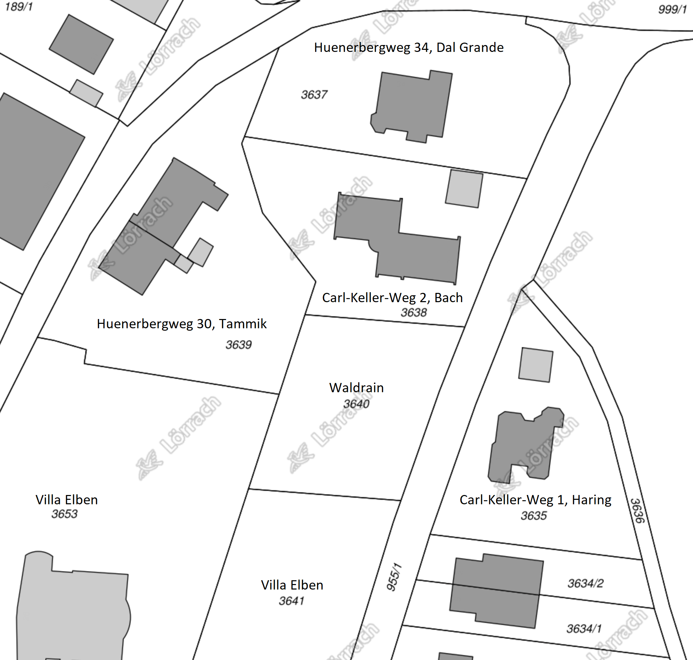 <!-- 2016 -->

Fuer genaue Masse der Kantenlaengen der Grenze koennen wir auf die Umlegungskarte zurueckgreifen:

- [Umlegungskarte](img/lageplan/umlegungskarte_flurstueck_3640.pdf)

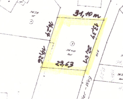 <!-- 250 -->

- Koordinaten im Uhrzeigersinn latitude, longitude, SQD M5 RECS500 WKT GK3 UTM WGS84
 - 47.61240288, 7.66845556, 3399968.350 5275750.187 NW 
 - 47.61238603, 7.66886804, 3399999.438 5275747.726 NO
 - 47.61227361, 7.66880501, 3399994.427 5275735.266 Ost Mitte
 - 47.61208123, 7.66871077, 3399987.019 5275714.050 SO
 - 47.61209766, 7.66831761, 3399957.374 5275716.405 SW
 - 47.61226304, 7.66839227, 3399963.329 5275734.709 West Mitte
 - 47.61225074, 7.66859154 Mittelpunkt
- Kantenlaengen im Uhrzeigersinn in Meter laut Umlegungskarte
 - Nord 31.10
 - Ost 13.34 + 22.51 = 35.85
 - Sued 29.63
 - West 19.26 + 16.24 = 35.50
- Flaeche 1043 quadratmeter

Ueberpruefung der Koordinaten, Kantenlaengen und Grundstuecksflaeche in Python durch
die [geolocation_waldrain](https://github.com/jeremytammik/geolocation_waldrain) 
geolocation calculation for the Waldrain plot of land.

Man kann die Koordinaten auch interaktiv umrechnen, z.B. in
dem [koordinaten-umrechner.de](https://www.koordinaten-umrechner.de/decimal/47.612251,7.668592?karte=OpenStreetMap&zoom=19)
oder in [epsg.io](https://epsg.io/map#srs=32648&x=-4660201.32&y=10737666.24&z=18&layer=streets).

### Bebauungsplan

Es gilt der Bebauungsplan "Suedhang Huenerberg" noerdlich der Wallbrunnstrasse und oestlich bzw. suedlich des Huenerbergweges.

Der Bebauungsplan bestimmt genau, was wo wie gebaut werden darf inkl. genehmigte Ausnahmen von den Regeln:

- [Bebauungsplan Huenerberg Sued (Bild)](img/lageplan/bebauungsplan_huenerberg_sued.png)
- [Bebauungsplan Huenerberg Sued (PDF)](doc/bebauungsplan/bebauungsplan_huenerberg_sued.pdf)
- [Legende](doc/bebauungsplan/bebauungsplan_legende.pdf)
- [Satzung](doc/bebauungsplan/bebauungsplan_satzung.pdf)
- [Begruendung](doc/bebauungsplan/bebauungsplan_begruendung.pdf)
- [Genehmigte Ausnahmen](doc/bebauungsplan/bebauungsplan_ausnahmen.jpg)
- [Landesbauordnung für Baden-Württemberg &ndash; LBO](http://gaa.baden-wuerttemberg.de/servlet/is/16493/1_2_1.pdf)

 <!-- 1550 -->

Die wesentlichen Bestimmungen sind:

- 2 Vollgeschosse
- Nur Einzel- und [Doppelhaeuser](http://www.bernklau.de/infos/baurecht/doppelhaus.htm) zulaessig
- Satteldach mit 15-27 Grad Neigung
- Grundflächenzahl GRZ 0.4
([Mass der baulichen Nutzung](https://de.wikipedia.org/wiki/Ma%C3%9F_der_baulichen_Nutzung), zu
multiplizieren mit der Grundstuecksflaeche von 1043 quadratmeter):
417 qm dürfen bebaut werden, inklusive aller Carports, Müllhäuschen und ähnlichem.
- Geschossflächenzahl GFZ 0.8: 834 qm Wohnfläche dürfen errichtet werden.
- EG Fussbodenhoehe max 0.6 m ueber bergseitige Gelaendehoehe an der Gebaeudekante 
- Traufhoehe (talseitige Gebaeudekante bis Traufe): 6.5 m

Wolfgang Gottschalk hat uns in November 2019 mit
weiteren [Infos zum Bebauungsplan](#infos-zum-bebauungsplan) aufgeklaert.

Laut der [Broschuere Cluster](https://www.netzwerk-generationen.de/fileadmin/user_upload/PDF/Downloads_brosch%C3%BCren-dokumentationen/2019-12-13_Broschuere_Cluster_web.pdf)
der [Netzwerkagentur GenerationenWohnen STATTBau Berlin](https://www.netzwerk-generationen.de), s.o. [Wohnform Cluster-WG](#wohnform-cluster-wg):

> Wohnungen, die über 400 m2 groß sind, müssen erhöhte Brandschutzauflagen erfüllen.
Aus diesem Grund ... werden Cluster-Wohnungen häufig so geplant, dass sie in kleinere Wohnungen unterteilbar sind.

### Geschosse nach LBO

(5) Geschosse sind oberirdische Geschosse, wenn ihre Deckenoberkanten im Mittel mehr als 1,4 m über die
Geländeoberfläche hinausragen; im Übrigen sind sie Kellergeschosse. Hohlräume zwischen der obersten
Decke und der Bedachung, in denen Aufenthaltsräume nicht möglich sind, sind keine Geschosse.

(6) Vollgeschosse sind Geschosse, die mehr als 1,4 m über die im Mittel gemessene Geländeoberfläche
hinausragen und, von Oberkante Fussboden bis Oberkante Fussboden der darüberliegenden Decke oder bis
Oberkante Dachhaut des darüberliegenden Daches gemessen, mindestens 2,3 m hoch sind. Die im Mittel
gemessene Geländeoberfläche ergibt sich aus dem arithmetischen Mittel der Höhenlage der Geländeoberfläche an den Gebäudeecken. Keine Vollgeschosse sind

1. Geschosse, die ausschliesslich der Unterbringung von haustechnischen Anlagen und Feuerungsanlagen dienen,
2. oberste Geschosse, bei denen die Höhe von 2,3 m über weniger als drei Viertel der Grundfläche des darunterliegenden Geschosses vorhanden ist.

Hohlräume zwischen der obersten Decke und dem Dach, deren lichte Höhe geringer ist, als sie für Aufenthaltsräume nach § 34 Abs. 1 erforderlich ist, sowie offene Emporen bis zu einer Grundfläche von 20 m2 bleiben ausser Betracht.

### Dachueberstand

Darf das Dach ueber die Baugrenze herausragen?
Also vor allem an der Ostseite, am Carl-Keller-Weg entlang?

Die [Baugrnze](https://de.wikipedia.org/wiki/%C3%9Cberbaubare_Grundst%C3%BCcksfl%C3%A4che#Baugrenze) ist die im Bebauungsplan festgesetzte beziehungsweise eingezeichnete Linie, welche von Gebäuden oder deren Teilen nicht überbaut werden darf... 
Ein Vortreten von Gebäudeteilen in geringfügigem Ausmass kann zugelassen werden...

Laut Diskussionen
ueber [Dachüberstand außerhalb Baufenster](https://www.hausbau-forum.de/threads/bw-dachueberstand-ausserhalb-baufenster-kenntnisgabeverfahren.32068)
und [muss Dachüberstand ins Baufenster](https://www.bauexpertenforum.de/threads/muss-dachueberstand-ins-baufenster.54475/)
koennte eine Dachueberstand von 50 cm als geringfuegig toleriert werden:

> Egal sind die Dachüberstände nicht, zur überbauten Fläche zählen auch Dachüberstände,
meist bleiben diese bei der Berechnung unberücksichtigt, sofern keine Stützen,
Pfetten darunter sind aus denen sich Visuell ein Baukörper ablesen lässt.

> für Baugrenzen ist die Aussenhülle des Gebäudes maßgebend, wenn besagte Dachüberstände die max. Ausladung einhalten und Abstandsflächen nicht entgegenstehen.

> Nach § 16 Abs. 3 BauNVO wird das Maß der baulichen Nutzung ... die Größe der Grundfläche ... festzusetzen.
Demnach sollte die Außenwand bis auf die Baugrenze möglich sein.
Der Dachüberstand ist außen vor.

> In Niedersachsen z.B. gilt ein Dachüberstand bis 50 cm als unbeachtlich, darüber hinaus ist er mit zu berücksichtigen!

### Bautenbeispiele

Hier stellen wir ein paar Beispiele von existierenden Bauten vor, die
dem [Bebauungsplan 'Suedhang Huenerberg'](#bebauungsplan) unterliegen.
Wir wollen kein solches Bauwerk erstellen.
Sie zeigen, was man sich vorstellen kann unter 'Einzel- oder Doppelhaeus mit zwei Vollgeschosse und Satteldach, Traufhoehe max. 6.5 m':

- [Huenerbergweg 8-10](https://www.google.com/maps/place/Huenerbergweg+8+79539+Loerrach)
- [Holzgasse 31 und 33](https://www.google.com/maps/place/Holzgasse+31+79539+Loerrach)
- [Holdenrain 5, 7, 22 und 24](https://www.google.com/maps/place/Holdenrain+5+79539+Loerrach)

<div jtgallery="2020-11-02_bautenbeispiele,huenerbergweg_8_10,holzgasse_31,holzgasse_31a,holzgasse_33,holdenrain_5_7,holdenrain_5,holdenrain_7,holdenrain_7a,holdenrain_22,holdenrain_24a,holdenrain_24b">
</div>

Diese Bauten entsprechen dem Bebauungsplan Huenerberg Suedhang.

Ausnahmen von den Vorschiriften im Bebauungsplan wurden nur am Holdenrain 5-7 beantragt und genehmigt: Anzahl Vollgeschosse + Dachform.
Wegen dem Flachdach zaehlt in diesem Fall die Attikaetage als Vollgeschoss.

Ich habe mit den Bauherren im Holdenrain 24 gesprochen.
Sie wiesen drauf hin, dass die Baubehoerde in den letzten Jahren eher noch pingeliger geworden ist, und dass man besonders bei der Traufeoehe des Satteldachs auf das Einhalten der vorgeschriebenen Maximalhoehe achten muss.

### Infos zum Bebauungsplan 

Ein paar Infos zum Bauplan von einem befreundeten Architekten, Wolfgang Gottschalk, am 2019-11-08:

Q: Koenntest du mir sagen, wo die genauen Baugrenzen innerhalb dieses Grundstueckes verlaufen?

A: Siehe die dicken Strich-Punktlinien auf dem Bebauungsplan.

Q: Wie viel Wohnflaeche, Kellerflaeche und Volumen duerften wir da hinstellen?

A: Grundfläche des Gebäudes 0.4 x 1040 qm = 416 qm, Geschossflächen 0.8 x 1040qm = 832 qm, offene und geschlossene Bauweise &ndash; d.h. Einzelhaus oder Doppelhaus möglich, max. 2 Wohneinheiten pro Haus.

Q: Gibt es Vorschriften und Beschraenkungen bzgl. Dachausformung, Stockwerkszahl, usw.?

A: Satteldach mit einer Dachneigung von 15-27°, max. 2 Vollgeschosse + Keller + Dachgeschoss.
Allerdings ist der Bebauungsplan jetzt schon fast 40 Jahre alt.
Deshalb wäre eine entsprechende Beratung bei der Stadt für dein Vorhaben sinnvoll.

Man sollte unbedingt eine Bauvoranfrage stellen bevor man den entgueligen Bauantrag stellt.

Man darf also laut dem Bauplan von 1978 nur 4 Wohnungen draufstellen und etwas ueber 800 m2 Wohnfläche schaffen.

### Traufhoehe

Die Traufhöhe ist Bestandteil des kommunalen Baurechts und wurde zeichnerisch ermittelt. Sie ist nicht zwingend mit der Dachrinne gleichzusetzen. Die Höhe zwischen Traufpunkt und dem gewachsenen Gelände wird als Traufhöhe bezeichnet. Die maximale Traufhöhe kann in einem Bebauungsplan festgeschrieben werden. Im Bebauungsplan kann eine maximale Traufhöhe auch abhängig von der Dachneigung festgelegt werden, so kann sie z. B. für eingeschossige Einfamilienhäuser 3,5 m bei 45° Dachneigung und 4,0 m bei 35° Dachneigung betragen. Ausserdem wird auch die Firsthöhe festgelegt. Dies kann zu weiteren Einschränkungen bei der Traufhöhe führen.

Die Bezugspunkte der Traufhöhendefinition beziehen sich in der Regel auf die Oberkante der öffentlichen Strasse und dem Schnittpunkt zwischen aufgehendem Mauerwerk und Aussenwand mit den Dachsparren. Auch hier kann durch den Bebauungsplan exakt festgelegt werden, ob die Unterkante des Dachsparrens oder die Dachhaut massgebend sind. Dachaufbauten lösen keine Traufhöhen im Planungsrecht aus. Die Traufhöhe ist immer an die Decke des letzten möglichen Vollgeschosses und der aufgehenden Aussenwand angebunden.

### Gelaendemodell

Herr Nils Janz <!-- (tel. 415-551, [email](mailto:Nils Janz <N.Janz@loerrach.de>) --> vom Vermessungsamt Loerrach
hat am 2020-04-07 das Grundstueck offiziell vermessen:

- Grenzpunktmarkierungen gesetzt
- Gelaende vermessen, inklusive:
 - Buergersteig und Laternenpfahl am Carl-Keller-Weg
 - Boeschung am Carl-Keller-Weg entlang
 - Boeschung im Nordwesten
 - Mauer im Suedosten (gruen)
 - Die zwei grosse Baeume (gruen)

Die folgenden Daten wurden von der Stadt zur Verfuegung gestellt:

- Bestandsaufnahme als [AutoCAD DWG-Datei](doc/vermessung/bestand_tammik.dwg),
 [AutoCAD R12 DXF](doc/vermessung/bestand_tammik.dxf) und als
 [Ausdruck auf DIN-A3](doc/vermessung/bestand_tammik_a3.pdf):

 <!-- 1374 -->

- Digitales Gelaendemodell als [AutoCAD DWG-Datei](doc/vermessung/digitales_gelaendemodell_tammik.dwg),
 [AutoCAD R12 DXF](doc/vermessung/digitales_gelaendemodell_tammik.dxf) und als
 [Ausdruck auf DIN-A3](doc/vermessung/digitales_gelaaendemodell_tammik_a3.pdf):

 <!-- 1027 -->

Hier kann man das digitale Gelaendemodell in 3D drehen, von verschiedenen Seiten betrachten und Schnitte generieren:

<!--

<iframe src="https://myhub.autodesk360.com/ue29d734b/shares/public/SH919a0QTf3c32634dcf68999f425d6398ff?mode=embed" width="640" height="480" allowfullscreen="true" webkitallowfullscreen="true" mozallowfullscreen="true" frameborder="0"></iframe>

Moved to origin:

<iframe src="https://myhub.autodesk360.com/ue29d734b/shares/public/SH919a0QTf3c32634dcf4d40f2466b49455b?mode=embed" width="640" height="480" allowfullscreen="true" webkitallowfullscreen="true" mozallowfullscreen="true" frameborder="0"></iframe>

<iframe src="https://myhub.autodesk360.com/ue29d734b/shares/public/SH919a0QTf3c32634dcfa7d4ff01ac41abf5?mode=embed" width="640" height="480" allowfullscreen="true" webkitallowfullscreen="true" mozallowfullscreen="true" frameborder="0"></iframe>

-->

<iframe src="https://myhub.autodesk360.com/ue29d734b/shares/public/SH919a0QTf3c32634dcf9b89d291e6201c27?mode=embed" width="640" height="480" allowfullscreen="true" webkitallowfullscreen="true" mozallowfullscreen="true" frameborder="0"></iframe>

In 2D werden die Nachbarhaeuser, Hoehenlinien und -Angaben, Strassen und Grenzpunkte angezeigt.
In 3D kann man das Gelaendemodell rotieren und von allen Seiten und Richtungen aus betrachten.
[Anleitung zum Navigieren, Ansichten schalten, Abstaende messen usw. oben](#3d_viewer_instructions).

Unten das etwas naivere Ergebnis der manuallen Hoehenmessung von Jeremy, das nur die Nordhaelfte des Grundstuecks abdeckt.
Die Messung erfolgt in einem 3 Meter Raster entlang parallelen Linien in 3 Meter Abstand voneinander, parallel zu der Norgrenze, von dem Carl-Keller-Weg runter, von Ost nach West, von Nord nach Sued.

Hoehenversatz in cm:

- Nordgrenze, von NO nach NW, 0 m S &ndash; +0 33 54 61 54 65 51 61 67 83 68 (72)
- Parallel dazu, 3 m weiter S &ndash; +2 57 42 70 57 47 62 61 72 96 80
- 6 m S &ndash; +0 78 45 61 54 64 50 73 90 130 40
- 9 m S &ndash; +0 88 68 52 37 66 61 69 96 111 28 
- 12 m S &ndash; -5 108 56 38 52 80 51 83 144 53 29
- 15 m S &ndash; -3 122 51 20 99 65 73 77 123 34 37
- 18 m S &ndash; -5 130 64 44 74 62 59

Das ergibt folgende Hoehenversatz- und kumulierte Werte berechnet
mit [hoehenversatz.py](https://github.com/jeremytammik/geolocation_waldrain/blob/master/hoehenversatz.py):

```
 0 0.00 0.33 0.54 0.61 0.54 0.65 0.51 0.61 0.67 0.83 0.68
 kum 0.00 -0.33 -0.87 -1.48 -2.02 -2.67 -3.18 -3.79 -4.46 -5.29 -5.97
 3 0.02 0.57 0.42 0.70 0.57 0.47 0.62 0.61 0.72 0.96 0.80
 kum 0.02 -0.55 -0.97 -1.67 -2.24 -2.71 -3.33 -3.94 -4.66 -5.62 -6.42
 6 0.00 0.78 0.45 0.61 0.54 0.64 0.50 0.73 0.90 1.30 0.40
 kum 0.02 -0.76 -1.21 -1.82 -2.36 -3.00 -3.50 -4.23 -5.13 -6.43 -6.83
 9 0.00 0.88 0.68 0.52 0.37 0.66 0.61 0.69 0.96 1.11 0.28
 kum 0.02 -0.86 -1.54 -2.06 -2.43 -3.09 -3.70 -4.39 -5.35 -6.46 -6.74
 12 -0.05 1.08 0.56 0.38 0.52 0.80 0.51 0.83 1.44 0.53 0.29
 kum -0.03 -1.11 -1.67 -2.05 -2.57 -3.37 -3.88 -4.71 -6.15 -6.68 -6.97
 15 -0.03 1.22 0.51 0.20 0.99 0.65 0.73 0.77 1.23 0.34 0.37
 kum -0.06 -1.28 -1.79 -1.99 -2.98 -3.63 -4.36 -5.13 -6.36 -6.70 -7.07
 18 -0.05 1.30 0.64 0.44 0.74 0.62 0.59
 kum -0.11 -1.41 -2.05 -2.49 -3.23 -3.85 -4.44
```

### Baufenster

Das Baufenster innerhalb der Grundstuecksgrenzen ist im Bebauungsplan mit dicken Strichpunkten markiert und erfordert 5 Meter Abstand vom Carl-Keller-Weg (siehe Bemassung) und ca. 6 Meter von der Grenze zur Villa Elben.
<!-- (vgl. im Bebauungsplan mit 5 Abstand von der Strasse und 10 in dem Masstab). -->
In der [folgenden Skizze](img/lageplan/flurstueck_3640_six_corner_points.jpg) sind
ausserdem 3 m Abstand von den Nord- und Suedgrenzen vorgesehen.
Die Abstaende an den Nord- und Suedgrenzen werden laut Landesbauordnung LBO geregelt, minimal 0.4 mal Fassadenhoehe.
Entlang der Nordgrenze entsteht moeglicherweise ein Zufahrtsweg.
Das blaue Rechteck in der Nordwestecke auf dem Grundstueck vom Huenerbergweg 30 stellt Michaels Wohnmobil dar:

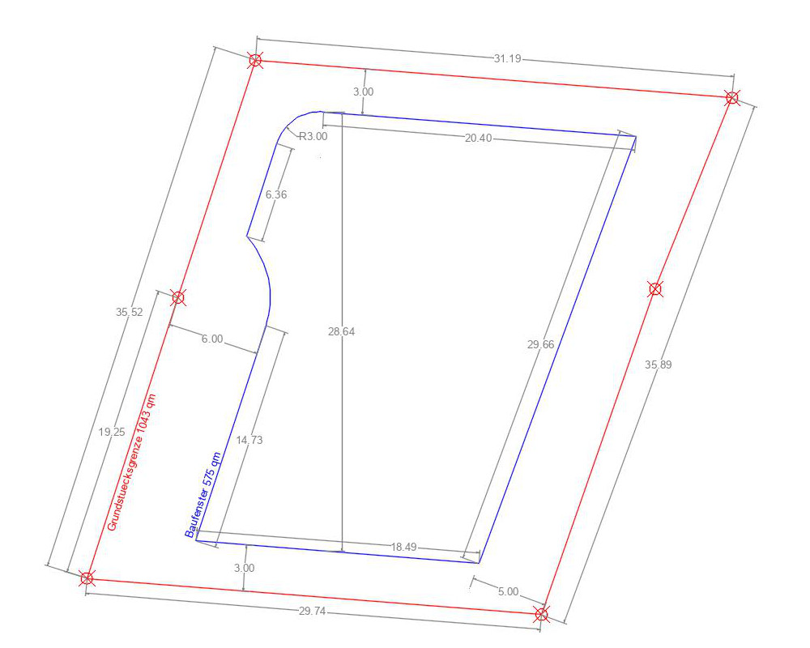 <!-- 1000 -->

### Geomantie

Laut Wikipedia sei [moderne Geomantie](https://de.wikipedia.org/wiki/Geomantie) 'das Erkennen und Erspüren von guten Plätzen in Raum und Landschaft und damit die Grundlage für ein harmonisches und gesundes Wohnen und Leben. Die Aufgabe eines Geomanten bestehe darin, 'baubiologisches Wissen' mit der geomantischen Kunst zu vereinen, Räume zu gestalten, den guten Ort zu erkennen und zu erspüren und mit den Menschen in Einklang zu bringen.'

Susan Galster hat fuer uns eine Bewertung des Grundstueckes vorgenommen:

- [Geomantischer Bericht zum Waldrain von Susan Galster](doc/galster/2020-08-14_susan_galster_geomantie.pdf)

### Baumbestand

Wir haben die Lage von neun wesentlichen Baeumen trianguliert:

<div jtgallery="2020-09-18_tree_triangulation,tree_triangulation_1,tree_triangulation_2">
</div>

<table class="r">
<tr><td>Nr</td><td>Baumart</td><td colspan="3">Messpunktabstand in m</td></tr>
<tr><td colspan="2">Messpunkte</td><td>NO</td><td>OM</td><td>Zaun</td></tr>
<tr><td>1</td><td>Nuss</td><td>5.20</td><td>8.80</td><td>1.90</td></tr>
<tr><td>2</td><td>Eiche</td><td>6.80</td><td>7.40</td><td>2.10</td></tr>
<tr><td colspan="2">Messpunkte</td><td>NO</td><td>NW</td><td>WM</td></tr>
<tr><td>3</td><td>Ahorn</td><td>21.50</td><td>11.50</td><td>19.10</td></tr>
<tr><td>4</td><td>Ahorn</td><td>28.30</td><td>14.30</td><td>11.00</td></tr>
<tr><td>5</td><td>Eiche (gross)</td><td>35.30</td><td>20.00</td><td>10.50</td></tr>
<tr><td>6</td><td>Esche (gross)</td><td>38.80</td><td>21.60</td><td>9.30</td></tr>
<tr><td colspan="2">Messpunkte</td><td>SO</td><td>SW</td><td>Zaun</td></tr>
<tr><td>7</td><td>Ahorn (6 Staemme)</td><td>6.40</td><td>20.70</td><td>1.50</td></tr>
<tr><td>8</td><td>Esche</td><td>3.40</td><td>27.00</td><td>1.80</td></tr>
<tr><td colspan="2">Messpunkte</td><td>SO</td><td>SW</td><td>OM</td></tr>
<tr><td>9</td><td>Ahorn</td><td>13.10</td><td>26.00</td><td>16.70</td></tr>
</table>

### Saegerei

[Wann darf man Baume faellen](https://www.t-online.de/heim-garten/garten/id_71932760/baumfaellung-nicht-immer-erlaubt-wann-darf-man-baeume-faellen-drei-schritte-noetig-.html): 

> Vom 1. März bis 30. September ist das Fällen von Bäumen in der Regel verboten.
Dann schützt das Bundesnaturschutzgesetz nistende Vögel...
Als ungefähre Faustregel gilt laut Bundesverband Garten-, Landschafts- und Sportplatzbau e. V. (BGL) der Schutz tendenziell für Laub- und Nadelbäume mit einem Stammumfang von etwa 60 bis 80 Zentimetern.
Obstbäume seien ausgenommen.
Ausnahmegenehmigungen für das Fällen werden aber zum Beispiel erteilt, wenn das Gehölz krank ist, es abzusterben droht, es nicht mehr verkehrssicher ist oder es Baumassnahmen im Wege steht. 

Hier erstmal eine Uebersicht ueber Holzmasse und Preise:

- [Metrische Raummasse für Holz](https://de.wikipedia.org/wiki/Raummeter)
 - Festmeter (fm) &ndash; Erntefestmeter (Efm), Vorratsfestmeter (Vfm), Schichtfestmeter (Sfm)
 - Raummeter (rm), auch Ster &ndash; Schüttmeter oder Schüttraummeter (srm)
- Preise als Stammholz &ndash; 
Buchenholz kostet auch als sehr hochwertiges Stammholz meist nicht mehr als 85-110 EUR pro Efm.
Bei Eiche beginnen die Preise dort erst und gehen bis zu 350 EUR pro Efm.
Nur sehr minderwertige Qualitäten der Klasse CD liegen bei rund 75-90 Efm.

In Januar 2020 ist eine grosse tote Esche von selbst umgefallen, weil die Wurzel verfault war.
In Februar 2020 haben wir einige weitere Baeume gefaellt, um Platz zu schaffen fuer den Zufahrtsweg: ein paar Eschen und eine grosse Eiche.
Manche Staemme koennen wir so nutzen, z.B. fuer eine Ueberdachung vom Sitzplatz.
In September 2020 ist unser groesstes Stueck, der Eichenstamm:

- Eichenstamm ca. d = 0.4, l = 6, cross section a = 0.628, volume v = 6 * a = 3.768, value ca. eur 450

Im Winter 2020-2021 werden wir wahrscheinlich weitere Baeume faellen, um Platz fuer den Hausbau zu schaffen.

Telefonat am 2020-09-30 mit [Ruben Hugenschmidt](http://www.schreinerei-hugenschmidt.de) ueber
die eventuelle Saegerei der vorhandenen und zukuenftigen Staemme.

Axel kam vorbei und meint, die Eschenstaemme seien zu mickrig, um von Interesse zu sein.
Der Eichenstamm ist OK.
Man koennte das von Peter (?) in Binzen holen und saegen lassen.

[Mobiles Saegewerk MN26](https://www.norwoodsawmills.com/de_de/das-mobile-sagewerk-lumberman-mn26) ab ca. 4000 euro.
Kann man sowas auch mieten?
Anscheinend eher Lohnschnitt beauftragen.

<!--

### Bausekretariat

- stadtplanung
- 2 we, oder dh mit je 2 we
- architektenhonorar 2/3 vor bauanfang
- wer ist zustaendig
- bauberatung
- BauinseL, Telefon: 0 76 21 4 15-322, E-Mail: baurecht@loerrach.de
- Zimmer 14.11, Stadt Lörrach, Rathaus, Luisenstrasse 16, 79539 Lörrach
- Chantal Koenig oeffnungszeiten mo 8-11, di + fr 8-12, do 14:30-17:30, mi + do vormittag geschlossen
- Baurecht 14 stock Chantal Koenig 1412 Herr Proisl 141 Frau Bingemer 1417
- Vermessung 9 stock Alice Schulze Gelaendeprofil eur 200 + mwst = 238

### Detailed Site Plan

- [Google Maps to Revit at scale](https://youtu.be/VVGA_FAwpMQ) &ndash; Importing a Google Maps image and scaling that image in Revit to use as a background for programming and spatial planning.
- [Google Earth to Revit - Topography with textures](https://youtu.be/qR6WOhY4LLM)
- Delzer: Schon bei der Bauvoranfrage koennen auch energetische Fragen auftauchen; es kann schon recht konkret werden, z.b. bzgl. Laermemissionen einer bestimmten Pumpe oder so.

### Vermessung

- Hoehenmessung an der Nordkante entlang von der Strasse aus runter:
- Messung auf der Gesamtlaenge von 31.1 meter:
- Messung in 4 Abschnitten von 4 meter:
- Vermessung der Nordkante von NW nach NO in 3 Meter Abstaenden;
 danach jeweils 3 Meter nach Sueden parallel versetzt;
 Hoehenversatz in cm:
 - NO &rarr; NW + 0 m S &ndash; +0 33 54 61 54 65 51 61 67 83 68 (72)
 - NO &rarr; NW + 3 m S &ndash; +2 57 42 70 57 47 62 61 72 96 80
 - NO &rarr; NW + 6 m S &ndash; +0 78 45 61 54 64 50 73 90 130 40
 - NO &rarr; NW + 9 m S &ndash; +0 88 68 52 37 66 61 69 96 111 28 
 - NO &rarr; NW + 12 m S &ndash; -5 108 56 38 52 80 51 83 144 53 29
 - NO &rarr; NW + 15 m S &ndash; -3 122 51 20 99 65 73 77 123 34 37
 - NO &rarr; NW + 18 m S &ndash; -5 130 64 44 74 62 59

Hoehenversatz und kumulierte Werte im 3-Meterraster berechnet
mit [hoehenversatz.py](https://github.com/jeremytammik/geolocation_waldrain/blob/master/hoehenversatz.py):

```
 0 0.00 0.33 0.54 0.61 0.54 0.65 0.51 0.61 0.67 0.83 0.68
 kum 0.00 -0.33 -0.87 -1.48 -2.02 -2.67 -3.18 -3.79 -4.46 -5.29 -5.97
 3 0.02 0.57 0.42 0.70 0.57 0.47 0.62 0.61 0.72 0.96 0.80
 kum 0.02 -0.55 -0.97 -1.67 -2.24 -2.71 -3.33 -3.94 -4.66 -5.62 -6.42
 6 0.00 0.78 0.45 0.61 0.54 0.64 0.50 0.73 0.90 1.30 0.40
 kum 0.02 -0.76 -1.21 -1.82 -2.36 -3.00 -3.50 -4.23 -5.13 -6.43 -6.83
 9 0.00 0.88 0.68 0.52 0.37 0.66 0.61 0.69 0.96 1.11 0.28
 kum 0.02 -0.86 -1.54 -2.06 -2.43 -3.09 -3.70 -4.39 -5.35 -6.46 -6.74
 12 -0.05 1.08 0.56 0.38 0.52 0.80 0.51 0.83 1.44 0.53 0.29
 kum -0.03 -1.11 -1.67 -2.05 -2.57 -3.37 -3.88 -4.71 -6.15 -6.68 -6.97
 15 -0.03 1.22 0.51 0.20 0.99 0.65 0.73 0.77 1.23 0.34 0.37
 kum -0.06 -1.28 -1.79 -1.99 -2.98 -3.63 -4.36 -5.13 -6.36 -6.70 -7.07
 18 -0.05 1.30 0.64 0.44 0.74 0.62 0.59
 kum -0.11 -1.41 -2.05 -2.49 -3.23 -3.85 -4.44
```

### Geländemodell

- Digital Elevation Model DEM
- digital terrain model dtm
- https://www.opendem.info
- https://www.bkg.bund.de/DE/Home/home.html
- Digitale Geländemodelle (DGM)
- Digitale Landschaftsmodelle (DLM)
- German Combined Quasigeoidmodell (GCG) beschreibt die Höhenbezugsfläche der Landesvermessung
- https://gis.stackexchange.com/questions/179104/free-digital-elevation-terrain-model-of-europe-or-germany
- /j/tmp/GMTED2010_Spatial_Metadata.zip
- https://gis.stackexchange.com/questions/1763/seeking-free-elevation-data-for-europe
- how to read NASA .hgt binary files
- https://stackoverflow.com/questions/357415/how-to-read-nasa-hgt-binary-files#17095113
- https://www.google.ch/maps/dir/Carl-Keller-Weg,+79539+Loerrach/47.6121959,7.6686263/@47.6118758,7.668122,19z/data=!4m8!4m7!1m5!1m1!1s0x4791b0ec8f16a0ad:0x3bbe0f73006ed0bf!2m2!1d7.6686692!2d47.6118764!1m0
- 10 more meters north and east:
- https://www.google.ch/maps/dir/Carl-Keller-Weg,+79539+Loerrach/47.6122209,7.6688301/@47.6118758,7.668122,19z/data=!4m9!4m8!1m5!1m1!1s0x4791b0ec8f16a0ad:0x3bbe0f73006ed0bf!2m2!1d7.6686692!2d47.6118764!1m0!3e2
- SW 47.612176 7.668408
- SE 47.612150 7.668693
- NE 47.612386 7.668797 
- NW 47.612407 7.668512
- /j/src/python/dtm/srtm-python/jt_srtm_benner.py
- Returns all four elevations as 203 metres
- This output is wrong, because no point in Loerrach is as low as 203 metres:
- Geografische Daten der Stadtgemarkung Lörrachs:
- Tiefster Punkt: 268,5 Meter ü. NN (der Fluss Wiese an der Landesgrenze zur Schweiz)
- Höchster Punkt: 558,1 Meter ü. NN (Hochstand im Röttler Wald)
- https://stackoverflow.com/questions/357415/how-to-read-nasa-hgt-binary-files
- /j/src/python/dtm/test $ python jt_test_benner.py
- [['SW', 47.612176, 7.668408], ['SE', 47.61215, 7.668693], ['NE', 47.612386, 7.668797], ['NW', 47.612407, 7.668512]]
- SW 333
- SE 338
- NE 337
- NW 333
- /j/src/python/dtm/python-hgt $ python jt_hgt_benner.py
- /j/src/python/dtm/dtm_europe/N47E007.hgt
- 3601 rows
- 3601 min 192 m max 979 m
- 3601 min 429 m max 1307 m
- [['SW', 47.612176, 7.668408], ['SE', 47.61215, 7.668693], ['NE', 47.612386, 7.668797], ['NW', 47.612407, 7.668512]]
- SW 333
- SE 338
- NE 337
- NW 333
- https://get-direction.com/altitude.html
- carl-keller-weg loerrach
- Latitude: 47.611956
- Longitude: 7.668666
- Elevation: 322.00 meters
- Huenerberg 403 m
- https://www.freemaptools.com/elevation-finder.htm
- 334 meter low end, 351 high end
- https://www.whatismyelevation.com/
- says i am at 364 m in my attic office
- EPSG:4326 &ndash; WGS 84 -- WGS84 - World Geodetic System 1984, used in GPS; bounds: from -180.0, -90.0 to +180.0, +90.0
- EPSG:3857 &ndash; WGS 84 / Pseudo-Mercator -- Spherical Mercator, Google Maps, OpenStreetMap, Bing, ArcGIS, ESRI; bounds: from -180.0, -85.06 to +180.0 +85.06

--->

## Haus

[Aktueller Architekturentwurf](#architekturentwurf-2020-05-12)

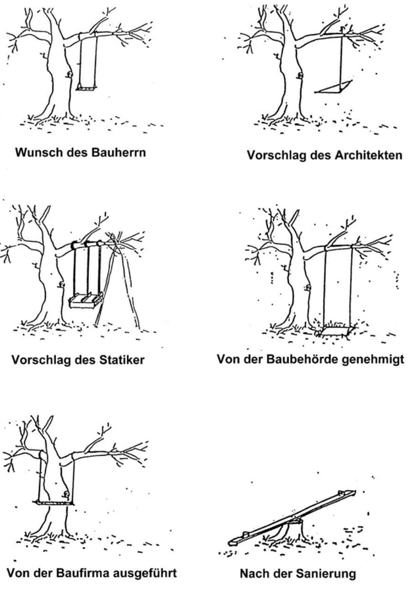

### Mehrgenerationenhaus

Joerg sagt: Mehrgenerationenhäuser erhalten höheren Bundeszuschuss.

Die im Bundesprogramm Mehrgenerationenhaus geförderten Häuser haben bis einschliesslich 2019 jeweils bis zu 40.000 Euro pro Jahr erhalten, davon 30.000 Euro vom Bundesministerium für Familie, Senioren, Frauen und Jugend und 10.000 Euro von der jeweiligen Kommune, dem Landkreis und/oder (anteilig) vom Land. Durch diese verbindlich vorgegebene Kofinanzierung wird die Einbettung des Mehrgenerationenhauses in die Kommune gefördert und die Rolle der Häuser als kommunale Akteure gestärkt. Im Jahr 2020 erhalten alle Mehrgenerationenhäuser einen um 10.000 Euro erhöhten Bundeszuschuss, sodass ihnen zusammen mit der Kofinanzierung insgesamt bis zu 50.000 € zur Verfügung stehen.

Das Bundesprogramm Mehrgenerationenhaus wie auch das ab 2021 geplante Anschlussprogramm sind als Fachprogramm ins gesamtdeutsche Fördersystem aufgenommen worden. Das Bundesministerium für Familie, Senioren, Frauen und Jugend plant die Fortsetzung der Förderung der Mehrgenerationenhäuser im bisherigen Umfang auch für das Anschlussprogramm ab 2021. Die Kofinanzierung seitens der Kommunen, Landkreise und/oder Länder wird weiterhin Voraussetzung für den Bundeszuschuss bleiben.

Informationen über die näheren Planungen für das Anschlussprogramm ab 2021, das für 2020 vorgesehene Antragsverfahren sowie die Förderrichtlinie finden Sie zu gegebener Zeit auf der [Website des Bundesprogramms Mehrgenerationenhaus www.mehrgenerationenhaeuser.de](https://www.mehrgenerationenhaeuser.de).

### Bauideen

- [Chalet Schauer](https://www.baufritz.com/ch/architektur-und-haeuser/einfamilienhaeuser/chalet/chalet-schauer) von [Baufritz](https://www.baufritz.com)
 &ndash; Marianne sagt dazu: Lueg mol, das find ich ganz ansprechend.
 Natürlich nicht 1:1 übernehmen, aber die geschützten Aussenflächen und die Glasfassade sind toll.
- [Haus im Gewaechshaus](https://returntonow.net/2019/03/04/swedish-couple-builds-greenhouse-around-home-to-stay-warm-and-grow-food-all-year-long)
- [Ihre Visionen 2050](https://www.nzz.ch/themen-dossiers/zukunft-bauen/ihre-visionen-2050-ld.1491999) &ndash; Fünf Vorreiter der Digitalisierung in der Schweizer Bauwirtschaft sagen voraus, wie sie die Zukunft aus der Perspektive ihrer aktuellen Führungsposition sehen. Denn: «Nichts ist so beständig wie der Wandel.»
- dachausbauten oder dachfenster, um in alle raeume sonnenlicht reinzulassen
- bett unter dem dachfenster wie in dem Terrassenzimmer im waldhaus luetzelflueh
- breiter gang statt gemeinschaftraeume
- jacuzzi beheizt auf dem dach
- rueckzugsmoeglichkeit mit ein paar kumpel, ohne das andere bewohner dazustossen koennen oder man sich wehren muss
- gewaerchshaus an der suedseite (rene beheizt seinen im fruehling sogar)
- wintergarten (rene beheizt seinen im fruehling sogar)
- michael's architectural hints
 - [antivilla brandelhuber](http://www.brandlhuber.com/0131-antivilla-krampnitz)
 - [beton vorarlberg buerogebaeude ohne heizung](http://www.detail.de/architektur/themen/haus-ohne-heizung-buerogebaeude-von-baumschlager-eberle-in-lustenau-022701.html)
 - minenergie ist nicht unbedingt gut, eher sache der daemmstofflobby
 - nimm lieber einen massiven baustoff, z.b. ziegel, holz, stroh, sogar beton, z.b. 50 cm waermedaemmbeton
- [Haus ohne Heizung!](#heizung)
- umlaufende balkons rundum und grossen dachueberstand, damit fenster leicht zu putzen von aussen und auch um sonneneinstrahlung zu reduzieren im sommer.
- grosser keller mit fenster nach vorne und grosse offene werkstatt fuer gemeinschaftsraeume und ateliers und werkstaette
- stellplaetze und anschluesse vorsehen fuer bauwagen, baumhaus, evtl. tiny houses
- alle oberflaechen wo nicht glas oder tuer: begehbar, begruent oder solarpanel


### Baumaterialien

Wir wollen ein Vollholzhaus, eventuell mit Lehmwaende im Innenbereich.

Interessant scheint z.B. [das Vollholzsystem NUR-HOLZ der Firma Rombach](https://www.rombach-nurholz.de),
erwaehnt von Andreas fuer seine Villa Larix, siehe [Tiny House](#tiny-house).

- Naturmaterialien, vorbildlich demonstriert
 im [neun-Minuten video](https://youtu.be/YTVwd3RFobI)
 von [Haus Eins](https://www.hauseins.ch) 
- [Lehmputz](#lehmputz)
- Holzstaenderbau, [Holzfaserplatten](#holzfaserplatten), holzschalung oder lehmputz aussen, lehmputz innen, viel glas
- [Practice Architecture Flat House](https://practicearchitecture.co.uk/project/flat-house) Holzstaenderbau mit Hanfplatten und Null CO2-Emmission
 ([Deutscher Artikel](https://designforyou.top/hanf-wird-innen-und-aussen-im-flat-house-von-cambridgeshire-verwendet))
- Wenn zusaetzlich zum Vollholz eine Daemmung ueberhaupt notwendig sein sollte, dann gerne
mit [Naturdaemmstoffe](doc/material/mythen_naturdaemmstoffe.pdf)

### Holzhaus, Burkart und Thoma

Einstieg:

- [Building with Wood](https://youtu.be/iLW2A75JSS0), ein Vortrag von Florian Thoma, Dipl. Ing., St. Johann, Pongau, Österreich, gehalten am 24. Internationalen "Wissenschaftlichen Ausblick" Welt-Kongress von The World Foundation for Natural Science in Ulm.
 
Der Vortrag zeigt Möglichkeiten, die sich uns beim Bauen auftun, wenn wir die Geschenke der Natur nutzen und auf Chemie verzichten.
Häuser in echter Holzbauweise verbrauchen keine Energie und sind am gesündesten für uns und die Umwelt.
Wir können mit Freude vorausblicken, denn es gibt keine Zukunft, sondern nur das Potenzial der Gegenwart.
Der 1 stündlicher Vortrag hat mich sehr beeindruckt.
 
Die Firma Thoma wurde 1990 gegründet, weil Erwin Thoma, der Förster, für seine Kinder das gesündeste Haus bauen wollte.
Heute ist das Unternehmen als umweltfreundlicher Industriebetrieb weltweit ausgezeichnet.
Die Firma ist evtl. auch für unsere Weiterentwicklung eine gute Adresse, um weitere Ideen zu sammeln.
Die World Foundation for Natural Science ist auch sehr interessant:
 
- [Thoma Holzbau](https://www.thoma.at/unternehmen), [Holz100 Hundert](http://www.thoma.at)
&ndash; [Interview von Erwin Thoma mit KenFM](https://youtu.be/A0MQ0_d-vSg) (1:35)
&ndash; Klimamaessig besonders interessant ab Minute 42
- [The World Foundation for Natural Science](https://www.naturalscience.org/de)
- [Burkart Haus](https://www.burkart-haus.de)
- [Sohm Holzbau](http://www.sohm-holzbau.at) &ndash; Massivholzbauten jeglicher Art und Grösse, Generalunternehmer, gesamte Koordinierung und Verantwortung, Schlüsselfertig, gerne auch Entwurfsplanung, s'home Variantenhäuser

### Holzstaenderbauweise

- in der fabrikhalle vorgefertigte fertigelemente
- damit ist auch eine komplexe gebaeudeform realisierbar
- alle rohre und technik kann schon eingebaut werden
- ales wird in der fabrik vorgefertigt
- das ist auch eine oekolgischere bauweise, effektiver in der fabrik
- kein grosser kran notwendig

### Neue Holzbautechnik auf der Swissbau 2020

- [Krinner Schraubfundamente](https://www.schraubfundamente.de)
 - Betonlos sofort belastbar
 - Haus hinstellen ohne Betonfundament
 - Schrauben in allen Groessen
 - Je nach Groesse mit einer Montagemaschine oder mit einem Bagger
- [Wilma Holz Beton Verbundsystem](https://www.wilma.swiss)
 - Tragegeruest aus Vollholz, vorgefertigte Betonbodenplatten draufschrauben, minimal ausgiessen
 - Minimaler Bauaufwand, optimale Schalltrittdaemmung
- [Bio-XLam Massive Leimfreie Holzwand](https://lignaconstruct.com/traumhaus-suedtirol/services-view/bio-xlam)
von [ligna construct](https://lignaconstruct.com)
 - Holzverbundwaende in allen Dicken je nach Statik
 - mit Holzwolle, Massiv, ...
 - Fertige Paneelen geliefert mit Kabelkanaele frei vorgefertigt fuer freie Infrastrukturverlegung innenseitig
 - Schweizer Holz
- [eggo Holzkastenelemente](http://www.eggholz.ch/produkte/eggo-kastenelement-ek) 
von [Egg Holz Kaelin AG](http://www.eggholz.ch)
 - Selbsttragende befuellbare Fussboden-, Decken- und Dachpaneele aus Holz
 - Befuellung nach Bedarf: thermische Isolation, Schalldaemmung, Trittschall, Raumschall, Leitungen verlegen
- [Lignatur AG Holz Decken- und Dachelemente](https://www.lignatur.ch)
 - Waermedaemmung, Schall- und Trittschalldaemmung
 - Tragen ueber grosse Spannweiten
 - Feuerfest
- [Braun AG](https://www.braun.ch/) Gossau CH
 - Grosshandel für Holzwerkstoffe 

### Kueche

Rene und Pia haben ihre Kueche bestellt bei [möbelum](https://www.moebelum.de), Wiesentalstrasse, Freiburg.
Die Möbel sind ein deutsches Fabrikat und aus Massivholz.
Obere Küche aus Fichte, untere Buche.
Wir haben keine Fronten bestellt, weil wir sie selbst aus eingefärbtem MDF machen wollen.
Wir haben uns für farbige Küchenfronten entschieden. Die gibts als MDF schon eingefärbt.
Ich hab mich an die angebotenen Masse gehalten laut Euro-Norm, also 30, 40, 50 usw.
Das hat soweit immer gut geklappt.

### Bad

- in der wand eingebaut geheizte kupferrohre als heizung und handtuchhalter
- billiger und besser als ein badheizkoerper
- rene hat im bad einen handtuchtrocknerheizkoerper mit danfoss thermostat im vorlauf gefolgt von fussbodenheizung in ruecklauf in 16 mm dreischicht metallverbundrohr. diese rohre kann man auch in der wand benutze<li><a href="https://www.badshop-web.de">selfio](https://www.selfio.de) und [Sanitär- und Heizungsshop</a></li>.
 
### Dusche

Beispiele von mikroskopischen WCs mit Dusche:

- Magnus WC + Dusche fuer Andrea im Huenerbergweg 30
- Nik Muellers WC mit nachtraeglisher Duscvhe in Basel
- Barbaras WC mit eingebauter Dusche in Verscio
- WC mit Dusche ist typisch in Schweden
- [Showerloop](https://showerloop.org) real-time shower water filtration, purification, recycling and heat recovery system.
 Reduction of 90% in water usage and 70-90% in energy for a 10 minute shower with a flow rate of 10 l/min.
 Use just one bucket of water for a shower of any length.

### Keller

- lehmboden lassen, abfallend?
- kellerdecke ebenerdig mit strasse
- betonfuesse, rostfreie stahltraeger, holzbalkenstaender mit dreiecksaussteifung
- isolation seitlich
- erdboden im sommer heizen und als waermespeicher nutzen
- Der Kellerboden im Haus von Stefan Best ist nicht betoniert abgeschlossen nach unten, sondern mit losen Ziegeln auf Lehm und einem Kiesbett gepflastert.
- Das Fundament von [Haus Eins](https://www.hauseins.ch) bildet ein Steinkeller, welcher aus dem Aushubmaterial des eigenen Grund und Bodens stammt, aehnlich wie im Haus von Stefan best.
- Das Haus auf Stelzen stellen, entweder Stahl oder sogar Holz? Die Kellerwaende aus Naturstein, Ziegel, oder andere Materialien? Wenn wir den Boden sowieso offen lassen wollen, warum nicht die Waende auch?

### Dachwohnungen

- photos schweizer dachwohnungen: luflu, daniel b, thomas m, joerg r

### Abwasser

Michael und Jeremy graben und legen einen provisorischen Abwasseranschluss fuer [Barbaras Tiny House](#tiny-house).

Der wird ziemlich sicher nicht offiziell abnahmefaehig sein fuer die offizielle Gebaeudeentwaesserung.

Es waere zwar moeglich, ueber den Huenerbergweg 30 zu entwaessern.
Es ist aber weiter und administrativ aufwendiger, als ueber den Carl-Keller-Weg.

Ich wuerde vorschlagen, die offizielle Gebaeudeentwaesserung ueber den Carl-Keller-Weg vorzusehen.

Damit wir nicht mit Pumpen und Technik arbeiten muessen, wuerde ich vorschlagen, die maximale Tiefe des gesamten offiziellen Abwassersystems des Gebaeudes direkt unter der Unterkante Fussboden vom Erdgeschoss (gleich Kellerdecke) vorzusehen und das gesamte Zu- und Abwassersystem oberhalb dieser Grenze zu beschraenken.

Tiefere Wassereinrichtungen und Rohrsysteme im Keller, wenn noetig, koennten vielleicht beschraenkt werden auf Regenwasser und die provisorische Entwaesserung ueber den Huenerbergweg 30.

## Architektur

### Praemissen

- [Bebauungsplan](#bebauungsplan) einhalten: 2 Vollgeschosse, Einzel- oder Doppelhaus, Satteldach, GRZ 0.4, GFZ 0.8, Traufhoehe 6.5 m
- [Verzicht auf fossile Brennstoffe](#verzicht-auf-fossile-brennstoffe)
- Gemeinschaftsbereich als ein zentraler Treffpunkt vorsehen
- Fussabdruck des Gebaeudes minimieren; z.B. 200 qm Fussabdruck fuer 500 qm Wohnflaeche
- Ebenerdiger Zugang ins Gebaeude maximieren; z.B. Eingang ins EG an der Bergseite, UG uebergangslos mit Garten verbunden, viele ebenerdige Wohnungzugaenge
- Ganzjaehrig oder 11 Monate im Jahr nutzbare unbeheizte Halbaussenraeume vorsehen, z.B. Wintergarten
- Grosszuegige Aussenbereiche vorsehen, direkt mit dem Haus verbunden, z.B. Aussenkochstelle und Aussendusche, gerne mit beheiztem Regenwasser
- Oekologie, Nachhaltigkeit, Gartenggestaltung, Regenwassernutzung, Abwasserstrategie, Photovoltaik, Warmwasser, Heizung und Kybernetik bei der Bauvoranfrage mit beruecksichtigen; Gartenbeete? Gewaechshaus? [Integrale Raumplanung](#integrale-raumplanung)
- Eine geschlossene Gebaeudehuelle und ein Dach, aus energietechnischen Gruenden
- Wohnungen flexibel gestalten wegen garantiertem Wandel der Belegschaft und der Wuensche im Laufe der Zeit
- Einfache, modulare, systematische Bauweise
- Werkstatt im Keller, von Aussen erreichbar, mit Tageslicht, verbunden mit der Aussensteinklopfstelle
- Gemeinschaftskueche grosszuegig gestalten, auch nutzbar zum Leben, Essen, Spielen, Plaudern, Wohnen, Tanzen, Yoga, Filme schauen, mit Erweiterung nach aussen, wenn man mehr Platz braucht
- Treppen minimieren, und daher im oeffentlichen Bereich vorsehen, z.T. auch (halb?) draussen, z.B. zwischen Balkons oder Laubengaenge; im Innenraum eine zentrale Treppe
- Persoenliche Wuensche beruecksichtigen aus [Architekturworkshop](#architekturworkshop), [Vorentwurfsfeedback](#vorentwurfsfeedback)
    - Anja: 60 qm, eigene Kueche, eigenes Bad, Suedfront, ebenerdiger Gartenausgang auf die Terrasse
    - Araceli: als Gemeinschaftsbereich nur einen Mehrzweckraum, geringe Kosten, attraktive Grünfläche, umbaute Fläche verringern, Fussabdruck unter 250qm, Priorität hat Attraktivität der Innenräume
    - Barbara: 50 qm, 700 eur, Balkon ohne Durchgangsverkehr, Vorderfront und Aussicht Richtung Westen, oben, unter dem Dach, weg vom Gemeinschaftsraum
    - Doris: Naehe zum Gemeinschaftsraum, 1200 eur, Mediraum, mehr teilen, weniger Eigentum, Raum fuer mich, Schlafraum, gemeinsamer Raum mit den Kindern, Tuer kann offen sein oder zu, fliessend, gemeinsamer Keller, Waschraum und Lagerraum
    - Jeremy: 30 qm, 400 eur, DG, Balkon, hoch oben, moeglichst hohe Raeume, Gemeinschaftsbad, Gemeinschaftskueche, nicht unbedingt dirket an den Gemeinschaftsbereich angeschlossen, gerne etwas Abstand  
    - Michael: Aussicht, naturnah, kein Dach, keine Schranken, 500-600 eur, Aussenkochstelle mit nahen Zugang zur Gemeinschaftsküche, WoMo-Platz gleich nach der Einfahrt im oberen Teil, ein horizontales Podest, mit dem Hinterteil bei den zwei Bäumen bei der Einfahrt
    - Nathalie: naeher zum Gemeinschaftsraum, Gemüsegarten, kleine Terrassen a 10-15 m2, die sich in den Hang einbinden, insgesamt 40-60 m2, Standorte für Beeren und kleine Obstbäume

<!-- Wunschmieten: Michael 500-600, Barbara 700, Araceli + Joerg 1000, Doris 1200, Jeremy 500; -->

### Hausform

Wir haben beim Treffen am 14.2 besprochen, dass wir von einem Rechteck mit Grundflaeche 200 qm ausgehen.

Dazu noch ein paar Gedanken ueber <span class="b">Rechteck oder L-Form</span>.

Da wir mehrere getrennte Privatbereiche unterbringen und die Verkehrswege (Gaenge im Haus) minimieren wollen, folgt daraus, dass der Hauseingang in der Mitte des Hauses sein sollte, und daran anschliessend auch Flur, Treppenhaus und Gemeinschaftsbereich.

Also sollte der Gemeinschaftsbereich in der Mitte liegen, und Privatbereiche im Norden und Sueden.

In dem Fall haben die Privatbereiche im Norden etwas weniger Sonne und Aussicht als die im Sueden.

Um dem Nordfluegel mehr Sonne und Aussicht zu bescheren, koennte man einen Knick einfuegen, diese Privatbereiche in einen Westfluegel, und den Gemeinschaftsbereich in die Nordostecke verschieben.

Damit waeren wir wieder bei der L-Form.

Wenn wir in der Nordostecke eine L-Form bauen, darf das OG nicht auch um die Ecke ragen, weil damit die maximale Traufhoehe von 6.5 Meter ueberschritten wuerde.

Wenn wir in der L-Form zwei Stockwerke auch im Westfluegel unterbringen wollen, muessen daher die zwei Stockwerke in dem Gebaeudeteil eine Etage nach unten ruecken.

Also gibt es im Westfluegel entweder nur ein EG, oder ein EG + UG.

Was haelt ihr von diesen Gedankengang?

Durch eine L-Form wird auch die Unterkellerung besser ausgenutzt.

Ausserdem entsteht dadurch eine geschuetzte Nische in der Ecke mit Sued- und Westexposition, die in den kuehleren Jahreszeiten die Gartennutzung sehr gut unterstuetzen und erweitern kann.

Wenn wir einen Westfluegel mit EG oder EG + UG erstellen, koennte man auf dem Dach der West-EG eine sehr attraktive Terrasse vorsehen.

### Entwuerfe

Vorentwuerfe von AHA:

- [Vorentwurfspraesentation am 19.10](#vorentwurfspraesentation) 
 - [PDF](doc/aha/2020-10-19_waldrain_praesentation.pdf) (46 MB)
 - 3D-Modelle: [Haus](https://a360.co/34TA9Ct) ([3dm](doc/aha/2020-11-03_3d_haus.3dm))
 &ndash; [Hof](https://a360.co/2TPs0J4) ([3dm](doc/aha/2020-11-03_3d_hof.3dm))
 &ndash; [Dorf](https://a360.co/2TOVtmn) ([3dm](doc/aha/2020-11-03_3d_dorf.3dm))
- [Praesentation 2 am 16.12](#aha-praesentation-2-2020-12-16)
 - [PDF](doc/aha/2020-12-16_aha_praesentation2_lph2.pdf) (14 MB)
 - [Protokoll 2](doc/aha/2020-12-22_aha_protokoll_2.pdf)
 - 3D-Modelle: [Hof 2.0](https://a360.co/2WVopuo) ([3dm](doc/aha/2020-12-29_3d_hof.3dm))
 &ndash; [Haus](https://a360.co/3aXp3QB) ([3dm](doc/aha/2020-12-29_3d_haus.3dm))
 &ndash; [Dorf](https://a360.co/38Mb4dl) ([3dm](doc/aha/2020-12-29_3d_dorf.3dm))
 - Hof 2.0:
     - [Flaechenanalyse](https://a360.co/2YbknPt) ([PDF](doc/aha/2021-01-25_03_hof_area.pdf)),
     <!-- A360 https://myhub.autodesk360.com/ue29c31db/g/projects/2016061734997101/data/dXJuOmFkc2sud2lwcHJvZDpmcy5mb2xkZXI6Y28uSlhiVVkxZzhSTnlHRFlfYjVwVTd4UQ -->
     - [Grobe Bemassung per Hand](doc/aha/2021-02-10_eg_dimensions.png) (3.3 + 28 + 3.3 = 34.6, es fehlt ein Meter in der Nord-Sued-Achse; in der Flaechenanalyse stellten wir die Hauslaenge mit 29.1 fest, nicht 28)
     - [Traufhoehe Nordfassade](doc/aha/2020-12-29_3d_hof_traufhoehe.png), 
     - [Aussicht UG Suedost-Ecke](photo/2021-01-25_hof_ecke_so/aha_entwurf_hof_ecke_suedost_1_meter_tief.jpg):

<div jtgallery="2021-01-25_hof_ecke_so,aha_entwurf_hof_ecke_suedost_1_meter_tief"></div>

Hier sind ein paar eigene Entwuerfe:

- [Fruehes Vorentwurfsmodell von Mai 2020](#architekturentwurf-2020-05-12) <!-- [3D-Modell](https://a360.co/2Z0SdrK) 2020-05-13_01_all_floors_defined.rvt -->
- [Architekturvorschlag Moni](#architekturvorschlag-moni)
- [Varianten vom Moni-Modell](#moni-model)
- [Vereinfachte Rechtecksform mit 176 qm Grundflaeche vom Brainstorming 17.2](#waldrainbrainstorming-2021-02-17)

<a name="3d_viewer_instructions"></a>

Anleitung: 

Verschiedene Ansichten sind verfuegbar, z.B.:

- 3D-Modell
- 2D Seitenansichten: Nord, Ost, Sued, West
- 2D Planansichten: UG, EG, OG, DG und Site (Bauplatz).
- Raumplan (der ausgedruckte Bauplan, 'Sheet' genannt)

Zoom und Pan ist in allen Ansichten moeglich: Zoomen mit der Scrolltaste der Maus, Pan mit dem Zeiger.

In 3D kann man das Modell rotieren, von allen Seiten und Richtungen aus betrachten, Schnitte definieren, Abstaende messen, und mehr.

<u>Full Screen</u> klicken, um weitere Werkzeugicons anzuzeigen.

In 3D gibt es z.B. die Werkzeuge <u>Orbit</u> und <u>Section Analysis</u>, um das Modell zu drehen und Schnitte zu definieren.
Mit dem Werkzeug <u>Measure</u> koennen centimetergenau Abstaende gemessen werden.

Zum Wechseln der Ansicht auf den Wuerfel (Kubus) oben links klicken.

<!--

Anleitung fuer den 3D-Viewer: der Knopf (Kubus) oben links ermoeglicht ein Umschalten zwischen 2D- und 3D-Ansicht.
In 2D stehen z.B. horizontale plane Ansichten und Schnittansichten zur Verfuegung.

Weitere Bedienunsanweisungen beim [interaktiven Gelaendemodell](#gelaendemodell).

-->

### Baukosten

- 45% Rohbau inklusive Keller
- 15% Heizung, Sanitär, Elektro
- 40% Innenausbau
- [Keller](https://blog.massive-wohnbau.de/index.php/detail/keller-bauen-kosten-und-planung.html)
 &ndash; eur 1200 pro qm; 200 qm &rarr; eur 240000 
- [Haus](https://www.bauratgeber-deutschland.de/hausbau/hausbau-kosten)
 &ndash; Beispielhaus: kleines, eineinhalbgeschossiges Einfamilienhaus mit Satteldach, 90 m2 Grundfläche (ca. 10,5 x 8,5 m) und 120 m2 Wohnfläche; 
 Mit fuenf multipliziert: 550 qm grundflaeche, 600 qm wohnflaeche

```
 300000 rohbau 100000
 300000 dach fenster tuer 60000 
 450000 technik 70000
 100000 innenausbau 20000
 200000 architekt 40000
 1350000 summe 270000
 270000 baunebenkosten 10-20%
 1620000 total inkl baunebenkosten
```
### Vorentwurf

In der [Architekteneinladung](#einladung) sprechen wir von einem Vorentwurf.
Dabei wird bewusst noch nicht eine offizielle Bauvoranfrage bei der Stadt angestrebt.
Die Bauvoranfrage ist eine wesentliche Stufe weiter, stellt z.B. die Kubatur fest.
Vorher muss ein wichtiger erster Schritt genommen werden: die Gruppe muss sich einig werden.
Bei dem Vorentwurf geht es nicht um Details.
Der Vorentwurf kann aus Handzeichnungen in Bleistift oder Tusche bestehen, ohne Masse und ohne Ma&szlig;e, ein kuenstlerisch Entwurf.
Viele Architekten koennen heutzutage nicht mehr freihand zeichnen...

### <a name="einladung"></a>Einladung an Architekten

Wir sind eine kleine Gruppe von Menschen, die gemeinschaftlich, ökologisch und nachhaltig Bauen und Leben wollen.

Wir haben ein konkretes Grundstück in Lörrach gekauft, das wir bebauen und beleben wollen.

Dort können wir auf ca. 1000 Quadratmeter Land ein Wohnhaus für ca. 8 bis 14 Menschen auf maximal 400 Quadratmeter Bau- und 800 Quadratmeter Wohnfläche errichten.

Wir streben an, vor September 2020 eine Bauvoranfrage bei der Stadt einreichen, um frühzeitig sicher zu sein können, dass unsere Bauvorstellungen tatsächlich verwirklicht werden können.

Wir sind dabei, eine Genossenschaft zu gründen, um dieses Vorhaben in gemeinsamer, geteilter Verantwortung umzusetzen.

Noch sind wir in einer offenen Findungsphase.
Die genauen Mitglieder stehen noch nicht fest.
Auch später ist Veränderung zu erwarten, also Flexibilität in der Raumgestaltung wichtig.

Wir sind angetan von Vollholz- und Lehmbau, [Permahaus](#permahaus), Baubiologie, Ökologie, Nachhaltigkeit, viel Aussicht, viele Freiflächen, Balkons und Terrassen, gute Einbindung vom Garten.

Wir wollen viel Natur belassen und im Garten aktiv sein, auch mit Permakultur, Regenwassernutzung, Abwasserminimierung, evtl. Kompostklo, usw.

Jetzt suchen wir nach konkreten Lösungsansätzen, wie dieses Vorhaben begonnen werden kann.

Dazu möchten wir mehrere Architekten und Architektinnen auffordern,
im Sinne eines [Vorentwurfs](#vorentwurf) Vorschläge zu machen,
die zu einem [Festhonorar oder Bezahlung gemäss Vereinbarung](#honorar-fuer-die-bauvoranfrage) abgerechnet werden können.

Wir freuen uns über Ihre Rückmeldung!

Alles bisherige und weitere sehen Sie auf dieser Website.

Ihr Ansprechpartner: Jeremy Tammik, [email](mailto:jeremy@tammik.ca) ([weitere Kontaktmöglichkeiten](https://thebuildingcoder.typepad.com/blog/about-the-author.html#1)).

<blockquote style="font-size:75%">
P.S. Die folgenden Absaetze wurden aus der Einladung geloescht, zum straffen und groesseren Freiraum schaffen:

Das Gebaeude soll viele gemeinsam genuzte Bereiche beherbergen, wie z.B. ein schoener grosser Eingangsbereich, Wohnzimmer, Kueche, Bad, usw.,
vielleicht ein bisschen inspiriert von dem aktuellen Konzept Cluster-WG.

Vielleicht gibt es einen grossen hellen Keller mit weiteren gemeinsamenen Bereichen wie z.B. Werkstatt, Ateliers, Kreativ-, Tanz- und Bewegungsraeume.

Es soll auch private Bereiche geben, in denen sich Einzelne, Paare und eventuell Familien ihr Privatleben fuehren koennen, ohne jeden Gemeinschaftszwang.

Manche von uns wollen sehr oekologisch Leben und wenig private Wohnflaeche in Anspruch nehmen; andere wuenschen sich einen groesseren Privatbereich.

Diese unterschiedlichen Ausrichtungen sollen Platz haben und respektiert werden. 
</blockquote>

### Honorar fuer die Bauvoranfrage

Marco Jansen schaetzt fuer die Bauvoranfrage Kosten in Hoehe von ca. Euro 4800 anhand vom Bauvolumen, max. 800 qm Wohnflaeche multipliziert mit ca. 3 m Geschosshoehe, macht 2400 Kubikmeter.

<!--
Otto meint, fuer die Bauvoranfrage faellt ein Honorar von ca. 4-6% der Gesamtbaukosten an.
Das kommt auf ungefaehr dasselbe raus, da man von einem Durchschnittspreis pro Kubikmeter umbauten Raum ausgehen kann.
-->

Bei einem einfachen Einfamilienhaus mit vorliegenden Plaenen belaufen sich
die [Kosten einer Bauvoranfrage](https://www.hausjournal.net/bauvoranfrage-kosten) auf weniger als 500 Euro,
bei groesseren Objekten bis zum zehnfachen.

Architektenhonorar insgesamt ca. 15 Prozent der Baukosten.

Leistungsphasen eines Architekten:

1. 2-3 % Grundlagenermittlung
2. 7 % Vorplanung
3. 11-15 % Entwurfsplanung
4. 3-6 % Genehmigungsplanung
5. 25 % Ausführungsplanung
6. 10 % Vorbereitung der Vergabe
7. 4 % Mitwirkung bei der Vergabe
8. 31-32 % Objektüberwachung
9. 2-3 % Objektbetreuung und Dokumentation

### Architektenhonorar

[Die HOAI und ihre Leistungsphasen: So berechnet der Architekt sein Honorar](https://www.bauen.de/a/die-hoai-und-ihre-leistungsphasen-so-berechnet-der-architekt-sein-honorar.html):

Architekten dürfen ihr Honorar nicht selbst festlegen.
Sie sind an die Honorarordnung für Architektenleistungen (HOAI) gebunden, die nur wenig Verhandlungsspielraum lässt.
Für Bauherren bedeutet die Honorarordnung, relativ sicher kalkulieren zu können.

Das Nettohonorar wird auf Basis von vier Grössen errechnet:

- Den **Baukosten**.
- Dem **Honorarsatz**.
- Dem Schwierigkeitsgrad des Bauprojektes. Es gibt fünf Schwierigkeitsstufen, beziehungsweise **Honorarzonen**.
- Dem Umfang der erbrachten Leistungen, eingeteilt in neun **Leistungsphasen**.

Das heisst: Je teurer ein Bauwerk, je umfangreicher die Leistungen und je komplizierter ein Projekt, desto teurer wird die Architektenrechnung.
Ausgangspunkt der Berechnung des Architektenhonorars sind die Baukosten.
Daraus leitet sich der Honorarsatz ab. Dieser fällt je nach Honorarzone etwas höher oder niedriger aus.
Je nachdem, wie viele Leistungsphasen ein Architekt erfüllt, darf er das gesamte Honorar oder nur einen Teil davon berechnen.

Bauherren sollten eine Baukostenobergrenze vereinbaren.
Dadurch sind dann nicht nur die Baukosten, sondern auch das Honorar des Architekten gedeckelt.
Diese Deckelung bezieht sich natuerlich allerdings nur auf das vertraglich vereinbarte Bauprojekt.

Ein Bauprojekt wird nach bestimmten Kriterien in eine von fünf Honorarzonen eingeordnet.
Darin fliessen die planerischen Anforderungen an die Einbindung eines Gebäudes in die Umgebung, die Anzahl der Funktionsbereiche wie Zimmer, Küche oder Nassräume, die Anforderungen an die Gestaltung, die Konstruktion, die technische Ausstattung und der Umfang des Innenausbaus ein.
Gebäude der niedrigsten Honorarzone I, also jene mit sehr geringen Planungsanforderungen, besitzen beispielsweise nur einen einzigen Funktionsbereich, was etwa bei einer Garage der Fall ist.
Ein Einfamilienhaus verfügt über mehrere einfache Funktionsbereiche und fällt üblicherweise in die Honorarzonen III oder IV.

Der Honorarsatz ist verhandelbar und gewährt zumindest einen gewissen Verhandlungsspielraum.
Unterschieden wird zwischen dem Mindest- und Maximalsatz sowie drei Zwischenstufen: einen Viertelsatz, einen Mittelsatz, einen Dreiviertelsatz. 

Die Höhe dieser Sätze ist in einer umfangreichen Tabelle gesetzlich festgelegt, welcher Satz aber angewendet wird, können Bauherr und Architekt verhandeln.

Der Bauherr kann den Architekten mit neun Leistungsphasen beauftragen.
Jeder Phase ist ein gewisser Prozentwert zugeteilt, der sich auf das mögliche Gesamthonorar bezieht, das dem Architekten dann zusteht, wenn er für alle neun Phasen verantwortlich ist.

Welche Kosten kann der Architekt anrechnen (Anrechenbare Kosten)?

Die anrechenbaren Kosten für die Objektplanung sind im §32 der HOAI geregelt.

- Voll anrechenbare Kosten (§32 Abs. 1 - HOAI)
Übergangsmassnahmen, Baugrube, Gründung, Aussenwände, Innenwände, Decken, Dächer, Baukonstuktive Einbauten, Sonstige Massnahmen für Baukonstruktion
- Teilweise anrechenbare Kosten (§32 Abs. 2 HOAI)
Abwasseranlagen, Wasseranlagen, Gasanlagen, Wärmeversorgungsanlagen, Lufttechnische Anlagen, Starkstromanlagen, Fernmelde- und informationstechnische Anlagen, Förderanlagen, Nutzungsspezifische Anlagen, Gebäudeautomation, Sonstige Massnahmen für technische Anlagen.
- Bedingt anrechenbare Kosten (§32 Abs. 4 HOAI)
Geländeflächen, Befestigte Flächen, Baukonstrkution in Aussenanlagen, Technische Anlagen in Aussenanlagen, Einbauten in Aussenanlage, Wasserflächen, Pflanz- und Saatflächen, Sonstige Aussenanlage. Betrifft Abs. 3 HOAI: Ausstattung, Kunstwerke, Herrichten, Nichtöffentliche Erschliessung
- Nicht anrechenbare Kosten
Grundstückswert, Grundstücksnebenkosten, Freimachen, Öffentliche Erschliessung, Ausgleichsabgaben, Bauherrenaufgaben, Vorbereitung der Objektplanung, Architekten- und Ingenieurleistungen, Gutachten und Beratung, Künstlerische Leistungen, Finanzierungskosten, Allgemeine Baunebenkosten, Sonstige Baunebenkosten.

Diese Kosten sind die Basis zur Ermittlung der Grundkosten gem. HOAI.
Es handelt sich bei ihnen um die unmittelbar entstehenden Baukosten einschliesslich der entstandenen Aufwendungen, also die 'Nettobaukosten'.
Sie werden ohne einen Mehrwertsteueraufschlag ermittelt und müssen sich in ihrer Höhe an den ortsüblichen Kosten orientieren.
Der Architekt muss die Entwicklung der anrechenbaren Kosten während des gesamten Bauprojekts überwachen.

Vereinfachte Ueberschlagsrechnung des Architekturhonorars fuer Liestungsphasen 1 + 2 fuer unsere veranschlagte Bausumme
vom [HOAI Rechner](https://www.hoai.de/online/hoai_rechner/index.php):

- Anrechenbare Kosten: 942000 euro
- Leistungsphasen: 1 + 2
- Honorarzone: IV
- Satz &rarr; euro:

<table class="r">
<tr><td>Mindest</td><td>Viertel</td><td>Mitte</td><td>Dreiviertel</td><td>Hoechst</td></tr>
<tr><td>14.653</td><td>15.115</td><td>15.577</td><td>16.039</td><td>16.501</td></tr>
</table>

<!--
<tr><td class="r">Mindest</td><td class="r">Viertel</td><td class="r">Mitte</td><td class="r">Dreiviertel</td><td class="r">Hoechst</td></tr>
<tr><td class="r">14.653</td><td class="r">15.115</td><td class="r">15.577</td><td class="r">16.039</td><td class="r">16.501</td></tr>
-->

Als Daumenregel kann man sagen, dass das Architektenhonorar (bei Beauftragung aller Leistungsphasen) etwa 12% bis 15% der Baukosten bei Neubauten und 15% bis 17% bei Umbauten beträgt.

Leistungsphase 1 + 2 macht davon 9-10% aus, also waere ca. 1.1% bis 1.5% der gesamten anrechenbaren Baukosten anzusetzen, gleich 10362-14130 euro.

Die obige Tabelle ergibt eine hoehere Summe, 14650-16500 euro.

Die vorläufige Honorarofferte Architekt nach Kostenrahmen von AHA vom 21.07.20 bietet fuer LPh 1 + 2 3084 + 10795 = 13879 euro.

My architect friend W.G. read AHA's proposal and answers:

Der Vertrag ist sonst in Ordnung.
Wegen der Honrarzonen kannst Du schauen
unter [HOAI 2013, DIN 276 und HOAI 2009 &ndash; Fachinformatione](http://www.hoai-din276.de/hoai-2013/hoai-honorarzone).
Ich verwende normal Zone III Mitte.
In Eurem Falle ist Zone IV angemessen wegen der erhöhten Anforderungen mit einen Baugruppe.

### Beispiele

- [Tugendhat Mansion](https://en.wikiarquitectura.com/building/tugendhat-mansion) in Brno, Czech Republic, by Ludwig Mies van der Rohe, built 1928-1930, lovingly depicted in the novel [The Glass Room](https://en.wikipedia.org/wiki/The_Glass_Room) by Simon Mawer

## Energie

### Verzicht auf Fossile Brennstoffe

Der Waldrain verzichtet auf fossile Brennstoffe.

In der Schweiz duerfen Wärmeerzeugungsanlagen für Heizung und Warmwasser in Neubauten gemaess
dem [Bundesgesetz über die Verminderung von Treibhausgasemissionen (CO2-Gesetz)
](https://www.admin.ch/opc/de/federal-gazette/2020/7847.pdf) ab
dem Jahr 2023 grundsätzlich keine CO2-Emissionen aus fossilen Brennstoffen verursachen:

> Art. 10 <u>CO2-Grenzwerte:</u>
<br/>Ab 2023 dürfen:
<br/>b. Neubauten durch ihre Wärmeerzeugungsanlage für Heizung und Warmwasser grundsätzlich keine CO2-Emissionen aus fossilen Brennstoffen verursachen.

Treibhausgase laut Bill Gates:
wichtigster Bereich: Energieerzeugung;
zwei andere sind Beton und Stahl.
Beton, Stahl und Rinder sind schlimmer als Flugzeuge und Autos.

### KfW

Uli Leibfried: Der Energieverbrauch eines KfW-Hauses bezieht sich auf die Fläche und entspricht ungefähr der angegebenen Zahl in kWh pro qm und Jahr, also z.B. KfW55 = 55 kWh/(m2 a).

Eine andere Definition lautet: KfW 100 entspricht dem Energieverbrauch eines Hauses, das nach heutigen Vorschriften gebaut wird.
KfW55 verbraucht 55% davon, KfW40 40%, usw.

Siehe auch die [Informationen zum Erdwaermespeicher von Delzer](#delzer-2020-09-09), der allerdings statt 55 nur 33 kWh/m2*a fuer ein KfW 55 oder 40 Haus angibt.

### Energieverbrauch

- Laut Lenahaus: Energieverbrauch in der Schweiz: 35% Anderes 28% Essen 34% Wohnnen (davon 2/3 Heizen), 12% Transport
- Laut Matthias: Energieverbrauch in Deutschland: 49% Heizen, 35% Transport, 7% Haushalt, 2% Beleuctung;
 Stueckholz hat eine bessere Energiebilanz als Pellets, Hackschnitzel sind guenstiger als Pellets;
 Preis pro kWh: Scheitholz 5.6, Hackschnitzel 5.8, Pellets 6.5, Strom 29, Sonne 0;
 am billigsten ist das was du gar nicht brauchst: Daemmung und Sonne

In der Schweiz gibt es eine Initiative fuer die 2000-Watt-Gesellschaft, in dem jeder Mensch im Schnitt auf Dauer 2000 Watt verbraucht:

- [Was ist die 2000-Watt-Gesellschaft?](https://www.local-energy.swiss/programme/2000-watt-gesellschaft)
- [2000-Watt-Gesellschaft auf Wikipedia](https://de.wikipedia.org/wiki/2000-Watt-Gesellschaft)
- [Zürich will zur 2000-Watt-Stadt werden](https://www.stadt-zuerich.ch/gud/de/index/umwelt_energie/2000-watt-gesellschaft.html)
- [10-Minuten-Video 2000-Watt-Gesellschaft in SRF mySchool](https://www.srf.ch/sendungen/myschool/2000-watt-gesellschaft)

### Waermespeicher

Allgemeines zu [Wärmespeicher](https://de.wikipedia.org/wiki/W%C3%A4rmespeicher) auf Wikipedia.

[Informationen zum Erdwaermespeicher von Delzer](#delzer-2020-09-09).

Uli Leibfried am 2020-09-10:
Erdwärmespeicher sind ja üblicherweise durch Erdsonden realisiert.
Die können in Verbindung mit einer Wärmepumpe den kompletten Winterbedarf abdecken.
Für die Dimensionierung von Erdsonden gibt es Faustregeln, damit genügend Energie aus dem umgebenden Erdreich im Laufe des Jahres nachströmt; man kann es auch simulieren (hängt vom Boden ab).
Auch mit SOLINK kannst Du die gesamte Energie, die im Winter zum Heizen gebraucht wird, von Sonne und Luft beziehen.
Auch hier kommt es auf die Dimensionierung an, denn wenn die Fläche zu klein ist, sind die Temperaturen für die WP zu gering für einen effizienten Betrieb, bzw. der Stromverbrauch steigt.
Für die notwendige Grösse gibt es die Daumenregel: 3-4 m2 SOLINK pro kW Heizlast (das ist die max. Heizleistung, die am kältesten Tag gebraucht wird).
Wir könnten für einen vorgegebenen Heizwärmebedarf beide Varianten &ndash; Wärmepumpe mit SOLINK und mit Erdsonde &ndash; simulieren.
Den Aufwand berechnen wir mit 200 €, der im Auftragsfall gutgeschrieben wird.

Rene sagt: Wenn wir einen Keller bauen wollen, der Aushub verursacht, und mit dem Aushub Terrassen aufschuetten, koennten wir die Terrassen selbst als Waermespeicher nutzen: beim Aufschuetten Schlaeuche ins Erdreich verlegen, die als wasserfuehrende Waermetauscher genutzt werden.
Damit koennten wir:

- Anfallende ueberschuessige Sonnenenergie im Sommer im Erdreich speichern
- Im Winter die Waermepumpe mit einer hoeheren Eingangstemperatur versorgen
- Teile der Terrassen als vorgewaermte Gartenbeete nutzen

Articles:

- [Thermal Energy Storage &ndash; A State-of-the-Art](https://www.sintef.no/globalassets/upload/smartbygg/wp3/thermal-energy-storage.pdf) (2003)
- [Thermal Energy Storage in Soils at Temperatures Reaching 90 degrees C](https://asmedigitalcollection.asme.org/solarenergyengineering/article-abstract/122/1/3/461407/Thermal-Energy-Storage-in-Soils-at-Temperatures)
- Wikipedia on [soil thermal properties](https://en.wikipedia.org/wiki/Soil_thermal_properties)
- [Theoretical investigation of soil-based thermal energy storage system for greenhouses](https://core.ac.uk/download/pdf/42393172.pdf)
- [Passive annual heat storage: improving the design of earth sheltered homes](https://www.motherearthnews.com/renewable-energy/passive-annual-heat-storage-zmaz85zsie)
- [Storing Thermal Heat in Materials &ndash; Energy stored as sensible heat in materials](https://www.engineeringtoolbox.com/sensible-heat-storage-d_1217.html) online calculator


### Waermekapazitaet der Terrassen

Thinking about storing the summer heat in earth terraces.
We have ca. 300 cubic meters of clay earth to make terraces.
The density of earth ranges from ca. 1200-1600 kg/m3.
The heat capacity of clay earth is ca. 800-1000 J/(kg &middot; K), say ca. 900 kJ/(ton &middot; K).
The total weight of 300 m3 of earth is therefore ca. 300 &middot; 1500 = 450 tons.
In 450 tons, we can therefore store ca. 450 &middot; 900 kJ/K = 405 MJ/K.
According to Delzer, a 600 m2 hause requires ca. 20 MWh/a energy or 72 GJ/a.
Conversion kW to Joule: 1 kWh = 3.6 MJ, 1 MWh = 3600 MJ.
To store the total energy requirement of 72 GJ for an entire year in our 300 m3 earth terraces would require a temperature difference of 18 degrees K.

Conclusions:
This temperature difference is obviously much too high and totally unrealistic.
We might be able to achieve and store a couple of degrees, not more.
On the other hand, we have less than 600 m2, need only cover a couple of winter months, not the entire year, and can use a PV-driven heat pump even in the winter months, which will add more energy to the equation.
Whether a heat pump is fed with zero or minus degree air temperature or +10 degree earth temperature makes a significant difference to the amount of electrical energy needed to drive it.

<table class="r">
<tr><td>Substance</td><td>Heat Capacity in J/(kg &middot; K)</td></tr>
<tr><td>Water</td><td>4184</td></tr>
<tr><td>Ice</td><td>2008</td></tr>
<tr><td>Average Rock</td><td>2000</td></tr>
<tr><td>Wet Sand (20% water)</td><td>1500</td></tr>
<tr><td>Snow</td><td>878</td></tr>
<tr><td>Dry Sand</td><td>840</td></tr>
<tr><td>Vegetated Land</td><td>830</td></tr>
<tr><td>Air</td><td>700</td></tr>
</table>

### Wasserwaermespeicher

Wir koennten vor dem Haus einen grossen Wassertank als saisonaler Waermespeicher in den 5 Meter breiten Streifen neben dem Carl-Keller-Weg einbauen: 5 meter breit, ca. 2 meter tief, 22 m lang. Ein zylindrischer Tank mit 2.5 m durchmesser und 22 m Laenge hat fast 108 Kubikmeter Volumen, 3 m Durchmasser ueber 155.

Das Oekodorf Degersheim hat 140 qm thermische Solarpanele installiert, 2 Waermepumpen mit je 60 kW, und 2 umfunktionierte alte Oeltanks mit je 50 Kubikmeter Wasser als Niedertemperaturspeicher.
Die Technolgie zum Eisspeichern waere zu aufwendig gewesen, also betraegt die minimale Tempertur (im Fruehling) 5 Grad und die  maximale (im Herbst) ca. 18 Grad C.


### Passivhaus

Der Vortrag ueber ein klimafreundliches Haus bietet interessante Grundlageninfos ueber Heizung, von Maris empfohlen:

- [Wie man ein klimafreundliches Haus baut](https://youtu.be/eujeS4JJjq8)
- KfW-Effizienzhaus (40, 55, ... wieviel prozent des energieverbrauchs von einem typischen neubau braucht dieses haus?)
- Passivhaus, Effizienzhaus-Plus
- 20 euro Heizkosten pro Monat pro Wohnung
- 5 bis 10% Mehrkosten beim Bau
- 15% Baukostenzuschuesse bundesweit, z.t. pro Bundesland mehr

Allerdings gibt es Kritik an dem Konzept Passivhaus, weswegen wir jetzt in Richtung [Permahaus](#permahaus) tendieren.

Beim Passivhaus wird stark gedaemmt, um Waermeverluste zu vermeiden.
Dabei werden alle moeglichen Waermegewinne verhindert und vollkommen ausser Acht gelassen.

### Permahaus

Es gibt kritische Stimmen zum [Passivhauskonzept](#passivhaus),
siehe [Kerstin zum Thema Passivhaus](#kerstin-zum-thema-passivhaus),
vor allem vertreten und erforscht durch Guenter Pfeifer mit seiner kybernetischen Architektur.

Besser als Passivhaus: Permahaus &ndash; ökologie-optimiert, was Energie, Materialen, Resourcenumgang usw. betrifft.

- [Das Kybernetische Prinzip](http://www.architekturclips.de/kybernetisches-prinzip) (2008, 6 Minuten)
- [Prof. Günter Pfeifer: Klima und Raum. Autochthone und kybernetische Strukturen](https://youtu.be/MGq8yD9AnGA) (50 Minuten Vortrag)
- [Zitat von 17:27: Der groesste Unsinn der neueren Geschichte: das Passivhaus](https://youtu.be/MGq8yD9AnGA?t=1045)
- [Beispiel Streit mit der Stadt um einen Kindergartenbau um 43:30](https://youtu.be/MGq8yD9AnGA?t=2580)
- [Fachgebiet Hauskybernetik der TU Kaiserslautern](https://www.architektur.uni-kl.de/hauskybernetik/kybernetik.html)
&ndash; Die Kybernetik in der Architektur untersucht architektonische Gesamtsysteme, deren Teile in Beziehung zueinander und zum Ganzen stehen, und deren Strukturprinzipien, mit dem Schwerpunkt der Nachhaltigkeit und Effizienz von Stadt, Haus, Konstruktion, Material und Technik.

Ein paar Stichpunkte aus dem Vortrag von Pfeifer:

- Patchworkhaus Muellheim
- Energiegarten im Haus als Interaktionsraum
- Monitoring, um wissenschaftliche Daten zu erheben &ndash; 480 keur Baukosten, Monitoring zusaetzlich 260 keur

### Energiesimulation

Consolar kann eine Energiesimulation durchzuführen.
Dazu braucht es das ausgefüllte [Projektdatenblatt](https://www.consolar.de/fileadmin/Consolar/user/downloads/produkte-und-systeme/Projektdaten/DE/Projektdatenblatt_2020_05_08_mr.pdf).
Die wichtigsten Punkte sind:

- Energieverbrauch (Heizung, Warmwasser)
- Art des Heizsystems (Niedertemperatur wie Fussbodenheizung oder höhere Temperaturen)
- Wenn schon eine Aussage möglich ist: Ausrichtung der Kollektoren

Die notwendige Kollektoranzahl kann dann dann Consolar abschätzen.

### Normen und Zertifizierungen

- [DGNB, die Deutsche Gesellschaft fuer nachhaltiges Bauen](https://www.dgnb.de) &ndash; sie vergeben jedes Jahr den [Deutschen Nachhaltigkeitspreis Architektur](https://www.nachhaltigkeitspreis.de/architektur), z.B. 2013 fuer den [Woodcube](https://www.deepgreen-development.com/woodcube-hamburg) in Hamburg und 2016 fuer die [+e Kita Solarraupe](https://www.nachhaltigkeitspreis.de/architektur/preistraeger-bauen/2016/e-kita-marburg) in Marburg.
- The standards listed in the [passive house presentation](#passivhaus)
- Check the SIA norms

### Null-Energie

Siehe auch oben [Energieverbrauch](#energieverbrauch).

<!--
- [Nullenergie-Gebäude &ndash; die nächste Generation
energieeffizienter Bauten](https://www.fhnw.ch/de/die-fhnw/hochschulen/architektur-bau-geomatik/institute/iebau/publikationen/fachpublikationen/media/2010_hall_status_seminar_nzeb.pdf)
-->

- [Nullenergiegebäude &ndash; die nächste Generation energieeffizienter Bauten](https://www.researchgate.net/publication/285592284_Nullenergiegebaude_-_die_nachste_Generation_energieeffizienter_Bauten)
&ndash; Dr. Monika Hall, Fachhochschule Nordwestschweiz, Hochschule für Architektur, Bau und Geomatik, CH-4132 Muttenz

<center>
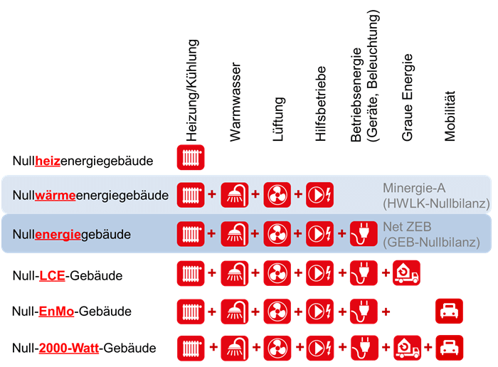 <!-- 700 -->
</center>

### Sonnengang

Karin Kroener, unsere Nachbarin gegenueber, teilt mit:
Im Carl-Keller-Weg 3, in dem ich wohne, scheint die Sonne von ca. 11 Uhr bis 11.30 Uhr (je nach Jahreszeit) durch und über den Waldrain, macht während des Tages ihren Gang, hat an Hochsommertagen von ca. 14 bis 14.30 Uhr an ihren Höhepunkt bis ca. 18 Uhr.
Das heisst, sie gibt so viel Wärme, dass ich dann auf meine Terrasse Waldrain gehe und dort das hervorragende, ja herausragende, ja fantastische Waldrain-Feeling total geniesse...
Gegen 18 Uhr gehe ich dann wieder auf meine Sonnenrain-Terrasse und geniesse den Abend bis in die Puppen...

### Photovoltaik

Die Jaehrliche Sonneneinstrahlung ca. 1200 kWh/m2*Jahr in Basel, cf. [Globalstrahlung](https://de.wikipedia.org/wiki/Globalstrahlung).
In Deutschland geht man im Schnitt von einer jährlichen Sonneneinstrahlung von 1.000 Kilowattstunden (kWh) pro Quadratmeter aus.
Im Sommer werden Werte bis zum Fünffachen der Sonneneinstrahlung im Winter erreicht.

Selbstbauprojekte zum Basteln und Experimentieren:

- [Build-It-Solar](https://www.builditsolar.com/GettingStarted/GettingStarted.htm)
 &ndash; Plans, tools and information to help you build renewable energy and conservation projects.
 - [Mitch HotBox](https://www.builditsolar.com/Projects/SpaceHeating/Mitchhotbox.pdf)
- [Kleine Solaranlage selber bauen](https://wohnen-heimwerken.de/kleine-solaranlage-selber-bauen-bauanleitung-insel-photovoltaikanlage.html)
- [Kleine 400W Solaranlage selber bauen](https://wohnen-heimwerken.de/photovoltaik-kleine-400w-solaranlage-selber-bauen.html)
- github.com/simat/BatteryMonitor/wiki

Beispiel Treppenlicht im Huenerbergweg 30:

- Verbrauch ca. 350 kWh p.a., im Schnitt ca. 1 kWh p.d., wobei im Winter sicher viel mehr pro Tag anfaellt
- Faustregel 1:1:1 &ndash; 0.35 MWh p.a. &rarr; 0.35 kWp (p steht für Peak) Solarmodul-Anlage und 0.35 kWh Akku als Richtwert;
- Ein 12V 30 Ah Akku entspricht rechnerisch 0.36 kWh.

Frage zu 50% halbtransparente lichtdurchlaessige PV-elemente, die Strom erzeugen und auch Licht durchlassen:
Die koennte man ja eventuell aufs Dach machen, und auch als Fenster benutzen, oder?

Antwort: Als Dach oder Fenster wäre der Dämmwert zu schlecht, aber z.B. als Dach eines Wintergartens o.ä.
Vielleicht auch fuer Dachausbau, z.b. einen unbeheizten hellen Bewegungs- und stillen Raum oben unter dem Sueddach.
 
Frage: Was fuer ein Winkel und Ausrichtung ist fuer eine PV-Anlage optimal?

Antwort: Ca. 45° bringt den höchsten Jahresertrag.
Wenn das Ganze in Richtung Autarkie optimiert werden soll, bringt eine Ost-West-Ausrichtung oder Süd-Ost / Süd-West einen gleichmässigeren Tagesertrag.
Das kann aber auch eine Batterie ausgleichen.
Für mehr Ertrag im Winter: steiler; dann wird dafuer im Sommer wird weniger Strom produziert und ins Netz gespeist.

### Heizung

Brauchen wir ueberhaupt eine Heizung?

Im [Erlenmatt in Basel wurden Wohnungen ohne Heizung](https://duckduckgo.com/?q=erlenmatt+ohne+heizung) erstellt:

- Kurz: [Günstige Wohnateliers ganz ohne Heizung](https://www.srf.ch/news/regional/basel-baselland/erlenmatt-quartier-guenstige-wohnateliers-ganz-ohne-heizung) &ndash; Wohnen zum halben Preis mitten in Basel, Architekt Heinrich Degelo
- Laenger: [Wohnateliers im Haus ohne Heizung](https://www.baublatt.ch/baupraxis/basel-wohnateliers-im-haus-ohne-heizung-26011) &ndash; Dicke Aussenmauern, wenig Fenster, Lueftung durch individuell Temperatur-, Luftfeuchte- und CO2-geregelte Klappen
- [Wohnen für 10 CHF pro m2: Degelo baut auf der Erlenmatt nach dem Easyjet-Prinzip](https://architekturbasel.ch/wohnen-fuer-10-chf-pro-m2-bauen-nach-dem-easyjet-prinzip-auf-der-erlenmatt)
- [Komfortmessungen](http://www.energieapero.ch/archiv/EABB_20_3/EABB_3_20_Ernst_Sandmeier.pdf) weisen auf geringfuegigen Korrekturbedarf hin

Wir koennen zusaetzliche Waerme gewinnen durch:

- Gut isolierete Fenster Richtung Suedosten (Kostenfrage)
- Holzofen

Wir koennen gut isolieren und temperieren durch:

- Nicht ganz so dicke Vollholzwaende
- Massive Lehmwaende im Hausinneren
- Halboffene Laubengaenge auf der Westseite

Andere Aspekte zur Heizung:

- holz + solar + erde + waermetauscher
- riesiger warmwasserspeicher
- beheizter steinvorrat
- niedrigtemperatur fussbodenheizung, z.B. im bad und wohnzimmer

### Warmwasser und Heizungsspeicher

- warmwasserspeicher modell jenna
- 4000 liter inkl. einen 500 liter boiler in dem speicher eingebaut duerfte reichen fuer 6 wohungen und 12 personen
- speicher wird geheizt durch: thermisch durch solaranlage und grundofen
- im sommer auch elektrisch durch photovoltaik
- boiler ist im speicher eingebaut und wird vom speicher geheizt
- waermepumpe mit boiler fuer heizung?

### Wasserfuehrender Holzofen

Wir wollen [auf fossile Brennstoffe verzichten](#verzicht-auf-fossile-brennstoffe) fuer Heizung und Warmwasser.

Stattdessen: Photovoltaik, Waermepumpe, [Waermespeicher](#waermespeicher), wasserfuehrender Stueckholzofen.

- Stueckholzofen mit Wasserheizung, Koch- und Backmoeglichkeit
- Stefan Best hat eine Solaranlage verbunden mit einem Holzofen
 von Claude Chiquet, [sopra Solarpraxis AG](https://www.sopra-ag.ch),
 vgl. deren [System Zeus](https://www.sopra-ag.ch/loesungen/system-zeus).
- Lina (Jeremys Tochter), Ben und drei Kinder haben in Rodenkirchen bei Koeln ein dreisteockiges Einfamilien-Minenergiehaus gebaut
mit Anschluss an die lokale biogasgeheizte Fernwaermestation.
Sie nutzen zusaetzlich einen Stueckholzgrundofen und sind damit sehr zufrieden.
Sie verheizen morgens und abends mit wenigen Handgriffen je vier Scheite Buchenholz und haben dauerhaft
im ganzen Haus ausser in den Badezimmern alle Heizkoerper auf Null gedreht.
Die Fernwaerme wird kaum gebraucht.
- Rene hat einen Holzheizungsherd Oekoalpin 100plus von [Pertinger Holzherde](https://www.pertinger.com/de/holzherde/1-0.html)
- Neuerdings gibt es noch effektivere Sturzbrandöfen, z.B. [Rohem Sturzbrandofen (Funktionsprinzip)](https://rohem.shop/sturzbrandofen) und 
[Pertinger Sturzbrandofen Wasserfuehrend mit Heizungsherd](https://www.pertinger.com/de/heizungsherde/heizungsherde-sturzbrand/19-7.html):
Masse B x T x H 1000 x 600 x 850-910 mm, Nennwärmeleistung 15 kW, Wirkungsgrad 90,5%, niedrige Emissionen: die Primärverbrennung dient beim Sturzbrand lediglich der Holzvergasung. Die so erzeugten Holzgase werden über Luftkanäle unterhalb der Feuerstelle zusätzlich mit Sauerstoff angereichert. Dadurch wird eine Sekundärverbrennung ausgelöst, welche aufgrund eines natürlichen, nach unten weggeführten Luftzugs, den Sturzbrand herbeiführt. Diese Vergasertechnik ermöglicht Temperaturen, Emissionen und Wirkungsgrade, die bis heute fast unvorstellbar waren.
    - Höchster Wirkungsgrad und bis zu 40% geringerer Holzverbrauch
    - Natürlicher Rauchzug ohne elektrischen Rauchabzug
    - Konstante Leistung dank kontinuierlicher und kontrollierter Holzvergasung
    - Umschaltmöglichkeit zwischen Heizfunktion und Kochfunktion
    - Geeignet für Klima- oder Passivhäuser vor allem in der Zwischensaison, dank der geringen Leistungsabgabe an den Aufstellungsraum

### Kerstin Mueller zum Thema Passivhaus

Ein Gespraech mit Kerstin Mueller, insitu, in Maerz 2020, zum Thema Passivhaus, Kybernetische Architektur, CO2-Emmissionen, Baustoffrecycling, usw.

<!--
Ja, da kenne ich einige der vorgeschlagenen Architekturbüros und
natürlich auch viele der Referenzen aus der Schweiz.
Ich frage mich, warum sie das nicht mit Magnus Wiedmann machen, wenn er
vielleicht auch in die Gruppe rein will?!
-->

Ich fände Strohbau noch toll für das Projekt und die Gruppe, z.B. hier:

- [Zimmerei Grünspecht: Bauen mit Holz, Sinn und Verstand](https://www.zimmerei-gruenspecht.de)
- [Bauen mit Stroh in der Zimmerei Grünspecht](https://www.bauen-mit-stroh.de/impressionen/)

Passivhaus eher nicht.
Low-tech ist heute angesagt und weg von zu viel Technik.
Ich würde den Fokus auf CO2 optimiertes Bauen mit entsprechenden Materialien legen.
Und erneuerbare Energien natürlich, Sonne / Holz / Geothermie, je nachdem.

Kennst du das Projekt von unserem Büro, [baubüro in situ](https://www.insitu.ch)?

- [K 118 Winterthur](https://www.insitu.ch/projekte/196-k-118)
&ndash; Wiederverwendetes Material, Strohdämmung und Lehmputz.
Das ist im CO2 Fussabdruck nicht zu schlagen!
Holzbau ist auch gut in Bezug auf CO2 &ndash; aber nicht per se und immer; das kommt auf den Grad der Verarbeitung der Holzwerkstoffe an.)

CO2 ist auch im deutschen Energiegesetz ein Thema, aber es gibt noch zu wenige (keine?) Beispiele, siehe den Artikel vom Deutschen Architektenblatt DAB zum
Thema [Gebäudeenergiegesetz: Experimente wagen](https://www.dabonline.de/2018/08/31/experimente-wagen-gebaeude-energie-gesetz).

Marco Jansen ist ein sehr sympathischer, er hat ja das Büro von Gerhard Zickenheiner übernommen.
Roman Bockemühl kennst du ja auch, oder?
Ich weiss nicht, ob er Zeit hat.
Tine Höfler ist ja jetzt bei der Schöpflin Stiftung.

Wenn Wiederverwendung von Bauteilen unf Baumaterialien ein Thema für die Gruppe ist, wäre vielleicht auch unser Büro interessiert, an dem Vorentwurf mitzumachen.
Wir sind derzeit in Vorgesprächen mit Züricher Genossenschaften und Basler Stiftungen um die Themen Netto Null / Wohnbau / Wiederverwendung.
Das wird ein zunehmend bedeutendes Thema, angesichts der drängenden Klimadiskussion.

Es gibt auch neu noch
die Initiative [Phase Nachhaltigkeit](https://www.phase-nachhaltigkeit.jetzt) und
ihre [Deklaration Nachhaltigkeit](https://static.dgnb.de/fileadmin/phase-nachhaltigkeit/DGNB_Phase_Nachhaltigkeit_Deklaration.pdf?m=1575534588&).

Ich kann mir vorstellen, dass das nicht schlecht ist, um die Richtschnur für die Planung zu ziehen.

Unser Büro ist bei der Phase Nachhaltigkeit dabei und es gibt ein paar zusammengestellte Unterlagen zu den Theman, die kann ich dir zukommen lassen, wenn du willst. Leider nicht in der Tiefe, die ich mir gewünscht hätte, aber immerhin.

Da fällt mir noch was ein: die Ausstellung [Die Clusterwohnung: Bauen und Leben im Kollektiv](https://www.iba27.de/die-clusterwohnung-bauen-und-leben-im-kollektiv)

Schöner Gruss, Kerstin

#### Mehr von Kerstin zum Thema Passivhaus

Frage: Zu dem Thema Passivhaus hat mich der Vortrag eines Haustechnikers an
dem Chaos Computer Club beeindruckt: [Wie man ein klimafreundliches Haus baut](https://youtu.be/eujeS4JJjq8)
Ich bin selbst Technikskeptiker und Low-tech-fan.
In diesem fall bin ich hin- und hergerissen.
Deine Meinung wuerde mich sehr interessieren!

Antwort: Ich hab mir das Video angeschaut.
Das Passivhaus Prinzip kenne ich schon.
Hier gibt es einige Infos dazu:

- [Passivhaus Institut](https://passiv.de)
- [Pressemitteilung](https://www.ig-passivhaus.de/upload/20171004_Pressemitteilung_Arbeitskreis_kostenguenstige_Passivhaeuser_AkkP_54.pdf)

Ein Kernpunkt ist die Lüftungsanlage zur Wärmerückgewinnung als grosses Stück Haustechnik. Das mögen nicht alle.

Hier ein anderes Prinzip von Günter Pfeifer, der vom Passivhaus weggekommen ist, hin zu 'klimaaktiven Fassaden':

- [Prof. Günter Pfeifer: Klima und Raum. Autochthone und kybernetische Strukturen](https://youtu.be/MGq8yD9AnGA) (50 Minuten Vortrag)
- [Zitat von 17:27: Der groesste Unsinn der neueren Geschichte: das Passivhaus](https://youtu.be/MGq8yD9AnGA?t=1045)
- [Beispiel Streit mit der Stadt um einen Kindergartenbau um 43:30](https://youtu.be/MGq8yD9AnGA?t=2580)

Und noch ein Haus, das ganz ohne Heizung auskommt, mit einem sehr ausgetüftelten Konzept:

- [2226 Lustenau, Österreich, 6-stoeckiges Büro und Verwaltungsgebaeude](https://www.baumschlager-eberle.com/werk/projekte/projekt/2226/)
- [Haus ohne Heizung: Bürogebäude von Baumschlager Eberle in Lustenau](https://www.detail.de/artikel/haus-ohne-heizung-buerogebaeude-von-baumschlager-eberle-in-lustenau-11703)
- [SRF Reportage](https://youtu.be/-DGjv5dkCqs) &ndash; In a report broadcast on Swiss TV on 22.05.2015, Dietmar Eberle explains the concept of the building 2226 functioning without technology (4 minutes)
- [Bürohaus 2226](https://youtu.be/rNlzRwkouFw) (2:30)

Oben geht es vor allem um den Energieverbrauch im Betrieb.

Ein weiteres wichtiges Thema ist der Energieverbrauch in der Erstellung / Ressourcenschonung / CO2:

- [Bauen mit Abfall und Recycling-Materialien](https://youtu.be/dEKgZc4UuW8) (2:23)
- [insitu Baumaterialrecycling](https://youtu.be/LoZ3gEy997s?t=280) (ab Minute 4:40)
- [SRF: Aus Abbruchhäusern entstehen neue Gebäude](https://www.srf.ch/play/tv/einstein/video/aus-abbruchhaeusern-entstehen-neue-gebaeude?id=ea57824c-51dc-4528-8736-d42674060445) (4:45)

Mittlerweile ist es so, dass Gebäude für die Erstellung + Rückbau gleich viel Energie brauchen wie für den Betrieb über die Lebensdauer.
V.a. wenn viel Gebäudetechnik drin steckt, wie Lüftungsanlagen.
Nur spiegelt sich das in der Geseztgebung und Vorschriften noch nicht wieder.

[ERNE AG Holzbau](https://www.erne.net) haben eine Reihe Gebäude im Angebot:

- [Angebote](https://www.erne.net/de/leistungen/gesamtleistungen/mietmodule/aktuelle-angebote/)

Diese werden in ein paar Jahren rückgebaut und sind somit ganz oder in Teilen als Ressource für andernorts verfügbar.
Meist sehr hochwertiges Material.
Wir haben einen Rückbau solcher Holzelementbauten vor Kurzem begleitet, für ein Projekt in Südfrankreich...
die sind superhappy über die gute schweizer Qualität der Materialien.
Es waere verrückt das nicht wiederzuverwenden.

Es ist auch wichtig in die Zukunft zu denken, da wird sommerlicher Wärmeschutz wichtiger als heute und der Heizwärmebedarf wird sinken.
Ihr seid am Wald? Das ist schon mal gutes Mikroklima!

**Jeremy:** Jetzt verstehe ich dass das wort 'Passivhaus' besetzt ist von Technik und vor allem die Waermerueckgewinnung.
Also ich will lieber keine Technik.
In unserem Bau Baustoffe recyclen stelle ich mir ein bissle schwierig, aufwendig und teuer vor.
Uns schwebt ja vor allem Holz und Lehm vor.
Natuerlich auch Glas, und vielleicht Betonwaende im Keller.
Ansonsten sehe ich nur Holzofen, Gasleitung, Wassser, Strom.

**Hartmut:** Wozu eine Gasleitung?

**Jeremy:** Kochen?
Im Huenerbergweg 30 kochen wir zur Zeit alle mit Gas.
Das finde ich sehr angenehm.
Die Alternative waere Strom, oder?
Faendest du das besser?
Vielleicht langfristig schon, wenn wir unsere eigene Photovoltaik haben?
Ach so, und ich wuerde auch auf jeden Fall gerne eine wasserfuehrenden Holzofen mit Koch- und Backmoeglichkeit einbauen.
Das hat der Rene auch, und der Axel Hugenschmidt schwoert auch drauf.

**Hartmut:** Strom in den kleinen Küchen und evtl. eine Kombi aus Strom/Gas in der grossen Küche mit Ausgang zum Garten, dann evtl. mit Gasflasche draussen?
Spart viele Leitungen und Anschlüsse...
Photovoltaik idealerweise von Beginn an, oder?

Zu dem Wort fuer diese Bautechnik:
Man koennte es auch Ökologie-optimiert nennen, was Energie, Materialen, Resourcenumgang usw. betrifft.
Im weitesten Sinne ist das Permakultur.
Das Konzept haben übrigens Architekten nach Europa gebracht.
[Perma-Architektur](https://www.perma-architektur.de/baubiologie.html)...
vielleicht Perma-Haus ....

**Kerstin:** Wie genau nennen, weiss ich auch nicht.
Ich glaube aber, wenn ihr euch über eure Schwerpunkte einige werdet, wird es nachher leichter, Entscheidungen in der Gruppe zu fällen.
Schaut doch [die Themenfelder und Ziele der Phase Nachhaltigkeit](https://www.phase-nachhaltigkeit.jetzt/ziele) an.
Dort werden einige mögliche Schwerpunkte aufgelistet.

[Lacaton & Vassal](https://www.lacatonvassal.com) haben auch sehr schöne Bauten;
so grosse, angebaute Energiegärten / Gewächshäuser / überdachte Aussenräume finde ich super schön:

- [Maison Latapie, Floirac](https://www.lacatonvassal.com/index.php?idp=25)
- [Maison en Dordogne](https://www.lacatonvassal.com/index.php?idp=17)

Dann kann man auch gut z.B. im Aussenbereich mit Lehmputz arbeiten, wenn die Fassade nicht direkt der Witterung ausgesetzt ist.
Überhitzung ist halt ein Thema, das hier unbedingt gelöst sein muss.

[kämpfen zinke + partner ](https://www.kaempfen.com/) machen energieeffiziente Holzbauten, vielleicht könnt ihr hier ein paar Ideen finden:

- [Neubauten](https://www.kaempfen.com/neubauten)

Herzlicher Gruss, Kerstin

## Technik

### Isolation

Daniel hat Informationen zum Thema Isolation am Bau geteilt:

- Ein sehr informatives Filmchen von 20Min zum Thema Isolation: [Wärmedämmung &ndash; Was ist sinnvoll?](https://youtu.be/2gw5-TUpOLk)
- Konrad Fischer Bauberatung: 
 - [Gute Fragen und Antworten](http://www.konrad-fischer-info.de/bauberatung.htm)
 - [Suche](http://www.konrad-fischer-info.de/1suchen.htm)

### Holzfaserplatten

- sind oekologisch und gut
- holzstaenderbauweise
- lehmputz innen
- lehmputz aussen, mit eine duennen schicht kalkputz oben drueber zum schutz gegen regen
- umlaufende balkons und weiter dachueberstand, damit die waende vor feuchte geschuetzt sind

### Lehmputz

- Lehmputz selber vor Ort herstellen
- [Lehmputz-Rezepte](doc/clay/lehmputz_rezepte.pdf)
- [Cob Ingredients &ndash; Soil, Sand, and Straw](doc/clay/cob-ingredients-soil-sand-and-straw.pdf)
- [Building with Mud: A Continuum](https://youtu.be/5El1PjkYSQ4)
&ndash; a continuum of clay-straw mixes and recipe examples
- [Basic Clay Straw Plaster Finish or Second Coat](https://youtu.be/z2ftQFPCccI)
&ndash; Instructions on how to plaster your own walls using natural materials, such as clay, straw, and sand.
The clay plaster mix varies a lot depending mostly on the clay.

### Abwasser

- [Abwasserleitungen Dimensionierung und Nennweiten](https://www.baunetzwissen.de/gebaeudetechnik/fachwissen/entwaesserung/abwasserleitungen-dimensionierung-und-nennweiten-2495529)
 &ndash; *DIN 1986 Entwässerungsanlagen für Gebäude und Grundstücke Teil 100: Bestimmungen in Verbindung mit DIN EN 752 und DIN EN 12056* enthaelt Bemessungstabellen 
- [Haustechnik &ndash; Berechnung des erfoderlichen Rohrdurchmessers](http://tsa-bautechniker.de/uploads/media/Rohrdurchmesser_berechnen_NEU.pdf)
&ndash; demonstriert berechnung von Fall- und Grundleitungen fuer verschieden Wohnungsgroessen und Entwaesserungsflaechen.
Fallleitung DN 100 reicht fuer uns.
Grundleitungsgroesse haengt von der maximalen abzufuehrenden Regenmenge ab. Erstmal reicht auch hier DN 100.
Wenn wir jemals sehr viel Regenwasser abzufuehren haetten, muessten wir wahrscheinlich sowieso den Huenerberger Schacht verbessern.
- [Abwasserleitung &ndash; Gefälle, Durchmesser und Material](https://www.talu.de/abwasserleitung-informationen)
&ndash; Üblicherweise ist hierzulande eine getrennte Abführung des regulären Abwassers und des Regenwassers vorgeschrieben.
HT-Rohre sind grau, hitzebeständig, und werden innerhalb von gebaeuden verlegt.
KG-Rohre sind orangefarben, stabiler, und werden daher als Grundleitung für das Abwassersystem im Aussenbereich eingesetzt.
Grundleitungen sollten laut der DIN 1986-100 mindestens 10, besser 15 cm Durchmesser haben.
Die Verrohrung des Abwassersystems muss mindestens 80 cm tief in der Erde verlegt werden, damit kein Frost die Leitungen schädigen oder einfrieren kann.
Entlueftung nach oben ist wichtig wegen Druckausgleich.
Seit 2016 muss jeder Grundstückseigentümer die Dichtigkeit seiner Abwasserleitungen sicherstellen.
Ein Nachweis über Dichtigkeitsprüfung durch zertifizierten Fachmann muss erbracht und alle 20 Jahren erneuert werden.
- Konkrete Vorschlaege von Rene und Daniel
 - mindestens drei leerrohre legen: abwasser, wasser pe-rohr, strom + internet
 - schacht auf halben weg vorsehen, mit steckdose und entleerungshahn; unten steine zum versickern, damit eventuell vorhandenes waser nicht weiter runter in die leerrohre fliesst
 - zugdraeht durchlegen
 - grau 75 mm reicht aus fuer strom + internet
 - fuer frischwasser reicht auch 75 mm, eventuell auch zusatz rohr um regenwasser von einer grossen sammelstelle oben am waldrain zu huenerbergern runter; 1 1/4 zoll pe-rohr geht durch; 2 fette perohr braucht 90 mm; fuer 2 stueck 3/4 zoll pe-rohre reicht 75 mm
 - abwasser 110 mm orange
 - das pe-rohr muss den druck aushalten. Mit 15 meter Hoehenunterschied herrscht unten 1.5 bar mehr als oben. Wenn oben 3 bar ankommen sollen, muss unten 4.5 oder 5 bar herrschen, also nicht die schwaechsten rohre benutzen, die nur ca. 6 bar aushalten.
- Beim Bauamt festzustellen, ob eventuell abwasser per verordnung minimum 150 mm sein muss; 
 muss man schmutz- und regenwasser bis zur parzellengrenze getrennt fuehren?
 manche abwasserverordnungen verlangen zwei getrennte abwasserleitungen fuer regen- und schmutrzwasseer.
 Abwasserverordnung carl-keller-weg.
 Laut dem [Wikipediaeintrag zur Abwasserleitung](https://de.wikipedia.org/wiki/Abwasserleitung) muss der Anschlusskanal (Leitung vom öffentlichen Strassenkanal bis zur Grundstücksgrenze oder bis zum ersten Reinigungsschacht im Grundstück) in Deutschland mindestens 15 cm Nennweite = Rohrdurchmesser haben.

## Garten

- Teiche anlegen
- Regenwasser sammeln
- Tiere halten?
- [Haftung](https://gaius.legal/nachbarrecht/aktuelles/sicherungspflichten-eigentuemer-haften-fuer-unfaelle-auf-ihrem-grundstueck):
 Wer im eigenen Haus wohnt, ist mit der Privat-Haftpflicht bereits gut versorgt.

### Aussenkueche

Wenn schon Barbara und Michael da oben sind, und wir auch schon Anschluesse fuer Strom, Wasser und Abwasser hochlegen, koennen wir auch gleich eine schoene Aussenkueche bauen.
Eineriesige Kuechenspuele haben wir schon.
Fehlen nur noch ein paar Gasflaschen und ein Gasherd fuer das komplette Inventar.
Dach drueber, Tisch und Stuehle her, gemuetliche Sitzplaetze dazu, und der vorlaeufige Waldraintreffpunkt ist gebongt.
Wuerde ich gerne in Angriff nehmen, sobald der Zufahrtsweg fertig ist, oder schon vorher.

### Raumnutzung an der Strasse entlang

- wasser + kompostklospeicher + waermespeicher in wasser oder stein?
- wasserspeicher -- unter dem stellplatz?
- heizung mit holzhackschnitzel
- 5 meter streifen an der strasse entlang als bunker fuer holzhackschnitzel ausbauen
- 15 meter langer zylindrischer wassertank 50 kubikmeter sleicher unter dem stellplatz einlagern

### Wohnmobil

Geometriedaten zu Michaels Wohnmobil &ndash; welchen Wenderadius braucht mein WoMo?

- Länge 8 m + 0,70 m Fahrradständer
- Breite 2,50 m
- Höhe 3,30
- Achsenabstand 4,20 m
- Überstand von Vorderachse 1,30 m
- Überstand von Hinterachse 2,50
- Auf einen befestigten Weg von 3 m Breite braucht der Wagen für eine 90° Kurve ca. 6 m Radius im äusseren Kurvenbereich,
für die beiden Achsen, wobei die Hinterkante zum Ausschwenken zusätzlich ca. 2 m ungehinderten Raum im äussersten Kurvenbereich benötigt.
- Also gesamt braucht die Kurve (nicht der Weg selbst) einen Aussenradius von mindestens ca. 8 m zur Innenkurve, besser wären natürlich 10 m Kurvenradius.

<center>
<a href="img/arch/2020-09-27_micha_womo/michael_wohnmobil_skizze.jpg">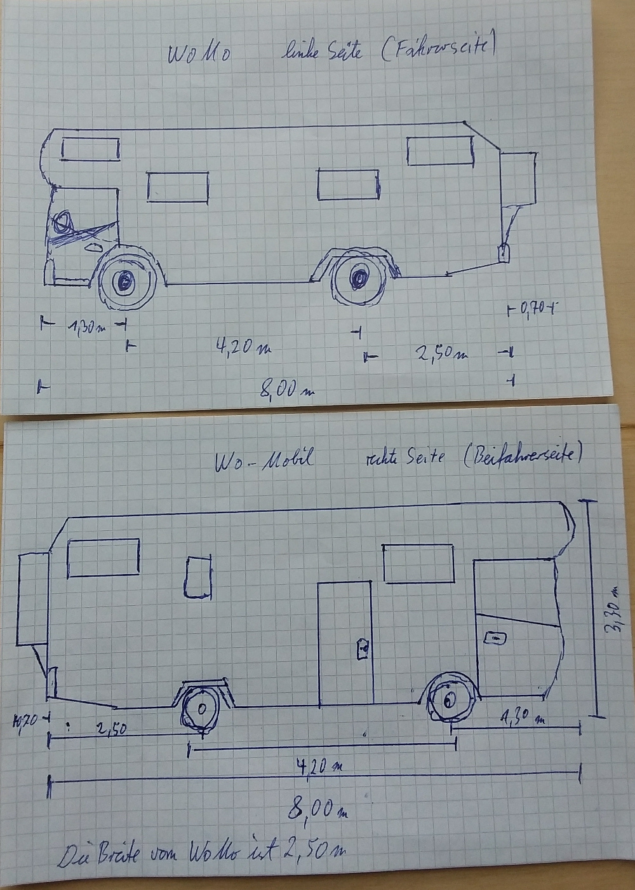</a> <!-- 1000 -->
</center>

#### WoMo-Stellplatz

Wir koennten eine Parknische fuer das WoMo mitten in den Zufahrtsweg einlassen und mit einer Rampe abdecken.
Eine Nische betonieren mit horizontalem Boden.
Im Normallfall mit verstellbaren Stahl- oder Alurampen abdecken, damit man darueber hoch- und runterfahren kann.
Zum Einparken das WoMo nach unten ueber die Rampe rueberfahren, Rampe entfernen und nach vorne in der Nische einparken.
Die Nische muesste ca. 5 Meter lang sein, um den Radabstand des WoMos unterzubringen.
Damit waere sie an der tiefsten Stelle an der Bergseite ca. 90 cm tief. 
Wir koennten auch kuerzere Rampen mit Zwischenstuetzen benutzen, z.B. 2.5 m lang.
Aus Alu wuerden sie weniger wiegen und koennen eventuell gebraucht gekauft werden, z.b. vom Militaer.
Kommerziell gibt es sie z.B. von:

- [Altec](https://www.altec.de),
z.B. [AVS 170, eine Robuste Aluminium Verladeschiene bis 8 t Tragkraft](https://www.altec.de/de/verladeschienen/aluminium-verladeschiene-avs-fuer-luftbereifung/avs-170-robuste-aluminium-verladeschiene-bis-8-t-tragkraft)
([Datenblatt](doc/sheet/2021-03-07_womo_laderampe.pdf))
- [Verladeschienen-shop](https://verladeschienen-shop.de) [Verladerampen Schwerlast 4,5 m 8 t](https://verladeschienen-shop.de/verladerampen-schwerlast-xos4506)

### Tiny House

- Zwei interessante Schweizer Projekte mit Tiny Houses
 sind [Tilla, die tiny villa](http://projekt-tilla.ch)
 und [kleinwohnformen.ch](http://kleinwohnformen.ch).
- [Autarkes Tiny House von greenakku.de](https://greenakku.de/Tinyhouse:::169.html) (Preis ueber 40'000 euro)
- Die Familie von Beatrice Holzmann-Kaltenbach hat 2017 ein Tiny House gebaut und benutzt.
Sie besitzt es noch und es wird gerade nicht mehr genutzt.
- Michael d. G. hat einen Schreinerfreund, der fuer sich selbst ein TH gebaut hat, das er nicht mehr bruacht, mit Eichenparkett, Holzschindelverkleidung, Ofen, alles vom feinsten.
- Schwedische 'Tannenzapfen' als Wohnwagenersatz, in zwei Wochen in Selbstbau erstellbar:
[Kottar i Järna](https://www.svt.se/nyheter/lokalt/sodertalje/han-bygger-huskottar-i-jarna)
- [Villa Larix &ndash; kleines Haus für große Momente](https://villa-larix.de)
&ndash; 30 Minuten Video ueber [ein mobiles Holzhaus auf Wechselbrücke, das Tiny House von Andreas](https://youtu.be/uxhPkkEHhEo),
inspiriert durch [Philipp Siegels Reset House](https://reset-house.de)
und [das Vollholzsystem NUR-HOLZ der Firma Rombach](https://www.rombach-nurholz.de).

Barbaras Tiny Haus hat die Masse: Laenge 6.5 m + 1.5 Deichsel, Breite 2.55 m, Hoehe 3.7 - 4 m.
Hier is der [2D Bauplan](img/arch/2020-09-25_tiny_house/th_bauplan_2d.pdf) und
eine [3D Skizze](img/arch/2020-09-25_tiny_house/th_skizze_3d.pdf):

<center>
<a href="img/arch/2020-09-25_tiny_house/th_bauplan_2d.pdf">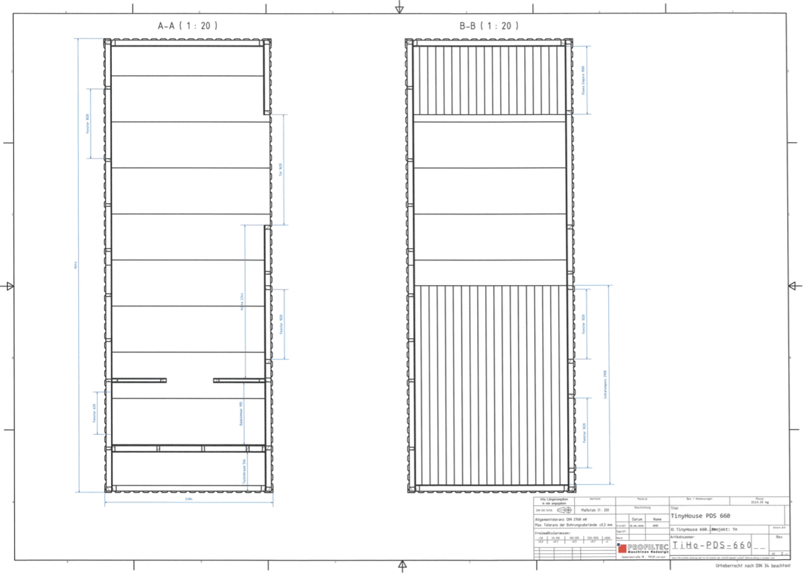</a> <!-- 1296 -->
<a href="img/arch/2020-09-25_tiny_house/th_skizze_3d.pdf">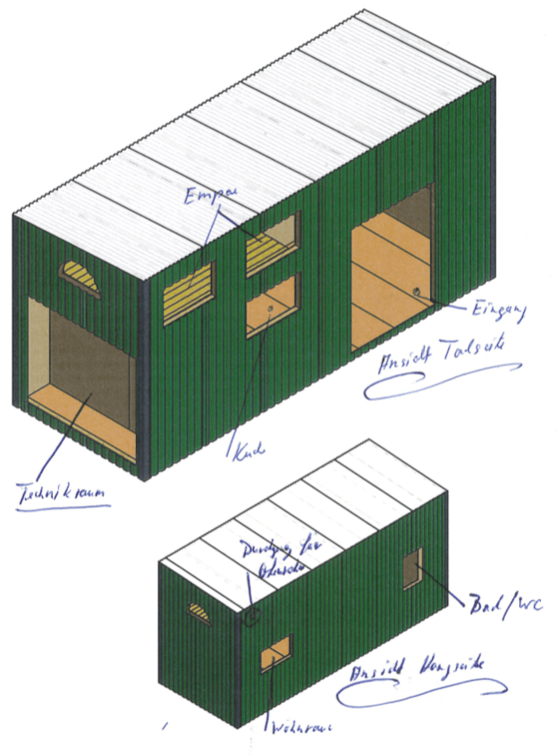</a> <!-- 623 -->
</center>

Thomas Schmitz hat mit Herrn Holzmann gesprochen, der das Tiny House baut.
Der Anhänger wird vom TÜV geprüft und das Haus oben drauf ist sozusagen die 'Ladung'.
Wir weisen in unserem Bauantrag den Stellplatz wo der Trailer steht als Stellplatz für Anhänger oder Wohnwagen etc. aus.
Das Abstellen von Anhängern auf dem eigenen Grundstück ist nicht genehmigungspflichtig. 

### Baumhaus

[The GL Method](http://www.treehouse.jp/thp_eng/gl.html): All treehouses produced
by [Tree House Creations](http://www.treehouse.jp/thp_eng/thc.html) make
use of the GL method of construction, which involves attaching a specially made bolt to the inner part of the tree.
The GL method is a great improvement over earlier construction techniques, which included sandwiching the trunk with parts on both sides.
This placed an undue burden on the cambium layer and was later linked to several problems, including stunting of the tree's growth.
The GL method is the result of over ten years of coordinated research by tree biologists and engineers at the World Treehouse Conference in Oregon.
As of this date, it has been proven to be the method which is most effective and least harmful to the tree itself. 　
With that said, it must be acknowledged that even with these advanced construction techniques, drilling holes in the bark and attaching metal bolts cannot be said to be good for the tree's health.

<center>

</center>

### Stuetzmauer

Wie gestalten wir die Stuetzmauer fuer Terrassen im Garten?

- Naturstein? Holz? Beton? Gabionen? Beton-L mit Bruchstein verkleidet?
- [Stützmauer &ndash; Berechnung und Konstruktion](https://awfrance.com/grundstuck/stutzmauer-berechnung-und-konstruktion)

Beton ist extrem unoekologisch:

- [Ecological footprint gabione concrete](https://duckduckgo.com/?q=ecological+footprint+gabione+concrete)

Hier sind Beispiele fuer Masse, Gewicht und Ergiebigkeit
von [Granitsteinquader als Mauersteine vom Steinbruch Huber](https://www.steinbruch-huber.de/Produkte/00139/Granit-Quader-zum-Bau-einer-robusten-Gartenmauer.aspx):

- Material: Mauersteine aus Bayerischem Granit, grau, feinkorn
- Form: in Steinquader gespalten
- Oberfläche: spaltrauh
- Verwendung: Gartenmauer, Trockenmauer, Hangbefestigung, Stützmauer, Sitzstein

<table class="r">
 <tr>
 <td>Masse <br/> in cm LxTxH ca.</td>
 <td>Gewichtsspanne <br/> in kg / Stk ca.</td>
 <td>Ergiebigkeit <br/> in m2 / Tonne ca.</td>
 </tr>
 <tr>
 <td>15-40 x 15 x 15</td>
 <td>9-20</td>
 <td>2.5</td>
 </tr>
 <tr>
 <td>20-50 x 20 x 20</td>
 <td>20-55</td>
 <td>2.0</td>
 </tr>
 <tr>
 <td>30-60 x 30 x 30</td>
 <td>73-146</td>
 <td>1.2</td>
 </tr>
 <tr>
 <td>40-80 x 40 x 40</td>
 <td>173-346</td>
 <td>0.9</td>
 </tr>
 <tr>
 <td>50-80 x 50 x 50</td>
 <td>338-810</td>
 <td>0.7</td>
 </tr>
</table>

[Lieferanten fuer Steine und Erde](#steine-und-erde).

Stuetzmauer unterhalb von Johannas Wiese, um die Wiese zu begradigen: ca. 22 m lang x 1 meter hoch.

Stuetzmauer fuer die Terrasse fuer das Tiny House: ca. 9 m lang x 2 meter hoch.

Insgesamt 22 + 18 = 40 quadratmeter Frontflaeche.

Doerflinger: Bruchsteine 20-40 cm, 40-60 cm, ab 60 cm und plattig.

### Zufahrtsweg

Barbara und Michael: Übernächste Woche, KW 28, wollen wir mit dem Tinyhousebauer nochmal das Grundstück anschauen.
Wir überlegen, dass wir kein teures Provisorium durch den Wald legen, das dann wieder entfernt werden muss, sondern gleich auch den Weg für Michaels Auto auf der Zaunseite.
Barbara uebernimmt dafür die Kosten.

Schotter + Wegbelagmaterial (Mergel?) + Bruchsteine.

Eventuell die Oberflaeche mit [Mineralbeton](https://www.hausgarten.net/heimwerken/materialien/beton/mineralbeton.html)?
Kann von Doerflinger in Marzell geliefert werden.

Micha weist hin auf
den [Königsweg für
wassergebundene Decken?](https://www.stabilizer-wege.de/app/uploads/2020/02/B_I-galabau_3-10.pdf)
([&rarr;](doc/weg/wegebelag_bindemittel.pdf))

- Schliesslich ist bei steileren Wegen (ab ca. 8% Neigung) auf die Anordnung von Querrinnen im Abstand von ca. 6-12 m zu achten, um die Fliesslänge des Wassers zu begrenzen &ndash; denn auch wenn Decken mit Bindemittel ausgestattet sind, ist ihre Grenze ab einer gewissen Wasserfliesskraft überschritten: es kann dann zu Abschwemmungen kommen.

[Lieferanten fuer Steine und Erde](#steine-und-erde):

- Steine, Schotter, Mineralbeton: [Kimo Schwarzwald Granit Tegernau](https://www.schwarzwald-granit.de) in Tegernau, Doerflinger in Marzell.
- Mauersteine, Schotter, Forstmischung als Wegbelag, Bagger und andere Maschinen zu mieten gibt: [Buehler Kompost](https://www.buehler-kompost.de).
- Michael hat sich Schotter kommen lassen
- Mergel aus Minseln
- [Buehler Kompost](https://www.buehler-kompost.de)
 - [Wegebau und Grubbern](https://www.buehler-kompost.de/wegebau.html)
 - Granitschotter 40-60 mm euro 35 / to
 - Forstmischung 0-16 mm oder 0-32 mm euro 32 / to

Bauplan fuer den Weg:

- Genaue Wegfuehrung und Lage fuer Tiny House Terrasse festlegen
- Neigung des Belags entscheiden: zum Haus hin, oder auf den Nachbarrasen?
- Zaun aufmachen, Gartentoerchen abbauen
- Baum faellen (Esche)
- Restliche Haselstraeucher entfernen
- Baumstruenke und Wurzeln entfernen
- Bruchstein liefern lassen
- Terrassenstuetzmauern aufstellen
- Humus abtragen vom Zufahrtsweg (und auch von Johannas Wiese) und separat lagern
- 20-40 cm Koffer ausheben und Terrassen mit dem Lehmboden auffuellen
- Kofferboden (Lehm) verdichten
- 4 meter Bahn [Geotextil](https://de.wikipedia.org/wiki/Geotextilie) auslegen,
 z.B. [Drainagevlies 2 x 50 m 120g](https://www.ebay.de/itm/Drainagevlies-Geotextil-Drainage-Unkrautvlies-Vlies-Trennvlies-2m-x-50m-120g/281179220022) 160 euro,
 [Flairstone 50 x 2 m 0.8 mm](https://www.hornbach.de/shop/Drainagevlies-Flairstone-50x2m-Staerke-0-8mm/6799272/artikel.html) 83 euro
- Grober Schotter einfuellen und verdichten
- Querliegende Ablaufrinnen einbauen, z.B. [Bodenrinne befahrbar B125 125 kN 105 mm tief](https://www.ebay.de/itm/Bodenrinne-befahrbar-Entw%C3%A4sserungsrinne-flach-Terrassenrinne-A15-B125-C250-SET/254595745040) fuer eur 150
- Feiner Schotter mit Sandmischung nachfuellen und nochmal verdichten
- Mineralbeton aufbringen und verdichten
- Eventuell 16-er Splitt oben drauf aufbringen

Masse und Materialdaten:

- Granitschotter 1.7-2 to/m3, 0.5-0.6 m3/to
- Auflockerungsfaktor 1.2
- Wegflaeche 30 x 3 m2
- Koffertiefe 0.3

Materialbedarf laut Daniel:

- Benoetigter Schotter = Koffermaterial: 30 * 3 * 0.3 * 1.2 * 2 = 65 tonnen
- 10 cm Mineralbeton oben drauf: 30 * 3 * 0.1 * 2 = 18 tonnen

Telefonat mit Doerflinger.

[Doerflingers Angebot](doc/weg/2020-08-25_doerflinger_granit_angebot.pdf) geht wahrscheinlich von nur 10 cm Schotterdicke aus und kommt daher auf nur 20 tonnen Schotter 40-60 statt 65 laut Daniel.

Fuer den Belag empfiehlt Doerflinger persoenlich 70-80 mm Mineralbeton 0-45 und 30 mm Mineralbeton 0-30 oben drauf.
Das ergibt wahrscheinlich mehr als die 8 tonnen, die im Angebot stehen.

Nachdem der Weg erstellt ist:

- Bruchstein liefern
- Stuetzmauern aufstellen
- Lehmboden verteilen
- Humus verteilen

[Weitere Ideen von Stefan](#stefan-2020-09-09).

Entscheidung mit Michael am 2020-09-14:

- Geotextil von Ciprian drunter, 5 meter mal 30
- 30-40 to Schotter 40-60
- 8 to Schotter mit Sand 0-30
- ? to Bruchstein


### Gabionen

Am einfachsten, flexibelsten und guenstigsten wird es sein, Gabionen selber zu gestalten.

Michael d. G. Mitarbeiterin Ehemann stellt Gabionen her.

Search progress:

- Stahlgitter feuerverzinkt wire mesh Drahtgittermatte Gittermatte z.B. https://katalog.gti-gitter.at MV10034152 Gittermatten feuerverzinkt Material: feuer verzinkt, Maschenweite: 100x100, Stärke: 3.4, Länge: 2404, Breite: 1504, Kante: geschl
- Welded Wire Mesh Panel Galvanised Steel Sheet Metal 8ft X 4ft Grid 12 Gauge
- [4"GA.148WD, Galvanized Wire Mesh - 4" x 4" Mesh, 0.148" Diameter Wire](https://cart.thomasnet-navigator.com/cbcheckout/reviewcart?token=W2gcuWzSiewg8372qX9ghPp5HinVVOaJ8fdjNmMCBsMHsGT3VMMIgZSh_wdAPaZb62xl0Oy6s32A0CJk0udl9A%2C%2C&returnurl=https%3A%2F%2Fcatalog.darbywiremesh.com%2Fviewitems%2Fgalvanized-mesh-by-mesh-count%2Fgalvanized-wire-mesh--from-4--x-4--opening-to-3-4)
- Baustahlmatten verzinkt
- [Armierungsmatte verzinkt](https://www.hornbach.de/shop/Armierungsmatte-verzinkt-2-00-x-1-00-m/254035/artikel.html)
- [Baustahlmatte 2.3 x 1 m R 188A](https://www.hornbach.de/shop/Baustahlmatte-2-3x1-m-R-188A/5505093/artikel.html)
- [Verzinkte Baustahlmatte von hm-stahlshop.de](https://www.hm-stahlshop.de/shop/verzinkte-baustahlmatten-20780p.html) 5 x 100 x 100 mm ca. 55 euro / qm
- [Mattenzaun Betonstahlmatten Baustahlmatten feuerverzinkt](https://www.intergardshop.de/catalog/product/view/id/1523/s/betonstahlmatten/category/694/) 2 x 3 m, 5 x 100 mm 72,59 € macht ca. 12 euro / qm
- [Angebot von www.gti-gitter.at](https://www.gti-gitter.at)
 ([&rarr;](file:///Users/jta/j/doc/house/huenerberg/gottschalk/2020-08-14_gti_gitterdraht_angebot.pdf)) 1.5 x 2.4 m 100 x 100 x 3.4 mm euro 26.14 + palette + fracht + mwst 154.48, also 8.71 euro / qm inkl. mwst. und excl. fracht 

### Bagger

- price in hardly ever under 10k
- buy a new one and share with or sell to cipriano
- nicola has one in her garden. who does it belong to? Magnus will ask.
- ask dal grande, falk, daniel
- ask the people with a garden beside the road up to the tuellinger lindenplatz
- ask haring: the one he had is too old and broken. he recommended checking with [Insolvenz + Nachlass Verwertungen Umkirch](https://www.verkauf-xxl.de).
- [facebook Gebraucht Bagger](https://www.facebook.com/groups/184982358642608)
- Verkaufe verschiedene Minibagger und Radlader &ndash; K2 Maschinenhandel tel 015223138393, Alte Dorfstrasse, 79682 Baden-Württemberg - Todtmoos
- Daniel empfiehlt:
 - mindestens 2.5 tonnen
 - schild fuer arbeiten im hang
 - boeschungsloeffel, breit, kippbar
 - gummi oder stahlraupen egal, stahl ist vielleicht sogar besser
 - hebehaken an den loeffel oder an den armen anschweissen
- Joergs Freund Stefans 80-jaehriger Nachbar hat einen Fuhrpark voller Bagger hat und moechte vielleicht einen davon verkaufen...
 bei Stefan nachfragen, +49-151/14462538...
- Bagger auf dem Tuellinger: Kreiner, Baugeschaeft
- [Minibagger Schreitbagger mit Benzinmotor und 20 cm Löffel](https://www.jansen-versand.de/land-forstwirtschaft/bagger/11/minibagger-jansen-mb-300-benzinmotor-schreitbagger-inkl.-20cm-loeffel) eur 3200

## Oekologie, Nachhaltigkeit, Autarkie

### Holzkohle

- [Ithakainstitut Koehleranleitung](https://www.ithaka-institut.org/ithaka/media/doc/Kon-Tiki_Anleitung.pdf)
- [Fotoalbum vom Erdkontiki](#holzkohlepyrolyse-im-erdkontiki)
- Artikel ueber [Potenziale der Kohlenstoffspeicherung im Boden](https://www.humusrevolution.de/artikel-potenziale-der-kohlenstoffspeicherung-im-boden-stefan-schwarzer) ([Englisch: Putting carbon back where it belongs &ndash; the potential of carbon sequestration in the soil](https://wedocs.unep.org/bitstream/handle/20.500.11822/28453/Foresight013.pdf); [Deutsch](doc/oeko/foresight-brief-013-potenziale-der-kohlenstoffspeicherung-im-boden-2.pdf)): Landwirtschaft produziert 25% aller GHG [greenhouse gas](https://en.wikipedia.org/wiki/Greenhouse_gas). Biochar, produced through pyrolysis of biomass, is a long-term stable form of charcoal. Biochar has multiple benefits, many of which are not yet understood. It is resistant to decomposition and can stabilize organic matter added to soil. Biochar can also form long-term carbon pools in the soil, sequestering up to 0.5 GtC/ year globally, and in an extreme if unrealistic case up to 8.3 GtC. The application of biochar provides a range of soil fertility and soil quality co-benefits, such as the promotion of fungi and bacteria growth, improved water and nutrient retention, decreased pathogen impacts, increased soil porosity and higher crop yields if pre-composted.
- [Kon-Tiki8303.ch](http://kon-tiki8303.ch)
- [CharNet &mdash; Fachverband fuer Pflanzenkohle und Pyrolyse](http://charnet.ch)
- Die erste gesamtschweizerische Fachtagung zu Pflanzenkohle und Pyrolyse im urbanen und kommunalen Kontext findet statt am 2020-03-12 im Restaurant Seegarten, Basel: [Fachtagung Charnet Schweiz &ndash; Dekarbonisierung mit Pflanzenkohle und Pyrolyse](https://fachverbandpflanzenkohle.org/events/fachtagung-charnet-schweiz-dekarbonisierung-mit-pflanzenkohle-und-pyrolyse)
- 2 kg trockenes holzhaecksel max 30% feuchtigkeit --> 4 kWh waerme + 400 gramm pfalnzenkohle --> 1250 gramm co2 der luft entzogen wenn im boden gespeichert
- ein fuenftel vom holz gewicht kommt als pflanzenkohle raus
- 2 tonnen holz = ca. 3 steher holz (chf 3 * 130) --> 1 kubikmeter kohle (chf 400) + waerme als gewinn
- 1 tonne holz verkoehlern statt verbrennen: man gewinnt die haelfte der waerme plus 400 kg holzkohle
- das verhindert die emission von ca. 1 bis 1.2 tonnen CO<sub>2</sub> in die athmosphaere
- CO2-Vergleiche bei der Herstellung von Biokohle &ndash; Rechenbeispiele von Rene basierend
auf [Zahlen und Fakten von waldschweiz.ch](https://www.waldschweiz.ch/schweizer-wald/wissen/schweizer-wald/zahlen-fakten):
 - 1 kg Häckselmaterial (bei weniger als 30% rel. Feuchte) ergeben 400g Pflanzenkohle = 1250g CO2 im Boden gespeichert plus 4 kWh Wärme als Gasflamme
 - 800 kg Häckselmaterial ergeben 320kg Pflanzenkohle = 1000 kg CO2 im Boden gespeichert plus etwa 3200 kWh Wärme
 - 2500 kg Häckselmaterial ergeben 1000 kg Pflanzenkohle
 - Ein Schweizer verursacht pro Jahr etwa 7 To CO2.
 Dies entspricht etwa 5.6 Tonnen verkohltem Häckselmaterial. 
 1 Tonne CO2 entspricht ungefähr 800 kg Häckselmaterial oder etwa 1 m3 gewachsenes Holz.
 7 Tonnen CO2 entsprechen also 7m3 Holz im Wald.
 - Um meine jährliche CO2-Emisssionen zu kompensieren (also um klimaneutral zu sein) müssen für mich pro Jahr 7 m3 neues Holz wachsen.
 10 Mio m3 Holz wachsen jedes Jahr in der Schweiz.
 1.5 Mio m3 Holz werden pro Jahr für Energieholz gewonnen.
 66 Bäume wachsen für jeden Schweizer/Schweizerin.
 Wenn also der Schweizer Wald unsere CO2-Emisssionen kompensieren soll, müsste er jedes Jahr um etwa 56 Mio m3 wachsen (8 Mio x 7 m3).
 Pro Person macht das etwa 6 durchschnittliche Bäume.
 Soviel zur CO2-Kompensation!
 

#### <a name="chemie-der-holzverbrennung"></a>Chemie der Holzverbrennung

Aus 100 kg Holz entsteht bei der Verbrennung hauptsaechlich Kohlendioxid und Wasser, und zwar von jedem der beiden ueber 100 kg, in der Summe ca. 207 kg
(vgl. [What happens to the mass of a burned object?](https://physics.stackexchange.com/questions/614800/what-happens-to-the-mass-of-a-burned-object)):

Question: Imagine I were to burn a pile of wood weighing a hundred kilograms and I would have a big sack hanging over the burning pile. In this sack I would catch all the smoke that came from the burning pile and all the remaining wood ashes. Would the sack weigh a hundred kilograms or would it weigh less?

Answer: You would have much more mass than 100 kg after the wood was burned.
Wood is made mainly of cellulose and lignin.
Both are cross-linked glucose polymers, so a good approximation of what you would get is given by the chemical reaction of burning glucose:

<center>
  <div class="jformula">
    <span>C</span><sub>6</sub><span>H</span><sub>12</sub><span>O</span><sub>6</sub>
    + 6 <span>O</span><sub>2</sub>
    &rarr; 6 <span>C</span><span>O</span><sub>2</sub>
    + 6 <span>H</span><sub>2</sub><span>O</span>
  </div>
</center>

This means that 6 oxygen molecules combine with one glucose molecule when it is burned.
The molar mass of the glucose molecule is 180 and the molar mass of the six oxygen molecules is 192.
This means that when you burn 180 kg of glucose, 192 kg of oxygen take part in the chemical reaction, producing an equal mass of carbon dioxide and water vapor.
At these ratios, when you burn the 100 kg of wood, you would collect 207 kg of carbon dioxide and water vapor.

### Koehlern

<!-- im Waldrain Ende Maerz 2020<a name="koehlern_2020_03"></a> -->

Am 29-30 Juni 2020 fand im Waldrain eine Koehleraktion statt.
Montag war Vorbereitung und Aufbau:

Ab 10:30 Planung und Besprechung, danach Ausführung zum Bau des Erdkontiki.

Der Dienstag war dann ganz für die Köhlerei reserviert.
Man rechnet vom Anfeuern bis zum Ablöschen ca. 6 Stunden.
Essen und Trinken nach Bedarf zwischendurch, nicht alle auf einmal.
Erfahrungsgemäss sind 4 bis 6 Helfer ideal, je nach Qualität des Holzes.

Wir verkohlen die vorhandenen Holzreste, um sie mit Kompost zu mischen,
[Terra Preta](https://de.wikipedia.org/wiki/Terra_preta) herzustellen,
sie in Hochbeete einzuarbeiten, und sie im Garten zu vergraben, um Kohlenstoff im Boden zu Speichern,
vgl. die verschiedenen [Informationen zu Holzkohle oben](#holzkohle).

Vorbereiten:

- Strom hochlegen und Elektroinstallation einrichten fuer Wasserpumpe (Konsole, 75 m Drehstromkasbel, Anschluss).
- Holz vorbereiten und trocken lagern, maximal unterarmdicke
- 1 Kubikmeter Wassertank bereitstellen und fuellen
- Loch fuer Erdkontiki graben, siehe [Fotoalbum vom Erdkontiki](#holzkohlepyrolyse-im-erdkontiki)
- Armierungseisen 3m lang 10 mm

Mitbringen:

- Feuerfeste Kleidung, lange Aermel, Handschuhe bis zu den Ohren, gute Schuhe

Distanz kann gut gehalten werden.

Schlussendlich waren wir zu dritt: Rene, Jeremy und Michael, kurz auch Thomas Schmitz von [AHA](#aha).

Siehe auch das [Fotoalbum Koehlern]() (kommt noch).

### Regenwassernutzung

In Baden-Wuertemberg faellt pro Jahr ca. 935 mm oder knapp 1 meter Regen pro Jahr,
siehe [Niederschlagsmenge im Jahr 2019 nach Bundesländern](https://de.statista.com/statistik/daten/studie/249926/umfrage/niederschlag-im-jahr-nach-bundeslaendern).
Daher kann man pro Quadratmeter Sammelflaeche im Jahr knapp 1 Kubikmeter Wasser sammmeln.
Der durchschnittliche [Wasserverbrauch pro Kopf in Deutschland](https://nachhaltig-sein.info/privatpersonen-nachhaltigkeit/der-pro-kopf-wasserverbrauch-in-deutschland-eine-ubersicht) betraegt
122 L pro Tag oder ca. 45 Kubikmeter pro Jahr.
Am Huenerberg haben wir pro Jahr ca. 300 Kubikmeter verbraucht fuer 8 Leute, oder ca. 37.5 Kubikmeter pro Jahr und Kopf.
Mit 50 Quadratmeter Regensammelflaeche pro Kopf und einen genuegend grossen Speicher koennte man also den ganzen Wasserbedarf mit Regenwasser abdecken.
Ca. 27% des pro-Kopfwasserverbrauchs wird fuer Klospuelung benutzt. Mit einem Kompostklo koennte man den Anteil sofort einsparen.

Cornelius nutzt bereits ein Osmosefilter fuer sein eigenes Trinkwasser, und filtert damit das Hahnwasser.
C + J bauen zur Zeit am Huenerberg ein zweites Osmosefiltersystem, um aus Regenwasser Reinstwasser zum Trinken zu gewinnen.

- osmosefilter spaltet ja ueber die haelfte ab als verlust
- wohin damit? sopeichern und anderweitig nutzen
- klare auflistung von verbrauchern, die osmosefiltriertes wasser brauchen
- aktivkohlefilter reicht aus fuer das meiste
- vielleicht nur reinsttrinkwasser durch osmosefilter lassen
- alles uebrige, z.b., waschmaschine, dusche
- getrennte wasserversorgungsleitungen
- osmosewasser direkt am geraet holen
- aktivkohlefiltriertes wasser in den wasserleitungen zum kochen, haende waschen
- unfiltriertes regenwasser pur zum duschen, waschmaschine betreiben
- regenwassertank: betontank ist teuer un unoekologisch.
es gibt gebrauchte gereinigte industrietanks, z.b. aus stahl.
in sennrueti haben sie einen 50000 liter tank fuer chf 5000 gekauft und eingebuddelt.
gebrauchte tanks gibt es auf [tanks.ch](tanks.ch).
- [Betonzisternen zur Nutzung von Regenwasser in Garten und Haushalt](https://www.dieregensammler.de/betonzisternen)
- Wolfgang sagt: Regenwassernutzungs- und Klaeranlagen gibt es fix fertig
&ndash; z.B. kann man frisches Regenwasser sammeln fuer Waschmaschine, Duschen, Spuelen, Bad und Dusche, oekologische Seife benutzen, keine Chemie.
Das Abwasser hiervon ist Grauwasser. Das kann man auch sammeln, durch ein Kiesfilter durchlassen und nochmal fuer Klospuelung nutzen.
Anbieter z.B. [Mall Umweltsysteme](https://www.mall.info), [Broschuere ueber oekologische Regenwassernutzung](https://www.mall.info/downloadcenter/dlc/Gewerblich/Regenwasserbewirtschaftung/Regenwassernutzung/Prospekte/prospekt-regenwassernutzung-endkundenbroschuere.pdf).

### Permakultur

- Moni macht sich hier schlau und immer schlaeuer
- [Almut Schmidt-Rau](https://www.naturheilpraxis-schmidt-rau.de) ([email](mailto:Almut Schmidt-Rau <almutschmidtrau@gmail.com>)) versorgt sich seit 30 Jahren fast vollkommen autark im eigenen Garten mit Wasser, Gemuese, Honig, Imkerkurse, Naturheilpraxis, Terra Preta.

### Baumschnitt

- Tatjana: Um Wasserschosse zu vermeiden, sollte man bei Tagen mit absteigenden Mond schneiden (also wenn der Mond in den Zeichen von Sommersonnenwende bis Wintersonnenwende steht: Loewe Jungfrau Waage Skorpion Schuetze Steinbock).

### Kompostklo

- Kompostklos, Urintrennung und Faekalienkompostierung im Campingplatz in Thielle
- Photos und Skizze von Renes Kompostklo
- Terra Preta und Saegespaene als Einstreu im Kompostklo
- Faekalien kann man mit Terra Preta und Saegespaene gemischt im Eimer sammeln, ein paar Wochen stehen lassen, dann auf eine Miete tun. 
5 * 1 meter muesste fuer die Faekalien-Terra-Preta Miete reichen.
- In Thielle gibt es einen Ueberschuss an Urin; eine Person scheidet pro Tag ca. 1.5 bis 2 liter aus
- Urin kann gesammelt und weiterverarbeitet werden, z.b. [Aurin Duenger](http://www.vuna.ch/aurin)
&ndash; der erste Urin-Dünger weltweit mit kompletter Zulassung.
Dank Aurin braucht Urin kein Wasser mehr, um die Kanalisation herunterzuwandern.
Urin wird ohne Verdünnung direkt verarbeitet, effizienter als in jeder Kläranlage
[&rarr; schematisches Bild vom Aurin Prozess](img/kompostklo/aurin_process.png).
- Beispiel von Trennung von Urin zur Verarbeitung in Aurin Duengemittel in normalen modernen WCs in
the [NEST Building on Empa’s Dübendorf campus](https://www.keanw.com/2020/01/visiting-nest-with-kingspan.html)
&ndash; Text durchsuchen nach 'The urine is separated'.
- [Tomaten düngen mit Urin: ein sinnvoller Dünger?](https://www.tomaten.de/tomaten-duengen-mit-urin-ein-sinnvoller-duenger)

### Autarke Abwasserklaeranlage

- Abwasserklaeranlage wie fuer Tiny House
- 8 * 3 meter Wasserversickerungsbereich koennte reichen fuer Waldrainprojekt
- [Kompostklos](#kompostklo) verringern die Abwasserbelastung mit Urin und Faekalien, die getrennt abgefuehrt und behandelt werden
- Grauwasser wird in Behaelter gesammelt
- Kiesbett mit Sand und Pflanzen wird regelmaessig mit dem Grauwaser geflutet, das dann versickert

## Kultur

- Vorbildfunktion: wir wollen gerne vorbildliche oekologische Lebensweisen und -Konzepte entwickeln, die wir teilen und vorzeigen koennen
- Bewegungsraum, Tanz, Musik, Kultur
- Offenheit nach Aussen, Veranstaltungen, Vernetzung

## Finanzen

Notiz von Ende 2019: Grobe Finanzplaene stehen und sehen haltbar aus.
Wir haben es natuerlich leicht, so lang die Zinsen so niedrig bleiben wie heute.
Wenn wir es schaffen wuerden, je 100000 einzubringen plus eine miete von 10 euro pro qm zu zahlen, dann haben wir viel geld. 
10 euro pro quandratmeter der gesamten wohnflaeche... wie wird das verteilt?
Manche wollen nur ganz klein bei sich hocken, andere benuzten wohnzimmer, kueche, bad, atelier, tanzraum, waschkueche usw.
Das sind viele quadratmeter, die gezahlt werden muessen, und die wir uns teilen, vielleicht unterschiedlich.
Wenn ich z.b. eine miete von 500 euro im monat zahle, sind das 6000 im jahr.
Damit kann ich zur zeit fuer einen kredit von 200000 zins plus tilgung zahlen.
Multiplizier das mit den anzahl leuten, die zusaetzlich zu uns vier genossenschaftsgruendern kommen sollen.
Selbst wenn nur vier leute dazu kommen wollten, haetten wir schon mehr als genug.
Wenn es mehr sind, klappt es noch besser...
Manche haben auch ein grosses interesse an sinkende Mieten im Alter.

### Buchhaltung

Jeremy hat einige Buchhaltungsoptionen angeschaut.
[GnuCash](https://gnucash.org/?lang=de_DE) ist eine Finanzverwaltung für Privatpersonen und kleine Unternehmen, die alle unsere Beduerfnisse erfuellt, inkl. doppelte Buchführung, Verwaltung von Kunden, Lieferanten und Rechnungen.
<!-- Offene Frage: wird gnucash von den Pruefern akzeptiert? Ist vielleicht nicht akzeptabel? Kann manipuliert werden? -->
Am heutigen Tag Ende August 2020 taetigt die Genossenschaft noch keine Geschaefte, sondern muss nur die Geschaeftsanteile der Mitglieder verwalten.
Eher braeuchte Jeremy selber eine Leistungsfaehige Buchhaltungssoftware, um seine persoenlichen Ausgaben fuer den Waldrain im Griff zu halten.
Ich waehle mal vorerst den [Kontenrahmen Wohnungswirtschaft](https://wiki.gnucash.org/wiki/De/Wohnungswirtschaft).
Mein erstes Problem war schnell und effektiv geklaert: [resize Description column](https://wiki.gnucash.org/wiki/FAQ#Q:_How_do_I_resize_my_register_columns.3F_Why_can_I_not_shrink_the_description_column.3F).
Vielleicht kann ich bestehende Daten mit [CSV Import](https://wiki.gnucash.org/wiki/CSV_Import/Export) einlesen?

- [Kontenrahmen (Wikipedia)](https://de.wikipedia.org/wiki/Kontenrahmen)
- [Welchen Kontenplan oder Kontenrahmen muss ich verwenden?](https://www.gruenderlexikon.de/checkliste/fuehren/buchfuehrung-vorbereiten/kontenrahmen)
- [Kontenrahmen SKR 49 für Fördervereine u. gemeinn. Vereine](https://www.jverein-forum.de/viewtopic.php?t=1265)
- [Industrie-Kontenrahmen (IKR)](https://wirtschaftslexikon.gabler.de/definition/industrie-kontenrahmen-ikr-38407)
- [Wie ist der Aufbau eines Kontenrahmens und wie wird ein Kontenplan erstellt?](https://www.weclapp.com/de/blog/kontenrahmen-kontenplan/#index-anchor3)

In September 2020 sind unsere Buchhaltungsbeduerfnisse noch denkbar einfach, da wir nur folgende Posten verwalten muessen:

- Geschaeftsanteile
- Girokonto und die dadurch entstehenden Kontokosten
- Archtektenhonorare und wie sie gedeckt werden

Im Telefonat am 2020-09-30 erklaert mir Herr Voss vom [ZdK](#zdk):
Wir koennen einen ganz normalen Kontenrahmen waehlen, z.b. SKR04, evtl. auch SKR03, es spielt keine grosse Rolle.
Dort 'Stammkapital' umbenennen in 'Geschaeftsguthaben'.
Spaeter kann dort ein Unterkonto angelegt werden fuer ausscheidende Mitglieder.
Fuer Wohngenossenschaften gibt es ein paar kleine feine Unterschiede, die fuer uns erstmal keine Rolle spielen.
Es koennte sein, dass spaeter kleine Korrekturen noetig werden.
Z.B. sollten Betriebskostenvorauszahlungen eventuell abgegrenzt werden gegenueber der Bilanz.
Es ist aber kein Hexenwerk, und auch wir kochen nur mit Wasser.

<a name="buchhaltung-2020-10-27"></a>

Telefonat am 2020-10-27 mit Herrn Voss vom [ZdK](#zdk):
Ich habe die ersten Buchungen eingegeben, und es sieht fuer mich als Laie einigermassen sinnvoll aus.

- *Eigenkapital* 9000 euro sind bisher einbezahlte Pflichtanteile.
- *Verbindlichkeiten* sind Darlehen der Genossenschaftsmitglieder, um laufende Kosten zu decken.
- *IV. Kassenbestand* ist unser Girokonto.
- *II. Forderungen* ist eine Rechnugen des Architekten, der eine Bauvoranfrage planen soll.

Die Architektenrechnung wir durch ein Darlehen eines Genossenschaftlers gedeckt. Ist das so ok?
 
Wenn ja, habe ich zwei kleine fragen:
 
- Das unten aufgefuehrte Minus von -11.45 entsteht durch Kontofuehrungsgebuehren.
Ist das auch korrekt?
Im Girokonto sind sie als Abzuege eingetragen und auf ein Konto *08. Sonstige betriebliche Aufwendungen - nebenkosten des geldverkehrs* gegengebucht.
Mich wundert, dass die Rechnung des Architekten kein Minus erzeugt, die Kontogebuehren dagegen schon.
- Ich habe gehoert, dass wir als Genossenschaft von der MWSt befreit sind.
Sie ist aber in der Architektenrechnung enthalten.
Muessen wir das trennen?

Antwort:

- Die Architektenrechnung muss unterschiedlich behandelt werden, je nachdem, ob es direkt zum Hausbau gehoert oder nicht.
Da diese Rechnung sich direkt auf die Leistungsphase 1 nach HOAI bezieht, kann sie nach Paragraph 266 HGB auf Konto *0725 verbucht werden, Aktiva - Anlagevermögen - Sachanlagen - Geleistete Anzahlungen und Anlagen im Bau - Wohnbauten im Bau auf eigenen Grundstücken*.
Sie erzeugt kein Minus, weil dadurch das Anlagevermoegen erhoeht wird; durch die Kontogebuehren nicht.
- Bezueglich der Darlehen der Genossenschaftsmitglieder zur Deckung der Rechnungen:
jedes Darlehen braucht einen eigenen [Darlehensvertrag](#darlehensvertrag-an-eine-genossenschaft).
Die betriebliche Veranlaassung der Kosten muss durch den Vorstand geprueft und abgesegnet werden.
Saemtliche Rechnungen muessen auf den Namen der Genossenschaft lauten.
- Bzgl. der MWSt: Wohnungsvermietung ist grundsaetzlich umsatzsteuerbefreit.
Daher muessen wir die in Rechnung gestellte Umsatzsteuer zahlen und bekommen sie nicht wieder erstattet.
Dafuer muessen wir nachher nicht auf die Miete Umsatzsteuer zahlen.

Nach diesen Korrekturen sieht unsere Buchhaltung aktuell so aus:

<center>
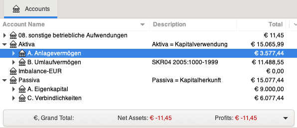
</center>

### Darlehensvertrag an eine Genossenschaft

Ein sehr gut ausgearbeiteter Vertrag fuer Darlehen an mit einer Genossenschaft mit Rueckzahlung usw. gibt es in der Gemeinschaft in Degersheim &ndash; Rene Duveen fragen.

Frau Farnoush Bejnoud von der [Zdk](#zdk) betont hierzu auch: In Bezug auf die privaten Darlehen sollten sie sich zu gegebener Zeit (wenn der Abschluss des Vertrages ansteht) mit meinem Kollegen Herrn Weber austauschen, damit sie in der Vertragskonstellation keine Fehler machen, die der Genossenschaft rechtliche Probleme bereitet. Es sind nämlich nur bestimmte Vertragskonstellationen möglich, die nicht gegen das Kapitalanlagegesetzbuch, Vermögensanlagegesetz und weitere Gesetze verstossen.

### Projektkostenaufstellung

Daniel empfiehlt uns, ganz frueh im Prozess Klarheit ueber die angepeilten Kosten fuer jede Person beim Architekten anzufordern:

- Privat Wohnraum in m3 und Kosten pro m3
- Anteil gemeinschaftlicher Wohnraum in m3 und Kosten pro m3
- Anteil Umgebung in m2 und Kosten pro m2
- Summe als Anteil am Projekt
- Baunebenkosten
- Total zu erwartende Kosten

### Miete

Wer in einer Genossenschaft wohnt, ist weit mehr als Mieter.
Er oder sie zahlt ja auch keine Miete, sondern eine moderate Nutzungsgebühr für die Wohnung, die als Eigentum der Genossenschaft allen Anteilseignern gehört &ndash; also auch dem Mitglied.
Dieses Modell gemeinsamen Eigentums macht Wohnen erschwinglich und stellt die Interessen der Bewohner in den Mittelpunkt...
([Zitat Wohnungsbaugenossenschaften Deutschland e.V.](https://www.wohnungsbaugenossenschaften.de))

Genossenschaftliches Wohnen ist weit verbreitet: Sicher wie Eigentum und flexibel wie Miete.
Wer in einer Genossenschaft wohnt, ist weit mehr als Mieter.
Er oder sie zahlt ja auch keine Miete, sondern eine moderate Nutzungsgebühr für die Wohnung oder das Haus, die als Eigentum der Genossenschaft allen Anteilseignern gehört &ndash; also auch dem Mitglied das im Haus wohnt.
Dieses Modell gemeinsamen Eigentums macht Wohnen erschwinglich und stellt die Interessen der Bewohner (Mitglieder) in den Mittelpunkt.
(Zitat [Cehatrol](https://www.cehatrol.com/bereiche/wohnen))

### Wohnraumpreise in Degersheim

Gedanken und Erfahrungen von Pia und Rene aus einer existierenden Gemeinschaft:

In Degersheim werden die Mieten pro Quadratmeter nach verschiedenen Aspekten gewichtet.
Das alles ergibt ein Punktesystem:

- verschiedene preise fuer wohnraum oben, unten (mit gartenzugang) und in der mitte (am guenstigsten)
- alle bewohner ziehen sowieso im haus herum, es aendert sich dauernd
- nordllicht, suedlicht, gang usw. wird mit bewertet

### Foerderung

- [Förderung von Projekten für innvovatives Wohnen](https://www.baden-wuerttemberg.de/de/service/presse/pressemitteilung/pid/foerderung-von-projekten-fuer-innvovatives-wohnen) auf [Baden-Württemberg.de](https://www.baden-wuerttemberg.de), z.B. Haus B, Altbach, Privater Bauherr, neue Wohntypologien:

> Fokus gemeinschaftlich, barrierefrei, flächenreduziert;
Auf Initiative eines privaten Bauherrn entsteht barrierefreies gemeinschaftliches Wohnen.
Um dabei auf immer knapper werdenden Wohnraum zu reagieren, werden beim Haus B neue Wohntypologien untersucht.
Hierbei ist das Ziel, die individuelle Wohnfläche zu reduzieren und gleichzeitig durch Gemeinschaftsflächen
höhere Wohnqualität zu erreichen.
Die beiden Mehrfamilienhäuser teilen sich eine gemeinsame außenliegende Erschließung,
wodurch einerseits alle Geschosse barrierefrei erreichbar sind und
andererseits ein offener Begegnungs- und Kommunikationsraum entsteht.
Die Dachform bildet parallel die Topografie nach und bindet beide Häuser zusammen.
Gemeinschaft entsteht und wird nach außen hin sichtbar.

- [Wohnraumoffensive Baden-Württemberg](https://wm.baden-wuerttemberg.de/de/bauen/wohnraumoffensive-baden-wuerttemberg)
- [Überblick zur Wohnraumoffensive BW](https://wm.baden-wuerttemberg.de/de/bauen/wohnraumoffensive-baden-wuerttemberg/bausteine-und-angebote-der-wohnraumoffensive-bw)
- [Innovativ Wohnen BW &ndash; beispielgebende Projekte](https://wm.baden-wuerttemberg.de/de/bauen/wohnraumoffensive-baden-wuerttemberg/innovativ-wohnen-bw)
    - [Projektaufruf](https://wm.baden-wuerttemberg.de/fileadmin/redaktion/m-wm/intern/Dateien_Downloads/Bauen/Wohnungsbau/PROJEKTAUFRUF_Innovativ_Wohnen_BW_-_Beispielgebende_Projekte.pdf)
    - Antragsformular

<blockquote style="font-size:75%">
Leider zu spaet bemerkt...

Sehr geehrter Herr Tammik,
 
herzlichen Dank für Ihr Interesse an unserem Projektaufruf für die Beispielgebenden Projekte. Die Frist für Projekteinreichungen ist bereits am 19.10.2020 abgelaufen und die ausgewählten Projekte wurden am 28.12.2020 bekannt gegeben (siehe Anhang). Eine Einreichung im Rahmen dieses Aufrufs ist somit nicht mehr möglich.

Ob und wie wir die Beispielgebenden Projekte im Rahmen der Wohnraumoffensive BW weiterführen, steht zum jetzigen Zeitpunkt noch nicht fest. Entsprechende Informationen werden jedoch rechtzeitig bekannt gegeben.

Mit freundlichen Grüßen
 
Petra Österreicher
 
Ministerium für Wirtschaft, Arbeit und Wohnungsbau Baden-Württemberg
Ref. 59 - Innovatives Bauen und Planen, Kopfstelle Wohnraumoffensive
Schlossplatz 4 (Neues Schloss), 70173 Stuttgart
Dienstsitz: Theodor-Heuss-Strasse 4, 70173 Stuttgart
Telefon: +49 (0)711 123-2515
Mail: petra.oesterreicher@wm.bwl.de 
Internet: www.wm.baden-wuerttemberg.de
</blockquote>

## Ansprechpartner

- [fairnetzt](https://www.fairnetzt-loerrach.de) &ndash; Klima Nachhaltigkeit Gemeinschaft in LOE
- universitaeten: nachhaltiges bauen und oekoligisches heizen mit null energie
- dhbw duale hochschule: architektur, bauwesen, energieeffizienz, nachhaltigkeit?
- [Gemeinschaftsgärten Lörrach](https://www.fairnetzt-loerrach.de/gemeinschaftsgaerten),
[Lebensgarten an der Wiese](https://www.fairnetzt-loerrach.de/gemeinschaftsgaerten/lebensgarten)

### Unistudien

- Thomas Gröbli vom [ethik-labor.ch](https://ethik-labor.ch)
- Es gibt an der ETH viele, die zum Thema Energie und Bauen arbeiten
- [Energy Science Centre ETH](http://www.esc.ethz.ch), Anlaufstelle für alle energiebezogenen Fragen; die kennen die ETH-Leute gut und können sicher weiterverweisen.
- [Masterprogramm für Energie und Bauen](http://www.master-buildingsystems.ethz.ch) &ndash; Hier könnte sicher [Kristina Orehounig](orehounig@arch.ethz.ch) weiterhelfen.
- Ich würde sicher aber auch bei den Fachhochschulen schauen, wo es sehr viel Fachwissen zu diesen Themen geben wird.
- [Beni Rohrbach](https://www.hslu.ch/de-ch/hochschule-luzern/ueber-uns/personensuche/profile/?pid=3862) könnte allenfalls weiterhelfen 
- Dann aber sicher auch die Leute vom der [Fachhochschule Nordwestschweiz MAS FHNW Nachhaltiges Bauen](https://www.fhnw.ch/de/weiterbildung/architektur-bau-geomatik/mas-fhnw-nachhaltiges-bauen).
- Dr. Wahbeh of FHNW

### Banken

Barbara hatte Kontakt mit der GLS-Bank und sagt:
Wenn wir irgendwann Kapitalbedarf haben...
Mir wurde ein Experte empfohlen für Bauunternehmen, wie wir es planen:
Volker Krauth, Tel. 0761-7663131, [volker.krauth@gls.de](mailto:volker.krauth@gls.de).
Er betreut z.B. ein solches Projekt in Bad Krozingen.

### Gemeinschaftsinteressentinnen

- Barbara + Michael
- Jeremy
- Moc C (assoz)
- Araceli + Jörg
- Anja B
- Doris + Lukas 11 + Lara 7
- Nathalie F

> Ehemalige:
>
> - Axel + Michaela H
- Marianne S
- Sabine G
- Hartmut S + Isabelle S-N
- Moni
- Sunahla + Govinda
- Joachim L
- Martin Z
- Christine S
- Magnus W
- Daniel B

<!--
alphabetically
Anja
Araceli
Barbara
Doris
Govinda
Jeremy
Joachim
Joerg
Lara
Lukas
Michael
Moc
Moni
Sunahla
-->

### Architektenwahl

- Madlee empfiehlt Gerhard Zickenheiner, der jetzt im Bundestag für die Grünen sitzt.
 Sein [Büro Jansen Zickenheiner](https://www.jza.team/buero.html) (tel. +49-7621/914029-0, [email](mailto:Buero Jansen <buero@jza.team>)) hat er abgegeben an Marco Jansen<a name="jansen"></a> und seinem Kollegen Patrick Königsfeld.
 Gerhard könnte euer Projekt ziemlich interessant finden und unterstützen...
 Madlee kennt ihn vom gymy früher.
 [Besichtigung mit Jansen und Koenigsfeld am 27.3](#besichtigung-mit-jansen-2020-03-27).
- Vielleicht sollten wir zusaetzlich zum Architekten einen Projektplaner hinzuziehen, findet Madlee.
Ulrich Plathe, Freier Architekt und Planer für Projeksteuerung in Tübingen, Holzmarkt 7, 07071/924525, leitet in Binzen ein Projekt für "anderes Bauen", nicht der höchst bietende bekommt Land, sondern es muss Sinn machen, genaueres weiss ich nicht. Das liegt ja vor der Haustüre, um sich evtl. beraten zu lassen. Vielleicht aus Infos über Förderungen solcher Projekte.
- Wolfgang Gottschalk ist befreundet mit Jeremy und hat am Huenerbergweg 30 schon andere Projekte geplant und durchgefuehrt.
Er hat in Loerrach schon Jahrzehnte als Architekt gearbeitet, nimmt jetzt keine neuen Auftraege mehr an, ist aber ansprechbar, z.B. wegen Bauvolumen, Hangabsicherung, usw.
- Haring hat ein geologisches Gutachten vom Carl-Keller-Weg wegen der Hangabsicherung.
- Alex Dedek kennt sich vielleicht mit Hangabsicherung am Huenerberg aus.
- [Willy Lindemer](mailto:Wi-Li@gmx.de), 0171-8481611, Architekt in Loerrach, ex-Partner von Wolfgang.
 Angerufen am 2020-03-24; er hat bis Ende naechstes Jahr 2021 selber keine Zeit, bekommt eventuell bald eine neue frischgebackene Architin als Mitarbeiterin, fuer sie koennte das Waldrainprojekt von Interesse sein.
- Von Wolfgang empfohlen am 2020-02-12:
 - [Erich Baumann von der siedlungswerkstatt](https://www.siedlungswerkstatt.de) mit gruss von Olli Bucher und Wolfgang
 &ndash; er hat 4-5 Holzpassivhaeuser in Stetten gebaut, auch in Ruemmingen Richtung Kandern in der alten Ziegelei;
 schafft mit [Breisgauhaus](http://www.breisgau-haus.de) zusammen, die machen nur Holzhaeuser. Er baut eher nach Norm, Passivhaus, z.B., vielleicht nicht super flexibel mit Kybernetik und so...
 - Tine Höfler, Architektin, Wiesentalstr. 74, 79539 Lörrach, +49-7621/7935907, fruehere Mitarbeiterein von Zickenheiner.
 Angerufen am 2020-03-24; sie hoert jetzt mit der Architektur auf.
 - Wenn die Planung erstmal steht koennte man auch an [Oekohaus Ibach](http://www.oekohaus-ibach.de) oder irgendeinen anderen Holzhausbauer herantreten. Die bauen auch hier in Loerrach.
- Voschlaege von Otto 2020-02-18:
 - Vorentwuerfe von drei Architekten auf Festhonorarbasis einholen, mit Nutzungs- und Bauvolumenkonzept ohne Details, mit gemeinsamen Zielhorizont in 8-12 Wochen.
 - [Würkert & Partner Architekten BD](http://www.wuerkert.eu)
 - [Günter Pfeifer](http://www.guenterpfeifer.de) ([email](mailto:Günter Pfeifer <pfeifer@pfeiferarchitekten.de>)),
 z.b. sein [Projekt kinzy](http://www.guenterpfeifer.de/content/kinzy.html),
 ein Einfamilienhaus in Beton in Loerrach; vielleicht sowas in Holz?
 - Ottos Nachbar [Andreas Leisinger](https://www.leisinger-architektur.com), Kirchstrasse 11
- Vorschlag von Moc 2020-02-24
 - Moc kann die [Architekteneinladung](#einladung) weiterleiten an [Andy Courvoisier, Basel](https://courvoisier-projekte.ch).
 Er kennt alle Architekten in der Region Basel. Andy empfiehlt weiter:
 - [Roman Bockemühl](http://www.bockemuehl-architekt.de) hat viel Verständnis für Baugruppen.
 - [Moser Architekten](https://www.moser-architekten.de) sind ganz in der Naehe vom Waldrain, mit Lörrach vertraut und eher 'typische Architekten'.
 - Burckhardt Partner in Grenzach sind ebenfalls mit planerischen Rahmenbedingungen vertraut und zu einer grossen Bude gehörig &ndash; falls dies für umfassende Vorabklärungen noch ganz gut wäre.
 - Moc nennt auch Natalia Wespi von [kollektivearchitekt](https://kollektivearchitekt.ch).
- Hartmut hat seinen Architekt gefragt, Andreas Konietzny, der jetzt bei [Gies Architekten in Freiburg](https://www.giesarchitekten.de) arbeitet.
Sie haben anscheinend einige Projekte in unserem Segment, aber auch viel Beton: [Projekte](https://www.giesarchitekten.de/de/projekte)
&ndash; [Kleehäuser](https://www.giesarchitekten.de/de/projekte/kleehäuser)
&ndash; [Eco-logis](https://www.giesarchitekten.de/de/projekte/eco-logis)
&ndash; [Haus-p](https://www.giesarchitekten.de/de/projekte/haus-p)
- <a name="wilhelm"></a>Hartmut nennt Prof. Dipl. Ing. Fritz Wilhelm vom [Büro Wilhelm und Hovenbitzer](http://www.wilhelm-hovenbitzer-partner.com), Bergstrasse 24a, Lörrach, tel +49-7621/45010;
 Frau Wilhelm hat seinerzeit im WohnWandel Zukunftsforum den Entwurf für die Clusterwohnungen gemacht.
 [Fritz Wilhelm](mailto: Fritz Wilhelm <f.wilhelm@wilhelm-hovenbitzer-partner.com>) laedt uns ein, Unterlagen inkl. Lageplan usw. zuzuschicken.
 &ndash; [Email 29.4](#email-von-wilhelm-2020-04-29)
- <a name="aha"></a>[AHA Architekten](http://www.ahatelier.de):
 [Thomas Schmitz](mailto:schmitz@ahatelier.de), Zimmerermeister, mobil: 017632057999, [Mathias Duffner](mailto:duffner@ahatelier.de);
 Empfohlen von Alex am Huenerberg 19:
 zwei Jungarchitekten, die bei uns am Haus mitgebaut haben;
 Neben der Architektur machen sie auch Holzbau;
 [Besichtigung 2020-04-07](#besichtigung-mit-aha-architekten-2020-04-07), 
 [Telefonat 2020-05-06](#telefonat-mit-aha-2020-05-06)
- Anja empfiehlt die Architektin Susann Galster, Im Bündtenfeld 9, 79737 Herrischried, tel +49-7764/9338970, mobil +49-176/62139211;
 sie erwaehnte im Gespraech:
 [earthship](https://www.earthshipglobal.com), earthhouse, spaceship, mit gewaechshausgarten durch das das grauwasser geleitet wird;
 heizung durch temperierung, strahlungswaerme, kupferrohre in lehmputz eingebettet, mit 5 mm lehm ueberzogen;
 [heliodome](https://www.facebook.com/heliodome-395300976943)
- Siegfried Delzer<a name="delzer"></a>, [Delzer Kybernetik GmbH](http://www.delzer.de), Tel +49-7621-9577-0, [email](mailto:Siegfried Delzer <s.delzer@delzer.de>) &ndash; Berechnung und Simulation vom Permahaus mit [DK-Integral](https://www.dk-integral.info): Ausfuehrliche Infos im [Telefonat am 1.4](#siegfried-delzer-2020-04-01), [Treffen mit Atrchitekten am 25.8](#delzer-2020-08-25) und [Email am 9.9](#delzer-2020-09-09).
- Julia und Thomas Kuri<a name="kuri"></a>, [kuriarchitekten](https://www.kuriarchitekten.de), tel. +49-7622/6843675,
 und [Kuri Holzbau](https://www.kuri-holzbau.de/home.html), Schopfheim.
 Julia Kuri ist Innenarchitektin, ihr Mann Thomas Architekt.
 Sie arbeiten oft, nicht immer, mit Holzbau Kuri zusammendie Baufirma von Thomas Vater.
 Sie haben etliche kybernetische Architekturprojekte mit Delzer ausgefuehrt.
 &ndash; [Telefonat am 7.5](#telefonat-mit-kuri-2020-05-07), [Telefonat am 9.6](#telefonat-kuri-2020-06-09)
- Juergen hess empfiehlt [Werner Schmidt](https://www.atelierwernerschmidt.ch/oekologie) als
 Architekturbüro für nachhaltiges, autarkes und ökologisches Bauen, siehe sein Konzept
 von [Oekologie und Autarke Gebäude](https://www.atelierwernerschmidt.ch/oekologie)
- Sebastian Müller-Pätzig von [Plan-Eco](https://www.plan-eco.de)<a name="plan-eco"></a> in der Wallbrunnstrasse 48, wenige hundert Meter vom Waldrain entfernt, tel. +49-7621/5893585.
 Zusatzausbildung zum Energieberater an der TU Darmstadt.
 Zusammenarbeit mit der [Zimmerei Grünspecht in Freiburg](https://www.zimmerei-gruenspecht.de), die viel mit Strohbau arbeitet.
 Er laedt uns ein zu einer [Strohballenbaubesichtigung](#strohballenbaubesichtigung) in der zweiten Junihaelfte.
- Aktueller Ueberblick der Anfragen:
 - Honorarfrage ist noch nicht geklaert;
 [Honorar fuer die Bauvoranfrage](#honorar-fuer-die-bauvoranfrage) schon, aber Vorstudie?
 - Tine Höfler &ndash; nicht mehr aktiv
 - Gies und Konietzny &ndash; kamen am 8.4 zu Besuch, etwas arg retrospektiv
 - Andreas Leisinger &ndash; interessiert, bisher nur Telefon- und Emailkontakt
 - Susan Galster &ndash; wartet auf mehr Klarheit und weniger Weite
 - Günter Pfeifer &ndash; [Telefonat 30.3.](#g%C3%BCnter-pfeifer-2020-03-30)
 - Jansen &ndash; sehr interessiert, begeistert, [war am 27.3. zu Besuch](#besichtigung-mit-jansen-2020-03-27)
 - Thomas Schmitz, AHA &ndash; sehr interessiert, sehr interessant
 - Büro Wilhelm: [Emailkontakt am 2020-04-27 und 29](#email-von-wilhelm-2020-04-29); grosses Interesse, sich mit uns zusammenzusetzen
 - Gemeinsam evaluieren: [Jansen](#jansen), [AHA](#aha), [Kuri](#kuri), [Wilhelm](#wilhelm), [plan-eco](#plan-eco)
 - Noch nicht angesprochen: Dr. Wahbeh of FHNW, Würkert, Erich Baumann

### Wochenendorte

- Barbara schlaegt fuer ein Findungswochenende den [Baschnagelhof](http://baschnagelhof.de) vor
 &ndash; ich habe was schönes für ein Findungswochenende gefunden, kannst ja mal anschauen und ggf ins Verzeichnis nehmen
 &ndash; ein Selbstversorgerhaus, eine Stunde von Freiburg entfernt,
 inmitten eines Landschaftsschutzgebietes im Schwarzwald,
 zwischen Schluchsee und St. Blasien, in 760 m Höhe.
 Noch ein Gedanke für das WE: wenn sich jeder ein Thema (vom Sport bis zur Seele) in einem
 abgestimmten Zeitraum aussucht, was er mit den anderen teilen möchte, dann haben wir max. schon 10 Punkte,
 um uns kennenzulernen und sind gut oder schon über- versorgt ;-)
- Joerg empfiehlt [Bout du Pont](https://bout-du-pont.ch): 
 Falls wir Mal als Gruppe zusammen ein Wochenende preiswert verbringen wollen, habe ich im Jura einen Platz gefunden, der in Frage kommt: ein Bauernhof, direkt am Fluss Doubs, auf dem man u.a. im Heuschober übernachten kann, aber auch im Zelt, im Wohnmobil und Tinyhoue.
 Es ist wirklich schön und die Gegend bietet von Wandern über Kanu fahren alles mögliche...
- Anja schwaermt vom [Seminarhaus Lindenhof bei Tuttlingen](https://seminarhauslindenhof.de)

### Handwerker

- [moniwonig contacts](moniwonig#contacts)
- [Ralf Weber Elektrotechnik GmbH](https://ralf-weber.de), Basler Strasse 126, D-79540 Lörrach, +49-7621/165122, [email](mailto:Michaela Sander <michaela.sander@ralf-weber.de>)
- Saegewerk Himmelsbach in Steinen; sie machen auch Lohnschnitt fuer euro 70,- pro Festmeter
- Mobiles Saegewerk: Herr Rosskopf, +49-173/6706646

### Steine und Erde

- Goetz und Moritz, +49-7621/4007-100
- Holcim, Lörracher Str. 75 D-79541 Brombach, +49-7621-5001 &ndash; liefert kein sand oder kies mehr, nur fertig angemischter beton
- [Buehler Kompost Wittlingen](http://www.buehler-kompost.de),
 Lingmatt 2, D-79541 Lörrach, +49-7621-4220630,
 [email](mailto:Buehler GmbH <info@buehler-kompost.de>)
 &ndash; Pflanzerde euro 37 pro kubikmenter; Mauersteine, Schotter, Forstmischung als Wegbelag, Bagger und andere Wegebaumaschinen zu mieten
- [Alfred Dörflinger GmbH](https://www.doerflinger-granit.de) Granit Steinbruch in Malsburg-Marzell,
 Betrieb +49-7626/205, Buero +49-7626/6683, [email](mailto:Steinbruch Alfred Dörflinger <info@doerflinger-granit.de>)
- Karl Strohmaier, Maulburg, +49-7622/22769, Kunde 102362: Kies, Schotter, Gravel, Forstgemisch
 &ndash; Bestellung beim Hauptwerk in Griesheim +49-7634/511020
- [Schleith Steinbruch Minseln](https://www.schleith.de/leistungen/steinbrueche):
 Mineralgemische, Schotter und Split, inkl. Kies und Mergel (engl. marl)
 &ndash; direkt +49-162/7227370, Steinbruch-Hotline in Rheinfelden +49-7623-79763-155
- [Kimo Schwarzwald Granit](https://www.schwarzwald-granit.de) in Tegernau, [email](mailto:Kimo Schwarzwald Granit <info@schwarzwald-granit.de>): Steine und Schotter
- [Oberrhein-Handels-Union GmbH & Co. KG](https://www.ohu-iffezheim.de/unternehmen/anfahrt/niederlassung-breisach), Waldstr. 35, 79206 Breisach, +49-7667/9064-0: Erde, Mutterboden und Sand liefern; Erde ca. 1.5 tonne pro kubimmeter; pro tonne eur 13.95 exkl. mwst.; fracht: unter 10 tonnen pauschal eur 154.10 eur, ueber 10 tonnen eur 15.41 pro tonne
- Kieswerk Uhl Breisach 07667/536 &ndash; Mutterboden fuer das Hochbeet: 10 tonnen 200 euro, 59 km 220 euro fracht, freitag 11 uhr, bar zahlen beim fahrer &ndash; 11.2 to 456 euro
- Michael d. G. empfiehlt: fuer Kalkhaltigen Stein das Werk in Minseln oder an der Isteiner Schwelle; fuer Granit der Steinbruch Dörflinger in Malsburg-Marzell; fuer starke Belastung waere Granitschotter sowieso besser. Fuer den Wegbelag waere Mergel vielleicht besser als Forstgemisch, es verdichtet sich vielleicht staerker. Oder Mineralbeton von Doerflinger? Unter der Begrenzungsmauer fuer die Begradigung von Johannas Wiese sollte man unbedingt ein Fundament erstellen, z.B. einfach 10 cm ausheben, mit Schotter fuellen und verdichten; auch die Mauer mit einer wasserabfuehrenden Schicht von hinten drainieren.
- [Kalkstein-Bruchsteine aus Schnapp.de](http://schnapp.de/haus-und-garten/bauen-und-heimwerken/kalkstein-bruchsteine) aus Scheunenabbruch zu verkaufen, Mindestabnahme 3 to, 60 EUR / to, Mobil: +49-172/8409864

## Fotogalerie

Eine Sammlung von Fotos und Modelle, die gesehen, geteilt und diskutiert werden wollen.

### Waldrain im Fruehling

<div jtgallery="2020-04-03_waldrain,210,211,212_nachbar_nord,213_nachbar_nord_west,214_nachbar_west,215_nachbar_suedwest,216_ansicht_von_westen,217_ansicht_von_norden,218_nord_grenze,219,220_ansicht_von_nordost,221,222,223_carl_keller_weg,224_nachbar_im_osten,225,226_nachbar_suedost,227,228,229_ansicht_von_suedost,230_nachbar_suedwest,231,232,233,234_ansicht_aus_suedwest">
</div>

### Holzkohlepyrolyse im Erdkontiki

<div jtgallery="koehlern,1_niedriges_blech_starten,2_niedriges_blech_fuellen,3_erdkontiki_hoeheres_blech"></div>

### Skizzen von Marianne 2020-04-08

<div jtgallery="2020-04-08_marianne,946,947,950,951"></div>

### Moni und Michael 2020-04-22

<div jtgallery="2020-04-22_mo_mi_je,733,734,736,738"></div>

### Modelle von Anja und Marianne 2020-05-01

<div jtgallery="2020-05-01_anja,01,02,03,04,05,06,07,08,09,10,11,12,13"></div>

### Modell von Moni 2020-05-03

<div jtgallery="2020-05-03_moni,47,52,59"></div>

<!-- 
### Vier Quadranten 2020-05-24

 pdf screen snapshots compressed using https://compresspng.com 

<div jtgallery="2020-05-24_4quadrant,araceli.png,barbara.png,joerg.png,marianne.png,michael.png"></div>

-->

### Permahaeuser in Egg

Aus der Sonntagszeitung vom 24. mai 2020. Liebe grüsse m:

<div jtgallery="2020-05-25_permahaus_egg,2,3"></div>

### Tree Number Three Chopped

Ich habe Cornelius gefragt, 'Would you like to chop a tree?'

Er: 'really chop, not chainsaw?'

Also haben wir den dritten Baum, der fuer den Zufahrtweg weichen muss, mit Axt (und Seil) statt mit Kettensaege gefaellt.

Viel angenehmer, weniger Laerm, kein Gestank, keine mechanische Technik, nur menschliche.

Er hat das meiste gehackt, viel mehr als ich.

Sehr praezise hingelegt, neben seinem schon umgelegten Zwilling:

<div jtgallery="2020-08-11_ash_tree_felled,190,191,192"></div>

### Suedwesteckenhecke

Am 9.11. kauft Barbara mit Moni (Beratung und Transport) 10 Sträucher für unsere "energetisch schöne" Suedwestecke, um den Zaun der Villa Elben auf 
unserer Seite zu verschönern.

Am 11.11. Pflanzaktion mit Barbara, Jeremy, Madlee; Cornelius kommt zum Tee.
Stechpalme, Liguster und Weissdorn haben wir oben aus dem Waldstück umgepflanzt.

Nach getaner Arbeit fühlt sich die Ecke wunderbar an und das Rotkehlchen hüpft aufgeregt in den Sträuchern umher.

Straeucher von Norden nach Sueden bis zur Suedwestecke, dann von Westen nach Osten:

1. Schwarzer Holunder
2. Eibe
3. Holunder Serenade
4. Zaubernuss
5. Liebesperlen
6. Kupferfelsenbirne
7. Stechpalme
8. Schwarze Johannisbeere
9. Liguster
10. Tuja
11. Schlehen
12. Schlehen
13. Korkenzieherweide
14. Weissdorn
15. Eibe

<div jtgallery="2020-11-18_hecke,001_neue_straeucher_im_topf,002_pflanzaktion,003_tee_in_der_sonne,01_schwarzer_holunder,02_eibe,03_holunder_serenade,04_zaubernuss_5_liebesperlen,06_kupferfelsenbirne_7_stechpalme,08_schw_johannisbeere,09_liguster_10_tuja,11_12_schlehen,13_korkenzieherweide_14_weissdorn,13_korkenzieherweide_14_weissdorn_15_eibe,15_eibe"></div>

### Tree Number Four Chopped

Magnus wollte mithelfen beim Holzen, auch um seine Jungs zu beschaeftigen.
Wie in August beim [letzten Baumfaellen](#tree-number-three-chopped) wurde auch diesmal die Axt eingesetzt:

<div jtgallery="2021-01-30_fell_ash,347_gefaellte_esche,348,349,350,351_zwei_aeste_fuer_herbert_gekappt,352"></div>

Videos:

- [Magnus beim Hacken](photo/2021-01-30_fell_ash/magnus_chopping.mp4)
- [Baum faellt](photo/2021-01-30_fell_ash/tree_falling.mp4)

<!--
MOV <video controls="controls" width="578" height="1027" name="Baum faellt" src="photo/2021-01-30_fell_ash/tree_falling.mov"></video> 

MP4 <video controls="controls" width="578" height="1027" name="Baum faellt" src="photo/2021-01-30_fell_ash/tree_falling.mp4"></video> 
-->

## Protokollarchiv

### Besprechung Alle 2019-11-08

Man müsste in einer Projektgruppe zusammen kommen und schauen was der beste Weg wäre.
Am Einfachsten wäre es sicher, in einer kleinen Gruppe ein Projekt auszuarbeiten, es von einem Architekten zeichnen zu lassen und dann entweder in Form einer Genossenschaft oder in Form einer Eigentümergemeinschaft, Eigentumswohnungen/ Anteile zu verkaufen.
Architekturbüros planen und beginnen mit dem Bau sobald die Finanzierung gesichert ist.
Für uns wäre eine klare Strukturierung des Projekts und Übersicht über ein Kostendach sehr wichtig. Zudem müssten wir auch abklären, wie die rechtliche Situation für uns Schweizer wäre.
Von mir aus gesehen wäre eine Realisierung mit 6 Anteilen preislich für uns tragbar...
Geschätzte Gesamtsumme: 2-2,5 Millionen/ 600m2 Wohnraum/ 100m2 Gemeinschaftsraum
Wesentlich hier wäre, von einem erfahrenen Projektleiter profitieren zu können.
Hanglage ist immer aufwändiger zum Bauen, je nach dem wie erschlossen das Gelände ist ist es teurer oder günstiger...

### Besprechung Alle 2019-11-20

- wer ist dabei? 
- stellplatz planung
- besuch bei der stadt
- anzahl wohneinheiten
- dachausformung
- projektname huenerberger oberelben (hotel elben der name kommt von familie elben besitzer seit 1940)
 
Ich füge noch meine persönlichen und unvollständigen Notizen des letzten Treffens bei:

Die Bauordnungen 1978 kann man beim Geoportal einsehen.

GBR ist eine problematische Gesellschaftsform, da jedes Mitglied mit seinem Privatvermögen für alle anderen haftbar ist.

Es gibt für kleinere Genossenschaften wie unser Projekt eine günstige und unkomplizierte Form. Er erkundigt sich mit Jeremy.

Unverbindliche Vorstellungen für Platzbedarf 

- B 60m2 evl im Dach
- G + S 100m2 2 Bäder
- Ma 100m2
- M + J 80m2 (oder je 50m2)
- Mo 45m2
- Mi Standplatz und Anschlüsse für den Bauwagen

Ergibt 380-400m2.

- Gemeinsame Terrasse?
- Gemeinsame Werkstatt?

Die jetzige Gemeinschaft am Huenerbergweg hat keine gemeinsamen Innenräume, nur der Garten wird geteilt.
Man kann seine Türen zumachen und so funktionierts bestens. 

### Besprechung Genossenschaft 2019-12-05

- noch nicht noetig: Satzung + Finanzplan
- sondern nur konzept per email:
- gruendungsmitglieder
- was wird gebaut
- mitglieder
- foerderung der mitglieder (worin besteht sie, sind wir genossenschaftstauglich?)
- dann koennen wir den erster schritt einleiten:
- satzungsberatung
- sie schicken uns ein muster fuer satzungsberatung
- wir sollen keine mustersatzung aus dem netz nehmen
- keine fremde satzung ueberstuelpen
- word version benutzen, damit kommentare moeglich sind

### Brainstorming Namensfindung 2019-12-25

- oberelben, ask family elben whether oberelben is ok
- oberelfen
- eichenhaus, eichenhang, eichengrund, eichenrod
- Attis, a minor god of vegetation, fruits of the earth and rebirth
- dorno, Primitive elvish for oak
- monte gigolo (huener > huehner > gueckel > gigolo)
- eichennest
- waldelfen
- Zum Waldrain (vorschlag von michael, s.u.)
- baumhirten
- Ask und Embla, the first human beings in Norse mythology, created from trees and whose names may mean "ash" and "elm"
- Waldheim
- Herzwald
- Baumherz
- Eichenherz
- Torin eichenschild
- Eichenring
- Eichenkreis
- Eichenheim, hoehle, bau
- Eichenholzhaus
- Holzheim, holzhaus
- Von Holzen
- Donars Eiche
- Ask und Embla, the first human beings in Norse mythology, created from trees and whose names may mean "ash" and "elm", "Esche" und "Ulme"
- Eschenheim (die Eschen sterben zur Zeit aus, und es stehen da etliche)
- Eschenrain
- Eichenrain

### Besprechung Alle 2020-01-20

Anwesend: S + G, Mar, Moc, B + Mi, M + J

Themen

- Prozessgestaltung, Hektik, Verantwortung, arbeitsteilige zeitlogische Abfolge, externe Moderation?
- Finanzplaene von moc und jeremy
- Webseite aufschreiben, strukturieren, wegen Uebersicht fuer alle, als Einfuehrung fuer neue Interessenten, Info an Uni und FH-Projekte
- Neuanfragen: Magnus W, Joachim L
- Genossenschaft, Satzung, Gruendung, Ziele
- Kommunikation: koennen wir Richtlinien festhalten? Friedensvertrag? Fuenf Achtsamkeisuebungen?
- Entscheidungsfindung: Konsens?
- Architektur
- Architektenwahl
- Projektarbeit: fertigen Plan an Ausfuehrende uebergeben, oder Handwerker schon bei der Planung mit ins Boot holen?
- Oekologie und Nachhaltigkeit
- Wohnfläche pro Person, langfristiger Umgang mit zu erwartenden Veränderungen von Singles, Paaren, Familien, WGs; Führung durch eine Cluster-WG organisieren durch moc
- CO2, Holzbau, Holzkohle
- Beduerfnisse, Wuensche, Traeume
- Garten, Kompost
- Autark?
- Wasser: Sammeln? Aufbereiten?
- Abwasser: Kopmpostklo? Versickerung?
- Konkrete Schritte: Infrastruktur? Bauwagen? Stellplatz?

### Besprechung Infrastruktur 2020-01-21 

Anwesend: B + Mic, J

Thema: Standplaetze, Infrastruktur und Zufahrt auf das Gelaende einrichten.

- abwasser
- bagger? 
- site plan -- lageplan
- call bank -- underway
- steine fuer Terrassenmauern? michael fragt beim steinbruch nach
- abholzen:
 - vor ende februar baeume faellen
 - benner um erlaubnis fragen
- von strasse runter folgende baeume faellen:
 - 2 meter hohen stumpf entfernen
 - eiche 40 cm durchmesser
 - haselnussbusch
 - haselnussbusch
 - 1 esche, die zweite nebendran kan stehen bleiben
 - haselnussbusch

### Besprechung mit Araceli und Joerg 2020-02-02

Anwesend: A + J, J + Mon

- nach zwei-drei stunden beschnuppern: passt super! wann treffen wir uns im groesseren Kreis?

### Social Entrepreneurship Camp DHBW 2020-02-07

- Mohammad Yunus, Erfinder Mikrokredite, Grameen Bank, seven principles, Gutes tun und dabei Geld verdienen
&rarr; auf die genossenschaft anwenden
 - business objective eg overcome poverty
 - business model
 - investors get back investment only no dividend
 - profit stays with company for expansion and improvement
 - environmentally conscious
 - workforce gets market wage with bettr werkong conditions
- Meine Interessen: Genossenschaft, gemeinschaftlich nachhaltiges Bauen und Leben
- Christoph Hiss, zivilgesellschaftliches Unternehmertum
 - hat fuer seine bio-gaertnerei eine AG gegruendet
 - wertpapier beschreibung, prospekt
 - was hat der aktionaer zu erwarten
 - diese beschreibung muss genehmigt werden
 - kapitalmarkt, aktionaere schuetzen
 - bafin bewertet
 - oeko und nachhaltigkeit als rendite neben der geld-bilanz
 - es wurde genhmigt, zehn jahre her
 - kriterien fuer 'gut' ausgearbeitet
 - um den aktionaeren vorzulegen, die in seine bio-gaertnerei AG investieren
 - bewertung von gut und schlecht
 - nicht nur dividende in geld
 - was geht hinter dieser rechnung ab?
 - biodiversitaet, nachhaltigkeit
 - alle risiken inklusive wetter und kernkraftwerk
 - alle vorteile inkl. biodiversitaet usw.
 - nach 10 jahre vorarbeit hat jetzt die bafin neue regeln vorgelegt, wo nachhaltigkeit und oekologie in die bewertung von wirtschaftsunternehmen mit beruecksichtigung finden muss.
 - ebenso ist SAP gerade dabei, neue buchhaltungsprogramme auf den markt zu bringen, die solche werte in die buchhaltung mit beruecksichtigen.
 - bafin erstellt neue richtlinien fuer die bilanz mit nachhaltigkeitsrisiken
 - man muss rueckstellungen bilden, weil das geschaeftsmodell risikobehaftet ist
- Andreas Renner, [gexsi](https://gexsi.com), Finanzierungen fuer soziale Innovationen
- [Precious Plastic](https://preciousplastic.com), individual recycling

### Meeting with Wolfgang 2020-02-12

- discuss
 - drainage and infrastructure, ditch, depth, tools, machines, pipes
 - garden layout, path for drive to stellplatz
 - volume, building, basement, hangsicherung
 - bauvoranfrage and [choice of architect](#architektenwahl)
 - [Regenwassernutzungs- und Klaeranlagen gibt es fix fertig...](#regenwassernutzung)

### Meetings with Rene and Daniel 2020-02-16

- Viele neue Ideen zum [Koehlern](#koehlern), [Abwasser](#abwasser) und [Bagger](#bagger).

Filmvorfuehrung The Biggest Little Farm.

### Meeting with Otto 2020-02-18

- Besprechung von Ideen zur [Auswahl](#architektenwahl) und [Einladung des Architekten](#einladung)

### Meeting with Moc 2020-02-24

- Bespechung vom Ablauf des Besichtigungstermins 2020-03-14
- Mehr Ideen zur [Architektenwahl](#architektenwahl) und der [Architekteneinladung](#einladung): Andy Courvoisier Projekte

### Rapport 2020-02-27

- Neue Interessentinnen: Araceli und Joerg, mit denen wir uns ausfuehrlich getroffen haben;
 Joachim, den Moni und Jeremy gut kennen;
 Anja und Doris, die ich noch nicht kenne.
 Ich hoffe, sie koennen am 14.3 dabei sein, damit wir uns mal alle treffen!
- Filmvorfuehrung und Gespraeche mit Araceli und Joerg
- Kontakte und Webseite gepflegt: viele Gespraeche mit Wolfgang, Otto, Moc sind eingeflossen
- Konzept und Satzung der Genossenschaft: Entwurf Nr. 5 erarbeitet und an die ZdK verschickt
- Wasseranschluss vorbereitet: neue Wasseruhr im Keller am Huenerbergweg
- Stromanschluss vorbereitet: Zaehler, Kabel, Drehstrom- und Wechselstromsteckdosen
- Zwei Baeume gefaellt fuer den Zufahrtsweg: eine grosse Esche und eine noch groessere Eiche
- Vermessung des Gelaendes inkl. Hoehenvermessung mit Magnus Sohn Marvin eingeleitet
- Vorbereitung fuer das [Koehlern](#koehlern)
 - Holz bereitgestellt
 - 2500 Liter Wassertank abgeholt und aufgestellt
 - Stromanschlussmaterial besorgt fuer Wasserpumpe und andere Werkzeuge
- [Einladung fuer die gemeinsame Besichtigung](#einladung_besichtigung_von_moc) 
- [Einladung an Architekten](#einladung) konzipiert, editiert, korrigiert; seid ihr damit einverstanden?
 Wenn ja, bitte an Architekteninnen und andere kreative Visionaere weiterleiten!

### Meeting with Moni 2020-03-06

Unverbindliche Vorstellungen für Platzbedarf der aktuellen Interessenten in Quadratmetern von Moni und Jeremy frei geschaetzt: 

- B 60 evtl im Dach
- G + S 100 2 Bäder
- M + J 80 (oder je 50)
- Mo 45
- A + J 100
- Joa 60 
- Do 60
- An 60
- Ha + Is 80
- Mi Standplatz und Anschlüsse für den Bauwagen

Ergibt 60+100+80+45+100+60+60+60+80 = 645 m2 [Wohnflaeche](https://de.wikipedia.org/wiki/Wohnfl%C3%A4che) fuer 12 Menschen,
vgl. [Skizze zur Wohnflaechenberechnung](img/lageplan/berechnung_nach_wohnflaechenverordnung_wofiv.png).

Das ist schon mal recht viel.
Laut [Bebauungsplan](#infos-zum-bebauungsplan) haben wir maximal 832 m2 Geschossfläche.
Wir brauchen ja noch Eingang, Treppenhaus, geminsame Bereiche, Keller, Werkstatt, Bewegungsraum, usw.
Laut dem [Artikel zur Nutzungsfläche](https://de.wikipedia.org/wiki/Nutzungsfl%C3%A4che) teilt sich die Geschossfläche auf in:

- Nutzungsfläche (NUF)
- Verkehrsfläche z.B. Eingang, Treppenraume, Aufzug, Flure
- Funktionsfläche z.B. Waschen, Trocknen, Heizung, Technik, Hauswasserwerk

Durchschnittliche [Flächen- und Raumkennzahlen fuer Wohnhäuser](http://www.ifbor.eu/resources/ifBOR+FRZ+2007-10+S1-10.pdf):

- 0.53 Hauptnutzfläche
- 0.16 Nebennutzfläche
- 0.04 Funktionsfläche
- 0.11 Verkehrsfläche

### Treffen am Sonntag 2020-03-08

- Anwesend:
 - 14:30-16:00 A + J
 - 16:00 H + I
 - 16:30 A B
 - 17:00 B + m
 - A + J mussten leider frueh gehen.
 Danach sassen wir bis 7 und diskutierten alles.
 Vor allem: Kommunikationsformen, Gemeinschaft, Wuensche, Aengste, Finanzierung.
 Sehr fruchtbar.
- Fragen zur Wohnflaeche:
 - Wie viel Wohnflaeche brauchst du? Wie viele Quadratmeter?
 - Brauchst du eine eigene Kueche? Reicht eine Kochnische? Qm?
 - Brauchst du ein eigenes Bad? Reicht eine Nasszelle? Qm?
 - Wuenscht du dir eine gemeinsame Kueche? Qm?
 - Wuenscht du dir ein luxurioeses gemeinsames Bad? Sauna usw.? Qm?
 - Wuenscht du dir ein schoenes grosszuegiges gemeinsames Wohnzimmer? Qm?
 - Aussicht?
 - Gartenzugang?
 - Barrierefrei?
 - Aufzug?
 - Aussenraum? Balkon? Veranda? Terrasse? Sitzplatz? Spielplatz? Tischtennis?
 - Garten? Gemuese? Blumen? Wald? &ndash; Der Waldrain braucht Wald!
 - Parkplatz?
- Platzberdarf private Wohnraumflaeche geschaetzt, vorausgesetzt grosszuegige gemeinschatliche Bereiche
 - B 60 evtl im Dach
 - G + S 100 2 Bäder
 - H + I 70
 - M + J 70 im Dach
 - A + J 80 ebenerdig mit Terrasse
 - Joa 50 
 - Do 60
 - An 60
 - Mi Standplatz und Anschlüsse für den Bauwagen

### Fragen und Wuensche von Araceli und Joerg

- Rahmenbedingungen Genossenschaft
 - Genossenschaftsbeitrittskosten (minimum)
 - Dauerhaft monatliche Kosten (Welche Kostenarten?)
 - Auch Miete nach abzahlung Kredit?
 - Umlage für Technische Standhaltung?
 - Fehlen noch Kostenarten?
 - Energiekosten verteilen auf einzelne Wohnungen?
 - Bedingungen bei Investition fürs Haus (Zinsen, Rückerstattung beim Auszug, Entscheidungsmacht je nach Anteil?)
- Ansprüche auf gemeinschaftliches Leben
 - Was sind andere gewünschte gemeinschaftliche Arbeitserwartungen?
 - Mitmachen im Garten Voraussetzung?
 - Putzen von Gemeinschaftlichen Räumen?
- Infrastruktur/Wohnwünsche
 - Welche gemeinschaftlichen Räumen sind gewünscht?
 - Gästezimmer?!
 - Gemeinsame Küche zusätzlich?
 - Massagezimmer?
 - Gemeinschaftskatze?
 - Parkplatz?
 - Unsere Raumbedürfnisse
 - Arbeitsraum Operngesang (In der Wohnung? Schallisoliert? ausserhalb der Wohnung?)
 - Wohnküche
 - Schlafzimmer
 - Bad mit offener Dusche (Ohne WC?)
 - WC getrennt vom Bad (Kein Kompostklo)
 - Erdgeschoss
 - Hell (grosse Glastüren/Fenster)
 - Direkter Gartenzugang auf kleine private Terrasse

Danke fuer die anregenden Fragen!

Wir haben sie angeregt diskutiert, und sie werden sicher auch weiterhin fruchtbare Inspiration schenken.

### <a name="einladung_besichtigung_von_moc"></a>Einladung von Moc zur gemeinsamen Besichtigung vom Passivhaus in St. Pantaleon und Erlenmatt Cluster-WG am 2020-03-14

liebe interessierten rund um WALDRAIN in Lörrach

Am Samstag 14. März 2020 nachmittags ist die nächste Gelegenheit fürs Kennenlernen, Information und Austausch.

Ich schildere das Zusammensein an diesem Tag, ab Basel SBB mit öffentlichem Verkehr, der viel Zwiegespräch ermöglicht.

- 12:58 Basel SBB ab Gleis 7 nach Liestal mit Zug Richtung Interlaken Ost
- 13:07 Liestal Ankunft 
- 13:15 Liestal Bahnhof ab mit Bus B73 nach St. Pantaleon, Degenmatt
- 13:30 ca. Ankunft St. Pantaleon
- 13:45 ca. Ankunft bei Stefan Best in der [Gartenstrasse 1 in St. Pantaleon](https://www.google.com/maps/place/Gartenstrasse+1+4421+Nuglar-St.+Pantaleon+Switzerland)

Billett für 4 Zonen lösen.

Stefan Best zeigt uns Naturgarten, selbstgebautes Lehmhaus, Power-Ofen, erläutert seine Gedanken dazu und Erfahrungen damit.

Er wohnt dort mit Franziska Würtenberg und jüngeren Leuten, eine WG.

- 15:25 sind wir wieder an der Bushaltestelle, steigen in Liestal um und sind um
- 16.01 am SBB.
- 16:12 gehts auf den 30er Bus bis
zur [Haltestelle Mattenstrasse](https://map.search.ch/Basel,Mattenstr.Station-Stop?z=512).

Dort werfen wir einen Blick auf
das [Mietshaus Mattenstrasse 74/76 vom Mietshäuser Syndikat Basel](https://www.mietshaeusersyndikat.ch/unsere-hauser/mattenstrasse).

Danach geht es gleich weiter quer zur [Erlenmatt Ost](https://www.stiftung-habitat.ch/blog-erlenmatt-ost.html).

Da wimmelt es von gemeinschaftlich orientiertem Wohnen jeglicher Art.

Yvonne Portenier empfängt uns und führt uns durch das Gelände.

Wir landen schlussendlich im [Café OST Bar Erlenmatt Ost](https://cafeostbar.ch),
wo die bei der Stiftung Abendrot Wohnenden ein Sitzungszimmer haben.

Da verweilen wir, können nebendran uns verköstigen, aber ich empfehle, sich ein wenig zu trinken und picknicken für zwischendurch mitzunehmen.

Offizieller Schluss ist dann gegen 19 Uhr; vorher haben Jeremy und andere noch etwas zu Waldrain erzählt und werden wichtigste Planungsschritte erläutert und diskutiert.

Und ein weiterer Gesamttermin vereinbart...

[Diese Einladung](#einladung_besichtigung_von_moc) und viele andere Informationen findet ihr auf
der [Waldrain Webseite](https://waldrain.github.io), auch neue und aktualisierte Eintraege.

Herzliche Grüsse von moc mike m.

### Stefan am 2020-03-14

Erst Garten planen, dann Haus!

Wohnflaeche im Garten ist billig und begehrenswert.

Windschatten, Bepflanzung, Ausrichtung.

Haus nicht maximal hoch setzen, eher einbetten, um die Anbindung in den Garten zu maximieren.

Kosten, um Gartenflaeche schaffen 80-100 euro pro qm, fuer Wohnraum im Haus 3000-5000.

Holzofen von Claude Chiquet erfunden, jetzt [sopra Solarpraxis AG](https://www.sopra-ag.ch), Hombergstrasse 4, 4466 Ormalingen.

Hypokaustenheizung, geheizt mit Sonneneinstrahlung und (selten) den zentralen Holzofen.

Basler Wandaufbau (auch Pariser) gute Schalldaemmung: 27 mm Schrottbretter eine Lage quer eine lage senkrecht, Schilfmatte drauftackern, Grund~lehm, Decklehm.

Stefans Haus ist echt kybernetisch, vollkommen Permahaus.

### Erlenmatt Ost am 2020-03-14

Anwesend: Joerg Mariann Moc Hartmut Stefan Michael Hanna Jeremy

Bau- oder Zirkuswagen fuer B.: A-Bulletin und alternativweb.ch

Michaels Wohnmobil: 8 x 3 m, 3.5 hoch.

Wohnflaechen, Gemeinschaftsflaechen.

[Kommunikations- und Entscheidungsfindungsgrundlagen](#kommunikation-und-entscheidungen);
im Genossenschaftskonzept steht schon was drin, aber es ist noch gar nicht vollstaendig ausgearbeitet.

### Rundmail 2020-03-25

Wir haben nichts mehr ausgetauscht seit dem Besichtigungstermin von dem Lahmpermahaus von Stefan Best und dem Cluster-WG und andere moderne Wohnformen im Erlenmatt Ost am 14. Maerz.

Beide waren lehrreich und inspirierend.

Stefan hat betont die Wichtigkeit, erst den Garten zu planen, dann das Haus!
Wohnflaeche im Garten ist viel billiger und sehr fruchtbar und lebendig:
Gartenflaeche schaffen kostet 80-100 euro pro qm, Wohnraum im Haus 3000-5000.
Man kann achten auf moeglichst ganzjaehrige Nutzung, Windschatten, Bepflanzung, Ausrichtung.
Das Haus muss nicht maximal hoch gesetzt werden, wie oft angestrebt, um die Aussicht zu verbessern.
Oft ist es viel schoener, es gut in die Natuer einzubetten, um die Anbindung in den Garten zu maximieren.
Neben seinem grossen Suedfensterfront, im Sommer durch den Dachueberstand und mit schnellwachsendem Hopfen beschattet, im Winter voll Sonnenfang zum waermen, nutzt er auch einen Holzofen, von Claude Chiquet erfunden, jetzt [sopra Solarpraxis AG](https://www.sopra-ag.ch).
Fuer Schalldaemmung innen hat er gute Erfahrungen gemacht mit dem Basler Wandaufbau (auch Pariser): 27 mm Schrottbretter eine Lage quer, eine Lage senkrecht, Schilfmatte drauftackern, Grundlehmputz, Decklehmputz.
Sein Kellerboden ist nicht zubetoniert, sondern mit losen Ziegelsteinen gepflastert, z.T. einfach direkt auf Lehm, z.T. auf Schotter gebettet.
Viele weitere tolle Ideen!
Sehr beeindruckend!

Im Erlenmatt Ost haben wir modernen oekologischen Betonbau erlebt.
Yvonnes erster Eindruck: nie moechte ich da wohnen!
Jetzt lebt sie da ganz und gar und freut sich sehr ueber eine grosse lebendige Gemeinschaft.

Moc hat angeregt, dass wir jetzt angfangen, uns ein bisschen verbindlicher zu formieren und auch klare Interessens- und Arbeitsgruppen zu bilden.

- Wer will verbindlich im Waldrain dabei sein und dranbleiben?
- Wer will mitarbeiten an einem Leitbild, also wie die Gemeinschaft sein soll, Kommunikationsformen, Entscheidungen, usw.
- Wer will architektonisch kreativ mitarbeiten? Mit Architekten zusammenarbeiten? Richtung Handfester Vorentwurf.

Stichwoerter: prozessorientiert gruppendynamisch regulierungen in worte fassen ideologische arbeit huenerbergerfahrung regelmaessigkeit feste termine agenda vorab einrichten konsensual inspiriertes leitbild

Moc, Michael, Barbara und Jeremy bilden ja schon ein Kernteam in Sachen Genossenschft und Finanzen... wer da auch mehr einsteigen moechte ist herzlich willkommen.

Hartmut hat einen Text verfasst zum Thema [Kommunikation und Entscheidungen](#kommunikation-und-entscheidungen), Stichwort Soziokratie. Ich hoffe, dass alle das lesen, den Vortrag dazu anhoeren, und Stellung dazu nehmen. Vielleicht kann das schon vieles zum dem Themenbereich klaeren.

Die [Architekteneinladung](#einladung) ist jetzt schon bei manchen gelandet und erste Rueckmeldungen liegen vor, z.T. ueberaus begeistert. Zur Klaerung der Begriffe und Erwartungen habe ich noch zwei Notizen hinzugefuegt:

- [Vorentwurf Klarstellung](#vorentwurf)
- [Honorar fuer die Bauvoranfrage](#honorar-fuer-die-bauvoranfrage)

Eine unmittelbare Reaktion der meisten Architekten auf die Einladung ist die Frage nach dem Honorar.

Ich habe zwei Fragen an uns allen dazu:

- Fuer die offizielle Bauvoranfrage faellt auf jeden Fall ein [Honorar](#honorar-fuer-die-bauvoranfrage) an.
 Wer moechte sich daran mitbeteiligen?
 Wie?
 Das hat natuerlich mit der oben genannten Frage nach Verbindlichkeit und Zugehoerigkeit zu tun.
 Letztendlich werden wir alle in Form der Genossenschaft alle Kosten tragen; bloss, sie existiert ja noch nicht.
 Koennen und wollen wir trotzdem schon jetzt einen oder mehrere Architekten beauftragen und fuer ihre Arbeit entlohnen?
- Wollen wir auch andere Architektenarbeiten honorieren, die schlussendlich nicht direkt zur offizielle Bauvoranfrage fuehren?

Barbara hat eine Einladung zum Meditieren geteilt:

> Wir stehen derzeit in einer grossen Herausforderung und gleichzeitig
riesigen Chance zur Veränderung der Mutter Erde und unser aller Leben.
Da wir nicht in physischer Gemeinschaft sein sollen, kam mir der Impuls, dass ich
jetzt jeden Abend um 19.30 Uhr, wo auch immer ich bin, mir ein paar
Minuten Zeit schenke und in der Stille verweile. Zeit zum Danke für den
geschenkten Tag, Danke, was ich erlebt habe, Danke für unsere
Gesundheit, Freunde, Natur und und und, jeder hat seine eigenen Dankes.
Wir können uns mit der Vorstellung gemeinsam verbinden, dass wir als
kleine Sterne von der Ursonne gespeist leuchten, an uns und was auch
immer mit Liebe denken und so ein kleines Netz von Lichtern in den
Abendhimmel senden.

> Ich lade euch ein, wenn ihr Lust dazu habt, mit mir zu leuchten, andere
die ihr kennt auch einzuladen und mit Vertrauen, Hoffnung, Zuversicht,
Gelassenheit und Liebe den Tag zu verabschieden.

Hartmut weist hin auf einen Aufruf zur kleinen Klimademo der WWF:
[Earth Hour 2020: trotz Corona ein Zeichen für unseren Planeten setzen](https://blog.wwf.de/earth-hour-2020).
Das Thema Klimawandel sollten wir trotz Pandemie auch nicht vernachlaessigen...

Schliesslich die wichtigste Frage: Treffen in Zeiten der Coronakrise.

Wie wollen wir uns treffen und austauschen, wenn wir uns physisch nicht begegnen duerfen?

An dem Emailverteiler sieht ihr, wen ich aktuell als Interessiert betrachte.
Zusaetzlich zum Email wuerde ich zwei weitere Kommunikationskanaele vorschlagen:

- Eine Chat-Gruppe auf [Telegram](https://telegram.org)
- Eine Videokonferenzmoeglichkeit via [Zoom](https://zoom.us)

Telegram ist so was aehnliches wie WhatsApp, aber die Daten und persoenlichen Informationen werden nicht so stark ausgewertet, weitergeleitet und missbraucht wie dort.
Ich benutze Telegram schon jetzt fleissig in der Hueberberger Hausgemeinschaft, mit meinen Kindern, mit meinen uebrigen Verwandten, und in anderen Zusammenhaengen.

Zoom ist eine beliebte, effektive und einfache Videokonferenzsoftware.
Aus aktuellem Anlass wurde erst letzte Woche eine aktuelle
18-Minuetige [Deutsche Zoom-Anleitung](https://youtu.be/zCq53RH7StQ) geteilt.

Also: wer will wobei verbindlich und kontinuierlich mitmachen?

Sobald das feststeht, koennen wir Termine abmachen, auch regelmaessig und langfristig.

Ich freue mich auf eure Rueckmeldungen.

Liebe Gruesse, Jeremy.

### Zoom Marianne 2020-03-26

Wir haben kurz getestet, wie wir live und virtuall gemeinsam zeichnen koennen.
Das geht ganz leicht, z.B. mit [draw.chat](https://draw.chat).

Danach haben wir uns aber trotzdem mit Handzeichnungen und der Videokamera
von [Zoom](https://zoom.us) begnuegt.

Cluster-WG gut.
Marianne braucht zwei Raeume mit flexibler Trennwand, kleines Bad WC/Dusche.
Gemeinsam Kueche + Wohnzimmer.
Sozialzone Terrasse.
Gemeinsames Luxusbad.
Statt grossartige Aussicht von den oberen Wohnungen machen wir einen Meditationsturm, freistehend oder angebaut, oder in den Baeumen. Damit befreidigen wir alle Aussichtswuensche.
Schwimmteich wie im Blauen Rhein, ca. 3 x 8 meter. Sandfilter, grosser Sandhaufen, geklaert ins Schwimmbad.
Wir sollten einen kleinen Bagger kaufen.
Keller mit Werkstatt, Atelier, Tanz- oder Gruppenraum.
Cluster-WG-Zimmer vielleicht im Doppelpack mit verschiebbarer Wand, entweder ein grosses oder zwei kleine.
Oder Waende in Schienen haengend von der Decke, koennen verschoben werden.
Aussenbereiche einbeziehen, Aussenkueche, ueberall Balkons, Treppen runter in den garten, bei Bedarf fuer moeglichst ganzjaehrige Nutzung verglasen.

### Besichtigung mit Jansen 2020-03-27

14 Uhr Freitag Nachmittag.
Eine Stunde mit Herren [Jansen und Koenigsfeld](#jansen) konferiert, Vorstellungen und Vorgehensweise geklaert.
Viel Begeisterung geteilt und Uebereinstimmungen festgestellt.

Ein Bisschen bremsen:

Vielen Dank fuer Ihre Begeisterung, ihr Besuch, und den spannenden Austausch am Freitag Nachmittag!

Ich bin ein bisschen zurueckgepfiffen worden von der Waldraingruppe fuer mein Vorpreschen mit der Entwurfsplanung. Ich bin ja nicht der Bauherr und kann alleine natuerlich keine Auftraege erteilen. Daher wuerde ich Sie bitten, nicht ohne Auftrag vom Bauherr irgendwelche kostenpflichtige Planungs- oder Entwurfsschritte einzuleiten. Der Gruppe geht es auch nicht nur um das architektonische, sondern auch um das menschliche Miteinander-reden-und-umgehen-koennen, die Zusammenarbeit, die Kooperationswilligkeit und Faehigkeit, mit uns, mit ausfuehrende Firmen, eventuell auch mit anderen Architekten. Davon will sich die Gruppe ein Bild machen, bevor ein Auftrag erteilt wird. Alles Besprochene ueber unsere Vorstellungen, Ziele, Wuensche und Vorgehensweise gilt natuerlich weiterhin unveraendert. Ein Liste von wesentlichen Fragen an uns als Gruppe waere auch sehr willkommen. Wir wollen und muessen uns allerdings auch selbst diese Fragen erarbeiten und stellen. Diese unabdingbare Eigenleistung koennen wir nicht auslagern oder abgeben.

Wir freuen uns daher eine baldige Moeglichkeit eines persönlichen Treffens der Gruppe mit den Architekten, zwecks Kennenlernen und Vertrauen. Zur Zeit sind diese Moeglichkeiten ja eingeschraenkt... also noch etwas Geduld...

Diese Woche probieren wir mal aus, uns virtuell zusammenzuschliessen und konkret und verbindlich unser eigenes weiteres Vorgehen in diesen aussergewoehlichen Zeiten zu planen.

Ich melde mich spaetestens gleich danach bei Ihnen, und stehe gerne auch vorher fuer weitere Gespraeche zur Verfuegung.

Ich wuensche Ihnen allen einen schoenen Sonntagnachmittag und einen angenehmen und produktiven Wochenanfang!

### Haselrodung mit Matthias 2020-03-28

Fuenf Stunden lang mit Matthias die zwei restlichen Haselstraeucher auf dem geplanten Zufahrtsweg gekappt, das Geaest verraeumt und weggefahren.

### Hartmut und Isabelle 2020-03-28

Kaffee getrunken und weiteres Vorgehen besprochen, vor allem wie wir uns virtuell treffen, weiter kennenlernen und Entscheidungen treffen koennen, sowie Vorgehensweise mit Architekten, unsere eigene Planung, Klaerung unserer Beduerfnisse, Vorentwurf usw.

### Günter Pfeifer 2020-03-30

Telefonat mit Günter Pfeifer.

- buero pfeifer in darmstadt
- heutzutage macht pfeifer fast nur holzbau, massiv, ohne daemmung
- vorgelagerte luftkollektoren fuer waerme, luftfuehrung
- in loerrach [haus kinzy](http://www.guenterpfeifer.de/content/kinzy.html)
- energiegarten
- simulation noetig, um solargewinn und speichermasse zu berechnen
- kybernetische architektur: alle resourcen auf einfachste art in architektonische strukturen
- er waere a priori interessiert am waldrain projekt
- [patchworkhaus in muellheim](http://www.guenterpfeifer.de/content/patchwork.html)
 ist ganz ohne daemmung, 16 jahre alt:
 [Energiekonzept](https://www.baunetzwissen.de/heizung/objekte/wohnen/patchworkhaus-in-muellheim-2331255),
 [Dach](https://www.baunetzwissen.de/geneigtes-dach/objekte/wohnen/patchworkhaus-in-muellheim-71296)
- forschungsprojekt?
- tu darmstadt kybernetik forschungsauftrag
- arbeitet mit deutsche bundesstiftung umwelt
- sie geben auch zuschuesse

### Siegfried Delzer 2020-04-01

Telefonat mit [Siegfried Delzer](#delzer), Kybernetik.

Berechnung von Speichermasse und Energiegewinn.

Delzer hat die ersten Berechnungen fuer Guenter Pfeifer ausgefuehrt in den 80er Jahren.

Er studierte bei Prof. Kleinwaechter 1980 an der Uni Stuttgart Technische Kybernetik.

Seit 1984 Selbststaendig und aktiv mit Kybernetik sowohl in Architektur als in anderen Bereichen.

Architektenempfehlugen:

- [Kromer Piek Grenzach](https://architektur-kromer-piek.de)
- [kuriarchitekten](#kuri) in Schopfheim
- Wolfgang Gottschalk hat mit ihm etliche Projekte gemacht und waere ueberaus geeignet mit eine Baugruppe zu arbeiten &ndash; schoenen Gruss

Hypokaustenheizung:

- Wie die Roemer: Rauchgase durch Fussboden; aber mit Luft hijter der Fassade
- Sein Haus 1984 Fenster Schwachpunkt Kastenfenster 10 hoch als Luftkollektor
- Warmluft nicht direkt durch Wohnraum sondern in einem Hohlraum, Huellflaechenheizung
- Natuerlicher Kreislauf, Schwerkraft
- Zu 80% von alleine, eventuell mit Geblaese

Photovoltaik:

- Delzers Haus hat seit 32 Jahren kein Stromanschluss
- Er benutzt normale Blei-Saeure Batterien
- Sie halten 20 Jahre
- Einfache Systeme, kein high-tech
- 7.5 kW; 5 rechner sind am laufen

Warum nicht ueberall schon lange Kybernetik?

- Es ist schon lange bekannt, z.B. durch einen grossen Artikel im Stern in den 80er Jahren
- Kein lukratives Geschaeftsmodell
- Macht Menschen unabhaengig
- Die Alternative ist z.B. ein Fernwaermenetz; das gibt Cashflow
- Kybernetik macht autark
- Der Techniker ist nach dem Bau entbehrlich
- Weil es so wenig verbreitet ist, wird Delzer von weit her gesucht und weltweit angefragt von Leuten, die auf dieses Thema stossen, z.B. aktuell fuer eine Buerogebaeude in Tel Aviv optimiert.

Baumaterial Holz:

- Gute Waermespeicherung
- [Bauphysikalische Erläuterungen zur Wärmespeicherung](http://www.klausroggel.de/waer_spei.htm)
- Dichte, spezifische Wärme <i>c</i>, volumenbezogene Wärmespeicherzahl <i>S</i>, usw.
- Die spezifische Wärme von z.B. von Holz ist strukturbedingt mit c ~ O,58 doppelt so hoch ist wie die von Beton mit c ~ O,28 (Wh/kgK); d.h. 1 kg Holz speichert doppelt soviel Wärme wie 1 kg Beton.

Architektenwahl und -Team:

- Gottschalk waere der richtige!
- Teamarbeit funktioniert gut, wenn man es gewoehnt ist
- Fuer jemand, der an Kleinprojekte gewoehnt ist, koennte es schwierig sein
- Wenn wir mit Holz bauen wollen, wuerde er unbedingt Kuri Holzbau in Schopfheim empfehlen, und den Sohn Kuri als Architekt, 
vielleicht zusammen mit Gottschalk; was Holzbau angeht ist das der beste!

Nachtrag 2020-04-07:

Wir haben mit DK-INTEGRAL ein sehr leistungfähiges Tool für die dyamische Simulation von Gebäuden und Anlagentechnik entwickelt.
Hier sind zwei Artikel, die unsere Arbeitsweise mit DK-INTEGRAL und unsere Strategie aufzeigen:

- [Modellierung von Prozessen und Fertigung von Unikaten &ndash; Forschungsworkshop zur Simulation von Bauprozessen](doc/delzer/bauhaus_uni_prozesse_und_unikate_2010.pdf)
- [Schritt fuer Schritt zum Nullenergiehaus &ndash; Das Wohnhaus der Familie Delzer in Haagen](doc/delzer/delzer_wh_1988.pdf)

Nachtrag 2020-04-16:

Telefonat mit Delzer ueber die Schnittstelle DK-Integral einerseits und Herangehensweisen an einen kybernetischen Architekturentwurf Waldrain andrerseits:

- Schnittstelle DK-Integral Dokumentation zusenden
- [Integration mit BKI](https://www.haustec.de/management/it/bki-energieplaner-19-energieplanung-und-beratung-nach-enev) besteht schon,
 mit dem [BKI Energieplaner](https://www.bki.de/energieplaner.html)
- Kybernetik; Potential: Waerme, Elektrischer Strom, Wasser; Differentialgleichung bleibt gleich
- Hauskybernetik kontra Haustechniker
- Einbeziehen im Team vor den ersten Strichen der Planung
- Orientung einer Wand, Besonnung, Schatten, Verglasung, Sonnenschutz, Speichermasse
- Vorgaben, Ziele, Loesungsansaetze, Recherche, iterativ; beim dritten Workshop entsteht im Allgemeinen Konsens

Besichtigung Huenerbergweg 30 und Carl-Keller-Weg 6 2020-04-17:

- Ausrichtung Waldrain ist gut fuer Solar
- Energieberatung Huenerbergweg 30 Nord ist sinnvoll
- Schnittstelle DK-Integral weiter eruieren

### Waldrain Online Ende Maerz

Liebe Waldrainer,

Ich hoffe es geht euch gut und ihr habt ein schoenes Wochenende erlebt!

Das Leben aendert sich und es ist spannend mitzuerleben wie und wohin es geht.

Wir haben hier eine schoene Woche gehabt, uns an die vielen Sonnenstunden und die Entschleunigung gefreut.

Persoenliche Treffen sind jetzt erschwert, vor allem grenzueberschreitende.

Ich wuerde gerne trotzdem weiter an dem Projekt dranbleiben.

Die Neu-interessentinnen, die zum Teil gar nicht mehr so neu sind, haben manche nach gar nicht getroffen.

Ich lade daher ein zu einem Onlinetreffen in Zoom an einem passenden Wochentagabend diese Woche.

Dazu bitte erstmal in dem Doodle eintragen, welche Tage fuer dich fuer so ein Treffen in Frage kommen koennen:

- [Waldrain Online Doodle](https://doodle.com/poll/gtq45qcg83r5qs66) 

Bitte moeglichst viele Termine ankreuzen, alle die fuer dich gehen.

Unser Ziel ist es natuerlich, vollzaehlig zu sein.

So bald sich alle in den Doodle eingetragen haben, koennen wir den Tag fuer das Treffen festlegen.

### Zoom-Treffen Vorbereiten

Als Vorbereitung auf unser Treffen bitte [Zoom einrichten](https://zoom.us).
Das ist auf allen Geraeten moeglich, inklusive PC, Smartphone und Tablet.

Mach doch vorher mal als Test und zum Spass ein Zweiertreffen ab mit einem befreundeten Menschen, um zu erleben, wie leicht es ist, sowohl das Einladen als auch das Annehmen einer Einladung.

Hier ist eine sehr kurze [Anleitung zum Teilnnehmen an einem Zoom Meeting](https://youtu.be/hxa9wip7AvM) (3 Min),
sowie eine laengere [detaillierte Zoom-Anleitung fuer Veranstalterinnen und Teilnehmerinnen](https://youtu.be/zCq53RH7StQ) (18 Min).

Der Veranstalter verschickt eine Einladung zu dem Zoom-Meeting.
Du muesst nur draufklicken, dann bist du drin.

Am besten funktioniert es mit einem Kopfhoerer und Mikrofon.
Die im PC eingebauten Geraete funktionieren auch, koennen sich aber manchmal gegenseitig stoeren.

Es ist gut, dich immer stumm zu shcalten, wenn du nicht sprechen willst.
Das verringert Stoergeraeusche und Verwirrung.
 
Bitte immer schoen langsam sprechen und Pausen machen.
Es ist manchmal schwierig zu wissen, ob man jemand anders unterbrechen wird, wenn beide gleichzeitig losreden.
Das muessen wir ueben. &nbsp; :-)
 
### Planung Online-Treffen 2020-04-01

Vielen Dank fuer eure Teilnahme an der Terminfindung.

Bisher haben wir neun Teilnehmerinnen;
Mittwoch der 1. April ist der einzige Termin, der allen passt.


Daher schlage ich vor, dass wir uns dann online treffen, um 19:00 Uhr.

Manche haben vielleicht die Email noch gar nicht gelesen und daher kein Votum abgegeben.
Ich hoffe, sie koennen es sich dann auch einrichten.

Bitte [installiert vorher Zoom, wie oben beschrieben](#waldrain-online-ende-maerz).

Ich verschicke am Mittwoch die Einladung zu dem Treffen.

Eine andere Anregung, um die Mailflut (von mir) ein bisschen einzudaemmen und auch vielleicht diejenigen besser zu erreichen, die nicht so oft ins Email gucken:
wollen wir eine [Chat-Gruppe auf Telegram](https://telegram.org) einrichten?
Wenn ich von allen die Mobilnummer bekomme und ihr euch alle bei Telegram mit dieser Nummer anmeldet, kann ich euch dort zu einer Waldraingruppe einladen.
Das koennte fuer kurze Nachrichten und interaktive Diskussionen angenehmer und effzienter sein als ein Emailaustausch.

<!--

Fragen von Moc zur Waldrain Einladung zwei themen kein termin:

- wer will dranbleiben?
- wer will mitarbeiten am leitbild? prozessorientiert gruppendynamisch regulierungen in worte fassen ideologische arbeit huenerbergerfahrung rgelmaessigkeit feste termine agenda vorab einrichten konsensual inspiriertes leitbild
- wer will mit architekten zusammenarbeiten? handfeste vorentwurf
- moc michael barbara kernteam genossenschft und finanzen... wer da mehr einsteigen moechte kann das auch gerne kundtun
- andere kernteams? genossenschaft und finanzen, architektur, kommunikation
- deadline bis 1 woche

Hartmut:

- [Kommunikation und Entscheidungen](#kommunikation-und-entscheidungen)
- Wollen wir uns auf Soziokratie festlegen? Willst du dich mit dem Thema gezielt Beschaeftigen?
- Architekt:
- Gespraech mit Jansen
- [Architekteneinladung](#einladung)
- [Vorentwurf Klarstellung](#vorentwurf)
- [Honorar fuer die Bauvoranfrage](#honorar-fuer-die-bauvoranfrage)
- Barbara Einladung zum meditieren
- Hartmut [Earth Hour 2020: Trotz Corona ein Zeichen für unseren Planeten setzen](https://blog.wwf.de/earth-hour-2020/?newsletter=kampagnennewsletter%2FHausliste%2F2020%2F03%2F21%2Fearthhour%2Fevent%2F433954&utm_source=kampagnennewsletter&utm_medium=newsletter&utm_campaign=earthhour&ecmId=3RXYBRG5-XY0156J&ecmEid=FW8I-3RXYBRG5-1FDTWA&ecmUid=1L2P2OTO-NK0RL1)
- https://blog.wwf.de/earth-hour-2020
- zoom?
- honorar fuer architekten, bauvoranfrage, vorentwurf, treffen, ...

-->

### Onlinetreffen 2020-04-01

<u>Ziele und Infos Vorab:</u>

Unser Hauptziel ist erstmal das Kennenlernen, Socialising, Vertrauen und Verbindlichkeit aufbauen.

Wir haben nur eine begrenzte Zeit!

Bleib bitte kurz und wesentlich, vom Herzen.

- Erste Runde: kurz vorstellen, damit alle sich gesehen und vorgestellt haben (1 Minute pro Person)
- Zweite Runde: drei, vier Saetze zu den eigenen Beduerfnissen:
 - Wohnflaeche
 - Privatsphaere
 - Gemeinschaftlich wohnen? WG? Cluster?
 - Oekologiefaktor wie wichtig
 - Ernsthaftigkeit Verbindlichkeit Dabeisein
 - Geld
 - Mitarbeiten am Projekt oder einfach einziehen wenn es fertig ist
 - In welchen Arbeitskreisen moechte ich mich beteiligen?
 Bau, Genossenschaft, Kernteam, Finanzen, Miteinander, ...?
- Vision, Umgang, Kommunikation, Entscheidungen faellen, Soziokratie?
- [Permahaus](#permahaus) statt Passivhaus: Vortrag von Guenter Pfeifer,
 [Diskussion mit Kerstin](#kerstin-zum-thema-passivhaus), Vorentwurf, eigene Entwuerfe
- Regelmaessige Treffen, nächste Schritte zu Gemeinschaftsbildung und zum Architektenverfahren
- Visionsworkshop

Die zwei Themen Umgang/Kommunikation und Permahaus koennten vielleicht auch in der Genossenschaftssatzung festgehalten werden?

Der Vortrag von Pfeifer in der [Diskussion mit Kerstin](#kerstin-zum-thema-passivhaus) wuerde
ich fast zur Pflichtlektuere erkueren.
Ich habe sehr viel gelernt in dieser Diskussion und mit den Unterlagen, auf die Kerstin hinweist.

Weitere Neuigkeiten fuer Architekturinteressierte sind die Hinweise auf [Bauideen](#bauideen),
[-Materialien](#baumaterialien) und -Gestaltungen von Rene, Marianne und Kerstin:
Haus Eins, Chalet Schauer, Lacaton & Vassal.

Die Vermessung schreitet voran; die Haelfte des Grundstuecks habe ich Hoehenmaessig erfasst.

Jeremy hat sich am 27.3 zu einer [Besichtigung mit Architekt Marco Jansen](besichtigung-mit-jansen-2020-03-27) und
sein Kollege Koenigsfeld auf dem Grundstueck getroffen,
und am 30.3 ein spannendes [Telefonat gefuehrt mit Guenter Pfeifer](#g%C3%BCnter-pfeifer-2020-03-30).

Hartmut hat die Architekten Gies und Konietzny fuer Mittwoch 8.4. am späten Vormittag oder frühen Nachmittag eingeladen, Treffen am Grundstück. Vielleicht will ja noch jemand teilnehmen?

Die Wuensche nach Wohnflaeche und Anderes haben wir ein paar Mal schon angeschaut:

- [Unverbindliche Vorstellungen für Platzbedarf 2019-11-20](#besprechung-alle-2019-11-20)
- [Platzbedarf der aktuellen Interessenten 2020-03-06](#meeting-with-moni-2020-03-06)
- [Fragen zur Wohnflaeche 2020-03-08](#treffen-am-sonntag-2020-03-08)
- [Fragen und Wuensche von Araceli und Joerg](#fragen-und-wuensche-von-araceli-und-joerg)

<i>When your world falls apart and you’re left with just yourself, you’re forced to discover who you are without all the beliefs, expectations, views and self-image provided by some teacher or system.
The calculating mind gives way to the intuitive mind.
Knowing without thinking.</i>
&ndash; Gabrielle Roth

<u>Notizen:</u>

- Anwesend: Anja, Araceli, Barbara, Hartmut, Isabell, Jeremy, Jörg, Marianne, Michael, Moni
- Abgemeldet: Doris, Joachim, Moc
- Erste und zweite Runde mehr oder weniger diszipliniert durchgezogen.
- Wir haben uns vorgestellt, ein bisschen kennengelernt, sind persoenlicher geworden.
- Beduerfnisse eroertert, ein bisschen zum Thema Geld gesagt.
- Peilen Visionsworkshop an, Zeit zusammen verbringen, Gelaende kennenlernen, leider momentan nicht moeglich.
- Einzeln oder zu zweit kann jeder natuerlich jederzeit vorbeischauen und ist ueberaus willkommen!
- Todo:
 - Onlinedokument mit [Fragenkatalog](#Fragenkatalog) erstellen: Wuensche, Beduerfnisse, Fragen auch ergaenzen.
 - Doodle fuer naechstes Treffen naechste Woche: dann besprechen wir Vorgehen mit Architekten und die Gruendung einer Architekturgruppe.

<!--

Dropbox
 / waldrain
 / onlinetreffen 2020-04-01
 / 2020-04-01_waldrain_online_mit_video.mp4 (878 MB)
 / 2020-04-01_waldrain_online_nur_audio.m4a (27 MB)

https://www.dropbox.com/sh/75tpx679cutf0nx/AAD1z6uYCG9xmn6hdf9k8QFMa?dl=0

-->

### Vermessungsamt Loerrach 2020-04-07

Herr Nils Janz vom Vermessungsamt Loerrach hat das Grundstueck offiziell vermessen.

- Grenzpunktmarkierungen gesetzt
- Gelaende vermessen, inklusive:
 - Buergersteig 
 - Maeuerchen in der Elbenecke
 - Die zwei grosse Baeume

### Besichtigung mit AHA Architekten 2020-04-07

Eine Stunde mit [Thomas Schmitz und Mathias Duffner von AHA Architekten](#aha).
Hartmut ist auch dazugekommen.
Sehr konstruktives Gespraech, grosse Offenheit fuer alle Bauformen, Arbeit mit Gruppe, teamarbeit mit anderen Architekten, Workshop, nach der Planung auch die Ausfuehrung durchfuehren, Mitarbeit der Gruppe an der Baustelle unterstuetzen, kybernetische Architektur, ...

Wir melden uns bei denen wieder.

### Besichtigung mit Gies und Konietzny 2020-04-08

Sehr kompetent, Flexibilitaet durch systematische Planung, Zusammenarbeit mit Technik und Statik fuer optimierte und kostenguenstige Loesung. Viel Erfahrung, retrospektiv.

### Zweites Onlinetreffen Anfang April

Das erste Treffen hat ja gut geklappt und viel gebracht.

Ich lade ein zum zweiten Onlinetreffen in Zoom an einem passenden Wochentagabend diese Woche.

Dazu bitte erstmal in
dem [Waldrain Online Doodle](https://doodle.com/poll/gtq45qcg83r5qs66) eintragen,
welche Tage fuer dich fuer so ein Treffen in Frage kommen koennen.

Bitte moeglichst viele Termine ankreuzen, alle die fuer dich gehen.

Unser Ziel ist es wie immer, vollzaehlig zu sein.

So bald sich alle in den Doodle eingetragen haben, koennen wir den Tag fuer das Treffen festlegen.

Beim Treffen koennen wir gerne fuer die Zukunft einen festen Wochentermin verabreden, um nicht jede Woche neu entscheiden zu muessen.

Ich arbeite noch an den versprochenen [Fragenkatalog](#Fragenkatalog), in dem wir unsere Wuensche und Visionen strukturiert und uebersichtlich zusammentragen koennen.

Uebrigens: als Einstimmung auf zukuenftige Garten- und Hausplanung und den angestrebten Visionsworkshop hat uns Stefan Best eine moegliche Vorgehensweise fuer eine [integrale Raumplanung](#integrale-raumplanung) beschrieben.

- [Zoom meeting URL](https://autodesk.zoom.us/my/jeremytammik) &ndash; https doppelpunkt schraegstrich schraegstrich autodesk punkt zoom punkt us schraegstrich my schraegstrich jeremytammik

Anwesend:

- Rakhi Doris, Anja, Marianne, Moc, Moni, Jeremy

Neuigkeiten:

- Isabell und Hartmut sind in sich gegangen und haben festgestellt, dass sie sich vor allem fuer die Gesellschaft als Ganzes engagieren moechten. Dazu wollen sie sich in ein groesseres Mehrgenerationenprojekt einbringen. Unseres Projekt ist ihnen leider zu klein und selbstbezogen. Ich bedanke mich bei ihnen vom ganzen Herzen fuer ihre vielen fruchtbaren super wichtigen Initiativen und Ideen und die grosse Leidenschaft und Energie,. die sie in das Projekt einbrachten. Ich werde euch beide sehr vermissen!
- Vorgehensweise fuer die [Integrale Raumplanung](#integrale-raumplanung) von Stefan Best
- Offizielle [Vermessung und Gelaendemodell](#gelaendemodell) durch
 das Vermessungsamt der Stadt Loerrach ([2020-04-07](#vermessungsamt-loerrach-2020-04-07))
- Neue Dokus von [Delzer](#delzer), Nachtrag
- Architektenbesuche von [AHA Architekten Thomas und Mathias](#besichtigung-mit-aha-architekten-2020-04-07) sowie
 der Herren [Gies und Konietzny](#besichtigung-mit-gies-und-konietzny-2020-04-08)
- [Architekturideen und Entwuerfe von Marianne](#skizzen-von-marianne-2020-04-08)

### Drittes Onlinetreffen Mitte April

Am 15.4 haben wir uns zum dritten Mal online getroffen.

Anwesende: Anja, Araceli, Barbara, Doris, Jeremy, Joachim, Joerg, Marianne, Michael, Moc, Moni.

Wir haben zum ersten Mal Joachim dabei gehabt mit seinem bezaubernden andalusischen Hintergrundbild.

Wir haben uns recht ausfuehrlich mit
dem [Fragenkatalog](#Fragenkatalog) befasst.

Jede Person kann dort auch Aenderungen vornehmen und neue Zeilen einfuegen.
Bitte vorsichtig damit umgehen, damit keine bestehenden Eingaben beschaedigt werden.

### Livetreffen 2020-04-18

Erfreulicherweise werden viele an unserem Treffen am Samstag 2020-04-15 teilnehmen koennen:
Anja, Barbara, Doris, Jeremy, Joachim, Marianne, Michael, Moc, Moni.
Araceli und Joerg eventuell auch.

Agenda:

- Finanzplan
- Genossenschaftsvertrag
- Wuensche und Visionen, [Fragenkatalog](#Fragenkatalog)

Erstelle doch gerne als Vorbereitung auf das Treffen und um innerere Raeume und Traeume zu oeffnen eine Skizze deines Wunschhauses.

Plaene von dem Grundstueck sind auf der Webseite vorhanden:

- [Lageplan](#lageplan)
- [Detaillierte Vermessung und Gelaendemodell](#gelaendemodell) 
- [Baufenster](#baufenster)

Bitte auch alle anderen moeglichen und unmoeglichen Themen aufschreiben und mitbringen, die dich interessieren.

Anwesende: Anja, Araceli, Barbara, Doris, Jeremy, Joachim, Joerg, Marianne, Martin, Michael, Moc, Moni.

Runde:

- Barbara: Bauwagen, danach eigene Wohnung, Gemeinschaftskueche
- Michael: Gemeinschadft, Genossenschaft, Bildhauern, jeder seinen eigenen Bereich, gerne in der Natur, Wohnmobil und gemeinschaftliche Raeume, Reise gerne.
- Martin: zur Zeit Abschlussarbeit als Waldorflehrer, 50, in Gemeinschaft gegenseitig bereichern, Natur, keine Eigenkapital, Bauerfahrung, kleinen privaten Bereich, Werkstatt, Atelier, Spiritualitaet wichtig.
- Marianne: lebe in Basel, suche gemeinschaftliches Leben, Cluster, zwei eigene Zimmer, gemeinsame Kueche, Natur, Tiere, mit wenig Komfort zufrieden.
- Moc: schoene Wohnung, wachsende Sympatie fuer Waldrain, viel Erfahrung mit Gemeinschaft, kleinen eigenen Raum, viel Gemeinsames, aktiver Besucher.
- Doris: zwei Kinder, 7 und 11, schoene Wohnung, viel in Wohngemeinschaften gelebt, gerne wieder, Spiritualitaet, mehr teilen, weniger Eigentum.
- Anja: 2.5 Jahre noch arbeiten, viel Laerm und Aktivitaet, Ruhebeduerfniss, jetzt alleine mit viel Platz und Garten, gut fuer jetzt. Spaeter moechte ich anders wohnen, in Gemeinschaft. Ort wird jetzt spuerbar. Alles passt.
- Joachim: wohnt in Freiburg, will naeher zur Frau (Anja), und Gemeinschaft. Drei Zimmer mit Anja zusammen.
- Araceli und Joerg: gemeinschaftliches Leben ist wichtig, zusammenziehen Basel-Freiburg auch. Saengerin, andere Arbeitszeiten, alternatives Wohnen, technische Zeichnerin.
- Joerg: zusammen Leben, Gemeinschaft, nicht nur im eigenen Saft schmoren, 57, Freiburg Wahlheimat nach Berlin, Finanzplan und Genossenschaftsgedanken wichtig fuer verbindliche Entscheidung, kein Freund von zu viel Prozessarbeit, ergebnisorientiert, Hausgemeinschaft eher als Cluster-WG, drei Zimmer, privater Kontext mit Gemeinschaft drum rum, Finanzierung im Zusammenhang mit Arbeit, vielleicht bald weniger.
- Jeremy: Gemeinschaft wichtig, Cluster-WG gerne, Privatbereich auch. Webseite muss man nicht lesen, eher eine Todo-Liste und Nachschlagewerk.
- Moni: vielleicht unten bleiben, sehr verbunden mit H30, gerne auch aktiv im Aussenbereich oben.

Dabei flossen auch Gedanken zu dem [Fragenkatalog](#Fragenkatalog) ein.

Wir besprachen danach:

- Besitzverhaeltnisse und Finanzen
- Genossenschaft und Satzung
- Architektur

Unsere Zeit zusammen war voll und fruchtbar.

Naechste Aufgaben und Treffen:

- Barbara, Michael, Moc und Jeremy kuemmern sich weiter um die Genossenschaftsgruendung
- Joerg und Jeremy schauen sich den Finanzplan an, auch den von Moc &ndash; Termin noch offen
- Anja, Araceli und Marianne bilden einen weiblichen CH-basierten Architekturkreis
- Jeremy und Martin bilden einen maennlichen D-basierten Architekturkreis
- Virtuelles Architekturtreffen: Donnerstag 23.4 18:00, Jeremy laedt ein
- Wir wollen uns zukuenftig nach Moeglichkeit jeden Monat live treffen &ndash; naechster termin: Sonntag 10.5 ab 11:00, Kernzeit 14-17 Uhr
- Wir wollen uns zukuenftig jeden Mittwoch virtuell treffen &ndash; noch offen ob auch am kommenden Mittwoch den 22.4?

[Uebersicht der Waldraindokumente](#waldraindokumente).


### Architekturtreffen Online 2020-04-23

Marianne hat eine uebersicht der quadratemeterbeduerfnisse erstellt, inklusive gemeinsam genutze flaechen, pro person, getrennt laut norm und ausgescprochener wunsch:

- jeremy 50 30
- anja 50 60 
- araceli + joerg 100 80
- barbara 50 60
- doris + two kids 100 100
- joachim 50 50
- anja c 50 50
- marianne 50 60
- martin 50 50
- moc 30 30
- moni 50 50
- norm: 50 + 50 + 100 + 50 + 100 + 50 + 50 + 50 + 50 + 30 + 50 = 630
- wunsch: 30 + 60 + 80 + 60 + 100 + 50 + 50 + 60 + 50 + 30 + 50 = 620

### Finanztreffen 2020-04-24

- Anwesend: Joerg, Michael, Moc und Jeremy
- Finanzplan von Moc vorgestellt
- Finanzplan von Jeremy vorgestellt
- Neuen Finanzplan gemeinsam erarbeitet

mailentwurf moc:
 
am 24.4., freitag abend, zoomten bzw. sassen zusammen: jeremy, jörg, michael und moc.

achtung, alles, was ihr seht, ist zum prüfen, zum diskutieren, zum verändern.

also, es hat entwurfs- und modellcharakter.
 
hier sehr knappe erläuterungen:

jeremy machte 5 finanzpläne für verschiedenartige ausgangssituationen.

zusammen haben wir einen 6. Finanzplan gemacht; die anderen 5 tabellenblätter können eingeblendet werden.
 
- klicke tabellenblatt 6 an (siehe die zeile ganz unten)
- verändere nichts, du siehst eine ungeschützte version
- wir gingen von 1.2 Mio Baukosten aus
- setzten ("willkürlich") an 10 Euro pro bebautem/bewohntem Quadratmeter
- nahmen an 7% Unterhalts- und Nebenkosten, gerechnet von den Mieteinnahmen
- alles veränderbar
- 'Obligo' heisst: Schuldensumme, bzw. Restschuldensumme, weil die Bankschulden amortisiert werden müssen
- 'Tilgung' heisst Amortisation, bisher ist mit der Bank 50 Jahre vereinbart
- Zinsen können natürlich sinken oder steigen...
- Privatdarlehen sind zinsfrei. Je weniger zurück verlangt wird, desto günstiger für die Bewohnenden. Wir haben mal 6000.- Rückzahlung pro Jahr angenommen, das kann erheblich mehr sein, wenn jemand, der 100'000 gegeben hat und aussteigen will und niemand anderes einspringt, ausbezahlt werden muss.

Spannend ist es natürlich von vornherein, ob 600'000 weitere Einlagen von Genossenschaftsmitgliedern kommen, kommen können.
Eine Differenzierung von sogenannten Geschäftsanteilen (in der Schweiz nennen wir das Anteilscheine) und Privatdarlehen haben wir zu diesem Zeitpunkt nicht vorgenommen.
 
- Mieteinnahmen: da haben jeremy, michael und barbara für die ersten beiden jahre stellplatz-preise vereinbart.
- Danach sind wir von 600 Quadratmetern benutzbaren Flächen ausgegangen, die mit dem Quadratmeterpreis multipliziert werden.
- Die benutzbare Fläche kann natürlich auch noch verkleinert oder vergrössert werden.
 
Einen Rückstellungsfond (evtl. auch noch andere Fonds) wird geäufnet, um Instandstellungen, Erneuerungen, Erweiterungen zu finanzieren.
 
Alles wird erläutert, steht zur Diskussion! Liebe Grüsse, Moc

P.S. spaeter: in
der [ueberarbeiteten onlineversion](https://docs.google.com/spreadsheets/d/1MXg0bzbI9AxGVAm-AVeboT5g0EfqtUOxwRGOtA5mdBM/edit?usp=sharing) sind
alle zellen mit kleinen dreiecken rechts ausgestattet mit entweder formeln, notizen oder kommentare.
diese erscheinen dann, wenn du die jeweilige zelle anklickst.

### Email von Wilhelm 2020-04-29

Hallo Jeremy Tammik, danke für die vielen, tollen Unterlagen. Ich hab das meiste gelesen und bin überwältigt, wie viele Gedanken Sie und ihre Mitstreiter sich schon gemacht haben. Da steckt ein riesiges Potential drin. Trotzdem , um all dies zu ordnen, zusammen zu fassen und in ein Projekt zu integrieren , bedarf es eines erfahrenen Architekten, der nicht nur Detailkenntnisse hat, sondern fähig ist diese vielen Wünsche an diesem Ort (Hanglage, Erschliessung, Besonnung, Grün- und Aussenbereiche, Aussicht usw.) in Schritten in einen schlüssigen Bauentwurf inkl. aller ökologischen Notwendigkeiten zu generieren. Ich kenne das Grundstück, da ich ca. 300 m weiter wohne. Als langjähriger Hochschullehrer , bin ich geübt, in Seminaren, Wissen zu vermitteln und in ein Konzept zu integrieren, abzuwägen, Wichtiges von Unwichtigem zu unterscheiden und in Prozessen zu einem Erfolg zu führen. Sollten Sie und Ihr Team einmal eine generelle Sitzung anberaumen und es wünschen, dass ich Ihnen da mal das 'procedere' aufzeige, so wäre ich dazu bereit. Jedenfalls Kompliment für Ihre interne Vorbereitung eines solchen gemeinschaftlichen Projekts für ca. 12-16 Personen. Über unser Büro können Sie sich unter www. wilhelm-hovenbitzer-patner.com informieren. Wir machen vom öffentlichen Bücherschrank bis zum Forschungszentrum , vom kleinen, preiswerten Wohnhaus bis zu grösseren Wohnanlagen, viele Bauten, die individuell und vor allem speziell aus der jeweiligen Aufgabe heraus entwickelt wurden.

Mit freundlichen Grüssen [Prof. Fritz Wilhelm](#wilhelm)

### Onlinetreffen 4 am 2020-04-29

Jeremy verschickt kurz vor dem Treffen eine Einladung via Zoom.

Joerg und Araceli werden nicht dabei sein koenen, da unterwegs.
Araceli besucht ab heute Joerg in Freitag und kann also auch nicht am Freitag an dem Schweizer Architekturfrauen-Livetreffen teilnehmen.

Doris, Moni und Joachim werden auch nicht teilnehmen.

Teilnehmer:

- Eingeladen: Anja, Araceli, Barbara, Doris, Jeremy, Joachim, Joerg, Marianne, Martin, Moc, Michael, Moni
- Abgemeldet: Araceli, Doris, Joachim, Joerg, Marianne, Martin, Moc, Moni
- Anwesend: Barbara, Jeremy, Michael

Am Ende waren nur Barbara, Michael und Jeremy uebrig und haben sich mit Barbara und Michaels Zoomeinstellungen vergeblich abgemueht.

### Araceli 2020-05-03

Fragen und Antworten zur Architektur

- Wissen wir welche Baumaterialen angewendet werden?
<br/>&ndash; Bisher waren wir uns alle einig, dass wir hauptsaechlich mit Holz bauen wollen.
Vielleicht auch Lehm. Im Keller vielleicht auch etwas Beton.
Das sollte aber minimal gehalten werden, da nicht umweltfreundlich.
Wir sind uns anscheinend auch einig, dass wir recht viel Glas benuzten wollen, fuer gute Sicht, viele Balkons und Oeffnungen.
- Ist es klar, dass wir ein kybenetisches Haus bauen?
<br/>&ndash; Nein.
- Ist bei einem kybernetischen Haus eine totale Verglasung notwendig?
<br/>&ndash; Nein. Kybenetisch heisst nur: die vorhandenen Ressourcen nutzen.
Welche ressourcen und wie sie genutzt werden ist damit noch nicht gesagt.
Trotzdem, im Allgemeinen heisst es schon Sonneneinstrahlung nutzen, und einen Teil verglasen.
Meistens heisst es auch nicht ausschliesslich Waeremdaemmung.
Mit Waeremdaemmung kann man sich auch abschneiden von den vorhandenen Ressourcen.

Ideen:

- Vielleicht zwei Teile auf verschiedene Höhe, gestuft.
Es kann vielleicht mehr nützlichen Raum mit Naturlicht möglich machen, z.B. im Keller.
<br/>&ndash; Ja, hoert sich gut an. Habe ich auch schon gedacht.
- Wenn es sich um ein kybernetisches Haus handelt, kann man vielleicht nur die Mitte des Hauses oder ein Teil verglasen, mitsamt Dach.
<br/>&ndash; Ja, hoert sich gut an. Da gibt es ein bestehendes Beispiel in Loerrach,
das [Projekt Kinzy](http://www.guenterpfeifer.de/content/kinzy.html).
- Möglich ist auch ein begehbarer Balkon oder Weg um das Haus herum und in jeder Höhe.
<br/>&ndash; Das faende ich auch schoen. Mit solchen Gedanken spiele ich viel.
- Dann wäre möglich, eigene Eingangstüren von Aussen zu den Zimmern zu machen, wenn es erwünscht ist.
<br/>&ndash; Ja sicher. Das faende ich auch super!
- Vielleicht die Zweistufung ermöglicht die Wurzeln umzugehen!?
<br/>&ndash; Wahrscheinlich schwierig.
- Wenn ein Café kommen sollte, es lässt sich mit dem gemeinsamen Essraum kombinieren.
Eine Art Mehrzweckraum, denn gemeinsamer Raum ist normalerweise sehr teuer?
<br/>&ndash; Ja. Das mit dem Cafe wuerde ich mal sehr mit Vorsicht andenken... ich halte es nicht fuer sehr realistisch.

Mailflut und Kommunikation:

Ich wuerde mir sehr wuenschen, dass wir irgendwie alle zusammen in Dialog kommen koennen, um solche Fragen gemeinsam mit allen zu besprechen, und viele andere Fragen auch.

Wie koennen wir das wohl schaffen, so dass alle Lust haben, mitzumachen, und sich keiner durch Informationsflut oder Emailflut ueberwaeltigt fuehlt?

Ich bin der Meinung, dass Mailflut verringert aber nicht verhindert werden kann.
Meine Haltung ist, mehr Toleranz gegenüber zu pflegen, sonst kommt man nicht zum Zweck!

Einige dieser Aspekte sicnd schon einmal in frueheren Runden vereinbart worden, bevor ihr dazugestossen sein.

Manches wurde festgehalten, vieles nicht.

Auch das waere ein interessantes Thema:

- Wie haelt man Vereinbarungen fest?
- Wie werden Vereinbarungen kommuniziert, damit Nachfolger sie sehen?
- Wie werden Neulinge eingefuehrt?

Moni und ich haben heute ein Modell von dem Grundstueck gebastelt, mit Wohnmobil und Gewaechshaus, masstabsgetreu 1:100.

Es fehlt noch das Gelaendemodell mit Gefaelle.

Und das Haus... &nbsp; :-)

### Telefonat mit AHA 2020-05-06

Telefonat mit [Thomas Schmitz von AHA Architekten](#aha) 2020-05-06

- Begleitet und Leitet das Projekt von Anfang bis Ende, inkl. Workshop, kybernetische Architektur, Planung, Ausbuehrung, Bauleitung
- Hat Erfahrung mit Hangsicherung
- Gerne wenig Beton
- Holzhaus kann auch auf Stelzen stehen
- Wichtigste Vorbereitung unsererseits: ein emotionaler Anforderungskatalog an unser Zuhause; keine technischen Details
- Job des Architekten ist es, aus diesem emotionaler Anforderungskatalog eine optimale architektonische Loesung zu entwickeln
- AHA bietet uns gerne einen Workshop an oder moderiert mit uns ein Visionserarbeitungswochenede
- Wichtigste Grundlage: Vertrauen, zwischenmenschliche Beziehung

### Onlinetreffen 2020-05-06

Anwesend: Anja, Jeremy, Joachim, Michael, Moc

Notizen:

- Anja: stellt am Sonntag die [Achitekturmodelle von Anja und Marianne](#modelle-von-anja-und-marianne-2020-05-01) vor
- Michael: hat einen [Vergleich zwischen Genossenschaft und Mietshaeuser Syndikat](doc/gemeinschaft/genossenschaft_oder_mietshaeuser_syndikat.pdf) vorgestellt; bitte bis Sonntag durchlesen; am Sonntag diskutieren;
- Moc: erarbeitet ein Konzept fuer uns, eine [Charta](doc/genossenschaft/charta_waldrain.pdf), angelehnt an [Lenahaus](#lena)
- Jeremy: verbessertes [Gelaendemodell](#gelaendemodell) vorgestellt
- Jeremy: [Fotogalerie](#fotogalerie) mit Alben eingerichtet
- Moc: Frage zu Michaels Wohnmobilstellplatz
- Joachim: prueft den Finanzplan
- Moc: Quadratmeterzahlen Wohnflaeche, brutto, netto, individuell und gemeinsam genutzt
- Anja: Autostellplaetze
- Moc: Energie sparen, Oekologie

### Telefonat mit Kuri 2020-05-07

Telefonat mit Julia Kuri von [kuriarchitekten](#kuri).

- Kennenlernen, dann 1-2 Sprecher fuer die Gruppe definieren
- Die meiste Arbeit Am Anfang sind das Kennenlernen und Konsens finden 
- Danach Raeumlichkeiten definieren, Raumbuch erstellen
- Was haetten wir gern fuer Raeume? Groesse, Wichtigkeit, Raumbuch...
- Dann kommt offen/geschlossen, Anschluss nach aussen
- Kennenlernen gleich mit Herrn Delzer dabei
- Danach Treffen je nachdem mit und ohne Delzer
- Was moechte man? Noch wichtiger: was nicht?

### Livetreffen 2020-05-10

Einladung zum Waldraintreffen am Sonntag 10.5, Kernzeit 14-17 Uhr.

Agenda:

- Infos
- Vorgehensfragen und Prozessgestaltung
- Genossenschaft: Charta, Konzept, Satzung, Vergleich mit Mietshaeusersyndikat
- Finanzplan
- Architektur

Die Lektuere der ersten vier [Waldraindokumente](#waldraindokumente) ist sehr erwuenscht, damit wir gezielt und effizient in die Diskussionen einsteigen koennen.
Desweiteren als Vorbereitung auf unsere wertvolle begrenzte Zeit zusammen Folgendes bitte moeglichst eingehend beschnuppern, mit Schwerpunkt auf Genossenschaft, Finanzplan und Architektur:

- Infos und Neuigkeiten
 - Das [Gelaendemodell](#gelaendemodell) ist jetzt erheblich verbessert mit Umschaltung zwischen
 2D- und 3D-Ansicht, Hoehenlinien, Hoehenangaben, Strassen, Nachbarhaeuser, Grenzpunkte, usw.
 - Wir machen jetzt immer mehr Modelle und Fotos, die gesehen, geteilt und diskutiert werden wollen.
 Dazu hat Jeremy jetzt eine [Fotogalerie](#fotogalerie) mit Alben eingerichtet.
 - Besuch von Joerg im Huenerbergweg 30 und Co-working mit Jeremy 24-29. April
 - Barbara schlaegt fuer ein Findungswochenende den [Baschnagelhof](http://baschnagelhof.de) vor,
 siehe [Wochenendorte](#wochenendorte)
 - [Tiny House](#tiny-house) Ideen fuer Barbara
 - [Geometriedaten zu Michaels Wohnmobil](#wohnmobil), 
 sowie eine Idee von Moni zum Stellplatz auf dem Gelaende vom Huenerbergweg 30, in der NW-Ecke vom Waldrain
 - [Mehrgenerationenhäuser erhalten höheren Bundeszuschuss](#mehrgenerationenhaus), von Joerg recherchiert
 - [Aktuelles von fairNETZt Loerrach](https://www.fairnetzt-loerrach.de/?wysija-page=1&controller=email&action=view&email_id=116)
 - [RENN &ndash; Regionale Netzstellen Nachhaltigkeitsstrategien](https://www.renn-netzwerk.de)
 &rarr; [Hintergrund &ndash; Die Agenda 2030 und ihre 17 Nachhaltigkeitsziele (Sustainable Development Goals, SDGs)](https://www.renn-netzwerk.de/hintergrund) &ndash; Bis 2030 sollen Hunger und extreme Armut in all ihren Formen endgültig beseitigt, Geschlechtergerechtigkeit hergestellt, sauberes Wasser für alle Menschen zugänglich sein, Reduktion des CO2-Ausstosses, Verringerung von Lebensmittelverlusten, Konsummuster geändert, globale Gemeinschaftsgüter geschuetzt, z.B. Ozeane, die Schwächsten und Verwundbarsten in den Mittelpunkt gestellt, Niemand zurückgelassen...
 - [Gemeinschaftlicher oekologischer Neubau der Seniorenbaugruppe in Loerrach](https://www.verlagshaus-jaumann.de/inhalt.loerrach-gemeinsam-bauen-und-leben.be502a55-9e80-4d2c-bebb-ae6751f61ca8.html)
- Prozessgestaltung
 - [Ueberblick der Werkzeuge zum Arbeiten in virtuelle Teams](https://www.fairnetzt-loerrach.de/wp-content/uploads/2020/04/ratgeber_arbeiten-in-virtuellen-teams_v1.pdf)
 - Gespraechskultur?
 [Soziokratie, Kommunikation und Entscheidungen](#kommunikation-und-entscheidungen)
 Wie koennen wir einen lebendigen konstruktiven Dialog pflegen?
 Emails verhallen manchmal unbeantwortet... Telegram besser? Slack?
- Genossenschaft
 - Moc unterbreitet uns eine [Charta fuer den Waldrain](doc/genossenschaft/charta_waldrain.pdf),
 angelehnt an das vom [Lenahaus](#lena), zur Diskussion, Anpassung und Weiterentwicklung
 - Entwuerfe fuer [Konzept](doc/gemeinschaft/Konzeptentwurf.pdf) und [Satzung](doc/gemeinschaft/Satzungsentwurf.pdf)
 der Genossenschaft wurden angenommen &mdash; wir koennen jetzt damit die Gruendungsversammlung abhalten
 - [Genossenschaft oder Mietshaeuser Syndikat?](doc/gemeinschaft/genossenschaft_oder_mietshaeuser_syndikat.pdf)
 &ndash; Gegenueberstellung von Michael
- Finanzplan
 - [Finanztreffen 24.4](#finanztreffen-2020-04-24)
- Architektur
 - [Architekturtreffen online 23.4](#architekturtreffen-online-2020-04-23)
 - [Architekturideen und Entwuerfe von Moni, Michael und Jeremy](#moni-und-michael-2020-04-22)
 - [Achitekturmodelle von Anja und Marianne](#modelle-von-anja-und-marianne-2020-05-01)
 - [Fragen und Ideen zur Architektur von Araceli](#araceli-2020-05-03)
 - [Grundlage fuer ein Modell von Moni und Jeremy](#modell-von-moni-2020-05-03)
 - Gespraeche mit Architekten
 - Gespraech mit Joerg, Otto, und Bernhard ueber Architekten<u><b>vorentwurf</b></u> und Honorar dafuer;
 Otto ist bereit, sie mit mir zusammen anzurufen und einzuladen
 - [Prof. Fritz Wilhelm](#wilhelm) hat sehr begeistert auf unsere Webseite reagiert, vgl. [Email 29.4](#email-von-wilhelm-2020-04-29)
 - [Telefonat mit Thomas Schmitz von AHA Architekten](#telefonat-mit-aha-2020-05-06)
 - [Telefonat mit Kuri Architekten](#telefonat-mit-kuri-2020-05-07)
 - Weiteres Vorgehen: 
 - Selber planen und Vorentwurf mit Architekt entwickeln? Architekturplaene, -Ideen und -Modelle von uns
 - Architektenwahl Tatsaechlich ein paar Architekten gezielt einladen? 
 - Architekturworkshop, Visionsworkshop: Wilhelm und Aha bieten an, sowas anzuleiten
- Hausaufgabe: [Waldraindokumente](#waldraindokumente)

Anwesend: Joachim, Joerg, Araceli, Moc, Anja, Barbara, Michael, Jeremy, Moni, Doris, Lukas, Lara, Marianne

Notizen:

- Befindlichkeitsrunde; manche Vorschlaege in der Charta erregen die Gemueter
- [Finanzplan](#finanztreffen-2020-04-24): Grundsteuer einfuegen; Unterhaltsbudget als Prozentzahl der Mieteinnahmen ist nicht so sinnvoll;
- Vorstelung der Architekturmodelle: Anja + Marianne, Moni, Michael WoMo, Jeremy
- Architektenwahl Vorgehensweise: AHA schlaegt vor, wir sollten einen *emotionalen Anforderungskatalog an unser Zuhause* erstellen; die Architektin muss uns kennen- und vertehenlernen und dann diesen emotionalen Anforderungskatalog in Architektur umsetzen; wir streben an, uns als Gruppe mit den Architekten und dem Kybernetiker zusammenzusetzen; eventuell mehrere Architekten gleichzeitig einladen; wir wollen erstmal weiterarbeiten an unseren Fragenkatalog, Wunschliste, Raumprogramm, eigene Architekturmodelle, bis wir einigermassen Klarheit unter uns gewonnen haben; vorher noch Grundsatzfragen wie Charta und gemeinsame Nenner klaeren; danach waehlen wir die Architektin ja sowieso erstmal nur fuer die Bauvoranfrage; wenn das gut laeuft, kann man mit diesem Buero auch weitermachen; fuer die Bauvoranfrage muessen nur die groben Fragen geloest werden, in einem ersten Schritt; erst spaeter muessen wir auf die individuellen Beduerfnisse eingehen.
- [Wunschliste Fragebogen](#fragenkatalog) klarer ausformulieren und verfeinern
- Hilfreiches Werkzeug, um unsere Wuensche klassifizieren zu helfen: Das <a name="vierquadrantenmodell"></a>Vierquadrantenmodell aus
der [integralen Weltsicht](https://de.wikipedia.org/wiki/Integrale_Theorie)
von [Ken Wilber](https://de.wikipedia.org/wiki/Ken_Wilber), mit den intrinsischen Quadranten: Individuumm &harr; Kollektiv; emotional-gefuehlt &harr; konkret-sichtbar &ndash; Auf der Suche nach einer Möglichkeit, die partiellen Wahrheiten konkurrierender Ansätze zu vereinigen, entwickelte Ken Wilber einen Vier-Quadranten-Ansatz. Diese vier Quadranten unterscheiden einerseits in innerlich und aeusserlich, andererseits in individuell und sozial. Damit haben wir vier Dimensionen: Innerlich-individuell, aeusserlich-individuell, innerlich-sozial und aeusserlich-sozial, mit denen wir Phaenomene der inneren und aeusseren Welt beschreiben können. Die Kombination der Quadranten und der Ebenen bildet den 'Alle Quadranten, Alle Ebenen'-Ansatz, eines der kraftvollsten Werkzeuge integralen Denkens.

Photos von Barbara:

<div jtgallery="2020-05-10_barbara,165336,165946,170123,170156,170235,170435,171400"></div>

Naechste Termine:

- Online mit Zoom: die naechten drei Sonntagabende, am 17, 24 und 31. Mai um 20 Uhr
- Live: 7. Juni 13-16 Uhr

Thema beim naechsten Treffen am 17.5:

- Genossenschaft &ndash; Gesellschaftsform, Syndikat kontra Genossenschaft, Konzept, Satzung, eventuell Charta

### Plan-Eco 2020-05-12

Kurzer Besuch bei Sebastian Müller-Pätzig von [Plan-Eco](#plan-eco) in der Wallbrunnstrasse 48, wenige hundert Meter vom Waldrain entfernt.

### Architekturentwurf 2020-05-12

Fruehes Vorentwurfsmodell (in Revit erstellt, in dem Forge viewer von A360 dargestellt):

<!--

log in to https://a360.autodesk.com

2020-05-13_01_all_floors_defined.rvt

- [3D-Modell](https://a360.co/2Z0SdrK)

-->

<iframe src="https://myhub.autodesk360.com/ue29d734b/shares/public/SH919a0QTf3c32634dcfca4bce7424bb8b05?mode=embed" width="640" height="480" allowfullscreen="true" webkitallowfullscreen="true" mozallowfullscreen="true" frameborder="0"></iframe>

Zehn Ansichten sind verfuegbar, ein 3D-Modell und neun 2D-Ansichten: 3D, Nord, Ost, Sued, West, UG, EG, OG, DG und Site (Bauplatz).
Zum Wechseln der Ansicht auf den Wuerfel oben links klicken.
Weitere Bedienunsanweisungen beim [interaktiven Gelaendemodell](#gelaendemodell). 

### Virtuelles Treffen 2020-05-17

Einladung zum virtuellen Waldraintreffen am Sonntag 17.5 um 20 Uhr.

Am letzten Sonntag haben wir uns als Thema fuer heute Abend die Genossenschaft vorgenommen:

- Gesellschaftsform, Syndikat versus Genossenschaft, Konzept, Satzung, eventuell Charta

Dazu haben wir schon am 10.5 die forlgenden Unterlagen erwaehnt und angeschaut:

- Mocs [Charta fuer den Waldrain](doc/genossenschaft/charta_waldrain.pdf)
- Die angenommen Entwuerfe fuer [Konzept](doc/gemeinschaft/Konzeptentwurf.pdf) und [Satzung](doc/gemeinschaft/Satzungsentwurf.pdf)
- [Genossenschaft oder Mietshaeuser Syndikat?](doc/gemeinschaft/genossenschaft_oder_mietshaeuser_syndikat.pdf)
 &ndash; Gegenueberstellung von Michael

Andere Neuigkeiten:

- Jeremy hat einen [groben Architekturentwurf](#architekturentwurf-2020-05-12) vorbereitet. Bei Interesse bitte fragen, wenn was unklar ist.
- Joerg, Marianne und Araceli haben ihre Hoffnungen, Wuensche und Aengste bezogen auf Waldrain in
das [vier-Quadranten Modell von Ken Wilber](#vierquadrantenmodell) formuliert.

Ich finde es wichtig, uns fuer ein baldiges Architektentreffen vorzuberewiten, erstmal mit Ziel Bauvoranfrage.
Was muessen wir vorher entschieden, was hat spaeter Zeit?

Anwesend: Anja, Araceli, Barbara, Doris, Jeremy, Joerg, Marianne, Michael, Moni

Michael hat den Vergleich zwischen Genossenschaft und Mietshaeuser Syndikat vorgestellt.
Danach haben wir die Entwuerfe fuer das Konzept und die Satzung gemeinsam studiert und viele Fragen geklaert.
Wir wollen gerne weiterkommen mit der Gesellschaftsgruendung, damit wir in absehbarar Zeit eine rechtskraeftige juristische Person bilden koennen.
Naechten Sonntag koennen wir entscheiden, wie wir fortfahren, und &ndash; wenn wir uns einig sind und es wollen &ndash; zur Genossenschaftsgruendung voranschreiten.
Bitte alle weitere Fragen zu diesem Thema in der kommenden Woche moeglichst vor dem Treffen mit Michael klaeren.
Es waere schoen, wenn wir naechste Woche diese Entscheidung gemeinsam faellen koennten.
Eventuell will sich Joerg bei dem Mietshaeusersyndikat in Freiburg erkundigen.

Naechste Treffen:

- Architektur online Anja, Marianne und Jeremy am Mittwoch den 20. Mai um 17 Uhr
- Online mit Zoom: die kommenden Sonntagabende in Mai, 24 und 31. Mai um 20 Uhr
- Live: 7. Juni 13-16 Uhr

### Telefonat Geyer 2020-05-18

Heinz Geyer von [Franz und Geyer Architekten](http://franzundgeyer.de) in Freiburg, +49-761/767950, guter Freund von Michael dal Grande, kennt sich am Huenerberg und in der Loerracher Architekturszene gut aus.
Sie haben das Maienbuehl Projekt Baugruppe zusammen mit der Wohnbau Loerrach betreut und arbeiten zur Zeit mit Burghard Flieger zusammen an der Gruendung einer Dachgenossenschaft fuer Wohnbaugruppen, siehe die Webseite [wohnenfueralle](https://wohnenfueralle.org) (in Arbeit).

Heinz empfiehlt:

- nicht zu viele planer
- _ein_ guter architekt
- such zwei drei achitekten aus und bitte sie um ein gutachten gegen honorar 5000 pro nase 
- wir sollten vorher ein raumkonzept erarbeiten
- dachgenossenschaft beraet projektgruppen mit knowhow
- gut waere eine mediation oder projektsteuerung von aussen, so dass nicht einer der gruppe im zentrum steht
- zuerst rahmenbedingungen:
- raumprogramm und bodengutachten sind die basis
- zuallererst ein gutes bodengutachten erstellen, herr breder
- kybernetische architektur sieht er kritisch: ob es wirklich funktioniert? nicht zu hoch haengen
- [consolar](https://www.consolar.de) bietet ein preisgekroent PV Modul mit integriertem Solarkollektor &ndash; wir sollen uns doch von denen mal beraten lassen und auch die Gegenseite mal hoeren

### Tiny House Planung 2020-05-19

Barbara hat ein Tiny House in Aussicht, Liefertermin ca. September.
Besichtigung vom Gelaende zusammen mit dem Anbieter, um sicherzustellen, dass es passt.
Besprechung der noetigen Infrastruktur mit Michael: Strom, Wasser, Abwasser kann vorerst am Huenerbergweg 30 angeschlossen werden.

### Architekturtreffen 2020-05-20

Anwesend: Anja, Jeremy und Marianne.
Wir haben uns zu dritt auf den aktuellen Stand gebracht, Wuensche und Vorstellungen geklaert.

Danach haben Anja und Jeremy zu zweit
den [Wunschkatalog](https://docs.google.com/spreadsheets/d/1Ghl7LC5yZ14B5gDlxABWJrWnH_5UxBBB_vWW0tdEz3o/edit) klarer
strukturiert und einen getrennten Bereich fuer die Cluster-WG eingefuehrt.

Er definiert jetzt drei getrennte Bereiche fuer:

- individuelle nutzung ohne cluster-wg
- cluster-wg
- gemeinschaftliche nutzung ohne cluster-wg

Die ersten beiden haben A + J nach bestem Wisssen und Gewissen aufgeraeumt.
Der letztere ist noch nicht angepasst.

Bitte kontrolliere unsere Aenderungen und passe deine persoenlichen Angaben in allen drei Bereichen und auch sonst ueberall in der ganzen Uebersicht entsprechend an.

Nach dieser Aufraeumaktion kann man die Lage so zusammenfassen:

- Cluster-WG: 4 Erwachsene, 216 qm
- Individuell: 4 Einheiten, 5 Erwachsene, 2 Kinder, 265 qm
- Gemeinsame Bereiche fuer alle: fehlt noch

Das Aufraeumen der gemeinsam genutzen Bereiche ausserhalb der Cluster-WG steht noch an!

A + J haben noch ein bisschen an dem [Architekturmodell](#architekturentwurf-2020-05-12) getueftelt, ohne weltbewegende Veraenderungen.

Moni will keine eigenen Raeume im Waldrain, sondern im Huenerbergweg 30 bleiben und im Waldrain Jeremy besuchen.
Sie will gerne Genossenschaftsmitglied werden und aktiv an der Gemeinschaftsbildung mitwirken.
Wir muessen unbedingt ein grosses Fest veranstalten, sobald sich eine Gelegenheit bietet!

### Strohballenbaubesichtigung

Einladung zur Strohballenbaubesichtigung von [Plan-Eco](#plan-eco):
Herzlichen Dank, dass Sie mich letzte Woche so spontan in meinem Büro besucht haben.
Ich habe mir Ihre Projekt-Homepage angeschaut und finde das Vorhaben äusserst spannend.
Wie ich Ihnen angedeutet habe, arbeite ich des Öfteren mit der Zimmerei Grünspecht aus Freiburg zusammen.
Eine Bauweise, für die wir uns beide begeistern können, ist das Strohballenhaus.
Falls Ihrerseits dafür Interesse besteht, würde ich Sie und Ihre Gruppe gemeinsam mit
der Zimmerei Grünspecht gerne zu einer Baustellen-Besichtigung einladen.
Aktuell realisiert die Zimmerei Grünspecht 7 Wohneinheiten in Strohballen-Bauweise
in Sexau bei Freiburg. Die einzelnen Häuser werden dort in gestaffelter Reihenfolge aufgerichtet,
daher kann man aktuell fast alle Ausführungsstände, von fast fertig bis Rohbau, besichtigen.
Der zuständige Projektleiter ist jetzt gerade im Urlaub, daher wäre ein grobes Zeitfenster
in der zweiten Juni-Hälfte ideal. Geben Sie mir einfach kurz Bescheid, ob in Ihrer Gruppe
Interesse besteht, dann kann ich einen gemeinsamen Termin organisieren.
Das Ganze ist natürlich eine völlig unverbindliche, reine Informations-Veranstaltung.
Selbstverständlich kostenlos, lediglich um die Organisation der Anfahrt bitte ich Sie selbst zu sorgen.

Ich persönlich bin für einen Termin recht flexibel.
Das muss ich vor allem mit der Zimmerei koordinieren.
Ab dem 8.6. kann ich den zuständigen Projektleiter wieder erreichen. 
Ein Termin in der Woche vom 22.6. sollte auf jeden Fall machbar sein.
Können Sie vorgängig in Ihrer Gruppe 2-3 Termine finden, die passen?

- Bitte [im Doodle passende Termine angeben](https://doodle.com/poll/wvmkvaf5iai7zu6t); danke!

### Virtuelles Treffen 2020-05-24

Anwesend: Araceli, Barbara, Doris, Jeremy, Joerg, Marianne, Martin, Michael.

Neuigkeiten:

- Infrastruktur fuer [Barbaras Tiny House](#tiny-house)
- [Architekturtreffen letzten Mittwoch 20.5](#architekturtreffen-2020-05-20)
- Einladung von [Eco-Plan](#eco-plan) zur [Strohbaubesichtigung](#strohbaubesichtigung)
- Einige Vorstellungen, Aengste und Wuensche in Form des [Vier-Quadranten-Modells](#vierquadrantenmodell) <!-- #vier-quadranten-2020-05-24) -->

Anstehende Themen:

- Charta
- Klaerung Syndikat
- Wenn klar, evtl. Genossenschaftsgruendung
- Emotionalen Anforderungskatalog an unser Zuhause
- Raumprogramm
- Bodengutachten
- Architektentreffen und -Wahl
- Bauvoranfrage

Wir wollen fuer zukuenftige Treffen vorab eine Liste der Tagesordnungspunkte vorbereiten.
Jeremy stellt dafuer ein Onlinedokument zur Verfuegung und verschickt einen editierbaren link dazu, das alle gemeinsam bearbeiten koennen.

Klaerung des aktuellen Status ueber den Vergleich zwischen Syndikat und Genossenschaft.

Abstimmung: wir stimmen einstimmig fuer die Genossenschaftsgruendung und wollen alle Gruendungsmitglieder der Genossenschaft werden.
Anja hat schon vorab ihre Zustimmung per Email mitgeteilt.

Unsere Vorstellungen, Aengste und Wuensche in Form des Vier-Quadranten-Modells wollen wir nicht oeffentlich verfuegbar machen, sondern vertraulich in der Emailgruppe verschicken.

Naechste Treffen:

- Virtuell um 20 Uhr am Sonntag 31.5
- Leibhaftig im Waldrain um 13 Uhr am Sonntag 7.6

Thema am 7. Juni: Charta, inkl. wie gehen wir um mit Kommunikation, Entscheidungen, Konflikte;
erstmal klaeren, was unproblematisch ist; um das in ganzer Tiefe zu klaeren braucht es wahrscheinlich mehr Zeit.

### Telefonat Tiefbauamt 2020-05-25

Es gibt in Loerrrach kein Tiefbauamt.
Ueber Umwege habe ich Herrn Mathias Eberhardt erreicht, Teamleiter Grundstücksentwässerung, +49-7621/415-539
(vorher Tel. Hr. Weber, Strassenverkehr und Sicherheit sowie Sekretariat Eigenbetrieb Abwasser 415-521).

Fragen:

- what rules apply for abwasserleitungen am carl-keller-weg
 DN?
 depth?
 what is that pipe i see sticking out of the ground?
 separate brauchwasser und regenwasser?
 entwaesserung durch das nachbargrundstueck unterhalb?

Resultat:

- es gibt bisher keine offizielle leitungen auf 3640
- 3637 und 3538 entwaessern durch 3639; diese baulasten sind im grundbuch eingetragen
- wenn durch 3639 entwaessert wird, bitte eintragen lassen ins grundbuch; das verursacht mehrkosten und gibt sicherheit
- regen- und abwasser muss getrennt gefuehrt werden bis zur grundstuecksgrenze 
- strassenanschluss mit rohrdurchmesser 150
- bei neigung ueber 5 grad muss unten eine energievernichtung stattfinden
- prallwand, zentrifugal oder abtreppung mit 4-5 schaechten im flurstueck 3639
- einen grobentwurf der entwaesserung im vorfeld einreichen, dann werfen sie einen blick drauf

<!--
Beim weiteren stoebern nach Loesungen fuer die Enegievernichtung stiess ich
auf [Technische Information und Katalog zur Abwassertechnik von Rehau](https://www.rehau.com/downloads/87162/rehau-technische-information-abwassertechnik-ab-06-2019.pdf).
-->

[Hinweise zur Gebäudeentwässerung](https://de.wikipedia.org/wiki/Abwasserleitung#Geb%C3%A4udeentw%C3%A4sserung):

Ausserhalb von Gebäuden gilt die DIN EN 752 als Regelwerk für die Grundstücksentwässerung.
Grundleitungen ausserhalb von Gebäuden sollten in Deutschland in einer Tiefe von mindestens 80 cm verlegt werden.
Richtungsänderungen und liegende Abzweige sind in einem Winkel von höchstens 45° auszuführen (einige Entwässerungsatzungen der Kommunen fordern 30°).
Die Schnittstelle zwischen der Entwässerungsanlage eines Gebäudes und des Kanalnetzes der Kommune ist in der Regel die Grundstücksgrenze. Für einen besseren Betrieb des öffentlichen Kanals gibt die Kommune jedoch in der Regel vor, in welcher Dimension der Revisionsschacht an das öffentliche Kanalnetz einzubinden ist. Die Mindestgrösse beträgt DN150.
Die Dimension der Grundleitung bis zum Revisionsschacht wird von einem Fachplaner hydraulisch berechnet. Das gilt sowohl für Leitungen unterhalb eines Gebäudes als auch ausserhalb eines Gebäudes. Der Mindestdurchmesser beträgt in der Regel 100 mm; falls die Berechnung es zulässt sind auch 90, 80 und im Einzelfall sogar 70 mm möglich. Eine Überdimensionierung sollte unbedingt vermieden werden, um die Selbstreinigung der Grundleitung zu gewährleisten. Ein- und Zweifamilienhäuser sind bei üblicher sanitärer Ausstattung immer mit Grundleitungen der Nennweite DN100 an den Revisionsschacht einzubinden. Es kommt häufig zu Verwechslungen bei der Bezeichnung der Leitungsabschnitten, sodass Grundleitungen bereits vor dem Revisionsschacht auf grössere Nennweiten erweitert werden, bei Einfamilienhäusern teilweise sogar auf Nennweite DN150.
Querschnittsverengungen sind grundsätzlich zu vermeiden. Querschnittserweiterungen sind so auszurichten, dass der Rohrscheitel höhengleich verläuft. Eine Ausnahme bilden Grundleitungen. Hier sollte die Sohle des Rohres ohne Höhensprung durchlaufen, um im Falle einer Inspektion die Kamerafahrt nicht zu behindern.
Unmittelbar in der Nähe einer Richtungsänderung sollte bei Grundleitungen eine rechteckige Reinigungsöffnung oder ein Schacht mit offenem Durchfluss vorgesehen werden.
Sammel- und Grundleitungen sollen nicht mit einem Gefaelle ueber 5% (3 Grad) verlegt werden.

Fazit: DN100, direkt in den Schacht, mit ein paar Kurven direkt davor.

### Abwasserplanung 2020-05-27

Wir brauchen vier Verbingungen: Abwasser, Elektro, Kaltwasser und ein Leerrohr, evtl. fuer Regenwasser, Internet, oder eine andere elektrische Verbindung.

Telefonat mit Mathias Eberhardt von der staedtischen Grundstücksentwässerung.
Leitungsfuehrung besprochen mit Magnus, Daniel, Martin.
Ausgemessen und berechnet mit Michael.
Fuer Kaltwasser und als Leerrohr koennten wir PEHD benuzten, fuer Elektro Drehstrom NYY-J 5x2.5, ca. 70 Meter.
Das Abwasser wird in KG-Rohr 110 gefuehrt DN 100/110:

- 9 x 5 meter
- 3 x 3 meter
- 1 x winkel 45 grad
- 1 x winkel 30 grad
- 2 x winkel 15 grad
- 2 x kontrollschacht

Hier sind ein paar passende Produkte:

- [PE-LD Rohr, Bewässerungs-Druckrohr, PN 6 63 mm 50 Meter Artikel-Nr.: 100079](https://www.schlauch-profi.de/pe-ld-rohr-bewaesserungs-druckrohr-pn-6-716?number=100079) Grundpreis 1 m = 5,14 € 1 Rolle 257,00 €
- [PE-Rohr Iso-Norm, PN6 (f. Gartenbau) DN50 (2"), 63 x 5,7 Artikel-Nr.: KTS2315](https://www.boesken.de/installation/zuflussrohre-und-verbindungsstuecke/pe-rohr-und-schraubverbinder/pe-ld-rohr-iso-norm/13094/pe-rohr-iso-norm-pn6-f.-gartenbau) 100 mtr 4,91 € pro meter 491,00 €*
- Hornbach [Ostendorf Kunststoffe KG Rohr DN 160 Länge: 5,00m Art. 267743 Materialspezifizierung: Polyvinylchlorid (PVC) Farbe: Orange](https://www.hornbach.de/shop/KG-Rohr-DN-160-Laenge-5-00m/267743/artikel.html) Länge 5.000 mm 22,45 € / ST (4,49 € / m)
- Bauhaus [FunkeGruppe KG Rohr Nennweite: 110 mm, Länge: 5 m](https://www.bauhaus.info/kg-rohre/funkegruppe-kg-rohr/p/13627332) 10,60 pro Stück (1 m = 4,49 €)inkl. MwSt.
- Bauhaus [HDPE-Rohr Ø x L: 25 mm x 100 m, Polyethylen](https://www.bauhaus.info/rohrleitungen/hdpe-rohr/p/13470101) 79,- pro Stück (1 m = 2,12 €) inkl. MwSt.
- [KG Abwasser Schacht DN400 Schachtboden 3 x Zulauf DN 110 + 1 x Ablauf DN 110 + Schachtabdeckung](https://www.ebay.de/itm/KG-Abwasser-Schacht-DN400-Schachtboden-Zu-Ablauf-DN-110-160-Schachtabdeckung/254556492945?hash=item3b44bfd491:m:mbyxOgWvs3Bo4PSxPwXxpnA)

Bestellungen:

- KG-Rohre bestellt bei [Götz + Moriz GmbH Loerrach](loerrach@goetzmoriz.com), +49 7621 4007-3100. Wiesentalstr. 74, D-79539 Lörrach; 
Durchwahl Baustofftheke: 3142, 3141, 3104; 3 m KG-Rohre fuehren sie nicht; daher: Euro 336.18 fuer 10 x 5 m, 3 x 2m, 1 x 1 m, 2 x 15 grad, 1 x 30 grad, 1 x 45 grad. 
Sie haben nur einen Schacht in Beton: gewicht 1000 kg, durchmesser 100, tiefe 85, anschluesse 160, preis 344.
- Abwasserschacht bestellt bei [Megaastore](mailto:megaastore2018@gmail.com), tel. +49 1609 3386028.
- HDPE-Rohr bestellt bei Bauhaus.

### Virtuelles Treffen 2020-05-31

Anwesend: Anja, Araceli und Marianne

Tagesordnungspunkte ([hier klicken, um sie online zu editieren](https://docs.google.com/document/d/1S0zc8p3dsaz-NswACclspQ7G_7mXiYzR6XHd1o2LSBg/edit?usp=sharing)):

- Architekten einladen Montag 8.6 &rarr; Zuerst die Finanzen klären am Sonntag 7.6.
- Abwasserleitung legen: Michael und Jeremy
- Erlebnistag im Waldrain? Mehr Zeit zusamen verbringen? Tiefer in die Planung eintauchen? Nik Mueller?
- Koehlern Montag-Dienstag 29-30 Juni &rarr; Marianne kommt. Anja fragt ob´s einen anderen Termin gibt. Araceli schaut ob´s geht.
- Was sind die nächsten Schritte zur Genossenschaftsgründung

Marianne: ich hätte gern mehr Informationen zu unserer Finanzlage.
Wieviel kostet ein Ökohaus mit unserer Bruttogeschossfläche?
Wieviel Geld können wir zum Bauen zusammenbringen?
Wieviel müssen wir aufnehmen? 
Marianne fragt nach bei Bau Fritz in Bayern.
Anja und Araceli finden es auch absolut wichtig mehr über die Finanzen zu wissen, um überhaupt zu wissen ob man dabei sein kann.

NN: Ich werde mir einen (netten!) Hund kaufen.
Im Moment werde ich ihn mit meiner jetzigen Nachbarin Susanne teilen.
Ist ein Waldrainer interessiert, ein dogsharing mit mir zu wagen?

Vermerk: Bitte zu jedem Traktandum den Namen dazu schreiben.

### Stand Genossenschaftsgruendung 2020-06-02

Von Michael zum Thema, wie geht es weiter bei der Genossenschaftsgründung Waldrain? 

Wir sollten am 7.06.20 einen Termin ausmachen für die Gründungsversammlung bzw. 
erste Generalversammlung. Die Einladung für die Versammlung muss 14 Tage vor dem 
Termin von den Initiatoren an allen interessierten evtl. Genossenschaftsmitglieder verschickt 
werden. Einlander werden sein Barbara, Jeremy, Moc und Michael. 

Folgende Beschlüsse und Wahlen werden auf der Tagesordnung stehen: 

1. Wahl eines Versammlungsleiter/innen und Protokollschreiber/innen.
2. Beschlussfassung zur Errichtung einer Genossenschaft Waldrain eG mit Sitz in Lörrach. 
3. Beschlussfassung der Satzung (danach müssen alle Mitglieder diese Satzung unterschreiben).
4. Wahl des Vorstands (1-3 Mitglieder sollte der Vorstand haben). 
5. Wahl eines Bevollmächtigten der Generalversammlung
(dieser hat die Aufgabe bei einer kleinen Genossenschaft, den Vorstand zu beraten und zu kontrollieren). 
6. Beschlussfassung über den Beitritt zum genossenschaftlichen Prüfverband, 
[ZdK Zentralverband deutscher Konsumgenossenschaft e.V.](#zdk).
7. Beschlussfassung über die Beauftragung des Vorstandes mit den zur Registrierungsantrag notwendige 
Geschäfte. 

Damit wären wir dann eine G.i.G., d.h. Genossenschaft in Gründung. 

Danach wird von unserer Betreuerinnen eine Unterlagenüberprüfung durchgeführt. Sind alle nötigen Unterlagen o.K., 
werden die Unterlagen an den Prüfverband übersandt, für ein Gutachten zu unser Genossenschaft Waldrain. 
Ist das Gutachten positiv, können wir uns in das Genossenschaftregister eintragen lassen. 

Wenn wir dann eine eingetragene Genossenschaft sind, können wir dann das Grundstück von Jeremy kaufen und davor 
alle Verhandlungen mit den Banken als juristische Person durchführen. 
Zur Genossenschaftsgründung gehört auch ein geprüfter Finanzplan, den die Banken natürlich sehr interessiert und als 
gute Grundlage zur Finanzierungen betrachten wird. 

Würde mich sehr freuen, wenn wir bis ende Juni es schaffen können, eine Gründungsversammlung zu organisieren. 

Wünsche allen eine schöne erholsame Zeit, bis Sonntag, liebe Grüsse, Michael

### Telefonat mit AHA 2020-06-05

Telefonat mit [Thomas Schmitz von AHA Architekten](#aha) am Freitag 2020-06-05:

- baugrundgutachten: art und weise der grundung; bauingeniuer; kommt aufs bauvorhaben und angestrebte gruendungsart an; minimal invasiv auf stuetzen und pfahlgrundung; dann ist der grund egal; holzbau ist unempfindlich; baugespraech mit versierten bauingenieur fuehren; kernuntersuchung mit bohrfahrzeug; hohlpfahl in den boden rammen und schichten untersuchen
- waldrain wunschkatalog ist sehr nuetzlich! beduerfnismatrix, koennte man benutzen um vorentwurf und raumprogramm zu erarbeiten
- entweder raumprogramm von waldrainern selber oder die architektin entwickelt das, oder beides; die waldrainer sollten eine finale fassung erstellen, die fix abgesprochen ist und den vorstellungen entspricht, finaler stand

Treffen verabredet am Montag, 8. Juni, vormittags um 11 Uhr.

### Waldrain Leibhaftig 2020-06-07

Kernzeit 13-16 Uhr.

Neuigkeiten:

- [Stand Genossenschaftsgruendung](#stand-genossenschaftsgruendung-2020-06-02)
- [Telefonat mit AHA](#treffen-mit-aha-2020-06-08) Freitag 5.6
- [Treffen mit AHA](#treffen-mit-aha-2020-06-08) Montag 8.6
- [Strohballenbaubesichtigung](#strohballenbaubesichtigung) in der Woche vom 22.6:
 bitte im Doodle [passende Termine angeben](https://doodle.com/poll/wvmkvaf5iai7zu6t); danke!
- [Koehlern](#koehlern) ist jetzt fuer 29-30. Juni geplant &mdash; Montag vorbereitung, Dienstag geht's los

Tagesordnungspunkte ([hier klicken, um sie online zu editieren](https://docs.google.com/document/d/1S0zc8p3dsaz-NswACclspQ7G_7mXiYzR6XHd1o2LSBg/edit?usp=sharing)):

- Araceli, Michael: Was sind die nächsten Schritte zur Genossenschaftsgründung
- Araceli, Anja, Marianne, Michael: Finanzen klären
 &ndash; Wieviel kostet ein Ökohaus mit unserer Bruttogeschossfläche?
 Wieviel Geld können wir zum Bauen zusammenbringen? Wieviel müssen wir aufnehmen? 
- Architektentreffen am Montag 8.6 11 Uhr
- Mittwoch Abend 10.6 besprechen Joerg und jeremy den Umbau in Dachgeschoss Huenerbergweg 30,
 damit Joerg da zum Schnuppern einziehen kann; Donnerstag geht es an die konkrete Arbeit
- Michael und Jeremy sind weiterhin mehr oder weniger taeglich am Buddeln,
 um Strom, Zu- und Abwasserleitung vom Huenerbergweg 30 hochzulegen
- David, Katrin, Olivia und Sabine haben Interesse angemeldet, s.u.

Anwesend: Anja, Araceli, Barbara, Jeremy, Joerg, Marianne, Michael, Moc, Moni, dann Doris, spaeter noch David, Katrin und Olivia

Moc stellte seine Lage dar.
Zieht nicht ein, emotional weiter dabei und unterstuetzend, unterstuetzt weiterhin finanziell, will gemaess Darlehensvertrag sein Geld ab 2023 zurueck.

Moni wird voraussichtlich nicht in den Waldrain einziehen, bleibt lieber im Huenerbergweg 30.

Betonkeller und Bodengutachten versus Stuetzpunkte und Stelzenbau...

AHA bestaetigt: unser Wunschkatalog ist super! Raumbuch weiter vorantreiben.

Architektenwahl: Bauvoranfrage, Kostenschaetzung.

Finanzplanung: Marianne hat eine provisorische Kostenschaetzung erstellt.
Es fehlt uns ein bisschen am Eigenkapital...

Wunschmieten: Michael 500-600, Barbara 700, Araceli + Joerg 1000, Doris 1200, Jeremy 500;
insegesamt (so weit) 4000 Mieteinnahmen pro Monat. <!-- 600 + 700 + 1000 + 1200 + 500 --> 

Kommunikationsmedium: einige Waldrainer schliessen alles ausser Email aus.
Die Telegramchatgruppe koennen wir weiterhin beibehalten.

Genossenschaftsgruendungsversammlung: 28. Juni 12 Uhr, high noon.
Barbara, Michael, Moc und Jeremy verschicken zwei Wochen vorher fristgerecht die Einladung per Email..

Wer macht den Vorstand?
Zur Frage der Personenwahl bitte das Video ueber [Soziokratie](#soziokratie) und
die [Kommunikations- und Entscheidungsfindungsgrundlagen](#kommunikation-und-entscheidungen) anschauen.
Nominiert: Michael, Jeremy, N.N. (gerne eine Frau; Marianne? Doris? Araceli?)

Nach Abschluss unseres offiziellen Treffens kam David mit Familie zu Besuch.
David, 44j, Frau Katrin 39j, Tochter Olivia 6 Monate und Davids Mutter Sabine, 70j.
Sie haben Interesse an gemeinschaftliches und mehrgenerationen-Wohnen, haben reingeschnuppert in andere Projekte, z.B. Mietshaeusersyndikatsprojekt Esperanze, Auroville, usw.
Einmal alle Themen durchexerziert mit Moni, Michael und Jeremy.

### Architektentreffen und Kostenstruktur 2020-06-08

- 11:00 Thomas Schmitz und Mathias Duffner von [AHA Architekten](#aha)
- 11:30 Marco jansen und Patrick Koenigsfeld vom [Buero Jansen Zickenheiner](#jansen)
- 13:30 Prof. Dipl. Ing. Fritz Wilhelm vom [Büro Wilhelm und Hovenbitzer](#wilhelm)
- Plan-eco verhindert, heute in Freiburg.
- Kuri verhindert.

Anwesend: Thomas Schmitz, Matthias Dufner, Barbara, Marianne, Patrick Koenigsfeld, Marco Jansen, Michael, Moni, Jeremy.

Thomas und Mathias kommen voll aus der Handwerkerpraxis; Thomas ist als Zimmermannsmeister auf dem zweiten Bildungsweg zur Architektur gekommen; Mathias Vater ist Holzbauer; sie sind taeglich aktiv am Bau vor Ort und mitbeteiligt.

Marco ist Innenarchitekt, Patrick schon als Schueler in der Waldorfschule Schopfheim am Bau aktiv, woraus sich der Traumberuf Architekt ergab.

Bavoranfrage: Fuer die Bavoranfrage interessiert nur die aeussere Form und Kubatur.

Kostenschaetzung: Uns interessiert zeitnah fuer die Genossenschaftsgruendung eine ganz grobe voellig unverbindliche Geasamtbaukostenschaetzung, mit dem wir in unserem Finanzplan kalkulieren koennen.
Der wird sowieso ungenau sein und wild geschaetzt; trotzdem muessen und wollen wir ein Summe angeben.
Wir haben ca. 500 qm privaten Wohnraum plus Gemeinschaftsraeume, Flure, usw., sagen wir mal 650 qm, mal drei Meter geschosshoehe, macht ca. 2000 Kubikmeter Bauvolumen. Marco kann uns eine grobe Schaetzung dafuer liefern.

Baunebenkosten nicht vernachlaessigen: Pruefstatiker, Bodengutachten, ...

Marianne koennte von Baufritz eine Kostenschaetzung verlangen.

Wunschkatalog und Raumprogramm: Unsere Wunschkatalog ist super, eine gute Grundlage fuer ein Raumprogramm; sollten wir weiter ausarbeiten; Emotialer Anforderungskatalog an unser Zuhause.

Baeume und Holz: Wir sollten mit einem Holzkenner durch den Baumwald gehen und schauen, was schuetzenswert sein koennte und Chancen hat, den Hausbau gut zu ueberstehen. 
Die grosse Eiche ist ziemlich schraeg, lehnt stark nach Norden, und koennte das Haus beschaedigen.
Holz verwerten von den geschlagenen Baeumen?
Ein schoener grosser Eichenstamm ist schon vorhanden, und eine grosse Esche; die meisten Baeume im Waldrain sind Eschen.
Beim Schlagen auf die Mondphase achten, damit das Holz optimal verwertet werden kann.

Tiny House: Muss das Tiny House doch angemeldet werden? Wir wollten es waehrend der Bausphase als Bauhuette gelten lassen.

Die beiden Bueros waeren durchaus zusammenarbeitswillig; allerdings gibt es dann sehr viele Aspekte vorab zu klaeren, viele Fragen, Verantwortungsbereiche, mehr Diskussion und hoehere Kosten.

Gegen Ende kam Herr Wilhelm dazu und brachte viele gute Ratschlaege:

Flachdach ist in diesem Baugebiet absolut moeglich; zum Beweis siehe auf Google Maps
das [Flachdach am Unteren Sonnenrain](img/flachdach_am_unteren_sonnenrain.png).

Irgendeine Form von Bodengutachten frueher oder spaeter ist unabdingbar, das will der Statiker sehen, um das Fundament zu berechnen.
Allerdings reicht eventuell ein Baggerschaufelquerschnitt statt eine volle Bohrung fuer den Bodengutachten; das sollten wir von einem Geologen pruefen lassen.
Wie tief muss oder kann man mit einer Baggerschaufel reichen?

Wir sollten ein Raumprogramm erstellen, dann mit Gelaendemodell an zwei-drei Architekten schicken und einen Vorentwurf gegen Festhonorar in Auftrag geben.

Unser eingenes Architekturmodell ist fuer Wilhelm vollkommen irrelevant.

Kybernetische Architektur versus Heizung: Wir sollten mit Uli Leibfried von consolar sprechen ueber das Thema Waermepumpe und eventuelle Zusatzheizung. Mit Delzer und Uli zusammensetzen.

<!--
Michael und Jeremy:

AHA im Aufbau, motiviert, Jansen schon bekannt,.
Zusammenarbeit waere super interessant aber teurer und wirft neue Fragenm auf
AHA ist voll im Handwerk verwurzelt.
-->

#### Kostenstruktur

Marco Jansen kommentiert unser Treffen und stellt eine grobe unverbindliche Kostenstruktur auf:

Ich fand das Gespräch sehr anregend &ndash; auch die Begegnung mit Thomas und Matthias. Zudem hatten wir ein gutes Gefühl in der Runde. Sollte die Baugruppe mit der Anfrage auf uns zukommen wären wir durchaus bereit zu einer Kooperation mit den Architekten Matthias und Thomas.
 
Allerdings habe ich noch keine Idee entwickelt, wie wir das über die Bühne bringen. Dazu müssten wir Kontakt mit Thomas und Matthias aufnehmen, wenn das für Euch in Frage kommt.
 
Wenn ich einen schnellen Blick in den Baukostenindex (Stand 2020) werfe liegt der m3 bei 370 bis 495 € (brutto) ohne Baunebenkosten (sehr schneller Blick &ndash; noch keine Bewertung vorgenommen). Dabei sind noch nicht die regionalen und konjunkturbedingten Faktoren eingerechnet. Letzteres ist nach Corona Zeiten eh schwer zu bewerten und es könnte sein, dass sich die zu Gunsten der BH entwickelt.

Baukosten - Kostenrahmen unverbindlich: 495 * 2.000 m3 = 918.000,- € Startpreis, hängt von den Wünschen der Baugruppe ab und die Anforderungen an die Architektur. Nimmt man jetzt den Regionalfaktor für Lörrach von 1,077 (BKI) an, sowie eine jährliche Kostensteigerung von 0,05 %/pA, kostet der Hausbau in 3 Jahren 918.000,- € * 1,227 = 1.126.386,- €. Nicht enthalten sind die Frage zu der Gestaltung des Grundstücks, etc. (mittlerer Standard &ndash; oberes Perzentil &ndash; zum Vergleich: der hohe Standard geht bis 640 €/m3 &ndash; die Einordnung hinsichtlich des Standards fällt zum jetzigen Zeitpunkt noch schwer, weil vieles unklar ist. Fakt ist, dass Ihr mit Holzbauweise und Anforderung an kybernetische Prozesse über dem üblichen Standard liegt &ndash; ebenso in Punkte regenerativer Energien etc.)
 
Bei den Baunebenkosten kommt einiges auf die Gruppe zu.

Das Honorar ist abhängig von der Bauaufgabe. Hier spielen viele Faktoren hinein. Die Betreuung der Gruppe sind besondere Leistungen, ebenso wie die Einbindung der Vorstellung einer kybernetischen Architektur. Es gibt verschiedene Fachplaner die berücksichtigt werden müssen. Ich lege Euch auch die Idee ans Herz eine Moderation vorzusehen. In Eurem Fall würde ich die Baunebenkosten eher bei 30% der reinen Baukosten ansetzen.

Am Beispiel oben gerechnete Baunebenkosten unverbindlich: 1.126.386,- * 0,3 = 337.915,- Brutto. Das alles ohne genaue Kenntnis zu dem Planungsumfang sondern nur so aus dem Bauch heraus. Unklar ist zu dem heutigen Zeitpunkt die Frage nach den verschiedenen Beratungsbedarfen und Akteuren. Wenn das geklärt ist können wir das enger fassen. Ehrlich vermute ich, dass der Ansatz der Baunebenkosten auch höher angesetzt werden muss.
 
Baulich spielt die Hanglage für die Honorare eine Rolle bei der Einordnung in die Honorarzone und natürlich die Funktionsbereiche und Ihre Zuordnung, die oberhalb der normalen Anforderungen stehen. Alles weitere muss im Laufe des Entwicklungsprozesses angepasst werden.
 
In Eurer Gruppe solltet Ihr eine Projektleitung definieren. Das ermöglicht Euch Themen diesen Delegierten anzutragen, die koordinierend einwirken können und den Hauptkontakt zu Planern und Beratern halten. Das ist vor allem wichtig für die andere Seite, die sich nicht an alle wenden kann, sondern einen Ansprechpartner mit Vertretung braucht.
 
Die andere Seite sind alle Spezialisten, die Eure Ideen verwirklichen helfen. Unter diesen übernimmt das Architektenteam die Koordination aller am Bau beteiligten.
 
Von diesen unabhängig koordiniert die von Euch bestimmte Projektleitung auch die Moderatoren, Finanzplaner/Finanzplanung.

Die obige betrachtung müsste sich in etwa decken mit Euren bisherigen Recherchen. Wie gesagt: das sagt etwas über das Bauvolumen aus. Und dann auch nicht genug, weil es Eure Ideen noch gar nicht integrieren kann. 
 
Wir bleiben gespannt wie sich das bei Euch entwickelt. Vielen Dank für die Einladung.

### Vorentwurf und Teamarbeit Otto 2020-06-09

Otto hat Stellung genommen zu Themen des gestrigen Archtektentreffens, Kostenteilung fuer Zusammenarbeit im Architektenteam und Anforderung von Vorentwuerfen:

#### Kostenteilung fuer Zusammenarbeit im Architektenteam

Teamarbeit von mehreren Architektenbueros muss nicht mehr Kosten.
Voraussetzung: klare Aufteilung nach Gewerke oder Bauabschnitte, wie in the Honorarordnung vorgesehen.
In die Honorarordnng sind die Bauabschnitte aufgelistet.
Otto hat in Uschis Projekt die Vorleistungen bis Ende Entwurfsphase berechnet, ein anderer Architekt die Ausschreibung und Bauleitung.
Vitra hat es genauso gemacht: internationale Architekten eingeladen, um Entwuerfe zu erstellen, und Guenther Pfeifer mit der Ausschreibung und Bauleitung beauftragt.

#### Vorentwuerfe Anfordern

Genau so wie gestern von Wilhelm angeregt koennte man auch in unserer jetztigen Situation unser Raumprogramm, Bau- und Lebensvorstellungen ein paar Architekten vorlegen und von denen gegen Festhonorar eine Vorentwurfsskizze anfordern, um neue Ideen einzuladen.

Fuer einen Betrag zwischen 2000 und 5000 Euro sollten die interessierten Bueros innerhalb einer Frist von beispielsweise zwei Wochen sich mit unseren Vorgaben und dem Gelaende auseinadersetzen und eine Bleistiftskizze als Vorentwurf anfertigen, ohne fixe Masse und ohne jegliches Detail.

### Telefonat Kuri 2020-06-09

Preisgekroente kybernetische Architektur:

- Kindergarten aufgestockt, preisgekroent vom Innovationsfond Badenova, auf der homepage 
- Patchworkhaus Muellheim Holzbauausfuehrung
- Aehnliches Einfamilienhaus erstellt in Schopfheim-Wiechs 

### Einladung zur Gruendungsversammlung

[Als PDF-Dokument](doc/genossenschaft/einladung_zur_gruendungsversammlung.pdf)

**Genossenschaft Waldrain &ndash; Einladung zur Gründungs- und Generalversammlung**

An alle Interessenten zum Wohnprojekt Waldrain in Lörrach:

Hiermit möchten wir dich recht herzlich einladen zu unserer Gründungsversammlung der **Waldrain eG**.

Wir die Initiatoren würden uns freuen, dich persönlich am 28.06.2020 um 12 Uhr im Carl-Keller-Weg 6 in D-79539 Lörrach begrüssen zu können.

Folgende Tagesordnung ist vorgesehen:

1. Eröffnung und Begrüssung zur Gründungsversammlung
 1. Wahl der Versammlungsleitung und der Schriftführung für Gründungs- und Generalversammlung
 2. Erläuterungen zu dem Gründungsvorhaben und zur Satzung durch die Initiatoren mit anschliessender Diskussion
 3. Gründung der Genossenschaft durch Unterzeichnen der Satzung durch jedes Gründungsmitglied
2. Erste Generalversammlung
 1. Beschluss über die Zahl der Vorstandsmitglieder und Wahl der Vorstandsmitglieder
 2. Wahl eines Bevollmächtigten der Generalversammlung
 3. Beschlussfassung über den Beitritt zum genossenschaftlichen Prüfverband deutscher Konsum- und Dienstleistungsgenossenschaften e.V. / PDK Berlin
 4. Beauftragung des Vorstandes mit den zur Registereintragung notwendigen Geschäften
 5. Sonstiges

Mit freundlichen Grüssen, Lörrach, den 11.06.2020 <br/>&ndash; Barbara Stecher, Michael Claussen, Jeremy Tammik, Michael Schreier

Bei einer eigenen Verhinderung besteht auch die Möglichkeit, einen Teilnehmer zu bevollmächtigen, in deinen Namen an der Abstimmung und Wahl der Gründungs- und ersten Generalversammlung teilzunehmen und die Satzung zu unterzeichnen. Die Vollmacht muss schriftlich erteilt sein
(ein Gründungsmitglied kann bis zu zwei anderen Gründungsmitgliedern vertreten).

Anlagen:

- Konzept
- Satzung
- Vollmacht
- Beitrittserklaerung
- Protokollvorlage mit Anwesenheitsliste

### Aetherhock 2020-06-14

Virutelles Treffen in Zoom am Sonntag 14.6 um 20:00.

Neuigkeiten:

- [Architektentreffen mit AHA, Jansen und Kostenstruktur am 8.6](#architektentreffen-und-kostenstruktur-2020-06-08)
- [Gedanken zu Vorentwurf und Teamarbeit](#vorentwurf-und-teamarbeit-otto-2020-06-09)
- [Telefonat Kuri 9.6](#telefonat-kuri-2020-06-09)
- David, katrin und Olivia suche eine groessere Gemeinschaft mit mehr Familien mit Kindern, evtl. in Basel
- [Zweites Architektentreffen mit Kuri und Plan-eco am 17.6](#zweites-architektentreffen-2020-06-17)

Tagesordnungspunkte ([hier klicken, um sie online zu editieren](https://docs.google.com/document/d/1S0zc8p3dsaz-NswACclspQ7G_7mXiYzR6XHd1o2LSBg/edit?usp=sharing)):

- Joerg: Verursacherprinzip und Zwischenzaehler (zu einem (viel) spaeteren Zeitpunkt besprechen?)
- Barbara: Besprechen, was mit dem Tinyhouse nach Baufertigstellung passiert
- [Einladung zur Gruendungsversammlung](#einladung-zur-gruendungsversammlung)

Anwesend: Barbara, Jeremy, Marianne, Michael

Notizen von Barbara:

Marianne hatte einen Fragenkatalog zur Genossenschaftsgründung zusammengestellt.
Sie ist der Meinung, dass die Genossenschaftsgründung zu früh kommt, da der Finanzplan noch nicht ausreichend ist.
Michael und Jeremy haben versucht, auf die Bedenken von Marianne zu beantworten.

Zur Erinnerung:

Beim Waldrain Leibhaftig-Treffen vom 06.07.2020 haben wir für die Genossenschaftsgründungsversammlung den 28. Juni um 12 Uhr einstimmig mit allen 9 Personen festgelegt.
Die Einladung für den Versammlungstermin wird rechtzeitig von den Initiatoren an alle Interessierten evtl. Genossenschaftsmitglieder verschickt werden. 
Am 28.06.2020 wären wir dann eine G.i.G, d.h. Genossenschaft in Gründung.
Das bedeutet mit Unterschrift zur Vorlage an den Dachverband, d.h. bei 9 Unterschriften mit 9000 € Mitgliederbeiträgen.
Danach wird von unserer juristischen Betreuerin aus Hamburg eine Unterlagenüberprüfung durchgeführt.
Sind dann alle weiteren nötigen Unterlagen o.k., werden sie an den Prüfverband für ein Gutachten zu unserer Genossenschaft Waldrain übersandt.
Ist das Gutachten positiv, können wir uns in das Genossenschaftsregister eintragen lassen.
Dauer ca. 6 Wochen bis 3 Mon.
Wenn wir dann eine eingetragene Genossenschaft sind, können wir ohne Unterschrift des Einzelnen das Grundstück von Jeremy kaufen und davor alle Verhandlungen mit den Banken als juristische Person durchführen.
Zur Genossenschaftsgründung gehört auch ein geprüfter Finanzplan, den die Banken natürlich sehr interessiert und als gute Grundlage zur Finanzierung betrachten wird.

Nach der jetzt geplanten Gründung der Genossenschaft am 28.06.2020 müssen folgende Schritte eingeleitet werden:

1. Das Waldraingrundstück sollte von Jeremy gekauft werden, damit Jeremy keine Kreditlast mehr hat.
550 000 € Kreditabzahlung aus der Privatdarlehensvergabe des derzeitig geplanten Eigenkapitals von 850 000 € wäre sofort vertraglich möglich.
2. Danach müssen wir den weiteren Finanzplan für den Hausbau machen, damit wir bei der Stadt die Bauanfrage machen können und die Gespräche mit der Bank zur Kontoführung und Kreditmöglichkeiten führen können.
Planung bis Jahresende.

Weiterhin brauchen wir dieses Jahr zur Vorbereitung noch:

- Planung der Architekten ca. 10 000 €
- Genossenschaftsmitgliederbeiträge pro Person 1000 €
- Prüfungsgutachten ca. 2000 €

Diese Kosten haben wir in dem provisorischen Finanzplan schon aufgelistet.

Zoombeendigung nach 21 Uhr; die Punkte, die noch auf der Tagesordnung standen, wurden deshalb nicht bearbeitet.

Viele Grüsse Barbara

<!--
### Wunschkatalog aufraeumen mit Marianne 2020-06-16

Dienstag 16. Juni 16 Uhr.
-->

### Zweites Architektentreffen 2020-06-17

Mittwoch 17. Juni:
 
- 14 Uhr [Kuri](#kuri)
- 15 Uhr [Plan-eco](#plan-eco)

Thomas Kuri, Architekt, Julia Kuri, Innenarchitektin.
Grosse Erfahrung mit kybernetischer Architektur, Gestaltung sowohl von Innen- als auch Aussenraeumen, klare Linien vertreten im Interesse des Bauherrn.

Kuri empfieht fuer das Bodengutachten Lenz, [Geotechnisches Institut](http://gi-weil.de) in Weil.

### Aetherhock 2020-06-21

Virtuelles Treffen in Zoom am Sonntag 21.6 um 20:00.

Aktuelles:

- [Gedanken zu Vorentwurf und Teamarbeit](#vorentwurf-und-teamarbeit-otto-2020-06-09)
- [Erstes Architektentreffen mit AHA, Jansen und Kostenstruktur am 8.6](#architektentreffen-und-kostenstruktur-2020-06-08)
- [Zweites Architektentreffen mit Kuri und Plan-eco am 17.6](#zweites-architektentreffen-2020-06-17)
- [Einladung zur Gruendungsversammlung](#einladung-zur-gruendungsversammlung)

Tagesordnungspunkte ([hier klicken, um sie online zu editieren](https://docs.google.com/document/d/1S0zc8p3dsaz-NswACclspQ7G_7mXiYzR6XHd1o2LSBg/edit?usp=sharing)):

- Termin zum [Koehlern](#koehlern) bestaetigt am 29-30. Juni
- Nathalie: kommt kommende Woche zu Besuch, vielleicht Montag Nachmittag 22.6

Anwesende: Anja, Doris, Jeremy

Jeremy hat ueber die beiden Architektentreffen berichtet, das letzte virtuelle Treffen und die Suche und Navigation auf der Webseite erklaert:

- [Letztes Treffen](#aetherhock-2020-06-14)
- [AHA, Jansen und Baukostenschaetzung](#architektentreffen-und-kostenstruktur-2020-06-08)
- [Huri und Plan-eco](#zweites-architektentreffen-2020-06-17)
- Ctrl-F zum Suchen und die zusammenklappbare Inhanltsangabe nutzen

Jeremy legt zusammen mit Michael das Abwasserrohr fuer das Tiny House und baut zusammen mit Joerg seine Dachwohnung fuer Joergs Probewohnen in Loerrach um.

Jeremy trifft sich mit Nathalie am Montag 22.6 17:30.

Marianne tritt aus.

Doris gruendet mit.

Anja zieht sich ein bisschen zurueck und macht gerne weiterhin im Hintergrund mit.

Anja findet, wir muessten mehr Zeit und Verbindlichkeit einbringen.
Es ist noch offen, ob sie am Sonntag vorbeikommen kann auf dem Weg in den Urlaub.
Eventuell kommt sie zum Treffen, eventuell wird sie nicht mitgruenden.

### Gruppenfindungsprozessplanung

Jeremy trifft sich am 6.7. 18:00 mit Nik und Leandra, um einen gemeinsamen erlebnispaedagogischen Tag zu planen.

Was koennten wir uns wuenschen von so einem Tag?

Arnold hat uns auf dem Hochzeitsfest von Magnus und Andrea nochmal die Wichtigekeit von Soziokratie betont am Beispiel von drei Wiener Bau-, Haus- und Oekeodorfgemeinschaften.

Alle drei sagen ganz klar: ohne [Soziokratie](#soziokratie) gaebe es uns in der Form nicht mehr.

Etliche oesterreichische Gemeinchaftprojekte beteiligen sich uebrigens am [Vermoegenspool.at](),
um sich zu finanzieren udn Privatevermoegen gemeinsam nutzbar zu machen.

Treffen mit Nik und Leandra 2020-07-06.

Ziele:

- Spass
- Kennenlernen
- Staerken und Schwaechen
- Tools fuer den Umgang
- Kommunikation und Entscheidungsfindung, Soziokratie
- Interessen, Ideen sammeln zur Charta

Wie gehen wir hier und heute miteinander um, wie wollen wir zusammen sein?

### Michael Weidner 2020-07-18

Wichtig, den Heunerbergweg 30 in Zusammenhang mit dem Waldrain betrachten.

### Waldraintreffen 2020-07-09

Waldraintreffen am Donnerstag 9.7 17:30.

Anwesend: Araceli, Barbara, Jeremy, Joerg, Michael, Nathalie plus AHA, also Matthias und Thomas, spaeter noch Nik.

[AHA](#aha) stellt sich vor.
Sie kommen zuletzt vom Buero Alma Maki in Basel, waren die letzten drei Jahre dort, sind dem Holzbau verpflichtet, setzen auf der Baustelle Holzbauarbeiten um, vom Rohabu, Fassaden, Schreinerei, Innenausbau, Dachausbauy, alles, eigenes Geruest, Dach, Spenglerei, Konstruktion.
Thomas wohnt in Brombach, verheiratet, zwei Kinder.
Matthias wohnt in Basel, kommt aus dem mittl. Schwarzwald, Haslach, in Konstanz studiert.
Alma Maki war auch ein junges Buero, hat vorher nur Schreinerei gemacht, Thomas und Matthias haben die Holzbauabteilung aufgebaut.
Grobe Zimmereiarbeit, Schreinerei, Innenausbau.
Moeglichst viel auf der Baustelle, um optimale Kommunikation sicherzustellen.
Drei Jahre bei Alma Maki.
AHA wurde Anfang 2020 gegruendet.

Vorstellungsrunde der Waldrainer.

Wie gestalten wir den Einstieg in die Architekturplanung?

AHA uebersetzt gerne Lebensmodelle in Raum.

Architekturhonorar orientiert sich an Bausumme.
Das ist doof.
Motiviert nicht zum sparen.
Alternative Modelle?

Nik stellte seine Ideen zur [Gruppenfindungsprozessplanung](#gruppenfindungsprozessplanung) vor.
Er wuerde den Workshop zusammen mit Leandra leiten.

Moegliche Termine mit Nik und Leandra:

- Samstag 5. oder Sonntag 6.9
- Sonntag 20.9 10:00-15:00 Uhr
- Samstag 17. oder Sonntag 18. Oktober

Naechstes Waldraintreffen:

- Donnerstag 23.7 18:00.

An dem Tag sollen wir bitte entscheiden, ob wir mit Nik und Leandra arbeiten wollen, und gegebenenfalls einen ihrer oben angebotenenen Termine auswaehlen und mitteilen.

### Waldraintreffen 2020-07-23

Waldraintreffen am Donnerstag 23.7 18:00 Uhr.

Anwesend: Barbara, Jeremy, Michael, Nathalie, und Otto als Gast.

Thomas Schmitz von [AHA](#aha) hat uns ihr Honorarangebot geschickt. 
Otto hat uns beraten zu dieser Offerte, die wir besprochen und abgesegnet haben.

Barbara und Michael haben am 22.7 Susann Galster zu Besuch gehabt, um das Grundstueck energetisch einzuschaetzen.
Susann hat uns ein Angebot fuer die weitere Betreuung und ausfuehrliche Analyse des energetischen Zustands des Grundstuecks geschickt.
Sie will ihre Arbeit zu einem Stundensatz von 69 euro abrechnen.
Es duerfte sich um wenige Stunden handeln, und Barbara ist es wichtig.
Daher haben wir beschlossen, ihr Angebot anzunehmen.

Michael hat sich erkundigt darueber, wie wir ein Geschaeftskonto bei der GLS eroeffnen koennen:
Ein Genossenschaftskonto bei der GLS kann nur telefonisch eroeffnet werden.
Grundgebuehr 8 euro monatlich ohne MWSt. zuzueglich GLS-Beitrag 5 euro, jede Buchung 12 cent.
Die Gebuehren werden mindestens 100 euro pro Jahr betragen.

Jeremy ruft bei der Volksbank Dreilaendereck an, um sich dort zu erkundingen, ob es einfacher und guenstiger gehen koennte.

Barbara, Michael und Jeremy muessen einen Arbeits- und Zeitplan erstellen fuer die Einrichtung vom Tiny House: Terrasse, Zufahrtsweg. Bagger?

Todo: [Raumprogramms](#raumprogramm), [Wunschliste](#fragenkatalog), Vorbereitung Tiny House, Wochenende Waldrain, Architektenvertrag, ...

Naechstes Treffen am Montag 10.8 18:00-20:00 Uhr.

Wir wollen auch dringend und baldmoeglichst was anderes zusammen machen als nur sitzen und reden, uns nur im Kopf erleben.

Als ersten moeglichen Termin haben wir uns Samstag den 15.8 auserkoren.

Wenn alle an diesem Tag kommen koennen und wollen, koennten wir auch doch was kopfiges machen und den Architekten Thomas Schmitz fragen, ob dieser Tag in Frage kommen koennte fuer den [Architekturworkshop](#architekturworkshop), um unsere Wuensche klarer zu fassen und formulieren, um unseren emotionalen Anforderungskatalog an unser Zuhause zu erstellen.
Das waere dann zwar wieder ziemlich kopfig, ist aber auch dringend, damit wir mit der Architekturlanung richtig anfangen koennen.

Bitte gibt mir baldmoeglichst Bescheid zu den zwei Terminen:

- Kommst du zum naechsten Waldraintreffen am Montag 10.8 18:00-20:00 Uhr?
- Kommst du zum ersten Waldrainworkshop am Samstag 15.8?

Genaue Uhrzeit und Dauer vom Workshop ist noch offen... Wuensche?

Wir peilen ja auch ein gemeinsames Wochenende an, um uns ein bisschen besser kennenzulernen, nicht nur am Tisch und am Reden.

<!-- Für ein gemeinsames WE habe Barbara und Michael Zeit: 12/13.9 und 19/20.9. -->

### Kompostnachmittag 2020-08-09

Moni, Nathalie und Jeremy haben am Sonntag und Montag Nachmittag 9-10.8 die die Holzkohle aus der Koehlergrube ausgeraeumt und einen neuen grossen Kompost angesetzt, mit Holzkohle, gehaeselter Gruenschnitt, alter Komposterde, EM (effektive Microorganismen), unten drunter Faekalien.

Die Koehlergrube musste aufgeraeumt werden und die Blechumrandung entfernt, damit ein fehlender Baum der den geplanten Zufahrtsweg blockiert noch gefaellt werden kann.

<center>
<div jtgallery="2020-08-09_kompost,184_koehlergrube.jpg,185_koehlergrube.jpg,186_holzkohle.jpg,187_holzkohle.jpg,188_kompostgrundlage.jpg,189_holzkohle_kompost.jpg">
</div>
</center>

### Ciprian 2020-08-14

Anwesend: Ciprian Tache, Barbara, Jeremy, Michael, Moni, Thomas.

Tiny House, Zufahrtsweg, Querung der Boeschung:

Cipriano empfiehlt, einen Bagger zu mieten statt kaufen.
Wir brauchen ihn vorerst eh nur fuer eine Woche oder zwei.

Wir haben uns geeinigt, das Tiny House mit minimalem Eingriff in Position zu bringen.
Z.B., geradeaus runter auf Johannas Wiese, dort manoevrieren, und von dort schraeg hoch zwischen der grossen Eiche und der Esche in Position bringen.
Keine grosse Terrassen noetig, nur die Stellflaeche fuer das Tiny House selbst.
Alles andere koennte sich spaeter als hinderlich erweisen.

Wenn wir Erdaushub uebrig haben, koennen wir damit Johannas Wiese anheben, um ihn horizontal einzuebnen.

Thema Genehmigung des Tiny House. Thomas klaert ab.

### Kennenlerntag 2020-08-15

Kennenlerntag bei Nathalie am Samstag 15.8 11-17 Uhr.

Idee: mehr zusammen Spass haben, uns gemeinsam in Aktion erleben, nicht nur am Tisch sitzen und diskutieren.

- Anja kommt und hat nur bis 14 Uhr Zeit
- Doris ist mit den Kindern unterwegs und kann nicht dabei sein
- Sonst kommen alle: Araceli, Barbara, Jeremy, Joerg, Michael, Moni, Nathalie

Vielleicht kommen Martin und Christine auch dazu.

Auf Nathalies Vorschlag, unsere kommenden Treffen reihum bei jedem einzeln zu Hause zu gestalten, treffen wir uns bei ihr am Birskoepfli in Basel:

> Ab 10:20 kleiner Brunch.
Eintrudeln bis 11 schlag ich vor.
Danach Rheinschwumm, danach?
Ziehen wir weiter? Wohin?
Hab im Klybeck noch mein Büro.
Ist aber weniger spannend!
Am besten mit dem Velo kommen.
Ist blaue Zone bei mir.
Sollte wissen wer alles kommt für das ausreichende Brunchen.
Jeder darf was mitbringen muss aber nicht.

Zugesagt: Araceli, Anja, Barbara, Jeremy, Joerg, Michael, Moni, Nathalie.

### Stefan 2020-09-09

Joergs Freund Stefan hat neuen Input zu dem [Zufahrtsweg](#zufahrtsweg) und zu den Stellplaetzen gegeben.

Zum [Zufahrtsweg](#zufahrtsweg): 
Er hat selbst eine Feuerwehrzufahrt fuer einen Campingplatz gestaltet, der 16 Tonnen Last aushalten muss.
Er hat keinen Flies drunter, nur den Schotter direkt auf die Erde und verdichtet.
Er hat einen 30 cm tiefen Koffer gewaehlt.
Er hat keinen Oberbelag, weil er absichtlich den Weg sich begruenen lassen will.
Er baut gebrauchte Autobahnleitplanken als Abwasserrinnen ein, und empfiehlt fuer uns drei Stueck davon, nicht nur zwei.
Sie sind gebraucht erhaeltlich
bei [Peets GmbH](https://peetz-gruppe.de)
in [Wolterdingen](https://www.google.com/maps/dir//Peetz+Montage+GmbH+Hallenbergstrasse+9+78166+Donaueschingen),
+49-7705/92630, [email an Herrn Heinz Böhm](mailto:Heinz Böhm <h.boehm@peetz-ds.de>), Niederlassungsleiter.

Zu den Stellplaetzen: 
Er schlaegt vor, das TH so tief wie moeglich setzen.
Tiefer waere auch fuer die Bewohnerin schoener und kuscheliger; die Sicht nach vorne bleibt voll erhalten.
Schau mal, wie hoch 4 Meter sind... das behindet die Sicht dahinter sehr.
Danach kam eine weitere, noch bessere Idee: 
Das WoMo steht auf einer Schanze, damit man sich Gefaelle und die aufwendige Kurve in dem Zufahrtsweg sparen kann.
Setz doch das TH in die Nische daneben, tiefen unten, auf der Nordseite von Johannas Wiese, auf der Suedseite von Schanze + WoMo.
Dann beeintraechtigt sie dem Waldrain den Wald und die Sicht gar nicht mehr, und laesst noch mehr Freiraum fuer alles weitere.
Es ist auch einfacher, das TH dort zu platzieren.

### AHA 2020-09-10

Treffen mit Michael, Barbara und Thomas um endgueltig den Zufahrtsweg und den provisorischen TH Stellplatz zu planen:
direkt unter unserem bisherigen Sitzplatz und Besprechungstisch, moglichst nah an oder in den Hang und Boeschung eingerueckt.
Dort stoert er am wenigsten und steht nicht so hoch raus, mit seinen vie Meter Hoehe.
Wir haben dort ein Gestell errichtet aus Holz und Schnur, um die TH-Umrisse in der Realitaet anzuzeigen.

Thomas bittet uns auch, durch Triangulation die Position der wichtigen Baeume zu vermessen, die stehengelassen werden sollen.

### Kennenlerntag 2020-09-13

Kennenlerntag bei Michael auf dem Tuellinger am Sonntag 13.9 11-15 Uhr.
Die Idee von dem Treffen ist dieselbe wie vom [Kennenlerntag am 15.8 bei Nathalie](#kennenlerntag-2020-08-15).

Einladung von Michael:

Unsere Idee: Uns gemeinsam mehr erleben, nicht nur am Tisch sitzen und diskutieren in unserem Waldraingelände, sondern die aktuellen Lebens- und Wohnbereiche der einzelnen Waldrainmitglieder kennen zu lernen.
 
Das erste Treffen bei Nathalie hat gezeigt, wie durch so einen Ortswechsel, eine tolle Atmosphäre entsteht und damit unser weiteres Kennenlernen sehr gut bereichert wird.
 
Treffen in der Dschungel-Oase Luisenhof
 
Also freue ich mich, euch am Sonntag den 13. September 2020 ca. 11-15 Uhr mal in meiner Dschungel-Oase
beim Luisenhof begrüssen zu können: Dorfstrasse 160, Ortsteil Ötlingen, D-79576 Weil am Rhein; 
[Link zum Luisenhofgelände](https://www.google.de/maps/@47.6260616,7.6378605,267m/data=!3m1!1e3);
der helle Punkt im Wald ist mein Auto.

Hoffen wir zusammen, dass wir an diesem Tag auch einen echten Sommertag haben. Wird klappen.

Notizen von Michael:

Anwesend: Araceli, Barbara, Doris, Jörg, Michael, Moni, Lara, Nathalie.

Einige hatten die Dschungel-Oase Luisenhof nicht gleich gefunden, doch alle waren glücklich, 
es dann doch gefunden zu haben. Daher begann der Brunch erst kurz vor 12 Uhr. 
Danach gab es einen Rundgang durch das Gelände und eine ausführliche Erklärung zu den verschiedenen Skulpturen, mit anschliessender WoMo-Besichtigung.
Alle waren der Meinung, das so lockere Begegnungen an verschiedenen Orten für unsere Gemeinschaft sehr wertvoll sind und weiter fortgesetzt werden sollten. 
Leider wurde vergessen, einen nächsten Treff, wann und wo, festzulegen.
Das koennen wir ja am 19.9 bei unserem Architekturworkshop nachholen.

### Heiner 2020-09-14

Besuch von Heiner vom [Wandelhof](https://www.wandelhof.ch) bei Bern.
Im Wandelhoif hat jeder ca. 12 qm Privatraum; alles andere ist Gemeinschftsbereich.
Stichworte: Prinzip der emotionalen Eigenverantwortung;
[François Michael Wiesmann](https://www.michaelwiesmann.com), Mitbegruender ZEGG;
[Spiral dynamics](https://en.wikipedia.org/wiki/Spiral_Dynamics) (!= spiraldynamik).
Waldrain muss rausfinden: Was haben wir fuer eine gemeinsame Idee?
Im Wandelhof gibt es z.B. einen Bewegungsraum, fuer den sich Heiner sehr eingesetzt hat. <!-- , Heiners Tanzraum genannt. -->
Sollen Zweierkonflikte ueberhaupt in die Gruppe gebracht werden?
Irgendwie betrifft es ja schnell doch alle...
Wollen ueberhaupt alle Teil von so einem Gefaess sein oder werden?
Es wird sich nur das verwirklichen, fuer das irgendjemand wirklich brennt.
Wofuer brennst du?

Moni, Jeremy und Heiner haben sich alle drei angemeldet
zum [Silvesterfestival 2020/21](https://www.zegg.de/de/veranstaltungen/festivals-und-camps/silvesterfestival-2020-21.html)
27.12.2020 - 1.1.2021.

Wir wuerden uns freuen, wenn wir noch weitere Wandelhofer und Waldrainer motivieren koennen, mit uns zusammen dort teilzunehmen!

Michael: fuer die Genossenschaftsgruendungsakte fehlt noch:

- Durchnummerierte Mitgliederliste
- Kontoauszug mit Einzahlungen fuer die Geschaeftsanteile
- Doris Lebenslauf

## Protokolle

### Genossenschaftsgruendung und Generalversammlung 2020-06-28

Sonntag, 28. Juni 2020, 12 Uhr.

Moc besteigt mit Regina den Napf (1400 m) und laesst sich durch Doris mit ausgefüllter Beitrittserklärung bzw. Beteiligungserklärung vertreten.

Anwesend: Araceli, Barbara, Jeremy, Joerg, Michael, Moni, Doris, Lara, Lukas, Nathalie.

Danach: Gemeinsame Feier mit der Gemeinschaft vom Huenerbergweg 30.

Zusammenfassung von Michael an Moc:
Ich hoffe du hattest mit Regina einen schönen Tag und eine gute Fernsicht auf 1400 hm. 
Ja es war schade, dass du bei der Gründung nicht dabei warst; Doris hat dich gut vertreten. 
Und du hattest recht mit der der Versammlungsleitung, Moni hat diese Aufgabe übernommen. 
Nach genau 35 Min. könnte wir unsere Versammlung erfolgreich beenden. 
Jeremy und ich sind nun der Vorstand und werden von Doris als Bevollmächtigte unterstützt. 
Alle Beschlüsse wurden einstimmig angenommen und danach haben wir mit den Bewohnern 
vom Hünerbergweg 30 unsere Gründung feierlich gewürdigt. 

### Waldraintreffen 2020-08-10

Waldraintreffen am Montag 10.8 18-20 Uhr.

Anwesend: Barbara, Jeremy, Michael, Matthias, Moni, Nathalie, und Thomas.

Hauptthema: Architektenvertrag

Das Hauptziel fuer heute ist die Unterzeichnung des Architektenvertrages, mit dem uebergeordneten Ziel der Einreichung der Bauvoranfrage bei der Stadt noch in diesem Kaenderjahr 2020.

Vorher haben wir in Detail die Gebaeudeplanungsagenda von AHA besprochen und moegliche Termine fuer einen intensiven Architekturworkshop und weitere Meilensteine besprochen.

- [Architektenvertrag](doc/aha/2020-08-10_architektenvertrag_lph_1_2.pdf)
- [Gebaeudeplanungsagenda](doc/aha/2020-08-10_agenda_gebaeudeplanung_waldrain.pdf)

Der heutige 10.8 liegt in KW 33, Startschuss der geplanten Zeitschiene.

**Architekturworkshop Samstag 19.9** Ende KW 38, Anfang 09:30 mit Open End, gemeinsames Grillen und Feiern.

Delzer konsultieren wegen Ablauf, erste Architekturtreffen vor dem Workshop, und Besprechung nach dem Workshop bei den verschiedenen Varianten.

Jeremy nimmt zeitnah Kontakt auf mit Delzer und klaert mit ihm eine Zeitschienenabstimmung.

Nach dem gemeinsamen Ganztagesworkshop basteln AHA ein paar Vorschlaege fuer uns, die danach in einem gemeinsamen **Architektur-Waldraintreffen in KW 43** besprochen werden sollten, z.B. um 17-20 Uhr am Montag 19.10 oder Donnerstag 22.10.
Dann koennen wir die Varianten und den Vorentwurf besprechen und abzusegnen.

Die Baeume auf dem Waldrain, die wir schlagen, koennen wir saegen und trocknen lassen, um sie im Haus wiederzuverwerten.
Saegerei zum Saegen, Schreinerei zum trocknen.
Natuerliches Trocknen wuerde zu lange dauern.
Fuer Konstruktion oder Fussboden reicht unser eigenes Holz nicht aus, aber fuer Moebel, z.B.
Wir haben hauptsaechlich Esche, auch etwas Eiche und Ahorn.
Barbara ist in Kontakt mit eine Foerstnerin, die bald den Baumbestand bewerten wird und uns vielleicht Tips geben kann.
Jeremy kann Axel fragen, und die Saegerei Himmelsbach in Steinen.

Thomas erlaeutert kurz weitere Aspekte des Architektenvertrags.

Die Genossenschaft stimmt ab, ob wir den Architektenvertrag unterschreiben.
Fuenf dafuer, keine dagegen, keine Enthaltungen.

<center>
 <div jtgallery="2020-08-10_architektenvertrag,unterzeichnung_des_architektenvertrags_bs,unterzeichnung_des_architektenvertrags_md">
 </div>
</center>

Sonstiges:

Besprechung des groben [Raumprogramms](#raumprogramm); oder gehen wir das erst bei dem Architektenworkshop an?

Michael und Jeremy haben am Vormittag Montag 15.8 das Genossenschaftskonto bei der Volksbank Dreilaendereck eingerichtet.

Es gibt drei potenitiell neue Interessentinnen: Martin + Christine, ein Ehepaar aus Zug, und Niki, Arbeitskollege von Jeremy. Ich schicke Ihnen eine Kopie der Notizen vom heutigen Treffen.

Bitte Stellung nemhmen zu den o.g. verbindlichen Terminen:

- [Architekturworkshop](#architekturworkshop) Samstag 19.9 Ende KW 38, Anfang 9:30 bis Open End mit gemeinsamer Feier
- [Architektur-Waldraintreffen zur Vorentwurfspraesentation](#vorentwurfspraesentation) Montag 19.10 oder Donnerstag 22.10 17-20 Uhr

Nathalie schlaegt vor, dass wir unsere kommenden Treffen reihum bei jedem einzeln zu Hause abmachen und damit die Wohnungen und aktuelle Wohnform aller Projektmitglieder besichtigen koennen.
Bitte nicht vorher (allzusehr) extra aufraeumen, putzen oder herrichten.
Thomas und Matthias moechten gerne auch daran teilnemhmen.
Dann bekommen wir ein Bild davon, wie wir alktuell leben, lernen uns besser kennen und verstehen.
Das sagt viel aus.
Das Teilen ist auch verbindend.

Planung des gemeinsamen [Kennenlerntages am Samstag 15.8](#kennenlerntag-2020-08-15).

### Foersterin 2020-08-14

Anwesend: Foersterin Svantje, Barbara, Jeremy, Michael, Moni, Thomas.

Saegereien:

- Frank, Schwoerstadt: Laub + Nadel + Trocknung
- Himmelsbach, Steinen: eher Nadelholz

Jeremy will noch Axel Hugenschmidt fragen...

### Niki 2020-08-18

Niki ist Architekt und hat sehr viel Erfahrung mit eigenen Projekten, Bauen und Renovieren, oft auch mit vielen Helfern auf der Baustelle.
Er hat viele nuetzliche Tips fuer uns.

Er wird sich nicht persoenlich am Waldrain beteiligen.

Ein paar Notizen von unserer lebhaften Begegnung:

- Versicherungen fuer jeden Arbeiter und fuer die Baustelle
- Auf einer Baustelle mit Helferinnen muss jede Person ausgestattet werden mit eigener Versicherung, Sicherheitsschuhe, Hosen, Handschuhe, Helm, Ohrenschutz, Schutzbrille, Metermass, passende Werkzeuge fuer die anstehende Arbeit, usw.
- Solche Werkzeuge und Arbeitskleidung in hoher Qualitaet bekommt man guenstig in den Laeden fuer gebrauchtes Schweizer Armeematerial 
- Hohe Prioritaet auf einer Baustelle mit Helferinnen haben Pausen, gutes Essen, hochwertiges Catering
- Bobcat mit Raupe 3500 eur oder kleinen Traktor mit Raupe zum Heben, Graben und fuer Kleintransporte
- Zeitschiene mit Abhaengigkeiten, z.B. von wann bis wann steht die Erdmiete, wann wird welche Lieferung benoetigt, keine Historie
- Besprechungsnotizen und Entscheidungen festhalten
- Genaue Inventur vom Garten: was ist unter der Oberflaeche, Betonbloecke untersuchen
- Grosszuegige Lagerflaeche schaffen fuer Werkzeuge, Holz, anderes Material, z.B. Schuppen oben an der Strasse
- Baustrom, zentralen Kasten, Bauwasser
- Jede Woche als Projekteinheit sehen, als Sprint, Sprint mit gesamter Gemeinschaft
- Genaue Menge Erde ausrechnen, Volumen und Gewicht; wieviel Platz braucht es, wieviel Hoehe macht es aus, wieviele Laster voll macht das? Oft mehr als erwartet!
- Lieber zweimal Messen als einmal Saegen!
- [Lac de Taillères im Tal de Brévine](https://en.wikipedia.org/wiki/Lac_des_Taill%C3%A8res) bietet
 eine wunderbare Gegend mit einem super Wohnmobilstellplatz, wo auch Nicolas Menu ein massives Blockhaus hingestellt hat

### Uli Leibfried

Telefonat mit Uli Leibfried von [consolar](https://www.consolar.de) am 23.8:

- Er hat mit Delzer zusammengearbeitet, z.B. fuer Berechnungen und Simulationen fuer den Vorgaenger des Solink
- [SolarEdge panel optimiser](https://www.solaredge.com/de/products/pv-inverter/single-phase)
- [Solink Waermepumpenkollektor](https://www.consolar.de/products/collectorsmodules/solink_heatpump_collector.html) mit Slovenischer Solarkomponente
- Wissmar Deutscher Hersteller Solarzellen die 140 x 140 mm Zellen kommen alle aus Asien
- [Wagner](https://www.wagner-solar.com/de) bieten unterschiedliche PV Solarezellen und Batterien Fabrikate an

### Delzer 2020-08-25

Dienstag 25. August 14 Uhr Treffen mit Delzer und AHA zu einem Vorgespraech ueber kybernetische Architektur und Abstimmung der weiteren Planungsschritte.
Martin B. kommt auch dazu, weil er sich fuer kybernetische Architektur interessiert.

Anwesend: Martin Berendt, Mathias Duffner, Siegfried Delzer, Thomas Schmitz, Jeremy Tammik

Stichworte zu den besprochenen Punkten:

- Was ist Kybernetik?
- Abstimmung Zeitplan
- Gesamtbilanz optimieren, inkl. emotionale Aspekte, Gefuehl, Wohlbefinden
- Modell, Rueckkopplung
- Prof. Pfeiffer, Prof. Kuhn.
- Martin interessiert sich fuer eine hocheffektive Isolationsfolie mit Schichten
- 50% Energie geht immer durch Strahlung verloren, daher bringt eine einfache Alufolie 50% Einsparung
- Mehrere Schichten potenzieren diesen Effekt
- Kann Dampf-durchlaessing sein oder nicht
- Polycarbonat kostet ca. 30 euro pro qm, 100 euro pro qm inkl. Einbau; billiger als Vollwaermeschutz
- U-Wert, [Waermedurchgangskoeffizient](https://de.wikipedia.org/wiki/W%C3%A4rmedurchgangskoeffizient), Isolation gegen Waermeverslust: Im Fall einer ebenen Wand gibt er den Wärmestrom (Wärmeenergie pro Zeit) je Fläche der Wand und je Kelvin Temperaturunterschied in W/(m²·K), Watt pro Quadratmeter und Kelvin; Je niedriger der Wärmedurchgangskoeffizient (= je höher der Wärmedurchgangswiderstand), desto besser ist die Wärmedämmeigenschaft; U-Wert hiess frueher K-Wert
- G-Wert, [Energiedurchlassgrad](https://de.wikipedia.org/wiki/Energiedurchlassgrad), Solar Heat Gain Coefficient SHGC, Durchlaessigkeit fuer Sonneneinstrahlung
- Kristall-Polycarbonat hat einen besseren G-Wert
- Fuer ein KFW-55-Haus werden die Energieberatungskosten bis 4000 Euro zu 50% erstattet; dazu kommt noch ein Zuschuss von 15% zu den Gesamtbaukosten, plus Finanzierungshilfen, inkl. Tilgungsunterstuetzung
- 2 Wohneinheiten bringt mehr Foerderung
- Ist Passivhaus vereinbar mit Low-Tech?
- Minimale Lueftungsanlage mit integrieren?
- KFW-Foerderung und Konzepte mit NF
- Vergleichende Simulation: NF mit dynamisch vergleichbare Werte mit solare Gewinne ist zulaessig
- Energieeinsparverordnung GEG
- Was ist KFW-55? Wenn man einfach nur die gesetzliche Vorschriften hat man einen Energieverbrauch von 100; KFW-55 heisst 45 % einpsarung, KFW-40 == 60% == passivhaus
- Thermische Solarmodule lohnen sich heutzutage gar nicht mehr, nur PV
- PV kann man auch gebraucht nutzen; demnaechst gibt es vielleicht sehr viel davon, wenn die urspruenglichen superhohen Foerdergelder versiegen
- Delzer rechnet seine Leistungen nach Aufwand ab
- Delzer benoetigt noch fuer die Energieberaturng am Huenerbergweg den Strom-, Holz- und Gasverbrauch der letzten 3 Jahre, 5 fuer Holz, je laenger zurueck desto besser

Delzer Kostenrahmen Baubegleitung Kybernetik:

Nach dem Treffen mit Delzer, Tammik, den Architekten Schmitz und Duffner und
Herrn Berendt haben wir folgenden Kenntnisstand:

1. Das Gebäude wird entsprechend den Vorgaben des Bebauungsplanes ein Zweifamilienhaus.
2. Das Gebäude soll möglichst einfach mit einfacher Technik aber gleichzeitig hoher Effizienz realisiert werden.
Einfache Technik:
= einfach zu bedienen, da nachvollziehbare Funktionen
= einfach zu warten und reparieren, da nicht von einem Hersteller abhängig
3. Sie streben einen KFW 55-Neubau oder besser an, damit haben Sie das Potential für 2 Wohneinheiten (2 x 120.000 €) mit 15% Zuschuss zu bekommen (das wären 36.000 €).
Für die Baubegleitung können Sie bei einem geförderten KFW-Effizienzhaus nochmals 4.000 € Zuschuss (bei mehr als 8.000 € Beratungshonorar) bekommen.
Beides zusammen ergibt 40.000 € Zuschuss (aktueller Stand).
Weitere Fördermöglichkeiten oder Änderungen bei der Föderungen müssen wärend der Projektentwicklung geprüft werden.
4. Die geplante Gebäudehülle als Doppelfassade mit Luftkollektoren, Energiegärten,etc. ist mit Standard-EnEV-Berechnungsmethoden nicht abbildbar.
Mit einer vergleichenden dynamischen Simulation haben wir das schon so realisiert und dieser Weg wurde auch von der KFW so anerkannt.
5. Bei dem Entwicklungsprojekt sehen wir folgende notwendige Beratungsleistung durch uns (Kostenschätzung):
 1. Beratung bei der Planung / Workshops 
 (ca. 2h + Vor- und Nacharbeit: ca. 500 €/WS, gesamt ca. 5 WS = 2.500€ zzgl UST).
 2. Duchführung von dynamischen Simulationen zu Optimierung der Gebäudehülle, Energiebereitstellung, Energieverteilung, Energieeinbringung.
 (ca. 1.000 € für die erste Variante und ca. 500 € für jede weitere Variante, gesamt ca. 10 Varianten = 5.500 € zzgl UST).
 3. Erstellen der Nachweise EnEV(GEG) und KFW-Förderung: ca. 1.000 € zzgl UST.
 4. Baubegleitung bei: Ausschreibung, Material-, Technik-Auswahl, etc.,
 Nachweis der Zielerfüllung KFW-Effizienzhaus.
 (ca. 2.000 € zzgl UST, diese Position ist abhängig, ob ein TGA-Planer mit dabei sein wird oder nicht.)
 5. Bei Leistungsanforderungen nach Zeitaufwand liegt unser Stundensatz bei 120 €/h zuzüglich UST.
 Für die praktische Umsetzung schlagen wir vor, dass wir je nach Situation den günstigeren Ansatz abrechnen.
 Zum Beispiel: Workshop mit Gesamtaufwand 2 Stunden wird nicht mit der Pauschale 500 € sondern mit 240 € abgerechnet.
 
Natürlich bestimmt der Projektverlauf und auch das finale Ziel den Aufwand bei uns. 
Sollten Mehraufwände bei uns entstehen, so wird das vorab abgestimmt.
Hier ist ebenfalls wichtig, dass wir nur Analysen empfehlen, die einen deutlich grösseren Nutzen ergeben als die anfallenden Kosten für die 
Analyse. 

### Lena-GV-Unterlagen 2020-09-06

Mitgeteilt von Moc:
[Lena](#lena) hat jetzt gerade die Unterlagen für die GV im September verschickt.
Interessant könnte für uns sein:

- [LeNa-Charta](doc/lena/200824_lena_charta.pdf) &ndash; Die vollkommen umgeschriebene Charta, die alles "Streng-Ökologische" in das Vermietungsreglement verbannt hat und sich auf Modalitäten des Zusammen-Seins beschränkt
- [Vermietungsreglement LeNa-Haus](doc/lena/200824_vermietungsreglement_lena_haus.pdf) &ndash; Das Vermietungsreglement als Kontrast, weil das überhaupt nicht zu der von Moc erlebten Philosophie von Waldrain passt...
- [Jahresbericht und Jahresrechnung 2019](doc/lena/2019_lena_jahresbericht.pdf) &ndash; Die Jahresbilanz und -Rechnung für den Vorstand mit einer schoenen allgemeinverstaendlichen Bilanz, Uebersicht ueber Aktiva und Passiva, Erfolgsrechnung 2019 mit Ertrag und Aufwand sozie eine Gegenueberstellung Erfolgsrechnung und Budget

### Delzer 2020-09-09

Jeremy stellte Fragen zum Energiebedarf und dem Erdwaermespiecher. Delzer antwortet:

Eine Zusammenstellung von Kennzahlen habe ich für Vorlesungen durchgeführt, da es keine Übersicht gab, die eine fundierte Basis hatte.
Meine Antworten habe ich in Ihren Text eingefügt.

J: ich mache mir gedanken hin und her ueber den sinn und aufwand eines erdwaermespeichers. 
Haben Sie grobe zahlen dazu?

D: Grobe Zahlen habe ich zusammengestellt, aber da die Wechselwirkung zwischen Quelle und Senke einen grossen Einfluss auf den Deckungsgrad hat, ist diese Frage nur mittels dynamischer Simulation zu beantworten. 
Wir haben viele Erdregister (Wärmetauscher mit Erdwärmespeicher) realisiert, und diese schneiden in Kombination mit einer Wärmepumpe deutlich besser ab als technische Lösungen.
Eine grobe Orientierung: Energieertrag als Erdwärmetauscher ca. 50 kWh/m²a plus ca. 50kWh/m²a als Speicher.

J: Wie viel Heizenergie braucht ein kfw 55 oder 40 Haus mit 1500 kubikmeter Lebensvolumen ueber den Winter?

D: Ein ca. 600m² Gebäude benötigt ca. 20 000 kWh/a

J: Wie viel steckt in so einem speicher?

D: Ein Erdregister hat nicht nur die Speicherfunktion, sondern ist ein Erdwärmetauscher, der bei tieferen Temperaturn als das Erdreich Wärme gewinnt.
Wie oben beschrieben ca. 100kW/m²a. Für 20 000kWh/a würde dann ca. 200m² ausreichen.

J: Wie viel kann man aus der erde holen ohne aufwendigen speicher?

D: Ein Erdregisterspeicher ist nicht aufwändig, da kein Mehraufwand zum Erdregister notwendig ist,
das Erdregister wird nur anders genutzt. Die ca. Kennzahlen stehen oben.

J: Wie viel kann aus der umgebungsluft (ohne speicher) geholt werden?

D: Aus der Umgebungsluft kann die Energieversorgung vollständig realisiert werden, aber bei tiefen Umgebungstemperaturen steigt der Strombedarf deutlich an.
Deshalb ist sehr wahrscheinlich eine hybride Variante mit den Wärmequellen: Sonne, Luft, Erdreich und Abwasser die richtige Lösung.

J: Wie viel energie wird von den jeweiligen varianten verbraucht, um die waerme aus dem jeweiligen speicher oder umgebungsmedium in das haus zu uebertragen?

D: Meinen Sie den Strombedarf?
Dieser hängt von vielen Einflussgrössen ab und ist pauschal nicht zu beantworten. 
Von uns optimierte Anlagen kommen in der Regel mit dem halben Strombedarf aus.
Auch eine Luftwärmepumpe kann auf mehreren Wegen mit einem Erdregister gekoppelt werden.
 
J: Ganz grob vereinfacht muesste so eine Aufstellung ja leicht und schnell zu erstellen, bzw. sicher sogar schon irgendwo vorhanden sein.

D: Das ist leider nicht so.
Nach meiner Kenntnis hat die Forschung trotz hoher Fördermittel noch keine ganzheitliche Darstellung earbeitet.
Das ist auch der Grund, warum viele Projekte die geplanten Ziele nicht erreichen. 
Wir haben mit der Entwicklung von DK-INTEGRAL seit 1984 einen ganzheitlichen Ansatz umgesetzt und stetig weiter entwickelt.

Das ist aber auch der Grund warum wir die folgenden Neubauten beraten haben:

- Bundesministerium für Bildung und Forschung/Berlin
- Möbel Höffner Headquarter /Berlin
- Kaufhaus Manor/Biel
- drei Gebäude auf dem Novaris Campus/Basel 
- London City University, Sebastian Street
- Tozeret Haaretz/Tel-Aviv 
 
J: Wissen Sie vielleicht wo ich so was finden kann?

D: Nein, Sie sind schon an der richtigen Quelle;-)

### Architekturworkshop

Architekturworkshop Samstag 19.9, 9:30 bis Open End mit gemeinsamer Feier.

Anwesend: Anja, Araceli, Barbara, Doris, Jeremy, Joerg, Mathias, Michael, Moni, Nathalie, Thomas.

Werke und Worte:

- [Anregungen von AHA](doc/aha/workshop/aha_input.pdf)
- Anjas [Werk](doc/aha/workshop/anja.jpg) und [Wort](doc/aha/workshop/anja.pdf)
- Aracelis [Werk](doc/aha/workshop/araceli.jpg) und [Wort](doc/aha/workshop/araceli.pdf)
- Barbaras [Werk](doc/aha/workshop/barbara.jpg) und [Wort](doc/aha/workshop/barbara.pdf)
- Doris [Werk](doc/aha/workshop/doris.jpg) und [Wort](doc/aha/workshop/doris.pdf)
- Jeremys [Werk](doc/aha/workshop/jeremy.jpg) und [Wort](doc/aha/workshop/jeremy.pdf)
- Jörgs [Werk](doc/aha/workshop/joerg.jpg) und [Wort](doc/aha/workshop/joerg.pdf)
- Michaels [Werk](doc/aha/workshop/michael.jpg) und [Wort](doc/aha/workshop/michael.pdf)
- Nathalies [Werk](doc/aha/workshop/nathalie.jpg) und [Wort](doc/aha/workshop/nathalie.pdf)
- Mathias Mitschrieb
von [Uebung 1](doc/aha/workshop/uebung1_mitschrieb_mathias.pdf)
und [Uebung 2](doc/aha/workshop/uebung2_mitschrieb_mathias.pdf)

Wesentlicher Meilenstein in der Zeitschiene der [Gebaeudeplanungsagenda](doc/aha/2020-08-10_agenda_gebaeudeplanung_waldrain.pdf).

Der Architekturworkshop hat das Ziel, unsere Wuensche klarer zu erfassen, formulieren und unseren emotionalen Anforderungskatalog an unser Zuhause zu erstellen.

Ergebnis ist ein [Raumprogramm](#raumprogramm) und alle anderen benoetigten Grundlagen, auf dem die Architekten aufbauen koennen, um Vorentwuerfe fuer das Gebauede und die architektonische Wohn- und Lebensgestaltung zu entwickeln.

Vielleicht entstehen im Laufe des Tages oder schon vorher auch eigene Vorentwurfsideen.

Bring alle deine Ideen, Kreativitaet und Offenheit mit!

Uebung 1: besondere Gegenstaende / entbehrlich / Erinnerung / zukuentiger Privatraum

<!--
Michael: Braucht: Kaffeekanne, Muehle, Bett, lange drin verweilen und heissen Kaffee trinken.
Braucht nicht: Badewanne, Fernsehen.
Situation: im Bett.
Athomsphaere: Sonnenaufgang, Voegel, Ruhe, Waerme.
Draussen ist ganz wichtig. 2.
Schoenste Zeit: Wohngemeinschaft in Villa in Dortmund, die Terrasse und das zweiseitig offene Zimmer hinter der Terrasse, die Baeume davor.
Eher alleine. 3.
Offener Kreis, nicht geschlossen; der mittlere Raum ist der Hauptplatz, kleine Abgrenzung um das Bett, schlafen wie ein Stein, Eichel als Mittelpunkt, z.B. Tisch.

Barbara: 1. Warmes Wasserglas am Meditationsplatz.
Meditieren und wieder ins Bett, mit Kaffeetasse, den Morgen geniessen und wahrnehmen.
Tagebuch am Nachttisch, Erlebnisse und Gefuehle aufschrieben.
Tischset und Weinglas abends auf dem Balkon, rituell.
Moeglichst lang im Jahr draussen, auch mit Muetze und Handschuhen.
Kerzen am Bett, geborgen, warm, wenig Licht.
Bett ist das wichtigste.
Keine entbehrlichen Gegenstaende.
Es wurden im Lauf der Jahre immer weniger. 2.
Rueckkehren von einer Reise, alles haben, was ich brauche, Luxus, Brot essen, kleiner Luxus.
Wohlgenuss, bei mir zu sein. 
Immer schoene Wohnungen gehabt, schoene Gestaltung, keine Vorschriften von aussen, egal wie gross oder klein. 3.
Verbindung nach aussen ist wichtig, Verbindung zur Aussenwelt.
Das Bett ist in der Mitte und ich fuehl mich da wohl.
-->

Uebung 2: 1. Beziehung Privat-Gemeinschaft / Grenze / 2. Begegnung / Raumbeschaffenheit

<!--
Anja: Die Tuer ist offen, aber nicht immer.
Brauche viel Zeit fuer mich.
Arbeite noch, brauche dann Ruhe.</td><td>nach Absprache, gemeinschaftliches Essen, nichts fixes, es kann wachsen, grosses Interesse, scheu vor Verpflichtung.
Malen, Fruechte verarbeiten, im Garten.
Wie ist der Raum? Leicht, luftig, sonnig, beschwingt.
Alle geschaeftig, aber ruhige Stimmung, kein Anspruch an mich, kein Muessen.
Wie kann das Haus unterstuetzen? Z.B. Rueckzug?
Vielleicht Randlage, Gemeinschaft nicht direkt vor der Nase.

Doris: Raum fuer mich, Schlafraum, gemeinsamer Raum mit den Kindern, Tuer kann offen sein oder zu, fliessend.
Wichtig: ich muss mich klar ausdruecken, was ich will.
Es kann sich auch aendern.
Grenzen: Tuer, Vorhang, Flur, bin da offen.
Muss nicht eine eigenstaendige Wohnung sein, ich mit Kinder, kann auch integriert sein.
Kontakt gerne hauptsaechlich im Gemeinschaftsraum.
Schoen waere, wenn ich automatisch durch den Gemeinschaftsraum komme; er sollte fuer alle niederschwellig erreichbar sein.
Ich schaetze den spontanen Moment.
Ich muss mich dann auseinandersetzen und klar meune Beduerfnisse kommunizieren.
Gemeinschaftsraum wo man kocht, sitzen kann, Film schauen, Buch lesen.
Meditation waere separat. 2.
Ich koche was in der Gemeinschaftskueche, frage spontan, wer hat Lust mitzuessen, es entsteht ein spontanes Zusammensein, jemand kommt fuer zehn Minuten, kein Zwang, man kann sich ausklinken, es ist alles in Ordnung, muss nicht.
Es gitb eine funktionale Kuechenzeile und einen schoenen grossen Holztisch, viele verschiedene Stuehle aus aller Welt, schoen und stimmig; ein Kaminofen in der Ecke waere ein Highlight.
Gemuetliche Sitzecke, wo andere was ganz anderes machen, es ist alles moeglich, ich fuehle mich wohl und kann jederzeit gehen, wenn ich will.

Araceli: Mein Bereich schuetzt mich und ist auch eingebettet, eher seitlich.
Klar und 'gewoehnlich' abschliessbar mit einer Tuere. Kann offen oder zu sein.
Gemeinschaftliche Raeume sind fuer den Kontakt mit der Gemeinschaft da. 2.
Nach der Arbeit heimkommen, im Gemeinschaftsbereich zusammen ein Glas Wein trinken.
Meditation, Kinoabend, Co-counseling. 2b.
Klare Idee: ebenerdiger Raum, sehr grosse Glastuere, Gallerie, Kueche, Bar, grosser Raum mit Sitzmoeglichkeit, sehr hohe Decke, mehrstoeckiger offener Raum, Sofa, Sitzecke, Leinwand, Zusammensein; Raum der Stille separat.
Privatwohnung direkt neben den Gemeinschaftsraum.

Nathalie: Privat ist getrennt, physisch; gedanklich vielleicht nicht, ich bleibe im gemeinschaftlichen Denken.
Taeglicher Kontakt zur Gemeinschaft ist selbstverstaendlich.
Ich bin eher spontan, gerne ungeplant, was sich ergibt, mit Offenheit, je nach Lebenssituation und Gemuet.

Joerg: verschiedene Abstufungen: privater Bereich, Wohnkueche mit Schlafzimmer mit Partnerin, Abstufungen innerhalb der Partnerschaft.
Der Zweierraum moechte sich auch oeffnen fuer Kontakt nach aussen.
Verschieden Raeume, Tuer.
Andere Raeume und Grenzen, z.B. im Garten individuelle geschuetzte Bereiche, die von allen genutzt werden koennen, andere Bereiche komplett offen.
Grenzen nach aussen, ueber die Hausgemeinschaft drueber hinaus, zwanglos zufaellig im Garten treffen, Terrasse, Multifunktionsbereich, anpassbar, auch in der Groesse, Kueche, die auch geoeffnet werden kann, z.B. als Kantine, fuer eine Ausstellung, der vollen Oeffentlichkeit zugaenglich.
Gemeinsamer Einkauf? Gemeinsamer Kuehlraum, wo man sich bedienen kann?
Raum der Stille + Multifunktionsraum, zwei Raeume.
Was gibt es fuer Moeglichkeiten, um Raeume optisch oder schallisoliert flexibel zu oeffnen oder abzutrennen?
Schwellenfrei, sichere Gehwege, gute Beleuchtung bei Bedarf, und gerne auch voellige Dunkelheit, Stockdunkel.
Wir wollen weit vorausdenken und antizipieren, Krankheit, Alter, Unfall.
Schwellenarm, auch im Bad, z.B. offen, wie bei Moni. 2.
Zufaelliger Kontakt im Cafe.

Jeremy: Oben, kleiner Privatbereich, nicht direkt am Gemeinschaftsbereich, Balkon.
Gemeinschaftsbereich: hell, offen, Blick ins Gruene, nicht zu laut, ruhig, vielleicht draussen.
Gerne gemeinsames Einkaufen.

Barbara: Oben, unter dem Dach, Balkon.
Schoener einladender Eingangsbereich, wo man sich gerne beim Heimkommen oder zum Lesen hinsetzt.
Gemeinschaftsbereich: willkommen, eingeladen durch eine Geste, gross und nicht so voll.
Gemeinschaftskuehlschrank mit Privatfaecher, gemeinschaftlich kochen.
TH kann auch als Mittler zwischen unten und oben wirken, relativ offen, man darf dort auch einfach mal reinschneien.
Z.B. koennte AHA auch da drin arbeiten am PC.

Michael: spontan, Gemeinschaftsraum, WoMo Tuer ist im Sommer immer offen, braucht Kommunikation.
Aussenbereich besonders wichtig: im Aussenbereich muss ein ueberdachter Bereich vorhanden sein.
Nischen im Freien, Sichtschutz mit Pflanzen, mit dem Haus gestaltet, verschiedene Aussenraeume.
Gartengestaltung: beizeiten einen externen Experten beiziehen.
Alle Komponernten sollen positiv zusammenschwingen, TH, WoMo, Innen und Aussen.
Das WoMo muss vernuenftig integriert werden.
Kein Stoerfaktor sein.
Gemeinschaft und gemeinschaftliches Essen kann spontan entstehen.

-->

Fotos von Mathias:

<div jtgallery="2020-09-19_architekturworkshop,20200919_093547_k_3827,20200919_093604_k_3828,20200919_093611_k_3829,20200919_093631_k_3831,20200919_093655_k_3833,20200919_093717_k_3834,20200919_093725_k_3835,20200919_100209_k_3836,20200919_100215_k_3837,20200919_100219_k_3838,20200919_100225_k_3839,20200919_100241_k_3840,20200919_100252_k_3841,20200919_100302_k_3842,20200919_100321_k_3843,20200919_100347_k_3845,20200919_100406_k_3846,20200919_101731_k_3848,20200919_101740_k_3849,20200919_101758_k_3850,20200919_101805_k_3851,20200919_101813_k_3852,20200919_101819_k_3853,20200919_101854_k_3854,20200919_101904_k_3855,20200919_101915_k_3856,20200919_101920_k_3857,20200919_101939_k_3858,20200919_102005_k_3859,20200919_102014_k_3860,20200919_102031_k_3861,20200919_102053_k_3862,20200919_102059_k_3863,20200919_102107_k_3864,20200919_102110_k_3865,20200919_102209_k_3866,20200919_102214_k_3867,20200919_102229_k_3868,20200919_102246_k_3869,20200919_102255_k_3870,20200919_102534_k_3871,20200919_102543_k_3872,20200919_102548_k_3873,20200919_102638_k_3874,20200919_102742_k_3875,20200919_102745_k_3876,20200919_102832_k_3877,20200919_102836_k_3878,20200919_104151_h_7395,20200919_104509_k_3879,20200919_104520_k_3880,20200919_104533_k_3881,20200919_104551_k_3883,20200919_104612_k_3884,20200919_104620_k_3885,20200919_104719_k_3886,20200919_104748_k_3889,20200919_104756_k_3890,20200919_104805_k_3891,20200919_104813_k_3892,20200919_104821_k_3893,20200919_104831_k_3894,20200919_104838_k_3895,20200919_104852_k_3896,20200919_105200_k_3897,20200919_105249_k_3898,20200919_105305_k_3899,20200919_105312_k_3901,20200919_105324_k_3902,20200919_111332_h_7397,20200919_111904_k_3903,20200919_113119_h_7398,20200919_113125_h_7400,20200919_113132_h_7402,20200919_113151_h_7403,20200919_113537_h_7404,20200919_113658_h_7407,20200919_113700_h_7408,20200919_113706_h_7409,20200919_113708_h_7410,20200919_113709_h_7411,20200919_113735_h_7414,20200919_113857_h_7416,20200919_113913_k_3904,20200919_113915_h_7417,20200919_114001_h_7418,20200919_114006_h_7419,20200919_114532_h_7420,20200919_120620_k_3905,20200919_120631_k_3907,20200919_120647_k_3908,20200919_120652_k_3909,20200919_121039_k_3911,20200919_121046_k_3912,20200919_123349_k_3913,20200919_123410_k_3914,20200919_124619_k_3915,20200919_124627_k_3916,20200919_130515_k_3917,20200919_130518_k_3918,20200919_134633_k_3920,20200919_150210_h_7423,20200919_164936_k_3921,20200919_164949_k_3923,20200919_165000_k_3924,20200919_185647_k_3926"></div>

### Wandelhof 2020-09-25

Besuch bei [Heiner](#heiner-2020-09-14) im [Wandelhof](https://www.wandelhof.ch) bei Bern am 25.9.

Wichtige Diskussionspunkte beim Einzug in die Gemeinschaft:

Platz:

Wiviel Platz braucht jeder?
Nicht nur privater Wohnraum, auch Stauraum.
Gibt es eine Beschraenkung?
Was ist, wenn jemand als Hobby Gleitschirm fliegt, oder Kanu faehrt?
Sie hat dann viel Zeug und braucht dafuer viel Platz.
Wie wird der verteilt, oder beschraenkt?
Ski?
Schuhe! Schuhschrank...
Stauraum ausserhalb vom privaten Bereich? Kanu, Gleitschirm, sperrige Sportgeraete.

Architektur:

Minenergiehaus.
Alle Waende aus Lehm mit eingebauten Niedertemperaturheizschlingen.
Die gemeinschaft hat sehr viel Eigenleistung eingebraucht beim Verputzen der Lehmwaende, unter Anleitung fast alles gemacht.
Keine Fussbodenheizung.
IG Lehm und Lehmbau AG Basel
Der Lebensraum wird beheizt, die aeussere Huelle inklusive Flure und Treppenhaus ist voll kalt durchlueftet, wie aussen, auch im Winter.
Kleine Einzelzimmer, Gemeinschaftsbereiche, zwei Familienwohnungen.
Architekt [Tilman Rösler, Planwerkstatt Architekten](https://www.planwerkstatt.ch/buero) in Bern.
Kalter Flur und Treppenhaus trennt Privatzimmer vom Gemeinschaftsbereich.
Aussenhuelle wird energetisch nicht genutzt.
Wenig Kontakt und Absprachen zwischen Gemeinschaft und Architekt.
Planung und Nutzung der Kueche, Kochen, Spuelen, Ablaeufe, Ergonomie.
Ein gemuetliches gemeinsames Wohnzimmer fehlt.

Gruppenprozess:

Im Wandelhof wird ein monatliches [Forum a la ZEGG](https://www.zegg.de/de/zegg-gemeinschaft/soziale-innovation/kommunikation-forum.html) praktiziert.
Heiner hat einen Workshop fuer die Bewohner geleitet, 'Begegnung der anderen Art', eine non-verbale Form des Kennenlernens.
Seit Februrar hat Amara monatlich ein solches Treffen angeboten. 
Fuer alle Projekte gilt: die Initiatorin muss fuer ihre Sache brennen und Multiplikatoren finden.
Man kann die Projekte nicht delegieren.
Heiner einladen, um uns ein Workshop anzuleiten?

[Bilder vom Wandelhof selbst.](https://www.wandelhof.ch/die-bilder)

Fotos von Moni:

<div jtgallery="2020-09-25_wandelhof,20200925_161111,20200925_161115,20200925_161131,20200925_161141,20200925_161207,20200925_161449,20200925_161635,20200925_161645,20200925_162024,20200925_162425,20200925_162437,20200925_163459,20200925_163502,20200925_163552,20200925_165034,20200926_080706,20200926_104406"></div>

### Vorentwurfspraesentation

Montag 19.10 17-21 Uhr in Nathalies Buero im Klybeck.

Anwesend: Anja, Araceli ab 18:30, Barbara, Doris, Jeremy, Joerg, Mathias, Michael, Moni, Nathalie, Thomas.

Wesentlicher Meilenstein in der Zeitschiene der [Gebaeudeplanungsagenda](doc/aha/2020-08-10_agenda_gebaeudeplanung_waldrain.pdf).

AHA stellte drei Vorentwurfsvarianten vor &ndash; Haus, Hof und Dorf:

- [PDF-Praesentation 2020-10-19_waldrain_praesentation.pdf](doc/aha/2020-10-19_waldrain_praesentation.pdf) (46 MB)

Wir werden sie jetzt weiter auswerten und besprechen, um zu entscheiden, wie wir in die endgueltige Vorentwurfsplanung einsteigen, die in der offiziellen Bauvoranfrage Dezember 2020 muendet.

Mathias fuegte hinzu: anbei noch die ungefähren Flächen in quadratmeter für die verschiedenen Varianten (BGF = Baugrundflaeche):

- Haus: 2-geschossig, Gemeinschaft: 140m2, Privat: 344m2, BGF: 385m2
- Hof: 3-geschossig, Gemeinschaft: 160m2 (inkl. 70m2 Atelier) —> Atelier könnte auch kleiner sein, halb öffentlich: Laubengang 150m2, Privat: 289m2, BGF: 310m2, Aussen: 70 (20 m2 Terrasse + 50m2 Hof)
- Dorf: 2-geschossig, Gemeinschaft: 180m2, Aussen Gemeinschaft: 150m2 (nutzbare Dachfläche), Privat: 304m2, BGF: 410m2

<table class="r">
<tr><td>Variante</td><td>Geschosse</td><td>BGF</td><td>Privat</td><td>Gemeinschasft</td></tr>
<tr><td>Haus</td><td>2</td><td>385</td><td>344</td><td>140</td></tr>
<tr><td>Hof</td><td>3</td><td>310</td><td>289</td><td>160 + 150 + 70</td></tr>
<tr><td>Dorf</td><td>2</td><td>410</td><td>304</td><td>180</td></tr>
<tr><td>Hof 2.0</td><td>3</td><td>270</td><td>289</td><td>160 + 150 + 70</td></tr>   
</table>

Diese Baugrundflaeche stehen allerdings in Widerspruch zu unseren ausgesprochenen Wuenschen nach einem kleinen Fussabdruck und viel Gartenflaeche.

### Architekturvorschlag Moni

Liebe waldrainer, lieber thomas, lieber matthias, 

Ich habe mir auch Gedanken gemacht und ein Haus gezeichnet:

<div jtgallery="2020-10-26_arch_moni,plan_1_eg,plan_2_og,plan_3_dg,ansicht_sued,ansicht_west"></div>

Ich habe versucht sehr einfach zu bleiben und vom ansatz her auf die wünsche einzugehen.

Bitte seht über das dilettantische hinweg, vieles kann ich nicht durchdenken, durchblicken da fehlt mir ausbildung, vorstellungsvermögen und erfahrung.

Vielleicht könnt ihr mit einigen teilen etwas anfangen...

Liebi grüess und e gueti wuche, Moni

P.S. Ich habe zwei N.N.-Wohnungen beibehalten, die zusammen ca. 120 qm Wohnflaeche belegen, plus Treppenhaus usw.
Wenn wir diese Personen nicht vorsehen wollen, koennten wir uns ein ganzes Stockwerk sparen, weil es die Zugangswege nicht brauchen.
Wir koennen diese Raeume (oder qm) auch fuer Waschraum, Yoga, usw. nutzen, wenn das nicht in den Keller kommt.
Oder koennen wir die Gemeinschaft auf nur anderthalb (statt 2.5) Stockwerke unterbringen, EG + grosses Dachgeschoss (statt EG + OG + DG)?
Dann koennten wir den Keller problemlos voll ausbauen, ohne die zwei Vollgeschosse zu ueberschreiten, ohne Ausnahmen vom Bebauungsplan.

Feedback zum [Architekturvorschlag von Moni](#architekturvorschlag-moni):

- Barbara: Sehr anschaulich und gut für mich zum vorstellen, da kann ich mich schon eher finden. Danke für deine wertvolle Arbeit.
- Nathalie: Den Ansatz von Moni find ich sehr schön und ich ging bei meinen Gedanken in ähnliche Richtung. 
- Joerg und Araceli: Danke für Deinen leicht verständlichen und nach meinem ersten Eindruck ziemlich genau passenden Entwurf! Kann man Dich als Architekt buchen? 😉

<a name="architekturvorschlag-moni-model"></a>
<a name="moni-model"></a>

Darauf basierendes Raumprogramm, Plaene, Ansichten und 3D-Modell:

<!--
- Grobentwurf 2020-11-05_12
&ndash; [PDF](doc/sheet/2020-11-05_12.pdf)
&ndash; [3D](https://a360.co/3eNDOFh) <!-- https://a360.co/3kbplE4 
- Bewohner und Gemeinschaft ueberarbeitet 2020-11-06_06
&ndash; [PDF](doc/sheet/2020-11-06_06.pdf)
&ndash; [3D](https://a360.co/32rjLYb) <!-- https://a360.co/3p7Ax8A 
- Westfluegel um 3 meter gesenkt auf UG-Niveau 2020-11-08_07
&ndash; [PDF](doc/sheet/2020-11-08_07.pdf)
&ndash; [3D](https://a360.co/3kgRXMj) <!-- https://a360.co/2U89N9S =
- [PDF](doc/sheet/2020-11-11_05_added_stair_2.pdf)
&ndash; [3D](https://a360.co/2Uf6b5S)
- [PDF](doc/sheet/2020-12-02_03_building_pad.pdf)
&ndash; [3D](https://a360.co/3lBMD6N)
- [PDF](doc/sheet/2020-12-04_02_fixed_flat_roof.pdf)
&ndash; [3D](https://a360.co/37F559K)
- [PDF](doc/sheet/2020-12-04_02_fixed_flat_roof.pdf)
&ndash; [3D](https://a360.co/3orB9EP) -- 2020-12-05_03_building_pad_volume.rvt
- [PDF](doc/sheet/2020-12-10_01_terrace_volumes.pdf)
&ndash; [3D](https://a360.co/2W20N7a) -- 2020-12-10_01_terrace_volumes.rvt
- [PDF](doc/sheet/2020-12-14_02_earth_terraces.pdf)
&ndash; [3D](https://a360.co/3oHtBOy) -- 2020-12-14_02_earth_terraces.rvt

Langes schmales Haus mit Erdverschiebungen:

- [PDF](doc/sheet/2020-12-14_03_larger_se_terrace.pdf)
&ndash; [3D](https://a360.co/3qXw3SL) -- 2020-12-14_03_larger_se_terrace.rvt

Kuerzeres Haus auf 217 qm mit Dachgeschoss:

- [PDF](doc/sheet/2020-12-27_10_dg_roof)
&ndash; [3D](https://a360.co/3aKNTTu) -- 2020-12-27_10_dg_roof.rvt

- Langes schmales Haus mit Erdverschiebungen: 
[PDF](doc/sheet/2020-12-14_03_larger_se_terrace.pdf)
&ndash; [3D](https://a360.co/3qXw3SL)
- Kuerzeres Haus auf 217 qm mit Dachgeschoss:
[PDF](doc/sheet/2020-12-28_02_added_bad_wc.pdf)
&ndash; [3D](https://a360.co/3nVk2vq) 
- Anja im EG Sued, Suedfront, ebenerdiger Gartenausgang auf die Terrasse:
[PDF](doc/sheet/2021-01-02_01_section_view.pdf)
&ndash; [3D](https://a360.co/3b3hhEG) -- 2021-01-02_01_section_view.rvt
- Gemeinschaftsnaehe: Doris im EG, Doris und Nathalie naeher, Barbara weiter weg vom Gemeinschaftsraum, 217 qm Grundflaeche:
[PDF](doc/sheet/2021-01-02_02_gemeinschaftsnaehe.pdf)
&ndash; [3D](https://a360.co/3b10bap) -- 2021-01-02_02_gemeinschaftsnaehe.rvt
- Lift vorsehen zwischen UG, EG und OG (muss nicht sofort gebaut werden!):
[PDF](doc/sheet/2021-01-02_03_lift.pdf)
&ndash; [3D](https://a360.co/2Le9wkm) -- 2021-01-02_03_lift.rvt
- Lift, Bad und WCs zusammen, WW-Speicher, Raumvolumina:
[PDF](doc/sheet/2021-01-06_04_room_volume.pdf)
&ndash; [3D](https://a360.co/3bfvgYg) -- 2021-01-06_04_room_volume.rvt


-->

- Langes schmales Haus mit Erdverschiebungen: 
[PDF](doc/sheet/2020-12-14_03_larger_se_terrace.pdf)
&ndash; [3D](https://a360.co/3qXw3SL)
- Kuerzeres Haus auf 217 qm mit Dachgeschoss:
[PDF](doc/sheet/2020-12-28_02_added_bad_wc.pdf)
&ndash; [3D](https://a360.co/3nVk2vq) 
- Anja im EG Sued, Suedfront, ebenerdiger Gartenausgang auf die Terrasse:
[PDF](doc/sheet/2021-01-02_01_section_view.pdf)
&ndash; [3D](https://a360.co/3b3hhEG) <!-- 2021-01-02_01_section_view.rvt -->
- Gemeinschaftsnaehe: Doris im EG, Doris und Nathalie naeher, Barbara weiter weg vom Gemeinschaftsraum, 217 qm Grundflaeche:
[PDF](doc/sheet/2021-01-02_02_gemeinschaftsnaehe.pdf)
&ndash; [3D](https://a360.co/3b10bap) <!-- 2021-01-02_02_gemeinschaftsnaehe.rvt -->
- Lift vorsehen zwischen UG, EG und OG (muss nicht sofort gebaut werden!):
[PDF](doc/sheet/2021-01-02_03_lift.pdf)
&ndash; [3D](https://a360.co/2Le9wkm) <!-- 2021-01-02_03_lift.rvt -->
- Lift, Bad und WCs zusammen, WW-Speicher, Raumvolumina:
[PDF](doc/sheet/2021-01-09_01_dim_house.pdf)
&ndash; [3D](https://a360.co/38v0TLs) <!-- 2021-01-09_01_dim_house.rvt -->
- Fussabdruck verkleinert unter 200 Quadratmeter:
[PDF](doc/sheet/2021-01-26_04_lt_200_qm.pdf)
&ndash; [3D](https://a360.co/2M6bpAr) <!-- 2021-01-26_04_lt_200_qm.rvt, https://myhub.autodesk360.com/ue29c31db/g/projects/2016061734997101/data/dXJuOmFkc2sud2lwcHJvZDpmcy5mb2xkZXI6Y28uSlhiVVkxZzhSTnlHRFlfYjVwVTd4UQ -->


### Genossenschaftstreffen Oktober

Montag, 26.10, 18:30 bis 22 Uhr, Eintrudeln ab 16 Uhr moeglich, bei Doris. <!-- Wallbrunnstrasse 94 -->

Thema: Genossenschafts- und Finanzplan

<!-- Der einzige passende Termin hat sich ergeben aus
dem [Doodle Genossenschaftstreffen ankreuzen](https://doodle.com/poll/3r5cwknqcbxycbrw).
Danke! -->

Anwesend: Anja, Araceli, Barbara, Doris, Jeremy, Joerg, Michael, Nathalie

Notizen von Doris?

### Vorentwurfsfeedback

Eine Zusammenfassung von unseren Reaktionen auf die [Vorentwurfspraesentation](#vorentwurfspraesentation):

<ol type="A">
<li style="list-style:upper-alpha"><a href="#vorentwurfsfeedback_a">Uns hat gefallen</a></li>
<li style="list-style:upper-alpha"><a href="#vorentwurfsfeedback_b">Aspekte zu aendern</a></li>
<li style="list-style:upper-alpha"><a href="#vorentwurfsfeedback_c">Vergroessern oder verkleinern</a></li>
</ol>

<a name="vorentwurfsfeedback_a"></a>

A. Uns haben an den vorgeschlagenen Varianten folgende Punkte gefallen:

- Michael:
In den drei Modellentwürfen zeigt sich ein grosses Potenzial etwas ganz Besonderes am Hünerberg zu gestalten.
Ihr habt eine Menge an verschiedenen Wünschen der Waldrainer in die Planung der Raumgestaltung berücksichtigend eingebaut.
- Doris:
 - Haus:
Bietet viel Entwicklungsspielraum. Kann wie eine Zieharmonika zusammen geschrumpft werden, wodurch wir in unseren einzelnen Räumen etwas kleiner werden, aber der freie Gartenraum grösser wird.
Das Hanggeschoss lässt sich vermutlich auch öffnen, so dass mehr Kontakt nach Draussen entsteht.
Also das ganze etwas schmaler und unten (auf Stelzen?) geöffnet.
Die Gemeinschaftsräume mit verschiedenen Tiefen finde ich toll, auch die Treppen mit den verschiedenen Höhen und Weitsicht über eine Fensterfront.
Die persönlichen Räumlichkeiten für die Kinder und mich finde ich einfach nur toll, die Idee mit der Wendeltreppe, so dass die Kinder ihren eigenen Bereich haben und eventuell sogar noch raus auf den Laubengang könnten…echt schön!
 - Der Hof:
Die Verbindung zum Quartier finde ich eine schöne Idee durch das Tiny House; wenn dort Gemeinschaft entsteht nach aussen stelle ich mir auch sehr wertvoll vor. Auch dass es eher schattig ist sehe ich nicht als nachteilig, da die Sommer immer heisser werden und wir vermutlich froh sein werden kühle Ecken zu haben. Wenn wir dann dort noch einen schönen Baum pflanzen, kann das ein toller Platz und Begegnungsraum werden.
Für mich fügt sich der Hof schön in das Gesamtgrundstück ein, scheint mir nicht so massiv zu sein, offen, luftig, wenn es jetzt tatsächlich noch möglich wäre es ganz zu öffnen, wäre das wunderbar.
 - Das Dorf:
Beim Dorf finde ich toll, dass alle Wohnkörper auf einer Ebene miteinander verbunden sind, wo dann der Gemeinschaftsraum entstehen kann. Durch die Dachterrasse findet das ganze sogar auf 2 Ebenen statt. Es entsteht mehr grüner Raum, durch eine neue Bepflanzung.
Insgesamt denke ich dass die komplette Suedseite verkleinert werden könnte.
So toll der runde Yoga-Raum auch ist, schöner wäre es dort eine freie Fläche, Garten zu haben.
Yoga/Meditation könnte dann auch in dem Atelier stattfinden und dann besser ein Bildhauer-Atelier und Werkstatt unten, direkt zum Garten.
Mein/unser persönlicher Bereich wirkt auf den ersten Blick eher dunkel, aber ich vermute, dass man da auch noch nette Zugänge und Licht schaffen könnte. Dass es auf 2 Etagen ist, finde ich wieder super gut!
Ich finde den gemeinschaftlichen Raum toll, aber doch teilweise sehr grosszügig bemessen, wenn alles etwas zusammenrutscht können wir bebaubare Fläche sparen.
 - Fazit:
Ich kann mich in allen 3 Ideen finden.
Bzgl. der N.N. Flächen bin ich hin und her gerissen, s.u.

<a name="vorentwurfsfeedback_b"></a>

B. Wir würden uns wünschen, dass folgende Aspekte geändert werden, oder eingearbeitet werden:
 
- Barbara:
Alle 3 Modelle entsprechen nicht meinen geäusserten Wünschen mit Vorderfront Richtung Westen und auch nicht den eingetragenen Wünschen 'Obergeschoss an erster Stelle' (in den Entwuerfen ist bei Haus und Hof: Barbara im Erdgeschoss; Dorf: Barbara im Obergeschoss im hinteren Teil, nach meinem Eindruck aus der Zeichnung mit zu wenig Weitblick).
Noch einmal, was mir wichtig ist: eine direkte Tür von meiner Wohneinheit nach draussen muss sein, Balkon oder zu öffnenden Laubengang oder ähnliches mit weiter Sicht. Eine Wohneinheit ohne Zugang auf eine Aussenfläche ist für mich nicht denkbar.
Michael und ich brauchen kein Atelier; wir arbeiten nur draussen. Wir brauchen einen Unterstand, damit wir bei schlechtem Wetter die Sachen nicht wegräumen müssen und auch noch arbeiten könnten.
- Michael:
Aussenkochstelle: Die Aussenkochstelle sollte praktischer Weise einen nahen Zugang zur Gemeinschaftsküche haben.
<!-- Diese aufgeführten Punkte waren aus meiner Erinnerung, immer unsere Diskussion zum Verhältnis Haus und dem gesamten Grundstück. Das Ganze sollte sich dann zu einer Einheit verschmelzen, von gemeinschaftlichen und privaten Bereichen. -->
Wohnmobil: Eine Hausgarage brauch ich wirklich nicht. Wenn mein WoMo in das Haus integrieren werden soll, wäre ein einfacher grosszügiger Carport voll ausreichend. Das Dach vom Carport könnte oder sollte auch gleichzeitig als Terrasse genutzt werden können und an das Haus angebunden sein.
Als Ort könnte ich mir vorstellen, gleich nach der Einfahrt im oberen Teil ein horizontales Podest zu haben, wo ich mit dem Hinterteil bei den zwei Bäumen bei der Einfahrt einparken kann.
Da von der oberen Grundstück 5 m Abstand bis zum Haus vorhanden sein müssen, würde das WoMo nur ca. 4 m mit dem Vorderteil parallel zur Nord-Hausseite stehen, als besten Kompromiss, damit mein WoMo am unauffälligsten integriert werden kann.
- Nathalie: Der aufgeschriebene Feedback ist fuer mich soweit OK.
Meine einzige Überlegung im Augenblick ist, wenn es einen Gemüsegarten (auch wenn nur klein) geben sollte, dann müsste dieser mit in die Planung. 
Kleine Terrassen a 10-15 m2 anlegen, die sich in den Hang einbinden z.b.
Insgesamt sollten 40-60m2 möglich sein, wenn man sich ein bisschen selbst versorgen möchte. 
Andere Standorte könnten dann für Beeren und kleine Obstbäume noch ermittelt/definiert werden.
Der ganze Streifen an der Strasse entlang, die Ostseite, ist 5 meter breit, 36 meter lang, darf nicht bebaut werden, bekommt morgens Sonne so bald sie ueber den Huegel kommt und wird nicht beschattet, weil die Strasse daneben offen bleibt.
Erst die Baeume im Suedwesten oder das Haus im Westen werfen irgendwann nachmittags Schatten.
Dort ist es sonniger, je weiter man nach Sueden geht.
- Jeremy:
Einfach; eine Huelle, wegen Energie; ein Dach;
Gemeinschaftsbereich als ein zentraler Treffpunkt;
[Integrale Raumplanung](https://waldrain.github.io/#integrale-raumplanung);
Werkstatt im Keller, von Aussen erreichbar, mit Tageslicht, verbunden mit der Aussensteinklopfstelle;
Gemeinschaftskueche grosszuegig gestalten, auch nutzbar zum Leben, Essen, Spielen, Plaudern, Wohnen, Tanzen, Yoga, Filme schauen, mit Erweiterung nach aussen, wenn man mehr Platz braucht, vor Wind und Wetter geschuetzt;
Treppen minimieren, und eher im oeffentlichen Bereich als im privaten vorsehen, z.T. auch halb draussen, z.B. zwischen Balkons oder Laubengaenge;
im Innenraum eine zentrale Treppe.
- Doris:
 - Der Hof:
Anfangs hatte ich Probleme, mich in das Modell rein zudenken, es ist schon etwas komplexer.
Hier scheint mir die Hürde zur Gemeinschaft zu kommen für mich persönlich etwas schwieriger.
Im Frühling/Sommer kein Problem, aber im Winter/Herbst könnten ich/wir der Gemeinschaft ziemlich aus dem Weg gehen, was ich irgendwie schade fände (aber vielleicht ist es auch ein Vorteil ;o) bin noch nicht ganz klar damit).
Hier fände ich es besser den Hof offen zu gestalten, so dass die Gemeinschaftsräume nach hinten zum Berg rutschen.
Dann hätten wir auch weniger bebauten Raum.
Vielleicht eine Stelzenkonstruktion für den rechten Gebäudeteil.
 - Fazit:
Stelle mir tatsächlich eine Kombination aus den 3 Varianten vor.
Z. B. ein Dorf mit nur 3 oder 4 Gebäudeteilen, die dann auf einer Ebene miteinander (teilweise) verbunden sind.
Offener, weniger bebaute Fläche durch Stelzenbau, bzw. Nutzung der Höhenprofile.
Was mir noch fehlt ist ein gemeinsamer Keller/Waschraum/Lager-Raum.
Ich habe Dinge, die ich Lagern müsste, Räder, Zeltausrüstung, usw.
Bzgl. der N.N. Flächen bin ich hin und her gerissen.
Einerseits finde ich es wichtig da flexibel zu bleiben.
Ich kann mir vorstellen, dass, wenn die Kinder in z.b. 10-15 Jahren ausziehen, ein kleinerer Bereich gut wäre und dann wäre ich froh umziehen zu können und einer anderen Familie Platz zu machen.
Auch unabhängig von mir, ist es sicher gut offen zu bleiben für neue Gesichter, um auch die Mieten später nachhaltig bezahlbar zu lassen.

<a name="vorentwurfsfeedback_c"></a>

C. Wir wären zum Erreichen unserer Wünsche bereit, folgende Bereiche zu verkleinern, darauf zu verzichten oder benötigen für folgende Bereiche mehr Platz und sind uns bewusst, dass dieser dann auch die umbaute, bzw. bebaute Fläche vergrössert:
 
- Doris: Weniger bebauten Raum.
- Barbara: Weniger Flaeche fuer Wohnraum, die grösste Fläche fuer Garten o.ä.
- Joerg und Araceli: Als Gemeinschaftsbereich sollte es nur einen Mehrzweckraum geben. Wir wuenschen uns geringe Kosten, attraktive Grünfläche, umbaute Fläche verringern. Ein Fussabdruck unter 250qm wäre toll. Priorität hat Attraktivität der Innenräume.
- Michael:
Der freie Raum mit der vorhandenen jetzigen Natur wurde zu sehr vernachlässigt.
Mir ist klar, dass ca. 10 Erwachsene und 2 Kinder in einem Haus unterzubringen, mit einem kleinen Fussabdruck, keine einfache einfach Sache ist und dazu Kompromisse ganz bestimmt erforderlich sind. Ich verstehe eure drei Entwürfe als die grösst mögliche Ausdehnung des Hausvolumens. Jetzt müssen wir dran arbeiten, diese Ideen auf ein kleineres Volumen zu reduzieren. Die Grundflächen vom gesamten Haus sollte das Ziel haben von weniger als 250 m² und dafür mehr Terrassenfläche mit evtl. 1/3 Überdachung und Aussenkochstelle.
- Anja: Baukosten senken, lieber 1 Million.
- Nathalie: Obergrenze 1.25 Millionen.
- Jeremy:
Modulare, systematische Bauweise, das uns variabel Wohnraum bietet fuer mehr oder weniger Personen;
Unbenoetigte Bereiche vorerst nicht ausbauen;
Gemeinschaftsraeume zusammenfassen, nicht so weitlaeufig gestalten;
Weniger bebaute Flaeche;
Mehr Balkons und Laubengaenge;
Mehr Halb-Aussenbereiche;
Aussenkueche;
Gemeinsamer Waschraum;
Stauraeume.

Zusammenfassung der Hauptpunkte:

- Ca. 250 qm Grundflaeche des Hauses
- Bausumme reduzieren auf ca. 1 Million
- Gemeinschaftsraeume zusammenfassen
- Mehr Balkons und Halb-Aussenbereiche

Wir besprechen unser Feedback bisher beim Treffen mit Mathias im Buero von AHA am 31.10 10:30.

<!--
Unser Gesamtziel ist vorerst einfach die Bauvoranfrage.
Dazu braucht es Plaene, und fuer die Plaene ein klares Konzept.
Um das klare Konzept zu ertstellen, muessen die Wuensche klar erfasst werden.
Bei dem ersten Workshop kamen die individuallen Wunesche relativ klar hervor.
Die weiteren Wuensche an Haus und Gemeinschaft fielen leider aus.
An dem Punkt haetten wir sofort weiterschaffen muessen.
Stattdessen gab es vier Wochen Klausur und keine weitere Kommunikation.

Frage: gehoert dieses Feedback eigentlich noch in den Bereich der LPH1 Grundlagenermittlung
&ndash; Grundleistungen
&ndash; a) Klären der Aufgabenstellung auf Grundlage der Vorgaben oder der Bedarfsplanung des Auftraggebers?

Frage: wo bleibt LPH1 e) Zusammenfassen, Erläutern und Dokumentieren der Ergebnisse?
-->

Notizen von Doris:

Punkte, die wir gemeinsam an der [Vorentwurfsbesprechung](#vorentwurfsbesprechung) am 8.11 klaeren muessen:

### AHA 2020-10-31

Am Samstag 31.10 trafen sich Anja und Jeremy mit Mathias in Basel zur weiteren Vorbereitung der [Vorentwurfsbesprechung](#vorentwurfsbesprechung) am 8.11.

Notizen von Anja:

- Mathias hat uns alle aufgefordert, uns intensiv mit den Plänen zu beschäftigen und sie zu verstehen. (Ich habe das gestern mit Susan gemacht, sie ist Architektin und wir haben sehr lange daran gesessen. Die Pläne sind anspruchsvoll)
- Wieviel Aussen- und halboffene Bereiche wollen wir? Kosten bedenken.
- Wieviel Mehrzweckräume wollen wir? Im Plan bedeutet Atelier Mehrzweckraum. Lieber 1 grossen MZR oder viele kleine?
- Die 3 Pläne mit den Wünschen vom Workshop abgleichen.
- Wenn AHA eine 3-geschossige Planung auf unseren Wunsch hin macht, das dann vom Bauamt abgelehnt wird, dann machen sie eine neue Offerte. Die kostet extra.
- AHA wünscht die Kommunikation mit ihnen durch 1, evtl. 2 Personen, nicht mit der ganzen Gruppe. Jemand von aussen? Jeremy und ich möchten, dass das jemand von uns macht. Doris? Anja? Michael? 2 zusammen? (Es soll die Mailflut an AHA dadurch eingedämmt werden.)
- @Doris: Rückzugsmöglichkeiten ja oder nein? 
- Die Budgetfrage klären. Im Vertrag mit den Architekten steht 1.5 Mill. 
Wenn wir weniger Gemeinschaftsräume wollen, können wir sparen, wenn wir Kellerräume möchten, entstehen höhere Kosten.
- Mathias schlägt vor, Modelle von den Entwürfen zu bauen, für ein besseres Verständnis. Er würde Material zur Verfügung stellen. Würde das jemand gerne machen? Wenn AHA diese Modelle bauen würde, würden für uns Mehrkosten entstehen.
- Mathias zum Entwurf von Moni: 4 Geschosse sind nicht möglich. 4 Geschosse sind auf der Ausnahmeliste. Doch möglich?
Hang wurde ignoriert. Nur 1 Gemeinschaftsraum. AHA hat kleinteiliger geplant, Anpassung an den Ort, an den Bebauungsplan.
Vorschlag: Das, was uns am Plan von Moni besonders gefällt, versuchen in die Pläne von AHA aufzunehmen.
- Wer will wie weit weg vom Gemeinschaftsraum sein?

Hier folgen jetzt noch ein paar Anregungen/ Ideen/ Gedanken von mir, entstanden am gestrigen Nachmittag.

- Hof: Im Erdgeschoss Südseite die Wohnung 'Barbara' wegnehmen, an der Nordseite anhängen, Plan Seite 26.
 Seite 30: Der Yogaraum kann dunkler sein, wechseln mit der Küche.
 Seite 36: Laubengänge lieber mit Nischen, damit man nicht im Durchreiseweg sitzt. Energetisch besser.
- Dorf: Wenn der Gemeinschaftsbereich gross und offen ist, ist der Lärm überall zu hören, Gerüche überall zu riechen.
 Seite 49: Wie kommt man auf die Dachterrasse, jeder separat? Plan unklar
 Seite 56: Dachgarten toll, muss aber gepflegt werden. Kosten?
 @ Cluster: Wollt ihr nicht näher beisammen wohnen? Für jeden Tee durchs halbe Haus laufen?
- Untergeschoss: Hier sollte auch jemand wohnen, gibt dem Ganzen mehr Erdung, Energie nach unten holen.
- Ein Vorschlag zum weiteren Vorgehen: Was ist uns am Wichtigsten?
 Schauen, wo wir die wenigsten Kritikpunkte haben, an dem Modell weiterschaffen. 

Mathias ergaenzt:

Wie ihr mitbekommen habt, waren Anja und Jeremy am Samstag bei mir zur Besprechung.
Wir hatten ein sehr intensives und lehrreiches Gespräch.
Ich denke es hat uns alle ein grosses Stück weitergebracht und bin froh, dass gewisse Fragen noch besprochen werden konnten.
Vermutlich haben Anja und Jeremy euch schon unterrichtet.

Mir ist aufgefallen, dass weiterhin noch sehr vieles sehr unklar ist und diese Unklarheiten und Verständnisprobleme in Angriff genommen werden müssen. Sonst können wir nicht objektiv über ein Feedback sprechen.

Ich hatte Anja und Jeremy vorgeschlagen, von jedem Entwurf ein Modell im Massstab 1:200 zu bauen.
Darüber haben ich erneut nachgedacht und ich finde das nach wie vor sehr sinnvoll, weil auch am Samstag noch ziemlich viele AHA-Effekte aufgetreten sind, als wir genauer darüber gesprochen haben.
Man denkt immer recht schnell es wurde verstanden und dann gibt es im Gespräch wieder Punkte, die das Gegenteil aufzeigen. Beim Modellbauen kommen solche Missverständnisse ans Tageslicht, weil es da dann keinen Interpretationsspielraum mehr gibt.
Ich gehe davon aus, dass bei richtiger Materialwahl (und da kann ich euch beraten) ca. 2 Tage für jedes Modell benötigt werden. Hat jemand von euch Zeit und Musse sich diesem Thema anzunehmen? Diese Arbeit kann und sollte vielleicht aufgeteilt werden. Sinnvoll wäre wenn sich jeweils 2 Leute ein Modell vornehmen.
Ich habe das immer sehr gerne gemacht, weil es etwas sehr meditatives hat. Ihr müsst keine Angst davor haben, das ist kein Hexenwerk, sondern entspannende Fleissarbeit. :) Im Anhang findet ihr Beispiele solcher Modelle. Falls euch 1:200 zu klein ist, weil es zu filigran wird, wäre auch ein Massstab in 1:100 möglich. Unterstützt euch gegenseitig.

Bauen/Planen ist intensiv, braucht einen langen Atem und nervt manchmal ziemlich, das weiss ich. Es ist aber auch sehr erfüllend wenn man tief in den Prozessen mitmacht und am Ende darauf zurückschauen kann, was gemeinsam geschaffen wurde.
Wir sind auf eure Mithilfe angewiesen. Ihr könnt euch leider nicht nur berieseln lassen, sonst kommen wir nicht voran oder finden uns in einer Sackgasse wieder. 

Ich habe euch die Präsentation noch einmal angehängt, weil ich gemerkt habe, dass es beim Hofentwurf Verständnisprobleme gab. Dort habe ich kleine Anpassungen gemacht. Tauscht die Präsentation in eurem Ordner aus und druckt die Seiten vom Hofentwurf vielleicht noch einmal aus. Dann seid ihr auf dem aktuellen Stand.

Weiterhin dürft ihr mir bei Fragen, die dem Verständnis der Grundrisse dienen, sehr gerne <u>anrufen</u>.

Beispielsweise ist am Samstag die Frage aufgetaucht ob das Schwarze in den Zeichnungen die Wände darstellt
&rarr; Ja, das ist ein horizontaler Schnitt durch den Grundriss auf einer Höhe von einem Meter des jeweiligen Geschosses. Alles, was darunter liegt, wird als Linie dargestellt, das, was geschnitten wird und Massiv ist auf dieser Höhe, wird schwarz dargestellt, und wenn etwas in der Ebene darüber liegt, wird es in der Regel gepunktet oder strichliert.

Des Weiteren war offenbar noch nicht klar, dass im Hofentwurf die Zonen vor den einzelnen Wohneinheiten (die Laubengänge) eine Pfostenriegelfassade haben und in den Übergangszeiten und im Winter eine Art Wintergarten und somit eine Erweiterung des Wohnraums werden. Im Sommer ist dieser Bereich öffenbar und dient als Aussenbereich.

Ausserdem ist der Hof begehbar, was im Schnitt ersichtlich wird,

Solche Fragen sind für mich schnell zu beantworten, bringen euch aber tiefer in das Projekt.

Überlegt euch auch immer auf was ihr von der jeweiligen Höhe im Grundriss draufschauen würdet…
Das hilft das Modell räumlich zu verstehen. Auch hilft euch dabei der Schnitt.
Am besten klappt das, wenn die Pläne ausgedruckt nebeneinander hängen.

Und noch ein Tipp... Sprecht darüber und versucht das gemeinsam zu verstehen.

Ich bleibe gespannt und freue mich auf eure Erkenntnisse 

Anhaenge:

- [Modellbau](doc/aha/2020-11-03_modellbau.pdf)
- [Praesentation](doc/aha/2020-11-03_waldrain_praesentation.pdf)
- [Hof 2.0](doc/aha/2020-11-03_hof_2.pdf)

<a name="aha-2020-10-31-model"></a>

Hier sind die vereinfachten 3D Volumenmodelle der drei ersten Vorentwuerfe der Architekten
in [Rhino](https://www.rhino3d.com) format:

- [Haus](doc/aha/2020-11-03_3d_haus.3dm) &ndash; [in 3D anschauen](https://a360.co/34TA9Ct)
- [Hof](doc/aha/2020-11-03_3d_hof.3dm) &ndash; [in 3D anschauen](https://a360.co/2TPs0J4)
- [Dorf](doc/aha/2020-11-03_3d_dorf.3dm) &ndash; [in 3D anschauen](https://a360.co/2TOVtmn)

### Wolfgang 2020-11-13

Wolfgang Gottschalk ist Architekt in Loerrach mit vielen Jahrzehnten lokaler Erfahrung.

Jeremy hat mit ihm
die [Vorschlaege von AHA](#aha-2020-10-31-model) und
das ueberarbeitete Modell
von [Moni](#architekturvorschlag-moni-model) besprochen;
seine Kommentare, auch zu
den [wesentlichen Bestimmungen laut Bebauungsplan](https://waldrain.github.io/#bebauungsplan):

- Haus: vorprogrammierte Bauschaeden, zu gross, nicht genehmigungsfaehig
- Hof: koente gehen; Nordwestfluegel mit 9 meter Traufhoehe ist zu hoch
- Dorf: unmoeglich
- Moni: es duerfen nicht viele Kuechen eingezeichnet werden im Plan;
Wohnraum, Schlafraum, WC und Dusche fuer jeden ist OK.
Es kann sein, dass die Stadt sich die andere Firstausrichtung wuenscht.
Die Traufhoehe wird an der Giebelseite in der Dachmitte berechnet, nicht am tiefsten Punkt (Dachrinne).
Vielleicht Firstrichtung wecheln?
Vielleicht das ganze Haus noch weiter in den Erdboden versenken?
Die vorhandenen Skizzen waeren fuer eine Bauvoranfrage genuegend.
Eventuell wird noch ein Sachverstaendigen-Lageplan gefordert, in dem offiziell alle Baugrenzen deutlich und explizit eingetragen aud hervorgehoben sind.

Wir sollten die Bauvoranfrage eingeben, und im Falle von Rueckfragen ein Gespraech suchen mit der zustaendigen Frau Buergermeisterin Neuhoefer-Avdic.
Der Bebauungsplan von 1978 steht ja zum Teil in Widerspruch zu heutigen Bestrebungen nach Verdichtung und Nachhaltigkeit.
Z.B. ist es vorteilhaft, das es einen einzigen Besitzer gibt, die Genossenschaft.

AHA darf sich gerne mit Wolfgang in Verbindung setzen, wenn sie Fragen haben.

### Vorentwurfsbesprechung

Wir treffen uns um 17:30 am Sonntag 8. November in Nathalies Buero im Klybeck und entwickeln gemeinsam eine Stellungnahme zu
den [Vorentwuerfen der Architekten](#vorentwurfspraesentation).

Festgehaltene Punkte:

- 250 m2 Baugrundflaeche
- Araceli und Joerg in der Planung beibehalten
- Evtl. ein N.N. beibehalten

Wir treffen uns ein zweites mal zum selben Zweck um 18:30 am Freitag 13. November bei der Anja in Arlesheim.

- 250 m2 Baugrundflaeche
- Araceli und Joerg in der Planung beibehalten
- Evtl. ein N.N. beibehalten
- Moeglichst barrierefrei
- Gemeinschaftsraum 40 m2 abtrennbar
- Gaesteraum, Mehrzweckraum, ruhiger Raum
- Gemeinschaftsbad
- Ueberdachter Bereich 5 mal 5 meter draussen
- Waschkueche, Trockenraum, Kellrraum
- Gewuenscht (von B.): Eingang fuehrt sofort in den Eingangslounge

<!--
Feedback zu den drei Entwuerfen von AHA:

- Haus
 - Sieht gut aus
 - Zu viel Daecher (Kosten)
 - Vorprogrammierte Bauschaeden
 - Eigene Garage ist bemerkenswert: WoMo braucht kein eigenes Haus; eine freie Flucht neben dem Zufahrtsweg ist gut
 - Gut: Eingang, Laubengang, Treppe, geschwungener Bereich, Gartenanschluss
 - Problematik: viele Stufen, nicht Barrierefrei
 - Nicht gut: viele Wendeltreppen, eng, nicht Barrierefrei
 - Gut: Mehrgeschossiger eigener Bereich, Laubengang
 - Problem: zu breit, zu viel Flaeche
- Hof
 - Hof ist schoen aber unpraktikabel; verschwendet, nimmt viel Licht
 - Unbebaute Nordostecke ist schade; Suedwestecke nach Nordosten verschieben
 - Laubengaenge sollten Nischen zum Verweilen bieten, sonst ist es ein Schlauch
 - Der Hof ist versc hwendet, kostet Licht und Raum und Flaeche
 - Flachdaecher begehbar und bepflanzbar gestalten
 - Weniger bebaute Flaeche, unterschiedliche Hoehen im Hang, nicht so massiv
 - Flaeche an der Stassse anders nutzen
 - Gemeinschaft schwieriger erreichbar
- Dorf
 - Zu viele Nischen, zu verwinkelt, ein Monster
 - Einzelne Haeuser ohne Verbindung
 - Idee ist schoen mit Mittelpunkt und Satelliten, braucht aber zu viel Platz
 - Ich mag die Treppen aber sind ja ueberall Treppen
 - Fuer alle zugaengliche Ebene
 - Yogaturm streichen, nimmt zu viel Licht, bebaute Flaeche verringern

-->

Jeremy wuenscht sich noch eine geschlossene, kompakte Gebaeudehuelle, sowohl waermetechnisch als auch emotional, als Gemeinschaftsgefaess.

Otto zu Monis Entwurf 2020-11-15:

- Zwei statisch eigenstaendige selbsttragende Polygone fuer den Nordwest- und Suedostfluegel
- Dazwischen Kernbereich fuer Gemeinschaft, Verkehrswege und Treppenhaus in der Nordostecke
- Treppe in ein verglastes Dreieck in der aeussersten Nordostecke abtrennen, innerhalb davon der Kernbereich
- Erschliessung ueber Kernbereich und Laubengaenge auf der Innenseite der beiden Fluegel
- Zwei Versorgungsschaechte in den beiden Polygonen, in der Naehe vom Kernbereich
- Innerhalb der beiden Fluegel evtl. tragende Saeulen in der Mitte
- Alle Innenwaende sind nicht-tragend und daher flexibel variierbar

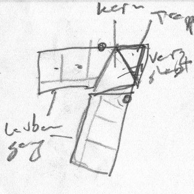 <!-- 400 -->

AHA-Termin Anja Doris Nathalie Matthias: Freitag 20.11 zwischen 12:45 und 17 Uhr oder Dienstag 24.11 ab 16:30.

Kennenlerntag bei Moni und Jeremy 28.11 17:00.

Kennenlerntag bei Barbara 11.12 18:00.

<!--

### Otto

- Adaptive Loesung von 150 bis 300 quadratmeter Wohn raum
- Zentrum und Peripherie
- Wesentliche Leistung: Zentrum definieren, das verschiedene Arten von Peripherie verbinden kann

### Stefan Best 2020-11-22

- Feuer mit Ofenbank
- Stampflehm, Sonneneinstrahlung, Lehmradiatoren
- Innenwaende Lehm mit Lehmputz und Lehmfarbe
- Basler (Pariser) Waende, flexibel und mit gutem Schallschutz
- Schornstein isolieren, kalte Luft von aussen wenn nicht geheizt
- Aussenbereiche vergroessern: Halbaussen vor der Kueche, Laubengaenge vergroessern
- Jeremy waere bereit auf Privatraum zu verzichten; Voraussetzung: meine Beduerfnissse sind im Gemeinschaftsbereich erfuellbar
- Wieviel Gemeinschaft will jede?
- Voraussetzung: Zeit fuer Gemeinschaft; keiner arbeitet 100%;

### Waldrain Fragen

- ich will mehr abstand gewinnen und mich weniger reinhaengen; es belastet mich, meinen schlaf, meine beziehung, meine lebensfreude
- wollen wir holzbau + lehm?
- streichen wir die n.n.?
- behalten wir araceli + joerg?
- wie reagieren wir darauf, dass es thomas voraussichtlich nicht mehr gibt bei AHA?
 die abmachungen beruhten vor allem auf ihn. wenn er aussteigt veraendert das etwas.
- sind wir uns einig, dass es moeglichst einfach und moeglichst guenstig sein soll, oeko natuerlich?
- wie sicher steht deine entscheidung?
- konsens finden von 10-15 wichtige punkte, in denen wir uns alle einig sind, und diese dem mathias kommunizieren

### vorschlag an aha zum hof

- suedgebaeude streichen:
 barbara und jeremy zu den n.n.; b. will westsicht
 yoga und sitzbereich streichen
 platte wo baeume durchwachsen eliminieren
 hof oeffnen nach sueden und westen
- ostgebaeude moeglichst weit nach norden ruecken 
 tiny haus an die suedseite verschieben
- eingangsbereich schliessen, mit huelle versehen, glas, holz
- kueche mit gemeinschaftsbereich und mehrzweckraum vereinen
 direkter anschluss an terrasse oder balkon oder garten damit erweiterbar fuer tanzflaeche usw.

-->

### AHA Praesentation 2 2020-12-16

Mittwoch 16.12 18:00 praesentiert Matthias die ueberarbeiteten Vorentwuerfe:

- [Praesentation 2 (PDF)](doc/aha/2020-12-16_aha_praesentation2_lph2.pdf)

Ich habe euch den Mitschrieb des letzten Termins abgetippt.
Eine kurze Zusammenfassung von der Präsentation ist ebenfalls dabei.
Es lohnt sich also, das Protokoll nochmal durchzulesen, wenn ihr parallel dazu die Pläne studiert.
Des Weiteren findet ihr die 3D-Modelle angehängt:

- [Protokoll 2 (PDF)](doc/aha/2020-12-22_aha_protokoll_2.pdf)
- [3D Modell Hof 2.0](https://a360.co/2WVopuo) ([Original-Rhino-Datei](doc/aha/2020-12-29_3d_hof.3dm))
- [3D Modell Haus](https://a360.co/3aXp3QB) ([Original-Rhino-Datei](doc/aha/2020-12-29_3d_haus.3dm))
- [3D Modell Dorf](https://a360.co/38Mb4dl) ([Original-Rhino-Datei](doc/aha/2020-12-29_3d_dorf.3dm))

<!-- recording in /Users/jta/Documents/Zoom/2020-12-16 16.43.21 Jeremy Tammik's Personal Meeting Room 2772770000/ -->

<!--
Jeremy:

- keinen garten im nordosten
- aushub und terrassen
- flexibilitaet noch allgemeiner
- waschraum, keller, ebenerdiger anschluss in den keller
- waende nachtraeglich versetzen, oeffnen, schliessen
- abtrennung von nordostecke -- lieber eine groessere gartenflaeche im suedwesten
- ist das nicht dreigeschossig?
- wollen wir einen lift?
- wieviel gemeinschaftsbereich ist erwuenscht?
- wer will eigenes bad?
- stauraum in umzugskisten verteilen
-->

### Waldraintreffen Jan-Maerz 2021

- [Waldraintreffen und Lift 2021-01-02](#waldraintreffen-und-lift-2021-01-02)
- [Waldraintreffen 2021-01-10](#waldraintreffen-2021-01-10)
- [Waldraintreffen 2021-01-17](#waldraintreffen-2021-01-17)
- [Waldraintreffen 2021-01-26](#waldraintreffen-2021-01-26)
- [Waldraintreffen 2021-02-06](#waldraintreffen-2021-02-06)
- [Waldraintreffen 2021-02-14](#waldraintreffen-2021-02-14)
- [Waldrainbrainstorming 2021-02-17](#waldrainbrainstorming-2021-02-17)
- [Waldraintreffen 2021-02-28](#waldraintreffen-2021-02-28)
- [Tiny House Lieferung](#tiny-house-lieferung)
- [Waldraintreffen 2021-03-07](#waldraintreffen-2021-03-07)
- [Waldraintreffen 2021-03-14](#waldraintreffen-2021-03-14)
- [Waldraintreffen 2021-03-21](#waldraintreffen-2021-03-21)
- [Holzen am 27 Maerz](#holzen-am-27-maerz)
- [Waldraintreffen 2021-03-28](#waldraintreffen-2021-03-28)


#### Waldraintreffen und Lift 2021-01-02

Zoom Samstag 17 Uhr.

Notizen zum Thema Naehe und Anbindung an die Gemeinschaftsraeume:

- Anja: Suedfront, ebenerdiger Gartenausgang, Terrasse, ganz oben sein (vor dem gemeinsamen Treffen)
- Doris: Naehe zum Gemeinschaftsraum
- Barbara weg vom Gemeinschaftsraum
- Nathalie naeher zum Gemeinschaftsraum
- Lift fuer Elektrorollstuhl oder A + J benoetigt ca. 0.9 * 1.3 meter

#### Waldraintreffen 2021-01-10

Zoom Sonntag 17:30 Uhr. Mathias kommt ab 18 uhr dazu.

<!--
Keine Konkurrenz der Modelle, aber wichtige Ideen, die beruecksichtigt werden wollen.

J hat gewisse Erfahrung im Bau und im Hanggelaende und moechte Vor- und Nachteile beruecksichtigt wissen:
Oekologie, Heizsystem, Materialien, Hanglage, Terrassierung, Gartengestaltung, Naturanbindung, Bauvorschriften.

AHA fragen, ob sie ueberhaupt jemals selbst was abgeklaert haben.

J muss unterschreiben.

J zahlt Zinsen.

J braucht Pacht.

Zwei Finanzplaene: Kaufen oder Pachten?
Kostenverteilung

Bitte vorher ueberlegen:

Was willst du teilen?
Wie oekologisch willst du sein?
Willst du eine eigenen Waschmaschine?
Brauchst du einen Parkplatz?
Willst du in der Ebene drei Meter unterhalb vom Carl-Keller-Weg deine Raeume haben?
Wenn da jemand wohnt, wo kommen dann die Stellplaetze hin.
-->

- Doris moechte gerne reinkommen und plums in die Gemeinschaft landen
- Add earth terrace along top edge of house, in the 5 m strip alng CKW
- Wir schreiben ein Konzept fuer einen Weg vorwaerts in der Vorentwurfsplanung
- Next meeting Sunday 17.1 at 17:30

#### Waldraintreffen 2021-01-17

Zoom Sonntag 17:30 Uhr.

Anwesend: Anja, Barbara, Doris, Jeremy, Michael, Moni

Kurzer Austausch ueber Jeremy's Trauer und Resignation.

Naechstes Treffen leibhaftig in Pratteln 26.1 um 18:30.

#### Waldraintreffen 2021-01-26

Leibhaftig in Pratteln am 26.1 um 18:30.

<!-- Um 17:55 sagen Anja und Nathalie die leibhaftige Teilnahme ab und kommen per Zoom dazu. -->

Anwesend: Barbara, Doris, Jeremy, Michael, Moni; per Zoom: Anja und Nathalie

- Jeremy kann und will so nicht weitermachen
- Was ich mir wuensche: offenes Ohr, konstruktive Zusammenarbeit, Vertrauen, klarer Auftrag
- Gemeinsam Verantwortung fuer Grundstueck tragen: Schnee raeumen, Gehweg pflegen
- Hausform und Flaechen festlegen fuer Bauvoranfrage
- Auftrag an Architekten, Bauvoranfrage einzureichen
- Finanzplan und definitive Zusage von jede/jedem

#### Waldraintreffen 2021-02-06

Leibhaftig in Loerrach am 6.2 um 11:00.

Anwesend: Barbara, Jeremy, Michael, Moni; per Zoom: Anja, Doris und Nathalie

- Diskussion ueber die Bedenken von Jeremy
- Beschluss: wir machen weiter; genau wie steht noch nicht
- Joerg hat seine Genossenschaftsmitgliedschaft gekuendigt
- Nathalie pausiert ab jetzt; ihr Wunsch nach 30 Quadratmeter Privatbereich mit Nasszelle bleibt bestehen
- Wir treffen uns Morgen, am Sonntag 7.2 um 11 Uhr, um uns und das Grundstueck wieder mal zu erleben
- Ab jetzt regelmaessiges Treffen jeden Sonntag um 19 Uhr; erstes Mal am 14.2
- Bis zum 14.2 ueberarbeitet jede einzelne ihren Eintrag im Wunschkatalog
- Diskussion wie weiter mit der Genossenschaft wird fortgefuehrt

#### Waldraintreffen 2021-02-14

In Loerrach am 14.2 um 19:00.

Anwesend: Michael, Jeremy, Moni; per Zoom: Barbara und Doris

- Michael und Jeremy haben sich vorher getroffen und andere Bautenbeispiele am Huenerberg angeschaut
- Michaels Wunschvorstellung: er haelt sich viel im Aussenbereich auf, es gibt eine Feuerstelle,
er kann wenige Schritte weg vom WoMo durch eine Schiebetuere das Haus betreten, das dadurch eine gute offene Verbindung nach Aussen hat, befindet sich sofort im Gemeinschaftsbereich, der nahtlos in die Gemeinschaftskueche uebergeht
- Das WoMo steht an der Nordseite des Hauses und des Grundstueckes; zwei gewichtige Gruende dafuer:
an der Suedseite wird die Sicht durch viele Baeume verstellt, und an der Nordseite ist der Zufahrtsweg schon vorhanden
- Barbara wuenscht sich eine Wohnung mit 50 qm; das war schon immer so ausgesprochen aber ging irgendwann unter
- Wir schauen mal, ob wir unsere benoetigten Flaechen in einem einfachen Rechteck von 8 Meter Tiefe und 22 Meter Laenge unterbringen koennen; ach nee, das waere ein Fusabdruck von 22 * 8 = 176 qm... vielleicht ein bisschen klein... mal schauen, ob's doch geht

Naechstes Treffen am Mittwoch den 17.2 um 19:00 Uhr, um gemeinsam und konkret mit Brainstorming und Spass eigene Machbarkeitsstudien zu skizzieren.

Vor- und Nachteile von allen entscheidenden Punkten festhalten.

#### Waldrainbrainstorming 2021-02-17

In Loerrach am 17.2 um 19:00.

Anwesend: Barbara, Michael, Moni, Jeremy; per Zoom: Doris

Wir hatten beim letzten Treffen am 14.2 entschieden, dass wir von Barbaras Vorschlag ausgehen wollen, zu schauen, ob wir alle unsere Wuensche gut unterbringen koennen in einem Rechteck mit Grundflaeche 200 qm.

Ich hatte vorab ein paar [Gedanken zum Thema Hausform](#hausform) notiert.

Bei unserem Treffen haben wir uns erstmal der Einfachheit halber auf ein noch kleineres Rechteck von 22 x 8 Meter konzentriert, also nur 176 qm Grundflaeche.

Darin koennen wir alle unsere benoetigten Flaechen unterbringen:

- EG: Anja 60, Doris 75, Flur 40
- OG: Araceli 75, Flur 40, Nathalie 30, N.N. 30
- DG: Barbara 50, Jeremy 30

<div jtgallery="2021-02-17_rechteck,1_eg,2_og,3_dg"></div>

- Skizze mit Fussabdruck, Raeume im EG, zwei WoMo-Varianten und die ersten drei Baumstaemme:
[PDF](doc/sheet/2021-02-25_03_baum_drei.pdf)
&ndash; [3D](https://a360.co/3uuO6BH)

<!--

/j/doc/house/huenerberg/waldrain/rvt/2021-02-18_07_womo_mass.rvt

https://myhub.autodesk360.com/ue29c31db/g/projects/2016061734997101/data/dXJuOmFkc2sud2lwcHJvZDpmcy5mb2xkZXI6Y28uSlhiVVkxZzhSTnlHRFlfYjVwVTd4UQ

[PDF](doc/sheet/2021-02-18_07_womo_mass.pdf) &ndash; [3D](https://a360.co/2M4ft4g)

-->

Balkons, Terrassen, Aussentreppen und andere Aussenbereiche koennen wir nach Belieben hinzufuegen.

Die Form ist auch anpassbar.

Doris hat angefangen, eine eigene Skizze anzufertigen. Da freu ich mich schon drauf!

Weiter haben wir neue konstruktive Gedanken zu dem [WoMo-Stellplatz](#womo-stellplatz) geheckt und besprochen.

Naechstes Treffen am Sonntag 28.2 um 19 Uhr.

#### Waldraintreffen 2021-02-28

Anwesend: Barbara, Michael, Moni, Jeremy; ab 19:00 Uhr per Zoom: Anja

Michael und Jeremy haben sich um 17:00 Uhr getroffen und vor Ort eine
neue [WoMo-Stellplatzidee](#womo-stellplatz) in der Nordwestecke entwickelt.
Das WoMo in der Nordostecke, direkt angrenzend an das Nordende vom EG des Hauses, deckt doch zu stark die Nordfassade ab.

Karin hat Interesse an uns bekundet und moechte uns kennenlernen.

Im Zoommeeting haben wir Anja berichtet, was in den letzten Wochen besprochen wurde.

Jeremy hat die rechteckige Machbarkeitsstudie vom letzten [Treffen am 17.2](#waldrainbrainstorming-2021-02-17) weiterentwickelt:

- Den [gesamten Baumbestand](#baumbestand) erfassen
- Verbesserte WoMo- und Tiny-House-Modelle
- Den neuen [WoMo-Stellplatz](#womo-stellplatz) und das Tiny House einzeichnen
- Die restlichen Privatraeume erfassen
- Gesamtwohnflaeche und -Volumen bestimmen

Neue Skizze mit alle neun vermessene Baumstaemme, neue WoMo-Variante, Tiny House, 176 qm Fussabdruck, alle Raeume im EG+OG+DG, Raumtabelle mit Wohnflaeche und Bauvolumen:

- [PDF](doc/sheet/2021-03-02_06_dg_rooms.pdf)
&mdash; [3D](https://a360.co/3q9MKsO)

Eine neue Idee ergibt sich beim Betrachten der Westansicht
(die DG-West-Wand ist dort durchsichtig, damit man besser hineinschauen kann):

- Im DG zwischen Barbara und Jeremy einen schmalen Gemeinschaftsflur und Treppenaufgang einfuegen
- Zwischen dem Nord- und dem Sueddach einen schmalen Gemeinschaftsdachbalkon und einen weiteren Treppenaufgang dorthin einfuegen

<a name="waldraintreffen-2021-02-28-2"></a>

Da wir das WoMo nicht mehr in der Nordostecke angenzend am EG plaziert haben, koennten wir das gesamte Haus ein Stueck weiter nach Norden verschieden, um mehr Freiraum an der Suedseite zu gewinnen.
Das koennte so aussehen:

<!--

https://myhub.autodesk360.com/ue29c31db/g/projects/2016061734997101/data/dXJuOmFkc2sud2lwcHJvZDpmcy5mb2xkZXI6Y28uSlhiVVkxZzhSTnlHRFlfYjVwVTd4UQ

- [PDF](doc/sheet/2021-03-05_04_dachbalkon.pdf)
&mdash; [3D](https://a360.co/2Ptj11a)

-->

- [PDF](doc/sheet/2021-03-05_04_shorter_roof.pdf)
&mdash; [3D](https://a360.co/3qe95p2)

Zufahrtsweg markiert und zwei weitere WoMo-Plazierungsversuche:

- [PDF](doc/sheet/2021-03-06_04_womo_3.pdf)
&mdash; [3D](https://a360.co/3kPv8kK)

WoMo vor dem Keller, Terrassen auf Carl-Keller-Weg und EG-Niveau im Sueden:

- [PDF](doc/sheet/2021-03-14_06_womo.pdf)
&mdash; [3D](https://a360.co/3qHljqB)

<a name="waldraintreffen-2021-02-28-3"></a>

Terrasse UG mit WoMo und Karin + N.N. im OG:

- [PDF](doc/sheet/2021-03-20_02_added_karin.pdf)
&mdash; [3D](https://a360.co/3c3pMj6)

Balkons und Treppenhaus:

- [PDF](doc/sheet/2021-03-24_03_added_stairs.pdf)
&mdash; [3D](https://a360.co/2QCVVG3)

Solarstudie mit Schnappschuss am 25.3 um 10:00 Uhr Vormittags, Ansicht aus Sueden und Nordwesten (anklicken zum vergroessern):

<div jtgallery="2021-03-25_solar_study,sued.png,nordwest.png"></div>

- [PDF](doc/sheet/2021-03-25_01_solar_study.pdf)
&mdash; [3D](https://a360.co/31jl1vz)

Wir muessen unbedingt im Detail miteinander unsere Wuensche klaeren zu wichtigen Wohn-, Bau- und Lebensaspekten wie Balkons, gewuenschte Ein- und  Aussichten, Verkehrswege, Zugang zu den Privatbereichen, Treppen, Fenster, Tueren, Gemeinschaftskueche und -Bad.

<!--

Wir haben viele weitere offene Punkte zu diskutieren:

- Finanzen
- Gruppengroesse; Karin? Araceli? N.N.?

Ausserdem zu diskutieren: Westfluegel ja/nein?
Eher nein, weil wir momentan nur dort einen Platz fuer den WoMo sehen, wo er nicht all zu massiv wirkt.

-->

#### Tiny House Lieferung

Am Mittwoch der 3. Maerz ist das Tiny House geliefert worden.

Zufaellig konnten Anja, Doris, Lukas und Karin auch vorbeikommen und sich treffen.

Anwesend: Anja, Barbara, Doris, Karin, Lukas, Michael, Moni, Jeremy und die Kaltenbachs.

Anjas und Jeremy haben die Reste von der Markierung des Umrisses vom Hof 2.0 Entwurf begutachtet.

#### Waldraintreffen 2021-03-07

Anwesend: Barbara, Karin, Michael, Moni und Jeremy.

Karin stellt sich vor.

Wir besprechen die aktuelle Situation mit Genossenschaft und Finanzen, bzw. den Bedarf nach Finanzplan, Kostenverteilungsplan und Verbindlichkeit.

Oekologie; wollen wir einen Mindeststandard festlegen?

Beispiele:

- Gemeinsame Waschmaschine, eine einzige gemeinsame Waschkueche
- Auf eigenen Backofen verzichten, Backofen in der Gemeinschaftskueche nutzen
- Mobilitaet: Carsharing

Wir muessen demnaechst die Finanzplanung besprechen.

Wir beschliessen, den naechsten Termin am kommenden Sonntag den 14.3 um 19 Uhr dem Thema Finanzen zu widmen.

Jeremy hat das rechteckige Modell weiterentwickelt (siehe Varianten in
den [Notizen vom letzten Treffen](#waldraintreffen-2021-02-28-2)) und
mit Rene neue Ideen besprochen zu den Themen [WoMo-Stellplatz](#womo-stellplatz)
und [Wasserwaermespeicher](#wasserwaermespeicher).

#### Waldraintreffen 2021-03-14

Thema: Finanzen und Verbindlichkeit.

Anwesend: Araceli, Barbara, Michael, Moni und Jeremy leibhaftig; Anja, Doris und Karin online.

Vor den Finanzen besprachen wir ein paar Fragen und Antworten von Araceli:

- Ist die Genossenschaft eingetragen (so lange es nicht so ist, haften wir mit dem Privatvermögen)?
Falls nicht, wann wird es eingetragen sein?
<br/>&mdash;
Finanzplan fehlt und deswegen kann sie noch nicht eingetragen sein.
Nach der Einreichung muss der Finanzplan beurteilt werden.
Wenn er akzeptiert wird, kann die Genossenschaft eingetragen werden.
Momentan steht dafuer kein Termin fest.

- Wie ist das Verhältnis zu den Architekten?
Sind sie weiter engagiert?
Ist die Kybernetik immer noch ein Thema?
<br/>&mdash;
Sie warten auf die Erwiderung vom letztem Entwurf.
Die Genossenschaft muss sich darueber klar werden und entscheiden, was sie genau wuenscht.
Wenn wir ihnen das mitgeteilt haben, machen sie weiter.
Kybernetik ist noch Thema aber noch nicht Konkret geworden.
Matthias hat Kontakt gehabt mit Delzer ueber andere Projekte.
Wir wollen es unbedingt in die Planung mit einbeziehen.

- Wie viele Menschen sind Genossenschaftler?
Sind immer noch die gleichen dabei?
Wer kommt dazu?
<br/>&mdash;
Ausser Jörg sind alle weiter dabei.
Karin ist neue Interessentin, jedoch noch nicht Genossenschaftlerin.

- Man plant ein Ökologisches Haus.
Ist es eine Heizung vorgesehen oder nur Holzöfen?
<br/>&mdash;
Jeremys wuenscht sich einen kybernetischen Ansatz.
Auf jeden Fall keine fossilen Brennstoffe; sie sind in der Schweiz ab 2023 im Neubau sogar komplett verboten.
Uebliche Alternativen sind [Photovoltaik (PV)](#photovoltaik),
[Holzheizung (Pellet oder Stueckholz)](#wasserfuehrender-holzofen) und
Wärmepunpe (ca. 1/3 Energie reinstecken, z.B. von PV, und 2/3 als Wärme nutzen).
Die Effizienz der Waermepumpe kann extrem gesteigert werden durch einen [Waermespeicher](#waermespeicher).
Das koennte eine Erdsonde sein, ein [Wasserwaermespeicher](#wasserwaermespeicher),
oder die [Erdterrassen](#waermekapazitaet-der-terrassen), die wir mit dem Kelleraushub anlegen koennten.
Alles noch in Planung.
Experten können kalkulieren was geht und was nicht.
Jedenfalls will man doch Heizung haben &nbsp; :-)

- Das Haus ist kleiner geplant worden.
Was hat sich verändert?
Falls Jörg und ich einziehen würden, wie viele Fläche ist für uns berücksichtigt worden?
<br/>&mdash;
Zur Zeit basteln wir an einer Machbarkeitsstudie mit 176 qm Fussabdruck rum.
Dort betraegt die Privatflaeche fuer Araceli und Joerg unveraendert 74 qm.
Noch nicht ganz klar, ist noch in Arbeit.
Das [Raumprogramm](#raumprogramm) steht weiterhin unveraendert da.
Der letzte Entwurf mit 176 qm Fussabdruck ist einsehbar am Ende der Notizen
zum  [Waldraintreffen 2021-02-28](#waldraintreffen-2021-02-28).
Dort findet man auch das automatisch erzeugte Raumprogramm, in dem aber Karins Wunsch nach 55 qm noch nicht erfasst ist:

<center>
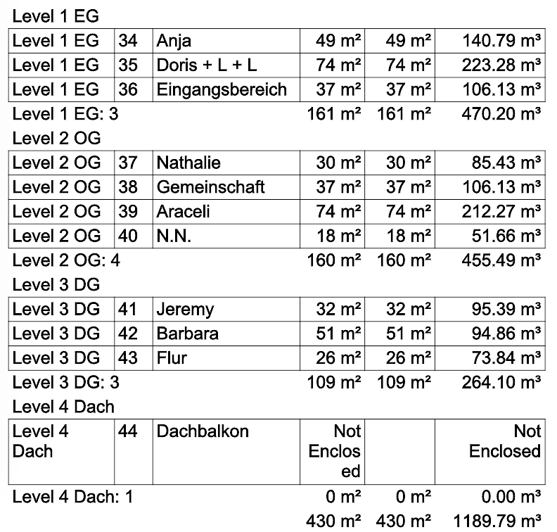 <!-- 792 -->
</center>

#### Finanzen

Wir haben den uralten Finanzplan ueberflogen.
Er wurde schon vor dem Grundstueckskauf als Machbarkeitsstudie entworfen.

Danach haben wir den allerersten, naiven Entwurf einer Kostenverteilung praesentiert.
Er wurde von Michael und Jeremy als Gespraechsgrundlage entworfen.
Es Bedarf noch viel gemeinsame Diskussion, um ihn so anzupassen, dass er einerseits eine realisische Finanzierung ermoeglicht und andrerseits fuer aller oekonomisch tragbar wird.

Beide Plaene sind in dem [groben Finanzplan](doc/genossenschaft/waldrain_finanz_jeremy.xlsx) enthalten,
aufgelistet in den [Waldraindokumenten](https://waldrain.github.io/#waldraindokumente).

<!--

Doris:

Liebe Walddrainer,
 
nachdem ich die Finanzplanung vom gestrigen Treffen etwas habe sacken lassen, möchte ich euch gerne meine Gedanken dazu mitteilen.
 
Ich muss gestehen, dass ich anfangs doch etwas enttäuscht und auch traurig war, wie ihr euch die anteilmässige Berechnung überlegt habt. Ich fühlte mich etwas aus dem Projekt raus "gemobbt". Es ist klar, dass ich mit 3 Personen mehr Platz benötige, aber als Alleinverdienerin auch alleine alles "stemmen" muss. Für mich kam dieser "Berechnungsschlüssel" ziemlich entgültig rüber und deshalb äussere ich hier die Enttäuschung.
 
Wenn ich diese Klarheit schon früher gehabt hätte, wie ich sie im November/Dezember ja schon nachgefragt hatte? (Ihr erinnert euch vielleicht ich hatte gebeten mir mitzuteilen, ob ein Betrag von €50'000,- bis 80'000,- überhaupt Sinn macht, wenn ich dafür dann mit einer höheren Kompensationsmiete einsteige? Ihr habt es nicht verneint, also bin ich davon ausgegangen, dass es möglich werden kann und ich bin dabei geblieben.)
 
Aber jetzt heisst es mindestens 30%(besser 50%) von €500'000,-, das sind mindestens € 150'000,- , da kann ich ganz klar sagen, dass ich da nicht mehr mithalten kann.
 
Vielleicht hat es auch diese Klarheit gebraucht, so dass ihr jetzt "kleiner" denken könnt. Der Wunsch ist da doch ziemlich gross, wie ich spüre und da passen wir als Familie vermutlich gar nicht rein. Bei so einem kleinen Projekt ist es auch schwieriger "sozial" zu denken und solche finanziellen Nachteile irgendwie ausgleichen zu können. 
 
Also alles gut, ich kann eure Gedanken sehr gut nachvollziehen, da ich verstehen kann, dass ihr voran kommen wollt und müsst, ich hoffe dass sich alles so verwirklicht, wie ihr es euch vorstellt.
 
Falls ich irgendetwas falsch interpretiert haben sollte, lasst es mich bitte wissen.
 
Ob und wie ich in der Genossenschaft verbleiben kann/möchte, werde ich mir noch überlegen, wenn das ok ist.
 
Herzliche Grüsse
 
Doris

Jeremy:

Liebe Doris,
 
In der Tat haetten wir viel frueher drueber klarheit schaffen muessen.
 
Das haben einige Leute von Anfang an immer sehr stark betont.
 
Es gibt noch mehr Aspekte, ueber denen wir mehrt Klarheit erlangen muessen, grmeinsam erarbeiten muessen.
 
Fuer mich sind die Berechnungsschluessel alles andere als entgueltig, das genaue Gegenteil davon.
 
Das ist ein allererster vollkommen naiver entwurf, damit irgendjemand irgenewann ueberhaupt irgendwas dazu sagen kann.
 
Wir sind eine gemeinschaft, oder beupten zu mindest, eine werden zu wollen.
 
Da muessen alle verantwortung uebernehmen und sachen ansprechen.
 
Irgendwie finde ich dass wir als gemeinschaft dauernd nur aller vor uns her schieben, seit einem jahr und laenger.
 
Lass uns endlich ueber alles reden.
 
Dazu gehoert auch zeit und energie.
 
Ich will absolut niemand rausmobben.
 
Ich will aber auch nicht dauernd fuer alles mehr als meinen anteil der verantwortung tragen.
 
jeremy

-->

#### Waldraintreffen 2021-03-21

Thema: Finanzen und Verbindlichkeit.

Anwesend: Barbara, Michael, Moni und Jeremy leibhaftig; Doris online.

Araceli hat am 20.3 ihren Ausstieg formlos per Email erklaert.

Von Anja und Karin haben wir nichts gehoert und wundern uns, wo sie bleiben.

Wir haben die Finanzierung, Kostenbeteiligung und weitere Planung bis zur Bauvoranfrage besprochen.

<!--
Der Hausentwurf mit Raumprogramm und der Kostenbeteiligungsplan ist aktualisiert:

- [PDF](doc/sheet/2021-03-20_02_added_karin.pdf)
&mdash; [3D](https://a360.co/3c3pMj6)
&mdash; [xls](doc/genossenschaft/waldrain_finanz_jeremy.xlsx)
-->

<!--
Ich glaube, wir koennen hier alle was lernen:

Bitte nicht im stillen kaemmerlein irgendwelche vorschnellen missverstaendlichen schluesse ziehen, sondern sprechen.

Die gemeinschaft entsteht, in dem wir darauf vertrauen.

Dazu gehoert austausch zuerst.

Ich bin sehr ueberrascht ueber die schnellen und entgueltigen reaktionen auf unseren allerersten versuch, konkret das thema finanzen anzugehen.

Was kostet es heutzutage, eine eigene wohnung oder ein haus mit garten in schoener lage zu kaufen?

Gemeinsam sind wir in der lage, etwas viel schoeneres fuer viel weniger geld zu schaffen.

Ich wuerde schaetzen, dass wir gemeinsam eine vergleichbare oder wesentlich hoehere qualitaet kreieren koennen fuer halb so viel privaten einsatz von jedem einzelnen, wie wenn jeder alleine fuer sich so ein projekt angehen wuerde.

Dass es nicht ganz ohne investitionen moeglich ist, war uns doch allen von anfang an klar.

Ich bin gerne bereit, mit jedem ueber ihre bedenken zu sprechen, einzeln oder gemeinsam.

Ohne jeglichen austausch und weitere gemeinsame gespraeche die segel zu streichen finde ich schade und unnoetig.
-->

#### Holzen am 27 Maerz

<!-- 
Weitere Eintraege in den [Doodle zum Holzen](https://doodle.com/poll/5a4ck7wgut6dc7xi) sind wilkommen.
-->

Am Samstag den 27.3 ordnen und lagern wir Holz von den gefaellten Baeumen.

- Anfang 11 Uhr
- 13-14 Uhr Mittagspause
- 16 Uhr Kaffeepause
- 18 Uhr Feuer und Grillen

Dazwischen schauen wir mal, was wir machen wollen.

Austoben ist moeglich, Baumhaus bauen, Riesenschaukel aufhaengen, Saegen, Hacken, Holz schichten, alte Zaeune und Metall wegraeumen, haeckseln, was ihr wollt.

Kinder und Jugendliche sind besonders willkommen.

Bring was mit, wenn du willst.
M + J machen eine Suppe und besorgen Wuerste fuer die, die vorab daran Interesse bekunden.

Leute, es geht hier echt um die Wurst!

Angemeldet, mit  fuer die Wurst: Araceli, Barbara<sup>w</sup>, Daniel<sup>w</sup>, Jeremy<sup>w</sup>, Joerg<sup>w</sup>, Karen<sup>w</sup>, Karin<sup>w</sup>, Magnus, Michael<sup>w</sup>, Moni<sup>w</sup>

Am Tag vorher, Freitag den 26.3, zieht Barbara ins Tiny House ein.

Jeremy hat das rechteckige Modell weiterentwickelt, mit Michael den WoMo-Stellplatz diskutiert, Balkons und ein Treppenhaus eingebaut und eine erste Solarstudie ausgefuehrt: siehe [weitere Varianten der Machbarkeitsstudie in den Notizen vom Treffen am 28.2](#waldraintreffen-2021-02-28-3).

Anwesend: Araceli, Barbara, Caro + Toby + Max + Paul, Daniel, Jeremy, Joerg, Karen, Karin, Magnus + Janou + Julius + Laurian + Moritz, Michael, Moni

Wir haben viel geschafft, viel gequatscht, es nett gehabt und Gemeinschaft genossen.

#### Waldraintreffen 2021-03-28

Anwesend: Jeremy live und Anja per Zoom, spaeter Michael, Barbara, Karin per Zoom, Doris per Zoom.

Moni hat das neue
Buch [Echter Wohlstand](https://viviandittmar.net/buecher/echter-wohlstand) von Vivian Dittmar
gekauft, und Jeremy liest mit Begeisterung mit.
Die Lektuere beeinflusst und begeistert uns tief und verstaerkt das Interesse und Beduerfnis, in Gemeinschaft zu leben und Gemeinschaft zu foerdern.

Jeremy moechte auch auf die neuen Eintraege zum Thema [Wohnform Cluster-WG](#wohnform-cluster-wg) hinweisen,
und wuerde gerne einige aspekte dieser Wohnform konsequenter und systematischer in Waldrain aufgreifen.
Z.B. koennte man die Gemeinschaftsflaechen an der Suedfront ansiedeln, die gesamte Erschliessung in Laubengaengen an der Westfassade gestalten, und alle privaten Wohnbereiche ziemlich systematisch aneinanderreihen mit grossen Fensterfronten nach Osten und Westen, ein bisschen wie wie bei Yvonne im Erlenmatt.

Jeremy rechnete mit Anja zusammen aus, dass sie sich mit ihren derzeitigen finanziellen Miteeln sehr wohl sinnvoll an die Gesamtprojektkosten beteiligen kann.
Das koennen wir gerne noch detaillierter wiederholen, und das biete ich jedem einzelnen an.


### Aktuelles und Zukuenftiges

- [Zufahrtsweg](#zufahrtsweg) fertig
- Skizzen vom [Tiny House](#tiny-house) und [Michaels Wohnmobil](#wohnmobil)
- Rasen auf Johannas Wiese angesaet
- Treppe zum Zufahrtsweg hoch
- Telefonat ueber [Buchhaltung](#buchhaltung) mit Herrn Voss vom [ZdK](#zdk)
- Telefonat und Besuch zum Thema [Saegerei](#saegerei) mit [Axel und Ruben Hugenschmidt](http://www.schreinerei-hugenschmidt.de)
- Emailaustausch mit Dr. Monika Hall, Fachhochschule Nordwestschweiz FHNW, Hochschule für Architektur, Bau und Geomatik, Institut Energie am Bau:
 *Grundsätzlich können wir uns vorstellen bei einem Forschungsprojekt mitzuwirken, z.B. mit thermischen Simulationen oder aber auch mit einem Monitoring.*
- Andere [Unistudien](#unistudien) ansprechen
- Buergermeister Joerg Lutz hallo sagen?
- Joerg: Verursacherprinzip und Zwischenzaehler (zu einem (viel) spaeteren Zeitpunkt besprechen?)
- Barbara: Besprechen, was mit dem Tiny House nach Baufertigstellung passiert
- Barbara: Wenn die Genossenschaft bei der GLS-Bank ein Geschäftskonto eröffnen will, geht das telefonisch mit dem Aussenvertreter der Genossenschaft.
- [Weitere Tagesordnungspunkte online editieren](https://docs.google.com/document/d/1S0zc8p3dsaz-NswACclspQ7G_7mXiYzR6XHd1o2LSBg/edit?usp=sharing)


### Fragenkatalog

Um unser Raumprogramm zu definieren, erarbeiten wir einen Wunsch- und Fragenkatalog
([txt](/doc/genossenschaft/waldrain_wuensche_fragebogen.txt),
[csv](/doc/genossenschaft/waldrain_wuensche_fragebogen.csv),
[tsv](/doc/genossenschaft/waldrain_wuensche_fragebogen.tsv),
[schnappschuss als pdf](doc/genossenschaft/waldrain_wuensche_fragebogen.pdf)).

Bitte ausfuellen und gerne auch mit eigenen neuen Fragen ergaenzen:

- [Waldrain Wuensche](https://docs.google.com/spreadsheets/d/1Ghl7LC5yZ14B5gDlxABWJrWnH_5UxBBB_vWW0tdEz3o/edit)

Bitte alle Fragen mit einer Zahl, J/N oder ein geegnetes Kuerzel beantworten, so dass die ganze Chose uebersichtlich bleibt.

Du kannst auch sehr gerne neue Zeilen eintragen mit Fragen ueber weitere Aspekte die dir wichtig sind.

Neue Fragen bitte auch so gestalten, das diese Art von Antwort moeglich und sinnvoll ist.
 
Bitte vorsichtig, damit keine bestehenden Eintraege beschaedigt werden!

### Raumprogramm

Ich habe aus unseren [Wunschkatalog](#fragenkatalog) eine vereinfachte Teilinformation entnommen, mit dem Ziel, auf ein Raumprogramm hinzuarbeiten.
 
Am wichtigsten dabei ist das Nachspueren von jedem, was sie wirklich will und braucht.
 
In dieser Uebersicht werden Keller, Verkehrsraeume, Atelier, Werkstatt, Balkon usw. nicht aufgefuehrt.
 
Ich habe Doris, Lara und Lukas als WG-Mitglieder eingeordnet.
 
Ich habe fuer die WG 4 WCs mit Dusche vorgesehen, ein grosses luxurioeseres Badezimmer, 20 qm Kueche und 30 qm Wohnzimmer.
 
Ich habe noch zwei zusaetzliche WG-Bewohner vorgesehen, um Flexibilitaet und Unvorhergesehenes abzufangen.
 
Damit sind wir 8 Erwachsene, zwei Kinder, und 2 NN. Die zwei NN koennten auch eine Familie sein, oder sonst was.
 
Damit ergibt sich folgende aktuelle vereinfachte Uebersicht:
 
<table class="r">
<tr><td style="font-weight:bold">8 Erw + 2 Ki + 2 NN</td><td>qm</td><td>Zi</td><td>qm</td><td>Kue</td><td>qm</td><td>Bad</td><td>qm</td><td>WC</td><td>qm</td></tr>
<tr><td>Anja</td><td>60</td><td>1</td><td>42</td><td>1</td><td>12</td><td>1</td><td>6</td><td>0</td><td>0</td></tr>
<tr><td>Araceli + Joerg</td><td>73</td><td>3</td><td>55</td><td>1</td><td>12</td><td>1</td><td>6</td><td>0</td><td>0</td></tr>
<tr><td>Doris + Lara + Lukas</td><td>75</td><td>4</td><td>75</td><td>0</td><td>0</td><td>0</td><td>0</td><td>0</td><td>0</td></tr>
<tr><td>Barbara</td><td>40</td><td>2</td><td>40</td><td>0</td><td>0</td><td>0</td><td>0</td><td>0</td><td>0</td></tr>
<tr><td>Jeremy</td><td>30</td><td>1</td><td>30</td><td>0</td><td>0</td><td>0</td><td>0</td><td>0</td><td>0</td></tr>
<tr><td>Michael</td><td>0</td><td>0</td><td>0</td><td>0</td><td>0</td><td>0</td><td>0</td><td>0</td><td>0</td></tr>
<tr><td>Nathalie</td><td>35</td><td>2</td><td>35</td><td>0</td><td>0</td><td>0</td><td>0</td><td>0</td><td>0</td></tr>
<tr><td>N.N.</td><td>30</td><td>1</td><td>30</td><td>0</td><td>0</td><td>0</td><td>0</td><td>0</td><td>0</td></tr>
<tr><td>N.N.</td><td>40</td><td>1</td><td>40</td><td>0</td><td>0</td><td>0</td><td>0</td><td>0</td><td>0</td></tr>
<tr><td>Gemeinschaft</td><td>75</td><td>1</td><td>30</td><td>1</td><td>20</td><td>1</td><td>15</td><td>4</td><td>10</td></tr>
<tr><td style="font-weight:bold">Total</td><td>458</td><td>16</td><td>377</td><td>3</td><td>44</td><td>3</td><td>27</td><td>4</td><td>10</td></tr>
</table>

- <span class="b">Zi</span> heisst Zimmer, auch das Wohnzimmer der Gemeinschaft. Die Spalte rechts daneben sind die qm der Zi.
- <span class="b">Kue</span> heisst Kueche. Die Spalte rechts daneben sind die qm der Kue.
- <span class="b">Bad</span> heisst grosses Bad.
- <span class="b">WC</span> heisst WC, kann auch eine Dusche enthalten.
 
Bitte schaut und spuert nach, ob diese Angaben sich decken mit dem, was du in der Wunschliste angegeben hast.
 
Viel wichtiger, natuerlich: bilden sie deine Beduerfnisse und Wunesche ab?
 
Den emotionalen Anforrderungskatalog an dein Zuhause?
 
Bitte fragt, wenn was unklar ist.
 
Natuerlich werden wir diese Daten nochmal ganz genau durcharbeiten, wenn wir mit den Architekten den Workshop machen.

Diese Uerbersicht ist Teil des o.g. [Fragenkatalogs](#fragenkatalog) und kann dort editiert werden.
Du kannst dort selbst Aenbderungen anbringen.
Sag mir bitte Bescheid, wenn du das tust, damit ich die Tabelle hier entsprechend aktualisieren kann.

Weiterfuehrende Infos:

- [Wikipediaartikel zum Thema Raumprogramm](https://de.wikipedia.org/wiki/Raumprogramm)
- [Das Raumprogramm selber erstellen &ndash; Anleitung](https://plan7architekt.com/i/das-raumprogramm-selber-erstellen-anleitung)

## Next Steps

- Planen eines gemeinsamen Wochenendes
- Einbetten des [Architekturentwurfs](#architekturentwurf) in eine [realitaetsgetreue Umgebung](https://www.cesium.com/cesiumjs)
- [Fragenkatalog](#fragenkatalog) aufraeumen und klarer gestalten
- Share contact list for all
- [Convert terrain model to STL](https://mgfx.co.za/blog/building-architectural-design/3d-printing-a-revit-toposurface-using-autocad)
- Michael d. G. schlaegt ein herausragendes Haus vor, mit viel Luft und Platz drunter. z.B., die ganze Nordgrenze geradeaus mit einer Fassde, die ebenerdig am C-K-W anfaengt und dann horizontal in die Lansschaft bis and die Grundstuecksgrenze im Nordwesten herausragt. Das will ich mal modellieren!
- Winkel vom Sueddach optimieren fuer Sonneneinstrahlung im Winter, und Norddach entsprechend flacher gestalten, und damit besser begruenbar?
- Lehmwaende mit Heizschlingen wie im Wandelhof
- Niedervolt Elektroleitungen legen fuer Beleuchtung mit 12 V statt Inverter auf 220 V und ueberall Netzgeraete, die wieder auf 12 V runtertransformieren
- Energiebedarf und -speicher
- Erdwaerme kontra waermepumpe in der luft?
- Zaun wieder schliessen, in ein Tor umfunktionieren
- Abwasserkanal am zufahrtsweg entlang, wasser sammeln?
- Nutzung des 5 meterstreifens am CKW?


- [WikiHouse](https://www.wikihouse.cc) is a digitally-manufactured building system.
It aims to make it simple for anyone to design, manufacture and assemble beautiful, high-performance homes that are customised to their needs &ndash; [PDF guide to unsing WikiHouse](https://files.cargocollective.com/c229869/WHouse_Guide_1.1.pdf).

Nik Mueller: mein Architektenfreund Martin Kärcher aus Zürich arbeitet in der Energieberatungtsfirma Walther und hat einen Kollegen, der sich mit konkreten Umsetzungen bei kniffligen individuellen Verhältnissen bestens auskennt. Er ist offenbar auch mit seinen über 60 Jahren voll begeistert das Beste wirtschaftlich tragbare aus einer Situation rausholen zu können: Andres Weber, [Amstein und Walthert](https://amstein-walthert.ch), Zürich.

#### Energiesparende Studentenwohnheim Architektur

- [ESA Wohnheim](https://esa.wohnheim.uni-kl.de)
- [Wikipediaartikel](https://de.wikipedia.org/wiki/Studierendenwohnheim_(ESA))
- [Interview mit Prof Dr Kai Tobias über das ESA](https://vimeo.com/456606536)
- [Energiesparende Studentenwohnheim Architektur](https://youtu.be/w59qOgt1JXU)


<!--

Liebe Waldrainer.

Moni hat es ein paarmal erwaehnt.

Ich bin extrem angestrengt.

Schon lange.

Ich habe heute gemerkt, wie traurig ich bin.

Und ich halte es nicht laenger aus.

Will nicht laenger das Gefuehl haben, kaempfen zu muessen.

Ich moechte mich ergeben.

Mein Impuls jetzt in diesem Moment ist, die Segel zu streichen und aus der Genossenschaft auszutreten.

Liebe Gruesse,

Jeremy

Die Plaene von AHA haben absolut nichts gebracht.

Sie diensten als Aufhaenger fuer unsere Such- und Findungsprozesse.

- [Massivholzhochhaus Cederhusen in Hagastaden, Stockholm, Schweden](https://www.folkhem.se/nyproduktion/stockholm/vasastan/hagastaden/cederhusen) mit Bauplaene von 1-3-Zimmerwohnungen

- Foto waagerecht 1 Meter unter Niveau Carl-Keller-Weg in der Suedost-Ecke vom AHA Hausentwurf Hof 2:

<div jtgallery="2021-01-25_hof_ecke_so,aha_entwurf_hof_ecke_suedost_1_meter_tief"></div>

https://a360.co/2YbknPt
2021-01-25_03_hof_area.rvt
2021-01-25_03_hof_area.pdf

- [minimal footprint flat](https://youtu.be/bA6C7QvTqZQ)
23sqm micro apartment, The Cairo Flat
2.9 m high
folding bed

- south wall parallel to north? &rarr; simpler roof

-->

