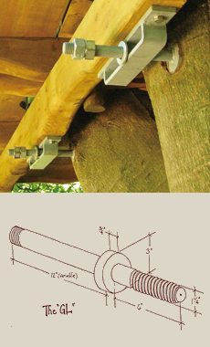

# Willkommen am Waldrain!

Carl-Keller-Weg 6, D-79539 Loerrach
&ndash; Gewann Wächtersholden am Huenerberg Suedwesthang
&ndash; [Ort](https://www.google.de/maps/place/Carl-Keller-Weg+6+79539+Loerrach)
&ndash; [Anfahrt](https://www.google.com/maps/dir//Carl-Keller-Weg+6+79539+Loerrach)

Hinweis: Ich befuerworte und foerdere Offenheit und Transparenz.
Meines Wissens werden in dieser Webseite keine Geheimnisse gelueftet.
Jede, die hier etwas Vertrauliches entdeckt oder sonstige Bedenken zum Inhalt hat, moege das bitte  melden, damit ich es schleunigst berichtigen kann.
Vielen Dank!

#### Inhaltsangabe

<div id="toc"></div>

## Charta

### Nachhaltiges Bauen

### Nachhaltiges Leben

### Nachhaltige Finanzierung

Die Finanzierung deckt folgende Kosten ab:

- Neubaukosten
- Unterhaltskosten
- Grundstueckskosten

Das Grundstueck wurde im Januar 2020 fuer 990.000 Euro erstanden und steht zum Selbstkostenpreis fuer einen Neubau zur Verfuegung.

Der Selbstkostenpreis ist bestimmt durch den Darlehensvertrag mit der Volksbank Dreilaendereck Loerrach.
Der Darlehenszinssatz richtet sich nach den Referenzzinssatz, definiert durch den Durchschnittsatz des Euribor Dreimonatsgeldes plus 1.5%.
Dieser betrug am 2020-01-14 -0,391%; am 2022-01-02 liegt er bei -0,583%.

Daraus ergeben sich zur Zeit Grundstueckskosten von 1.5 - 0.583 = 0.917% von Euro 990.000, also ca. 9100 Euro p.a. oder 760 p.m.

## Gemeinschaft

### Gemeinschaftsbildung

- [Erfolg und Scheitern von Gemeinschaften: Woran liegt’s?](https://beruehrungs-punkte.info/erfolg-und-scheitern-von-gemeinschaften-woran-liegts)
- [Der Gemeinschaftskompass &ndash; eine Orientierungshilfe](http://www.gemeinschaftskompass.de/de/gemeinschaftskompass-eine-orientierungshilfe-fuer-gemeinschaften) zeigt
sieben Aspekte auf, die als Orientierungshilfe dienen, um Gemeinschaften erfolgreich zu realisieren:
  - Individuen: Raum für Individuen und Bewusstsein für persönliche Weiterentwicklung
  - Gemeinschaft: Bewusste Pflege des Miteinanders
  - Intention: gemeinsame Ausrichtung
  - Struktur: Strukturen, die zu Zielen und Werten passen
  - Praxis: Sinnvolle Arbeitsorganisation, Kompetenz und Engagement für die Aufgaben, Geldflüsse
  - Ernte: Auswerten von Erfahrungen, Feiern, Wertschätzen
  - Welt: Kooperationen und achtungsvollen Umgang mit anderen gesellschaftlichen Akteuren

<center>
 <!-- 768 -->
</center>

<!-- 
Schuld oder Verantwortung – eine Frage der persönlichen Haltung
https://open-mind-akademie.de/schuld-oder-verantwortung-eine-frage-der-persoenlichen-haltung/

Gemeinschaft Erfolg & Scheitern Teil 1.mp3
-->

### Kommunikation und Entscheidungen

Wie kommunizieren wir?
Wie teilen wir uns mit und hoeren wir uns zu, so dass alle zu Wort kommen?
Wie finden Entscheidungen statt?

- [Ueberblick der Werkzeuge zum Arbeiten in virtuelle Teams](https://www.fairnetzt-loerrach.de/wp-content/uploads/2020/04/ratgeber_arbeiten-in-virtuellen-teams_v1.pdf)

Es gibt viele Arten zu Kommunizieren und gemeinsam Entscheidungen zu faellen, z.b.:

- Konsens
- Konsent, [Soziokratie](#soziokratie)
- [GFK gewaltfreie Kommunikation](https://de.wikipedia.org/wiki/Gewaltfreie_Kommunikation)
- [ZEGG Forum](https://www.zegg-forum.org), [Drei-ein-halb-minuten ZEGG-Forum Trailer](https://youtu.be/1SnDrfdiGZU)
- Demokratische Abstimmung, einstimmig, qualifizierte Mehrheit, uvm.

[Plum Village](https://plumvillage.org) bietet viel zum Thema friedliche Kommunikatiuon und achtsames Zuhoeren:

- Friedensvertrag
- Fuenf Achtsamkeisuebungen

Hier ist eine Auflistung einiger Werkzeugen und Techniken, die wir nutzen koennen (und z.T. auch tun):

- Emailverteiler
 &ndash; zur Zeit von Jeremy verwaltet
- Videokonferenzen via [Zoom](https://zoom.us)
 &ndash; siehe auch kurze [Anleitung zum Teilnnehmen an einem Zoom Meeting](https://youtu.be/hxa9wip7AvM) (3 Min)
 sowie eine laengere [detaillierte Zoom-Anleitung fuer Veranstalterinnen und Teilnehmerinnen](https://youtu.be/zCq53RH7StQ) (18 Min).
- Chat-Gruppe auf [Telegram](https://telegram.org)
 &ndash; Telegram ist so was aehnliches wie WhatsApp, aber die Daten und persoenlichen
 Informationen werden nicht so stark ausgewertet, weitergeleitet und missbraucht wie dort.
 Bitte registrieren und Registrationsdaten an Jeremy schicken, damit du in der Gruppe aufgenommen werden kannst.
- Gemeinsame Dokumente auf [Google Docs](https://docs.google.com), [Tabellen](https://docs.google.com/spreadsheets/u/0/), usw.
 &ndash; z.B. der [erste Fragenkatalog](#fragenkatalog)

Am [Treffen am 7. Juni](#waldrain-leibhaftig-2020-06-07) haben wir entschieden, vorerst hauptsaechlich per email zu kommunizieren.

### Soziokratie

[Grundkurs Soziokratie 3.0](https://youtube.com/playlist?list=PLwa9BQjRVbeIFku6kCT1pZKqjvldrHwcj) von Lino Zeddies:
In dieser Videoserie werden die Grundlagen für eine effektiv-partizipative Organisationsgestaltung durch die Methoden der Soziokratie 3.0 vorgestellt;
6 Teile, insgesamt ca. 40 Minuten, am Huenerberg 30 am 2021-11-04 gemeinsam geschaut.

Hartmut und Isabell haben Erfahrung mit Konsent und Soziokratie (engl. <a name="sociocracy"></a>sociocracy), wie
von [Sociocracy for All (SoFA)](https://www.sociocracyforall.org) propagiert:

Was ist eine **gute Entscheidung**?

Wenn alle, die davon betroffen sind, gut damit leben können?
In unserem Alltag ist das oft nicht der Fall.
Im demokratischen System hat sich deshalb die **Abstimmung** mit einfachen Mehrheiten etabliert.
Je stärker Bedürfnisse, Meinungen und Haltungen auseinander liegen, desto weniger liefert die Abstimmung Lösungen, mit den alle leben können.
Man denke nur an Entscheide, die mit knappen Mehrheiten getroffen werden.

Die **Soziokratie** bietet hier Verfahrensweisen, um alle Betroffenen in die Entscheidung einzubeziehen, deren Widerstände zu hören, in die Entscheidung einfliessen zu lassen und so am Ende die Entscheidung zu treffen, die für die Betroffenen gemeinschaftlich getragen wird.

Dazu gibt es einen einfachen **Prozessablauf**, der in der Gruppe eingeübt und von ihr getragen werden muss.
Neben dem reinen Grundsatzentscheid gibt es weitere Elemente der Organisationsentwicklung, wie die soziokratische Wahl und die soziokratischen Kreise.

Weitere Informationen liefert der Ueberblick [Was ist Soziokratie?](https://youtu.be/u3JJotOJ7kI) (25 Minuten).

### Konsum und Gemeinschaft

Eine Reportage des SRF zum Thema Konsum, mit einem interessanten Beispiel einer Gemeinschaft in der Schweiz:

- [SRF zwei im Kaufrausch](https://medien.srf.ch/-/srf-zwei-im-kaufrausch)

Der 3. Beitrag handelt von einer Gemeinschaft, die eine sehr neuen und recht extremen Form lebt.
 
Macht mut, solches zu wissen, finde ich!

### Leben ohne Besitz

Ein Beispiel, wie man ohne Hierarchie solidarisch und ökologisch miteinander leben kann, bietet die interessante 45-Minuetige Reportage und Dokumentarfilm vom Hessischen Rundfunk am 19.08.2020:

- [Leben ohne Besitz &ndash; Alles teilen](https://youtu.be/-gNb8u92WH4)

> Wenn Marcus ins Kino geht, nimmt er sich Geld aus der Gemeinschaftskasse. Braucht er Geld für einen Urlaub mit der Familie, entscheidet das Plenum, das tagt immer dienstags. Marcus findet das selbstverständlich, wie auch seine 80 Mitbewohner*innen in der Kommune in Niederkaufungen bei Kassel.
1986 gegründet, ist sie heute ein Unternehmen mit Bauernhof, Gemüseanbau, Hofladen, Schreinerei, Kita und Altenpflege. Viele Bewohner arbeiten in den kommuneeigenen Kollektiven, manche verdienen das Geld extern. Das Einkommen wird für die Gemeinschaft erwirtschaftet, einmal im Monat hängt der aktuelle Finanzstand aus, absolut transparent. Sie teilen Wohnungen und Wertvorstellungen. Das sind vor allem: Ohne Hierarchie solidarisch und ökologisch miteinander leben. Auf Besitz zu verzichten, nicht in Kleinfamilien zu leben, über alles gemeinschaftlich zu entscheiden &ndash; ist das ein Modell für die Zukunft? Neue, junge Mitbewohner zu finden, gestaltet sich gar nicht so leicht.
&mdash; [Kommune Niederkaufungen e.V.](https://www.kommune-niederkaufungen.de), Kirchweg 1, D-34260 Kaufungen

Der Beitrag kann uns alle evtl. ein wenig sensibilisieren, wie ein Gemeinsam-Gefühl, ein Teilen mit Ressourcen-Nutzen
und Nachhaltigkeit gelebt werden kann. 
Dieses Projekt gibt es schon 35 Jahre als Kommune mit seine 80 Mitbewohner*innen im hessischen Niederkaufungen
bei Kassel.

Zufaellig stiess ich auf einen weiteren Teil, ein Interview mit Jakob, 12 Jahre alt, der 25 Minuten <span class="b">aus der Kindersicht</span> ueber dieselbe Kommune berichtet:

- [Kinderleben in einer Kommune &ndash; Mit 80 Menschen unter einem Dach](https://youtu.be/6jABmkOLUIs):

> Jakob ist zwölf Jahre alt und lebt mit seinen Eltern und seiner Schwester Charlotte in einer riesigen Wohngemeinschaft.
In der 'Landkommune Niederkaufungen' wohnen 80 Menschen &ndash; vom Baby bis zum Senioren ist alles dabei.
In seiner Kommune gibt es keine Hierarchien.
Alles wird in Gemeinschaft entschiedeen.
Auch Auch beim Geld heisst es: alles gehört allen.

### Wohnform Cluster-WG

[Wohnen im Cluster – Ein Zukunftsmodell?](https://www.die-debatte.org/wohnungsmarkt-interview-prytula)

> Cluster-Wohnen, was ist das überhaupt?
<br/>&ndash; Eine Cluster-Wohnung ist eine Kreuzung zwischen Wohngemeinschaft und Kleinstwohnung, sozusagen eine „Luxus-WG“. Es gibt darin abgeschlossene Zimmer mit einem Bad und meistens auch mit einer kleinen Teeküche. Zusätzlich gibt es einen grösseren Wohnbereich mit einer Wohnküche, die gemeinschaftlich genutzt wird. So sind Cluster-Wohnungen in der Regel 150 bis 800 Quadratmeter grosse zusammenhängende Strukturen, die sich ohne grosse bauliche Veränderungen auf ganz verschiedene Art und Weise belegen lassen. Dadurch entsteht eine hohe Flexibilität.

[Gemeinschaftliches Wohnen im Cluster &ndash; Ein praktischer Leitfaden zum Planen, Bauen und Wohnen](https://www.netzwerk-generationen.de/fileadmin/user_upload/PDF/Downloads_brosch%C3%BCren-dokumentationen/2019-12-13_Broschuere_Cluster_web.pdf).

<!-- doc/gemeinschaft/2019-12-13_broschuere_cluster.pdf -->

Hartmut hat etwas gesucht zu den Grössen von Clusterwohnungen.
Im Kraftwerk 1 in der Schweiz leben 100 Leute auf 3260 qm in 11 Clusterwohnungen, vgl. das Konzept und die Bewerbug fuer das Koch-Areal [Koch, ein Zürcher
Originalrezept](https://www.kraftwerk1.ch/assets/20170916_koch_konzeptbewerbung-zeitung.pdf).
Das sind natürlich riesige Gebäude und sehr urban &ndash; ein wenig mehr Platz kann es bei uns ja schon sein...
 
Ein Zitat aus der Beschreibung von Cluster-Wohnungen im Artikel [Architektur für Wohnprojekte &ndash; Impulse für innovative Wohntypologien](https://www.schader-stiftung.de/themen/stadtentwicklung-und-wohnen/fokus/gemeinschaftliches-wohnen/artikel/architektur-fuer-wohnprojekte-impulse-fuer-innovative-wohntypologien):

> In der Konzeptionsphase für ein genossenschaftliches Mehrgenerationen-Projekt &ndash; Kraftwerk 2 in Zürich &ndash; suchte eine Gruppe Älterer nach neuen Wegen, um in der zweiten Lebenshälfte gemeinschaftlich und zugleich möglichst selbständig zu wohnen. Die Besonderheit: Die Gruppenmitglieder hatten bisher in Wohngemeinschaften gelebt. Sie wollten diese Wohnform grundsätzlich beibehalten, wünschten sich aber ein grösseres Mass an Privatheit, als es in einer klassischen Wohngemeinschaft der Fall wäre. 
 
> Der aus diesen konzeptionellen Vorüberlegungen entwickelte Wohnungstyp &ndash; die sogenannte Cluster-Wohnung &ndash; kombiniert Elemente eines gemeinschaftlichen Wohnprojekts mit denen einer Wohngemeinschaft. Innerhalb einer grossen abgeschlossenen Wohnung gruppieren sich separate Wohneinheiten rund um einen gemeinsam genutzten Wohnraum, eine grosse Küche und ein Bad. Anders als in einer klassischen Wohngemeinschaft verfügt jede der Kleinwohnungen über ein eigenes kleines Bad und eine Kochgelegenheit. Im Gegensatz zum gemeinschaftlichen Wohnprojekt sind private Wohneinheiten und Gemeinschaftsflächen stärker miteinander verzahnt. Diese Gestaltung lässt ein Maximum an gemeinschaftlichem Leben zu und ermöglicht zugleich den Rückzug in die eigene komplette Wohnung. 
 
> Im Kraftwerk 2 entstanden in zwei mehrgeschossigen, durch einen Neubau verbundenen Bestandsgebäuden neben herkömmlichen Wohneinheiten unterschiedlicher Grösse auch zwei Wohnungen des neuen Typs.
__Die beiden Cluster-Wohnungen umfassen jeweils eine Gesamtfläche von 320 m². Der Gemeinschaftsraum, eine Küche und ein Wannenbad, insgesamt ca. 130 m², stehen allen Bewohnern zur gemeinsamen oder individuellen Nutzung offen. Über den zentralen Raum besteht Zugang zu (je?) sieben Kleinwohnungen, die für eine oder zwei Personen ausgelegt sind und über 30 bis 50 m² individuelle Wohnfläche verfügen. Ein knapp bemessener Vorraum mit Nasszelle und Kochnische ergänzt jede dieser Wohneinheiten.__
 
> Den Beteiligten im Kraftwerk 2 lag daran, ein Gegengewicht zum wachsenden privaten Wohnflächenverbrauch herzustellen. Dafür akzeptierten die Initiatoren Abstriche an persönlicher Wohnfläche und Ausstattung im Vergleich zu einer konventionellen Wohnung, zumal die gemeinsamen Flächen diesen Verzicht ausgleichen.
 
> Ein zweites genossenschaftliches Schweizer Projekt für das Wohnen Älterer setzt die Idee des Clusterwohnens nicht innerhalb einer gemeinsamen Wohnung, sondern in einem kompletten Haus um. Auf jeder der vier Etagen des Gemeinschaftswohnhauses 'Kanzlei-Seen' in Winterthur finden sich sowohl Gemeinschaftsflächen als auch zwei bis fünf komplette abgeschlossene kleine Wohnungen. Mit 45-60 m² Fläche und der Aufteilung in zwei separate Räume sind diese Wohneinheiten grosszügiger als im Projekt Kraftwerk 2. Etwa ein Drittel der Fläche im gesamten Gebäude steht für eine gemeinsame wie auch individuelle Nutzung zur Verfügung.5
 
Hier noch ein Podcast aus Berlin zum Thema, [Summe der einzelnen Teile, Nachhaltig wohnen: Clusterwohnungen, die WG fürs Leben](https://detektor.fm/gesellschaft/summe-der-einzelnen-teile-nachhaltig-wohnen-clusterwohnungen) (13 Minuten).

Wir muessen uns alle drueber klar werden, wie viel Oekologie und wie viel Luxus wir uns goennen wollen!

Und schauen und entscheiden, ob wir ein Mass finden (wollen), dass fuer alle passt, oder eine Spannbreite suchen muessen.

Links:

- [Wohngenossenschaft Zimmerfrei Basel](https://www.zimmerfreibasel.ch)
- [Baugenossenschaft mehr als wohnen Zürich](https://www.mehralswohnen.ch)
- [Wohnbaugenossenschaft Wandelhof zwischen Bern und Murten](https://www.wandelhof.ch)


## Hausprojekte und Rechtsformen

### Leitfaden für Hausprojekte

Ganz kurz: [unsere Erfahrungen, Tipps an andere Hausprojekte](https://4haeuserprojekt.wordpress.com/2011/11/22/unsere-erfahrungen-tipps-an-andere-hausprojekte)
vom [4-Häuser-Projekt](https://4haeuserprojekt.wordpress.com) in Tübingen zu den bereichen Gruppenprozess, Sanierung, Finanzen/Kauf und Öffentlichkeitsarbeit.

Ausfuehrlicher: der [Leitfaden für Hausprojekte](doc/gemeinschaft/leitfadenhausprojekte.pdf) bietet
eine wichtige Grundlagenlektuere mit Aufsaetzen zu folgenden Themen:

2. Warum dieser Leitfaden?
3. Die Geschichte der Hausprojekte 
4. Grundlagen Rechtsformen 
6. Selbstverständnis
9. Rechtsform - Findung
10. Gängige Rechtsformen
12. Vergleich Genossenschaft - Mietshäuser Syndikat
14. Privateigentum & Selbstorganisierung
17. Haus - Findung
20. Umgang mit Banken 
22. Bank - Konditionen
23. Kritische Bankenwahl
24. Förderung
26. Die soziale Frage
28. Moderation und Mediation
31. Gruppenprozesse

### Wichtige Grundsatzentscheidung

Soll die Spekulation und Veraeusserung fuer immer und ewig verhindert werden?

- ja &rarr; mietshaeusersyndikat, gmbh + verein
- nein &rarr; genossenschaft

Will die Hausgemeinschaft unabhaengig bleiben?

- ja &rarr; eigene kleine genossenschaft
 
### 2. WohnWandelSymposium

Michael und Jeremy nahmen teil an
dem [2. Symposium WohnWandel &ndash; Gemeinschaftliches Wohnen in LÖ](https://www.fairnetzt-loerrach.de/veranstaltung/vortraege-in-basel-neues-wohnen-fuer-neue-gesellschaftsformen-2-2)
am Samstag 30. November 2019, wo sie Vortraege uund detaillierte Infos erhalten konten von:

- Lebenswerte Nachbarschaft Basel
- Helma Haselberger vom Mietshäuser Syndikat Freiburg
- Burghard Flieger, Innova eG ueber Hausgemeinschaftsgenossenschaften

### LeNa

[Lena](https://www.lena.coop/clubdesk/www) oder
das Lenahaus ist die Bau- und Wohngenossenschaft *Lebenswerte Nachbarschaft Basel*.

Das [Konzeptpapier von Lena](doc/lena/lenahaus_konzept.pdf) ist lesenswert.

- qm pro person, verschiedene wg-varianten, geminschaftraeume
- kleine kuechen, eine grosse gemeinsame
- gemeinschaftlich essen, kochen, gemuese produkte
- gemeinschaftsbad
- sternenbar
- ateliers
- lautes, leises

Siehe auch die [Lena-GV-Unterlagen vom 6.9.2020](#lena-gv-unterlagen-2020-09-06):

- [LeNa-Charta](doc/lena/200824_lena_charta.pdf) &ndash; Die vollkommen umgeschriebene Charta, die alles "Streng-Ökologische" in das Vermietungsreglement verbannt hat und sich auf Modalitäten des Zusammen-Seins beschränkt
- [Vermietungsreglement LeNa-Haus](doc/lena/200824_vermietungsreglement_lena_haus.pdf) &ndash; Das Vermietungsreglement als Kontrast, weil das überhaupt nicht zu der von Moc erlebten Philosophie von Waldrain passt...
- [Jahresbericht und Jahresrechnung 2019](doc/lena/2019_lena_jahresbericht.pdf) &ndash; Die Jahresbilanz und -Rechnung für den Vorstand mit einer schoenen allgemeinverstaendlichen Bilanz, Uebersicht ueber Aktiva und Passiva, Erfolgsrechnung 2019 mit Ertrag und Aufwand sozie eine Gegenueberstellung Erfolgsrechnung und Budget

### Mietshaeusersyndikat

Das [Mietshäuser Syndikat](https://www.syndikat.org) entzieht Mietshaeuser dauerhaft der Immobilienspekulation.

- hausverein bestimmt alles im haus
- syndikat gmbh wacht darueber, dass nicht privatisiert wird
- beide zusammen bilden die haus-gmbh, mit je einer stimme, und alle entscheidungen muessen einstimmig sein
- haus gmbh has 25000 eigenkapital, je haelftig syndikat und verein
- 150 hausprojekte
- finanzierung von kfw bank fuer energieeffizientes bauen
- vom bw zu 0 preozent fuer 2400 euro pro qm fuer sozialer wohnungsbau

Hier ist ein Vergleich zu unserer gewaehlten Form:
[Genossenschaft oder Mietshaeuser Syndikat?](doc/gemeinschaft/genossenschaft_oder_mietshaeuser_syndikat.pdf)
 
### Burghard Flieger

- Projektbuero Freiburg
- 4 prinzipien von genossenschaften:
 - foerderung: ziel nicht kapitalverwertung, sondern nutzen, z.b. gemeinschaftliches wohnen
 - identitaet: mieter und vermieter identisch
 - demokratie: ein mensch ein stimme unabhaengig von einlage
 - solidaritaet: bei krisen und aufbau treten individualle interessen zurueck
- mitgliedschaft:
 - unkomplizierter beitritt
 - anteile kaufen, i.d.r. kann jeder anteile kaufen, billig
- pruefung: plichtpruefungen, insolvenzsicher
- haftung: maximal anteil
- austritt einfache kuendigung mit frist
- vorteile:
 - nicht viel geld noetig
 - genossenschaft ist immer richtig, wennn viele menschen gleichberechtigt wirtschaften wollen haftungsbegrenzt mit einfachen ein und austritt
 - verein kann nicht wirtschaftlich aktiv sein
 - gmbh keine gleichberechtigung und kein einfache ein und austritt
 - vor allem relevant, um privateigentum zu vermeiden
 - sonst gibt es spaetestens nach ca. 10 jahre probleme
- swot:
 - strength: finanzielle mittel zusammentregen, unabhaengigkeit vom einzlelnen
 - weakness: weniger finanzieller anreiz, knowhow fehlt (weil sie was verdienen wollen0
 - opportunity: wahrnehmung, akzeptanz, glaubwuerdigkeit aufgrund von demokratie und foerderauftrag
 - threat: kosten muessen gedeckt werden, wichtige aktaeure steigen aus
- 3 phasen: 1 orientierung, 2 planung, 3 gruendung
 2. meilensteine: satzung, geschaeftsplan, gruendung
 3. gruendungsversammlung, einreichung beim verband, eintrag register
 - wichtige schritte: wirtschaftsplan, satzung, bauplanung
- dachgenossenschaft:
 - bei 10-12 menschen rate ich eher ab von einer genossenschaft
 - kosten 1500-2000 euro pro jahr
 - dachgenossenschaft kann das verteilen helfen
 - dachgenossenschaft ist eigentuemerin von grundstueck und gebauede
 - bewohner sind mitglieder, und haben nutzungsvertraege
- genossenschaft in gruendung ist rechtsfaehig
- vorvertrag kann geschlossen werden
- fragen:
 - fuer einzelgenossenschaft:
 - welcher verband? zentralverband der konsumenten ... kooperation verein und dachverband ... berlin ... zdk-hamburg.de mach beratung
 - welches register? fest geregelt, haengt vom ort ab.
 - fuer dachgenossenschaft:
 - welche dachgenossenschaft?
 - gibts in loerrach oder in der naehe eine?
 - foerderung?

### Genossenschaft

Wir haben uns fuer die Gruendung einer kleinen Genossenschaft entschieden, bei der wir von
der [ZdK](#zdk) unterstuetzt werden.

Artikel zum Thema:

- [Warum brauchen wir eine 'Kleine Genossenschaft'?](https://library.fes.de/pdf-files/wiso/05026.pdf)
&ndash; es ist zwar anachronistisch und teuer, aber leider gibt es dafuer heute keine echte alternative.

Fragen und Ideen zur Satzung:

- Wollen wir die Gemeinnuetzigkeit? siehe
das [Merkblatt zur Steuerpflicht von Genossenschaften
bei Neugründungen](https://www.genossenschaftsverband.de/site/assets/files/30787/7_-_merkblatt_steuerpflicht.pdf)
des Genossenschaftsverbands:
Zwingend erforderlich ist für eine steuerbegünstigte Genossenschaft, dass sie unmittelbar mindestens einen der in § 52 Abs. 2 AO genannten Zwecke (z.B. Förderung der Wissenschaft, des Sports, der Kunst und Kultur) als Satzungszweck fördert. Ausserdem muss sie u.a. die Allgemeinheit fördern.
<!-- /j/doc/house/huenerberg/waldrain/genossenschaft/jeremy/steuerpflicht.pdf -->
- klima- und nachhaltigkeits- und andere ziele in der satzung messbar formuliren
- [kommunikation und entscheidungen, s.u.](#kommunikation-und-entscheidungen)
- wer darf vorlagen einreichen zur entscheidung?
- oekologisch gemaess baunorm soundso, z.b., SIA
- creative commons license
- qualifizierungspunkte erfassen fuer leute, die in die genossenschaft aufgenommen werden?
- verhindern eine infiltrierung der genossenschaft um ihre gueter zu verkaufen 
- nicht veraenderbare punkte festhalten

Pachtvertrag:

- Erster Entwurf an Frau Bejnoud verschickt 2020-03-26.
- Ein Erbpachtvertrag kann Laufzeiten zwischen 50 und 99 Jahren haben. Weder Sie als Pächter noch der Verpächter kann den Erbpachtvertrag kündigen. Die lange Laufzeit und der Kündigungsschutz geben Ihnen die Sicherheit, dass Sie nicht kurze Zeit nach dem Hausbau vor die Haustür gesetzt werden. Ausnahme: Der Verpächter darf den Vertrag kündigen, wenn Sie das Grundstück verwahrlosen lassen oder wenn Sie ohne schriftliche Zustimmung des Verpächters statt eines Wohnhauses beispielsweise eine KFZ-Werkstatt bauen. ([Immnet.de Pachten](https://www.immonet.de/service/pachten.html))
- Vorteil &ndash; Ihr grösster Vorteil als Pächter: Sie müssen "nur" den Hausbau finanzieren und für das Grundstück eine jährliche Pacht zahlen. Es fällt kein Kaufpreis für das Grundstück an.
- Nachteil &ndash; Nach Ablauf der vereinbarten Laufzeit fallen Grundstück und Gebäude an den Grundstückseigentümer zurück. Dieser zahlt Ihnen zwar das Haus (etwa zwei Drittel des Zeitwertes), Grundstück und Haus sind jedoch für Sie als Pächter verloren. Denken Sie bei maximalen Vertragslaufzeiten über 99 Jahre deswegen an mögliche Erben.
- Kosten &ndash; Die jährliche Pacht kann, ebenso wie Mieten, steigen. Die Pacht sollte an einen offiziellen Index gekoppelt sein. Der Mietspiegel als Referenzgrösse ist ungünstig. Günstiger ist der Verbraucherpreisindex (VPI) des Statistischen Bundesamtes, oder der offizielle Bodenpreisrichtwert. 

Im Moment sieht es eher so aus, als ob die Genossenschaft Waldrain das Grundstueck erwerben moechte, sobald die Gruendung abgehakt und die Finanzierung geklaert ist.

Die verschiedenen Formen des Pachtvertrages fuehren mehr Komplikationen als Loesungen mit sich.

Die gesammelten Dokumente zur Genossenschaft findest du in den Abschnitt [Genossenschaftsdokumente](#genossenschaftsdokumente).

### ZdK

- [Zentralverband deutscher Konsumgenossenschaften e.V.](https://www.zdk-hamburg.de)
- Ansprechpartnerin Frau Farnoush Bejnoud, Syndikusrechtsanwältin, Tel +49-40/2351979-8, E-Mail info@genossenschaftsgruendung.de, nur vormittags
- Steuerabteilung Herr Ingo Voss, Tel +49-40/2351979-5, [E-Mail](mailto: Ingo Voss <voss@zdk.coop>)
- Auch kleine Genossenschaften sind Mitglied bei der ZdK, z.b.
 - https://www.gemeinschaft-burghofstauf.de/die-bewohner
 - https://www.ourhausleipzig.de/index.php/projekt/wir
- Unterlagen:
 - Konzept
 - Satzung
 - Pachtvertrag
 - Finanzplan

### Genossenschaft Waldrain

Wir haben Ende 2019 gemeinsam entschieden, eine Genossenschaft zu gruenden, das Grundstueck zu kaufen, ein Haus darauf zu bauen und zu bewohnen.
Wir legten los mit viel Energie, Elan und Optimismus.
Unsere Fortschritte in Gemeinschaftsbildung, vertieftes Kennenlernen, Kommunikation, Bau- und Finanzplanung reichten leider nicht aus, z.T. auch behindeert durch Covid-19.
Ende 2021 haben wir diesen Versuch aufgegeben und die Genossenschaft wieder aufgeloest.

Vorschlag von Moc zu einer [Charta](doc/genossenschaft/charta_waldrain.pdf);
Anja betont die Wichtigkeit, unsere eigene zu erarbeiten.

#### Genossenschaftsdokumente

- [Konzept](doc/genossenschaft/Konzept_Waldrain_10.pdf)
- [Satzungs](doc/genossenschaft/Satzung_Waldrain_10.pdf)
- [Jahresbericht und Jahresrechnung 2020](doc/genossenschaft/jahresbericht_2020.pdf)
- [Jahresbericht und Jahresrechnung 2021](doc/genossenschaft/jahresbericht_2021.pdf)
- [Beteiligungserklaerung](doc/genossenschaft/Beteiligungserklaerung.pdf)
- [Grober Finanzplan Jeremy](doc/genossenschaft/waldrain_finanz_jeremy.xlsx)
 &ndash; [Ueberarbeitete Onlineversion von Joerg und Moc](https://docs.google.com/spreadsheets/d/1MXg0bzbI9AxGVAm-AVeboT5g0EfqtUOxwRGOtA5mdBM/edit?usp=sharing)
- [Waldrain Wuensche](https://docs.google.com/spreadsheets/d/1Ghl7LC5yZ14B5gDlxABWJrWnH_5UxBBB_vWW0tdEz3o/edit), details siehe [Fragenkatalog](#fragenkatalog)

<!-- - [Eine HTML-Version dieser Webseite zum Runterladen und Betrachtung offline](waldrain_offline.html) &ndash; leider ohne die automatisch generierte Inhaltsangabe -->

#### Bankverbindung

Das genossenschaftliche Geschaeftskonto wurde in November 2021 wieder aufgeloest:

- Waldrain eG i.G. &ndash; Carl-Keller-Weg 6, D-79539 Loerrach
- [Volksbank Dreiländereck EG](https://www.vb3.de)
 <br/>Tumringer Strasse 237, D-79537 Lörrach
 <br/>SWIFT/BIC: VOLODE66
 <br/>Kontonummer: 1623389

Euro-Konto fuer Zahlungen aus Deutschland und der EU:

- Bankleitzahl: 68390000
 <br/>IBAN: DE32 6839 0000 0001 6233 89

CHF-Konto fuer Zahlungen aus der Schweiz; die Einzahlung in CHF wird automatisch zu einem guten Kurs in EUR konvertiert:

- Bank code: 89093
 <br/>IBAN: CH08 8909 3000 0016 2338 9

<!--

### Gemeinschaftsinteressentinnen

- Barbara + Michael
- Jeremy
- Moc C (assoz)
- Araceli + Jörg
- Anja B
- Doris + Lukas 11 + Lara 7
- Nathalie F

> Ehemalige:
>
> - Axel + Michaela H
- Marianne S
- Sabine G
- Hartmut S + Isabelle S-N
- Moni
- Sunahla + Govinda
- Joachim L
- Martin Z
- Christine S
- Magnus W
- Daniel B

Alphabetically:

Anja
Araceli
Barbara
Doris
Govinda
Jeremy
Joachim
Joerg
Lara
Lukas
Michael
Moc
Moni
Sunahla

--->

#### Archiv der Notizen und Sitzungsprotokolle

- [Archiv der Notizen und Sitzungsprotokolle der Genossenschaft Waldrain eG (i.G.)](weg)


## Grundstueck und Baurecht

### Fotos

- [Waldrain April 2020 &ndash; Baugrunstueck im Fruehling](https://flic.kr/s/aHsmMmpbYK) (25 Fotos)

### Lageplan

Der Lageplan kann eingesehen und abgefragt werden ueber
das [geoportal](https://geoportal.regiodata-service.de)
&gt; Stadt Loerrach
&gt; Nutzungsbedingungen akzeptieren
&gt; Zu Adresse Flst. Navigieren
&gt; 3640
&gt; 3640 Loerrach waehlen
&gt; Navigierknopf druecken.
Das sieht dann ungefaehr so aus:

- [Lageplan Flurstueck mit Nachbarflurstuecke](img/lageplan/nachbargrundstuecke.png)


Fuer genaue Masse der Kantenlaengen der Grenze koennen wir auf die Umlegungskarte zurueckgreifen:

- [Umlegungskarte](img/lageplan/umlegungskarte_flurstueck_3640.pdf)


- Koordinaten im Uhrzeigersinn latitude, longitude, SQD M5 RECS500 WKT GK3 UTM WGS84
 - 47.61240288, 7.66845556, 3399968.350 5275750.187 NW 
 - 47.61238603, 7.66886804, 3399999.438 5275747.726 NO
 - 47.61227361, 7.66880501, 3399994.427 5275735.266 Ost Mitte
 - 47.61208123, 7.66871077, 3399987.019 5275714.050 SO
 - 47.61209766, 7.66831761, 3399957.374 5275716.405 SW
 - 47.61226304, 7.66839227, 3399963.329 5275734.709 West Mitte
 - 47.61225074, 7.66859154 Mittelpunkt
- Kantenlaengen im Uhrzeigersinn in Meter laut Umlegungskarte
 - Nord 31.10
 - Ost 13.34 + 22.51 = 35.85
 - Sued 29.63
 - West 19.26 + 16.24 = 35.50
- Flaeche 1043 quadratmeter

Ueberpruefung der Koordinaten, Kantenlaengen und Grundstuecksflaeche in Python durch
die [geolocation_waldrain](https://github.com/jeremytammik/geolocation_waldrain) 
geolocation calculation for the Waldrain plot of land.

Man kann die Koordinaten auch interaktiv umrechnen, z.B. in
dem [koordinaten-umrechner.de](https://www.koordinaten-umrechner.de/decimal/47.612251,7.668592?karte=OpenStreetMap&zoom=19)
oder in [epsg.io](https://epsg.io/map#srs=32648&x=-4660201.32&y=10737666.24&z=18&layer=streets).

### Bebauungsplan

Es gilt der Bebauungsplan "Suedhang Huenerberg" noerdlich der Wallbrunnstrasse und oestlich bzw. suedlich des Huenerbergweges.

Der Bebauungsplan bestimmt genau, was wo wie gebaut werden darf inkl. genehmigte Ausnahmen von den Regeln:

- [Bebauungsplan Huenerberg Sued (Bild)](img/lageplan/bebauungsplan_huenerberg_sued.png)
- [Bebauungsplan Huenerberg Sued (PDF)](doc/bebauungsplan/bebauungsplan_huenerberg_sued.pdf)
- [Legende](doc/bebauungsplan/bebauungsplan_legende.pdf)
- [Satzung](doc/bebauungsplan/bebauungsplan_satzung.pdf)
- [Begruendung](doc/bebauungsplan/bebauungsplan_begruendung.pdf)
- [Genehmigte Ausnahmen](doc/bebauungsplan/bebauungsplan_ausnahmen.jpg)
- [Landesbauordnung für Baden-Württemberg &ndash; LBO](http://gaa.baden-wuerttemberg.de/servlet/is/16493/1_2_1.pdf)


Die wesentlichen Bestimmungen sind:

- 2 Vollgeschosse
- Nur Einzel- und [Doppelhaeuser](http://www.bernklau.de/infos/baurecht/doppelhaus.htm) zulaessig
- Satteldach mit 15-27 Grad Neigung
- Grundflächenzahl GRZ 0.4
([Mass der baulichen Nutzung](https://de.wikipedia.org/wiki/Ma%C3%9F_der_baulichen_Nutzung), zu
multiplizieren mit der Grundstuecksflaeche von 1043 quadratmeter):
417 qm dürfen bebaut werden, inklusive aller Carports, Müllhäuschen und ähnlichem.
- Geschossflächenzahl GFZ 0.8: 834 qm Wohnfläche dürfen errichtet werden.
- EG Fussbodenhoehe max 0.6 m ueber bergseitige Gelaendehoehe an der Gebaeudekante 
- Traufhoehe (talseitige Gebaeudekante bis Traufe): 6.5 m

Wolfgang Gottschalk hat uns in November 2019 mit
weiteren [Infos zum Bebauungsplan](#infos-zum-bebauungsplan) aufgeklaert.

Laut der [Broschuere Cluster](https://www.netzwerk-generationen.de/fileadmin/user_upload/PDF/Downloads_brosch%C3%BCren-dokumentationen/2019-12-13_Broschuere_Cluster_web.pdf)
der [Netzwerkagentur GenerationenWohnen STATTBau Berlin](https://www.netzwerk-generationen.de), s.o. [Wohnform Cluster-WG](#wohnform-cluster-wg):

> Wohnungen, die über 400 m2 gross sind, müssen erhöhte Brandschutzauflagen erfüllen.
Aus diesem Grund ... werden Cluster-Wohnungen häufig so geplant, dass sie in kleinere Wohnungen unterteilbar sind.

### Geschosse nach LBO

(5) Geschosse sind oberirdische Geschosse, wenn ihre Deckenoberkanten im Mittel mehr als 1,4 m über die
Geländeoberfläche hinausragen; im Übrigen sind sie Kellergeschosse. Hohlräume zwischen der obersten
Decke und der Bedachung, in denen Aufenthaltsräume nicht möglich sind, sind keine Geschosse.

(6) Vollgeschosse sind Geschosse, die mehr als 1,4 m über die im Mittel gemessene Geländeoberfläche
hinausragen und, von Oberkante Fussboden bis Oberkante Fussboden der darüberliegenden Decke oder bis
Oberkante Dachhaut des darüberliegenden Daches gemessen, mindestens 2,3 m hoch sind. Die im Mittel
gemessene Geländeoberfläche ergibt sich aus dem arithmetischen Mittel der Höhenlage der Geländeoberfläche an den Gebäudeecken. Keine Vollgeschosse sind

1. Geschosse, die ausschliesslich der Unterbringung von haustechnischen Anlagen und Feuerungsanlagen dienen,
2. oberste Geschosse, bei denen die Höhe von 2,3 m über weniger als drei Viertel der Grundfläche des darunterliegenden Geschosses vorhanden ist.

Hohlräume zwischen der obersten Decke und dem Dach, deren lichte Höhe geringer ist, als sie für Aufenthaltsräume nach § 34 Abs. 1 erforderlich ist, sowie offene Emporen bis zu einer Grundfläche von 20 m2 bleiben ausser Betracht.

### Grenzabstandsflaechen

Laut der [Landesbauordnung für Baden-Württemberg (LBO)](https://gaa.baden-wuerttemberg.de/servlet/is/16493/1_2_1.pdf):

> § 5 Abstandsflächen: ... (7) Die Tiefe der Abstandsflächen beträgt
> 1. allgemein 0,4 der Wandhöhe,
2. in Kerngebieten, Dorfgebieten, urbanen Gebieten und in besonderen Wohngebieten 0,2 der Wandhöhe,
3. in Gewerbegebieten und in Industriegebieten, sowie in Sondergebieten, die nicht der Erholung dienen, 0,125 der Wandhöhe.
Sie darf jedoch 2,5 m, bei Wänden bis 5 m Breite 2 m nicht unterschreiten.

### Baufenster

Das Baufenster innerhalb der Grundstuecksgrenzen ist im Bebauungsplan mit dicken Strichpunkten markiert und erfordert 5 Meter Abstand vom Carl-Keller-Weg (siehe Bemassung) und ca. 6 Meter von der Grenze zur Villa Elben.
<!-- (vgl. im Bebauungsplan mit 5 Abstand von der Strasse und 10 in dem Masstab). -->
In der [folgenden Skizze](img/lageplan/flurstueck_3640_six_corner_points.jpg) sind
ausserdem 3 m Abstand von den Nord- und Suedgrenzen vorgesehen.
Die Abstaende an den Nord- und Suedgrenzen werden laut Landesbauordnung LBO geregelt, minimal 0.4 mal Fassadenhoehe.
Entlang der Nordgrenze entsteht moeglicherweise ein Zufahrtsweg.
Das blaue Rechteck in der Nordwestecke auf dem Grundstueck vom Huenerbergweg 30 stellt Michaels Wohnmobil dar:


### Dachueberstand

Darf das Dach ueber die Baugrenze herausragen?
Also vor allem an der Ostseite, am Carl-Keller-Weg entlang?

Die [Baugrenze](https://de.wikipedia.org/wiki/%C3%9Cberbaubare_Grundst%C3%BCcksfl%C3%A4che#Baugrenze) ist die im Bebauungsplan festgesetzte beziehungsweise eingezeichnete Linie, welche von Gebäuden oder deren Teilen nicht überbaut werden darf... 
Ein Vortreten von Gebäudeteilen in geringfügigem Ausmass kann zugelassen werden...

Laut Diskussionen
ueber [Dachüberstand ausserhalb Baufenster](https://www.hausbau-forum.de/threads/bw-dachueberstand-ausserhalb-baufenster-kenntnisgabeverfahren.32068)
und [muss Dachüberstand ins Baufenster](https://www.bauexpertenforum.de/threads/muss-dachueberstand-ins-baufenster.54475/)
koennte eine Dachueberstand von 50 cm als geringfuegig toleriert werden:

> Egal sind die Dachüberstände nicht, zur überbauten Fläche zählen auch Dachüberstände,
meist bleiben diese bei der Berechnung unberücksichtigt, sofern keine Stützen,
Pfetten darunter sind aus denen sich Visuell ein Baukörper ablesen lässt.

> für Baugrenzen ist die Aussenhülle des Gebäudes massgebend, wenn besagte Dachüberstände die max. Ausladung einhalten und Abstandsflächen nicht entgegenstehen.

> Nach § 16 Abs. 3 BauNVO wird das Mass der baulichen Nutzung ... die Grösse der Grundfläche ... festzusetzen.
Demnach sollte die Aussenwand bis auf die Baugrenze möglich sein.
Der Dachüberstand ist aussen vor.

> In Niedersachsen z.B. gilt ein Dachüberstand bis 50 cm als unbeachtlich, darüber hinaus ist er mit zu berücksichtigen!

### Bautenbeispiele

Hier stellen wir ein paar Beispiele von existierenden Bauten vor, die
dem [Bebauungsplan 'Suedhang Huenerberg'](#bebauungsplan) unterliegen.
Wir wollen kein solches Bauwerk erstellen.
Sie zeigen, was man sich vorstellen kann unter 'Einzel- oder Doppelhaeus mit zwei Vollgeschosse und Satteldach, Traufhoehe max. 6.5 m':

- [Huenerbergweg 8-10](https://www.google.com/maps/place/Huenerbergweg+8+79539+Loerrach)
- [Holzgasse 31 und 33](https://www.google.com/maps/place/Holzgasse+31+79539+Loerrach)
- [Holdenrain 5, 7, 22 und 24](https://www.google.com/maps/place/Holdenrain+5+79539+Loerrach)

<div jtgallery="2020-11-02_bautenbeispiele,huenerbergweg_8_10,holzgasse_31,holzgasse_31a,holzgasse_33,holdenrain_5_7,holdenrain_5,holdenrain_7,holdenrain_7a,holdenrain_22,holdenrain_24a,holdenrain_24b">
</div>

Diese Bauten entsprechen dem Bebauungsplan Huenerberg Suedhang.

Ausnahmen von den Vorschriften im Bebauungsplan wurden nur am Holdenrain 5-7 beantragt und genehmigt: Anzahl Vollgeschosse + Dachform.
Wegen dem Flachdach zaehlt in diesem Fall die Attikaetage als Vollgeschoss.

Ich habe mit den Bauherren im Holdenrain 24 gesprochen.
Sie wiesen drauf hin, dass die Baubehoerde in den letzten Jahren eher noch pingeliger geworden ist, und dass man besonders bei der Traufeoehe des Satteldachs auf das Einhalten der vorgeschriebenen Maximalhoehe achten muss.

### Infos zum Bebauungsplan 

Ein paar Infos zum Bauplan von einem befreundeten Architekten, Wolfgang Gottschalk, am 2019-11-08:

Q: Koenntest du mir sagen, wo die genauen Baugrenzen innerhalb dieses Grundstueckes verlaufen?

A: Siehe die dicken Strich-Punktlinien auf dem Bebauungsplan.

Q: Wie viel Wohnflaeche, Kellerflaeche und Volumen duerften wir da hinstellen?

A: Grundfläche des Gebäudes 0.4 x 1040 qm = 416 qm, Geschossflächen 0.8 x 1040qm = 832 qm, offene und geschlossene Bauweise &ndash; d.h. Einzelhaus oder Doppelhaus möglich, max. 2 Wohneinheiten pro Haus.

Q: Gibt es Vorschriften und Beschraenkungen bzgl. Dachausformung, Stockwerkszahl, usw.?

A: Satteldach mit einer Dachneigung von 15-27°, max. 2 Vollgeschosse + Keller + Dachgeschoss.
Allerdings ist der Bebauungsplan jetzt schon fast 40 Jahre alt.
Deshalb wäre eine entsprechende Beratung bei der Stadt für dein Vorhaben sinnvoll.

Man sollte unbedingt eine Bauvoranfrage stellen bevor man den entgueligen Bauantrag stellt.

Man darf also laut dem Bauplan von 1978 nur 4 Wohnungen draufstellen und etwas ueber 800 m2 Wohnfläche schaffen.

### Traufhoehe

Die Traufhöhe ist Bestandteil des kommunalen Baurechts und wurde zeichnerisch ermittelt. Sie ist nicht zwingend mit der Dachrinne gleichzusetzen. Die Höhe zwischen Traufpunkt und dem gewachsenen Gelände wird als Traufhöhe bezeichnet. Die maximale Traufhöhe kann in einem Bebauungsplan festgeschrieben werden. Im Bebauungsplan kann eine maximale Traufhöhe auch abhängig von der Dachneigung festgelegt werden, so kann sie z. B. für eingeschossige Einfamilienhäuser 3,5 m bei 45° Dachneigung und 4,0 m bei 35° Dachneigung betragen. Ausserdem wird auch die Firsthöhe festgelegt. Dies kann zu weiteren Einschränkungen bei der Traufhöhe führen.

Die Bezugspunkte der Traufhöhendefinition beziehen sich in der Regel auf die Oberkante der öffentlichen Strasse und dem Schnittpunkt zwischen aufgehendem Mauerwerk und Aussenwand mit den Dachsparren. Auch hier kann durch den Bebauungsplan exakt festgelegt werden, ob die Unterkante des Dachsparrens oder die Dachhaut massgebend sind. Dachaufbauten lösen keine Traufhöhen im Planungsrecht aus. Die Traufhöhe ist immer an die Decke des letzten möglichen Vollgeschosses und der aufgehenden Aussenwand angebunden.

### Gelaendemodell

Herr Nils Janz <!-- (tel. 415-551, [email](mailto:Nils Janz <N.Janz@loerrach.de>) --> vom Vermessungsamt Loerrach
hat am 2020-04-07 das Grundstueck offiziell vermessen:

- Grenzpunktmarkierungen gesetzt
- Gelaende vermessen, inklusive:
 - Buergersteig und Laternenpfahl am Carl-Keller-Weg
 - Boeschung am Carl-Keller-Weg entlang
 - Boeschung im Nordwesten
 - Mauer im Suedosten (gruen)
 - Die zwei grosse Baeume (gruen)

Die folgenden Daten wurden von der Stadt zur Verfuegung gestellt:

- Bestandsaufnahme als [AutoCAD DWG-Datei](doc/vermessung/bestand_tammik.dwg),
 [AutoCAD R12 DXF](doc/vermessung/bestand_tammik.dxf) und als
 [Ausdruck auf DIN-A3](doc/vermessung/bestand_tammik_a3.pdf):


- Digitales Gelaendemodell als [AutoCAD DWG-Datei](doc/vermessung/digitales_gelaendemodell_tammik.dwg),
 [AutoCAD R12 DXF](doc/vermessung/digitales_gelaendemodell_tammik.dxf) und als
 [Ausdruck auf DIN-A3](doc/vermessung/digitales_gelaendemodell_tammik_a3.pdf):


Hier kann man das digitale Gelaendemodell in 3D drehen, von verschiedenen Seiten betrachten und Schnitte generieren:

<!--

<iframe src="https://myhub.autodesk360.com/ue29d734b/shares/public/SH919a0QTf3c32634dcf68999f425d6398ff?mode=embed" width="640" height="480" allowfullscreen="true" webkitallowfullscreen="true" mozallowfullscreen="true" frameborder="0"></iframe>

Moved to origin:

<iframe src="https://myhub.autodesk360.com/ue29d734b/shares/public/SH919a0QTf3c32634dcf4d40f2466b49455b?mode=embed" width="640" height="480" allowfullscreen="true" webkitallowfullscreen="true" mozallowfullscreen="true" frameborder="0"></iframe>

<iframe src="https://myhub.autodesk360.com/ue29d734b/shares/public/SH919a0QTf3c32634dcfa7d4ff01ac41abf5?mode=embed" width="640" height="480" allowfullscreen="true" webkitallowfullscreen="true" mozallowfullscreen="true" frameborder="0"></iframe>

-->

<iframe src="https://myhub.autodesk360.com/ue29d734b/shares/public/SH919a0QTf3c32634dcf9b89d291e6201c27?mode=embed" width="640" height="480" allowfullscreen="true" webkitallowfullscreen="true" mozallowfullscreen="true" frameborder="0"></iframe>

In 2D werden die Nachbarhaeuser, Hoehenlinien und -Angaben, Strassen und Grenzpunkte angezeigt.
In 3D kann man das Gelaendemodell rotieren und von allen Seiten und Richtungen aus betrachten.
[Anleitung zum Navigieren, Ansichten schalten, Abstaende messen usw. oben](#3d_viewer_instructions).

Unten das etwas naivere Ergebnis der manuallen Hoehenmessung von Jeremy, das nur die Nordhaelfte des Grundstuecks abdeckt.
Die Messung erfolgt in einem 3 Meter Raster entlang parallelen Linien in 3 Meter Abstand voneinander, parallel zu der Norgrenze, von dem Carl-Keller-Weg runter, von Ost nach West, von Nord nach Sued.

Hoehenversatz in cm:

- Nordgrenze, von NO nach NW, 0 m S &ndash; +0 33 54 61 54 65 51 61 67 83 68 (72)
- Parallel dazu, 3 m weiter S &ndash; +2 57 42 70 57 47 62 61 72 96 80
- 6 m S &ndash; +0 78 45 61 54 64 50 73 90 130 40
- 9 m S &ndash; +0 88 68 52 37 66 61 69 96 111 28 
- 12 m S &ndash; -5 108 56 38 52 80 51 83 144 53 29
- 15 m S &ndash; -3 122 51 20 99 65 73 77 123 34 37
- 18 m S &ndash; -5 130 64 44 74 62 59

Das ergibt folgende Hoehenversatz- und kumulierte Werte berechnet
mit [hoehenversatz.py](https://github.com/jeremytammik/geolocation_waldrain/blob/master/hoehenversatz.py):

```
 0 0.00 0.33 0.54 0.61 0.54 0.65 0.51 0.61 0.67 0.83 0.68
 kum 0.00 -0.33 -0.87 -1.48 -2.02 -2.67 -3.18 -3.79 -4.46 -5.29 -5.97
 3 0.02 0.57 0.42 0.70 0.57 0.47 0.62 0.61 0.72 0.96 0.80
 kum 0.02 -0.55 -0.97 -1.67 -2.24 -2.71 -3.33 -3.94 -4.66 -5.62 -6.42
 6 0.00 0.78 0.45 0.61 0.54 0.64 0.50 0.73 0.90 1.30 0.40
 kum 0.02 -0.76 -1.21 -1.82 -2.36 -3.00 -3.50 -4.23 -5.13 -6.43 -6.83
 9 0.00 0.88 0.68 0.52 0.37 0.66 0.61 0.69 0.96 1.11 0.28
 kum 0.02 -0.86 -1.54 -2.06 -2.43 -3.09 -3.70 -4.39 -5.35 -6.46 -6.74
 12 -0.05 1.08 0.56 0.38 0.52 0.80 0.51 0.83 1.44 0.53 0.29
 kum -0.03 -1.11 -1.67 -2.05 -2.57 -3.37 -3.88 -4.71 -6.15 -6.68 -6.97
 15 -0.03 1.22 0.51 0.20 0.99 0.65 0.73 0.77 1.23 0.34 0.37
 kum -0.06 -1.28 -1.79 -1.99 -2.98 -3.63 -4.36 -5.13 -6.36 -6.70 -7.07
 18 -0.05 1.30 0.64 0.44 0.74 0.62 0.59
 kum -0.11 -1.41 -2.05 -2.49 -3.23 -3.85 -4.44
```

### Geomantie

Laut Wikipedia sei [moderne Geomantie](https://de.wikipedia.org/wiki/Geomantie) 'das Erkennen und Erspüren von guten Plätzen in Raum und Landschaft und damit die Grundlage für ein harmonisches und gesundes Wohnen und Leben. Die Aufgabe eines Geomanten bestehe darin, 'baubiologisches Wissen' mit der geomantischen Kunst zu vereinen, Räume zu gestalten, den guten Ort zu erkennen und zu erspüren und mit den Menschen in Einklang zu bringen.'

Susan Galster hat fuer uns eine Bewertung des Grundstueckes vorgenommen:

- [Geomantischer Bericht zum Waldrain von Susan Galster](doc/galster/2020-08-14_susan_galster_geomantie.pdf)

### Baumbestand

Wir haben die Lage von neun wesentlichen Baeumen trianguliert:

<div jtgallery="2020-09-18_tree_triangulation,tree_triangulation_1,tree_triangulation_2">
</div>

<table class="r">
<tr><td>Nr</td><td>Baumart</td><td colspan="3">Messpunktabstand in m</td></tr>
<tr><td colspan="2">Messpunkte</td><td>NO</td><td>OM</td><td>Zaun</td></tr>
<tr><td>1</td><td>Nuss</td><td>5.20</td><td>8.80</td><td>1.90</td></tr>
<tr><td>2</td><td>Eiche</td><td>6.80</td><td>7.40</td><td>2.10</td></tr>
<tr><td colspan="2">Messpunkte</td><td>NO</td><td>NW</td><td>WM</td></tr>
<tr><td>3</td><td>Ahorn</td><td>21.50</td><td>11.50</td><td>19.10</td></tr>
<tr><td>4</td><td>Ahorn</td><td>28.30</td><td>14.30</td><td>11.00</td></tr>
<tr><td>5</td><td>Eiche (gross)</td><td>35.30</td><td>20.00</td><td>10.50</td></tr>
<tr><td>6</td><td>Esche (gross)</td><td>38.80</td><td>21.60</td><td>9.30</td></tr>
<tr><td colspan="2">Messpunkte</td><td>SO</td><td>SW</td><td>Zaun</td></tr>
<tr><td>7</td><td>Ahorn (6 Staemme)</td><td>6.40</td><td>20.70</td><td>1.50</td></tr>
<tr><td>8</td><td>Esche</td><td>3.40</td><td>27.00</td><td>1.80</td></tr>
<tr><td colspan="2">Messpunkte</td><td>SO</td><td>SW</td><td>OM</td></tr>
<tr><td>9</td><td>Ahorn</td><td>13.10</td><td>26.00</td><td>16.70</td></tr>
</table>

### Saegerei

[Wann darf man Baume faellen](https://www.t-online.de/heim-garten/garten/id_71932760/baumfaellung-nicht-immer-erlaubt-wann-darf-man-baeume-faellen-drei-schritte-noetig-.html): 

> Vom 1. März bis 30. September ist das Fällen von Bäumen in der Regel verboten.
Dann schützt das Bundesnaturschutzgesetz nistende Vögel...
Als ungefähre Faustregel gilt laut Bundesverband Garten-, Landschafts- und Sportplatzbau e. V. (BGL) der Schutz tendenziell für Laub- und Nadelbäume mit einem Stammumfang von etwa 60 bis 80 Zentimetern.
Obstbäume seien ausgenommen.
Ausnahmegenehmigungen für das Fällen werden aber zum Beispiel erteilt, wenn das Gehölz krank ist, es abzusterben droht, es nicht mehr verkehrssicher ist oder es Baumassnahmen im Wege steht. 

Hier erstmal eine Uebersicht ueber Holzmasse und Preise:

- [Metrische Raummasse für Holz](https://de.wikipedia.org/wiki/Raummeter)
 - Festmeter (fm) &ndash; Erntefestmeter (Efm), Vorratsfestmeter (Vfm), Schichtfestmeter (Sfm)
 - Raummeter (rm), auch Ster &ndash; Schüttmeter oder Schüttraummeter (srm)
- Preise als Stammholz &ndash; 
Buchenholz kostet auch als sehr hochwertiges Stammholz meist nicht mehr als 85-110 EUR pro Efm.
Bei Eiche beginnen die Preise dort erst und gehen bis zu 350 EUR pro Efm.
Nur sehr minderwertige Qualitäten der Klasse CD liegen bei rund 75-90 Efm.

In Januar 2020 ist eine grosse tote Esche von selbst umgefallen, weil die Wurzel verfault war.
In Februar 2020 haben wir einige weitere Baeume gefaellt, um Platz zu schaffen fuer den Zufahrtsweg: ein paar Eschen und eine grosse Eiche.
Manche Staemme koennen wir so nutzen, z.B. fuer eine Ueberdachung vom Sitzplatz.
In September 2020 ist unser groesstes Stueck, der Eichenstamm:

- Eichenstamm ca. d = 0.4, l = 6, cross section a = 0.628, volume v = 6 * a = 3.768, value ca. eur 450

Im Winter 2020-2021 werden wir wahrscheinlich weitere Baeume faellen, um Platz fuer den Hausbau zu schaffen.

Telefonat am 2020-09-30 mit [Ruben Hugenschmidt](http://www.schreinerei-hugenschmidt.de) ueber
die eventuelle Saegerei der vorhandenen und zukuenftigen Staemme.

Axel kam vorbei und meint, die Eschenstaemme seien zu mickrig, um von Interesse zu sein.
Der Eichenstamm ist OK.
Man koennte das von Peter (?) in Binzen holen und saegen lassen.

[Mobiles Saegewerk MN26](https://www.norwoodsawmills.com/de_de/das-mobile-sagewerk-lumberman-mn26) ab ca. 4000 euro.
Kann man sowas auch mieten?
Anscheinend eher Lohnschnitt beauftragen.

<!--

### Bausekretariat

- stadtplanung
- 2 we, oder dh mit je 2 we
- architektenhonorar 2/3 vor bauanfang
- wer ist zustaendig
- bauberatung
- BauinseL, Telefon: 0 76 21 4 15-322, E-Mail: baurecht@loerrach.de
- Zimmer 14.11, Stadt Lörrach, Rathaus, Luisenstrasse 16, 79539 Lörrach
- Chantal Koenig oeffnungszeiten mo 8-11, di + fr 8-12, do 14:30-17:30, mi + do vormittag geschlossen
- Baurecht 14 stock Chantal Koenig 1412 Herr Proisl 141 Frau Bingemer 1417
- Vermessung 9 stock Alice Schulze Gelaendeprofil eur 200 + mwst = 238

### Detailed Site Plan

- [Google Maps to Revit at scale](https://youtu.be/VVGA_FAwpMQ) &ndash; Importing a Google Maps image and scaling that image in Revit to use as a background for programming and spatial planning.
- [Google Earth to Revit - Topography with textures](https://youtu.be/qR6WOhY4LLM)
- Delzer: Schon bei der Bauvoranfrage koennen auch energetische Fragen auftauchen; es kann schon recht konkret werden, z.b. bzgl. Laermemissionen einer bestimmten Pumpe oder so.

### Vermessung

- Hoehenmessung an der Nordkante entlang von der Strasse aus runter:
- Messung auf der Gesamtlaenge von 31.1 meter:
- Messung in 4 Abschnitten von 4 meter:
- Vermessung der Nordkante von NW nach NO in 3 Meter Abstaenden;
 danach jeweils 3 Meter nach Sueden parallel versetzt;
 Hoehenversatz in cm:
 - NO &rarr; NW + 0 m S &ndash; +0 33 54 61 54 65 51 61 67 83 68 (72)
 - NO &rarr; NW + 3 m S &ndash; +2 57 42 70 57 47 62 61 72 96 80
 - NO &rarr; NW + 6 m S &ndash; +0 78 45 61 54 64 50 73 90 130 40
 - NO &rarr; NW + 9 m S &ndash; +0 88 68 52 37 66 61 69 96 111 28 
 - NO &rarr; NW + 12 m S &ndash; -5 108 56 38 52 80 51 83 144 53 29
 - NO &rarr; NW + 15 m S &ndash; -3 122 51 20 99 65 73 77 123 34 37
 - NO &rarr; NW + 18 m S &ndash; -5 130 64 44 74 62 59

Hoehenversatz und kumulierte Werte im 3-Meterraster berechnet
mit [hoehenversatz.py](https://github.com/jeremytammik/geolocation_waldrain/blob/master/hoehenversatz.py):

```
 0 0.00 0.33 0.54 0.61 0.54 0.65 0.51 0.61 0.67 0.83 0.68
 kum 0.00 -0.33 -0.87 -1.48 -2.02 -2.67 -3.18 -3.79 -4.46 -5.29 -5.97
 3 0.02 0.57 0.42 0.70 0.57 0.47 0.62 0.61 0.72 0.96 0.80
 kum 0.02 -0.55 -0.97 -1.67 -2.24 -2.71 -3.33 -3.94 -4.66 -5.62 -6.42
 6 0.00 0.78 0.45 0.61 0.54 0.64 0.50 0.73 0.90 1.30 0.40
 kum 0.02 -0.76 -1.21 -1.82 -2.36 -3.00 -3.50 -4.23 -5.13 -6.43 -6.83
 9 0.00 0.88 0.68 0.52 0.37 0.66 0.61 0.69 0.96 1.11 0.28
 kum 0.02 -0.86 -1.54 -2.06 -2.43 -3.09 -3.70 -4.39 -5.35 -6.46 -6.74
 12 -0.05 1.08 0.56 0.38 0.52 0.80 0.51 0.83 1.44 0.53 0.29
 kum -0.03 -1.11 -1.67 -2.05 -2.57 -3.37 -3.88 -4.71 -6.15 -6.68 -6.97
 15 -0.03 1.22 0.51 0.20 0.99 0.65 0.73 0.77 1.23 0.34 0.37
 kum -0.06 -1.28 -1.79 -1.99 -2.98 -3.63 -4.36 -5.13 -6.36 -6.70 -7.07
 18 -0.05 1.30 0.64 0.44 0.74 0.62 0.59
 kum -0.11 -1.41 -2.05 -2.49 -3.23 -3.85 -4.44
```

### Geländemodell

- Digital Elevation Model DEM
- digital terrain model dtm
- https://www.opendem.info
- https://www.bkg.bund.de/DE/Home/home.html
- Digitale Geländemodelle (DGM)
- Digitale Landschaftsmodelle (DLM)
- German Combined Quasigeoidmodell (GCG) beschreibt die Höhenbezugsfläche der Landesvermessung
- https://gis.stackexchange.com/questions/179104/free-digital-elevation-terrain-model-of-europe-or-germany
- /j/tmp/GMTED2010_Spatial_Metadata.zip
- https://gis.stackexchange.com/questions/1763/seeking-free-elevation-data-for-europe
- how to read NASA .hgt binary files
- https://stackoverflow.com/questions/357415/how-to-read-nasa-hgt-binary-files#17095113
- https://www.google.ch/maps/dir/Carl-Keller-Weg,+79539+Loerrach/47.6121959,7.6686263/@47.6118758,7.668122,19z/data=!4m8!4m7!1m5!1m1!1s0x4791b0ec8f16a0ad:0x3bbe0f73006ed0bf!2m2!1d7.6686692!2d47.6118764!1m0
- 10 more meters north and east:
- https://www.google.ch/maps/dir/Carl-Keller-Weg,+79539+Loerrach/47.6122209,7.6688301/@47.6118758,7.668122,19z/data=!4m9!4m8!1m5!1m1!1s0x4791b0ec8f16a0ad:0x3bbe0f73006ed0bf!2m2!1d7.6686692!2d47.6118764!1m0!3e2
- SW 47.612176 7.668408
- SE 47.612150 7.668693
- NE 47.612386 7.668797 
- NW 47.612407 7.668512
- /j/src/python/dtm/srtm-python/jt_srtm_benner.py
- Returns all four elevations as 203 metres
- This output is wrong, because no point in Loerrach is as low as 203 metres:
- Geografische Daten der Stadtgemarkung Lörrachs:
- Tiefster Punkt: 268,5 Meter ü. NN (der Fluss Wiese an der Landesgrenze zur Schweiz)
- Höchster Punkt: 558,1 Meter ü. NN (Hochstand im Röttler Wald)
- https://stackoverflow.com/questions/357415/how-to-read-nasa-hgt-binary-files
- /j/src/python/dtm/test $ python jt_test_benner.py
- [['SW', 47.612176, 7.668408], ['SE', 47.61215, 7.668693], ['NE', 47.612386, 7.668797], ['NW', 47.612407, 7.668512]]
- SW 333
- SE 338
- NE 337
- NW 333
- /j/src/python/dtm/python-hgt $ python jt_hgt_benner.py
- /j/src/python/dtm/dtm_europe/N47E007.hgt
- 3601 rows
- 3601 min 192 m max 979 m
- 3601 min 429 m max 1307 m
- [['SW', 47.612176, 7.668408], ['SE', 47.61215, 7.668693], ['NE', 47.612386, 7.668797], ['NW', 47.612407, 7.668512]]
- SW 333
- SE 338
- NE 337
- NW 333
- https://get-direction.com/altitude.html
- carl-keller-weg loerrach
- Latitude: 47.611956
- Longitude: 7.668666
- Elevation: 322.00 meters
- Huenerberg 403 m
- https://www.freemaptools.com/elevation-finder.htm
- 334 meter low end, 351 high end
- https://www.whatismyelevation.com/
- says i am at 364 m in my attic office
- EPSG:4326 &ndash; WGS 84 -- WGS84 - World Geodetic System 1984, used in GPS; bounds: from -180.0, -90.0 to +180.0, +90.0
- EPSG:3857 &ndash; WGS 84 / Pseudo-Mercator -- Spherical Mercator, Google Maps, OpenStreetMap, Bing, ArcGIS, ESRI; bounds: from -180.0, -85.06 to +180.0 +85.06

--->

## Haus

[Aktueller Architekturentwurf](#architekturentwurf-2020-05-12)


### Mehrgenerationenhaus

Joerg sagt: Mehrgenerationenhäuser erhalten höheren Bundeszuschuss.

Die im Bundesprogramm Mehrgenerationenhaus geförderten Häuser haben bis einschliesslich 2019 jeweils bis zu 40.000 Euro pro Jahr erhalten, davon 30.000 Euro vom Bundesministerium für Familie, Senioren, Frauen und Jugend und 10.000 Euro von der jeweiligen Kommune, dem Landkreis und/oder (anteilig) vom Land. Durch diese verbindlich vorgegebene Kofinanzierung wird die Einbettung des Mehrgenerationenhauses in die Kommune gefördert und die Rolle der Häuser als kommunale Akteure gestärkt. Im Jahr 2020 erhalten alle Mehrgenerationenhäuser einen um 10.000 Euro erhöhten Bundeszuschuss, sodass ihnen zusammen mit der Kofinanzierung insgesamt bis zu 50.000 € zur Verfügung stehen.

Das Bundesprogramm Mehrgenerationenhaus wie auch das ab 2021 geplante Anschlussprogramm sind als Fachprogramm ins gesamtdeutsche Fördersystem aufgenommen worden. Das Bundesministerium für Familie, Senioren, Frauen und Jugend plant die Fortsetzung der Förderung der Mehrgenerationenhäuser im bisherigen Umfang auch für das Anschlussprogramm ab 2021. Die Kofinanzierung seitens der Kommunen, Landkreise und/oder Länder wird weiterhin Voraussetzung für den Bundeszuschuss bleiben.

Informationen über die näheren Planungen für das Anschlussprogramm ab 2021, das für 2020 vorgesehene Antragsverfahren sowie die Förderrichtlinie finden Sie zu gegebener Zeit auf der [Website des Bundesprogramms Mehrgenerationenhaus www.mehrgenerationenhaeuser.de](https://www.mehrgenerationenhaeuser.de).

### Bauideen

- [Chalet Schauer](https://www.baufritz.com/ch/architektur-und-haeuser/einfamilienhaeuser/chalet/chalet-schauer) von [Baufritz](https://www.baufritz.com)
 &ndash; Marianne sagt dazu: Lueg mol, das find ich ganz ansprechend.
 Natürlich nicht 1:1 übernehmen, aber die geschützten Aussenflächen und die Glasfassade sind toll.
- [Haus im Gewaechshaus](https://returntonow.net/2019/03/04/swedish-couple-builds-greenhouse-around-home-to-stay-warm-and-grow-food-all-year-long)
- [Ihre Visionen 2050](https://www.nzz.ch/themen-dossiers/zukunft-bauen/ihre-visionen-2050-ld.1491999) &ndash; Fünf Vorreiter der Digitalisierung in der Schweizer Bauwirtschaft sagen voraus, wie sie die Zukunft aus der Perspektive ihrer aktuellen Führungsposition sehen. Denn: 'Nichts ist so beständig wie der Wandel.'
- dachausbauten oder dachfenster, um in alle raeume sonnenlicht reinzulassen
- bett unter dem dachfenster wie in dem Terrassenzimmer im waldhaus luetzelflueh
- breiter gang statt gemeinschaftraeume
- jacuzzi beheizt auf dem dach
- rueckzugsmoeglichkeit mit ein paar kumpel, ohne das andere bewohner dazustossen koennen oder man sich wehren muss
- gewaerchshaus an der suedseite (rene beheizt seinen im fruehling sogar)
- wintergarten (rene beheizt seinen im fruehling sogar)
- michael's architectural hints
 - [antivilla brandelhuber](http://www.brandlhuber.com/0131-antivilla-krampnitz)
 - [beton vorarlberg buerogebaeude ohne heizung](http://www.detail.de/architektur/themen/haus-ohne-heizung-buerogebaeude-von-baumschlager-eberle-in-lustenau-022701.html)
 - minenergie ist nicht unbedingt gut, eher sache der daemmstofflobby
 - nimm lieber einen massiven baustoff, z.b. ziegel, holz, stroh, sogar beton, z.b. 50 cm waermedaemmbeton
- [Keine Heizung](#keine_heizung)!
- umlaufende balkons rundum und grossen dachueberstand, damit fenster leicht zu putzen von aussen und auch um sonneneinstrahlung zu reduzieren im sommer.
- grosser keller mit fenster nach vorne und grosse offene werkstatt fuer gemeinschaftsraeume und ateliers und werkstaette
- stellplaetze und anschluesse vorsehen fuer bauwagen, baumhaus, evtl. tiny houses
- alle oberflaechen wo nicht glas oder tuer: begehbar, begruent oder solarpanel


### Baumaterialien

Wir wollen ein Vollholzhaus, eventuell mit Lehmwaende im Innenbereich.

Interessant scheint z.B. [das Vollholzsystem NUR-HOLZ der Firma Rombach](https://www.rombach-nurholz.de),
erwaehnt von Andreas fuer seine Villa Larix, siehe [Tiny House](#tiny-house).

- Naturmaterialien, vorbildlich demonstriert
 im [neun-Minuten video](https://youtu.be/YTVwd3RFobI)
 von [Haus Eins](https://www.hauseins.ch) 
- Holzstaenderbau, [Holzfaserplatten](#holzfaserplatten), holzschalung oder lehmputz aussen, lehmputz innen, viel glas
- [Practice Architecture Flat House](https://practicearchitecture.co.uk/project/flat-house) Holzstaenderbau mit Hanfplatten und Null CO2-Emmission
 ([Deutscher Artikel](https://designforyou.top/hanf-wird-innen-und-aussen-im-flat-house-von-cambridgeshire-verwendet))
- Wenn zusaetzlich zum Vollholz eine Daemmung ueberhaupt notwendig sein sollte, dann 
mit [Naturdaemmstoffe](doc/material/mythen_naturdaemmstoffe.pdf)
- [Lehmputz](#lehmputz)
- [Lehmbau](#lehmbau)

Bei Daemmstoffe sind die verschiedenen [Daemmwerte](https://www.kesselheld.de/daemmwert) zu beachten:

- Wärmeleitfähigkeit in W/mK, auch als Lambda-Wert bekannt: welche Wärmemenge durchdringt das Material; ein geringer Wert bedeutet hohe Wärmedämmwirkung;
  &lambda; &le; 0.1 W/mK ist max, uebliche Groessenordnungen sind 0.025 bis 0.04 W/mK
- Wärmedurchgangskoeffizient, U-Wert in W/m²K: Wärmeverlust pro Quadratmeter Gebäudehülle
- Spezifische Wärmekapazität J/kgK: Wärmemenge, um 1 kg Dämmstoff um 1 Grad Kelvin zu erwaermen
- Rohdichte kg/m³. Dämmwert ist der Quotient aus Masse und Volumen; niedrige Rohdichte &rarr; reduzierte Wärmeleitfähigkeit
- Wasserdampfdiffusionswiderstand: kleiner Diffusionswert &rarr; Wasserdampf durchdringt den Dämmstoff leicht
- Druckfestigkeit: kN/m², Widerstandfähigkeit des Dämmstoffes in Bezug auf Druckkräfte
- Primärenergiegehalt: ökologische Beurteilung der verbrauchten Energien, Rohstoffe, Zuschlagsstoffe, Verarbeitung und Verdichtung
- Treibhausgaspotential: Masse des CO2-Äquivalents, durch die Fläche geteilt

### Holzhaus, Burkart und Thoma

Einstieg:

- [Building with Wood](https://youtu.be/iLW2A75JSS0), ein Vortrag von Florian Thoma, Dipl. Ing., St. Johann, Pongau, Österreich, gehalten am 24. Internationalen "Wissenschaftlichen Ausblick" Welt-Kongress von The World Foundation for Natural Science in Ulm.
 
Der Vortrag zeigt Möglichkeiten, die sich uns beim Bauen auftun, wenn wir die Geschenke der Natur nutzen und auf Chemie verzichten.
Häuser in echter Holzbauweise verbrauchen keine Energie und sind am gesündesten für uns und die Umwelt.
Wir können mit Freude vorausblicken, denn es gibt keine Zukunft, sondern nur das Potenzial der Gegenwart.
Der 1 stündlicher Vortrag hat mich sehr beeindruckt.
 
Die Firma Thoma wurde 1990 gegründet, weil Erwin Thoma, der Förster, für seine Kinder das gesündeste Haus bauen wollte.
Heute ist das Unternehmen als umweltfreundlicher Industriebetrieb weltweit ausgezeichnet.
Die Firma ist evtl. auch für unsere Weiterentwicklung eine gute Adresse, um weitere Ideen zu sammeln.
Die World Foundation for Natural Science ist auch sehr interessant:
 
- [Thoma Holzbau](https://www.thoma.at/unternehmen), [Holz100 Hundert](http://www.thoma.at)
&ndash; [Interview von Erwin Thoma mit KenFM](https://youtu.be/A0MQ0_d-vSg) (1:35)
&ndash; Klimamaessig besonders interessant ab Minute 42
- [The World Foundation for Natural Science](https://www.naturalscience.org/de)
- [Burkart Haus](https://www.burkart-haus.de)
- [Sohm Holzbau](http://www.sohm-holzbau.at) &ndash; Massivholzbauten jeglicher Art und Grösse, Generalunternehmer, gesamte Koordinierung und Verantwortung, Schlüsselfertig, gerne auch Entwurfsplanung, s'home Variantenhäuser

### Holzstaenderbauweise

- in der fabrikhalle vorgefertigte fertigelemente
- damit ist auch eine komplexe gebaeudeform realisierbar
- alle rohre und technik kann schon eingebaut werden
- ales wird in der fabrik vorgefertigt
- das ist auch eine oekolgischere bauweise, effektiver in der fabrik
- kein grosser kran notwendig
- Falks Aquarium
- [Wood curtain wall beauty](https://www.hawkeyewindows.com/european-window-and-door/wood-curtain-wall)

### Neue Holzbautechnik auf der Swissbau 2020

- [Krinner Schraubfundamente](https://www.schraubfundamente.de)
 - Betonlos sofort belastbar
 - Haus hinstellen ohne Betonfundament
 - Schrauben in allen Groessen
 - Je nach Groesse mit einer Montagemaschine oder mit einem Bagger
- [Wilma Holz Beton Verbundsystem](https://www.wilma.swiss)
 - Tragegeruest aus Vollholz, vorgefertigte Betonbodenplatten draufschrauben, minimal ausgiessen
 - Minimaler Bauaufwand, optimale Schalltrittdaemmung
- [Bio-XLam Massive Leimfreie Holzwand](https://lignaconstruct.com/traumhaus-suedtirol/services-view/bio-xlam)
von [ligna construct](https://lignaconstruct.com)
 - Holzverbundwaende in allen Dicken je nach Statik
 - mit Holzwolle, Massiv, ...
 - Fertige Paneelen geliefert mit Kabelkanaele frei vorgefertigt fuer freie Infrastrukturverlegung innenseitig
 - Schweizer Holz
- [eggo Holzkastenelemente](http://www.eggholz.ch/produkte/eggo-kastenelement-ek) 
von [Egg Holz Kaelin AG](http://www.eggholz.ch)
 - Selbsttragende befuellbare Fussboden-, Decken- und Dachpaneele aus Holz
 - Befuellung nach Bedarf: thermische Isolation, Schalldaemmung, Trittschall, Raumschall, Leitungen verlegen
- [Lignatur AG Holz Decken- und Dachelemente](https://www.lignatur.ch)
 - Waermedaemmung, Schall- und Trittschalldaemmung
 - Tragen ueber grosse Spannweiten
 - Feuerfest
- [Braun AG](https://www.braun.ch/) Gossau CH
 - Grosshandel für Holzwerkstoffe 

### Kueche

Rene und Pia haben ihre Kueche bestellt bei [möbelum](https://www.moebelum.de), Wiesentalstrasse, Freiburg.
Die Möbel sind ein deutsches Fabrikat und aus Massivholz.
Obere Küche aus Fichte, untere Buche.
Wir haben keine Fronten bestellt, weil wir sie selbst aus eingefärbtem MDF machen wollen.
Wir haben uns für farbige Küchenfronten entschieden. Die gibts als MDF schon eingefärbt.
Ich hab mich an die angebotenen Masse gehalten laut Euro-Norm, also 30, 40, 50 usw.
Das hat soweit immer gut geklappt.

Dagmar in Tegna hat eine sehr schoene Vollholzkueche von
xder Schreinerei Roger [Lindauer](https://www.lindauerag.ch) in CH-6422 Steinen, Schwyz.

<div jtgallery="2021-12-22_dagmar_tegna,vollholzkuechenzeile_1,vollholzkuechenzeile_2,vollholzkuechenzeile_3"></div>

Kein Leim und Schrauben in der ganzen Kueche &ndash; naja, ausgenommen Scharniere der Schranktueren, und manch andere Kleinigkeit...
Edelstahlplatte als Kuechenzeile, mit Spuele und Kochfeld...
Cooles Hochbett...


### Bad

- in der wand eingebaut geheizte kupferrohre als heizung und handtuchhalter
- billiger und besser als ein badheizkoerper
- rene hat im bad einen handtuchtrocknerheizkoerper mit danfoss thermostat im vorlauf gefolgt von fussbodenheizung in ruecklauf in 16 mm dreischicht metallverbundrohr.
diese rohre kann man auch in der wand benutzen

<!-- <li><a href="https://www.badshop-web.de">selfio](https://www.selfio.de) und [Sanitär- und Heizungsshop</a></li> -->
 
### Dusche

Beispiele von mikroskopischen WCs mit Dusche:

- Magnus WC + Dusche fuer Andrea im Huenerbergweg 30
- Nik Muellers WC mit nachtraeglisher Duscvhe in Basel
- Barbaras WC mit eingebauter Dusche in Verscio
- WC mit Dusche ist typisch in Schweden
- [Showerloop](https://showerloop.org) real-time shower water filtration, purification, recycling and heat recovery system.
 Reduction of 90% in water usage and 70-90% in energy for a 10 minute shower with a flow rate of 10 l/min.
 Use just one bucket of water for a shower of any length.

### Keller

- lehmboden lassen, abfallend?
- kellerdecke ebenerdig mit strasse
- betonfuesse, rostfreie stahltraeger, holzbalkenstaender mit dreiecksaussteifung
- isolation seitlich
- erdboden im sommer heizen und als waermespeicher nutzen
- Der Kellerboden im Haus von Stefan Best ist nicht betoniert abgeschlossen nach unten, sondern mit losen Ziegeln auf Lehm und einem Kiesbett gepflastert.
- Das Fundament von [Haus Eins](https://www.hauseins.ch) bildet ein Steinkeller, welcher aus dem Aushubmaterial des eigenen Grund und Bodens stammt, aehnlich wie im Haus von Stefan best.
- Das Haus auf Stelzen stellen, entweder Stahl oder sogar Holz? Die Kellerwaende aus Naturstein, Ziegel, oder andere Materialien? Wenn wir den Boden sowieso offen lassen wollen, warum nicht die Waende auch?

### Dachwohnungen

- photos schweizer dachwohnungen: luflu, daniel b, thomas m, joerg r

### Abwasser

Michael und Jeremy graben und legen einen provisorischen Abwasseranschluss fuer [Barbaras Tiny House](#tiny-house).

Der wird ziemlich sicher nicht offiziell abnahmefaehig sein fuer die offizielle Gebaeudeentwaesserung.

Es waere zwar moeglich, ueber den Huenerbergweg 30 zu entwaessern.
Es ist aber weiter und administrativ aufwendiger, als ueber den Carl-Keller-Weg.

Ich wuerde vorschlagen, die offizielle Gebaeudeentwaesserung ueber den Carl-Keller-Weg vorzusehen.

Damit wir nicht mit Pumpen und Technik arbeiten muessen, wuerde ich vorschlagen, die maximale Tiefe des gesamten offiziellen Abwassersystems des Gebaeudes direkt unter der Unterkante Fussboden vom Erdgeschoss (gleich Kellerdecke) vorzusehen und das gesamte Zu- und Abwassersystem oberhalb dieser Grenze zu beschraenken.

Tiefere Wassereinrichtungen und Rohrsysteme im Keller, wenn noetig, koennten vielleicht beschraenkt werden auf Regenwasser und die provisorische Entwaesserung ueber den Huenerbergweg 30.

## Architektur

### Praemissen

- [Bebauungsplan](#bebauungsplan) einhalten: 2 Vollgeschosse, Einzel- oder Doppelhaus, Satteldach, GRZ 0.4, GFZ 0.8, Traufhoehe 6.5 m
- [Verzicht auf fossile Brennstoffe](#verzicht-auf-fossile-brennstoffe)
- Gemeinschaftsbereich als ein zentraler Treffpunkt vorsehen
- Fussabdruck des Gebaeudes minimieren; unsere aktuelle Machbarkeitsstudie sieht einen Fussabdruck von 8 x 22 = 176 qm mit eine Wohnflaeche von 430 qm vor, in dem Balkonflaechen nicht mitgezaehlt werden
- Ebenerdiger Zugang ins Gebaeude maximieren; z.B. Eingang ins EG an der Bergseite, UG uebergangslos mit Garten verbunden, viele ebenerdige Wohnungzugaenge
- Ganzjaehrig oder 11 Monate im Jahr nutzbare unbeheizte Halbaussenraeume vorsehen, z.B. Wintergarten
- Grosszuegige Aussenbereiche vorsehen, direkt mit dem Haus verbunden, z.B. Aussenkochstelle und Aussendusche, gerne mit beheiztem Regenwasser
- Oekologie, Nachhaltigkeit, Gartengestaltung, Regenwassernutzung, z.B. fuer WC, Abwasserstrategie, mindestens eine Komposttoilette, Photovoltaik, Warmwasser, Heizung und Kybernetik bei der Bauvoranfrage mit beruecksichtigen; Gartenbeete? Gewaechshaus? &rarr; [Integrale Raumplanung](#integrale-raumplanung) + [Permahaus](#permahaus)
- Eine geschlossene Gebaeudehuelle und ein Dach, aus energietechnischen Gruenden
- Wohnungen flexibel gestalten wegen garantiertem Wandel der Belegschaft und der Wuensche im Laufe der Zeit &rarr; [Wohnform Cluster-WG](#wohnform-cluster-wg)
- Einfache, modulare, systematische Bauweise
- Werkstatt im Keller, von Aussen erreichbar, mit Tageslicht, verbunden mit der Aussensteinklopfstelle
- Gemeinschaftskueche grosszuegig gestalten, auch nutzbar zum Leben, Essen, Spielen, Plaudern, Wohnen, Tanzen, Yoga, Filme schauen, mit Erweiterung nach aussen, wenn man mehr Platz braucht
- Treppen minimieren, und daher im oeffentlichen Bereich vorsehen, z.T. auch (halb?) draussen, z.B. zwischen Balkons oder Laubengaenge; im Innenraum eine zentrale Treppe
- Persoenliche Wuensche beruecksichtigen aus [Architekturworkshop](#architekturworkshop), [Vorentwurfsfeedback](#vorentwurfsfeedback)
    - Anja: 60 qm, eigene Kueche, eigenes Bad, Suedfront
    - Barbara: 50 qm, 700 eur, Balkon ohne Durchgangsverkehr, Vorderfront und Aussicht Richtung Westen, oben, unter dem Dach, weg vom Gemeinschaftsraum
    - Karin: 50 qm, viele Balkons, eigene Kochnische und Nasszelle, grosse Fenster, Ausblick, Eingangsbereich, der nicht den Ausblick behindert
    - Doris: Naehe zum Gemeinschaftsraum, 1200 eur, Mediraum, mehr teilen, weniger Eigentum, Raum fuer mich, Schlafraum, gemeinsamer Raum mit den Kindern, Tuer kann offen sein oder zu, fliessend, gemeinsamer Keller, Waschraum und Lagerraum
    - Jeremy: 30 qm, 400 eur, DG, Balkon, hoch oben, moeglichst hohe Raeume, Gemeinschaftsbad, Gemeinschaftskueche, nicht unbedingt dirket an den Gemeinschaftsbereich angeschlossen, gerne etwas Abstand  
    - Michael: Aussicht, naturnah, kein Dach, keine Schranken, 500-600 eur, Aussenkochstelle mit nahen Zugang zur Gemeinschaftsküche, WoMo-Platz gleich nach der Einfahrt im oberen Teil, ein horizontales Podest, mit dem Hinterteil bei den zwei Bäumen bei der Einfahrt
    - Nathalie: naeher zum Gemeinschaftsraum, Gemüsegarten, kleine Terrassen a 10-15 m2, die sich in den Hang einbinden, insgesamt 40-60 m2, Standorte für Beeren und kleine Obstbäume

<!--
    - Anja: ebenerdiger Gartenausgang auf die Terrasse
    - Araceli: als Gemeinschaftsbereich nur einen Mehrzweckraum, geringe Kosten, attraktive Grünfläche, umbaute Fläche verringern, Fussabdruck unter 250qm, Priorität hat Attraktivität der Innenräume
-->

<!-- Wunschmieten: Michael 500-600, Barbara 700, Araceli + Joerg 1000, Doris 1200, Jeremy 500; -->

### Hausform

Wir haben beim Treffen am 14.2 besprochen, dass wir von einem Rechteck mit Grundflaeche 200 qm ausgehen.

Dazu noch ein paar Gedanken ueber <span class="b">Rechteck oder L-Form</span>.

Da wir mehrere getrennte Privatbereiche unterbringen und die Verkehrswege (Gaenge im Haus) minimieren wollen, folgt daraus, dass der Hauseingang in der Mitte des Hauses sein sollte, und daran anschliessend auch Flur, Treppenhaus und Gemeinschaftsbereich.

Also sollte der Gemeinschaftsbereich in der Mitte liegen, und Privatbereiche im Norden und Sueden.

In dem Fall haben die Privatbereiche im Norden etwas weniger Sonne und Aussicht als die im Sueden.

Um dem Nordfluegel mehr Sonne und Aussicht zu bescheren, koennte man einen Knick einfuegen, diese Privatbereiche in einen Westfluegel, und den Gemeinschaftsbereich in die Nordostecke verschieben.

Damit waeren wir wieder bei der L-Form.

Wenn wir in der Nordostecke eine L-Form bauen, darf das OG nicht auch um die Ecke ragen, weil damit die maximale Traufhoehe von 6.5 Meter ueberschritten wuerde.

Wenn wir in der L-Form zwei Stockwerke auch im Westfluegel unterbringen wollen, muessen daher die zwei Stockwerke in dem Gebaeudeteil eine Etage nach unten ruecken.

Also gibt es im Westfluegel entweder nur ein EG, oder ein EG + UG.

Was haelt ihr von diesen Gedankengang?

Durch eine L-Form wird auch die Unterkellerung besser ausgenutzt.

Ausserdem entsteht dadurch eine geschuetzte Nische in der Ecke mit Sued- und Westexposition, die in den kuehleren Jahreszeiten die Gartennutzung sehr gut unterstuetzen und erweitern kann.

Wenn wir einen Westfluegel mit EG oder EG + UG erstellen, koennte man auf dem Dach der West-EG eine sehr attraktive Terrasse vorsehen.

### Entwuerfe

Vorentwuerfe von AHA:

- [Vorentwurfspraesentation am 19.10](#vorentwurfspraesentation) 
 - [PDF](doc/aha/2020-10-19_waldrain_praesentation.pdf) (46 MB)
 - 3D-Modelle: [Haus](https://a360.co/34TA9Ct) ([3dm](doc/aha/2020-11-03_3d_haus.3dm))
 &ndash; [Hof](https://a360.co/2TPs0J4) ([3dm](doc/aha/2020-11-03_3d_hof.3dm))
 &ndash; [Dorf](https://a360.co/2TOVtmn) ([3dm](doc/aha/2020-11-03_3d_dorf.3dm))
- [Praesentation 2 am 16.12](#aha-praesentation-2-2020-12-16)
 - [PDF](doc/aha/2020-12-16_aha_praesentation2_lph2.pdf) (14 MB)
 - [Protokoll 2](doc/aha/2020-12-22_aha_protokoll_2.pdf)
 - 3D-Modelle: [Hof 2.0](https://a360.co/2WVopuo) ([3dm](doc/aha/2020-12-29_3d_hof.3dm))
 &ndash; [Haus](https://a360.co/3aXp3QB) ([3dm](doc/aha/2020-12-29_3d_haus.3dm))
 &ndash; [Dorf](https://a360.co/38Mb4dl) ([3dm](doc/aha/2020-12-29_3d_dorf.3dm))
 - Hof 2.0:
     - [Flaechenanalyse](https://a360.co/2YbknPt) ([PDF](doc/aha/2021-01-25_03_hof_area.pdf)),
     <!-- A360 https://myhub.autodesk360.com/ue29c31db/g/projects/2016061734997101/data/dXJuOmFkc2sud2lwcHJvZDpmcy5mb2xkZXI6Y28uSlhiVVkxZzhSTnlHRFlfYjVwVTd4UQ -->
     - [Grobe Bemassung per Hand](doc/aha/2021-02-10_eg_dimensions.png) (3.3 + 28 + 3.3 = 34.6, es fehlt ein Meter in der Nord-Sued-Achse; in der Flaechenanalyse stellten wir die Hauslaenge mit 29.1 fest, nicht 28)
     - [Traufhoehe Nordfassade](doc/aha/2020-12-29_3d_hof_traufhoehe.png), 
     - [Aussicht UG Suedost-Ecke](photo/2021-01-25_hof_ecke_so/aha_entwurf_hof_ecke_suedost_1_meter_tief.jpg):

<div jtgallery="2021-01-25_hof_ecke_so,aha_entwurf_hof_ecke_suedost_1_meter_tief"></div>

Hier sind ein paar eigene Entwuerfe:

- [Fruehes Vorentwurfsmodell von Mai 2020](#architekturentwurf-2020-05-12) <!-- [3D-Modell](https://a360.co/2Z0SdrK) 2020-05-13_01_all_floors_defined.rvt -->
- [Architekturvorschlag Moni](#architekturvorschlag-moni)
- [Varianten vom Moni-Modell](#moni-model)
- [Vereinfachte Rechtecksform mit 176 qm Grundflaeche vom Brainstorming 17.2](#waldrainbrainstorming-2021-02-17)

<a name="3d_viewer_instructions"></a>

Anleitung: 

Verschiedene Ansichten sind verfuegbar, z.B.:

- 3D-Modell
- 2D Seitenansichten: Nord, Ost, Sued, West
- 2D Planansichten: UG, EG, OG, DG und Site (Bauplatz).
- Raumplan (der ausgedruckte Bauplan, 'Sheet' genannt)

Zoom und Pan ist in allen Ansichten moeglich: Zoomen mit der Scrolltaste der Maus, Pan mit dem Zeiger.

In 3D kann man das Modell rotieren, von allen Seiten und Richtungen aus betrachten, Schnitte definieren, Abstaende messen, und mehr.

<u>Full Screen</u> klicken, um weitere Werkzeugicons anzuzeigen.

In 3D gibt es z.B. die Werkzeuge <u>Orbit</u> und <u>Section Analysis</u>, um das Modell zu drehen und Schnitte zu definieren.
Mit dem Werkzeug <u>Measure</u> koennen centimetergenau Abstaende gemessen werden.

Zum Wechseln der Ansicht auf den Wuerfel (Kubus) oben links klicken.

<!--

Anleitung fuer den 3D-Viewer: der Knopf (Kubus) oben links ermoeglicht ein Umschalten zwischen 2D- und 3D-Ansicht.
In 2D stehen z.B. horizontale plane Ansichten und Schnittansichten zur Verfuegung.

Weitere Bedienunsanweisungen beim [interaktiven Gelaendemodell](#gelaendemodell).

-->

### Baukosten

- 45% Rohbau inklusive Keller
- 15% Heizung, Sanitär, Elektro
- 40% Innenausbau
- [Keller](https://blog.massive-wohnbau.de/index.php/detail/keller-bauen-kosten-und-planung.html)
 &ndash; eur 1200 pro qm; 200 qm &rarr; eur 240000 
- [Haus](https://www.bauratgeber-deutschland.de/hausbau/hausbau-kosten)
 &ndash; Beispielhaus: kleines, eineinhalbgeschossiges Einfamilienhaus mit Satteldach, 90 m2 Grundfläche (ca. 10,5 x 8,5 m) und 120 m2 Wohnfläche; 
 Mit fuenf multipliziert: 550 qm grundflaeche, 600 qm wohnflaeche

```
 300000 rohbau 100000
 300000 dach fenster tuer 60000 
 450000 technik 70000
 100000 innenausbau 20000
 200000 architekt 40000
 1350000 summe 270000
 270000 baunebenkosten 10-20%
 1620000 total inkl baunebenkosten
```
### Vorentwurf

In der [Architekteneinladung](#einladung) sprechen wir von einem Vorentwurf.
Dabei wird bewusst noch nicht eine offizielle Bauvoranfrage bei der Stadt angestrebt.
Die Bauvoranfrage ist eine wesentliche Stufe weiter, stellt z.B. die Kubatur fest.
Vorher muss ein wichtiger erster Schritt genommen werden: die Gruppe muss sich einig werden.
Bei dem Vorentwurf geht es nicht um Details.
Der Vorentwurf kann aus Handzeichnungen in Bleistift oder Tusche bestehen, ohne Masse und ohne Ma&szlig;e, ein kuenstlerisch Entwurf.
Viele Architekten koennen heutzutage nicht mehr freihand zeichnen...

### <a name="einladung"></a>Einladung an Architekten

Wir sind eine kleine Gruppe von Menschen, die gemeinschaftlich, ökologisch und nachhaltig Bauen und Leben wollen.

Wir haben ein konkretes Grundstück in Lörrach gekauft, das wir bebauen und beleben wollen.

Dort können wir auf ca. 1000 Quadratmeter Land ein Wohnhaus für ca. 8 bis 14 Menschen auf maximal 400 Quadratmeter Bau- und 800 Quadratmeter Wohnfläche errichten.

Wir streben an, vor September 2020 eine Bauvoranfrage bei der Stadt einreichen, um frühzeitig sicher zu sein können, dass unsere Bauvorstellungen tatsächlich verwirklicht werden können.

Wir sind dabei, eine Genossenschaft zu gründen, um dieses Vorhaben in gemeinsamer, geteilter Verantwortung umzusetzen.

Noch sind wir in einer offenen Findungsphase.
Die genauen Mitglieder stehen noch nicht fest.
Auch später ist Veränderung zu erwarten, also Flexibilität in der Raumgestaltung wichtig.

Wir sind angetan von Vollholz- und Lehmbau, [Permahaus](#permahaus), Baubiologie, Ökologie, Nachhaltigkeit, viel Aussicht, viele Freiflächen, Balkons und Terrassen, gute Einbindung vom Garten.

Wir wollen viel Natur belassen und im Garten aktiv sein, auch mit Permakultur, Regenwassernutzung, Abwasserminimierung, evtl. Kompostklo, usw.

Jetzt suchen wir nach konkreten Lösungsansätzen, wie dieses Vorhaben begonnen werden kann.

Dazu möchten wir mehrere Architekten und Architektinnen auffordern,
im Sinne eines [Vorentwurfs](#vorentwurf) Vorschläge zu machen,
die zu einem [Festhonorar oder Bezahlung gemäss Vereinbarung](#honorar-fuer-die-bauvoranfrage) abgerechnet werden können.

Wir freuen uns über Ihre Rückmeldung!

Alles bisherige und weitere sehen Sie auf dieser Website.

Ihr Ansprechpartner: Jeremy Tammik, [email](mailto:jeremy@tammik.ca) ([weitere Kontaktmöglichkeiten](https://thebuildingcoder.typepad.com/blog/about-the-author.html#1)).

<blockquote style="font-size:75%">
P.S. Die folgenden Absaetze wurden aus der Einladung geloescht, zum straffen und groesseren Freiraum schaffen:

Das Gebaeude soll viele gemeinsam genuzte Bereiche beherbergen, wie z.B. ein schoener grosser Eingangsbereich, Wohnzimmer, Kueche, Bad, usw.,
vielleicht ein bisschen inspiriert von dem aktuellen Konzept Cluster-WG.

Vielleicht gibt es einen grossen hellen Keller mit weiteren gemeinsamenen Bereichen wie z.B. Werkstatt, Ateliers, Kreativ-, Tanz- und Bewegungsraeume.

Es soll auch private Bereiche geben, in denen sich Einzelne, Paare und eventuell Familien ihr Privatleben fuehren koennen, ohne jeden Gemeinschaftszwang.

Manche von uns wollen sehr oekologisch Leben und wenig private Wohnflaeche in Anspruch nehmen; andere wuenschen sich einen groesseren Privatbereich.

Diese unterschiedlichen Ausrichtungen sollen Platz haben und respektiert werden. 
</blockquote>

### Honorar fuer die Bauvoranfrage

Marco Jansen schaetzt fuer die Bauvoranfrage Kosten in Hoehe von ca. Euro 4800 anhand vom Bauvolumen, max. 800 qm Wohnflaeche multipliziert mit ca. 3 m Geschosshoehe, macht 2400 Kubikmeter.

<!--
Otto meint, fuer die Bauvoranfrage faellt ein Honorar von ca. 4-6% der Gesamtbaukosten an.
Das kommt auf ungefaehr dasselbe raus, da man von einem Durchschnittspreis pro Kubikmeter umbauten Raum ausgehen kann.
-->

Bei einem einfachen Einfamilienhaus mit vorliegenden Plaenen belaufen sich
die [Kosten einer Bauvoranfrage](https://www.hausjournal.net/bauvoranfrage-kosten) auf weniger als 500 Euro,
bei groesseren Objekten bis zum zehnfachen.

Architektenhonorar insgesamt ca. 15 Prozent der Baukosten.

Leistungsphasen eines Architekten:

1. 2-3 % Grundlagenermittlung
2. 7 % Vorplanung
3. 11-15 % Entwurfsplanung
4. 3-6 % Genehmigungsplanung
5. 25 % Ausführungsplanung
6. 10 % Vorbereitung der Vergabe
7. 4 % Mitwirkung bei der Vergabe
8. 31-32 % Objektüberwachung
9. 2-3 % Objektbetreuung und Dokumentation

### Architektenhonorar

[Die HOAI und ihre Leistungsphasen: So berechnet der Architekt sein Honorar](https://www.bauen.de/a/die-hoai-und-ihre-leistungsphasen-so-berechnet-der-architekt-sein-honorar.html):

Architekten dürfen ihr Honorar nicht selbst festlegen.
Sie sind an die Honorarordnung für Architektenleistungen (HOAI) gebunden, die nur wenig Verhandlungsspielraum lässt.
Für Bauherren bedeutet die Honorarordnung, relativ sicher kalkulieren zu können.

Das Nettohonorar wird auf Basis von vier Grössen errechnet:

- Den **Baukosten**.
- Dem **Honorarsatz**.
- Dem Schwierigkeitsgrad des Bauprojektes. Es gibt fünf Schwierigkeitsstufen, beziehungsweise **Honorarzonen**.
- Dem Umfang der erbrachten Leistungen, eingeteilt in neun **Leistungsphasen**.

Das heisst: Je teurer ein Bauwerk, je umfangreicher die Leistungen und je komplizierter ein Projekt, desto teurer wird die Architektenrechnung.
Ausgangspunkt der Berechnung des Architektenhonorars sind die Baukosten.
Daraus leitet sich der Honorarsatz ab. Dieser fällt je nach Honorarzone etwas höher oder niedriger aus.
Je nachdem, wie viele Leistungsphasen ein Architekt erfüllt, darf er das gesamte Honorar oder nur einen Teil davon berechnen.

Bauherren sollten eine Baukostenobergrenze vereinbaren.
Dadurch sind dann nicht nur die Baukosten, sondern auch das Honorar des Architekten gedeckelt.
Diese Deckelung bezieht sich natuerlich allerdings nur auf das vertraglich vereinbarte Bauprojekt.

Ein Bauprojekt wird nach bestimmten Kriterien in eine von fünf Honorarzonen eingeordnet.
Darin fliessen die planerischen Anforderungen an die Einbindung eines Gebäudes in die Umgebung, die Anzahl der Funktionsbereiche wie Zimmer, Küche oder Nassräume, die Anforderungen an die Gestaltung, die Konstruktion, die technische Ausstattung und der Umfang des Innenausbaus ein.
Gebäude der niedrigsten Honorarzone I, also jene mit sehr geringen Planungsanforderungen, besitzen beispielsweise nur einen einzigen Funktionsbereich, was etwa bei einer Garage der Fall ist.
Ein Einfamilienhaus verfügt über mehrere einfache Funktionsbereiche und fällt üblicherweise in die Honorarzonen III oder IV.

Der Honorarsatz ist verhandelbar und gewährt zumindest einen gewissen Verhandlungsspielraum.
Unterschieden wird zwischen dem Mindest- und Maximalsatz sowie drei Zwischenstufen: einen Viertelsatz, einen Mittelsatz, einen Dreiviertelsatz. 

Die Höhe dieser Sätze ist in einer umfangreichen Tabelle gesetzlich festgelegt, welcher Satz aber angewendet wird, können Bauherr und Architekt verhandeln.

Der Bauherr kann den Architekten mit neun Leistungsphasen beauftragen.
Jeder Phase ist ein gewisser Prozentwert zugeteilt, der sich auf das mögliche Gesamthonorar bezieht, das dem Architekten dann zusteht, wenn er für alle neun Phasen verantwortlich ist.

Welche Kosten kann der Architekt anrechnen (Anrechenbare Kosten)?

Die anrechenbaren Kosten für die Objektplanung sind im §32 der HOAI geregelt.

- Voll anrechenbare Kosten (§32 Abs. 1 - HOAI)
Übergangsmassnahmen, Baugrube, Gründung, Aussenwände, Innenwände, Decken, Dächer, Baukonstuktive Einbauten, Sonstige Massnahmen für Baukonstruktion
- Teilweise anrechenbare Kosten (§32 Abs. 2 HOAI)
Abwasseranlagen, Wasseranlagen, Gasanlagen, Wärmeversorgungsanlagen, Lufttechnische Anlagen, Starkstromanlagen, Fernmelde- und informationstechnische Anlagen, Förderanlagen, Nutzungsspezifische Anlagen, Gebäudeautomation, Sonstige Massnahmen für technische Anlagen.
- Bedingt anrechenbare Kosten (§32 Abs. 4 HOAI)
Geländeflächen, Befestigte Flächen, Baukonstrkution in Aussenanlagen, Technische Anlagen in Aussenanlagen, Einbauten in Aussenanlage, Wasserflächen, Pflanz- und Saatflächen, Sonstige Aussenanlage. Betrifft Abs. 3 HOAI: Ausstattung, Kunstwerke, Herrichten, Nichtöffentliche Erschliessung
- Nicht anrechenbare Kosten
Grundstückswert, Grundstücksnebenkosten, Freimachen, Öffentliche Erschliessung, Ausgleichsabgaben, Bauherrenaufgaben, Vorbereitung der Objektplanung, Architekten- und Ingenieurleistungen, Gutachten und Beratung, Künstlerische Leistungen, Finanzierungskosten, Allgemeine Baunebenkosten, Sonstige Baunebenkosten.

Diese Kosten sind die Basis zur Ermittlung der Grundkosten gem. HOAI.
Es handelt sich bei ihnen um die unmittelbar entstehenden Baukosten einschliesslich der entstandenen Aufwendungen, also die 'Nettobaukosten'.
Sie werden ohne einen Mehrwertsteueraufschlag ermittelt und müssen sich in ihrer Höhe an den ortsüblichen Kosten orientieren.
Der Architekt muss die Entwicklung der anrechenbaren Kosten während des gesamten Bauprojekts überwachen.

Vereinfachte Ueberschlagsrechnung des Architekturhonorars fuer Liestungsphasen 1 + 2 fuer unsere veranschlagte Bausumme
vom [HOAI Rechner](https://www.hoai.de/online/hoai_rechner/index.php):

- Anrechenbare Kosten: 942000 euro
- Leistungsphasen: 1 + 2
- Honorarzone: IV
- Satz &rarr; euro:

<table class="r">
<tr><td>Mindest</td><td>Viertel</td><td>Mitte</td><td>Dreiviertel</td><td>Hoechst</td></tr>
<tr><td>14.653</td><td>15.115</td><td>15.577</td><td>16.039</td><td>16.501</td></tr>
</table>

<!--
<tr><td class="r">Mindest</td><td class="r">Viertel</td><td class="r">Mitte</td><td class="r">Dreiviertel</td><td class="r">Hoechst</td></tr>
<tr><td class="r">14.653</td><td class="r">15.115</td><td class="r">15.577</td><td class="r">16.039</td><td class="r">16.501</td></tr>
-->

Als Daumenregel kann man sagen, dass das Architektenhonorar (bei Beauftragung aller Leistungsphasen) etwa 12% bis 15% der Baukosten bei Neubauten und 15% bis 17% bei Umbauten beträgt.

Leistungsphase 1 + 2 macht davon 9-10% aus, also waere ca. 1.1% bis 1.5% der gesamten anrechenbaren Baukosten anzusetzen, gleich 10362-14130 euro.

Die obige Tabelle ergibt eine hoehere Summe, 14650-16500 euro.

Die vorläufige Honorarofferte Architekt nach Kostenrahmen von AHA vom 21.07.20 bietet fuer LPh 1 + 2 3084 + 10795 = 13879 euro.

My architect friend W.G. read AHA's proposal and answers:

Der Vertrag ist sonst in Ordnung.
Wegen der Honrarzonen kannst Du schauen
unter [HOAI 2013, DIN 276 und HOAI 2009 &ndash; Fachinformatione](http://www.hoai-din276.de/hoai-2013/hoai-honorarzone).
Ich verwende normal Zone III Mitte.
In Eurem Falle ist Zone IV angemessen wegen der erhöhten Anforderungen mit einen Baugruppe.

### Baustoffrecycling

- [Kerstin zu Baustoffrecycling](#mehr-von-kerstin-zum-thema-passivhaus)
- [Lacaton et Vassal](https://www.lacatonvassal.com/publications.php) reissen nichts ab, werten Altbauten kybernetisch auf
  und [gewinnen den Pritzker Preis 2021](https://www.stuttgarter-nachrichten.de/inhalt.pritzker-preis-2021-architekturpioniere-lacaton-vassal-gewinnen.f8099f1f-4981-42f5-b78c-806f7d8828ec.html)
- 2 Minuten ZDF Kurzreportage ueber Lacaton und Vassal: [Neue Ideen für alte Häuser](https://www.zdf.de/nachrichten/heute-journal-update/neue-ideen-fuer-alte-haeuser-100.html)

### Nettes Haus im Hang mit Literarische Begleitung

- [Tugendhat Mansion](https://en.wikiarquitectura.com/building/tugendhat-mansion) in Brno, Czech Republic, by Ludwig Mies van der Rohe,
built 1928-1930, lovingly depicted in the novel [The Glass Room](https://en.wikipedia.org/wiki/The_Glass_Room) by Simon Mawer.
Allerdings in Beton, nicht Holz...

## Energie

### Verzicht auf Fossile Brennstoffe

Der Waldrain verzichtet auf fossile Brennstoffe.

In der Schweiz duerfen Wärmeerzeugungsanlagen für Heizung und Warmwasser in Neubauten gemaess
dem [Bundesgesetz über die Verminderung von Treibhausgasemissionen (CO2-Gesetz)
](https://www.admin.ch/opc/de/federal-gazette/2020/7847.pdf) ab
dem Jahr 2023 grundsätzlich keine CO2-Emissionen aus fossilen Brennstoffen verursachen:

> Art. 10 <u>CO2-Grenzwerte:</u>
<br/>Ab 2023 dürfen:
<br/>b. Neubauten durch ihre Wärmeerzeugungsanlage für Heizung und Warmwasser grundsätzlich keine CO2-Emissionen aus fossilen Brennstoffen verursachen.

Treibhausgase laut Bill Gates:
wichtigster Bereich: Energieerzeugung;
zwei andere sind Beton und Stahl.
Beton, Stahl und Rinder sind schlimmer als Flugzeuge und Autos.

### KfW

Uli Leibfried: Der Energieverbrauch eines KfW-Hauses bezieht sich auf die Fläche und entspricht ungefähr der angegebenen Zahl in kWh pro qm und Jahr, also z.B. KfW55 = 55 kWh/(m2 a).

Eine andere Definition lautet: KfW 100 entspricht dem Energieverbrauch eines Hauses, das nach heutigen Vorschriften gebaut wird.
KfW55 verbraucht 55% davon, KfW40 40%, usw.

Siehe auch die [Informationen zum Erdwaermespeicher von Delzer](#delzer-2020-09-09),
der allerdings statt 55 nur 33 kWh/m2*a fuer ein KfW 55 oder 40 Haus angibt,
und [das Telefonat in Maerz 2021](#delzer-2020-09-09).

### Energieverbrauch

- Laut Lenahaus: Energieverbrauch in der Schweiz: 35% Anderes 28% Essen 34% Wohnnen (davon 2/3 Heizen), 12% Transport
- Laut Matthias: Energieverbrauch in Deutschland: 49% Heizen, 35% Transport, 7% Haushalt, 2% Beleuctung;
 Stueckholz hat eine bessere Energiebilanz als Pellets, Hackschnitzel sind guenstiger als Pellets;
 Preis pro kWh: Scheitholz 5.6, Hackschnitzel 5.8, Pellets 6.5, Strom 29, Sonne 0;
 am billigsten ist das was du gar nicht brauchst: Daemmung und Sonne

In der Schweiz gibt es eine Initiative fuer die 2000-Watt-Gesellschaft, in dem jeder Mensch im Schnitt auf Dauer 2000 Watt verbraucht:

- [Was ist die 2000-Watt-Gesellschaft?](https://www.local-energy.swiss/programme/2000-watt-gesellschaft)
- [2000-Watt-Gesellschaft auf Wikipedia](https://de.wikipedia.org/wiki/2000-Watt-Gesellschaft)
- [Zürich will zur 2000-Watt-Stadt werden](https://www.stadt-zuerich.ch/gud/de/index/umwelt_energie/2000-watt-gesellschaft.html)
- [10-Minuten-Video 2000-Watt-Gesellschaft in SRF mySchool](https://www.srf.ch/sendungen/myschool/2000-watt-gesellschaft)

### Waermespeicher

Allgemeines zu [Wärmespeicher](https://de.wikipedia.org/wiki/W%C3%A4rmespeicher) auf Wikipedia.

[Informationen zum Erdwaermespeicher von Delzer](#delzer-2020-09-09).

Uli Leibfried am 2020-09-10:
Erdwärmespeicher sind ja üblicherweise durch Erdsonden realisiert.
Die können in Verbindung mit einer Wärmepumpe den kompletten Winterbedarf abdecken.
Für die Dimensionierung von Erdsonden gibt es Faustregeln, damit genügend Energie aus dem umgebenden Erdreich im Laufe des Jahres nachströmt; man kann es auch simulieren (hängt vom Boden ab).
Auch mit SOLINK kannst Du die gesamte Energie, die im Winter zum Heizen gebraucht wird, von Sonne und Luft beziehen.
Auch hier kommt es auf die Dimensionierung an, denn wenn die Fläche zu klein ist, sind die Temperaturen für die WP zu gering für einen effizienten Betrieb, bzw. der Stromverbrauch steigt.
Für die notwendige Grösse gibt es die Daumenregel: 3-4 m2 SOLINK pro kW Heizlast (das ist die max. Heizleistung, die am kältesten Tag gebraucht wird).
Wir könnten für einen vorgegebenen Heizwärmebedarf beide Varianten &ndash; Wärmepumpe mit SOLINK und mit Erdsonde &ndash; simulieren.
Den Aufwand berechnen wir mit 200 €, der im Auftragsfall gutgeschrieben wird.

Rene sagt: Wenn wir einen Keller bauen wollen, der Aushub verursacht, und mit dem Aushub Terrassen aufschuetten, koennten wir die Terrassen selbst als Waermespeicher nutzen: beim Aufschuetten Schlaeuche ins Erdreich verlegen, die als wasserfuehrende Waermetauscher genutzt werden.
Damit koennten wir:

- Anfallende ueberschuessige Sonnenenergie im Sommer im Erdreich speichern
- Im Winter die Waermepumpe mit einer hoeheren Eingangstemperatur versorgen
- Teile der Terrassen als vorgewaermte Gartenbeete nutzen

Articles:

- [Thermal Energy Storage &ndash; A State-of-the-Art](https://www.sintef.no/globalassets/upload/smartbygg/wp3/thermal-energy-storage.pdf) (2003)
- [Thermal Energy Storage in Soils at Temperatures Reaching 90 degrees C](https://asmedigitalcollection.asme.org/solarenergyengineering/article-abstract/122/1/3/461407/Thermal-Energy-Storage-in-Soils-at-Temperatures)
- Wikipedia on [soil thermal properties](https://en.wikipedia.org/wiki/Soil_thermal_properties)
- [Theoretical investigation of soil-based thermal energy storage system for greenhouses](https://core.ac.uk/download/pdf/42393172.pdf)
- [Passive annual heat storage: improving the design of earth sheltered homes](https://www.motherearthnews.com/renewable-energy/passive-annual-heat-storage-zmaz85zsie)
- [Storing Thermal Heat in Materials &ndash; Energy stored as sensible heat in materials](https://www.engineeringtoolbox.com/sensible-heat-storage-d_1217.html) online calculator


### Waermekapazitaet der Terrassen

Thinking about storing the summer heat in earth terraces.
We have ca. 300 cubic meters of clay earth to make terraces.
The density of earth ranges from ca. 1200-1600 kg/m3.
The heat capacity of clay earth is ca. 800-1000 J/(kg &middot; K), say ca. 900 kJ/(ton &middot; K).
The total weight of 300 m3 of earth is therefore ca. 300 &middot; 1500 = 450 tons.
In 450 tons, we can therefore store ca. 450 &middot; 900 kJ/K = 405 MJ/K.
According to Delzer, a 600 m2 hause requires ca. 20 MWh/a energy or 72 GJ/a.
Conversion kW to Joule: 1 kWh = 3.6 MJ, 1 MWh = 3600 MJ.
To store the total energy requirement of 72 GJ for an entire year in our 300 m3 earth terraces would require a temperature difference of 18 degrees K.

Conclusions:
This temperature difference is obviously much too high and totally unrealistic.
We might be able to achieve and store a couple of degrees, not more.
On the other hand, we have less than 600 m2, need only cover a couple of winter months, not the entire year, and can use a PV-driven heat pump even in the winter months, which will add more energy to the equation.
Whether a heat pump is fed with zero or minus degree air temperature or +10 degree earth temperature makes a significant difference to the amount of electrical energy needed to drive it.

<table class="r">
<tr><td>Substance</td><td>Heat Capacity in J/(kg &middot; K)</td></tr>
<tr><td>Water</td><td>4184</td></tr>
<tr><td>Ice</td><td>2008</td></tr>
<tr><td>Average Rock</td><td>2000</td></tr>
<tr><td>Wet Sand (20% water)</td><td>1500</td></tr>
<tr><td>Snow</td><td>878</td></tr>
<tr><td>Dry Sand</td><td>840</td></tr>
<tr><td>Vegetated Land</td><td>830</td></tr>
<tr><td>Air</td><td>700</td></tr>
</table>

### Wasserwaermespeicher

Wir koennten vor dem Haus einen grossen Wassertank als saisonaler Waermespeicher in den 5 Meter breiten Streifen neben dem Carl-Keller-Weg einbauen: 5 meter breit, ca. 2 meter tief, 22 m lang. Ein zylindrischer Tank mit 2.5 m durchmesser und 22 m Laenge hat fast 108 Kubikmeter Volumen, 3 m Durchmasser ueber 155.

Das Oekodorf Degersheim hat 140 qm thermische Solarpanele installiert, 2 Waermepumpen mit je 60 kW, und 2 umfunktionierte alte Oeltanks mit je 50 Kubikmeter Wasser als Niedertemperaturspeicher.
Die Technolgie zum Eisspeichern waere zu aufwendig gewesen, also betraegt die minimale Tempertur (im Fruehling) 5 Grad und die  maximale (im Herbst) ca. 18 Grad C.


### Passivhaus

Der Vortrag ueber ein klimafreundliches Haus bietet interessante Grundlageninfos ueber Heizung, von Maris empfohlen:

- [Wie man ein klimafreundliches Haus baut](https://youtu.be/eujeS4JJjq8)
- KfW-Effizienzhaus (40, 55, ... wieviel prozent des energieverbrauchs von einem typischen neubau braucht dieses haus?)
- Passivhaus, Effizienzhaus-Plus
- 20 euro Heizkosten pro Monat pro Wohnung
- 5 bis 10% Mehrkosten beim Bau
- 15% Baukostenzuschuesse bundesweit, z.t. pro Bundesland mehr

Allerdings gibt es Kritik an dem Konzept Passivhaus, weswegen wir jetzt in Richtung [Permahaus](#permahaus) tendieren.

Beim Passivhaus wird stark gedaemmt, um Waermeverluste zu vermeiden.
Dabei werden alle moeglichen Waermegewinne verhindert und vollkommen ausser Acht gelassen.

### Permahaus

Es gibt kritische Stimmen zum [Passivhauskonzept](#passivhaus),
siehe [Kerstin zum Thema Passivhaus](#kerstin-mueller-zum-thema-passivhaus),
vor allem vertreten und erforscht durch Guenter Pfeifer mit seiner kybernetischen Architektur.

Besser als Passivhaus: Permahaus &ndash; ökologie-optimiert, was Energie, Materialen, Resourcenumgang usw. betrifft.

- [Das Kybernetische Prinzip](http://www.architekturclips.de/kybernetisches-prinzip) (2008, 6 Minuten)
- [Prof. Günter Pfeifer: Klima und Raum. Autochthone und kybernetische Strukturen](https://youtu.be/MGq8yD9AnGA) (50 Minuten Vortrag)
- [Zitat von 17:27: Der groesste Unsinn der neueren Geschichte: das Passivhaus](https://youtu.be/MGq8yD9AnGA?t=1045)
- [Beispiel Streit mit der Stadt um einen Kindergartenbau um 43:30](https://youtu.be/MGq8yD9AnGA?t=2580)
- [Fachgebiet Hauskybernetik der TU Kaiserslautern](https://www.architektur.uni-kl.de/hauskybernetik/kybernetik.html)
&ndash; Die Kybernetik in der Architektur untersucht architektonische Gesamtsysteme, deren Teile in Beziehung zueinander und zum Ganzen stehen, und deren Strukturprinzipien, mit dem Schwerpunkt der Nachhaltigkeit und Effizienz von Stadt, Haus, Konstruktion, Material und Technik.

Ein paar Stichpunkte aus dem Vortrag von Pfeifer:

- Patchworkhaus Muellheim
- Energiegarten im Haus als Interaktionsraum
- Monitoring, um wissenschaftliche Daten zu erheben &ndash; 480 keur Baukosten, Monitoring zusaetzlich 260 keur

Weitere Informationen:

- Das Permahaus von Stefan Best
- [Kerstin Mueller zum Thema Passivhaus](#kerstin-mueller-zum-thema-passivhaus)
- [Besprechungen mit Siegfried Delzer](weg#siegfried-delzer-2020-04-01)
- [Preisgekroente regionale kybernetische Architektur von Kuri](weg#telefonat-kuri-2020-06-09)
- [Delzer ueber Energiebedarf und Waermespeicher](weg#delzer-2020-09-09)

Konkrete Schritte:

- [Besprechung mit AHA und Delzer am 25.8](weg#delzer-2020-08-25) &rarr; Kybernetik steht am Anfang der Planung
- Geplanter Termin mit Delzer am 2021-04-09


### Energiesimulation

Consolar kann eine Energiesimulation durchzuführen.
Dazu braucht es das ausgefüllte [Projektdatenblatt](https://www.consolar.de/fileadmin/Consolar/user/downloads/produkte-und-systeme/Projektdaten/DE/Projektdatenblatt_2020_05_08_mr.pdf).
Die wichtigsten Punkte sind:

- Energieverbrauch (Heizung, Warmwasser)
- Art des Heizsystems (Niedertemperatur wie Fussbodenheizung oder höhere Temperaturen)
- Wenn schon eine Aussage möglich ist: Ausrichtung der Kollektoren

Die notwendige Kollektoranzahl kann dann dann Consolar abschätzen.

### Normen und Zertifizierungen

- [DGNB, die Deutsche Gesellschaft fuer nachhaltiges Bauen](https://www.dgnb.de) &ndash; sie vergeben jedes Jahr den [Deutschen Nachhaltigkeitspreis Architektur](https://www.nachhaltigkeitspreis.de/architektur), z.B. 2013 fuer den [Woodcube](https://www.deepgreen-development.com/woodcube-hamburg) in Hamburg und 2016 fuer die [+e Kita Solarraupe](https://www.nachhaltigkeitspreis.de/architektur/preistraeger-bauen/2016/e-kita-marburg) in Marburg.
- The standards listed in the [passive house presentation](#passivhaus)
- Check the SIA norms

### Null-Energie

Siehe auch oben [Energieverbrauch](#energieverbrauch).

<!--
- [Nullenergie-Gebäude &ndash; die nächste Generation
energieeffizienter Bauten](https://www.fhnw.ch/de/die-fhnw/hochschulen/architektur-bau-geomatik/institute/iebau/publikationen/fachpublikationen/media/2010_hall_status_seminar_nzeb.pdf)
-->

- [Nullenergiegebäude &ndash; die nächste Generation energieeffizienter Bauten](https://www.researchgate.net/publication/285592284_Nullenergiegebaude_-_die_nachste_Generation_energieeffizienter_Bauten)
&ndash; Dr. Monika Hall, Fachhochschule Nordwestschweiz, Hochschule für Architektur, Bau und Geomatik, CH-4132 Muttenz

<center>
 <!-- 700 -->
</center>

### Sonnengang

Karin Kroener, unsere Nachbarin gegenueber, teilt mit:
Im Carl-Keller-Weg 3, in dem ich wohne, scheint die Sonne von ca. 11 Uhr bis 11.30 Uhr (je nach Jahreszeit) durch und über den Waldrain, macht während des Tages ihren Gang, hat an Hochsommertagen von ca. 14 bis 14.30 Uhr an ihren Höhepunkt bis ca. 18 Uhr.
Das heisst, sie gibt so viel Wärme, dass ich dann auf meine Terrasse Waldrain gehe und dort das hervorragende, ja herausragende, ja fantastische Waldrain-Feeling total geniesse...
Gegen 18 Uhr gehe ich dann wieder auf meine Sonnenrain-Terrasse und geniesse den Abend bis in die Puppen...

### Photovoltaik

Die Jaehrliche Sonneneinstrahlung ca. 1200 kWh/m2*Jahr in Basel, cf. [Globalstrahlung](https://de.wikipedia.org/wiki/Globalstrahlung).
In Deutschland geht man im Schnitt von einer jährlichen Sonneneinstrahlung von 1.000 Kilowattstunden (kWh) pro Quadratmeter aus.
Im Sommer werden Werte bis zum Fünffachen der Sonneneinstrahlung im Winter erreicht.

Selbstbauprojekte zum Basteln und Experimentieren:

- [Build-It-Solar](https://www.builditsolar.com/GettingStarted/GettingStarted.htm)
 &ndash; Plans, tools and information to help you build renewable energy and conservation projects.
 - [Mitch HotBox](https://www.builditsolar.com/Projects/SpaceHeating/Mitchhotbox.pdf)
- [Kleine Solaranlage selber bauen](https://wohnen-heimwerken.de/kleine-solaranlage-selber-bauen-bauanleitung-insel-photovoltaikanlage.html)
- [Kleine 400W Solaranlage selber bauen](https://wohnen-heimwerken.de/photovoltaik-kleine-400w-solaranlage-selber-bauen.html)
- github.com/simat/BatteryMonitor/wiki

Beispiel Treppenlicht im Huenerbergweg 30:

- Verbrauch ca. 350 kWh p.a., im Schnitt ca. 1 kWh p.d., wobei im Winter sicher viel mehr pro Tag anfaellt
- Faustregel 1:1:1 &ndash; 0.35 MWh p.a. &rarr; 0.35 kWp (p steht für Peak) Solarmodul-Anlage und 0.35 kWh Akku als Richtwert;
- Ein 12V 30 Ah Akku entspricht rechnerisch 0.36 kWh.

Frage zu 50% halbtransparente lichtdurchlaessige PV-elemente, die Strom erzeugen und auch Licht durchlassen:
Die koennte man ja eventuell aufs Dach machen, und auch als Fenster benutzen, oder?

Antwort: Als Dach oder Fenster wäre der Dämmwert zu schlecht, aber z.B. als Dach eines Wintergartens o.ä.
Vielleicht auch fuer Dachausbau, z.b. einen unbeheizten hellen Bewegungs- und stillen Raum oben unter dem Sueddach.
 
Frage: Was fuer ein Winkel und Ausrichtung ist fuer eine PV-Anlage optimal?

Antwort: Ca. 45° bringt den höchsten Jahresertrag.
Wenn das Ganze in Richtung Autarkie optimiert werden soll, bringt eine Ost-West-Ausrichtung oder Süd-Ost / Süd-West einen gleichmässigeren Tagesertrag.
Das kann aber auch eine Batterie ausgleichen.
Für mehr Ertrag im Winter: steiler; dann wird dafuer im Sommer wird weniger Strom produziert und ins Netz gespeist.

### Keine Heizung

Brauchen wir ueberhaupt eine Heizung?

Es geht auch ohne:

- [2226 Buerogebaude von Eberle  ohne Heizung in Lustenau](#2226)
- Wohnaterliers ohne Heizung im Erlenmatt, Basel, s.u.
- [Zweites Haus ohne Heizung in Emmenbrücke bei Luzern](https://www.tagesanzeiger.ch/ein-haus-das-ohne-heizung-auskommt-385143422169)

<a name="erlenmatt_wohnatelier"></a>

Im [Erlenmatt in Basel wurden Wohnungen ohne Heizung](https://duckduckgo.com/?q=erlenmatt+ohne+heizung) erstellt:

- Kurz: [Günstige Wohnateliers ganz ohne Heizung](https://www.srf.ch/news/regional/basel-baselland/erlenmatt-quartier-guenstige-wohnateliers-ganz-ohne-heizung) &ndash; Wohnen zum halben Preis mitten in Basel, Architekt Heinrich Degelo
- Laenger: [Wohnateliers im Haus ohne Heizung](https://www.baublatt.ch/baupraxis/basel-wohnateliers-im-haus-ohne-heizung-26011) &ndash; Dicke Aussenmauern, wenig Fenster, Lueftung durch individuell Temperatur-, Luftfeuchte- und CO2-geregelte Klappen
- [Wohnen für 10 CHF pro m2: Degelo baut auf der Erlenmatt nach dem Easyjet-Prinzip](https://architekturbasel.ch/wohnen-fuer-10-chf-pro-m2-bauen-nach-dem-easyjet-prinzip-auf-der-erlenmatt)
- [Komfortmessungen](http://www.energieapero.ch/archiv/EABB_20_3/EABB_3_20_Ernst_Sandmeier.pdf) weisen auf geringfuegigen Korrekturbedarf hin

Wir koennen zusaetzliche Waerme gewinnen durch:

- Gut isolierete Fenster Richtung Suedosten (Kostenfrage)
- Holzofen

Wir koennen gut isolieren und temperieren durch:

- Nicht ganz so dicke Vollholzwaende
- Massive Lehmwaende im Hausinneren
- Halboffene Laubengaenge auf der Westseite

Andere Aspekte zur Heizung:

- holz + solar + erde + waermetauscher
- riesiger warmwasserspeicher
- beheizter steinvorrat
- niedrigtemperatur fussbodenheizung, z.B. im bad und wohnzimmer

### Warmwasser und Heizungsspeicher

- warmwasserspeicher modell jenna
- 4000 liter inkl. einen 500 liter boiler in dem speicher eingebaut duerfte reichen fuer 6 wohungen und 12 personen
- speicher wird geheizt durch: thermisch durch solaranlage und grundofen
- im sommer auch elektrisch durch photovoltaik
- boiler ist im speicher eingebaut und wird vom speicher geheizt
- waermepumpe mit boiler fuer heizung?

### Waermepumpe

- [Leitfaden Wärmepumpe &ndash; Kombination von Wärmepumpe und Photovoltaik](https://www.sma-sunny.com/wp-content/uploads/2016/02/Leitfaden_Waermepumpen_final.pdf) ([local link](/doc/pv/leitfaden_waermepumpen.pdf))  
- [Telefonat mit Uli Leibfried](#leibfried-2020-08-22) von [consolar](https://www.consolar.de)
- [Einfuehrung in Kybernetik von Delzer mit AHA in August 2020](#delzer-2020-08-25)
- [Telefonat Sandmeier Dezember 2020](#sandmeier-2020-12-10)
- [Telefonat Delzer Maerz 2021](#delzer-2021-03-31)


### Wasserfuehrender Holzofen

Wir wollen [auf fossile Brennstoffe verzichten](#verzicht-auf-fossile-brennstoffe) fuer Heizung und Warmwasser.

Stattdessen: Photovoltaik, Waermepumpe, [Waermespeicher](#waermespeicher), wasserfuehrender Stueckholzofen.

- Stueckholzofen mit Wasserheizung, Koch- und Backmoeglichkeit
- Stefan Best hat eine Solaranlage verbunden mit einem Holzofen
 von Claude Chiquet, [sopra Solarpraxis AG](https://www.sopra-ag.ch),
 vgl. deren [System Zeus](https://www.sopra-ag.ch/loesungen/system-zeus).
- Lina (Jeremys Tochter), Ben und drei Kinder haben in Rodenkirchen bei Koeln ein dreisteockiges Einfamilien-Minenergiehaus gebaut
mit Anschluss an die lokale biogasgeheizte Fernwaermestation.
Sie nutzen zusaetzlich einen Stueckholzgrundofen und sind damit sehr zufrieden.
Sie verheizen morgens und abends mit wenigen Handgriffen je vier Scheite Buchenholz und haben dauerhaft
im ganzen Haus ausser in den Badezimmern alle Heizkoerper auf Null gedreht.
Die Fernwaerme wird kaum gebraucht.
- Rene hat einen Holzheizungsherd Oekoalpin 100plus von [Pertinger Holzherde](https://www.pertinger.com/de/holzherde/1-0.html)
- Neuerdings gibt es noch effektivere Sturzbrandöfen, z.B. [Rohem Sturzbrandofen (Funktionsprinzip)](https://rohem.shop/sturzbrandofen) und 
[Pertinger Sturzbrandofen Wasserfuehrend mit Heizungsherd](https://www.pertinger.com/de/heizungsherde/heizungsherde-sturzbrand/19-7.html):
Masse B x T x H 1000 x 600 x 850-910 mm, Nennwärmeleistung 15 kW, Wirkungsgrad 90,5%, niedrige Emissionen: die Primärverbrennung dient beim Sturzbrand lediglich der Holzvergasung. Die so erzeugten Holzgase werden über Luftkanäle unterhalb der Feuerstelle zusätzlich mit Sauerstoff angereichert. Dadurch wird eine Sekundärverbrennung ausgelöst, welche aufgrund eines natürlichen, nach unten weggeführten Luftzugs, den Sturzbrand herbeiführt. Diese Vergasertechnik ermöglicht Temperaturen, Emissionen und Wirkungsgrade, die bis heute fast unvorstellbar waren.
    - Höchster Wirkungsgrad und bis zu 40% geringerer Holzverbrauch
    - Natürlicher Rauchzug ohne elektrischen Rauchabzug
    - Konstante Leistung dank kontinuierlicher und kontrollierter Holzvergasung
    - Umschaltmöglichkeit zwischen Heizfunktion und Kochfunktion
    - Geeignet für Klima- oder Passivhäuser vor allem in der Zwischensaison, dank der geringen Leistungsabgabe an den Aufstellungsraum
- Sturzbrandofen mit [Seebeckeffekt](https://en.wikipedia.org/wiki/Thermoelectric_effect#Seebeck_effect) generiert
  gleichzeitig thermische und elektrische Energie, siehe [Telefonat Delzer 2021-03-31](#delzer-2021-03-31)

### Kerstin Mueller zum Thema Passivhaus

Ein Gespraech mit Kerstin Mueller, insitu, in Maerz 2020, zum Thema Passivhaus, Kybernetische Architektur, CO2-Emmissionen, Baustoffrecycling, usw.

<!--
Ja, da kenne ich einige der vorgeschlagenen Architekturbüros und
natürlich auch viele der Referenzen aus der Schweiz.
Ich frage mich, warum sie das nicht mit Magnus Wiedmann machen, wenn er
vielleicht auch in die Gruppe rein will?!
-->

Ich fände Strohbau noch toll für das Projekt und die Gruppe, z.B. hier:

- [Zimmerei Grünspecht: Bauen mit Holz, Sinn und Verstand](https://www.zimmerei-gruenspecht.de)
- [Bauen mit Stroh in der Zimmerei Grünspecht](https://www.bauen-mit-stroh.de/impressionen/)

Passivhaus eher nicht.
Low-tech ist heute angesagt und weg von zu viel Technik.
Ich würde den Fokus auf CO2 optimiertes Bauen mit entsprechenden Materialien legen.
Und erneuerbare Energien natürlich, Sonne / Holz / Geothermie, je nachdem.

Kennst du das Projekt von unserem Büro, [baubüro in situ](https://www.insitu.ch)?

- [K 118 Winterthur](https://www.insitu.ch/projekte/196-k-118)
&ndash; Wiederverwendetes Material, Strohdämmung und Lehmputz.
Das ist im CO2 Fussabdruck nicht zu schlagen!
Holzbau ist auch gut in Bezug auf CO2 &ndash; aber nicht per se und immer; das kommt auf den Grad der Verarbeitung der Holzwerkstoffe an.)

CO2 ist auch im deutschen Energiegesetz ein Thema, aber es gibt noch zu wenige (keine?) Beispiele, siehe den Artikel vom Deutschen Architektenblatt DAB zum
Thema [Gebäudeenergiegesetz: Experimente wagen](https://www.dabonline.de/2018/08/31/experimente-wagen-gebaeude-energie-gesetz).

Marco Jansen ist ein sehr sympathischer, er hat ja das Büro von Gerhard Zickenheiner übernommen.
Roman Bockemühl kennst du ja auch, oder?
Ich weiss nicht, ob er Zeit hat.
Tine Höfler ist ja jetzt bei der Schöpflin Stiftung.

Wenn Wiederverwendung von Bauteilen unf Baumaterialien ein Thema für die Gruppe ist, wäre vielleicht auch unser Büro interessiert, an dem Vorentwurf mitzumachen.
Wir sind derzeit in Vorgesprächen mit Züricher Genossenschaften und Basler Stiftungen um die Themen Netto Null / Wohnbau / Wiederverwendung.
Das wird ein zunehmend bedeutendes Thema, angesichts der drängenden Klimadiskussion.

Es gibt auch neu noch
die Initiative [Phase Nachhaltigkeit](https://www.phase-nachhaltigkeit.jetzt) und
ihre [Deklaration Nachhaltigkeit](https://static.dgnb.de/fileadmin/phase-nachhaltigkeit/DGNB_Phase_Nachhaltigkeit_Deklaration.pdf?m=1575534588&).

Ich kann mir vorstellen, dass das nicht schlecht ist, um die Richtschnur für die Planung zu ziehen.

Unser Büro ist bei der Phase Nachhaltigkeit dabei und es gibt ein paar zusammengestellte Unterlagen zu den Theman, die kann ich dir zukommen lassen, wenn du willst. Leider nicht in der Tiefe, die ich mir gewünscht hätte, aber immerhin.

Da fällt mir noch was ein: die Ausstellung [Die Clusterwohnung: Bauen und Leben im Kollektiv](https://www.iba27.de/die-clusterwohnung-bauen-und-leben-im-kollektiv)

Schöner Gruss, Kerstin

#### Mehr von Kerstin zum Thema Passivhaus

Frage: Zu dem Thema Passivhaus hat mich der Vortrag eines Haustechnikers an
dem Chaos Computer Club beeindruckt: [Wie man ein klimafreundliches Haus baut](https://youtu.be/eujeS4JJjq8)
Ich bin selbst Technikskeptiker und Low-tech-fan.
In diesem fall bin ich hin- und hergerissen.
Deine Meinung wuerde mich sehr interessieren!

Antwort: Ich hab mir das Video angeschaut.
Das Passivhaus Prinzip kenne ich schon.
Hier gibt es einige Infos dazu:

- [Passivhaus Institut](https://passiv.de)
- [Pressemitteilung](https://www.ig-passivhaus.de/upload/20171004_Pressemitteilung_Arbeitskreis_kostenguenstige_Passivhaeuser_AkkP_54.pdf)

Ein Kernpunkt ist die Lüftungsanlage zur Wärmerückgewinnung als grosses Stück Haustechnik. Das mögen nicht alle.

Hier ein anderes Prinzip von Günter Pfeifer, der vom Passivhaus weggekommen ist, hin zu 'klimaaktiven Fassaden':

- [Prof. Günter Pfeifer: Klima und Raum. Autochthone und kybernetische Strukturen](https://youtu.be/MGq8yD9AnGA) (50 Minuten Vortrag)
- [Zitat von 17:27: Der groesste Unsinn der neueren Geschichte: das Passivhaus](https://youtu.be/MGq8yD9AnGA?t=1045)
- [Beispiel Streit mit der Stadt um einen Kindergartenbau um 43:30](https://youtu.be/MGq8yD9AnGA?t=2580)

<a name="2226"></a>

Und noch ein Haus, das ganz ohne Heizung auskommt, mit einem sehr ausgetüftelten Konzept:

- [2226 Lustenau, Österreich, 6-stoeckiges Büro und Verwaltungsgebaeude](https://www.baumschlager-eberle.com/werk/projekte/projekt/2226/)
- [Haus ohne Heizung: Bürogebäude von Baumschlager Eberle in Lustenau](https://www.detail.de/artikel/haus-ohne-heizung-buerogebaeude-von-baumschlager-eberle-in-lustenau-11703)
- [SRF Reportage](https://youtu.be/-DGjv5dkCqs) &ndash; In a report broadcast on Swiss TV on 22.05.2015, Dietmar Eberle explains the concept of the building 2226 functioning without technology (4 minutes)
- [Bürohaus 2226](https://youtu.be/rNlzRwkouFw) (2:30)

Oben geht es vor allem um den Energieverbrauch im Betrieb.

Ein weiteres wichtiges Thema ist der Energieverbrauch in der Erstellung / Ressourcenschonung / CO2:

- [Bauen mit Abfall und Recycling-Materialien](https://youtu.be/dEKgZc4UuW8) (2:23)
- [insitu Baumaterialrecycling](https://youtu.be/LoZ3gEy997s?t=280) (ab Minute 4:40)
- [SRF: Aus Abbruchhäusern entstehen neue Gebäude](https://www.srf.ch/play/tv/einstein/video/aus-abbruchhaeusern-entstehen-neue-gebaeude?id=ea57824c-51dc-4528-8736-d42674060445) (4:45)

Mittlerweile ist es so, dass Gebäude für die Erstellung + Rückbau gleich viel Energie brauchen wie für den Betrieb über die Lebensdauer.
V.a. wenn viel Gebäudetechnik drin steckt, wie Lüftungsanlagen.
Nur spiegelt sich das in der Geseztgebung und Vorschriften noch nicht wieder.

[ERNE AG Holzbau](https://www.erne.net) haben eine Reihe Gebäude im Angebot:

- [Angebote](https://www.erne.net/de/leistungen/gesamtleistungen/mietmodule/aktuelle-angebote/)

Diese werden in ein paar Jahren rückgebaut und sind somit ganz oder in Teilen als Ressource für andernorts verfügbar.
Meist sehr hochwertiges Material.
Wir haben einen Rückbau solcher Holzelementbauten vor Kurzem begleitet, für ein Projekt in Südfrankreich...
die sind superhappy über die gute schweizer Qualität der Materialien.
Es waere verrückt das nicht wiederzuverwenden.

Es ist auch wichtig in die Zukunft zu denken, da wird sommerlicher Wärmeschutz wichtiger als heute und der Heizwärmebedarf wird sinken.
Ihr seid am Wald? Das ist schon mal gutes Mikroklima!

**Jeremy:** Jetzt verstehe ich dass das wort 'Passivhaus' besetzt ist von Technik und vor allem die Waermerueckgewinnung.
Also ich will lieber keine Technik.
In unserem Bau Baustoffe recyclen stelle ich mir ein bissle schwierig, aufwendig und teuer vor.
Uns schwebt ja vor allem Holz und Lehm vor.
Natuerlich auch Glas, und vielleicht Betonwaende im Keller.
Ansonsten sehe ich nur Holzofen, Gasleitung, Wassser, Strom.

**Hartmut:** Wozu eine Gasleitung?

**Jeremy:** Kochen?
Im Huenerbergweg 30 kochen wir zur Zeit alle mit Gas.
Das finde ich sehr angenehm.
Die Alternative waere Strom, oder?
Faendest du das besser?
Vielleicht langfristig schon, wenn wir unsere eigene Photovoltaik haben?
Ach so, und ich wuerde auch auf jeden Fall gerne eine wasserfuehrenden Holzofen mit Koch- und Backmoeglichkeit einbauen.
Das hat der Rene auch, und der Axel Hugenschmidt schwoert auch drauf.

**Hartmut:** Strom in den kleinen Küchen und evtl. eine Kombi aus Strom/Gas in der grossen Küche mit Ausgang zum Garten, dann evtl. mit Gasflasche draussen?
Spart viele Leitungen und Anschlüsse...
Photovoltaik idealerweise von Beginn an, oder?

Zu dem Wort fuer diese Bautechnik:
Man koennte es auch Ökologie-optimiert nennen, was Energie, Materialen, Resourcenumgang usw. betrifft.
Im weitesten Sinne ist das Permakultur.
Das Konzept haben übrigens Architekten nach Europa gebracht.
[Perma-Architektur](https://www.perma-architektur.de/baubiologie.html)...
vielleicht Perma-Haus ....

**Kerstin:** Wie genau nennen, weiss ich auch nicht.
Ich glaube aber, wenn ihr euch über eure Schwerpunkte einige werdet, wird es nachher leichter, Entscheidungen in der Gruppe zu fällen.
Schaut doch [die Themenfelder und Ziele der Phase Nachhaltigkeit](https://www.phase-nachhaltigkeit.jetzt/ziele) an.
Dort werden einige mögliche Schwerpunkte aufgelistet.

[Lacaton & Vassal](https://www.lacatonvassal.com) haben auch sehr schöne Bauten;
so grosse, angebaute Energiegärten / Gewächshäuser / überdachte Aussenräume finde ich super schön:

- [Maison Latapie, Floirac](https://www.lacatonvassal.com/index.php?idp=25)
- [Maison en Dordogne](https://www.lacatonvassal.com/index.php?idp=17)

Dann kann man auch gut z.B. im Aussenbereich mit Lehmputz arbeiten, wenn die Fassade nicht direkt der Witterung ausgesetzt ist.
Überhitzung ist halt ein Thema, das hier unbedingt gelöst sein muss.

[kämpfen zinke + partner ](https://www.kaempfen.com/) machen energieeffiziente Holzbauten, vielleicht könnt ihr hier ein paar Ideen finden:

- [Neubauten](https://www.kaempfen.com/neubauten)

Herzlicher Gruss, Kerstin

## Technik

### Isolation

Daniel hat Informationen zum Thema Isolation am Bau geteilt.

- [ISUM](https://isum-einfach.de), ein 11 mm dickes 14-lagiges Alufolienprodukt, das 96 % der Waermestraklung reflektiert

Konrad Fischer Bauberatung zum Thema Styropor:

- [Wärmedämmung mit Styropor &ndash; Was ist sinnvoll?](https://youtu.be/2gw5-TUpOLk)
- [Gute Fragen und Antworten](http://www.konrad-fischer-info.de/bauberatung.htm)
- [Suche](http://www.konrad-fischer-info.de/1suchen.htm)

### Holzfaserplatten

- sind oekologisch und gut
- holzstaenderbauweise
- lehmputz innen
- lehmputz aussen, mit eine duennen schicht kalkputz oben drueber zum schutz gegen regen
- umlaufende balkons und weiter dachueberstand, damit die waende vor feuchte geschuetzt sind

### Lehmputz

- Lehmputz selber vor Ort herstellen
- [Lehmputz-Rezepte](doc/clay/lehmputz_rezepte.pdf) (PDF)
- [Cob Ingredients &ndash; Soil, Sand, and Straw](doc/clay/cob-ingredients-soil-sand-and-straw.pdf) (PDF)
- [Building with Mud: A Continuum](https://youtu.be/5El1PjkYSQ4) (youtube)
  &ndash; a continuum of clay-straw mixes and recipe examples
- [Basic Clay Straw Plaster Finish or Second Coat](https://youtu.be/z2ftQFPCccI) (youtube)
  &ndash; Instructions on how to plaster your own walls using natural materials, such as clay, straw, and sand.
  The clay plaster mix varies a lot depending mostly on the clay.

#### Kasein

Cbl und ich haben eine Wand mit Lehmputz verputzt.
Zuerst mit Lehmpulver pur. Das ist gigantisch gerissen.
Danach mit Lehmpulver und ca. 3-4 Teile Sand dazu. Das ging besser.
Am Ende haben wir Lehm im Waldrain ausgegraben und mit 3-4 Teile Sand gemischt.
Das geht fantastisch gut.

Am Ende wollten wir die Wand weiss malen und haben sie mit Lehmfarbe gestrichen.
Das ging auch super.

Vorher haben wir die Wand noch mit Kasein behandelt, fuer ca. 14 qm:
60 Gramm Kaseinpulver in knapp 1 Liter Wasser aufgeloest, ziehen lassen, auf 4 Liter total aufgefuellt, aufgespritzt, gruendlich eingearbeitet und ueberstaende abgerieben.
Kommentare dazu:

- Juergen: hat uns eine Grundierung mit Kasein empfohlen vor dem Streichen.
- Urban: ui ui du fragst mich Sachen?
Ich benutze kein Kasein, höre nur immer davon.
Was die Saugfähigkeit betrifft glaube ich nicht an grosse Einschränkungen, er wird den Lehm fester gegen absanden machen, es ist ja eigentlich ein Bindemittel.
Hab was da gelesen bei conluto, und wie ich das verstehe, habt ihr alles richtig gemacht.
Von denen die ich kenne habe ich das einfach noch nie gehört, dass sie den lehmputz noch grundieren bevor sie mit einer weiteren Schicht drauf gehen. 
- Rene: [Q] Benutzt du kasein? Ist das sinnvoll? Noetig? 
[A] Das habe ich früher in Anstriche für Lehm benutzt. Ist eine gute Sache. 
Zum Verfestigen der Oberflächen nehme ich heute Cellulose (Pappnasenkleber) in den Feinputz. Das ist ein farbloser Binder.
[Q] Macht das den lehm nachher weniger feuchtigkeits-saug- und -aufnahme-faehig und -willig?
[A] Der Cellulosekleber nicht und auch die Kaseinfarben nicht (dampfoffen und ein bisschen abriebfest/abwaschfest).

### Lehmbau

- [LEHMTONERDE](https://www.lehmtonerde.at) von Martin Rauch im Vorarlberg
    - [Lehm als Baumaterial](https://www.lehmtonerde.at/de/lehm/lehm.php?aID=39)
    - [Bautechnik von Stampflehmwand als Waermespeicher](https://www.lehmtonerde.at/de/lehm/lehm.php?aID=40),
    - [Statische und andere technische Kennwerte](https://www.lehmtonerde.at/de/lehm/lehm.php?aID=43).


### Abwasser

- [Abwasserleitungen Dimensionierung und Nennweiten](https://www.baunetzwissen.de/gebaeudetechnik/fachwissen/entwaesserung/abwasserleitungen-dimensionierung-und-nennweiten-2495529)
 &ndash; *DIN 1986 Entwässerungsanlagen für Gebäude und Grundstücke Teil 100: Bestimmungen in Verbindung mit DIN EN 752 und DIN EN 12056* enthaelt Bemessungstabellen 
- [Haustechnik &ndash; Berechnung des erfoderlichen Rohrdurchmessers](http://tsa-bautechniker.de/uploads/media/Rohrdurchmesser_berechnen_NEU.pdf)
&ndash; demonstriert berechnung von Fall- und Grundleitungen fuer verschieden Wohnungsgroessen und Entwaesserungsflaechen.
Fallleitung DN 100 reicht fuer uns.
Grundleitungsgroesse haengt von der maximalen abzufuehrenden Regenmenge ab. Erstmal reicht auch hier DN 100.
Wenn wir jemals sehr viel Regenwasser abzufuehren haetten, muessten wir wahrscheinlich sowieso den Huenerberger Schacht verbessern.
- [Abwasserleitung &ndash; Gefälle, Durchmesser und Material](https://www.talu.de/abwasserleitung-informationen)
&ndash; Üblicherweise ist hierzulande eine getrennte Abführung des regulären Abwassers und des Regenwassers vorgeschrieben.
HT-Rohre sind grau, hitzebeständig, und werden innerhalb von gebaeuden verlegt.
KG-Rohre sind orangefarben, stabiler, und werden daher als Grundleitung für das Abwassersystem im Aussenbereich eingesetzt.
Grundleitungen sollten laut der DIN 1986-100 mindestens 10, besser 15 cm Durchmesser haben.
Die Verrohrung des Abwassersystems muss mindestens 80 cm tief in der Erde verlegt werden, damit kein Frost die Leitungen schädigen oder einfrieren kann.
Entlueftung nach oben ist wichtig wegen Druckausgleich.
Seit 2016 muss jeder Grundstückseigentümer die Dichtigkeit seiner Abwasserleitungen sicherstellen.
Ein Nachweis über Dichtigkeitsprüfung durch zertifizierten Fachmann muss erbracht und alle 20 Jahren erneuert werden.
- Konkrete Vorschlaege von Rene und Daniel
 - mindestens drei leerrohre legen: abwasser, wasser pe-rohr, strom + internet
 - schacht auf halben weg vorsehen, mit steckdose und entleerungshahn; unten steine zum versickern, damit eventuell vorhandenes waser nicht weiter runter in die leerrohre fliesst
 - zugdraeht durchlegen
 - grau 75 mm reicht aus fuer strom + internet
 - fuer frischwasser reicht auch 75 mm, eventuell auch zusatz rohr um regenwasser von einer grossen sammelstelle oben am waldrain zu huenerbergern runter; 1 1/4 zoll pe-rohr geht durch; 2 fette perohr braucht 90 mm; fuer 2 stueck 3/4 zoll pe-rohre reicht 75 mm
 - abwasser 110 mm orange
 - das pe-rohr muss den druck aushalten. Mit 15 meter Hoehenunterschied herrscht unten 1.5 bar mehr als oben. Wenn oben 3 bar ankommen sollen, muss unten 4.5 oder 5 bar herrschen, also nicht die schwaechsten rohre benutzen, die nur ca. 6 bar aushalten.
- Beim Bauamt festzustellen, ob eventuell abwasser per verordnung minimum 150 mm sein muss; 
 muss man schmutz- und regenwasser bis zur parzellengrenze getrennt fuehren?
 manche abwasserverordnungen verlangen zwei getrennte abwasserleitungen fuer regen- und schmutrzwasseer.
 Abwasserverordnung carl-keller-weg.
 Laut dem [Wikipediaeintrag zur Abwasserleitung](https://de.wikipedia.org/wiki/Abwasserleitung) muss der Anschlusskanal (Leitung vom öffentlichen Strassenkanal bis zur Grundstücksgrenze oder bis zum ersten Reinigungsschacht im Grundstück) in Deutschland mindestens 15 cm Nennweite = Rohrdurchmesser haben.

## Garten

- Teiche anlegen
- Regenwasser sammeln
- Tiere halten?
- [Haftung](https://gaius.legal/nachbarrecht/aktuelles/sicherungspflichten-eigentuemer-haften-fuer-unfaelle-auf-ihrem-grundstueck):
 Wer im eigenen Haus wohnt, ist mit der Privat-Haftpflicht bereits gut versorgt.

### Integrale Raumplanung

Notizen von Stefan Best zur integralen Raumplanung:

Das Entwickeln eines in vielerlei Hinsicht stimmigen Raumes ist ein überaus vielschichtiger Prozess.
So vielschichtig, dass wir nicht allein kognitiv-intellektuell an eine solche Planung herangehen können.
Um etwas originär Neues in die Welt zu bringen, das die unterschiedlichsten Aspekte unseres Daseins und Zusammenlebens miteinbezieht und die dazugehörenden wechselseitigen Bezüge und Vernetzungen neu empfindet und denkt, braucht es eine ganzheitliche Herangehensweise, die auch das Immanent-Zukünftige, die werdende Wirklichkeit miteinbeziehen kann.
 
Im meinem [Merkblatt](doc/gemeinschaft/sb_projektentwicklung_garten_und_landschaft.pdf) habe
ich meine eigene Praxis der Raum- und Gartenplanung und -Gestaltung strukturiert zusammengefasst.
Es enthält auch intuitive und imaginative Elemente.
Sie sind wesentlich, damit sich auch das zeigen kann, was von unserem kognitiven Radar nicht erfasst wird.
Es ist auch empfehlenswert, gewisse Schritte gemeinsam als Gruppe oder auch zu zweit zu gehen.
 
Vielleicht kennt ihr die [Theorie U von Otto Scharmer](http://theory-u.eu) &ndash; vgl. hierzu
den [Vortrag von Claus Otto Scharmer über sein Buch *Theorie U*](https://youtu.be/BaaUTHyYeMk) (10 Minuten).
Sie beschreibt sehr schön, wie man wirklich Neues entwickeln kann, ohne nur alte Erfahrungen zu wiederholen.

### Aussenkueche

Wenn schon Barbara und Michael da oben sind, und wir auch schon Anschluesse fuer Strom, Wasser und Abwasser hochlegen, koennen wir auch gleich eine schoene Aussenkueche bauen.
Eineriesige Kuechenspuele haben wir schon.
Fehlen nur noch ein paar Gasflaschen und ein Gasherd fuer das komplette Inventar.
Dach drueber, Tisch und Stuehle her, gemuetliche Sitzplaetze dazu, und der vorlaeufige Waldraintreffpunkt ist gebongt.
Wuerde ich gerne in Angriff nehmen, sobald der Zufahrtsweg fertig ist, oder schon vorher.

### Raumnutzung an der Strasse entlang

- wasser + kompostklospeicher + waermespeicher in wasser oder stein?
- wasserspeicher -- unter dem stellplatz?
- heizung mit holzhackschnitzel
- 5 meter streifen an der strasse entlang als bunker fuer holzhackschnitzel ausbauen
- 15 meter langer zylindrischer wassertank 50 kubikmeter sleicher unter dem stellplatz einlagern

### Wohnmobil

Geometriedaten zu Michaels Wohnmobil &ndash; welchen Wenderadius braucht mein WoMo?

- Länge 8 m + 0,70 m Fahrradständer
- Breite 2,50 m
- Höhe 3,30
- Achsenabstand 4,20 m
- Überstand von Vorderachse 1,30 m
- Überstand von Hinterachse 2,50
- Auf einen befestigten Weg von 3 m Breite braucht der Wagen für eine 90° Kurve ca. 6 m Radius im äusseren Kurvenbereich,
für die beiden Achsen, wobei die Hinterkante zum Ausschwenken zusätzlich ca. 2 m ungehinderten Raum im äussersten Kurvenbereich benötigt.
- Also gesamt braucht die Kurve (nicht der Weg selbst) einen Aussenradius von mindestens ca. 8 m zur Innenkurve, besser wären natürlich 10 m Kurvenradius.

<center>
<a href="img/arch/2020-09-27_micha_womo/michael_wohnmobil_skizze.jpg"></a> <!-- 1000 -->
</center>

#### WoMo-Stellplatz

Wir koennten eine Parknische fuer das WoMo mitten in den Zufahrtsweg einlassen und mit einer Rampe abdecken.
Eine Nische betonieren mit horizontalem Boden.
Im Normallfall mit verstellbaren Stahl- oder Alurampen abdecken, damit man darueber hoch- und runterfahren kann.
Zum Einparken das WoMo nach unten ueber die Rampe rueberfahren, Rampe entfernen und nach vorne in der Nische einparken.
Die Nische muesste ca. 5 Meter lang sein, um den Radabstand des WoMos unterzubringen.
Damit waere sie an der tiefsten Stelle an der Bergseite ca. 90 cm tief. 
Wir koennten auch kuerzere Rampen mit Zwischenstuetzen benutzen, z.B. 2.5 m lang.
Aus Alu wuerden sie weniger wiegen und koennen eventuell gebraucht gekauft werden, z.b. vom Militaer.
Kommerziell gibt es sie z.B. von:

- [Altec](https://www.altec.de),
z.B. [AVS 170, eine Robuste Aluminium Verladeschiene bis 8 t Tragkraft](https://www.altec.de/de/verladeschienen/aluminium-verladeschiene-avs-fuer-luftbereifung/avs-170-robuste-aluminium-verladeschiene-bis-8-t-tragkraft)
([Datenblatt](doc/sheet/2021-03-07_womo_laderampe.pdf))
- [Verladeschienen-shop](https://verladeschienen-shop.de) [Verladerampen Schwerlast 4,5 m 8 t](https://verladeschienen-shop.de/verladerampen-schwerlast-xos4506)

### Tiny House

- Zwei interessante Schweizer Projekte mit Tiny Houses
  sind [Tilla, die tiny villa](http://projekt-tilla.ch)
  und [kleinwohnformen.ch](http://kleinwohnformen.ch)
- [Remi Vuichard ueber sein Leben auf kleinem Fuss im Zirkuswagen](img/th/remi_vuichard_tiny_house.jpg)
- [Autarkes Tiny House von greenakku.de](https://greenakku.de/Tinyhouse:::169.html) (Preis ueber 40'000 euro)
- Die Familie von Beatrice Holzmann-Kaltenbach hat 2017 ein Tiny House gebaut und benutzt.
Sie besitzt es noch und es wird gerade nicht mehr genutzt.
- Michael d. G. hat einen Schreinerfreund, der fuer sich selbst ein TH gebaut hat, das er nicht mehr bruacht, mit Eichenparkett, Holzschindelverkleidung, Ofen, alles vom feinsten.
- Schwedische 'Tannenzapfen' als Wohnwagenersatz, in zwei Wochen in Selbstbau erstellbar:
[Kottar i Järna](https://www.svt.se/nyheter/lokalt/sodertalje/han-bygger-huskottar-i-jarna)
- [Villa Larix &ndash; kleines Haus für grosse Momente](https://villa-larix.de)
&ndash; 30 Minuten Video ueber [ein mobiles Holzhaus auf Wechselbrücke, das Tiny House von Andreas](https://youtu.be/uxhPkkEHhEo),
inspiriert durch [Philipp Siegels Reset House](https://reset-house.de)
und [das Vollholzsystem NUR-HOLZ der Firma Rombach](https://www.rombach-nurholz.de).
- Interesantes kleines Fertighauskonzept: [smartsmallhouse.com](https://smartsmallhouse.com) &ndash; energieeffizient, wohngesund, Vastu = in Harmonie mit Natur und Mensch
- [Iglucraft](https://iglucraft.com) Minihaeuser mit Nordischer Schindeltechnologie


Barbaras Tiny Haus hat die Masse: Laenge 6.5 m + 1.5 Deichsel, Breite 2.55 m, Hoehe 3.7 - 4 m.
Hier is der [2D Bauplan](img/arch/2020-09-25_tiny_house/th_bauplan_2d.pdf) und
eine [3D Skizze](img/arch/2020-09-25_tiny_house/th_skizze_3d.pdf):

<center>
<a href="img/arch/2020-09-25_tiny_house/th_bauplan_2d.pdf"></a> <!-- 1296 -->
<a href="img/arch/2020-09-25_tiny_house/th_skizze_3d.pdf"></a> <!-- 623 -->
</center>

Thomas Schmitz hat mit Herrn Holzmann gesprochen, der das Tiny House baut.
Der Anhänger wird vom TÜV geprüft und das Haus oben drauf ist sozusagen die 'Ladung'.
Wir weisen in unserem Bauantrag den Stellplatz wo der Trailer steht als Stellplatz für Anhänger oder Wohnwagen etc. aus.
Das Abstellen von Anhängern auf dem eigenen Grundstück ist nicht genehmigungspflichtig. 

### Baumhaus

[The GL Method](http://www.treehouse.jp/thp_eng/gl.html): All treehouses produced
by [Tree House Creations](http://www.treehouse.jp/thp_eng/thc.html) make
use of the GL method of construction, which involves attaching a specially made bolt to the inner part of the tree.
The GL method is a great improvement over earlier construction techniques, which included sandwiching the trunk with parts on both sides.
This placed an undue burden on the cambium layer and was later linked to several problems, including stunting of the tree's growth.
The GL method is the result of over ten years of coordinated research by tree biologists and engineers at the World Treehouse Conference in Oregon.
As of this date, it has been proven to be the method which is most effective and least harmful to the tree itself. 　
With that said, it must be acknowledged that even with these advanced construction techniques, drilling holes in the bark and attaching metal bolts cannot be said to be good for the tree's health.

<center>

</center>

### Stuetzmauer

Wie gestalten wir die Stuetzmauer fuer Terrassen im Garten?

- Naturstein? Holz? Beton? Gabionen? Beton-L mit Bruchstein verkleidet?
- [Stützmauer &ndash; Berechnung und Konstruktion](https://awfrance.com/grundstuck/stutzmauer-berechnung-und-konstruktion)

Beton ist extrem unoekologisch:

- [Ecological footprint gabione concrete](https://duckduckgo.com/?q=ecological+footprint+gabione+concrete)

Hier sind Beispiele fuer Masse, Gewicht und Ergiebigkeit
von [Granitsteinquader als Mauersteine vom Steinbruch Huber](https://www.steinbruch-huber.de/Produkte/00139/Granit-Quader-zum-Bau-einer-robusten-Gartenmauer.aspx):

- Material: Mauersteine aus Bayerischem Granit, grau, feinkorn
- Form: in Steinquader gespalten
- Oberfläche: spaltrauh
- Verwendung: Gartenmauer, Trockenmauer, Hangbefestigung, Stützmauer, Sitzstein

<table class="r">
 <tr>
 <td>Masse <br/> in cm LxTxH ca.</td>
 <td>Gewichtsspanne <br/> in kg / Stk ca.</td>
 <td>Ergiebigkeit <br/> in m2 / Tonne ca.</td>
 </tr>
 <tr>
 <td>15-40 x 15 x 15</td>
 <td>9-20</td>
 <td>2.5</td>
 </tr>
 <tr>
 <td>20-50 x 20 x 20</td>
 <td>20-55</td>
 <td>2.0</td>
 </tr>
 <tr>
 <td>30-60 x 30 x 30</td>
 <td>73-146</td>
 <td>1.2</td>
 </tr>
 <tr>
 <td>40-80 x 40 x 40</td>
 <td>173-346</td>
 <td>0.9</td>
 </tr>
 <tr>
 <td>50-80 x 50 x 50</td>
 <td>338-810</td>
 <td>0.7</td>
 </tr>
</table>

[Lieferanten fuer Steine und Erde](#steine-und-erde).

Stuetzmauer unterhalb von Johannas Wiese, um die Wiese zu begradigen: ca. 22 m lang x 1 meter hoch.

Stuetzmauer fuer die Terrasse fuer das Tiny House: ca. 9 m lang x 2 meter hoch.

Insgesamt 22 + 18 = 40 quadratmeter Frontflaeche.

Doerflinger: Bruchsteine 20-40 cm, 40-60 cm, ab 60 cm und plattig.

### Zufahrtsweg

Barbara und Michael: Übernächste Woche, KW 28, wollen wir mit dem Tinyhousebauer nochmal das Grundstück anschauen.
Wir überlegen, dass wir kein teures Provisorium durch den Wald legen, das dann wieder entfernt werden muss, sondern gleich auch den Weg für Michaels Auto auf der Zaunseite.
Barbara uebernimmt dafür die Kosten.

Schotter + Wegbelagmaterial (Mergel?) + Bruchsteine.

Eventuell die Oberflaeche mit [Mineralbeton](https://www.hausgarten.net/heimwerken/materialien/beton/mineralbeton.html)?
Kann von Doerflinger in Marzell geliefert werden.

Micha weist hin auf
den [Königsweg für
wassergebundene Decken?](https://www.stabilizer-wege.de/app/uploads/2020/02/B_I-galabau_3-10.pdf)
([&rarr;](doc/weg/wegebelag_bindemittel.pdf))

- Schliesslich ist bei steileren Wegen (ab ca. 8% Neigung) auf die Anordnung von Querrinnen im Abstand von ca. 6-12 m zu achten, um die Fliesslänge des Wassers zu begrenzen &ndash; denn auch wenn Decken mit Bindemittel ausgestattet sind, ist ihre Grenze ab einer gewissen Wasserfliesskraft überschritten: es kann dann zu Abschwemmungen kommen.

[Lieferanten fuer Steine und Erde](#steine-und-erde):

- Steine, Schotter, Mineralbeton: [Kimo Schwarzwald Granit Tegernau](https://www.schwarzwald-granit.de) in Tegernau, Doerflinger in Marzell.
- Mauersteine, Schotter, Forstmischung als Wegbelag, Bagger und andere Maschinen zu mieten gibt: [Buehler Kompost](https://www.buehler-kompost.de).
- Michael hat sich Schotter kommen lassen
- Mergel aus Minseln
- [Buehler Kompost](https://www.buehler-kompost.de)
 - [Wegebau und Grubbern](https://www.buehler-kompost.de/wegebau.html)
 - Granitschotter 40-60 mm euro 35 / to
 - Forstmischung 0-16 mm oder 0-32 mm euro 32 / to

Bauplan fuer den Weg:

- Genaue Wegfuehrung und Lage fuer Tiny House Terrasse festlegen
- Neigung des Belags entscheiden: zum Haus hin, oder auf den Nachbarrasen?
- Zaun aufmachen, Gartentoerchen abbauen
- Baum faellen (Esche)
- Restliche Haselstraeucher entfernen
- Baumstruenke und Wurzeln entfernen
- Bruchstein liefern lassen
- Terrassenstuetzmauern aufstellen
- Humus abtragen vom Zufahrtsweg (und auch von Johannas Wiese) und separat lagern
- 20-40 cm Koffer ausheben und Terrassen mit dem Lehmboden auffuellen
- Kofferboden (Lehm) verdichten
- 4 meter Bahn [Geotextil](https://de.wikipedia.org/wiki/Geotextilie) auslegen,
 z.B. [Drainagevlies 2 x 50 m 120g](https://www.ebay.de/itm/Drainagevlies-Geotextil-Drainage-Unkrautvlies-Vlies-Trennvlies-2m-x-50m-120g/281179220022) 160 euro,
 [Flairstone 50 x 2 m 0.8 mm](https://www.hornbach.de/shop/Drainagevlies-Flairstone-50x2m-Staerke-0-8mm/6799272/artikel.html) 83 euro
- Grober Schotter einfuellen und verdichten
- Querliegende Ablaufrinnen einbauen, z.B. [Bodenrinne befahrbar B125 125 kN 105 mm tief](https://www.ebay.de/itm/Bodenrinne-befahrbar-Entw%C3%A4sserungsrinne-flach-Terrassenrinne-A15-B125-C250-SET/254595745040) fuer eur 150
- Feiner Schotter mit Sandmischung nachfuellen und nochmal verdichten
- Mineralbeton aufbringen und verdichten
- Eventuell 16-er Splitt oben drauf aufbringen

Masse und Materialdaten:

- Granitschotter 1.7-2 to/m3, 0.5-0.6 m3/to
- Auflockerungsfaktor 1.2
- Wegflaeche 30 x 3 m2
- Koffertiefe 0.3

Materialbedarf laut Daniel:

- Benoetigter Schotter = Koffermaterial: 30 * 3 * 0.3 * 1.2 * 2 = 65 tonnen
- 10 cm Mineralbeton oben drauf: 30 * 3 * 0.1 * 2 = 18 tonnen

Telefonat mit Doerflinger.

[Doerflingers Angebot](doc/weg/2020-08-25_doerflinger_granit_angebot.pdf) geht wahrscheinlich von nur 10 cm Schotterdicke aus und kommt daher auf nur 20 tonnen Schotter 40-60 statt 65 laut Daniel.

Fuer den Belag empfiehlt Doerflinger persoenlich 70-80 mm Mineralbeton 0-45 und 30 mm Mineralbeton 0-30 oben drauf.
Das ergibt wahrscheinlich mehr als die 8 tonnen, die im Angebot stehen.

Nachdem der Weg erstellt ist:

- Bruchstein liefern
- Stuetzmauern aufstellen
- Lehmboden verteilen
- Humus verteilen

[Weitere Ideen von Stefan](#stefan-2020-09-09).

Entscheidung mit Michael am 2020-09-14:

- Geotextil von Ciprian drunter, 5 meter mal 30
- 30-40 to Schotter 40-60
- 8 to Schotter mit Sand 0-30
- ? to Bruchstein


### Gabionen

Am einfachsten, flexibelsten und guenstigsten wird es sein, Gabionen selber zu gestalten.

Michael d. G. Mitarbeiterin Ehemann stellt Gabionen her.

Search progress:

- Stahlgitter feuerverzinkt wire mesh Drahtgittermatte Gittermatte z.B. https://katalog.gti-gitter.at MV10034152 Gittermatten feuerverzinkt Material: feuer verzinkt, Maschenweite: 100x100, Stärke: 3.4, Länge: 2404, Breite: 1504, Kante: geschl
- Welded Wire Mesh Panel Galvanised Steel Sheet Metal 8ft X 4ft Grid 12 Gauge
- [4"GA.148WD, Galvanized Wire Mesh - 4" x 4" Mesh, 0.148" Diameter Wire](https://cart.thomasnet-navigator.com/cbcheckout/reviewcart?token=W2gcuWzSiewg8372qX9ghPp5HinVVOaJ8fdjNmMCBsMHsGT3VMMIgZSh_wdAPaZb62xl0Oy6s32A0CJk0udl9A%2C%2C&returnurl=https%3A%2F%2Fcatalog.darbywiremesh.com%2Fviewitems%2Fgalvanized-mesh-by-mesh-count%2Fgalvanized-wire-mesh--from-4--x-4--opening-to-3-4)
- Baustahlmatten verzinkt
- [Armierungsmatte verzinkt](https://www.hornbach.de/shop/Armierungsmatte-verzinkt-2-00-x-1-00-m/254035/artikel.html)
- [Baustahlmatte 2.3 x 1 m R 188A](https://www.hornbach.de/shop/Baustahlmatte-2-3x1-m-R-188A/5505093/artikel.html)
- [Verzinkte Baustahlmatte von hm-stahlshop.de](https://www.hm-stahlshop.de/shop/verzinkte-baustahlmatten-20780p.html) 5 x 100 x 100 mm ca. 55 euro / qm
- [Mattenzaun Betonstahlmatten Baustahlmatten feuerverzinkt](https://www.intergardshop.de/catalog/product/view/id/1523/s/betonstahlmatten/category/694/) 2 x 3 m, 5 x 100 mm 72,59 € macht ca. 12 euro / qm
- [Angebot von www.gti-gitter.at](https://www.gti-gitter.at)
 ([&rarr;](doc/house/huenerberg/gottschalk/2020-08-14_gti_gitterdraht_angebot.pdf)) 1.5 x 2.4 m 100 x 100 x 3.4 mm euro 26.14 + palette + fracht + mwst 154.48, also 8.71 euro / qm inkl. mwst. und excl. fracht 

### Bagger

- price in hardly ever under 10k
- buy a new one and share with or sell to cipriano
- nicola has one in her garden. who does it belong to? Magnus will ask.
- ask dal grande, falk, daniel
- ask the people with a garden beside the road up to the tuellinger lindenplatz
- ask haring: the one he had is too old and broken. he recommended checking with [Insolvenz + Nachlass Verwertungen Umkirch](https://www.verkauf-xxl.de).
- [facebook Gebraucht Bagger](https://www.facebook.com/groups/184982358642608)
- Verkaufe verschiedene Minibagger und Radlader &ndash; K2 Maschinenhandel tel 015223138393, Alte Dorfstrasse, 79682 Baden-Württemberg - Todtmoos
- Daniel empfiehlt:
 - mindestens 2.5 tonnen
 - schild fuer arbeiten im hang
 - boeschungsloeffel, breit, kippbar
 - gummi oder stahlraupen egal, stahl ist vielleicht sogar besser
 - hebehaken an den loeffel oder an den armen anschweissen
- Joergs Freund Stefans 80-jaehriger Nachbar hat einen Fuhrpark voller Bagger hat und moechte vielleicht einen davon verkaufen...
 bei Stefan nachfragen, +49-151/14462538...
- Bagger auf dem Tuellinger: Kreiner, Baugeschaeft
- [Minibagger Schreitbagger mit Benzinmotor und 20 cm Löffel](https://www.jansen-versand.de/land-forstwirtschaft/bagger/11/minibagger-jansen-mb-300-benzinmotor-schreitbagger-inkl.-20cm-loeffel) eur 3200

## Oekologie, Nachhaltigkeit, Autarkie

### Holzkohle

- [Ithakainstitut Koehleranleitung](https://www.ithaka-institut.org/ithaka/media/doc/Kon-Tiki_Anleitung.pdf)
- [Fotoalbum vom Erdkontiki](#holzkohlepyrolyse-im-erdkontiki)
- Artikel ueber [Potenziale der Kohlenstoffspeicherung im Boden](https://www.humusrevolution.de/artikel-potenziale-der-kohlenstoffspeicherung-im-boden-stefan-schwarzer) ([Englisch: Putting carbon back where it belongs &ndash; the potential of carbon sequestration in the soil](https://wedocs.unep.org/bitstream/handle/20.500.11822/28453/Foresight013.pdf); [Deutsch](doc/oeko/foresight-brief-013-potenziale-der-kohlenstoffspeicherung-im-boden-2.pdf)): Landwirtschaft produziert 25% aller GHG [greenhouse gas](https://en.wikipedia.org/wiki/Greenhouse_gas). Biochar, produced through pyrolysis of biomass, is a long-term stable form of charcoal. Biochar has multiple benefits, many of which are not yet understood. It is resistant to decomposition and can stabilize organic matter added to soil. Biochar can also form long-term carbon pools in the soil, sequestering up to 0.5 GtC/ year globally, and in an extreme if unrealistic case up to 8.3 GtC. The application of biochar provides a range of soil fertility and soil quality co-benefits, such as the promotion of fungi and bacteria growth, improved water and nutrient retention, decreased pathogen impacts, increased soil porosity and higher crop yields if pre-composted.
- [Kon-Tiki8303.ch](http://kon-tiki8303.ch)
- [CharNet &mdash; Fachverband fuer Pflanzenkohle und Pyrolyse](http://charnet.ch)
- Die erste gesamtschweizerische Fachtagung zu Pflanzenkohle und Pyrolyse im urbanen und kommunalen Kontext findet statt am 2020-03-12 im Restaurant Seegarten, Basel: [Fachtagung Charnet Schweiz &ndash; Dekarbonisierung mit Pflanzenkohle und Pyrolyse](https://fachverbandpflanzenkohle.org/events/fachtagung-charnet-schweiz-dekarbonisierung-mit-pflanzenkohle-und-pyrolyse)
- [IWB Industrielle Werke Basel Fernwaerme betreibt Pyrolyse](doc/oeko/iwb_pyrolyse.jpg)
- 2 kg trockenes holzhaecksel max 30% feuchtigkeit --> 4 kWh waerme + 400 gramm pfalnzenkohle --> 1250 gramm co2 der luft entzogen wenn im boden gespeichert
- ein fuenftel vom holz gewicht kommt als pflanzenkohle raus
- 2 tonnen holz = ca. 3 steher holz (chf 3 * 130) --> 1 kubikmeter kohle (chf 400) + waerme als gewinn
- 1 tonne holz verkoehlern statt verbrennen: man gewinnt die haelfte der waerme plus 400 kg holzkohle
- das verhindert die emission von ca. 1 bis 1.2 tonnen CO<sub>2</sub> in die athmosphaere
- CO2-Vergleiche bei der Herstellung von Biokohle &ndash; Rechenbeispiele von Rene basierend
auf [Zahlen und Fakten von waldschweiz.ch](https://www.waldschweiz.ch/schweizer-wald/wissen/schweizer-wald/zahlen-fakten):
 - 1 kg Häckselmaterial (bei weniger als 30% rel. Feuchte) ergeben 400g Pflanzenkohle = 1250g CO2 im Boden gespeichert plus 4 kWh Wärme als Gasflamme
 - 800 kg Häckselmaterial ergeben 320kg Pflanzenkohle = 1000 kg CO2 im Boden gespeichert plus etwa 3200 kWh Wärme
 - 2500 kg Häckselmaterial ergeben 1000 kg Pflanzenkohle
 - Ein Schweizer verursacht pro Jahr etwa 7 To CO2.
 Dies entspricht etwa 5.6 Tonnen verkohltem Häckselmaterial. 
 1 Tonne CO2 entspricht ungefähr 800 kg Häckselmaterial oder etwa 1 m3 gewachsenes Holz.
 7 Tonnen CO2 entsprechen also 7m3 Holz im Wald.
 - Um meine jährliche CO2-Emisssionen zu kompensieren (also um klimaneutral zu sein) müssen für mich pro Jahr 7 m3 neues Holz wachsen.
 10 Mio m3 Holz wachsen jedes Jahr in der Schweiz.
 1.5 Mio m3 Holz werden pro Jahr für Energieholz gewonnen.
 66 Bäume wachsen für jeden Schweizer/Schweizerin.
 Wenn also der Schweizer Wald unsere CO2-Emisssionen kompensieren soll, müsste er jedes Jahr um etwa 56 Mio m3 wachsen (8 Mio x 7 m3).
 Pro Person macht das etwa 6 durchschnittliche Bäume.
 Soviel zur CO2-Kompensation!
 

#### <a name="chemie-der-holzverbrennung"></a>Chemie der Holzverbrennung

Aus 100 kg Holz entsteht bei der Verbrennung hauptsaechlich Kohlendioxid und Wasser, und zwar von jedem der beiden ueber 100 kg, in der Summe ca. 207 kg
(vgl. [What happens to the mass of a burned object?](https://physics.stackexchange.com/questions/614800/what-happens-to-the-mass-of-a-burned-object)):

Question: Imagine I were to burn a pile of wood weighing a hundred kilograms and I would have a big sack hanging over the burning pile. In this sack I would catch all the smoke that came from the burning pile and all the remaining wood ashes. Would the sack weigh a hundred kilograms or would it weigh less?

Answer: You would have much more mass than 100 kg after the wood was burned.
Wood is made mainly of cellulose and lignin.
Both are cross-linked glucose polymers, so a good approximation of what you would get is given by the chemical reaction of burning glucose:

<center>
  <div class="jformula">
    <span>C</span><sub>6</sub><span>H</span><sub>12</sub><span>O</span><sub>6</sub>
    + 6 <span>O</span><sub>2</sub>
    &rarr; 6 <span>C</span><span>O</span><sub>2</sub>
    + 6 <span>H</span><sub>2</sub><span>O</span>
  </div>
</center>

This means that 6 oxygen molecules combine with one glucose molecule when it is burned.
The molar mass of the glucose molecule is 180 and the molar mass of the six oxygen molecules is 192.
This means that when you burn 180 kg of glucose, 192 kg of oxygen take part in the chemical reaction, producing an equal mass of carbon dioxide and water vapor.
At these ratios, when you burn the 100 kg of wood, you would collect 207 kg of carbon dioxide and water vapor.

### Koehlern

<!-- im Waldrain Ende Maerz 2020<a name="koehlern_2020_03"></a> -->

Am 29-30 Juni 2020 fand im Waldrain eine Koehleraktion statt.
Montag war Vorbereitung und Aufbau:

Ab 10:30 Planung und Besprechung, danach Ausführung zum Bau des Erdkontiki.

Der Dienstag war dann ganz für die Köhlerei reserviert.
Man rechnet vom Anfeuern bis zum Ablöschen ca. 6 Stunden.
Essen und Trinken nach Bedarf zwischendurch, nicht alle auf einmal.
Erfahrungsgemäss sind 4 bis 6 Helfer ideal, je nach Qualität des Holzes.

Wir verkohlen die vorhandenen Holzreste, um sie mit Kompost zu mischen,
[Terra Preta](https://de.wikipedia.org/wiki/Terra_preta) herzustellen,
sie in Hochbeete einzuarbeiten, und sie im Garten zu vergraben, um Kohlenstoff im Boden zu Speichern,
vgl. die verschiedenen [Informationen zu Holzkohle oben](#holzkohle).

Vorbereiten:

- Strom hochlegen und Elektroinstallation einrichten fuer Wasserpumpe (Konsole, 75 m Drehstromkasbel, Anschluss).
- Holz vorbereiten und trocken lagern, maximal unterarmdicke
- 1 Kubikmeter Wassertank bereitstellen und fuellen
- Loch fuer Erdkontiki graben, siehe [Fotoalbum vom Erdkontiki](#holzkohlepyrolyse-im-erdkontiki)
- Armierungseisen 3m lang 10 mm

Mitbringen:

- Feuerfeste Kleidung, lange Aermel, Handschuhe bis zu den Ohren, gute Schuhe

Distanz kann gut gehalten werden.

Schlussendlich waren wir zu dritt: Rene, Jeremy und Michael, kurz auch Thomas Schmitz von [AHA](#aha).

Siehe auch das [Fotoalbum Koehlern]() (kommt noch).

### Regenwassernutzung

In Baden-Wuertemberg faellt pro Jahr ca. 935 mm oder knapp 1 meter Regen pro Jahr,
siehe [Niederschlagsmenge im Jahr 2019 nach Bundesländern](https://de.statista.com/statistik/daten/studie/249926/umfrage/niederschlag-im-jahr-nach-bundeslaendern).
Daher kann man pro Quadratmeter Sammelflaeche im Jahr knapp 1 Kubikmeter Wasser sammmeln.
Der durchschnittliche [Wasserverbrauch pro Kopf in Deutschland](https://nachhaltig-sein.info/privatpersonen-nachhaltigkeit/der-pro-kopf-wasserverbrauch-in-deutschland-eine-ubersicht) betraegt
122 L pro Tag oder ca. 45 Kubikmeter pro Jahr.
Am Huenerberg haben wir pro Jahr ca. 300 Kubikmeter verbraucht fuer 8 Leute, oder ca. 37.5 Kubikmeter pro Jahr und Kopf.
Mit 50 Quadratmeter Regensammelflaeche pro Kopf und einen genuegend grossen Speicher koennte man also den ganzen Wasserbedarf mit Regenwasser abdecken.
Ca. 27% des pro-Kopfwasserverbrauchs wird fuer Klospuelung benutzt. Mit einem Kompostklo koennte man den Anteil sofort einsparen.

Cbl nutzt bereits ein Osmosefilter fuer sein eigenes Trinkwasser, und filtert damit das Hahnwasser.
C + J bauen zur Zeit am Huenerberg ein zweites Osmosefiltersystem, um aus Regenwasser Reinstwasser zum Trinken zu gewinnen.

- osmosefilter spaltet ja ueber die haelfte ab als verlust
- wohin damit? sopeichern und anderweitig nutzen
- klare auflistung von verbrauchern, die osmosefiltriertes wasser brauchen
- aktivkohlefilter reicht aus fuer das meiste
- vielleicht nur reinsttrinkwasser durch osmosefilter lassen
- alles uebrige, z.b., waschmaschine, dusche
- getrennte wasserversorgungsleitungen
- osmosewasser direkt am geraet holen
- aktivkohlefiltriertes wasser in den wasserleitungen zum kochen, haende waschen
- unfiltriertes regenwasser pur zum duschen, waschmaschine betreiben
- regenwassertank: betontank ist teuer un unoekologisch.
es gibt gebrauchte gereinigte industrietanks, z.b. aus stahl.
in sennrueti haben sie einen 50000 liter tank fuer chf 5000 gekauft und eingebuddelt.
gebrauchte tanks gibt es auf [tanks.ch](https://tanks.ch).
- [Betonzisternen zur Nutzung von Regenwasser in Garten und Haushalt](https://www.dieregensammler.de/betonzisternen)
- Wolfgang sagt: Regenwassernutzungs- und Klaeranlagen gibt es fix fertig
&ndash; z.B. kann man frisches Regenwasser sammeln fuer Waschmaschine, Duschen, Spuelen, Bad und Dusche, oekologische Seife benutzen, keine Chemie.
Das Abwasser hiervon ist Grauwasser. Das kann man auch sammeln, durch ein Kiesfilter durchlassen und nochmal fuer Klospuelung nutzen.
Anbieter z.B. [Mall Umweltsysteme](https://www.mall.info), [Broschuere ueber oekologische Regenwassernutzung](https://www.mall.info/downloadcenter/dlc/Gewerblich/Regenwasserbewirtschaftung/Regenwassernutzung/Prospekte/prospekt-regenwassernutzung-endkundenbroschuere.pdf).

### Permakultur

- Moni macht sich hier schlau und immer schlaeuer
- [Almut Schmidt-Rau](https://www.naturheilpraxis-schmidt-rau.de) ([email](mailto:Almut Schmidt-Rau <almutschmidtrau@gmail.com>)) versorgt sich seit 30 Jahren fast vollkommen autark im eigenen Garten mit Wasser, Gemuese, Honig, Imkerkurse, Naturheilpraxis, Terra Preta.

### Baumschnitt

- Tatjana: Um Wasserschosse zu vermeiden, sollte man bei Tagen mit absteigenden Mond schneiden (also wenn der Mond in den Zeichen von Sommersonnenwende bis Wintersonnenwende steht: Loewe Jungfrau Waage Skorpion Schuetze Steinbock).

### Kompostklo

- Kompostklos, Urintrennung und Faekalienkompostierung im Campingplatz in Thielle
- Photos und Skizze von Renes Kompostklo
- Terra Preta und Saegespaene als Einstreu im Kompostklo
- Faekalien kann man mit Terra Preta und Saegespaene gemischt im Eimer sammeln, ein paar Wochen stehen lassen, dann auf eine Miete tun. 
5 * 1 meter muesste fuer die Faekalien-Terra-Preta Miete reichen.
- In Thielle gibt es einen Ueberschuss an Urin; eine Person scheidet pro Tag ca. 1.5 bis 2 liter aus
- Urin kann gesammelt und weiterverarbeitet werden, z.b. [Aurin Duenger](http://www.vuna.ch/aurin)
&ndash; der erste Urin-Dünger weltweit mit kompletter Zulassung.
Dank Aurin braucht Urin kein Wasser mehr, um die Kanalisation herunterzuwandern.
Urin wird ohne Verdünnung direkt verarbeitet, effizienter als in jeder Kläranlage
[&rarr; schematisches Bild vom Aurin Prozess](img/kompostklo/aurin_process.png).
- Beispiel von Trennung von Urin zur Verarbeitung in Aurin Duengemittel in normalen modernen WCs in
the [NEST Building on Empa’s Dübendorf campus](https://www.keanw.com/2020/01/visiting-nest-with-kingspan.html)
&ndash; Text durchsuchen nach 'The urine is separated'.
- [Tomaten düngen mit Urin: ein sinnvoller Dünger?](https://www.tomaten.de/tomaten-duengen-mit-urin-ein-sinnvoller-duenger)

### Autarke Abwasserklaeranlage

- Abwasserklaeranlage wie fuer Tiny House
- 8 * 3 meter Wasserversickerungsbereich koennte reichen fuer Waldrainprojekt
- [Kompostklos](#kompostklo) verringern die Abwasserbelastung mit Urin und Faekalien, die getrennt abgefuehrt und behandelt werden
- Grauwasser wird in Behaelter gesammelt
- Kiesbett mit Sand und Pflanzen wird regelmaessig mit dem Grauwaser geflutet, das dann versickert

### Living Building Challenge

[Living Future](https://living-future.org) defined
the [Living Building Challenge](https://living-future.org/lbc) highlighting
seven aspects &ndash; or flower petals &ndash; of sustainable building:

<center>
 <!-- 913 -->
</center>

They are used to define and classify twenty imperative goals and formulate documentation requirements to verify the sustainability of a building project:

- [Summary matrix](/doc/arch/living_building_challenge/lbc_summary_matrix.png)
- [Documentation requirements](/doc/arch/living_building_challenge/lbc_documentation_requirements.pdf)

## Kultur

- Vorbildfunktion: wir wollen vorbildliche oekologische Lebensweisen und -Konzepte entwickeln, die wir teilen und vorzeigen koennen
- Wir bieten Raum fuer Gruppen, Begegnung, Bewegung, Tanz, Musik, Kultur
- Offenheit nach Aussen, Veranstaltungen, Vernetzung

## Finanzen

Jahresberichte: siehe [Waldraindokumente](#genossenschaftsdokumente).

Notiz von Ende 2019: Grobe Finanzplaene stehen und sehen haltbar aus.
Wir haben es natuerlich leicht, so lang die Zinsen so niedrig bleiben wie heute.
Wenn wir es schaffen wuerden, je 100000 einzubringen plus eine miete von 10 euro pro qm zu zahlen, dann haben wir viel geld. 
10 euro pro quandratmeter der gesamten wohnflaeche... wie wird das verteilt?
Manche wollen nur ganz klein bei sich hocken, andere benuzten wohnzimmer, kueche, bad, atelier, tanzraum, waschkueche usw.
Das sind viele quadratmeter, die gezahlt werden muessen, und die wir uns teilen, vielleicht unterschiedlich.
Wenn ich z.b. eine miete von 500 euro im monat zahle, sind das 6000 im jahr.
Damit kann ich zur zeit fuer einen kredit von 200000 zins plus tilgung zahlen.
Multiplizier das mit den anzahl leuten, die zusaetzlich zu uns vier genossenschaftsgruendern kommen sollen.
Selbst wenn nur vier leute dazu kommen wollten, haetten wir schon mehr als genug.
Wenn es mehr sind, klappt es noch besser...
Manche haben auch ein grosses interesse an sinkende Mieten im Alter.

### Buchhaltung

Jeremy hat einige Buchhaltungsoptionen angeschaut.
[GnuCash](https://gnucash.org/?lang=de_DE) ist eine Finanzverwaltung für Privatpersonen und kleine Unternehmen, die alle unsere Beduerfnisse erfuellt, inkl. doppelte Buchführung, Verwaltung von Kunden, Lieferanten und Rechnungen.
<!-- Offene Frage: wird gnucash von den Pruefern akzeptiert? Ist vielleicht nicht akzeptabel? Kann manipuliert werden? -->
Am heutigen Tag Ende August 2020 taetigt die Genossenschaft noch keine Geschaefte, sondern muss nur die Geschaeftsanteile der Mitglieder verwalten.
Eher braeuchte Jeremy selber eine Leistungsfaehige Buchhaltungssoftware, um seine persoenlichen Ausgaben fuer den Waldrain im Griff zu halten.
Ich waehle mal vorerst den [Kontenrahmen Wohnungswirtschaft](https://wiki.gnucash.org/wiki/De/Wohnungswirtschaft).
Mein erstes Problem war schnell und effektiv geklaert: [resize Description column](https://wiki.gnucash.org/wiki/FAQ#Q:_How_do_I_resize_my_register_columns.3F_Why_can_I_not_shrink_the_description_column.3F).
Vielleicht kann ich bestehende Daten mit [CSV Import](https://wiki.gnucash.org/wiki/CSV_Import/Export) einlesen?

- [Kontenrahmen (Wikipedia)](https://de.wikipedia.org/wiki/Kontenrahmen)
- [Welchen Kontenplan oder Kontenrahmen muss ich verwenden?](https://www.gruenderlexikon.de/checkliste/fuehren/buchfuehrung-vorbereiten/kontenrahmen)
- [Kontenrahmen SKR 49 für Fördervereine u. gemeinn. Vereine](https://www.jverein-forum.de/viewtopic.php?t=1265)
- [Industrie-Kontenrahmen (IKR)](https://wirtschaftslexikon.gabler.de/definition/industrie-kontenrahmen-ikr-38407)
- [Wie ist der Aufbau eines Kontenrahmens und wie wird ein Kontenplan erstellt?](https://www.weclapp.com/de/blog/kontenrahmen-kontenplan/#index-anchor3)

In September 2020 sind unsere Buchhaltungsbeduerfnisse noch denkbar einfach, da wir nur folgende Posten verwalten muessen:

- Geschaeftsanteile
- Girokonto und die dadurch entstehenden Kontokosten
- Archtektenhonorare und wie sie gedeckt werden

Im Telefonat am 2020-09-30 erklaert mir Herr Voss vom [ZdK](#zdk):
Wir koennen einen ganz normalen Kontenrahmen waehlen, z.b. SKR04, evtl. auch SKR03, es spielt keine grosse Rolle.
Dort 'Stammkapital' umbenennen in 'Geschaeftsguthaben'.
Spaeter kann dort ein Unterkonto angelegt werden fuer ausscheidende Mitglieder.
Fuer Wohngenossenschaften gibt es ein paar kleine feine Unterschiede, die fuer uns erstmal keine Rolle spielen.
Es koennte sein, dass spaeter kleine Korrekturen noetig werden.
Z.B. sollten Betriebskostenvorauszahlungen eventuell abgegrenzt werden gegenueber der Bilanz.
Es ist aber kein Hexenwerk, und auch wir kochen nur mit Wasser.

<a name="buchhaltung-2020-10-27"></a>

Telefonat am 2020-10-27 mit Herrn Voss vom [ZdK](#zdk):
Ich habe die ersten Buchungen eingegeben, und es sieht fuer mich als Laie einigermassen sinnvoll aus.

- *Eigenkapital* 9000 euro sind bisher einbezahlte Pflichtanteile.
- *Verbindlichkeiten* sind Darlehen der Genossenschaftsmitglieder, um laufende Kosten zu decken.
- *IV. Kassenbestand* ist unser Girokonto.
- *II. Forderungen* ist eine Rechnugen des Architekten, der eine Bauvoranfrage planen soll.

Die Architektenrechnung wir durch ein Darlehen eines Genossenschaftlers gedeckt. Ist das so ok?
 
Wenn ja, habe ich zwei kleine fragen:
 
- Das unten aufgefuehrte Minus von -11.45 entsteht durch Kontofuehrungsgebuehren.
Ist das auch korrekt?
Im Girokonto sind sie als Abzuege eingetragen und auf ein Konto *08. Sonstige betriebliche Aufwendungen - nebenkosten des geldverkehrs* gegengebucht.
Mich wundert, dass die Rechnung des Architekten kein Minus erzeugt, die Kontogebuehren dagegen schon.
- Ich habe gehoert, dass wir als Genossenschaft von der MWSt befreit sind.
Sie ist aber in der Architektenrechnung enthalten.
Muessen wir das trennen?

Antwort:

- Die Architektenrechnung muss unterschiedlich behandelt werden, je nachdem, ob es direkt zum Hausbau gehoert oder nicht.
Da diese Rechnung sich direkt auf die Leistungsphase 1 nach HOAI bezieht, kann sie nach Paragraph 266 HGB auf Konto *0725 verbucht werden, Aktiva - Anlagevermögen - Sachanlagen - Geleistete Anzahlungen und Anlagen im Bau - Wohnbauten im Bau auf eigenen Grundstücken*.
Sie erzeugt kein Minus, weil dadurch das Anlagevermoegen erhoeht wird; durch die Kontogebuehren nicht.
- Bezueglich der Darlehen der Genossenschaftsmitglieder zur Deckung der Rechnungen:
jedes Darlehen braucht einen eigenen [Darlehensvertrag](#darlehensvertrag-an-eine-genossenschaft).
Die betriebliche Veranlaassung der Kosten muss durch den Vorstand geprueft und abgesegnet werden.
Saemtliche Rechnungen muessen auf den Namen der Genossenschaft lauten.
- Bzgl. der MWSt: Wohnungsvermietung ist grundsaetzlich umsatzsteuerbefreit.
Daher muessen wir die in Rechnung gestellte Umsatzsteuer zahlen und bekommen sie nicht wieder erstattet.
Dafuer muessen wir nachher nicht auf die Miete Umsatzsteuer zahlen.

Nach diesen Korrekturen sieht unsere Buchhaltung aktuell so aus:

<center>

</center>

### Darlehensvertrag an eine Genossenschaft

Ein sehr gut ausgearbeiteter Vertrag fuer Darlehen an mit einer Genossenschaft mit Rueckzahlung usw. gibt es in der Gemeinschaft in Degersheim &ndash; Rene Duveen fragen.

Frau Farnoush Bejnoud von der [Zdk](#zdk) betont hierzu auch: In Bezug auf die privaten Darlehen sollten sie sich zu gegebener Zeit (wenn der Abschluss des Vertrages ansteht) mit meinem Kollegen Herrn Weber austauschen, damit sie in der Vertragskonstellation keine Fehler machen, die der Genossenschaft rechtliche Probleme bereitet. Es sind nämlich nur bestimmte Vertragskonstellationen möglich, die nicht gegen das Kapitalanlagegesetzbuch, Vermögensanlagegesetz und weitere Gesetze verstossen.

### Projektkostenaufstellung

Daniel empfiehlt uns, ganz frueh im Prozess Klarheit ueber die angepeilten Kosten fuer jede Person beim Architekten anzufordern:

- Privat Wohnraum in m3 und Kosten pro m3
- Anteil gemeinschaftlicher Wohnraum in m3 und Kosten pro m3
- Anteil Umgebung in m2 und Kosten pro m2
- Summe als Anteil am Projekt
- Baunebenkosten
- Total zu erwartende Kosten

### Miete

Wer in einer Genossenschaft wohnt, ist weit mehr als Mieter.
Er oder sie zahlt ja auch keine Miete, sondern eine moderate Nutzungsgebühr für die Wohnung, die als Eigentum der Genossenschaft allen Anteilseignern gehört &ndash; also auch dem Mitglied.
Dieses Modell gemeinsamen Eigentums macht Wohnen erschwinglich und stellt die Interessen der Bewohner in den Mittelpunkt...
([Zitat Wohnungsbaugenossenschaften Deutschland e.V.](https://www.wohnungsbaugenossenschaften.de))

Genossenschaftliches Wohnen ist weit verbreitet: Sicher wie Eigentum und flexibel wie Miete.
Wer in einer Genossenschaft wohnt, ist weit mehr als Mieter.
Er oder sie zahlt ja auch keine Miete, sondern eine moderate Nutzungsgebühr für die Wohnung oder das Haus, die als Eigentum der Genossenschaft allen Anteilseignern gehört &ndash; also auch dem Mitglied das im Haus wohnt.
Dieses Modell gemeinsamen Eigentums macht Wohnen erschwinglich und stellt die Interessen der Bewohner (Mitglieder) in den Mittelpunkt.
(Zitat [Cehatrol](https://www.cehatrol.com/bereiche/wohnen))

### Wohnraumpreise in Degersheim

Gedanken und Erfahrungen von Pia und Rene aus einer existierenden Gemeinschaft:

In Degersheim werden die Mieten pro Quadratmeter nach verschiedenen Aspekten gewichtet.
Das alles ergibt ein Punktesystem:

- verschiedene preise fuer wohnraum oben, unten (mit gartenzugang) und in der mitte (am guenstigsten)
- alle bewohner ziehen sowieso im haus herum, es aendert sich dauernd
- nordllicht, suedlicht, gang usw. wird mit bewertet

### Foerderung

- [Förderung von Projekten für innvovatives Wohnen](https://www.baden-wuerttemberg.de/de/service/presse/pressemitteilung/pid/foerderung-von-projekten-fuer-innvovatives-wohnen) auf [Baden-Württemberg.de](https://www.baden-wuerttemberg.de), z.B. Haus B, Altbach, Privater Bauherr, neue Wohntypologien:

> Fokus gemeinschaftlich, barrierefrei, flächenreduziert;
Auf Initiative eines privaten Bauherrn entsteht barrierefreies gemeinschaftliches Wohnen.
Um dabei auf immer knapper werdenden Wohnraum zu reagieren, werden beim Haus B neue Wohntypologien untersucht.
Hierbei ist das Ziel, die individuelle Wohnfläche zu reduzieren und gleichzeitig durch Gemeinschaftsflächen
höhere Wohnqualität zu erreichen.
Die beiden Mehrfamilienhäuser teilen sich eine gemeinsame aussenliegende Erschliessung,
wodurch einerseits alle Geschosse barrierefrei erreichbar sind und
andererseits ein offener Begegnungs- und Kommunikationsraum entsteht.
Die Dachform bildet parallel die Topografie nach und bindet beide Häuser zusammen.
Gemeinschaft entsteht und wird nach aussen hin sichtbar.

- [Wohnraumoffensive Baden-Württemberg](https://wm.baden-wuerttemberg.de/de/bauen/wohnraumoffensive-baden-wuerttemberg)
- [Überblick zur Wohnraumoffensive BW](https://wm.baden-wuerttemberg.de/de/bauen/wohnraumoffensive-baden-wuerttemberg/bausteine-und-angebote-der-wohnraumoffensive-bw)
- [Innovativ Wohnen BW &ndash; beispielgebende Projekte](https://wm.baden-wuerttemberg.de/de/bauen/wohnraumoffensive-baden-wuerttemberg/innovativ-wohnen-bw)
    - [Projektaufruf](https://wm.baden-wuerttemberg.de/fileadmin/redaktion/m-wm/intern/Dateien_Downloads/Bauen/Wohnungsbau/PROJEKTAUFRUF_Innovativ_Wohnen_BW_-_Beispielgebende_Projekte.pdf)
    - Antragsformular

<blockquote style="font-size:75%">
Leider zu spaet bemerkt...

Sehr geehrter Herr Tammik,
 
herzlichen Dank für Ihr Interesse an unserem Projektaufruf für die Beispielgebenden Projekte. Die Frist für Projekteinreichungen ist bereits am 19.10.2020 abgelaufen und die ausgewählten Projekte wurden am 28.12.2020 bekannt gegeben (siehe Anhang). Eine Einreichung im Rahmen dieses Aufrufs ist somit nicht mehr möglich.

Ob und wie wir die Beispielgebenden Projekte im Rahmen der Wohnraumoffensive BW weiterführen, steht zum jetzigen Zeitpunkt noch nicht fest. Entsprechende Informationen werden jedoch rechtzeitig bekannt gegeben.

Mit freundlichen Grüssen
 
Petra Österreicher
 
Ministerium für Wirtschaft, Arbeit und Wohnungsbau Baden-Württemberg
Ref. 59 - Innovatives Bauen und Planen, Kopfstelle Wohnraumoffensive
Schlossplatz 4 (Neues Schloss), 70173 Stuttgart
Dienstsitz: Theodor-Heuss-Strasse 4, 70173 Stuttgart
Telefon: +49 (0)711 123-2515
Mail: petra.oesterreicher@wm.bwl.de 
Internet: www.wm.baden-wuerttemberg.de
</blockquote>

## Ansprechpartner

- [fairnetzt](https://www.fairnetzt-loerrach.de) &ndash; Klima Nachhaltigkeit Gemeinschaft in LOE
- universitaeten: nachhaltiges bauen und oekoligisches heizen mit null energie
- dhbw duale hochschule: architektur, bauwesen, energieeffizienz, nachhaltigkeit?
- [Gemeinschaftsgärten Lörrach](https://www.fairnetzt-loerrach.de/gemeinschaftsgaerten),
[Lebensgarten an der Wiese](https://www.fairnetzt-loerrach.de/gemeinschaftsgaerten/lebensgarten)

### Unistudien

- Thomas Gröbli vom [ethik-labor.ch](https://ethik-labor.ch)
- Es gibt an der ETH viele, die zum Thema Energie und Bauen arbeiten
- [Energy Science Centre ETH](http://www.esc.ethz.ch), Anlaufstelle für alle energiebezogenen Fragen; die kennen die ETH-Leute gut und können sicher weiterverweisen.
- [Masterprogramm für Energie und Bauen](http://www.master-buildingsystems.ethz.ch) &ndash; Hier könnte sicher [Kristina Orehounig](mailto:orehounig@arch.ethz.ch) weiterhelfen.
- Ich würde sicher aber auch bei den Fachhochschulen schauen, wo es sehr viel Fachwissen zu diesen Themen geben wird.
- [Beni Rohrbach](https://www.hslu.ch/de-ch/hochschule-luzern/ueber-uns/personensuche/profile/?pid=3862) könnte allenfalls weiterhelfen 
- Dann aber sicher auch die Leute vom der [Fachhochschule Nordwestschweiz MAS FHNW Nachhaltiges Bauen](https://www.fhnw.ch/de/weiterbildung/architektur-bau-geomatik/mas-fhnw-nachhaltiges-bauen).
- Dr. Wahbeh of FHNW

### Banken

Barbara hatte Kontakt mit der GLS-Bank und sagt:
Wenn wir irgendwann Kapitalbedarf haben...
Mir wurde ein Experte empfohlen für Bauunternehmen, wie wir es planen:
Volker Krauth, Tel. 0761-7663131, [volker.krauth@gls.de](mailto:volker.krauth@gls.de).
Er betreut z.B. ein solches Projekt in Bad Krozingen.

### Architektenwahl

- Madlee empfiehlt Gerhard Zickenheiner, der jetzt im Bundestag für die Grünen sitzt.
 Sein [Büro Jansen Zickenheiner](https://www.jza.team/buero.html) (tel. +49-7621/914029-0, [email](mailto:Buero Jansen <buero@jza.team>)) hat er abgegeben an Marco Jansen<a name="jansen"></a> und seinem Kollegen Patrick Königsfeld.
 Gerhard könnte euer Projekt ziemlich interessant finden und unterstützen...
 Madlee kennt ihn vom gymy früher.
 [Besichtigung mit Jansen und Koenigsfeld am 27.3](#besichtigung-mit-jansen-2020-03-27).
- Vielleicht sollten wir zusaetzlich zum Architekten einen Projektplaner hinzuziehen, findet Madlee.
Ulrich Plathe, Freier Architekt und Planer für Projeksteuerung in Tübingen, Holzmarkt 7, 07071/924525, leitet in Binzen ein Projekt für "anderes Bauen", nicht der höchst bietende bekommt Land, sondern es muss Sinn machen, genaueres weiss ich nicht. Das liegt ja vor der Haustüre, um sich evtl. beraten zu lassen. Vielleicht aus Infos über Förderungen solcher Projekte.
- Wolfgang Gottschalk ist befreundet mit Jeremy und hat am Huenerbergweg 30 schon andere Projekte geplant und durchgefuehrt.
Er hat in Loerrach schon Jahrzehnte als Architekt gearbeitet, nimmt jetzt keine neuen Auftraege mehr an, ist aber ansprechbar, z.B. wegen Bauvolumen, Hangabsicherung, usw.
- Haring hat ein geologisches Gutachten vom Carl-Keller-Weg wegen der Hangabsicherung.
- Alex Dedek kennt sich vielleicht mit Hangabsicherung am Huenerberg aus.
- [Willy Lindemer](mailto:Wi-Li@gmx.de), 0171-8481611, Architekt in Loerrach, ex-Partner von Wolfgang.
 Angerufen am 2020-03-24; er hat bis Ende naechstes Jahr 2021 selber keine Zeit, bekommt eventuell bald eine neue frischgebackene Architin als Mitarbeiterin, fuer sie koennte das Waldrainprojekt von Interesse sein.
- Von Wolfgang empfohlen am 2020-02-12:
 - [Erich Baumann von der siedlungswerkstatt](https://www.siedlungswerkstatt.de) mit gruss von Olli Bucher und Wolfgang
 &ndash; er hat 4-5 Holzpassivhaeuser in Stetten gebaut, auch in Ruemmingen Richtung Kandern in der alten Ziegelei;
 schafft mit [Breisgauhaus](http://www.breisgau-haus.de) zusammen, die machen nur Holzhaeuser. Er baut eher nach Norm, Passivhaus, z.B., vielleicht nicht super flexibel mit Kybernetik und so...
 - Tine Höfler, Architektin, Wiesentalstr. 74, 79539 Lörrach, +49-7621/7935907, fruehere Mitarbeiterein von Zickenheiner.
 Angerufen am 2020-03-24; sie hoert jetzt mit der Architektur auf.
 - Wenn die Planung erstmal steht koennte man auch an [Oekohaus Ibach](http://www.oekohaus-ibach.de) oder irgendeinen anderen Holzhausbauer herantreten. Die bauen auch hier in Loerrach.
- Voschlaege von Otto 2020-02-18:
 - Vorentwuerfe von drei Architekten auf Festhonorarbasis einholen, mit Nutzungs- und Bauvolumenkonzept ohne Details, mit gemeinsamen Zielhorizont in 8-12 Wochen.
 - [Würkert & Partner Architekten BD](http://www.wuerkert.eu)
 - [Günter Pfeifer](http://www.guenterpfeifer.de) ([email](mailto:Günter Pfeifer <pfeifer@pfeiferarchitekten.de>)),
 z.b. sein [Projekt kinzy](http://www.guenterpfeifer.de/content/kinzy.html),
 ein Einfamilienhaus in Beton in Loerrach; vielleicht sowas in Holz?
 - Ottos Nachbar [Andreas Leisinger](https://www.leisinger-architektur.com), Kirchstrasse 11
- Vorschlag von Moc 2020-02-24
 - Moc kann die [Architekteneinladung](#einladung) weiterleiten an [Andy Courvoisier, Basel](https://courvoisier-projekte.ch).
 Er kennt alle Architekten in der Region Basel. Andy empfiehlt weiter:
 - [Roman Bockemühl](http://www.bockemuehl-architekt.de) hat viel Verständnis für Baugruppen.
 - [Moser Architekten](https://www.moser-architekten.de) sind ganz in der Naehe vom Waldrain, mit Lörrach vertraut und eher 'typische Architekten'.
 - Burckhardt Partner in Grenzach sind ebenfalls mit planerischen Rahmenbedingungen vertraut und zu einer grossen Bude gehörig &ndash; falls dies für umfassende Vorabklärungen noch ganz gut wäre.
 - Moc nennt auch Natalia Wespi von [kollektivearchitekt](https://kollektivearchitekt.ch).
- Hartmut hat seinen Architekt gefragt, Andreas Konietzny, der jetzt bei [Gies Architekten in Freiburg](https://www.giesarchitekten.de) arbeitet.
Sie haben anscheinend einige Projekte in unserem Segment, aber auch viel Beton: [Projekte](https://www.giesarchitekten.de/de/projekte)
&ndash; [Kleehäuser](https://www.giesarchitekten.de/de/projekte/kleehäuser)
&ndash; [Eco-logis](https://www.giesarchitekten.de/de/projekte/eco-logis)
&ndash; [Haus-p](https://www.giesarchitekten.de/de/projekte/haus-p)
- <a name="wilhelm"></a>Hartmut nennt Prof. Dipl. Ing. Fritz Wilhelm vom [Büro Wilhelm und Hovenbitzer](http://www.wilhelm-hovenbitzer-partner.com), Bergstrasse 24a, Lörrach, tel +49-7621/45010;
 Frau Wilhelm hat seinerzeit im WohnWandel Zukunftsforum den Entwurf für die Clusterwohnungen gemacht.
 [Fritz Wilhelm](mailto: Fritz Wilhelm <f.wilhelm@wilhelm-hovenbitzer-partner.com>) laedt uns ein, Unterlagen inkl. Lageplan usw. zuzuschicken.
 &ndash; [Email 29.4](#email-von-wilhelm-2020-04-29)
- <a name="aha"></a>[AHA Architekten](http://www.ahatelier.de):
 [Thomas Schmitz](mailto:schmitz@ahatelier.de), Zimmerermeister, mobil: 017632057999, [Mathias Duffner](mailto:duffner@ahatelier.de);
 Empfohlen von Alex am Huenerberg 19:
 zwei Jungarchitekten, die bei uns am Haus mitgebaut haben;
 Neben der Architektur machen sie auch Holzbau;
 [Besichtigung 2020-04-07](#besichtigung-mit-aha-architekten-2020-04-07), 
 [Telefonat 2020-05-06](#telefonat-mit-aha-2020-05-06)
- Anja empfiehlt die Architektin Susann Galster, Im Bündtenfeld 9, 79737 Herrischried, tel +49-7764/9338970, mobil +49-176/62139211;
 sie erwaehnte im Gespraech:
 [earthship](https://www.earthshipglobal.com), earthhouse, spaceship, mit gewaechshausgarten durch das das grauwasser geleitet wird;
 heizung durch temperierung, strahlungswaerme, kupferrohre in lehmputz eingebettet, mit 5 mm lehm ueberzogen;
 [heliodome](https://www.facebook.com/heliodome-395300976943)
- Siegfried Delzer<a name="delzer"></a>, [Delzer Kybernetik GmbH](http://www.delzer.de), Tel +49-7621-9577-0, [email](mailto:Siegfried Delzer <s.delzer@delzer.de>) &ndash; Berechnung und Simulation vom Permahaus mit [DK-Integral](https://www.dk-integral.info): Ausfuehrliche Infos im [Telefonat am 1.4](#siegfried-delzer-2020-04-01), [Treffen mit Atrchitekten am 25.8](#delzer-2020-08-25) und [Email am 9.9](#delzer-2020-09-09).
- Julia und Thomas Kuri<a name="kuri"></a>, [kuriarchitekten](https://www.kuriarchitekten.de), tel. +49-7622/6843675,
 und [Kuri Holzbau](https://www.kuri-holzbau.de/home.html), Schopfheim.
 Julia Kuri ist Innenarchitektin, ihr Mann Thomas Architekt.
 Sie arbeiten oft, nicht immer, mit Holzbau Kuri zusammendie Baufirma von Thomas Vater.
 Sie haben etliche kybernetische Architekturprojekte mit Delzer ausgefuehrt.
 &ndash; [Telefonat am 7.5](#telefonat-mit-kuri-2020-05-07), [Telefonat am 9.6](#telefonat-kuri-2020-06-09)
- Juergen hess empfiehlt [Werner Schmidt](https://www.atelierwernerschmidt.ch/oekologie) als
 Architekturbüro für nachhaltiges, autarkes und ökologisches Bauen, siehe sein Konzept
 von [Oekologie und Autarke Gebäude](https://www.atelierwernerschmidt.ch/oekologie)
- Sebastian Müller-Pätzig von [Plan-Eco](https://www.plan-eco.de)<a name="plan-eco"></a> in der Wallbrunnstrasse 48, wenige hundert Meter vom Waldrain entfernt, tel. +49-7621/5893585.
 Zusatzausbildung zum Energieberater an der TU Darmstadt.
 Zusammenarbeit mit der [Zimmerei Grünspecht in Freiburg](https://www.zimmerei-gruenspecht.de), die viel mit Strohbau arbeitet.
 Er laedt uns ein zu einer [Strohballenbaubesichtigung](#strohballenbaubesichtigung) in der zweiten Junihaelfte.
- Aktueller Ueberblick der Anfragen:
 - Honorarfrage ist noch nicht geklaert;
 [Honorar fuer die Bauvoranfrage](#honorar-fuer-die-bauvoranfrage) schon, aber Vorstudie?
 - Tine Höfler &ndash; nicht mehr aktiv
 - Gies und Konietzny &ndash; kamen am 8.4 zu Besuch, etwas arg retrospektiv
 - Andreas Leisinger &ndash; interessiert, bisher nur Telefon- und Emailkontakt
 - Susan Galster &ndash; wartet auf mehr Klarheit und weniger Weite
 - Günter Pfeifer &ndash; [Telefonat 30.3.](#g%C3%BCnter-pfeifer-2020-03-30)
 - Jansen &ndash; sehr interessiert, begeistert, [war am 27.3. zu Besuch](#besichtigung-mit-jansen-2020-03-27)
 - Thomas Schmitz, AHA &ndash; sehr interessiert, sehr interessant
 - Büro Wilhelm: [Emailkontakt am 2020-04-27 und 29](#email-von-wilhelm-2020-04-29); grosses Interesse, sich mit uns zusammenzusetzen
 - Gemeinsam evaluieren: [Jansen](#jansen), [AHA](#aha), [Kuri](#kuri), [Wilhelm](#wilhelm), [plan-eco](#plan-eco)
 - Noch nicht angesprochen: Dr. Wahbeh of FHNW, Würkert, Erich Baumann

### Wochenendorte

- Barbara schlaegt fuer ein Findungswochenende den [Baschnagelhof](http://baschnagelhof.de) vor
 &ndash; ich habe was schönes für ein Findungswochenende gefunden, kannst ja mal anschauen und ggf ins Verzeichnis nehmen
 &ndash; ein Selbstversorgerhaus, eine Stunde von Freiburg entfernt,
 inmitten eines Landschaftsschutzgebietes im Schwarzwald,
 zwischen Schluchsee und St. Blasien, in 760 m Höhe.
 Noch ein Gedanke für das WE: wenn sich jeder ein Thema (vom Sport bis zur Seele) in einem
 abgestimmten Zeitraum aussucht, was er mit den anderen teilen möchte, dann haben wir max. schon 10 Punkte,
 um uns kennenzulernen und sind gut oder schon über- versorgt ;-)
- Joerg empfiehlt [Bout du Pont](https://bout-du-pont.ch): 
 Falls wir Mal als Gruppe zusammen ein Wochenende preiswert verbringen wollen, habe ich im Jura einen Platz gefunden, der in Frage kommt: ein Bauernhof, direkt am Fluss Doubs, auf dem man u.a. im Heuschober übernachten kann, aber auch im Zelt, im Wohnmobil und Tinyhoue.
 Es ist wirklich schön und die Gegend bietet von Wandern über Kanu fahren alles mögliche...
- Anja schwaermt vom [Seminarhaus Lindenhof bei Tuttlingen](https://seminarhauslindenhof.de)

### Handwerker

- [moniwonig contacts](moniwonig#contacts)
- [Ralf Weber Elektrotechnik GmbH](https://ralf-weber.de), Basler Strasse 126, D-79540 Lörrach, +49-7621/165122, [email](mailto:Michaela Sander <michaela.sander@ralf-weber.de>)
- Saegewerk Himmelsbach in Steinen; sie machen auch Lohnschnitt fuer euro 70,- pro Festmeter
- Mobiles Saegewerk: Herr Rosskopf, +49-173/6706646

### Steine und Erde

- Goetz und Moritz, +49-7621/4007-100
- Holcim, Lörracher Str. 75 D-79541 Brombach, +49-7621-5001 &ndash; liefert kein sand oder kies mehr, nur fertig angemischter beton
- [Buehler Kompost Wittlingen](http://www.buehler-kompost.de),
 Lingmatt 2, D-79541 Lörrach, +49-7621-4220630,
 [email](mailto:Buehler GmbH <info@buehler-kompost.de>)
 &ndash; Pflanzerde euro 37 pro kubikmenter; Mauersteine, Schotter, Forstmischung als Wegbelag, Bagger und andere Wegebaumaschinen zu mieten
- [Alfred Dörflinger GmbH](https://www.doerflinger-granit.de) Granit Steinbruch in Malsburg-Marzell,
 Betrieb +49-7626/205, Buero +49-7626/6683, [email](mailto:Steinbruch Alfred Dörflinger <info@doerflinger-granit.de>)
- Karl Strohmaier, Maulburg, +49-7622/22769, Kunde 102362: Kies, Schotter, Gravel, Forstgemisch
 &ndash; Bestellung beim Hauptwerk in Griesheim +49-7634/511020
- [Schleith Steinbruch Minseln](https://www.schleith.de/leistungen/steinbrueche):
 Mineralgemische, Schotter und Split, inkl. Kies und Mergel (engl. marl)
 &ndash; direkt +49-162/7227370, Steinbruch-Hotline in Rheinfelden +49-7623-79763-155
- [Kimo Schwarzwald Granit](https://www.schwarzwald-granit.de) in Tegernau, [email](mailto:Kimo Schwarzwald Granit <info@schwarzwald-granit.de>): Steine und Schotter
- [Oberrhein-Handels-Union GmbH & Co. KG](https://www.ohu-iffezheim.de/unternehmen/anfahrt/niederlassung-breisach), Waldstr. 35, 79206 Breisach, +49-7667/9064-0: Erde, Mutterboden und Sand liefern; Erde ca. 1.5 tonne pro kubimmeter; pro tonne eur 13.95 exkl. mwst.; fracht: unter 10 tonnen pauschal eur 154.10 eur, ueber 10 tonnen eur 15.41 pro tonne
- Kieswerk Uhl Breisach 07667/536 &ndash; Mutterboden fuer das Hochbeet: 10 tonnen 200 euro, 59 km 220 euro fracht, freitag 11 uhr, bar zahlen beim fahrer &ndash; 11.2 to 456 euro
- Michael d. G. empfiehlt: fuer Kalkhaltigen Stein das Werk in Minseln oder an der Isteiner Schwelle; fuer Granit der Steinbruch Dörflinger in Malsburg-Marzell; fuer starke Belastung waere Granitschotter sowieso besser. Fuer den Wegbelag waere Mergel vielleicht besser als Forstgemisch, es verdichtet sich vielleicht staerker. Oder Mineralbeton von Doerflinger? Unter der Begrenzungsmauer fuer die Begradigung von Johannas Wiese sollte man unbedingt ein Fundament erstellen, z.B. einfach 10 cm ausheben, mit Schotter fuellen und verdichten; auch die Mauer mit einer wasserabfuehrenden Schicht von hinten drainieren.
- [Kalkstein-Bruchsteine aus Schnapp.de](http://schnapp.de/haus-und-garten/bauen-und-heimwerken/kalkstein-bruchsteine) aus Scheunenabbruch zu verkaufen, Mindestabnahme 3 to, 60 EUR / to, Mobil: +49-172/8409864

## Fotogalerie

Eine Sammlung von Fotos und Modelle, die gesehen, geteilt und diskutiert werden wollen.

### Waldrain im Fruehling

<div jtgallery="2020-04-03_waldrain,210,211,212_nachbar_nord,213_nachbar_nord_west,214_nachbar_west,215_nachbar_suedwest,216_ansicht_von_westen,217_ansicht_von_norden,218_nord_grenze,219,220_ansicht_von_nordost,221,222,223_carl_keller_weg,224_nachbar_im_osten,225,226_nachbar_suedost,227,228,229_ansicht_von_suedost,230_nachbar_suedwest,231,232,233,234_ansicht_aus_suedwest">
</div>

### Holzkohlepyrolyse im Erdkontiki

<div jtgallery="koehlern,1_niedriges_blech_starten,2_niedriges_blech_fuellen,3_erdkontiki_hoeheres_blech"></div>

### Skizzen von Marianne 2020-04-08

<div jtgallery="2020-04-08_marianne,946,947,950,951"></div>

### Moni und Michael 2020-04-22

<div jtgallery="2020-04-22_mo_mi_je,733,734,736,738"></div>

### Modelle von Anja und Marianne 2020-05-01

<div jtgallery="2020-05-01_anja,01,02,03,04,05,06,07,08,09,10,11,12,13"></div>

### Modell von Moni 2020-05-03

<div jtgallery="2020-05-03_moni,47,52,59"></div>

<!-- 
### Vier Quadranten 2020-05-24

 pdf screen snapshots compressed using https://compresspng.com 

<div jtgallery="2020-05-24_4quadrant,araceli.png,barbara.png,joerg.png,marianne.png,michael.png"></div>

-->

### Permahaeuser in Egg

Aus der Sonntagszeitung vom 24. mai 2020. Liebe grüsse m:

<div jtgallery="2020-05-25_permahaus_egg,2,3"></div>

### Tree Number Three Chopped

Ich habe Cbl gefragt, 'Would you like to chop a tree?'

Er: 'really chop, not chainsaw?'

Also haben wir den dritten Baum, der fuer den Zufahrtweg weichen muss, mit Axt (und Seil) statt mit Kettensaege gefaellt.

Viel angenehmer, weniger Laerm, kein Gestank, keine mechanische Technik, nur menschliche.

Er hat das meiste gehackt, viel mehr als ich.

Sehr praezise hingelegt, neben seinem schon umgelegten Zwilling:

<div jtgallery="2020-08-11_ash_tree_felled,190,191,192"></div>

### Suedwesteckenhecke

Am 9.11. kauft Barbara mit Moni (Beratung und Transport) 10 Sträucher für unsere "energetisch schöne" Suedwestecke, um den Zaun der Villa Elben auf 
unserer Seite zu verschönern.

Am 11.11. Pflanzaktion mit Barbara, Jeremy, Madlee; Cbl kommt zum Tee.
Stechpalme, Liguster und Weissdorn haben wir oben aus dem Waldstück umgepflanzt.

Nach getaner Arbeit fühlt sich die Ecke wunderbar an und das Rotkehlchen hüpft aufgeregt in den Sträuchern umher.

Straeucher von Norden nach Sueden bis zur Suedwestecke, dann von Westen nach Osten:

1. Schwarzer Holunder
2. Eibe
3. Holunder Serenade
4. Zaubernuss
5. Liebesperlen
6. Kupferfelsenbirne
7. Stechpalme
8. Schwarze Johannisbeere
9. Liguster
10. Tuja
11. Schlehen
12. Schlehen
13. Korkenzieherweide
14. Weissdorn
15. Eibe

<div jtgallery="2020-11-18_hecke,001_neue_straeucher_im_topf,002_pflanzaktion,003_tee_in_der_sonne,01_schwarzer_holunder,02_eibe,03_holunder_serenade,04_zaubernuss_5_liebesperlen,06_kupferfelsenbirne_7_stechpalme,08_schw_johannisbeere,09_liguster_10_tuja,11_12_schlehen,13_korkenzieherweide_14_weissdorn,13_korkenzieherweide_14_weissdorn_15_eibe,15_eibe"></div>

### Tree Number Four Chopped

Magnus wollte mithelfen beim Holzen, auch um seine Jungs zu beschaeftigen.
Wie in August beim [letzten Baumfaellen](#tree-number-three-chopped) wurde auch diesmal die Axt eingesetzt:

<div jtgallery="2021-01-30_fell_ash,347_gefaellte_esche,348,349,350,351_zwei_aeste_fuer_herbert_gekappt,352"></div>

Videos:

- [Magnus beim Hacken](photo/2021-01-30_fell_ash/magnus_chopping.mp4)
- [Baum faellt](photo/2021-01-30_fell_ash/tree_falling.mp4)

<!--
MOV <video controls="controls" width="578" height="1027" name="Baum faellt" src="photo/2021-01-30_fell_ash/tree_falling.mov"></video> 

MP4 <video controls="controls" width="578" height="1027" name="Baum faellt" src="photo/2021-01-30_fell_ash/tree_falling.mp4"></video> 
-->

## The End

