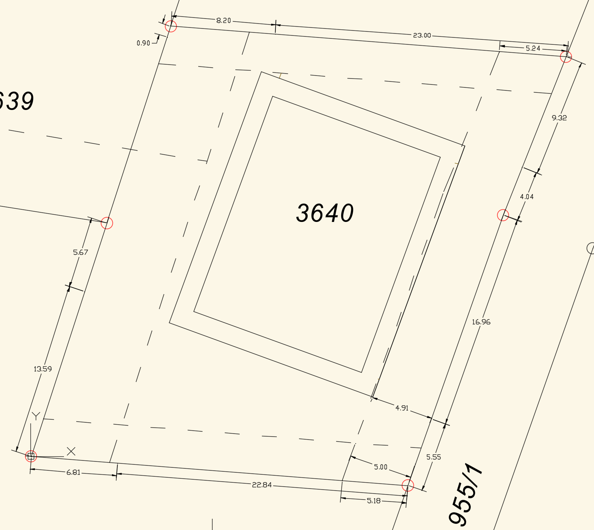
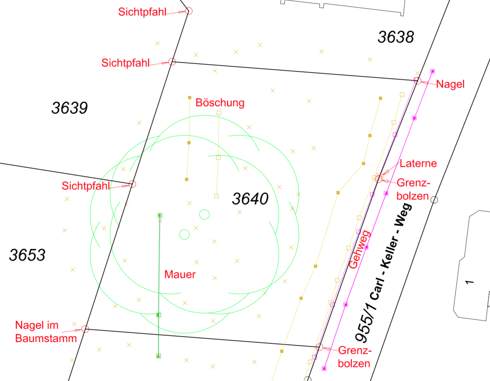
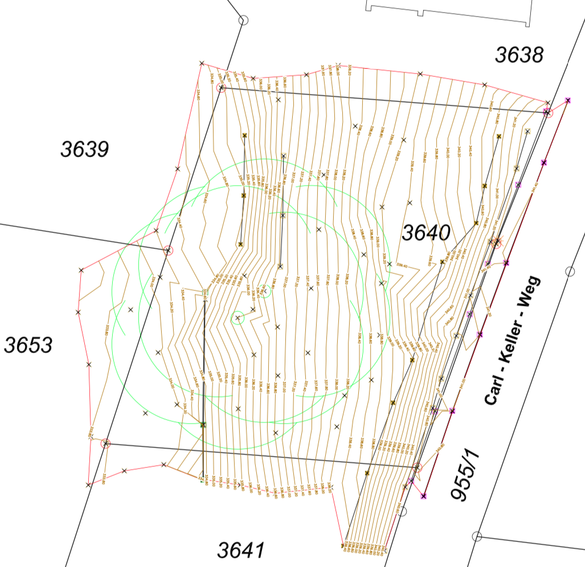

# Willkommen am Waldrain!

Sonnenweg 6, D-79539 Loerrach (ehemals Carl-Keller-Weg)
&ndash; Gewann Wächtersholden am Huenerberg Suedwesthang
&ndash; [Ort](https://www.google.de/maps/place/Carl-Keller-Weg+6+79539+Loerrach)
&ndash; [Anfahrt](https://www.google.com/maps/dir//Carl-Keller-Weg+6+79539+Loerrach)
&ndash; [Kontakt: Email an waldrain@tammik.org](mailto:waldrain@tammik.org)
&ndash; [Kurzinfo](/doc/2024-03-06_flyer.pdf)

Hinweis: Ich befuerworte und foerdere Offenheit und Transparenz.
Meines Wissens werden in dieser Webseite keine Geheimnisse gelueftet.
Jede, die hier etwas Vertrauliches entdeckt oder sonstige Bedenken zum Inhalt hat, moege das bitte melden, damit ich es berichtigen kann.
Vielen Dank!

#### Inhaltsangabe

<div id="toc"></div>

<!--

istzustand / vision / was suchen wir?

oekologie und nachhaltigkeit 

gemeinschaftlich mit anderen menschen leben

wille zum persoenlichen wachstum, mit und durch die gemeinschaft

selbstverantwortung

gemeinschaftbildung coaching, workshops, gemeinschaftstage, werkzeuge zur konfliktloesung und entscheidungsfindung

gemeinsame Nutzung von gewissen Ressourcen, also Gemeinschaft.

400-500 qm Wohnraum fuer 8-10 Personen

1000 qm Grundstueck in guter Lage mit Aussicht, direkt neben dem staedtischem Wald auf dem Huenerberg, nahe Basel, gute Verkehrsanbindungen an OeV

was ist im haus, was ist drum rum?

nachhatiger holz- und lehmbau

cluster-wg und einzelwohnungen

was sind meine optionen?

beteiligung an einem nachhaltigen bauprojekt

wohnraum mit gemeinschaftsanschluss

minimal 30 qm privatraum in claster-wg; maximal eine abgetrennte wohnung fuer die ganzes privates stockwerk mit ca. 120 qm fuer eine familie 

mehrgenerationen-projekt moeglich und willkommen

barriaerefreie gestaltung (teilweise, in allen wesentlichen bereichen komplett) moeglich und willkommen

auch reine investition in ein nachhaltiges bauprojekt denkbar

-->

## Charta

Nachhaltigkeit hat hoechste Prioritaet.
Daraus ergeben sich automatisch Konsequenzen, wie z.B. einen achtsamen Umgang mit Natur und Nachbarschaft sowie gemeinsame Nutzung von Ressourcen.
Letzteres fuehrt zur Gemeinschaft.
Wie diese sich entwickelt, kann man nicht genau voraussagen, und soll auch moeglichst wenig eingeschraenkt werden.
Daraus ergibt sich auch: maximale Flexibilitaet anstreben, z.B. Leitungen fuer individuelle Kuechen und Baeder vorsehen, und daran arbeiten, dass nicht alle genutzt werden, oder manche kleiner und genuegsamer gestaltet werden als andere.

- Naturnah und Nachhaltig &rarr; Oekologisch &rarr; Gemeinschaft &rarr; Toleranz, [Kommunikation und Entscheidung](#kommunikation-und-entscheidung)
- [Bauen](#nachhaltiges-bauen) &ndash; graue Energie minimieren bei der Baumaterialwahl, rezyklierbare Materialien
- [Energieverbrauch](#nachhaltiger-energieverbrauch) &ndash; laufender Verbrauch minimieren, z.B. Null-Energie oder Plusenergiehaus
- [Wohnform](#nachhaltiges-leben) &ndash; gemeinsamer Nutzung, Ressourcen teilen, private Wohnflaeche verringern

### Kommunikation und Entscheidung

Damit eine Gemeinschaft entstehen und lebendig sich entwickeln kann, braucht es explizite Grundregeln in der Kommunikation und Entscheidungsfindung, Bereitschaft und Wunsch, sich zuzuhoeren, zu unterstuetzen und foerdern, zum Lernen und Wachsen, Transparenz, Offenheit, Authentizitaet, Konfliktfaehigkeit,
Nutzen von Werkzeugen wie z.B. [Konsent](#kommunikation) und [Soziokratie](#soziokratie).

### Nachhaltiges Bauen

Bewusster Einsatz von Rohstoffen,
um [graue Energie](https://www.zukunftaltbau.de/fileadmin/user_upload/Materialien/Merkblaetter/ZAB_MB_GraueEnergie_210323.pdf) ([local link](/doc/material/zab_mb_graueenergie.pdf)) zu
vermeiden, z.B. weniger Beton und Zement, statt dessen wiederverwertbare Baumaterialien.
Fokus auf Vollholz und Lehm.
Letzeres ist vor Ort vorhanden und wurde erfolgreich fuer Lehmputz verwendet.

Denkbares Ziel: innerhalb von einer Generation ein Energieplus zu erzielen, inklusive den Aufwand, der beim Neubau entstanden ist.

<blockquote>
Der heute uebliche Lebens- und Wohnstil bietet keine Lösungen fuer unsere sozialen und ökologischen Probleme.
Der weitaus stärkste Lösungsansatz ist, dass wir wieder lernen, in gesunden Gemeinschaften und mit Respekt gegenueber den beschränkten Ressourcen und den zukuenftigen Generationen zu leben.
... Wir wohnen meist fremdbestimmt in Mietwohnungen oder in auf Abgrenzung angelegten Häusern.
Die Gebäude sind ressourcenintensiv gebaut und verschlingen viel Energie.
Sie entsprechen in erster Linie finanziellen und ästhetischen Anspruechen, nicht den Interessen der Nutzer*innen...
<p style="text-align: right; font-style: italic;">&ndash; Corinne Roth Vock in casanostra Nr. 164 Februar 2022
ueber <a href="https://www.urbanedoerfer.ch">urbanedoerfer.ch</a></p>
</blockquote>

### Nachhaltiger Energieverbrauch

Null-Energie oder Plusenergiehaus, sog. [Permahaus](#permahaus), z.B. durch kybernetische Architektur.

Architektonische Nutzung von vorhandenen Ressourcen wie Sonneneinstrahlung, gut gedaemmte Nordseite, viel Speichermasse im Haus zum Kuehlen im Sommer und Waerme bewahren im Winter.

[Verzicht auf fossile Brennstoffe](#verzicht-auf-fossile-brennstoffe), low-tech,
[Vermeidung einer komplexen Heizung](#keine-heizung),
[Strahlungsheizung](/doc/heating/infrarot_heiztechnik.pdf),
[wasserfuehrende Stueckholzoefen](#wasserfuehrender-holzofen) fuer Warmwasserbereitung und Kochen,
z.B. Sturzbrandoefen mit Seebeckeffekt,
photovoltaik-betriebene Waermepumpe und grosser [Waermespeicher](#waermespeicher).

### Nachhaltiges Leben

Ressourcen gemeinsam nutzen, z.B. Werkzeuge, Geraete, Waschkueche, Werkstatt, Aussenraeume, Veranda, Cheminee, luxurioeses Bad, Bueroraum, Gaestezimmer, Sitzplaetze mit Anbindung an Aussen und Aussicht, Gemeinschaftskueche.
Gemeinsam genutzt koennen sie umso grosszuegiger und luxurioeser ausgelegt werden.
Kein Zwang zur Gemeinschaft durch flexible Gestaltung von Privatbereichen, vgl. moderne Ansaetze des Nachhaltigen Lebens, wie z.B. die Idee des [Cluster-WGs](#wohnform-cluster-wg).

### Finanzierung

Die Finanzierung deckt folgende Kosten ab:

- Neubaukosten
- Unterhaltskosten
- Grundstueckskosten

Das Grundstueck wurde im Januar 2020 fuer 990.000 Euro erstanden, 1.050.000 inkl. Kaufnebenkosten.

Der flexible Darlehenszinssatz bei der Volksbank Dreilaendereck Loerrach richtet sich nach den Referenzzinssatz, definiert durch den Durchschnittsatz
des Euribor Dreimonatsgeldes
([euribor-rates.eu](https://www.euribor-rates.eu/en/current-euribor-rates),
[global-rates.com](https://www.global-rates.com/en/interest-rates/euribor/euribor-interest-3-months.aspx))
plus 1.5%; Entwicklung in Prozent und Grundstueckskosten pro Jahr in Tausend Euro:

<!--
e = 2.01
k = (e+1.5)*100*1050000
-->

<table class="r">
<tr><td>Date</td><td>Euribor</td><td>Kosten</td></tr>
<tr><td>2020-01-14</td><td>-0,391</td><td>12</td></tr>
<tr><td>2022-01-02</td><td>-0,583</td><td>10</td></tr>
<tr><td>2022-10-01</td><td>+1.01</td><td>26</td></tr>
<tr><td>2022-11-01</td><td>+1.65</td><td>33</td></tr>
<tr><td>2022-12-09</td><td>+2.01</td><td>37</td></tr>
<tr><td>2022-01-05</td><td>+2.17</td><td>39</td></tr>
</table>

Um eine nachhaltige Situation zu erreichen, muesste der Bankkredit durch Einlagen und festverzinsliche Privatdarlehen abgeloest werden.

Ebenso koennen die Neubaukosten vorerst durch Einlagen und Darlehen gedeckt werden.

Nach Fertigstellung des Neubaus werden laufende Kosten, Zinsen und Rueckzahlungen nach und nach durch moderate Mieten getragen.


<!--

### Loerracher Stadtbuch Artikel 

Es geht im Stadtbuch um das Thema WOHNEN in Lörrach.
Wir wollen dieses Thema mit ganz unterschiedlichen Facetten beleuchten.
Uns interessiert die Herangehensweise einer gemeinschaftlichen Planung. 

Wer kam auf die Idee? 
Was waren die Beweggruende?
Wie ist der Stand der Planungen? 
Welche Themen sind dabei besonders im Vergleich zu klassischen Bauprojekten? 
Was ist das Ziel? 

So in etwa.
Wenn Sie weitere Aspekte ergänzen möchten, immer gern. 

Also in der Regel sollte der Artikel in etwa eine Seite umfassen, in unserem fall ca. 3000-3500 Zeichen.
Es geht mehr um eine kurze Darstellung der Idee des Projekts.
Wenn Sie uns ein, zwei Fotos zur Verfuegung stellen könnten bzw. Skizzen des geplanten Hauses wäre das toll.

Redaktionsschluss ist Ende Juni.
Wenn wir es vorher bekommen, können wir alles einfacher zusammen basteln.

-------

Auf dem Huenerbergweg sticht ein altes Haus hervor, Baujahr 1897.

Dort leben 

Ich arbeite daran, ein altes Haus von 1897 energetisch zu sanieren.
Das ist eine spannende Aufgabe und wir kommen gut voran.

In dem Haus leben

- Motivation
- Ressourcen, Nachhaltigkeit
    - Energie, Betrieb, Technik
- Architektur, Materialien, Bauen, Recycling
- Gemeinschaft
- Konsum
- Mobilitaet

Projektidee: Nachhaltiges Bauen und Wohnen.

[Mot] Was ist MIR wichtig? Was motiviert Jeremy. liegt mir am Herzen?

-------

## Waldrain am Huenerberg

Der Waldrain ist ein Projekt fuer nachhaltiges Bauen und Wohnen.

Der [Erdueberlastungstag](https://de.wikipedia.org/wiki/Erd%C3%BCberlastungstag) fand dieses Jahr am 4. Mai statt, ein Tag frueher als im Jahr zuvor.
Das heisst, wir haben in Deutschland alle uns zur Verfuegung stehende Ressourcen fuer diese Jahr schon verbraucht, leben seit dem Tag auf Pump, und sind noch verschwenderischer gewwesen als im Vorjahr.
Die Zukunft muss unsere aufgehaeuften Schulden irgendwann begleichen.

Dem moechten wir etwas entgegensetzen.

Beim Bauen und Wohnen verbrauchen wir am meisten Energie und koennen am wirksamsten was erreichen.

Durch nachhaltiges Bauen mit Fokus auf Plusenergie, Recycling, Oekologie und Gemeinschaft koennen wir viel erreichen.

Dazu muessen wir unsere alltaegliche Lebensbereiche unter die Lupe nehmen:

- Konsum: wenig konsumieren, mit Nachbarn unf Freunden teilen
- Ernaehrung: keine Massentierhaltung unterstuetzen, lokale saisonale Produkte bervorzugen
- Energieverbrauch: Energieschleudern runterfahren, Sonnenenergie und Waermepumpe, ein Plusenergiehaus errichten
- Mobilitaet: Fahrrad, OeV, Carsharing
- Bauen: nachhaltig bauen: kein Beton, graue Energie minimieren, lokale Baumaterialien, z.B. unbehandeltes lokales Holz und Lehm
- Wohnen: gemeinsame Nutzung von Ressourcen, geringere Flaechen beheizen, Regenwassernutzung, Kompostklos


### Bauen

Die Auswirkungen auf die Umwelt koennen verbessert werden durch Einhaltung der drei Hauptanliegen des ökologisch nachhaltigen Bauens: Energie- und Ressourcenverbrauch minimieren, Flächenverbrauch reduzieren, Natur während des gesamten Lebenszyklus möglichst wenig belasten &ndash; Bau, Nutzung und Rueckbau.

Viele bestehende Haeuser und leider auch die Mehrzahl der Neubauten bestehen aus Materialien, die irgendwann mal als Sondermuell zurueckbleiben werden.

Nachhaltiges Bauen umfasst viele Bereiche: Grundstueck, Architektur, Energie-, Wasser-, und Materialeffizienz, Betrieb, Instandhaltung, Abwasser- und Abfallvermeidung, ressourcen-effizienten Betrieb und schliesslich der Abbau nach einer langen Nutzungszeit.

Ein gut gebautes Haus kann durchaus ueber hundert Jahre genutzt werden.: Am Huenerbergweg leben ein knappes Dutzend Menschen in einem Haus Baujahr 1897, das zur Zeit erfolgreich nachhaltig auf den aktuellsten technischen Standard gebracht wird, durch bessere Daemmung und Umstieg von fossilen auf erneuerbare Energiequellen. 


### Architektur

Grundrisse und Versorgungsleitungen werden ausgerlegt fuer eine langjaehrige, flexible und vielfältige Nutzung ohne Umbauarbeiten.

-------

Die Tragstruktur des Gebäudes wird so angelegt, dass bauliche Anpassungen durch sich ändernde Anforderungen möglich sind.
Dazu wird in der die Gebaeudestruktur konsequent zwischen tragenden und nicht tragenden Bauteilen unterschieden sowie durch Haustechnikerschliessung ausserhalb der Tragstruktur, bzw. minimierung der Haustechnik und Technik ueberhaupt.
Anpassungs- und Erweiterungsmassnahmen der Haustechnik sind dadurch ohne grossen baulichen Aufwand möglich.

Earthship: Ada, alles wasser versickert, wird gereinigt, nicht erlaubt, Spezialbewilligung fuer experimentelles Bauen

-------

Wir achten auf eine optimale Nutzung der Sonnenwaerme und des Tageslichts.

Wir benutzen natuerliche Baumaterialien, keine lösemittelhaltige Werkstoffe, Klebstoffe oder Anstriche: unbehandeltes lokales Holz und Lehn vom eigenen Grund.

### Energie

Wir betrachten den Energieverbrauch ganzheitlich, inklusive der laufenden Betriebsenergie und privater alltaeglicher Verbrauch, die graue Energie fuer die Gebaeudeerstellung, Energie fuer die durch das Gebäude induzierte Mobilität.

Wir reduzieren die graue Energie durch Verzicht auf Beton, Keller, unterirdische Bereiche sowie Holzbauweise mit einheimischem Holz und Optimierung der einzelnen Bauteile.

Im Bau uebersteigen allerdings langfristig die Lebenszykluskosten die Erstellungskosten um ein vielfaches.
Deshalb werden die Betriebs- und Unterhaltskosten bei allen Materialentscheiden konsequent mit einbezogen.
Höhere Baukosten werden mit geringeren Betriebskosten belohnt.

Sehr gute Wärmedämmung im Norden, Energiegaerten und unbeheizte Pufferzonen, konsequenter Einsatz von energieeffizienten Geräten und Beleuchtung, Photovoltaikanlage auf Dach und Fassade

Wir streben eine vollstaendige Deckung der Betriebsenergie inklusive Energiebedarf der Nutzerinnen und Nutzer durch extensive solare Photovoltaik, effizientes Kuehlen und Heizen mit einer Waermepumpe, grosse Waermespeicher inkl. Erdregister.

### Garten und Natur

Moeglichst Naturnah, integrale Raumplanung, Gruenflaechen bewahren, Anbindung von Innenraeume und Aussnraeume maximieren, auf optimalen Gartenzugang achten, stets den Umschwung und Garten in die Planung mit einbeziehen.

Wir beleben die Nachbarschaft und schuetzen die Natur.

Wir vermeiden Lichtverschmutzung, minimieren die Aussenbeleuchtung und andere unerwuenschte Auswirkungen, bieten ein Rueckzugsgebiet fuer einheimische Insekten und Pflanzen.

Wir ermoeglichen die Nutzung eines Kompostklos.

Wir legen Wert auf Regenwassersammlung, -Speicher und -Nutzung, Versickerung, Gartenbewaesserung mit Regenwasser.

### Wohnen und Gemeinschaft

Nachhaltiges Bauen unterstuetzt eine hohe Wohn- und Lebensqualität.

Selbstversorgung und Autarkie? Wir koennen unseren Bedarf an Wasser, Strom und Heizung abdecken mit Regenwasser, Solar-PV, Waermepumpe und Holz.

Interesse an Gemeinschaft und persoenliches Wachstum ist erwuenscht.

Wie fest man gemeinschaftlich wohnen will und wie sich die Gemeinschaftsvision entwickelt

Wir erproben, was gemeinsam genutzt werden kann: eine gut ausgestattete Kueche, Geraete, Waschmaschine, Waschkueche, Werkzeuge, Werkstatt, verschiedene Raeume.

Wir ermoeglichen grosszuegige gemeinschaftlich nutzbare Raeume und schauen, in wie weit wir mit einer geringen Privatflaeche auskommen wollen; wir schaffen dafuer maximale Flexibilitaet und Moeglichkeiten, auszuprobieren, was fuer jeden sich stimmig anfuehlt und in welche Richtung sich die eventuelle Gemeinschaft entwickeln mag.

Es braucht Raum fuer Begegnung und Austausch, ein Gefaess wo man sich trifft und bespricht, Begegnung, Ritaule, Austausch, Struktur.
Daraus kann auch eine gegenseitige Unterstuetzung im Alltag entstehen, im besten Fall sich aufgehoben fuehlen wie in einer Dorfgemeinschaft.

Im Alltag koennen wir mit kleinen Anpassungen viel erreichen, wie z.B. ein Gemueseabonnement beim lokalen Produzenten, gemeinschaftlich einkaufen in groessere Mengen mit weniger Verpackung, andere Einkaeufe absprechen und gemeinsam taetigen, egal ob getrennt gekocht wird.

-------

image /Users/jta/p/2021/2021-09-04_festumvier/20210904_193131_800.jpg

-------

Frag Stefan, Heiner, Madlee, Marianne, Huenerberger, Waldrainer alt und neu

-------

Vivian Dittmar: Echter Wohlstand
Scott Peck: Gemeinschaftsbildung
Lacaton und Vasalle: Lebenswerte nachhaltige Sozialwohnungen

- [Nachhaltig Planen und Bauen](https://www.nachhaltigesbauen.de) (Bundesministeriums fuer Wohnen, Stadtentwicklung und Bauwesen)

- [Nachhaltiges Bauen einfach erklärt und 5 entscheidende Faktoren](https://buildingradar.com/de/construction-blog/nachhaltiges-bauen)

> Höhere Baukosten werden mit geringen Betriebskosten belohnt.
Die Wohn- und Arbeitsqualität in Green Buildings ist sehr hoch.
Nachhaltiges Bauen belebt das Stadtbild und schuetzt die Landschaft.
Den Energie- und Ressourcenverbrauch minimieren, den Flächenverbrauch reduzieren und die Natur durch ein Gebäude während des gesamten Lebenszyklus‘ (Bau, Nutzung und Rueckbau) möglichst wenig belasten: Das sind die drei bedeutenden Säulen des ökologisch nachhaltigen Bauens. Aus dieser Perspektive wird die Gebäudequalität hinsichtlich der Auswirkungen auf die Umwelt beurteilt.

> Nachhaltiges Bauen umfasst somit alle Bereiche von der Wahl des Grundstuecks ueber die Architektur und Energie-, Wasser-, Materialeffizienz, den Betrieb, die Instandhaltung sowie Abfallvermeidung bis hin zum ressourcen-effizienten Betrieb und schliesslich der Dekonstruktion nach einer Nutzungszeit von 50 – 100 Jahren.

> „Nachhaltig“ heisst jedoch nicht nur „öko“. Denn „Green Buildings“ sind „smart“: In grünen intelligenten Gebäuden sorgt umweltfreundliche sowie automatisierte Hightech für die effiziente Nutzung von Energie und Ressourcen sowie eine angenehme Atmosphäre mit hoher Lebensqualität und Produktivität.

- [Wohnen wie im Jahr 2050](http://www.eco2friendly.ch/de_CH/magazin/energie-und-gesellschaft/wohnen-wie-im-jahr-2050) (Markus Portmann, [e4plus AG](https://www.e4plus.ch),  [eco2friendly.ch](http://www.eco2friendly.ch))

-->

#### Dieter 2024-02-23

Bei meinen vergangen Projekten stand am Anfang immer die Frage der Finanzierung. Zumindest grob...
In Deiner Aufstellung habe ich zu den Bau- und Grundstückskosten, Finanzpläne nichts gefunden.
Was ich gesehen habe hat sich wohl eher noch auf das genossenschaftliche Projekt bezogen.
Für mich müsste spätestens zum Bauantrag ein Finanzkonzept (an das wenigstens ich glaube) da sein.

Ich habe mal sehr grob nachgerechnet:
1 Mio Grundstückskosten, 2 Mio Baukosten (hab nochmal nachgedacht: wäre nicht billig, aber auch nicht absurd hoch &ndash; alleine der Architekt nimmt ja schon 10-15 % der Baukosten).
Also: 3 Mio zu zb 3 % Zinsen und 1 % Tilgung.
3 % Zinsen wären momentan sehr gut &ndash; kommt halt immer auf Dein Rating/Kreditwürdigkeit an.
1% Tilgung ist vlt auch bezgl. Deines Alters ambitioniert (?)
Wären also bei einer Vollfinanzierung  120 k/ Jahr.
Dazu noch 10 k für Grundsteuer, Gebäudeversicherung, Instandhaltung... wären dann 130 k durch 12 Monate = 10800 €.
Dies wiederum durch 6 Parteien ergäbe sich eine notwendige „Miete“ von 1800 € / Monat plus NK.
Bei durchschnittlich ca 70 m2 pro Einheit entspräche das 25 € / m2 ( inkl. Nutzung der Allgemeinräume). 25 € !
Bei zb einer Einlage von 150 k / Partei wären die Restkosten dann 2,1 Mio.
Daraus ergäbe sich dann ein m2 Preis von 18,50€/ m2 (1300€/Mo plus nk).
Dies alles natürlich nur unter der Voraussetzung von 3% Zins und 1% Tilgung.

> stimmt, von finanzen steht da nicht viel drin.
meine gedanken und schaetzungen dazu decken sich sehr gut mit deinen.
genau so wuerde ich das auch angehen.
allerdings liegt zur zeit der euribor 3 monate richtzinssatz bei ueber 3.9%, also fast 4%, erheblich ueber 3%.
daher koennte eine feste hypothek eventuell noch hoeher liegen.
hoffentlich koennen wir die banken ganz meiden.
haengt natuerlich von den leuten ab, die mitmachen, und den baukosten, und allem moeglichen.
das thema schiebe ich noch ein bisschen auf, so lange es geht.
geht vielleicht nicht mehr lange, weil die leute natuerlich klarheit und verbindlichkeit brauchen, um sich ueberhaupt entscheiden zu koennen.

### Stadtbuchartikel &ndash; Waldrain am Hünerberg

<span class="i">Artikel für das Stadtbuch Loerrach 2022</span>

Der Waldrain ist ein Projekt für nachhaltiges Bauen und Wohnen in guter Lage mit enger Anbindung an Stadt und Natur. Auf dem Nachbargrundstück leben schon ca. zehn Menschen in einem Mehrfamilienhaus in «normalen», getrennten Einzelwohnungen und wachsen langsam zu einer lockeren Gemeinschaft zusammen. Auf dem neuen Grundstück besteht nun die Möglichkeit eines Neuanfangs mit Synergiepotential.

#### Motivation

Der Erdüberlastungstag fand dieses Jahr am 4. Mai statt, einen Tag früher als im Jahr zuvor. Das bedeutet, wir haben in Deutschland bereits alle uns zur Verfügung stehende Ressourcen für dieses Jahr schon verbraucht, leben seit dem Tag auf Pump, und sind noch verschwenderischer gewesen als im Vorjahr. Nachfolgende Generationen müssen unsere aufgehäuften Schulden begleichen.

Dem möchten wir etwas entgegensetzen.

Beim Bauen und Wohnen verbrauchen wir mehr Energie als in jedem anderen privaten Lebensbereich. Durch nachhaltiges Bauen mit Fokus auf Plusenergie, Recycling, Ökologie und Gemeinschaft können wir besonders viel einsparen. Allerdings sollten wir auch unsere anderen alltäglichen Lebensbereiche nicht ausser Acht lassen:

- Konsum: wenig konsumieren, mit Nachbarn und Freunden teilen
- Ernährung: keine Massentierhaltung unterstützen, lokale saisonale Produkte bevorzugen
- Energieverbrauch: Energieschleudern runterfahren, Sonnenenergie und Wärmepumpe, ein Plusenergiehaus errichten
- Mobilität: Fahrrad, ÖV, Carsharing
- Bauen: nachhaltig bauen: kein Beton, graue Energie minimieren, lokale Baumaterialien, z.B. unbehandeltes lokales Holz und Lehm
- Wohnen: gemeinsame Nutzung von Ressourcen, geringere Flächen beheizen, Regenwassernutzung, Kompostklos

#### Architektur und Bau

Die Auswirkungen auf die Umwelt können verbessert werden durch Einhaltung der drei Hauptanliegen des ökologisch nachhaltigen Bauens: Energie- und Ressourcenverbrauch minimieren, Flächenverbrauch reduzieren, Natur während des gesamten Lebenszyklus möglichst wenig belasten – Bau, Nutzung und Rückbau.

Viele heutige Häuser und leider auch die Mehrzahl der Neubauten bestehen aus Materialien, die irgendwann als Sondermüll zurückbleiben werden.

Nachhaltiges Bauen umfasst viele Bereiche: Grundstück, Architektur, Energie-, Wasser-, und Materialeffizienz, Betrieb, Instandhaltung, Abwasser- und Abfallvermeidung, Kreislaufwirtschaft, ressourceneffizienter Betrieb und schliesslich der Abbau nach einer langen Nutzungszeit.

Ein gut gebautes Haus kann durchaus mehr als hundert Jahre lang genutzt werden – das bestehende Haus ist Baujahr 1897 und wird zurzeit erfolgreich nachhaltig auf den aktuellsten technischen Standard gebracht, durch bessere Dämmung und Umstieg von fossilen auf erneuerbare Energiequellen.

Beim Neubau achten wir auf eine Planung der Grundrisse und Versorgungsleitungen für eine langjährige, flexible und vielfältige Nutzung ohne Umbauarbeiten und optimaler Einsatz von Sonnenwärme und Tageslicht, natürliche Baumaterialien, keine lösungsmittelhaltigen Werkstoffe, Klebstoffe oder Anstriche, unbehandeltes, möglichst lokales Holz und Lehm vom eigenen Grund.

#### Energie

Wir betrachten den Energieverbrauch ganzheitlich, inklusive laufende Betriebsenergie, privater alltäglicher Verbrauch, graue Energie für die Gebäudeerstellung, Energie für die durch das Gebäude induzierte Mobilität.

Wir reduzieren die graue Energie durch Minimierung von Beton, Verzicht auf Keller und unterirdische Bereiche, Holzbauweise und Optimierung der einzelnen Bauteile.

Allerdings übersteigt langfristig der laufende Energieverbrauch die Erstellungsenergie um ein Vielfaches. Deshalb werden die energetischen Betriebs- und Unterhaltskosten bei allen Materialentscheiden konsequent mit einbezogen. Höhere Baukosten werden durch geringere energetische und ökonomische Betriebskosten ausgeglichen.

Sehr gute Wärmedämmung des beheizten Kernbereichs, Energiegärten und unbeheizte Pufferzonen, konsequenter Einsatz von energieeffizienten Geräten und Beleuchtung, Photovoltaikanlage auf Dach und Fassade.

Wir streben eine vollständige Deckung der Betriebsenergie an, inklusive des Energiebedarfs der Nutzerinnen und Nutzer: extensive solare Photovoltaik, effizientes Kühlen und Heizen mit einer Wärmepumpe, grosse Wärmespeicher inkl. Erdregister, usw.

#### Garten und Natur

Möglichst naturnah, Grünflächen bewahren, Anbindung von Innen- und Aussenräumen maximieren, auf optimalen Gartenzugang achten, eine integrale Raumplanung, die stets den Umschwung und Garten in die Planung mit einbezieht.

Wir beleben die Nachbarschaft und schützen die Natur.

Wir vermeiden Lichtverschmutzung, minimieren die Aussenbeleuchtung und andere unerwünschte Auswirkungen, bieten ein Rückzugsgebiet für einheimische Insekten und Pflanzen.

Wir legen Wert auf Regenwassersammlung, -Speicher und -Nutzung, Versickerung, Gartenbewässerung mit Regenwasser, und ermöglichen die Nutzung eines Kompostklos.

#### Wohnen und Gemeinschaft

Nachhaltiges Bauen unterstützt eine hohe Wohn- und Lebensqualität.

Interesse an Gemeinschaft und persönliches Wachstum ist erwünscht.

Viel Nachhaltigkeit kann mit kleinen Anpassungen erreicht werden, wie z.B. ein Gemüseabonnement beim lokalen Produzenten, gemeinschaftlich einkaufen in grösseren Mengen mit weniger Verpackung, andere Einkäufe absprechen und gemeinsam tätigen.

Die Architektur kann eine teilweise Selbstversorgung und Autarkie unterstützen: wir können unseren Bedarf an Wasser, Strom und Heizung abdecken mit Regenwasser, Solar-PV, Wärmepumpe und Holz.

Wir können viele Räume und Gegenstände gemeinsam nutzen: energieeffiziente Fahrzeuge, eine gut ausgestattete Küche, viele Geräte für Haushalt und Garten, Waschmaschine, Waschküche, Werkstatt, und andere Räume.

Maximale architektonische Flexibilität ermöglichen ein Ausprobieren, inwieweit eine geringere Privatfläche ausreicht und schafft Möglichkeiten für sich verändernde Lebensumstände und Gemeinschaft. Gegenseitige Unterstützung im Alltag wird möglich.

Die Entstehung von Gemeinschaft benötigt Raum und Zeit für Begegnung und Austausch, ein Gefäss, wo man sich trifft und bespricht, Begegnung, Rituale und Struktur. Daraus kann sich eine Gemeinschaftsvision entwickeln. Die Soziokratie kann ein Werkzeug darstellen, um gemeinsame Entscheidungen zu treffen.

<center>
 <!-- 800 -->
</center>

<!--

### Brief zur Lage

Auf diesem Grundstück entsteht ein ökologisches Bauprojekt namens <span class="b">Waldrain</span> mit einem Holzhaus für eine Cluster-WG für 7-12 Menschen jeden Alters mit grosszügigen Gemeinschaftsbereichen sowie privaten Rückzugsmöglichkeiten.

Wir streben ein nachhaltiges gemeinschaftliches Zusammenleben an im Sinne der [2000-Watt-Gesellschaft](https://de.wikipedia.org/wiki/2000-Watt-Gesellschaft), in Einklang mit der unmittelbaren Nachbarschaft, der Natur, unserem einmaligen Planeten und seinen begrenzten Ressourcen.

Auf dem Nachbargrundstück besteht schon die lockere Gemeinschaft <span class="b">Bunterkunt</span>. In einem alten Haus Baujahr 1897 hat jede Partei eine eigene abgeschlossene Wohnung, macht aber recht viel zusammen: Kochen, Essen, Garten, Sauna, usw.

Angefangen hat der Waldrain als Genossenschaft in Gründung mit zehn Menschen, die das Grundstück erwerben und bebauen wollte. Dann kam Corona und die Tatsache, dass nicht wirklich klar war, was wir miteinander wollten, und vor allem wie, plus die Realität, dass Gemeinschaft Zeit, Einsatz, Zuhören und Toleranz braucht, um entstehen zu können. Dies war teilweise nicht vorhanden, und wir lösten uns wieder auf. Unser Anspruch auf Ökologie und Interesse an Bautechnik ist hoch wurde nicht von allen mitgetragen.

Ich hatte aber &ndash; in der festen Annahme und mit der festen Zusage, dass andere sich beteiligen &ndash; vorerst alles auf meine Kappe genommen. Jetzt sitze ich da mit dem Salat.

Ich habe immer noch Interesse und Freude an dem Projekt, sowohl baulich als auch gemeinschaftlich, leben, wohnen, gemeinsam gestalten. Ich treibe es vorerst allein weiter, bis zumindest eine zuverlässige Grundlage und damit Klarheit gegeben ist, z.B. eine fertige Baugenehmigung.

Die weitere Planung kann ich finanziell noch weiter allein tragen. Den Bau stemmen kann ich jedoch nicht.

Ich möchte auch gerne die Gemeinschaft Schritt für Schritt organisch entstehen lassen, ohne zu überstürzen, und ohne sofort riesige Verbindlichkeiten und finanzielle Verpflichtungen zu erzwingen.

Andrerseits stelle ich es mir nicht trivial vor, Leute zum Mitfinanzieren zu motivieren, die nicht ein Eigeninteresse haben, z.B. da auch wohnen wollen.

Es gibt kein Renditeobjekt, bietet aber eine erstrebenswerte Wohnlage und hohen ökologischen Wert. Z.B. strebe ich Autarkie an in dem Bedarf an Wasser und Energie durch Regenwassernutzung, Fotovoltaik und effektive Heizung.

Wunsch, Ziel und Nutzen: Gemeinschaft entstehen lassen, Bauprojekt umsetzen, nachhaltiges ökologisches Zusammenleben in Einklang mit der unmittelbaren Nachbarschaft, unserem einmaligen Planeten und seinen begrenzten Ressourcen.

Silke sagt:

email ralf thies baufinanz ralf.thies@faszination-europa.de

Gut verständlich, klar formuliert.
Dein Wunsch/Ziel könnte noch klarer herausgehoben sein. Gemeinschaft entstehen sehen, Bauprojekt umsetzen (so habe ich es verstanden)
Der Nutzen für andere kommt noch zu kurz, finde ich. Ich glaube, dass das Projekt auch als Experiment/Forschung einen Nutzen haben könnte.
Den Nutzen in den letzten Absatz einbauen. Geht auch als Frage, so etwas herausarbeiten kann zB Ralf sehr gut.
Deine Wünsche bzw. Ziele jeweils dort klar formulieren, wo sie vorkommen. Absätze 6 u 7 reden ja schon so ungefähr davon.

-->

## Gemeinschaft

### Literatur

- [Scott Peck](https://en.wikipedia.org/wiki/M._Scott_Peck)
  ([de](https://de.wikipedia.org/wiki/M._Scott_Peck)):
  [A Different Drum: Community Making and Peace](https://en.wikipedia.org/wiki/M._Scott_Peck#Community_building)
  &ndash; [Gemeinschaftsbildung: Der Weg zu authentischer Gemeinschaft](https://de.wikipedia.org/wiki/M._Scott_Peck#Werk_Gemeinschaftsbildung)
- Bilbo Calvez: *Saruj &ndash; Stell dir vor, es gibt kein Geld mehr*

> Eine Gemeinschaft kann entweder Regeln definieren, die das Benehmen aller in einen bestimmten Rahmen eingrenzen, oder sie setzt auf die Achtsamkeit von jederen.
Je achtsamer jeder Einzelne wird, desto weniger Regeln werden benoetigt &ndash; und im Idealfall gar keine mehr.

### Gemeinschaftsbildung

- [Erfolg und Scheitern von Gemeinschaften: Woran liegt’s?](https://beruehrungs-punkte.info/erfolg-und-scheitern-von-gemeinschaften-woran-liegts)
- [Der Gemeinschaftskompass &ndash; eine Orientierungshilfe](http://www.gemeinschaftskompass.de/de/gemeinschaftskompass-eine-orientierungshilfe-fuer-gemeinschaften) zeigt
sieben Aspekte auf, die als Orientierungshilfe dienen, um Gemeinschaften erfolgreich zu realisieren:
  - Individuen: Raum für Individuen und Bewusstsein für persönliche Weiterentwicklung
  - Gemeinschaft: Bewusste Pflege des Miteinanders
  - Intention: gemeinsame Ausrichtung
  - Struktur: Strukturen, die zu Zielen und Werten passen
  - Praxis: Sinnvolle Arbeitsorganisation, Kompetenz und Engagement für die Aufgaben, Geldflüsse
  - Ernte: Auswerten von Erfahrungen, Feiern, Wertschätzen
  - Welt: Kooperationen und achtungsvollen Umgang mit anderen gesellschaftlichen Akteuren

<center>
 <!-- 768 -->
</center>

<!-- 
Schuld oder Verantwortung – eine Frage der persönlichen Haltung
https://open-mind-akademie.de/schuld-oder-verantwortung-eine-frage-der-persoenlichen-haltung/

Gemeinschaft Erfolg & Scheitern Teil 1.mp3
-->

### Kennenlernen

Ein interessantes Beispiel von Kennenlernen: die Annäherungsphase
von [Tiny Eco Village(https://tinyecovillage.de/kontakt):

> Das gegenseitige Kennenlernen für unser TinyHouseAreal bzw. ein TinyEcoVillage ist ein Prozess.
Wir stellen uns diesen wie folgt vor:

> - Kontaktaufnahme
- Teilnahme an einem WE oder Infoveranstaltung mit Gemeinschaftsbildungstag mit Grundstücksbesichtigung
- Vorstellung in der Gruppe oder Zoom-Meeting
- Probewohnen
- Teilnahme am WIR-Prozess
- Pachtvertrag für Parzelle und Mitnutzung der Räume
- Gemeinsame Planung der Rechtsform für gemeinschaftliches Wohnen

### Kommunikation

Wie kommunizieren wir?
Wie teilen wir uns mit und hoeren wir uns zu, so dass alle zu Wort kommen?
Wie finden Entscheidungen statt?

- [Ueberblick der Werkzeuge zum Arbeiten in virtuelle Teams](https://www.fairnetzt-loerrach.de/wp-content/uploads/2020/04/ratgeber_arbeiten-in-virtuellen-teams_v1.pdf)

Es gibt viele Arten zu Kommunizieren und gemeinsam Entscheidungen zu faellen, z.b.:

- Konsens
- Konsent, [Soziokratie](#soziokratie)
- [GFK gewaltfreie Kommunikation](https://de.wikipedia.org/wiki/Gewaltfreie_Kommunikation)
- [ZEGG Forum](https://www.zegg-forum.org), [Drei-ein-halb-minuten ZEGG-Forum Trailer](https://youtu.be/1SnDrfdiGZU)
- Demokratische Abstimmung, einstimmig, qualifizierte Mehrheit, uvm.

[Plum Village](https://plumvillage.org) bietet viel zum Thema friedliche Kommunikatiuon und achtsames Zuhoeren:

- Friedensvertrag
- Fuenf Achtsamkeisuebungen

Hier ist eine Auflistung einiger Werkzeugen und Techniken, die wir nutzen koennen (und z.T. auch tun):

- Emailverteiler
 &ndash; zur Zeit von Jeremy verwaltet
- Videokonferenzen via [Zoom](https://zoom.us)
 &ndash; siehe auch kurze [Anleitung zum Teilnnehmen an einem Zoom Meeting](https://youtu.be/hxa9wip7AvM) (3 Min)
 sowie eine laengere [detaillierte Zoom-Anleitung fuer Veranstalterinnen und Teilnehmerinnen](https://youtu.be/zCq53RH7StQ) (18 Min).
- Chat-Gruppe auf [Telegram](https://telegram.org)
 &ndash; Telegram ist so was aehnliches wie WhatsApp, aber die Daten und persoenlichen
 Informationen werden nicht so stark ausgewertet, weitergeleitet und missbraucht wie dort.
 Bitte registrieren und Registrationsdaten an Jeremy schicken, damit du in der Gruppe aufgenommen werden kannst.
- Gemeinsame Dokumente auf [Google Docs](https://docs.google.com), [Tabellen](https://docs.google.com/spreadsheets/u/0/), usw.
 &ndash; z.B. der [erste Fragenkatalog](#fragenkatalog)

Am [Treffen am 7. Juni](weg#waldrain-leibhaftig-2020-06-07) haben wir entschieden, vorerst hauptsaechlich per email zu kommunizieren.

### Soziokratie

[Grundkurs Soziokratie 3.0](https://youtube.com/playlist?list=PLwa9BQjRVbeIFku6kCT1pZKqjvldrHwcj) von Lino Zeddies:
In dieser Videoserie werden die Grundlagen für eine effektiv-partizipative Organisationsgestaltung durch die Methoden der Soziokratie 3.0 vorgestellt;
6 Teile, insgesamt ca. 40 Minuten, am Huenerberg 30 am 2021-11-04 gemeinsam geschaut.

Hartmut und Isabell haben Erfahrung mit Konsent und Soziokratie (engl. <a name="sociocracy"></a>sociocracy), wie
von [Sociocracy for All (SoFA)](https://www.sociocracyforall.org) propagiert:

Was ist eine **gute Entscheidung**?

Wenn alle, die davon betroffen sind, gut damit leben können?
In unserem Alltag ist das oft nicht der Fall.
Im demokratischen System hat sich deshalb die **Abstimmung** mit einfachen Mehrheiten etabliert.
Je stärker Bedürfnisse, Meinungen und Haltungen auseinander liegen, desto weniger liefert die Abstimmung Lösungen, mit den alle leben können.
Man denke nur an Entscheide, die mit knappen Mehrheiten getroffen werden.

Die **Soziokratie** bietet hier Verfahrensweisen, um alle Betroffenen in die Entscheidung einzubeziehen, deren Widerstände zu hören, in die Entscheidung einfliessen zu lassen und so am Ende die Entscheidung zu treffen, die für die Betroffenen gemeinschaftlich getragen wird.

Dazu gibt es einen einfachen **Prozessablauf**, der in der Gruppe eingeübt und von ihr getragen werden muss.
Neben dem reinen Grundsatzentscheid gibt es weitere Elemente der Organisationsentwicklung, wie die soziokratische Wahl und die soziokratischen Kreise.

Weitere Informationen liefert der Ueberblick [Was ist Soziokratie?](https://youtu.be/u3JJotOJ7kI) (25 Minuten).

### Konsum und Gemeinschaft

Eine Reportage des SRF zum Thema Konsum, mit einem interessanten Beispiel einer Gemeinschaft in der Schweiz:

- [SRF zwei im Kaufrausch](https://medien.srf.ch/-/srf-zwei-im-kaufrausch)

Der 3. Beitrag handelt von einer Gemeinschaft, die eine sehr neuen und recht extremen Form lebt.
 
Macht mut, solches zu wissen, finde ich!

### Leben ohne Besitz

Ein Beispiel, wie man ohne Hierarchie solidarisch und ökologisch miteinander leben kann, bietet die interessante 45-Minuetige Reportage und Dokumentarfilm vom Hessischen Rundfunk am 19.08.2020:

- [Leben ohne Besitz &ndash; Alles teilen](https://youtu.be/-gNb8u92WH4)

> Wenn Marcus ins Kino geht, nimmt er sich Geld aus der Gemeinschaftskasse. Braucht er Geld für einen Urlaub mit der Familie, entscheidet das Plenum, das tagt immer dienstags. Marcus findet das selbstverständlich, wie auch seine 80 Mitbewohner:innen in der Kommune in Niederkaufungen bei Kassel.
1986 gegründet, ist sie heute ein Unternehmen mit Bauernhof, Gemüseanbau, Hofladen, Schreinerei, Kita und Altenpflege. Viele Bewohner arbeiten in den kommuneeigenen Kollektiven, manche verdienen das Geld extern. Das Einkommen wird für die Gemeinschaft erwirtschaftet, einmal im Monat hängt der aktuelle Finanzstand aus, absolut transparent. Sie teilen Wohnungen und Wertvorstellungen. Das sind vor allem: Ohne Hierarchie solidarisch und ökologisch miteinander leben. Auf Besitz zu verzichten, nicht in Kleinfamilien zu leben, über alles gemeinschaftlich zu entscheiden &ndash; ist das ein Modell für die Zukunft? Neue, junge Mitbewohner zu finden, gestaltet sich gar nicht so leicht.
&mdash; [Kommune Niederkaufungen e.V.](https://www.kommune-niederkaufungen.de), Kirchweg 1, D-34260 Kaufungen

Der Beitrag kann uns alle evtl. ein wenig sensibilisieren, wie ein Gemeinsam-Gefühl, ein Teilen mit Ressourcen-Nutzen
und Nachhaltigkeit gelebt werden kann. 
Dieses Projekt gibt es schon 35 Jahre als Kommune mit seine 80 Mitbewohner:innen im hessischen Niederkaufungen
bei Kassel.

Zufaellig stiess ich auf einen weiteren Teil, ein Interview mit Jakob, 12 Jahre alt, der 25 Minuten <span class="b">aus der Kindersicht</span> ueber dieselbe Kommune berichtet:

- [Kinderleben in einer Kommune &ndash; Mit 80 Menschen unter einem Dach](https://youtu.be/6jABmkOLUIs):

> Jakob ist zwölf Jahre alt und lebt mit seinen Eltern und seiner Schwester Charlotte in einer riesigen Wohngemeinschaft.
In der 'Landkommune Niederkaufungen' wohnen 80 Menschen &ndash; vom Baby bis zum Senioren ist alles dabei.
In seiner Kommune gibt es keine Hierarchien.
Alles wird in Gemeinschaft entschiedeen.
Auch Auch beim Geld heisst es: alles gehört allen.

### Leichtbaudoerfer fuer Alle

- [Hameaux Légers](https://hameaux-legers.org/)
- [L' association Hameaux Légers : présentation générale](https://youtu.be/1wP_HvXvLDk?si=qHwre_bld7-BDQl2) (5 Min)
- [MOOC S'installer en habitat réversible](https://mooc.hameaux-legers.org)
- [Xavier Gisselot a lâché sa start-up pour "l’Écohabitat léger local"](https://www.histoiresordinaires.fr/Xavier-Gisselot%C2%A0a-lache-sa-start-up-pour-l-Ecohabitat-leger%C2%A0local_a3145.html)
- [Habiter sans spéculer - Dans mon hameau léger du Placis](https://youtu.be/ssjWxzRJD0I?feature=shared)

> Nous habitons un monde abîmé.
Caractérisée par l’artificialisation des sols et la spéculation foncière, notre manière d’habiter la Terre menace chaque jour un peu plus nos conditions de vie.
Au modèle industriel dominant, nous opposons des formes d’habiter écologiques et conviviales.
En particulier, nous croyons dans le modèle des hameaux légers : des écohameaux d’habitats réversibles, accessibles financièrement et qui contribuent à la vitalité des territoires ruraux.
Au sein de l’association Hameaux Légers, après avoir réalisé un cours en ligne sur l’habitat réversible (http://mooc.hameaux-legers.org/), nous souhaitons aujourd’hui donner à voir les hameaux légers qui existent ou émergent en France et être des relais honnêtes de la parole des personnes qui y vivent. Nous voulons mettre en lumière les défis techniques, réglementaires, économiques et humains que représentent ces projets mais aussi des leviers que leurs habitant·es ont trouvé pour les surmonter.
Ce reportage retrace notre immersion au sein du hameau léger du Placis, à St-André-des-Eaux (Côtes d’Armor), en mai 2022.
A travers ces images, nous vous partageons des savoirs et savoirs-faire. Surtout, nous espérons vous inspirer et vous donner l’énergie pour avancer et contribuer, avec elles, avec eux, avec nous, à l’émergence d’un monde plus durable et plus juste.

### Abricoop

Gemeinsam solidarisch Baunen und Leben jenseits der Spekulation:

- [Dans cet immeuble coopératif, on partage machines à laver et chambres d'amis](https://www.radiofrance.fr/franceinter/podcasts/l-esprit-d-initiative/esprit-d-initiative-du-lundi-29-avril-2024-7552936)
- [Toulouse: ils ont fait construire Abricoop, un immeuble participatif](https://www.airzen.fr/toulouse-ils-ont-fait-construire-abricoop-un-immeuble-participatif/)
- [Qu’est-ce qu’Abricoop, cet immeuble coopératif à Toulouse?](https://www.francetvinfo.fr/monde/environnement/video-qu-est-ce-qu-abricoop-cet-immeuble-cooperatif-a-toulouse_5544018.html)

### Wohnform Cluster-WG

- Idee: [Wohnen im Cluster – Ein Zukunftsmodell?](https://www.die-debatte.org/wohnungsmarkt-interview-prytula)

> Cluster-Wohnen, was ist das überhaupt?
<br/>&ndash; Eine Cluster-Wohnung ist eine Kreuzung zwischen Wohngemeinschaft und Kleinstwohnung, sozusagen eine Luxus-WG.
Es gibt darin abgeschlossene Zimmer mit einem Bad und meistens auch mit einer kleinen Teeküche.
Zusätzlich gibt es einen grösseren Wohnbereich mit einer Wohnküche, die gemeinschaftlich genutzt wird.
So sind Cluster-Wohnungen in der Regel 150 bis 800 Quadratmeter grosse zusammenhängende Strukturen,
die sich ohne grosse bauliche Veränderungen auf ganz verschiedene Art und Weise belegen lassen.
Dadurch entsteht eine hohe Flexibilität.

- Leitfaden: [Gemeinschaftliches Wohnen im Cluster &ndash; Ein praktischer Leitfaden zum Planen, Bauen und Wohnen](https://www.netzwerk-generationen.de/fileadmin/user_upload/PDF/Downloads_brosch%C3%BCren-dokumentationen/2019-12-13_Broschuere_Cluster_web.pdf) 
([local link](/doc/wg/2019-12-13_broschuere_cluster.pdf))

Hartmut hat etwas gesucht zu den Grössen von Clusterwohnungen.
Im Kraftwerk 1 in der Schweiz leben 100 Leute auf 3260 qm in 11 Clusterwohnungen, vgl. das Konzept und die Bewerbug fuer das Koch-Areal [Koch, ein Zürcher
Originalrezept](https://www.kraftwerk1.ch/assets/20170916_koch_konzeptbewerbung-zeitung.pdf).
Das sind natürlich riesige Gebäude und sehr urban &ndash; ein wenig mehr Platz kann es bei uns ja schon sein...
 
Ein Zitat aus der Beschreibung von Cluster-Wohnungen im Artikel [Architektur für Wohnprojekte &ndash; Impulse für innovative Wohntypologien](https://www.schader-stiftung.de/themen/stadtentwicklung-und-wohnen/fokus/gemeinschaftliches-wohnen/artikel/architektur-fuer-wohnprojekte-impulse-fuer-innovative-wohntypologien):

> In der Konzeptionsphase für ein genossenschaftliches Mehrgenerationen-Projekt &ndash; Kraftwerk 2 in Zürich &ndash; suchte eine Gruppe Älterer nach neuen Wegen, um in der zweiten Lebenshälfte gemeinschaftlich und zugleich möglichst selbständig zu wohnen. Die Besonderheit: Die Gruppenmitglieder hatten bisher in Wohngemeinschaften gelebt. Sie wollten diese Wohnform grundsätzlich beibehalten, wünschten sich aber ein grösseres Mass an Privatheit, als es in einer klassischen Wohngemeinschaft der Fall wäre. 
 
> Der aus diesen konzeptionellen Vorüberlegungen entwickelte Wohnungstyp &ndash; die sogenannte Cluster-Wohnung &ndash; kombiniert Elemente eines gemeinschaftlichen Wohnprojekts mit denen einer Wohngemeinschaft. Innerhalb einer grossen abgeschlossenen Wohnung gruppieren sich separate Wohneinheiten rund um einen gemeinsam genutzten Wohnraum, eine grosse Küche und ein Bad. Anders als in einer klassischen Wohngemeinschaft verfügt jede der Kleinwohnungen über ein eigenes kleines Bad und eine Kochgelegenheit. Im Gegensatz zum gemeinschaftlichen Wohnprojekt sind private Wohneinheiten und Gemeinschaftsflächen stärker miteinander verzahnt. Diese Gestaltung lässt ein Maximum an gemeinschaftlichem Leben zu und ermöglicht zugleich den Rückzug in die eigene komplette Wohnung. 
 
> Im Kraftwerk 2 entstanden in zwei mehrgeschossigen, durch einen Neubau verbundenen Bestandsgebäuden neben herkömmlichen Wohneinheiten unterschiedlicher Grösse auch zwei Wohnungen des neuen Typs.
__Die beiden Cluster-Wohnungen umfassen jeweils eine Gesamtfläche von 320 m². Der Gemeinschaftsraum, eine Küche und ein Wannenbad, insgesamt ca. 130 m², stehen allen Bewohnern zur gemeinsamen oder individuellen Nutzung offen. Über den zentralen Raum besteht Zugang zu (je?) sieben Kleinwohnungen, die für eine oder zwei Personen ausgelegt sind und über 30 bis 50 m² individuelle Wohnfläche verfügen. Ein knapp bemessener Vorraum mit Nasszelle und Kochnische ergänzt jede dieser Wohneinheiten.__
 
> Den Beteiligten im Kraftwerk 2 lag daran, ein Gegengewicht zum wachsenden privaten Wohnflächenverbrauch herzustellen. Dafür akzeptierten die Initiatoren Abstriche an persönlicher Wohnfläche und Ausstattung im Vergleich zu einer konventionellen Wohnung, zumal die gemeinsamen Flächen diesen Verzicht ausgleichen.
 
> Ein zweites genossenschaftliches Schweizer Projekt für das Wohnen Älterer setzt die Idee des Clusterwohnens nicht innerhalb einer gemeinsamen Wohnung, sondern in einem kompletten Haus um. Auf jeder der vier Etagen des Gemeinschaftswohnhauses 'Kanzlei-Seen' in Winterthur finden sich sowohl Gemeinschaftsflächen als auch zwei bis fünf komplette abgeschlossene kleine Wohnungen. Mit 45-60 m² Fläche und der Aufteilung in zwei separate Räume sind diese Wohneinheiten grosszügiger als im Projekt Kraftwerk 2. Etwa ein Drittel der Fläche im gesamten Gebäude steht für eine gemeinsame wie auch individuelle Nutzung zur Verfügung.5
 
Hier noch ein Podcast aus Berlin zum Thema, [Summe der einzelnen Teile, Nachhaltig wohnen: Clusterwohnungen, die WG fürs Leben](https://detektor.fm/gesellschaft/summe-der-einzelnen-teile-nachhaltig-wohnen-clusterwohnungen) (13 Minuten).

Wir muessen uns alle drueber klar werden, wie viel Oekologie und wie viel Luxus wir uns goennen wollen!

Und schauen und entscheiden, ob wir ein Mass finden (wollen), dass fuer alle passt, oder eine Spannbreite suchen muessen.

Artikel und Beispiele:

- [FAZ: Wie mit vielen Lebensstilen neue Wohnformen entstehen](https://www.faz.net/aktuell/wirtschaft/wohnen/wie-mit-vielen-lebensstilen-neue-wohnformen-entstehen-18006046.html?premium=0x00d6e7c5944a37e8c3f9d950fb080972&GEPC=s5)
- [Wohngenossenschaft Zimmerfrei Basel](https://www.zimmerfreibasel.ch)
- [Baugenossenschaft mehr als wohnen Zürich](https://www.mehralswohnen.ch)
- [Wohnbaugenossenschaft Wandelhof zwischen Bern und Murten](https://www.wandelhof.ch)
- [Gross-WG in Zurich](/doc/wg/grosswg.jpg)

## Hausprojekte und Rechtsformen

### Leitfaden für Hausprojekte

Ganz kurz: [unsere Erfahrungen, Tipps an andere Hausprojekte](https://4haeuserprojekt.wordpress.com/2011/11/22/unsere-erfahrungen-tipps-an-andere-hausprojekte)
vom [4-Häuser-Projekt](https://4haeuserprojekt.wordpress.com) in Tübingen zu den bereichen Gruppenprozess, Sanierung, Finanzen/Kauf und Öffentlichkeitsarbeit.

Ausfuehrlicher: der [Leitfaden für Hausprojekte](doc/gemeinschaft/leitfadenhausprojekte.pdf) bietet
eine wichtige Grundlagenlektuere mit Aufsaetzen zu folgenden Themen:

2. Warum dieser Leitfaden?
3. Die Geschichte der Hausprojekte 
4. Grundlagen Rechtsformen 
6. Selbstverständnis
9. Rechtsform - Findung
10. Gängige Rechtsformen
12. Vergleich Genossenschaft - Mietshäuser Syndikat
14. Privateigentum & Selbstorganisierung
17. Haus - Findung
20. Umgang mit Banken 
22. Bank - Konditionen
23. Kritische Bankenwahl
24. Förderung
26. Die soziale Frage
28. Moderation und Mediation
31. Gruppenprozesse

### Wichtige Grundsatzentscheidung

Soll die Spekulation und Veraeusserung fuer immer und ewig verhindert werden?

- ja &rarr; mietshaeusersyndikat, gmbh + verein
- nein &rarr; genossenschaft

Will die Hausgemeinschaft unabhaengig bleiben?

- ja &rarr; eigene kleine genossenschaft

### Andere Wohnprojekte

- [Kirnhalden](https://www.kirnhalden.de/), Emmendingen
- [Kraftwerk1 Zwicky Süd](https://www.kraftwerk1.ch/zwicky-sued/zwicky-areal.html), Zurich
- [La Société civile Immobilière (SCI) Ékoumène](http://www.ekoumene.infini.fr/l-habitat/), Brest &ndash; [news](/doc/gemeinschaft/ekoumene_infini_fr.png)

#### 2. WohnWandelSymposium

Michael und Jeremy nahmen teil an
dem [2. Symposium WohnWandel &ndash; Gemeinschaftliches Wohnen in LÖ](https://www.fairnetzt-loerrach.de/veranstaltung/vortraege-in-basel-neues-wohnen-fuer-neue-gesellschaftsformen-2-2)
am Samstag 30. November 2019, wo sie Vortraege uund detaillierte Infos erhalten konten von:

- Lebenswerte Nachbarschaft Basel
- Helma Haselberger vom Mietshäuser Syndikat Freiburg
- Burghard Flieger, Innova eG ueber Hausgemeinschaftsgenossenschaften

#### LeNa

[Lena](https://www.lena.coop/clubdesk/www) oder
das Lenahaus ist die Bau- und Wohngenossenschaft *Lebenswerte Nachbarschaft Basel*.

Das [Konzeptpapier von Lena](doc/lena/lenahaus_konzept.pdf) ist lesenswert.

- qm pro person, verschiedene wg-varianten, geminschaftraeume
- kleine kuechen, eine grosse gemeinsame
- gemeinschaftlich essen, kochen, gemuese produkte
- gemeinschaftsbad
- sternenbar
- ateliers
- lautes, leises

Siehe auch die [Lena-GV-Unterlagen vom 6.9.2020](#lena-gv-unterlagen-2020-09-06):

- [LeNa-Charta](doc/lena/200824_lena_charta.pdf) &ndash; Die vollkommen umgeschriebene Charta, die alles "Streng-Ökologische" in das Vermietungsreglement verbannt hat und sich auf Modalitäten des Zusammen-Seins beschränkt
- [Vermietungsreglement LeNa-Haus](doc/lena/200824_vermietungsreglement_lena_haus.pdf) &ndash; Das Vermietungsreglement als Kontrast, weil das überhaupt nicht zu der von Moc erlebten Philosophie von Waldrain passt...
- [Jahresbericht und Jahresrechnung 2019](doc/lena/2019_lena_jahresbericht.pdf) &ndash; Die Jahresbilanz und -Rechnung für den Vorstand mit einer schoenen allgemeinverstaendlichen Bilanz, Uebersicht ueber Aktiva und Passiva, Erfolgsrechnung 2019 mit Ertrag und Aufwand sozie eine Gegenueberstellung Erfolgsrechnung und Budget

### Mietshaeusersyndikat

Das [Mietshäuser Syndikat](https://www.syndikat.org) entzieht Mietshaeuser dauerhaft der Immobilienspekulation.

- hausverein bestimmt alles im haus
- syndikat gmbh wacht darueber, dass nicht privatisiert wird
- beide zusammen bilden die haus-gmbh, mit je einer stimme, und alle entscheidungen muessen einstimmig sein
- haus gmbh has 25000 eigenkapital, je haelftig syndikat und verein
- 150 hausprojekte
- finanzierung von kfw bank fuer energieeffizientes bauen
- vom bw zu 0 preozent fuer 2400 euro pro qm fuer sozialer wohnungsbau

Hier ist ein Vergleich zu unserer gewaehlten Form:
[Genossenschaft oder Mietshaeuser Syndikat?](doc/gemeinschaft/genossenschaft_oder_mietshaeuser_syndikat.pdf)
 
### Burghard Flieger

- Projektbuero Freiburg
- 4 prinzipien von genossenschaften:
 - foerderung: ziel nicht kapitalverwertung, sondern nutzen, z.b. gemeinschaftliches wohnen
 - identitaet: mieter und vermieter identisch
 - demokratie: ein mensch ein stimme unabhaengig von einlage
 - solidaritaet: bei krisen und aufbau treten individualle interessen zurueck
- mitgliedschaft:
 - unkomplizierter beitritt
 - anteile kaufen, i.d.r. kann jeder anteile kaufen, billig
- pruefung: plichtpruefungen, insolvenzsicher
- haftung: maximal anteil
- austritt einfache kuendigung mit frist
- vorteile:
 - nicht viel geld noetig
 - genossenschaft ist immer richtig, wennn viele menschen gleichberechtigt wirtschaften wollen haftungsbegrenzt mit einfachen ein und austritt
 - verein kann nicht wirtschaftlich aktiv sein
 - gmbh keine gleichberechtigung und kein einfache ein und austritt
 - vor allem relevant, um privateigentum zu vermeiden
 - sonst gibt es spaetestens nach ca. 10 jahre probleme
- swot:
 - strength: finanzielle mittel zusammentregen, unabhaengigkeit vom einzlelnen
 - weakness: weniger finanzieller anreiz, knowhow fehlt (weil sie was verdienen wollen0
 - opportunity: wahrnehmung, akzeptanz, glaubwuerdigkeit aufgrund von demokratie und foerderauftrag
 - threat: kosten muessen gedeckt werden, wichtige aktaeure steigen aus
- 3 phasen: 1 orientierung, 2 planung, 3 gruendung
 2. meilensteine: satzung, geschaeftsplan, gruendung
 3. gruendungsversammlung, einreichung beim verband, eintrag register
 - wichtige schritte: wirtschaftsplan, satzung, bauplanung
- dachgenossenschaft:
 - bei 10-12 menschen rate ich eher ab von einer genossenschaft
 - kosten 1500-2000 euro pro jahr
 - dachgenossenschaft kann das verteilen helfen
 - dachgenossenschaft ist eigentuemerin von grundstueck und gebauede
 - bewohner sind mitglieder, und haben nutzungsvertraege
- genossenschaft in gruendung ist rechtsfaehig
- vorvertrag kann geschlossen werden
- fragen:
 - fuer einzelgenossenschaft:
 - welcher verband? zentralverband der konsumenten ... kooperation verein und dachverband ... berlin ... zdk-hamburg.de mach beratung
 - welches register? fest geregelt, haengt vom ort ab.
 - fuer dachgenossenschaft:
 - welche dachgenossenschaft?
 - gibts in loerrach oder in der naehe eine?
 - foerderung?

### Genossenschaft

Wir haben uns fuer die Gruendung einer kleinen Genossenschaft entschieden, bei der wir von
der [ZdK](#zdk) unterstuetzt werden.

Artikel zum Thema:

- [Warum brauchen wir eine 'Kleine Genossenschaft'?](https://library.fes.de/pdf-files/wiso/05026.pdf)
&ndash; es ist zwar anachronistisch und teuer, aber leider gibt es dafuer heute keine echte alternative.

Fragen und Ideen zur Satzung:

- Wollen wir die Gemeinnuetzigkeit? siehe
das [Merkblatt zur Steuerpflicht von Genossenschaften
bei Neugründungen](https://www.genossenschaftsverband.de/site/assets/files/30787/7_-_merkblatt_steuerpflicht.pdf)
des Genossenschaftsverbands:
Zwingend erforderlich ist für eine steuerbegünstigte Genossenschaft, dass sie unmittelbar mindestens einen der in § 52 Abs. 2 AO genannten Zwecke (z.B. Förderung der Wissenschaft, des Sports, der Kunst und Kultur) als Satzungszweck fördert. Ausserdem muss sie u.a. die Allgemeinheit fördern.
<!-- /j/doc/house/huenerberg/waldrain/genossenschaft/jeremy/steuerpflicht.pdf -->
- klima- und nachhaltigkeits- und andere ziele in der satzung messbar formuliren
- [kommunikation](#kommunikation) und [entscheidungen](#soziokratie)
- wer darf vorlagen einreichen zur entscheidung?
- oekologisch gemaess baunorm soundso, z.b., SIA
- creative commons license
- qualifizierungspunkte erfassen fuer leute, die in die genossenschaft aufgenommen werden?
- verhindern eine infiltrierung der genossenschaft um ihre gueter zu verkaufen 
- nicht veraenderbare punkte festhalten

Pachtvertrag:

- Erster Entwurf an Frau Bejnoud verschickt 2020-03-26.
- Ein Erbpachtvertrag kann Laufzeiten zwischen 50 und 99 Jahren haben. Weder Sie als Pächter noch der Verpächter kann den Erbpachtvertrag kündigen. Die lange Laufzeit und der Kündigungsschutz geben Ihnen die Sicherheit, dass Sie nicht kurze Zeit nach dem Hausbau vor die Haustür gesetzt werden. Ausnahme: Der Verpächter darf den Vertrag kündigen, wenn Sie das Grundstück verwahrlosen lassen oder wenn Sie ohne schriftliche Zustimmung des Verpächters statt eines Wohnhauses beispielsweise eine KFZ-Werkstatt bauen. ([Immnet.de Pachten](https://www.immonet.de/service/pachten.html))
- Vorteil &ndash; Ihr grösster Vorteil als Pächter: Sie müssen "nur" den Hausbau finanzieren und für das Grundstück eine jährliche Pacht zahlen. Es fällt kein Kaufpreis für das Grundstück an.
- Nachteil &ndash; Nach Ablauf der vereinbarten Laufzeit fallen Grundstück und Gebäude an den Grundstückseigentümer zurück. Dieser zahlt Ihnen zwar das Haus (etwa zwei Drittel des Zeitwertes), Grundstück und Haus sind jedoch für Sie als Pächter verloren. Denken Sie bei maximalen Vertragslaufzeiten über 99 Jahre deswegen an mögliche Erben.
- Kosten &ndash; Die jährliche Pacht kann, ebenso wie Mieten, steigen. Die Pacht sollte an einen offiziellen Index gekoppelt sein. Der Mietspiegel als Referenzgrösse ist ungünstig. Günstiger ist der Verbraucherpreisindex (VPI) des Statistischen Bundesamtes, oder der offizielle Bodenpreisrichtwert. 

Im Moment sieht es eher so aus, als ob die Genossenschaft Waldrain das Grundstueck erwerben moechte, sobald die Gruendung abgehakt und die Finanzierung geklaert ist.

Die verschiedenen Formen des Pachtvertrages fuehren mehr Komplikationen als Loesungen mit sich.

Die gesammelten Dokumente zur Genossenschaft findest du in den Abschnitt [Genossenschaftsdokumente](#genossenschaftsdokumente).

### ZdK

- [Zentralverband deutscher Konsumgenossenschaften e.V.](https://www.zdk-hamburg.de)
- Ansprechpartnerin Frau Farnoush Bejnoud, Syndikusrechtsanwältin, Tel +49-40/2351979-8, E-Mail info@genossenschaftsgruendung.de, nur vormittags
- Steuerabteilung Herr Ingo Voss, Tel +49-40/2351979-5, [E-Mail](mailto: Ingo Voss <voss@zdk.coop>)
- Auch kleine Genossenschaften sind Mitglied bei der ZdK, z.b.
 - https://www.gemeinschaft-burghofstauf.de/die-bewohner
 - https://www.ourhausleipzig.de/index.php/projekt/wir
- Unterlagen:
 - Konzept
 - Satzung
 - Pachtvertrag
 - Finanzplan

### Genossenschaft Waldrain

Wir haben Ende 2019 gemeinsam entschieden, eine Genossenschaft zu gruenden, das Grundstueck zu kaufen, ein Haus darauf zu bauen und zu bewohnen.
Wir legten los mit viel Energie, Elan und Optimismus.
Unsere Fortschritte in Gemeinschaftsbildung, vertieftes Kennenlernen, Kommunikation, Bau- und Finanzplanung reichten leider nicht aus, z.T. auch behindeert durch Covid-19.
Ende 2021 haben wir diesen Versuch aufgegeben und die Genossenschaft wieder aufgeloest.

Vorschlag von Moc zu einer [Charta](doc/gemeinschaft/waldrain_genossenschaft/charta_waldrain.pdf);
Anja betont die Wichtigkeit, unsere eigene zu erarbeiten.

#### Genossenschaftsdokumente

- [Konzept](doc/gemeinschaft/waldrain_genossenschaft/Konzept_Waldrain_10.pdf)
- [Satzungs](doc/gemeinschaft/waldrain_genossenschaft/Satzung_Waldrain_10.pdf)
- [Jahresbericht und Jahresrechnung 2020](doc/gemeinschaft/waldrain_genossenschaft/jahresbericht_2020.pdf)
- [Jahresbericht und Jahresrechnung 2021](doc/gemeinschaft/waldrain_genossenschaft/jahresbericht_2021.pdf)
- [Beteiligungserklaerung](doc/gemeinschaft/waldrain_genossenschaft/Beteiligungserklaerung.pdf)
- [Grober Finanzplan Jeremy](doc/gemeinschaft/waldrain_genossenschaft/waldrain_finanz_jeremy.xlsx)
 &ndash; [Ueberarbeitete Onlineversion von Joerg und Moc](https://docs.google.com/spreadsheets/d/1MXg0bzbI9AxGVAm-AVeboT5g0EfqtUOxwRGOtA5mdBM/edit?usp=sharing)
- [Waldrain Wuensche](https://docs.google.com/spreadsheets/d/1Ghl7LC5yZ14B5gDlxABWJrWnH_5UxBBB_vWW0tdEz3o/edit), details siehe [Fragenkatalog](#fragenkatalog)

<!-- - [Eine HTML-Version dieser Webseite zum Runterladen und Betrachtung offline](waldrain_offline.html) &ndash; leider ohne die automatisch generierte Inhaltsangabe -->

#### Bankverbindung

Das genossenschaftliche Geschaeftskonto wurde in November 2021 wieder aufgeloest:

- Waldrain eG i.G. &ndash; Sonnenweg 6, D-79539 Loerrach
- [Volksbank Dreiländereck EG](https://www.vb3.de)
 <br/>Tumringer Strasse 237, D-79537 Lörrach
 <br/>SWIFT/BIC: VOLODE66
 <br/>Kontonummer: 1623389

Euro-Konto fuer Zahlungen aus Deutschland und der EU:

- Bankleitzahl: 68390000
 <br/>IBAN: DE32 6839 0000 0001 6233 89

CHF-Konto fuer Zahlungen aus der Schweiz; die Einzahlung in CHF wird automatisch zu einem guten Kurs in EUR konvertiert:

- Bank code: 89093
 <br/>IBAN: CH08 8909 3000 0016 2338 9

<!--

### Gemeinschaftsinteressentinnen

- Barbara + Michael
- Jeremy
- Moc C (assoz)
- Araceli + Jörg
- Anja B
- Doris + Lukas 11 + Lara 7
- Nathalie F

> Ehemalige:
>
> - Axel + Michaela H
- Marianne S
- Sabine G
- Hartmut S + Isabelle S-N
- Moni
- Sunahla + Govinda
- Joachim L
- Martin Z
- Christine S
- Magnus W
- Daniel B

Alphabetically:

Anja
Araceli
Barbara
Doris
Govinda
Jeremy
Joachim
Joerg
Lara
Lukas
Michael
Moc
Moni
Sunahla

--->

#### Archiv der Notizen und Sitzungsprotokolle

- [Archiv der Notizen und Sitzungsprotokolle der Genossenschaft Waldrain eG (i.G.)](weg)


## Grundstueck und Baurecht

### Fotos

- [Waldrain April 2020 &ndash; Baugrunstueck im Fruehling](https://flic.kr/s/aHsmMmpbYK) (25 Fotos)

### Lageplan

Der Lageplan kann eingesehen und abgefragt werden ueber
das [geoportal](https://geoportal.regiodata-service.de)
&gt; Stadt Loerrach
&gt; Nutzungsbedingungen akzeptieren
&gt; Zu Adresse Flst. Navigieren
&gt; 3640
&gt; 3640 Loerrach waehlen
&gt; Navigierknopf druecken.
Das sieht dann ungefaehr so aus:

- [Lageplan Flurstueck mit Nachbarflurstuecke](img/lageplan/nachbargrundstuecke.png)


Seit Juli 2022 kann man den Lageplan auch auf dem Bodenrichtwertinformationssystem Baden-Württemberg einsehen,
in [Bodenrichtwerte Grundsteuer B](https://www.gutachterausschuesse-bw.de/borisbw) &gt; Sonnenweg, Lörrach, Flurstück 3640.

3D-Ansicht in [loerrach.virtualcitymap.de](https://loerrach.virtualcitymap.de/?cameraPosition=7.6685878400185%2C47.612242603642%2C1000#/measurement).

Fuer genaue Masse der Kantenlaengen der Grenze koennen wir auf die Umlegungskarte zurueckgreifen:

- [Umlegungskarte](img/lageplan/umlegungskarte_flurstueck_3640.pdf)


- Ausrichtung Ostgrenze am Sonnenweg: ca. 110 Grad
  (wobei Norden = 0, Osten 90, Sueden 180, Westen 270)
- Koordinaten im Uhrzeigersinn latitude, longitude, Höhe über NN, SQD M5 RECS500 WKT GK3 UTM WGS84
    - 47.61240288, 7.66845556, 334.95, 3399968.350 5275750.187 NW
    - 47.61238603, 7.66886804, 341.40, 3399999.438 5275747.726 NO
    - 47.61227361, 7.66880501, 341.40, 3399994.427 5275735.266 Ost Mitte
    - 47.61208123, 7.66871077, 340.80, 3399987.019 5275714.050 SO
    - 47.61209766, 7.66831761, 333.80, 3399957.374 5275716.405 SW
    - 47.61226304, 7.66839227, 334.25, 3399963.329 5275734.709 West Mitte
    - 47.61225074, 7.66859154 Mittelpunkt
- Kantenlaengen im Uhrzeigersinn in Meter laut Umlegungskarte
    - Nord 31.10
    - Ost 13.34 + 22.51 = 35.85
    - Sued 29.63
    - West 19.26 + 16.24 = 35.50
- Flaeche 1043 quadratmeter

Ueberpruefung der Koordinaten, Kantenlaengen und Grundstuecksflaeche in Python durch
die [geolocation_waldrain](https://github.com/jeremytammik/geolocation_waldrain) 
geolocation calculation for the Waldrain plot of land.

Man kann die Koordinaten auch interaktiv umrechnen, z.B. in
dem [koordinaten-umrechner.de](https://www.koordinaten-umrechner.de/decimal/47.612251,7.668592?karte=OpenStreetMap&zoom=19)
oder in [epsg.io](https://epsg.io/map#srs=32648&x=-4660201.32&y=10737666.24&z=18&layer=streets).

 <!-- Pixel Height: 1,346 Pixel Width: 1,534 -->

### Bebauungsplan

Es gilt der Bebauungsplan "Suedhang Huenerberg" noerdlich der Wallbrunnstrasse und oestlich bzw. suedlich des Huenerbergweges.

Der Bebauungsplan bestimmt genau, was wo wie gebaut werden darf inkl. genehmigte Ausnahmen von den Regeln:

- [Bebauungsplan Huenerberg Sued (Bild)](img/lageplan/bebauungsplan_huenerberg_sued.png)
- [Bebauungsplan Huenerberg Sued (PDF)](doc/lageplan/bebauungsplan_huenerberg_sued.pdf)
- [Legende](doc/lageplan/bebauungsplan_legende.pdf)
- [Satzung](doc/lageplan/bebauungsplan_satzung.pdf)
- [Begruendung](doc/lageplan/bebauungsplan_begruendung.pdf)
- [Genehmigte Ausnahmen](doc/lageplan/bebauungsplan_ausnahmen.jpg)
- [Landesbauordnung für Baden-Württemberg &ndash; LBO](http://gaa.baden-wuerttemberg.de/servlet/is/16493/1_2_1.pdf)


Die wesentlichen Bestimmungen sind:

- 2 Vollgeschosse
- Nur Einzel- und [Doppelhaeuser](http://www.bernklau.de/infos/baurecht/doppelhaus.htm) zulaessig
- Satteldach mit 15-27 Grad Neigung
- Firstrichtung mehr oder weniger parallel zur Nord-Sued-Achse oder zum Sonnenweg
- Grundflächenzahl GRZ 0.4
([Mass der baulichen Nutzung](https://de.wikipedia.org/wiki/Ma%C3%9F_der_baulichen_Nutzung), zu
multiplizieren mit der Grundstuecksflaeche von 1043 quadratmeter):
417 qm dürfen bebaut werden, inklusive aller Carports, Müllhäuschen und ähnlichem.
- Geschossflächenzahl GFZ 0.8: 834 qm Wohnfläche dürfen errichtet werden.
- EG Fussbodenhoehe max 0.6 m ueber bergseitige Gelaendehoehe an der Gebaeudekante 
- Traufhoehe (talseitige Gebaeudekante bis Traufe): 6.5 m

Wolfgang Gottschalk hat uns in November 2019 mit
weiteren [Infos zum Bebauungsplan](#infos-zum-bebauungsplan) aufgeklaert.

Laut der [Broschuere Cluster](https://www.netzwerk-generationen.de/fileadmin/user_upload/PDF/Downloads_brosch%C3%BCren-dokumentationen/2019-12-13_Broschuere_Cluster_web.pdf)
der [Netzwerkagentur GenerationenWohnen STATTBau Berlin](https://www.netzwerk-generationen.de), s.o. [Wohnform Cluster-WG](#wohnform-cluster-wg):

> Wohnungen, die über 400 m2 gross sind, müssen erhöhte Brandschutzauflagen erfüllen.
Aus diesem Grund ... werden Cluster-Wohnungen häufig so geplant, dass sie in kleinere Wohnungen unterteilbar sind.

### Geschosse nach LBO

(5) Geschosse sind oberirdische Geschosse, wenn ihre Deckenoberkanten im Mittel mehr als 1,4 m über die
Geländeoberfläche hinausragen; im Übrigen sind sie Kellergeschosse. Hohlräume zwischen der obersten
Decke und der Bedachung, in denen Aufenthaltsräume nicht möglich sind, sind keine Geschosse.

(6) Vollgeschosse sind Geschosse, die mehr als 1,4 m über die im Mittel gemessene Geländeoberfläche
hinausragen und, von Oberkante Fussboden bis Oberkante Fussboden der darüberliegenden Decke oder bis
Oberkante Dachhaut des darüberliegenden Daches gemessen, mindestens 2,3 m hoch sind. Die im Mittel
gemessene Geländeoberfläche ergibt sich aus dem arithmetischen Mittel der Höhenlage der Geländeoberfläche an den Gebäudeecken. Keine Vollgeschosse sind

1. Geschosse, die ausschliesslich der Unterbringung von haustechnischen Anlagen und Feuerungsanlagen dienen,
2. oberste Geschosse, bei denen die Höhe von 2,3 m über weniger als drei Viertel der Grundfläche des darunterliegenden Geschosses vorhanden ist.

Hohlräume zwischen der obersten Decke und dem Dach, deren lichte Höhe geringer ist, als sie für Aufenthaltsräume nach § 34 Abs. 1 erforderlich ist, sowie offene Emporen bis zu einer Grundfläche von 20 m2 bleiben ausser Betracht.

### Grenzabstandsflaechen

Laut der [Landesbauordnung für Baden-Württemberg (LBO)](https://gaa.baden-wuerttemberg.de/servlet/is/16493/1_2_1.pdf):

> § 5 Abstandsflächen: ... (7) Die Tiefe der Abstandsflächen beträgt
> 1. allgemein 0,4 der Wandhöhe,
2. in Kerngebieten, Dorfgebieten, urbanen Gebieten und in besonderen Wohngebieten 0,2 der Wandhöhe,
3. in Gewerbegebieten und in Industriegebieten, sowie in Sondergebieten, die nicht der Erholung dienen, 0,125 der Wandhöhe.
Sie darf jedoch 2,5 m, bei Wänden bis 5 m Breite 2 m nicht unterschreiten.

### Baufenster

Das Baufenster innerhalb der Grundstuecksgrenzen ist im Bebauungsplan mit dicken Strichpunkten markiert und erfordert 5 Meter Abstand vom Sonnenweg (siehe Bemassung) und ca. 6 Meter von der Grenze zur Villa Elben.
<!-- (vgl. im Bebauungsplan mit 5 Abstand von der Strasse und 10 in dem Masstab). -->
In der [folgenden Skizze](img/lageplan/flurstueck_3640_six_corner_points.jpg) sind
ausserdem 3 m Abstand von den Nord- und Suedgrenzen vorgesehen.
Die Abstaende an den Nord- und Suedgrenzen werden laut Landesbauordnung LBO geregelt, minimal 0.4 mal Fassadenhoehe.
Entlang der Nordgrenze entsteht moeglicherweise ein Zufahrtsweg.
Das blaue Rechteck in der Nordwestecke auf dem Grundstueck vom Huenerbergweg 30 stellt Michaels Wohnmobil dar:


### Dachueberstand

Darf das Dach ueber die Baugrenze herausragen?
Also vor allem an der Ostseite, am Sonnenweg entlang?

Die [Baugrenze](https://de.wikipedia.org/wiki/%C3%9Cberbaubare_Grundst%C3%BCcksfl%C3%A4che#Baugrenze) ist die im Bebauungsplan festgesetzte beziehungsweise eingezeichnete Linie, welche von Gebäuden oder deren Teilen nicht überbaut werden darf... 
Ein Vortreten von Gebäudeteilen in geringfügigem Ausmass kann zugelassen werden...

Laut Diskussionen
ueber [Dachüberstand ausserhalb Baufenster](https://www.hausbau-forum.de/threads/bw-dachueberstand-ausserhalb-baufenster-kenntnisgabeverfahren.32068)
und [muss Dachüberstand ins Baufenster](https://www.bauexpertenforum.de/threads/muss-dachueberstand-ins-baufenster.54475/)
koennte eine Dachueberstand von 50 cm als geringfuegig toleriert werden:

> Egal sind die Dachüberstände nicht, zur überbauten Fläche zählen auch Dachüberstände,
meist bleiben diese bei der Berechnung unberücksichtigt, sofern keine Stützen,
Pfetten darunter sind aus denen sich Visuell ein Baukörper ablesen lässt.

> für Baugrenzen ist die Aussenhülle des Gebäudes massgebend, wenn besagte Dachüberstände die max. Ausladung einhalten und Abstandsflächen nicht entgegenstehen.

> Nach § 16 Abs. 3 BauNVO wird das Mass der baulichen Nutzung ... die Grösse der Grundfläche ... festzusetzen.
Demnach sollte die Aussenwand bis auf die Baugrenze möglich sein.
Der Dachüberstand ist aussen vor.

> In Niedersachsen z.B. gilt ein Dachüberstand bis 50 cm als unbeachtlich, darüber hinaus ist er mit zu berücksichtigen!

### Bautenbeispiele

Hier stellen wir ein paar Beispiele von existierenden Bauten vor, die
dem [Bebauungsplan 'Suedhang Huenerberg'](#bebauungsplan) unterliegen.
Wir wollen kein solches Bauwerk erstellen.
Sie zeigen, was man sich vorstellen kann unter 'Einzel- oder Doppelhaeus mit zwei Vollgeschosse und Satteldach, Traufhoehe max. 6.5 m':

- [Huenerbergweg 8-10](https://www.google.com/maps/place/Huenerbergweg+8+79539+Loerrach)
- [Holzgasse 31 und 33](https://www.google.com/maps/place/Holzgasse+31+79539+Loerrach)
- [Holdenrain 5, 7, 22 und 24](https://www.google.com/maps/place/Holdenrain+5+79539+Loerrach)

<div jtgallery="2020-11-02_bautenbeispiele,huenerbergweg_8_10,holzgasse_31,holzgasse_31a,holzgasse_33,holdenrain_5_7,holdenrain_5,holdenrain_7,holdenrain_7a,holdenrain_22,holdenrain_24a,holdenrain_24b">
</div>

Diese Bauten entsprechen dem Bebauungsplan Huenerberg Suedhang.

Ausnahmen von den Vorschriften im Bebauungsplan wurden nur am Holdenrain 5-7 beantragt und genehmigt: Anzahl Vollgeschosse + Dachform.
Wegen dem Flachdach zaehlt in diesem Fall die Attikaetage als Vollgeschoss.

Ich habe mit den Bauherren im Holdenrain 24 gesprochen.
Sie wiesen drauf hin, dass die Baubehoerde in den letzten Jahren eher noch pingeliger geworden ist, und dass man besonders bei der Traufeoehe des Satteldachs auf das Einhalten der vorgeschriebenen Maximalhoehe achten muss.

### Infos zum Bebauungsplan 

Ein paar Infos zum Bauplan von einem befreundeten Architekten, Wolfgang Gottschalk, am 2019-11-08:

Q: Koenntest du mir sagen, wo die genauen Baugrenzen innerhalb dieses Grundstueckes verlaufen?

A: Siehe die dicken Strich-Punktlinien auf dem Bebauungsplan.

Q: Wie viel Wohnflaeche, Kellerflaeche und Volumen duerften wir da hinstellen?

A: Grundfläche des Gebäudes 0.4 x 1040 qm = 416 qm, Geschossflächen 0.8 x 1040qm = 832 qm, offene und geschlossene Bauweise &ndash; d.h. Einzelhaus oder Doppelhaus möglich, max. 2 Wohneinheiten pro Haus.

Q: Gibt es Vorschriften und Beschraenkungen bzgl. Dachausformung, Stockwerkszahl, usw.?

A: Satteldach mit einer Dachneigung von 15-27°, max. 2 Vollgeschosse + Keller + Dachgeschoss.
Allerdings ist der Bebauungsplan jetzt schon fast 40 Jahre alt.
Deshalb wäre eine entsprechende Beratung bei der Stadt für dein Vorhaben sinnvoll.

Man sollte unbedingt eine Bauvoranfrage stellen bevor man den entgueligen Bauantrag stellt.

Man darf also laut dem Bauplan von 1978 nur 4 Wohnungen draufstellen und etwas ueber 800 m2 Wohnfläche schaffen.

### Traufhoehe

Die Traufhöhe ist Bestandteil des kommunalen Baurechts und wurde zeichnerisch ermittelt. Sie ist nicht zwingend mit der Dachrinne gleichzusetzen. Die Höhe zwischen Traufpunkt und dem gewachsenen Gelände wird als Traufhöhe bezeichnet. Die maximale Traufhöhe kann in einem Bebauungsplan festgeschrieben werden. Im Bebauungsplan kann eine maximale Traufhöhe auch abhängig von der Dachneigung festgelegt werden, so kann sie z. B. für eingeschossige Einfamilienhäuser 3,5 m bei 45° Dachneigung und 4,0 m bei 35° Dachneigung betragen. Ausserdem wird auch die Firsthöhe festgelegt. Dies kann zu weiteren Einschränkungen bei der Traufhöhe führen.

Die Bezugspunkte der Traufhöhendefinition beziehen sich in der Regel auf die Oberkante der öffentlichen Strasse und dem Schnittpunkt zwischen aufgehendem Mauerwerk und Aussenwand mit den Dachsparren. Auch hier kann durch den Bebauungsplan exakt festgelegt werden, ob die Unterkante des Dachsparrens oder die Dachhaut massgebend sind. Dachaufbauten lösen keine Traufhöhen im Planungsrecht aus. Die Traufhöhe ist immer an die Decke des letzten möglichen Vollgeschosses und der aufgehenden Aussenwand angebunden.

### Gelaendemodell

Herr Nils Janz <!-- (tel. 415-551, [email](mailto:Nils Janz <N.Janz@loerrach.de>) --> vom Vermessungsamt Loerrach
hat am 2020-04-07 das Grundstueck offiziell vermessen:

- Grenzpunktmarkierungen gesetzt
- Gelaende vermessen, inklusive:
 - Buergersteig und Laternenpfahl am Sonnenweg
 - Boeschung am Sonnenweg entlang
 - Boeschung im Nordwesten
 - Mauer im Suedosten (gruen)
 - Die zwei grosse Baeume (gruen)

Die folgenden Daten wurden von der Stadt zur Verfuegung gestellt:

- Bestandsaufnahme als [AutoCAD DWG-Datei](doc/lageplan/bestand_tammik.dwg),
 [AutoCAD R12 DXF](doc/lageplan/bestand_tammik.dxf) und als
 [Ausdruck auf DIN-A3](doc/lageplan/bestand_tammik_a3.pdf):



- Digitales Gelaendemodell als [AutoCAD DWG-Datei](doc/lageplan/digitales_gelaendemodell_tammik.dwg),
 [AutoCAD R12 DXF](doc/lageplan/digitales_gelaendemodell_tammik.dxf) und als
 [Ausdruck auf DIN-A3](doc/lageplan/digitales_gelaendemodell_tammik_a3.pdf):



Hier kann man das digitale Gelaendemodell in 3D drehen, von verschiedenen Seiten betrachten und Schnitte generieren:

<!--

<iframe src="https://myhub.autodesk360.com/ue29d734b/shares/public/SH919a0QTf3c32634dcf68999f425d6398ff?mode=embed" width="640" height="480" allowfullscreen="true" webkitallowfullscreen="true" mozallowfullscreen="true" frameborder="0"></iframe>

Moved to origin:

<iframe src="https://myhub.autodesk360.com/ue29d734b/shares/public/SH919a0QTf3c32634dcf4d40f2466b49455b?mode=embed" width="640" height="480" allowfullscreen="true" webkitallowfullscreen="true" mozallowfullscreen="true" frameborder="0"></iframe>

<iframe src="https://myhub.autodesk360.com/ue29d734b/shares/public/SH919a0QTf3c32634dcfa7d4ff01ac41abf5?mode=embed" width="640" height="480" allowfullscreen="true" webkitallowfullscreen="true" mozallowfullscreen="true" frameborder="0"></iframe>

-->

<iframe src="https://myhub.autodesk360.com/ue29d734b/shares/public/SH919a0QTf3c32634dcf9b89d291e6201c27?mode=embed" width="640" height="480" allowfullscreen="true" webkitallowfullscreen="true" mozallowfullscreen="true" frameborder="0"></iframe>

In 2D werden die Nachbarhaeuser, Hoehenlinien und -Angaben, Strassen und Grenzpunkte angezeigt.
In 3D kann man das Gelaendemodell rotieren und von allen Seiten und Richtungen aus betrachten.
[Anleitung zum Navigieren, Ansichten schalten, Abstaende messen usw. oben](#3d_viewer_instructions).

Unten das etwas naivere Ergebnis der manuallen Hoehenmessung von Jeremy, das nur die Nordhaelfte des Grundstuecks abdeckt.
Die Messung erfolgt in einem 3 Meter Raster entlang parallelen Linien in 3 Meter Abstand voneinander, parallel zu der Norgrenze, von dem Sonnenweg runter, von Ost nach West, von Nord nach Sued.

Hoehenversatz in cm:

- Nordgrenze, von NO nach NW, 0 m S &ndash; +0 33 54 61 54 65 51 61 67 83 68 (72)
- Parallel dazu, 3 m weiter S &ndash; +2 57 42 70 57 47 62 61 72 96 80
- 6 m S &ndash; +0 78 45 61 54 64 50 73 90 130 40
- 9 m S &ndash; +0 88 68 52 37 66 61 69 96 111 28 
- 12 m S &ndash; -5 108 56 38 52 80 51 83 144 53 29
- 15 m S &ndash; -3 122 51 20 99 65 73 77 123 34 37
- 18 m S &ndash; -5 130 64 44 74 62 59

Das ergibt folgende Hoehenversatz- und kumulierte Werte berechnet
mit [hoehenversatz.py](https://github.com/jeremytammik/geolocation_waldrain/blob/master/hoehenversatz.py):

```
 0 0.00 0.33 0.54 0.61 0.54 0.65 0.51 0.61 0.67 0.83 0.68
 kum 0.00 -0.33 -0.87 -1.48 -2.02 -2.67 -3.18 -3.79 -4.46 -5.29 -5.97
 3 0.02 0.57 0.42 0.70 0.57 0.47 0.62 0.61 0.72 0.96 0.80
 kum 0.02 -0.55 -0.97 -1.67 -2.24 -2.71 -3.33 -3.94 -4.66 -5.62 -6.42
 6 0.00 0.78 0.45 0.61 0.54 0.64 0.50 0.73 0.90 1.30 0.40
 kum 0.02 -0.76 -1.21 -1.82 -2.36 -3.00 -3.50 -4.23 -5.13 -6.43 -6.83
 9 0.00 0.88 0.68 0.52 0.37 0.66 0.61 0.69 0.96 1.11 0.28
 kum 0.02 -0.86 -1.54 -2.06 -2.43 -3.09 -3.70 -4.39 -5.35 -6.46 -6.74
 12 -0.05 1.08 0.56 0.38 0.52 0.80 0.51 0.83 1.44 0.53 0.29
 kum -0.03 -1.11 -1.67 -2.05 -2.57 -3.37 -3.88 -4.71 -6.15 -6.68 -6.97
 15 -0.03 1.22 0.51 0.20 0.99 0.65 0.73 0.77 1.23 0.34 0.37
 kum -0.06 -1.28 -1.79 -1.99 -2.98 -3.63 -4.36 -5.13 -6.36 -6.70 -7.07
 18 -0.05 1.30 0.64 0.44 0.74 0.62 0.59
 kum -0.11 -1.41 -2.05 -2.49 -3.23 -3.85 -4.44
```

### Geomantie

Laut Wikipedia sei [moderne Geomantie](https://de.wikipedia.org/wiki/Geomantie) 'das Erkennen und Erspüren von guten Plätzen in Raum und Landschaft und damit die Grundlage für ein harmonisches und gesundes Wohnen und Leben. Die Aufgabe eines Geomanten bestehe darin, 'baubiologisches Wissen' mit der geomantischen Kunst zu vereinen, Räume zu gestalten, den guten Ort zu erkennen und zu erspüren und mit den Menschen in Einklang zu bringen.'

Susan Galster hat fuer uns eine Bewertung des Grundstueckes vorgenommen:

- [Geomantischer Bericht zum Waldrain von Susan Galster](/doc/biz/galster/2020-08-14_susan_galster_geomantie.pdf)

### Baumbestand

Wir haben die Lage von neun wesentlichen Baeumen trianguliert:

<div jtgallery="2020-09-18_tree_triangulation,tree_triangulation_1,tree_triangulation_2">
</div>

<table class="r">
<tr><td>Nr</td><td>Baumart</td><td colspan="3">Messpunktabstand in m</td></tr>
<tr><td colspan="2">Messpunkte</td><td>NO</td><td>OM</td><td>Zaun</td></tr>
<tr><td>1</td><td>Nuss</td><td>5.20</td><td>8.80</td><td>1.90</td></tr>
<tr><td>2</td><td>Eiche</td><td>6.80</td><td>7.40</td><td>2.10</td></tr>
<tr><td colspan="2">Messpunkte</td><td>NO</td><td>NW</td><td>WM</td></tr>
<tr><td>3</td><td>Ahorn</td><td>21.50</td><td>11.50</td><td>19.10</td></tr>
<tr><td>4</td><td>Ahorn</td><td>28.30</td><td>14.30</td><td>11.00</td></tr>
<tr><td>5</td><td>Eiche (gross)</td><td>35.30</td><td>20.00</td><td>10.50</td></tr>
<tr><td>6</td><td>Esche (gross)</td><td>38.80</td><td>21.60</td><td>9.30</td></tr>
<tr><td colspan="2">Messpunkte</td><td>SO</td><td>SW</td><td>Zaun</td></tr>
<tr><td>7</td><td>Ahorn (6 Staemme)</td><td>6.40</td><td>20.70</td><td>1.50</td></tr>
<tr><td>8</td><td>Esche</td><td>3.40</td><td>27.00</td><td>1.80</td></tr>
<tr><td colspan="2">Messpunkte</td><td>SO</td><td>SW</td><td>OM</td></tr>
<tr><td>9</td><td>Ahorn</td><td>13.10</td><td>26.00</td><td>16.70</td></tr>
</table>

### Saegerei

[Wann darf man Baume faellen](https://www.t-online.de/heim-garten/garten/id_71932760/baumfaellung-nicht-immer-erlaubt-wann-darf-man-baeume-faellen-drei-schritte-noetig-.html): 

> Vom 1. März bis 30. September ist das Fällen von Bäumen in der Regel verboten.
Dann schützt das Bundesnaturschutzgesetz nistende Vögel...
Als ungefähre Faustregel gilt laut Bundesverband Garten-, Landschafts- und Sportplatzbau e. V. (BGL) der Schutz tendenziell für Laub- und Nadelbäume mit einem Stammumfang von etwa 60 bis 80 Zentimetern.
Obstbäume seien ausgenommen.
Ausnahmegenehmigungen für das Fällen werden aber zum Beispiel erteilt, wenn das Gehölz krank ist, es abzusterben droht, es nicht mehr verkehrssicher ist oder es Baumassnahmen im Wege steht. 

Hier erstmal eine Uebersicht ueber Holzmasse und Preise:

- [Metrische Raummasse für Holz](https://de.wikipedia.org/wiki/Raummeter)
 - Festmeter (fm) &ndash; Erntefestmeter (Efm), Vorratsfestmeter (Vfm), Schichtfestmeter (Sfm)
 - Raummeter (rm), auch Ster &ndash; Schüttmeter oder Schüttraummeter (srm)
- Preise als Stammholz &ndash; 
Buchenholz kostet auch als sehr hochwertiges Stammholz meist nicht mehr als 85-110 EUR pro Efm.
Bei Eiche beginnen die Preise dort erst und gehen bis zu 350 EUR pro Efm.
Nur sehr minderwertige Qualitäten der Klasse CD liegen bei rund 75-90 Efm.

In Januar 2020 ist eine grosse tote Esche von selbst umgefallen, weil die Wurzel verfault war.
In Februar 2020 haben wir einige weitere Baeume gefaellt, um Platz zu schaffen fuer den Zufahrtsweg: ein paar Eschen und eine grosse Eiche.
Manche Staemme koennen wir so nutzen, z.B. fuer eine Ueberdachung vom Sitzplatz.
In September 2020 ist unser groesstes Stueck, der Eichenstamm:

- Eichenstamm ca. d = 0.4, l = 6, cross section a = 0.628, volume v = 6 * a = 3.768, value ca. eur 450

Im Winter 2020-2021 werden wir wahrscheinlich weitere Baeume faellen, um Platz fuer den Hausbau zu schaffen.

Telefonat am 2020-09-30 mit [Ruben Hugenschmidt](http://www.schreinerei-hugenschmidt.de) ueber
die eventuelle Saegerei der vorhandenen und zukuenftigen Staemme.

Axel kam vorbei und meint, die Eschenstaemme seien zu mickrig, um von Interesse zu sein.
Der Eichenstamm ist OK.
Man koennte das von Peter (?) in Binzen holen und saegen lassen.

[Mobiles Saegewerk MN26](https://www.norwoodsawmills.com/de_de/das-mobile-sagewerk-lumberman-mn26) ab ca. 4000 euro.
Kann man sowas auch mieten?
Anscheinend eher Lohnschnitt beauftragen.

<!--

### Bausekretariat

- stadtplanung
- 2 we, oder dh mit je 2 we
- architektenhonorar 2/3 vor bauanfang
- wer ist zustaendig
- bauberatung
- BauinseL, Telefon: 0 76 21 4 15-322, E-Mail: baurecht@loerrach.de
- Zimmer 14.11, Stadt Lörrach, Rathaus, Luisenstrasse 16, 79539 Lörrach
- Chantal Koenig oeffnungszeiten mo 8-11, di + fr 8-12, do 14:30-17:30, mi + do vormittag geschlossen
- Baurecht 14 stock Chantal Koenig 1412 Herr Proisl 141 Frau Bingemer 1417
- Vermessung 9 stock Alice Schulze Gelaendeprofil eur 200 + mwst = 238

### Detailed Site Plan

- [Google Maps to Revit at scale](https://youtu.be/VVGA_FAwpMQ) &ndash; Importing a Google Maps image and scaling that image in Revit to use as a background for programming and spatial planning.
- [Google Earth to Revit - Topography with textures](https://youtu.be/qR6WOhY4LLM)
- Delzer: Schon bei der Bauvoranfrage koennen auch energetische Fragen auftauchen; es kann schon recht konkret werden, z.b. bzgl. Laermemissionen einer bestimmten Pumpe oder so.

### Vermessung

- Hoehenmessung an der Nordkante entlang von der Strasse aus runter:
- Messung auf der Gesamtlaenge von 31.1 meter:
- Messung in 4 Abschnitten von 4 meter:
- Vermessung der Nordkante von NW nach NO in 3 Meter Abstaenden;
 danach jeweils 3 Meter nach Sueden parallel versetzt;
 Hoehenversatz in cm:
 - NO &rarr; NW + 0 m S &ndash; +0 33 54 61 54 65 51 61 67 83 68 (72)
 - NO &rarr; NW + 3 m S &ndash; +2 57 42 70 57 47 62 61 72 96 80
 - NO &rarr; NW + 6 m S &ndash; +0 78 45 61 54 64 50 73 90 130 40
 - NO &rarr; NW + 9 m S &ndash; +0 88 68 52 37 66 61 69 96 111 28 
 - NO &rarr; NW + 12 m S &ndash; -5 108 56 38 52 80 51 83 144 53 29
 - NO &rarr; NW + 15 m S &ndash; -3 122 51 20 99 65 73 77 123 34 37
 - NO &rarr; NW + 18 m S &ndash; -5 130 64 44 74 62 59

Hoehenversatz und kumulierte Werte im 3-Meterraster berechnet
mit [hoehenversatz.py](https://github.com/jeremytammik/geolocation_waldrain/blob/master/hoehenversatz.py):

```
 0 0.00 0.33 0.54 0.61 0.54 0.65 0.51 0.61 0.67 0.83 0.68
 kum 0.00 -0.33 -0.87 -1.48 -2.02 -2.67 -3.18 -3.79 -4.46 -5.29 -5.97
 3 0.02 0.57 0.42 0.70 0.57 0.47 0.62 0.61 0.72 0.96 0.80
 kum 0.02 -0.55 -0.97 -1.67 -2.24 -2.71 -3.33 -3.94 -4.66 -5.62 -6.42
 6 0.00 0.78 0.45 0.61 0.54 0.64 0.50 0.73 0.90 1.30 0.40
 kum 0.02 -0.76 -1.21 -1.82 -2.36 -3.00 -3.50 -4.23 -5.13 -6.43 -6.83
 9 0.00 0.88 0.68 0.52 0.37 0.66 0.61 0.69 0.96 1.11 0.28
 kum 0.02 -0.86 -1.54 -2.06 -2.43 -3.09 -3.70 -4.39 -5.35 -6.46 -6.74
 12 -0.05 1.08 0.56 0.38 0.52 0.80 0.51 0.83 1.44 0.53 0.29
 kum -0.03 -1.11 -1.67 -2.05 -2.57 -3.37 -3.88 -4.71 -6.15 -6.68 -6.97
 15 -0.03 1.22 0.51 0.20 0.99 0.65 0.73 0.77 1.23 0.34 0.37
 kum -0.06 -1.28 -1.79 -1.99 -2.98 -3.63 -4.36 -5.13 -6.36 -6.70 -7.07
 18 -0.05 1.30 0.64 0.44 0.74 0.62 0.59
 kum -0.11 -1.41 -2.05 -2.49 -3.23 -3.85 -4.44
```

### Geländemodell

- Digital Elevation Model DEM
- digital terrain model dtm
- https://www.opendem.info
- https://www.bkg.bund.de/DE/Home/home.html
- Digitale Geländemodelle (DGM)
- Digitale Landschaftsmodelle (DLM)
- German Combined Quasigeoidmodell (GCG) beschreibt die Höhenbezugsfläche der Landesvermessung
- https://gis.stackexchange.com/questions/179104/free-digital-elevation-terrain-model-of-europe-or-germany
- /j/tmp/GMTED2010_Spatial_Metadata.zip
- https://gis.stackexchange.com/questions/1763/seeking-free-elevation-data-for-europe
- how to read NASA .hgt binary files
- https://stackoverflow.com/questions/357415/how-to-read-nasa-hgt-binary-files#17095113
- https://www.google.ch/maps/dir/Carl-Keller-Weg,+79539+Loerrach/47.6121959,7.6686263/@47.6118758,7.668122,19z/data=!4m8!4m7!1m5!1m1!1s0x4791b0ec8f16a0ad:0x3bbe0f73006ed0bf!2m2!1d7.6686692!2d47.6118764!1m0
- 10 more meters north and east:
- https://www.google.ch/maps/dir/Carl-Keller-Weg,+79539+Loerrach/47.6122209,7.6688301/@47.6118758,7.668122,19z/data=!4m9!4m8!1m5!1m1!1s0x4791b0ec8f16a0ad:0x3bbe0f73006ed0bf!2m2!1d7.6686692!2d47.6118764!1m0!3e2
- SW 47.612176 7.668408
- SE 47.612150 7.668693
- NE 47.612386 7.668797 
- NW 47.612407 7.668512
- /j/src/python/dtm/srtm-python/jt_srtm_benner.py
- Returns all four elevations as 203 metres
- This output is wrong, because no point in Loerrach is as low as 203 metres:
- Geografische Daten der Stadtgemarkung Lörrachs:
- Tiefster Punkt: 268,5 Meter ü. NN (der Fluss Wiese an der Landesgrenze zur Schweiz)
- Höchster Punkt: 558,1 Meter ü. NN (Hochstand im Röttler Wald)
- https://stackoverflow.com/questions/357415/how-to-read-nasa-hgt-binary-files
- /j/src/python/dtm/test $ python jt_test_benner.py
- [['SW', 47.612176, 7.668408], ['SE', 47.61215, 7.668693], ['NE', 47.612386, 7.668797], ['NW', 47.612407, 7.668512]]
- SW 333
- SE 338
- NE 337
- NW 333
- /j/src/python/dtm/python-hgt $ python jt_hgt_benner.py
- /j/src/python/dtm/dtm_europe/N47E007.hgt
- 3601 rows
- 3601 min 192 m max 979 m
- 3601 min 429 m max 1307 m
- [['SW', 47.612176, 7.668408], ['SE', 47.61215, 7.668693], ['NE', 47.612386, 7.668797], ['NW', 47.612407, 7.668512]]
- SW 333
- SE 338
- NE 337
- NW 333
- https://get-direction.com/altitude.html
- carl-keller-weg loerrach
- Latitude: 47.611956
- Longitude: 7.668666
- Elevation: 322.00 meters
- Huenerberg 403 m
- https://www.freemaptools.com/elevation-finder.htm
- 334 meter low end, 351 high end
- https://www.whatismyelevation.com/
- says i am at 364 m in my attic office
- EPSG:4326 &ndash; WGS 84 -- WGS84 - World Geodetic System 1984, used in GPS; bounds: from -180.0, -90.0 to +180.0, +90.0
- EPSG:3857 &ndash; WGS 84 / Pseudo-Mercator -- Spherical Mercator, Google Maps, OpenStreetMap, Bing, ArcGIS, ESRI; bounds: from -180.0, -85.06 to +180.0 +85.06

--->

## Haus


### Mehrgenerationenhaus

Joerg sagt: Mehrgenerationenhäuser erhalten höheren Bundeszuschuss.

Die im Bundesprogramm Mehrgenerationenhaus geförderten Häuser haben bis einschliesslich 2019 jeweils bis zu 40.000 Euro pro Jahr erhalten, davon 30.000 Euro vom Bundesministerium für Familie, Senioren, Frauen und Jugend und 10.000 Euro von der jeweiligen Kommune, dem Landkreis und/oder (anteilig) vom Land. Durch diese verbindlich vorgegebene Kofinanzierung wird die Einbettung des Mehrgenerationenhauses in die Kommune gefördert und die Rolle der Häuser als kommunale Akteure gestärkt. Im Jahr 2020 erhalten alle Mehrgenerationenhäuser einen um 10.000 Euro erhöhten Bundeszuschuss, sodass ihnen zusammen mit der Kofinanzierung insgesamt bis zu 50.000 € zur Verfügung stehen.

Das Bundesprogramm Mehrgenerationenhaus wie auch das ab 2021 geplante Anschlussprogramm sind als Fachprogramm ins gesamtdeutsche Fördersystem aufgenommen worden. Das Bundesministerium für Familie, Senioren, Frauen und Jugend plant die Fortsetzung der Förderung der Mehrgenerationenhäuser im bisherigen Umfang auch für das Anschlussprogramm ab 2021. Die Kofinanzierung seitens der Kommunen, Landkreise und/oder Länder wird weiterhin Voraussetzung für den Bundeszuschuss bleiben.

Informationen über die näheren Planungen für das Anschlussprogramm ab 2021, das für 2020 vorgesehene Antragsverfahren sowie die Förderrichtlinie finden Sie zu gegebener Zeit auf der [Website des Bundesprogramms Mehrgenerationenhaus www.mehrgenerationenhaeuser.de](https://www.mehrgenerationenhaeuser.de).

### Bauideen

- [Chalet Schauer](https://www.baufritz.com/ch/architektur-und-haeuser/einfamilienhaeuser/chalet/chalet-schauer) von [Baufritz](https://www.baufritz.com)
 &ndash; Marianne sagt dazu: Lueg mol, das find ich ganz ansprechend.
 Natürlich nicht 1:1 übernehmen, aber die geschützten Aussenflächen und die Glasfassade sind toll.
- [Haus im Gewaechshaus](https://returntonow.net/2019/03/04/swedish-couple-builds-greenhouse-around-home-to-stay-warm-and-grow-food-all-year-long)
- [Ihre Visionen 2050](https://www.nzz.ch/themen-dossiers/zukunft-bauen/ihre-visionen-2050-ld.1491999) &ndash; Fünf Vorreiter der Digitalisierung in der Schweizer Bauwirtschaft sagen voraus, wie sie die Zukunft aus der Perspektive ihrer aktuellen Führungsposition sehen. Denn: 'Nichts ist so beständig wie der Wandel.'
- dachausbauten oder dachfenster, um in alle raeume sonnenlicht reinzulassen
- bett unter dem dachfenster wie in dem Terrassenzimmer im waldhaus luetzelflueh
- breiter gang statt gemeinschaftraeume
- jacuzzi beheizt auf dem dach
- rueckzugsmoeglichkeit mit ein paar kumpel, ohne das andere bewohner dazustossen koennen oder man sich wehren muss
- gewaerchshaus an der suedseite (rene beheizt seinen im fruehling sogar)
- wintergarten (rene beheizt seinen im fruehling sogar)
- michael's architectural hints
 - [antivilla brandelhuber](http://www.brandlhuber.com/0131-antivilla-krampnitz)
 - [beton vorarlberg buerogebaeude ohne heizung](http://www.detail.de/architektur/themen/haus-ohne-heizung-buerogebaeude-von-baumschlager-eberle-in-lustenau-022701.html)
 - minenergie ist nicht unbedingt gut, eher sache der daemmstofflobby
 - nimm lieber einen massiven baustoff, z.b. ziegel, holz, stroh, sogar beton, z.b. 50 cm waermedaemmbeton
- [Keine Heizung](#keine_heizung)!
- umlaufende balkons rundum und grossen dachueberstand, damit fenster leicht zu putzen von aussen und auch um sonneneinstrahlung zu reduzieren im sommer.
- grosser keller mit fenster nach vorne und grosse offene werkstatt fuer gemeinschaftsraeume und ateliers und werkstaette
- stellplaetze und anschluesse vorsehen fuer bauwagen, baumhaus, evtl. tiny houses
- alle oberflaechen wo nicht glas oder tuer: begehbar, begruent oder solarpanel


### Baumaterialien

Wir wollen ein Vollholzhaus, eventuell mit Lehmwaende im Innenbereich.

Interessant scheint z.B. [das Vollholzsystem NUR-HOLZ der Firma Rombach](https://www.rombach-nurholz.de),
erwaehnt von Andreas fuer seine Villa Larix, siehe [Tiny House](#tiny-house).

- Naturmaterialien, vorbildlich demonstriert
 im [neun-Minuten video](https://youtu.be/YTVwd3RFobI)
 von [Haus Eins](https://www.hauseins.ch) 
- Holzstaenderbau, [Holzfaserplatten](#holzfaserplatten), holzschalung oder lehmputz aussen, lehmputz innen, viel glas
- [Practice Architecture Flat House](https://practicearchitecture.co.uk/project/flat-house) Holzstaenderbau mit Hanfplatten und Null CO2-Emmission
 ([Deutscher Artikel](https://designforyou.top/hanf-wird-innen-und-aussen-im-flat-house-von-cambridgeshire-verwendet))
- Wenn zusaetzlich zum Vollholz eine Daemmung ueberhaupt notwendig sein sollte, dann 
mit [Naturdaemmstoffe](doc/material/mythen_naturdaemmstoffe.pdf)
- [Lehmputz](#lehmputz)
- [Lehmbau](#lehmbau)

Bei Daemmstoffe sind die verschiedenen [Daemmwerte](https://www.kesselheld.de/daemmwert) zu beachten:

- Wärmeleitfähigkeit in W/mK, auch als Lambda-Wert bekannt: welche Wärmemenge durchdringt das Material; ein geringer Wert bedeutet hohe Wärmedämmwirkung;
  &lambda; &le; 0.1 W/mK ist max, uebliche Groessenordnungen sind 0.025 bis 0.04 W/mK
- Wärmedurchgangskoeffizient, U-Wert in W/m²K: Wärmeverlust pro Quadratmeter Gebäudehülle
- Spezifische Wärmekapazität J/kgK: Wärmemenge, um 1 kg Dämmstoff um 1 Grad Kelvin zu erwaermen
- Rohdichte kg/m³. Dämmwert ist der Quotient aus Masse und Volumen; niedrige Rohdichte &rarr; reduzierte Wärmeleitfähigkeit
- Wasserdampfdiffusionswiderstand: kleiner Diffusionswert &rarr; Wasserdampf durchdringt den Dämmstoff leicht
- Druckfestigkeit: kN/m², Widerstandfähigkeit des Dämmstoffes in Bezug auf Druckkräfte
- Primärenergiegehalt: ökologische Beurteilung der verbrauchten Energien, Rohstoffe, Zuschlagsstoffe, Verarbeitung und Verdichtung
- Treibhausgaspotential: Masse des CO2-Äquivalents, durch die Fläche geteilt

Bei Daemmung und Daemmstoffen muss auch beruecksichtigt werden
die [Graue Energie &ndash; ein wesentlicher Faktor zur Energieoptimierung von Gebäuden](http://www.ibwind.at/download/GraueEnergie081121.pdf) ([local link](/doc/material/daemmung_graueenergie.pdf)).

### Holzhaus, Burkart und Thoma

Einstieg:

- [Building with Wood](https://youtu.be/iLW2A75JSS0), ein Vortrag von Florian Thoma, Dipl. Ing., St. Johann, Pongau, Österreich, gehalten am 24. Internationalen "Wissenschaftlichen Ausblick" Welt-Kongress von The World Foundation for Natural Science in Ulm.
 
Der Vortrag zeigt Möglichkeiten, die sich uns beim Bauen auftun, wenn wir die Geschenke der Natur nutzen und auf Chemie verzichten.
Häuser in echter Holzbauweise verbrauchen keine Energie und sind am gesündesten für uns und die Umwelt.
Wir können mit Freude vorausblicken, denn es gibt keine Zukunft, sondern nur das Potenzial der Gegenwart.
Der 1 stündlicher Vortrag hat mich sehr beeindruckt.
 
Die Firma Thoma wurde 1990 gegründet, weil Erwin Thoma, der Förster, für seine Kinder das gesündeste Haus bauen wollte.
Heute ist das Unternehmen als umweltfreundlicher Industriebetrieb weltweit ausgezeichnet.
Die Firma ist evtl. auch für unsere Weiterentwicklung eine gute Adresse, um weitere Ideen zu sammeln.
Die World Foundation for Natural Science ist auch sehr interessant:
 
- [Thoma Holzbau](https://www.thoma.at/unternehmen), [Holz100 Hundert](http://www.thoma.at)
&ndash; [Interview von Erwin Thoma mit KenFM](https://youtu.be/A0MQ0_d-vSg) (1:35)
&ndash; Klimamaessig besonders interessant ab Minute 42
- [The World Foundation for Natural Science](https://www.naturalscience.org/de)
- [Burkart Haus](https://www.burkart-haus.de)
- [Sohm Holzbau](http://www.sohm-holzbau.at) &ndash; Massivholzbauten jeglicher Art und Grösse, Generalunternehmer, gesamte Koordinierung und Verantwortung, Schlüsselfertig, gerne auch Entwurfsplanung, s'home Variantenhäuser

### Holzstaenderbauweise

- in der fabrikhalle vorgefertigte fertigelemente
- damit ist auch eine komplexe gebaeudeform realisierbar
- alle rohre und technik kann schon eingebaut werden
- ales wird in der fabrik vorgefertigt
- das ist auch eine oekolgischere bauweise, effektiver in der fabrik
- kein grosser kran notwendig
- Falks Aquarium
- [Wood curtain wall beauty](https://www.hawkeyewindows.com/european-window-and-door/wood-curtain-wall)
- Gerhard Zickenheiner meint dazu:
  Holzrahmenbau benoetigt erheblich weniger Holzmaterial als Holzstaenderbau und isoliert viel besser, z.B. mit Isoflock.
  Uebrigens ist das schweizer Isoflockprodukt besser als das deutsche.

### Neue Holzbautechnik auf der Swissbau 2020

- [Krinner Schraubfundamente](https://www.schraubfundamente.de)
 - Betonlos sofort belastbar
 - Haus hinstellen ohne Betonfundament
 - Schrauben in allen Groessen
 - Je nach Groesse mit einer Montagemaschine oder mit einem Bagger
- [Wilma Holz Beton Verbundsystem](https://www.wilma.swiss)
 - Tragegeruest aus Vollholz, vorgefertigte Betonbodenplatten draufschrauben, minimal ausgiessen
 - Minimaler Bauaufwand, optimale Schalltrittdaemmung
- [Bio-XLam Massive Leimfreie Holzwand](https://lignaconstruct.com/traumhaus-suedtirol/services-view/bio-xlam)
von [ligna construct](https://lignaconstruct.com)
 - Holzverbundwaende in allen Dicken je nach Statik
 - mit Holzwolle, Massiv, ...
 - Fertige Paneelen geliefert mit Kabelkanaele frei vorgefertigt fuer freie Infrastrukturverlegung innenseitig
 - Schweizer Holz
- [eggo Holzkastenelemente](http://www.eggholz.ch/produkte/eggo-kastenelement-ek) 
von [Egg Holz Kaelin AG](http://www.eggholz.ch)
 - Selbsttragende befuellbare Fussboden-, Decken- und Dachpaneele aus Holz
 - Befuellung nach Bedarf: thermische Isolation, Schalldaemmung, Trittschall, Raumschall, Leitungen verlegen
- [Lignatur AG Holz Decken- und Dachelemente](https://www.lignatur.ch)
 - Waermedaemmung, Schall- und Trittschalldaemmung
 - Tragen ueber grosse Spannweiten
 - Feuerfest
- [Braun AG](https://www.braun.ch/) Gossau CH
 - Grosshandel für Holzwerkstoffe 

### Fundament

- Betonplatte vermeiden
- Bodenversiegelung vermeinden
- [Thoma Forschungsturm Fundament](https://www.thoma.at/forschungsturm_fundament/)

### Keller

- lehmboden lassen, abfallend?
- kellerdecke ebenerdig mit strasse
- betonfuesse, rostfreie stahltraeger, holzbalkenstaender mit dreiecksaussteifung
- isolation seitlich
- erdboden im sommer heizen und als waermespeicher nutzen
- Der Kellerboden im Haus von Stefan Best ist nicht betoniert abgeschlossen nach unten, sondern mit losen Ziegeln auf Lehm und einem Kiesbett gepflastert.
- Das Fundament von [Haus Eins](https://www.hauseins.ch) bildet ein Steinkeller, welcher aus dem Aushubmaterial des eigenen Grund und Bodens stammt, aehnlich wie im Haus von Stefan best.
- Das Haus auf Stelzen stellen, entweder Stahl oder sogar Holz? Die Kellerwaende aus Naturstein, Ziegel, oder andere Materialien? Wenn wir den Boden sowieso offen lassen wollen, warum nicht die Waende auch?

### Kueche

Rene und Pia haben ihre Kueche bestellt bei [möbelum](https://www.moebelum.de), Wiesentalstrasse, Freiburg.
Die Möbel sind ein deutsches Fabrikat und aus Massivholz.
Obere Küche aus Fichte, untere Buche.
Wir haben keine Fronten bestellt, weil wir sie selbst aus eingefärbtem MDF machen wollen.
Wir haben uns für farbige Küchenfronten entschieden. Die gibts als MDF schon eingefärbt.
Ich hab mich an die angebotenen Masse gehalten laut Euro-Norm, also 30, 40, 50 usw.
Das hat soweit immer gut geklappt.

Dagmar in Tegna hat eine sehr schoene Vollholzkueche von
xder Schreinerei Roger [Lindauer](https://www.lindauerag.ch) in CH-6422 Steinen, Schwyz.

<div jtgallery="2021-12-22_dagmar_tegna,vollholzkuechenzeile_1,vollholzkuechenzeile_2,vollholzkuechenzeile_3"></div>

Kein Leim und Schrauben in der ganzen Kueche &ndash; naja, ausgenommen Scharniere der Schranktueren, und manch andere Kleinigkeit...
Edelstahlplatte als Kuechenzeile, mit Spuele und Kochfeld...
Cooles Hochbett...

### Bad

- in der wand eingebaut geheizte kupferrohre als heizung und handtuchhalter
- billiger und besser als ein badheizkoerper
- rene hat im bad einen handtuchtrocknerheizkoerper mit danfoss thermostat im vorlauf gefolgt von fussbodenheizung in ruecklauf in 16 mm dreischicht metallverbundrohr.
diese rohre kann man auch in der wand benutzen

<!-- <li><a href="https://www.badshop-web.de">selfio](https://www.selfio.de) und [Sanitär- und Heizungsshop</a></li> -->
 
### Dusche

Beispiele von mikroskopischen WCs mit Dusche:

- Magnus WC + Dusche fuer Andrea im Huenerbergweg 30
- Nik Muellers WC mit nachtraeglisher Duscvhe in Basel
- Barbaras WC mit eingebauter Dusche in Verscio
- WC mit Dusche ist typisch in Schweden
- [Showerloop](https://showerloop.org) real-time shower water filtration, purification, recycling and heat recovery system.
 Reduction of 90% in water usage and 70-90% in energy for a 10 minute shower with a flow rate of 10 l/min.
 Use just one bucket of water for a shower of any length.

### Dachwohnungen

- photos schweizer dachwohnungen: luflu, daniel b, thomas m, joerg r

## Architektur

### Praemissen

- [Bebauungsplan](#bebauungsplan) einhalten: 2 Vollgeschosse, Einzel- oder Doppelhaus, Satteldach, GRZ 0.4, GFZ 0.8, Traufhoehe 6.5 m
- [Verzicht auf fossile Brennstoffe](#verzicht-auf-fossile-brennstoffe)
- Gemeinschaftsbereich als ein zentraler Treffpunkt vorsehen
- Fussabdruck des Gebaeudes minimieren; unsere aktuelle Machbarkeitsstudie sieht einen Fussabdruck von 8 x 22 = 176 qm mit eine Wohnflaeche von 430 qm vor, in dem Balkonflaechen nicht mitgezaehlt werden
- Ebenerdiger Zugang ins Gebaeude maximieren; z.B. Eingang ins EG an der Bergseite, UG uebergangslos mit Garten verbunden, viele ebenerdige Wohnungzugaenge
- Ganzjaehrig oder 11 Monate im Jahr nutzbare unbeheizte Halbaussenraeume vorsehen, z.B. Wintergarten
- Grosszuegige Aussenbereiche vorsehen, direkt mit dem Haus verbunden, z.B. Aussenkochstelle und Aussendusche, gerne mit beheiztem Regenwasser
- Oekologie, Nachhaltigkeit, Gartengestaltung, Regenwassernutzung, z.B. fuer WC, Abwasserstrategie, mindestens eine Kompostklo, Photovoltaik, Warmwasser, Heizung und Kybernetik bei der Bauvoranfrage mit beruecksichtigen; Gartenbeete? Gewaechshaus? &rarr; [Integrale Raumplanung](#integrale-raumplanung) + [Permahaus](#permahaus)
- Eine geschlossene Gebaeudehuelle und ein Dach, aus energietechnischen Gruenden
- Wohnungen flexibel gestalten wegen garantiertem Wandel der Belegschaft und der Wuensche im Laufe der Zeit &rarr; [Wohnform Cluster-WG](#wohnform-cluster-wg)
- Einfache, modulare, systematische Bauweise
- Werkstatt im Keller, von Aussen erreichbar, mit Tageslicht, verbunden mit der Aussensteinklopfstelle
- Gemeinschaftskueche grosszuegig gestalten, auch nutzbar zum Leben, Essen, Spielen, Plaudern, Wohnen, Tanzen, Yoga, Filme schauen, mit Erweiterung nach aussen, wenn man mehr Platz braucht
- Treppen minimieren, und daher im oeffentlichen Bereich vorsehen, z.T. auch (halb?) draussen, z.B. zwischen Balkons oder Laubengaenge; im Innenraum eine zentrale Treppe
- Persoenliche Wuensche beruecksichtigen aus [Architekturworkshop](#architekturworkshop), [Vorentwurfsfeedback](#vorentwurfsfeedback)
    - Anja: 60 qm, eigene Kueche, eigenes Bad, Suedfront
    - Barbara: 50 qm, 700 eur, Balkon ohne Durchgangsverkehr, Vorderfront und Aussicht Richtung Westen, oben, unter dem Dach, weg vom Gemeinschaftsraum
    - Karin: 50 qm, viele Balkons, eigene Kochnische und Nasszelle, grosse Fenster, Ausblick, Eingangsbereich, der nicht den Ausblick behindert
    - Doris: Naehe zum Gemeinschaftsraum, 1200 eur, Mediraum, mehr teilen, weniger Eigentum, Raum fuer mich, Schlafraum, gemeinsamer Raum mit den Kindern, Tuer kann offen sein oder zu, fliessend, gemeinsamer Keller, Waschraum und Lagerraum
    - Jeremy: 30 qm, 400 eur, DG, Balkon, hoch oben, moeglichst hohe Raeume, Gemeinschaftsbad, Gemeinschaftskueche, nicht unbedingt dirket an den Gemeinschaftsbereich angeschlossen, gerne etwas Abstand  
    - Michael: Aussicht, naturnah, kein Dach, keine Schranken, 500-600 eur, Aussenkochstelle mit nahen Zugang zur Gemeinschaftsküche, WoMo-Platz gleich nach der Einfahrt im oberen Teil, ein horizontales Podest, mit dem Hinterteil bei den zwei Bäumen bei der Einfahrt
    - Nathalie: naeher zum Gemeinschaftsraum, Gemüsegarten, kleine Terrassen a 10-15 m2, die sich in den Hang einbinden, insgesamt 40-60 m2, Standorte für Beeren und kleine Obstbäume

<!--
    - Anja: ebenerdiger Gartenausgang auf die Terrasse
    - Araceli: als Gemeinschaftsbereich nur einen Mehrzweckraum, geringe Kosten, attraktive Grünfläche, umbaute Fläche verringern, Fussabdruck unter 250qm, Priorität hat Attraktivität der Innenräume
-->

<!-- Wunschmieten: Michael 500-600, Barbara 700, Araceli + Joerg 1000, Doris 1200, Jeremy 500; -->

### Hausform

Wir haben beim Treffen am 14.2 besprochen, dass wir von einem Rechteck mit Grundflaeche 200 qm ausgehen.

Dazu noch ein paar Gedanken ueber <span class="b">Rechteck oder L-Form</span>.

Da wir mehrere getrennte Privatbereiche unterbringen und die Verkehrswege (Gaenge im Haus) minimieren wollen, folgt daraus, dass der Hauseingang in der Mitte des Hauses sein sollte, und daran anschliessend auch Flur, Treppenhaus und Gemeinschaftsbereich.

Also sollte der Gemeinschaftsbereich in der Mitte liegen, und Privatbereiche im Norden und Sueden.

In dem Fall haben die Privatbereiche im Norden etwas weniger Sonne und Aussicht als die im Sueden.

Um dem Nordfluegel mehr Sonne und Aussicht zu bescheren, koennte man einen Knick einfuegen, diese Privatbereiche in einen Westfluegel, und den Gemeinschaftsbereich in die Nordostecke verschieben.

Damit waeren wir wieder bei der L-Form.

Wenn wir in der Nordostecke eine L-Form bauen, darf das OG nicht auch um die Ecke ragen, weil damit die maximale Traufhoehe von 6.5 Meter ueberschritten wuerde.

Wenn wir in der L-Form zwei Stockwerke auch im Westfluegel unterbringen wollen, muessen daher die zwei Stockwerke in dem Gebaeudeteil eine Etage nach unten ruecken.

Also gibt es im Westfluegel entweder nur ein EG, oder ein EG + UG.

Was haelt ihr von diesen Gedankengang?

Durch eine L-Form wird auch die Unterkellerung besser ausgenutzt.

Ausserdem entsteht dadurch eine geschuetzte Nische in der Ecke mit Sued- und Westexposition, die in den kuehleren Jahreszeiten die Gartennutzung sehr gut unterstuetzen und erweitern kann.

Wenn wir einen Westfluegel mit EG oder EG + UG erstellen, koennte man auf dem Dach der West-EG eine sehr attraktive Terrasse vorsehen.

### Entwuerfe AHA

Vorentwuerfe von AHA:

- [Vorentwurfspraesentation am 19.10](#vorentwurfspraesentation) 
 - [PDF](doc/aha/2020-10-19_waldrain_praesentation.pdf) (46 MB)
 - 3D-Modelle: [Haus](https://a360.co/34TA9Ct) ([3dm](doc/aha/2020-11-03_3d_haus.3dm))
 &ndash; [Hof](https://a360.co/2TPs0J4) ([3dm](doc/aha/2020-11-03_3d_hof.3dm))
 &ndash; [Dorf](https://a360.co/2TOVtmn) ([3dm](doc/aha/2020-11-03_3d_dorf.3dm))
- [Praesentation 2 am 16.12](#aha-praesentation-2-2020-12-16)
 - [PDF](doc/aha/2020-12-16_aha_praesentation2_lph2.pdf) (14 MB)
 - [Protokoll 2](doc/aha/2020-12-22_aha_protokoll_2.pdf)
 - 3D-Modelle: [Hof 2.0](https://a360.co/2WVopuo) ([3dm](doc/aha/2020-12-29_3d_hof.3dm))
 &ndash; [Haus](https://a360.co/3aXp3QB) ([3dm](doc/aha/2020-12-29_3d_haus.3dm))
 &ndash; [Dorf](https://a360.co/38Mb4dl) ([3dm](doc/aha/2020-12-29_3d_dorf.3dm))
 - Hof 2.0:
     - [Flaechenanalyse](https://a360.co/2YbknPt) ([PDF](doc/aha/2021-01-25_03_hof_area.pdf)),
     <!-- A360 https://myhub.autodesk360.com/ue29c31db/g/projects/2016061734997101/data/dXJuOmFkc2sud2lwcHJvZDpmcy5mb2xkZXI6Y28uSlhiVVkxZzhSTnlHRFlfYjVwVTd4UQ -->
     - [Grobe Bemassung per Hand](doc/aha/2021-02-10_eg_dimensions.png) (3.3 + 28 + 3.3 = 34.6, es fehlt ein Meter in der Nord-Sued-Achse; in der Flaechenanalyse stellten wir die Hauslaenge mit 29.1 fest, nicht 28)
     - [Traufhoehe Nordfassade](doc/aha/2020-12-29_3d_hof_traufhoehe.png), 
     - [Aussicht UG Suedost-Ecke](photo/2021-01-25_hof_ecke_so/aha_entwurf_hof_ecke_suedost_1_meter_tief.jpg):

<div jtgallery="2021-01-25_hof_ecke_so,aha_entwurf_hof_ecke_suedost_1_meter_tief"></div>

### Entwuerfe Moni

Hier sind ein paar eigene Entwuerfe:

- [Fruehes Vorentwurfsmodell von Mai 2020](weg#architekturentwurf-2020-05-12) <!-- [3D-Modell](https://a360.co/2Z0SdrK) 2020-05-13_01_all_floors_defined.rvt -->
- [Architekturvorschlag Moni](weg#architekturvorschlag-moni)
- [Varianten vom Moni-Modell](weg#moni-model)
- [Vereinfachte Rechtecksform mit 176 qm Grundflaeche vom Brainstorming 17.2](weg#waldrainbrainstorming-2021-02-17)

<a name="3d_viewer_instructions"></a>

Anleitung: 

Verschiedene Ansichten sind verfuegbar, z.B.:

- 3D-Modell
- 2D Seitenansichten: Nord, Ost, Sued, West
- 2D Planansichten: UG, EG, OG, DG und Site (Bauplatz).
- Raumplan (der ausgedruckte Bauplan, 'Sheet' genannt)

Zoom und Pan ist in allen Ansichten moeglich: Zoomen mit der Scrolltaste der Maus, Pan mit dem Zeiger.

In 3D kann man das Modell rotieren, von allen Seiten und Richtungen aus betrachten, Schnitte definieren, Abstaende messen, und mehr.

<u>Full Screen</u> klicken, um weitere Werkzeugicons anzuzeigen.

In 3D gibt es z.B. die Werkzeuge <u>Orbit</u> und <u>Section Analysis</u>, um das Modell zu drehen und Schnitte zu definieren.
Mit dem Werkzeug <u>Measure</u> koennen centimetergenau Abstaende gemessen werden.

Zum Wechseln der Ansicht auf den Wuerfel (Kubus) oben links klicken.

<!--

Anleitung fuer den 3D-Viewer: der Knopf (Kubus) oben links ermoeglicht ein Umschalten zwischen 2D- und 3D-Ansicht.
In 2D stehen z.B. horizontale plane Ansichten und Schnittansichten zur Verfuegung.

Weitere Bedienunsanweisungen beim [interaktiven Gelaendemodell](#gelaendemodell).

-->

### Entwuerfe JZA

<!--

https://drive.autodesk.com/signin

2022-06-24_sketch_02.rvt

-->

- 2022-06-07 [Vorentwurf PDF](/doc/biz/jza/2022-06-07_vorentwurf.pdf)
- 2022-06-24 [PDF](/doc/sheet/2022-06-24_sketch_02.pdf) &ndash; [online](https://autode.sk/3xVb4V0) 
- 2022-06-30 [PDF](/doc/sheet/2022-06-30_sketch_04.pdf) &ndash; [online](https://autode.sk/3OENOSE) &ndash; openings, glass roof, area schedule
- 2022-07-11 PDF [topo + pad](/doc/sheet/2022-07-11_topo_pad.pdf), [3D](/doc/sheet/2022-07-11_topo_pad_3d.pdf)
  &ndash; Bodenplatte in der Hoehe [CKW - 3m](/doc/sheet/2022-07-11_topo_pad_schedule_3m0.pdf),
  [-3m20](/doc/sheet/2022-07-11_topo_pad_schedule_3m2.pdf) und 
  [-3m40](/doc/sheet/2022-07-11_topo_pad_schedule_3m4.pdf) &ndash; [online](https://autode.sk/3P1MYPG)
  &ndash; topo surface, surroundings, building pad cut and fill
- 2022-07-29 2022-07-29_03_import_bestand_footprint_dgm.rvt online [building model sketch embedded in topo surface](https://autode.sk/3BrT1JG)

### Entwuerfe Kuri

- 2023-08-09 [Grundriss als PDF](/doc/biz/kuri/2023-08-09_gelaendeprofil/bvh_tammik_wohnhaus_waldrain_203_plan_02_vorentwurf_01_erdgeschoss.pdf) und DWG &ndash; Geländeprofile an den blau markierten Stellen (P1-P6) erstellen
- 2023-08-11 [PDF-Ausdruck](/doc/sheet/2023-08-11_section_views_p1_p6.pdf) und [Onlinemodell](https://autode.sk/3OPEfCM) &ndash; in dem online Modell kann man in der 3D-Ansicht dynamisch und interacktiv Schnitte durch das Gelaende legen
- 2023-08-11 [Gelaendemodell Toposolid als STL](/doc/biz/kuri/2023-08-09_gelaendeprofil/2023-08-11_toposolid.stl), betrachten z.B. im [STL Viewer](https://3dviewer.net)

<!--

Bemassung des PDF auf dem Bildschirm:

5 m / 35 mm = 143:1  Abstand CKW
31.19 m / 233 mm = 134:1 Laenge Nordgrenze
14 m / 104 mm = 135:1 Gebaeudetiefe Ost-West
18 m / 135 mm = 133:1 Gebaeudelaenge Nord-Sued

20 mm * 140 = 2.8 m Grenzabstand Norden
20 mm * 134 = 2.68 m Grenzabstand Norden
43 mm * 134 = 6.76 m Terrassenbreite Suedseite Nord-Sued
31 mm * 134 = 4.15 m Terrassenbreite und Tiefe Westseite Ost-West
67 mm * 134 = 8.98 m Terrassenueberlappung am Haus entlang Suedseite
4.15 + 9.98 = 14.13 m Terrassentiefe Ost-West
6.76 + 4.15 = 10.91 m Terrassenbreite Suedseite Nord-Sued

https://drive.autodesk.com/signin

/Users/jta/j/doc/house/huenerberg/waldrain/rvt/2023-08-11_section_views_p1_p6.rvt

-->


### Baukosten

- 45% Rohbau inklusive Keller
- 15% Heizung, Sanitär, Elektro
- 40% Innenausbau
- [Keller](https://blog.massive-wohnbau.de/index.php/detail/keller-bauen-kosten-und-planung.html)
 &ndash; eur 1200 pro qm; 200 qm &rarr; eur 240000 
- [Haus](https://www.bauratgeber-deutschland.de/hausbau/hausbau-kosten)
 &ndash; Beispielhaus: kleines, eineinhalbgeschossiges Einfamilienhaus mit Satteldach, 90 m2 Grundfläche (ca. 10,5 x 8,5 m) und 120 m2 Wohnfläche; 
 Mit fuenf multipliziert: 550 qm grundflaeche, 600 qm wohnflaeche

```
 300000 rohbau 100000
 300000 dach fenster tuer 60000 
 450000 technik 70000
 100000 innenausbau 20000
 200000 architekt 40000
 1350000 summe 270000
 270000 baunebenkosten 10-20%
 1620000 total inkl baunebenkosten
```
### Vorentwurf

In der [Architekteneinladung](#einladung) sprechen wir von einem Vorentwurf.
Dabei wird bewusst noch nicht eine offizielle Bauvoranfrage bei der Stadt angestrebt.
Die Bauvoranfrage ist eine wesentliche Stufe weiter, stellt z.B. die Kubatur fest.
Vorher muss ein wichtiger erster Schritt genommen werden: die Gruppe muss sich einig werden.
Bei dem Vorentwurf geht es nicht um Details.
Der Vorentwurf kann aus Handzeichnungen in Bleistift oder Tusche bestehen, ohne Masse und ohne Ma&szlig;e, ein kuenstlerisch Entwurf.
Viele Architekten koennen heutzutage nicht mehr freihand zeichnen...

### <a name="einladung"></a>Einladung an Architekten

Wir sind eine kleine Gruppe von Menschen, die gemeinschaftlich, ökologisch und nachhaltig Bauen und Leben wollen.

Wir haben ein konkretes Grundstück in Lörrach gekauft, das wir bebauen und beleben wollen.

Dort können wir auf ca. 1000 Quadratmeter Land ein Wohnhaus für ca. 8 bis 14 Menschen auf maximal 400 Quadratmeter Bau- und 800 Quadratmeter Wohnfläche errichten.

Wir streben an, vor September 2020 eine Bauvoranfrage bei der Stadt einreichen, um frühzeitig sicher zu sein können, dass unsere Bauvorstellungen tatsächlich verwirklicht werden können.

Wir sind dabei, eine Genossenschaft zu gründen, um dieses Vorhaben in gemeinsamer, geteilter Verantwortung umzusetzen.

Noch sind wir in einer offenen Findungsphase.
Die genauen Mitglieder stehen noch nicht fest.
Auch später ist Veränderung zu erwarten, also Flexibilität in der Raumgestaltung wichtig.

Wir sind angetan von Vollholz- und Lehmbau, [Permahaus](#permahaus), Baubiologie, Ökologie, Nachhaltigkeit, viel Aussicht, viele Freiflächen, Balkons und Terrassen, gute Einbindung vom Garten.

Wir wollen viel Natur belassen und im Garten aktiv sein, auch mit Permakultur, Regenwassernutzung, Abwasserminimierung, evtl. Kompostklo, usw.

Jetzt suchen wir nach konkreten Lösungsansätzen, wie dieses Vorhaben begonnen werden kann.

Dazu möchten wir mehrere Architekten und Architektinnen auffordern,
im Sinne eines [Vorentwurfs](#vorentwurf) Vorschläge zu machen,
die zu einem [Festhonorar oder Bezahlung gemäss Vereinbarung](#honorar-fuer-die-bauvoranfrage) abgerechnet werden können.

Wir freuen uns über Ihre Rückmeldung!

Alles bisherige und weitere sehen Sie auf dieser Website.

Ihr Ansprechpartner: Jeremy Tammik, [email](mailto:jeremy@tammik.ca) ([weitere Kontaktmöglichkeiten](https://thebuildingcoder.typepad.com/blog/about-the-author.html#1)).

<blockquote style="font-size:75%">
P.S. Die folgenden Absaetze wurden aus der Einladung geloescht, zum straffen und groesseren Freiraum schaffen:

Das Gebaeude soll viele gemeinsam genuzte Bereiche beherbergen, wie z.B. ein schoener grosser Eingangsbereich, Wohnzimmer, Kueche, Bad, usw.,
vielleicht ein bisschen inspiriert von dem aktuellen Konzept Cluster-WG.

Vielleicht gibt es einen grossen hellen Keller mit weiteren gemeinsamenen Bereichen wie z.B. Werkstatt, Ateliers, Kreativ-, Tanz- und Bewegungsraeume.

Es soll auch private Bereiche geben, in denen sich Einzelne, Paare und eventuell Familien ihr Privatleben fuehren koennen, ohne jeden Gemeinschaftszwang.

Manche von uns wollen sehr oekologisch Leben und wenig private Wohnflaeche in Anspruch nehmen; andere wuenschen sich einen groesseren Privatbereich.

Diese unterschiedlichen Ausrichtungen sollen Platz haben und respektiert werden. 
</blockquote>

### Honorar fuer die Bauvoranfrage

Marco Jansen schaetzt fuer die Bauvoranfrage Kosten in Hoehe von ca. Euro 4800 anhand vom Bauvolumen, max. 800 qm Wohnflaeche multipliziert mit ca. 3 m Geschosshoehe, macht 2400 Kubikmeter.

<!--
Otto meint, fuer die Bauvoranfrage faellt ein Honorar von ca. 4-6% der Gesamtbaukosten an.
Das kommt auf ungefaehr dasselbe raus, da man von einem Durchschnittspreis pro Kubikmeter umbauten Raum ausgehen kann.
-->

Bei einem einfachen Einfamilienhaus mit vorliegenden Plaenen belaufen sich
die [Kosten einer Bauvoranfrage](https://www.hausjournal.net/bauvoranfrage-kosten) auf weniger als 500 Euro,
bei groesseren Objekten bis zum zehnfachen.

Architektenhonorar insgesamt ca. 15 Prozent der Baukosten.

Leistungsphasen eines Architekten:

1. 2-3 % Grundlagenermittlung
2. 7 % Vorplanung
3. 11-15 % Entwurfsplanung
4. 3-6 % Genehmigungsplanung
5. 25 % Ausführungsplanung
6. 10 % Vorbereitung der Vergabe
7. 4 % Mitwirkung bei der Vergabe
8. 31-32 % Objektüberwachung
9. 2-3 % Objektbetreuung und Dokumentation

### Architektenhonorar

[Die HOAI und ihre Leistungsphasen: So berechnet der Architekt sein Honorar](https://www.bauen.de/a/die-hoai-und-ihre-leistungsphasen-so-berechnet-der-architekt-sein-honorar.html):

Architekten dürfen ihr Honorar nicht selbst festlegen.
Sie sind an die Honorarordnung für Architektenleistungen (HOAI) gebunden, die nur wenig Verhandlungsspielraum lässt.
Für Bauherren bedeutet die Honorarordnung, relativ sicher kalkulieren zu können.

Das Nettohonorar wird auf Basis von vier Grössen errechnet:

- Den **Baukosten**.
- Dem **Honorarsatz**.
- Dem Schwierigkeitsgrad des Bauprojektes. Es gibt fünf Schwierigkeitsstufen, beziehungsweise **Honorarzonen**.
- Dem Umfang der erbrachten Leistungen, eingeteilt in neun **Leistungsphasen**.

Das heisst: Je teurer ein Bauwerk, je umfangreicher die Leistungen und je komplizierter ein Projekt, desto teurer wird die Architektenrechnung.
Ausgangspunkt der Berechnung des Architektenhonorars sind die Baukosten.
Daraus leitet sich der Honorarsatz ab. Dieser fällt je nach Honorarzone etwas höher oder niedriger aus.
Je nachdem, wie viele Leistungsphasen ein Architekt erfüllt, darf er das gesamte Honorar oder nur einen Teil davon berechnen.

Bauherren sollten eine Baukostenobergrenze vereinbaren.
Dadurch sind dann nicht nur die Baukosten, sondern auch das Honorar des Architekten gedeckelt.
Diese Deckelung bezieht sich natuerlich allerdings nur auf das vertraglich vereinbarte Bauprojekt.

Ein Bauprojekt wird nach bestimmten Kriterien in eine von fünf Honorarzonen eingeordnet.
Darin fliessen die planerischen Anforderungen an die Einbindung eines Gebäudes in die Umgebung, die Anzahl der Funktionsbereiche wie Zimmer, Küche oder Nassräume, die Anforderungen an die Gestaltung, die Konstruktion, die technische Ausstattung und der Umfang des Innenausbaus ein.
Gebäude der niedrigsten Honorarzone I, also jene mit sehr geringen Planungsanforderungen, besitzen beispielsweise nur einen einzigen Funktionsbereich, was etwa bei einer Garage der Fall ist.
Ein Einfamilienhaus verfügt über mehrere einfache Funktionsbereiche und fällt üblicherweise in die Honorarzonen III oder IV.

Der Honorarsatz ist verhandelbar und gewährt zumindest einen gewissen Verhandlungsspielraum.
Unterschieden wird zwischen dem Mindest- und Maximalsatz sowie drei Zwischenstufen: einen Viertelsatz, einen Mittelsatz, einen Dreiviertelsatz. 

Die Höhe dieser Sätze ist in einer umfangreichen Tabelle gesetzlich festgelegt, welcher Satz aber angewendet wird, können Bauherr und Architekt verhandeln.

Der Bauherr kann den Architekten mit neun Leistungsphasen beauftragen.
Jeder Phase ist ein gewisser Prozentwert zugeteilt, der sich auf das mögliche Gesamthonorar bezieht, das dem Architekten dann zusteht, wenn er für alle neun Phasen verantwortlich ist.

Welche Kosten kann der Architekt anrechnen (Anrechenbare Kosten)?

Die anrechenbaren Kosten für die Objektplanung sind im §32 der HOAI geregelt.

- Voll anrechenbare Kosten (§32 Abs. 1 - HOAI)
Übergangsmassnahmen, Baugrube, Gründung, Aussenwände, Innenwände, Decken, Dächer, Baukonstuktive Einbauten, Sonstige Massnahmen für Baukonstruktion
- Teilweise anrechenbare Kosten (§32 Abs. 2 HOAI)
Abwasseranlagen, Wasseranlagen, Gasanlagen, Wärmeversorgungsanlagen, Lufttechnische Anlagen, Starkstromanlagen, Fernmelde- und informationstechnische Anlagen, Förderanlagen, Nutzungsspezifische Anlagen, Gebäudeautomation, Sonstige Massnahmen für technische Anlagen.
- Bedingt anrechenbare Kosten (§32 Abs. 4 HOAI)
Geländeflächen, Befestigte Flächen, Baukonstrkution in Aussenanlagen, Technische Anlagen in Aussenanlagen, Einbauten in Aussenanlage, Wasserflächen, Pflanz- und Saatflächen, Sonstige Aussenanlage. Betrifft Abs. 3 HOAI: Ausstattung, Kunstwerke, Herrichten, Nichtöffentliche Erschliessung
- Nicht anrechenbare Kosten
Grundstückswert, Grundstücksnebenkosten, Freimachen, Öffentliche Erschliessung, Ausgleichsabgaben, Bauherrenaufgaben, Vorbereitung der Objektplanung, Architekten- und Ingenieurleistungen, Gutachten und Beratung, Künstlerische Leistungen, Finanzierungskosten, Allgemeine Baunebenkosten, Sonstige Baunebenkosten.

Diese Kosten sind die Basis zur Ermittlung der Grundkosten gem. HOAI.
Es handelt sich bei ihnen um die unmittelbar entstehenden Baukosten einschliesslich der entstandenen Aufwendungen, also die 'Nettobaukosten'.
Sie werden ohne einen Mehrwertsteueraufschlag ermittelt und müssen sich in ihrer Höhe an den ortsüblichen Kosten orientieren.
Der Architekt muss die Entwicklung der anrechenbaren Kosten während des gesamten Bauprojekts überwachen.

Vereinfachte Ueberschlagsrechnung des Architekturhonorars fuer Liestungsphasen 1 + 2 fuer unsere veranschlagte Bausumme
vom [HOAI Rechner](https://www.hoai.de/online/hoai_rechner/index.php):

- Anrechenbare Kosten: 942000 euro
- Leistungsphasen: 1 + 2
- Honorarzone: IV
- Satz &rarr; euro:

<table class="r">
<tr><td>Mindest</td><td>Viertel</td><td>Mitte</td><td>Dreiviertel</td><td>Hoechst</td></tr>
<tr><td>14.653</td><td>15.115</td><td>15.577</td><td>16.039</td><td>16.501</td></tr>
</table>

<!--
<tr><td class="r">Mindest</td><td class="r">Viertel</td><td class="r">Mitte</td><td class="r">Dreiviertel</td><td class="r">Hoechst</td></tr>
<tr><td class="r">14.653</td><td class="r">15.115</td><td class="r">15.577</td><td class="r">16.039</td><td class="r">16.501</td></tr>
-->

Als Daumenregel kann man sagen, dass das Architektenhonorar (bei Beauftragung aller Leistungsphasen) etwa 12% bis 15% der Baukosten bei Neubauten und 15% bis 17% bei Umbauten beträgt.

Leistungsphase 1 + 2 macht davon 9-10% aus, also waere ca. 1.1% bis 1.5% der gesamten anrechenbaren Baukosten anzusetzen, gleich 10362-14130 euro.

Die obige Tabelle ergibt eine hoehere Summe, 14650-16500 euro.

Die vorläufige Honorarofferte Architekt nach Kostenrahmen von AHA vom 21.07.20 bietet fuer LPh 1 + 2 3084 + 10795 = 13879 euro.

My architect friend W.G. read AHA's proposal and answers:

Der Vertrag ist sonst in Ordnung.
Wegen der Honrarzonen kannst Du schauen
unter [HOAI 2013, DIN 276 und HOAI 2009 &ndash; Fachinformatione](http://www.hoai-din276.de/hoai-2013/hoai-honorarzone).
Ich verwende normal Zone III Mitte.
In Eurem Falle ist Zone IV angemessen wegen der erhöhten Anforderungen mit einen Baugruppe.

### Baustoffrecycling

- [Kerstin zu Baustoffrecycling](#mehr-von-kerstin-zum-thema-passivhaus)
- [Lacaton et Vassal](https://www.lacatonvassal.com/publications.php) reissen nichts ab, werten Altbauten kybernetisch auf
  und [gewinnen den Pritzker Preis 2021](https://www.stuttgarter-nachrichten.de/inhalt.pritzker-preis-2021-architekturpioniere-lacaton-vassal-gewinnen.f8099f1f-4981-42f5-b78c-806f7d8828ec.html)
- 2 Minuten ZDF Kurzreportage ueber Lacaton und Vassal: [Neue Ideen für alte Häuser](https://www.zdf.de/nachrichten/heute-journal-update/neue-ideen-fuer-alte-haeuser-100.html)

### Architekturbeispiele

- Ein einzigartiges beruehmtes Haus im Hang mit literarischer Begleitung:
  [Tugendhat Mansion](https://en.wikiarquitectura.com/building/tugendhat-mansion) in Brno, Czech Republic, built 1928-1930 by Ludwig Mies van der Rohe,
  lovingly depicted in the novel [The Glass Room](https://en.wikipedia.org/wiki/The_Glass_Room) by Simon Mawer;
  allerdings in Beton, nicht Holz...
- Julia Kuri weist hin auf ein schönes Beispiel in der Nähe von Basel zu unserem Projekt:
  [Wohnhaus im Garten von Felippi Wyssen](https://www.detail.de/de_de/wohnhaus-im-garten-von-felippi-wyssen)

## Energie

### Verzicht auf Fossile Brennstoffe

Der Waldrain verzichtet auf fossile Brennstoffe.

In der Schweiz duerfen Wärmeerzeugungsanlagen für Heizung und Warmwasser in Neubauten gemaess
dem [Bundesgesetz über die Verminderung von Treibhausgasemissionen (CO2-Gesetz)
](https://www.admin.ch/opc/de/federal-gazette/2020/7847.pdf) ab
dem Jahr 2023 grundsätzlich keine CO2-Emissionen aus fossilen Brennstoffen verursachen:

> Art. 10 <u>CO2-Grenzwerte:</u>
<br/>Ab 2023 dürfen:
<br/>b. Neubauten durch ihre Wärmeerzeugungsanlage für Heizung und Warmwasser grundsätzlich keine CO2-Emissionen aus fossilen Brennstoffen verursachen.

Treibhausgase laut Bill Gates:
wichtigster Bereich: Energieerzeugung;
zwei andere sind Beton und Stahl.
Beton, Stahl und Rinder sind schlimmer als Flugzeuge und Autos.

### KfW

Uli Leibfried: Der Energieverbrauch eines KfW-Hauses bezieht sich auf die Fläche und entspricht ungefähr der angegebenen Zahl in kWh pro qm und Jahr, also z.B. KfW55 = 55 kWh/(m2 a).

Eine andere Definition lautet: KfW 100 entspricht dem Energieverbrauch eines Hauses, das nach heutigen Vorschriften gebaut wird.
KfW55 verbraucht 55% davon, KfW40 40%, usw.

Siehe auch die [Informationen zum Erdwaermespeicher von Delzer](weg#delzer-2020-09-09),
der allerdings statt 55 nur 33 kWh/qm&middot;a fuer ein KfW 55 oder 40 Haus angibt,
und [das Telefonat in Maerz 2021](weg#delzer-2020-09-09).

### Energieverbrauch

- Laut Lenahaus: Energieverbrauch in der Schweiz: 35% Anderes 28% Essen 34% Wohnnen (davon 2/3 Heizen), 12% Transport
- Laut Matthias: Energieverbrauch in Deutschland: 49% Heizen, 35% Transport, 7% Haushalt, 2% Beleuctung;
 Stueckholz hat eine bessere Energiebilanz als Pellets, Hackschnitzel sind guenstiger als Pellets;
 Preis pro kWh: Scheitholz 5.6, Hackschnitzel 5.8, Pellets 6.5, Strom 29, Sonne 0;
 am billigsten ist das was du gar nicht brauchst: Daemmung und Sonne

In der Schweiz gibt es eine Initiative fuer die 2000-Watt-Gesellschaft, in dem jeder Mensch im Schnitt auf Dauer 2000 Watt verbraucht:

- [Was ist die 2000-Watt-Gesellschaft?](https://www.local-energy.swiss/programme/2000-watt-gesellschaft)
- [2000-Watt-Gesellschaft auf Wikipedia](https://de.wikipedia.org/wiki/2000-Watt-Gesellschaft)
- [Zürich will zur 2000-Watt-Stadt werden](https://www.stadt-zuerich.ch/gud/de/index/umwelt_energie/2000-watt-gesellschaft.html)
- [10-Minuten-Video 2000-Watt-Gesellschaft in SRF mySchool](https://www.srf.ch/sendungen/myschool/2000-watt-gesellschaft)

### Erdregister

In der [Diskussion mit Kuri und Delzer](#kuri-und-delzer-2023-09-27) planen
wir ein zweistufiges Erdregister fuer die Temperierung der Zuluft fuer die Waermepumpe.

- [Merkblatt Erdregister](/doc/heating/erdwaerme/waermepumpenerdregister.pdf)
- [Planungshilfsmittel fuer Lufterdregister](/doc/heating/erdwaerme/planungshilfsmittel_lufterdregister.pdf)
- [Erdwärmekollektor](https://de.wikipedia.org/wiki/Erdw%C3%A4rmekollektor#W%C3%A4rmetr%C3%A4ger)
- [Luftbrunnen (Wikipedia)](https://de.wikipedia.org/wiki/Luftbrunnen) &ndash; [heizung.de](https://www.heizung.de/waermepumpe/wissen/luftbrunnen-fuer-lueftung-und-waermepumpe.html)
- [Erdwärmeübertrager](https://de.wikipedia.org/wiki/Erdw%C3%A4rme%C3%BCbertrager),
  [ground-coupled heat exchanger](https://en.wikipedia.org/wiki/Ground-coupled_heat_exchanger):
  luftführende Leitungen von Erdreich-Luft-Wärmeübertragern mit einem Gefälle von wenigstens 1 % verlegen...
  Die Temperatur der transportierten Luft nähert sich beim Durchströmen des Wärmetauschers der Erdtemperatur an.
  In gut dimensionierten Anlagen kann sich die Lufttemperatur um bis etwa 10 Grad ändern...
  The tubes are typically 30 m (98 ft) long straight tubes into the home.
- [Erdregister für Lüftungsanlagen](https://www.energie-lexikon.info/erdregister.html):
  Bei vielen Lüftungsanlagen wird ein Erdregister für die Vortemperierung der Frischluft eingesetzt:
  An kalten Wintertagen kann die z.B. mit -15 °C angesaugte Aussenluft durch ein Erdregister
  auf ca. 0 °C oder etwas mehr vorgewärmt werden.
- Der Luft-Erdwärmetauscher besteht in der Regel aus einfachem KG- oder HT-Rohr (DN 100)
  und befindet sich zwischen Aussenluftansaugung und Lüftungsgerät. Er wird i.d.R. in etwa 1.5 Meter Tiefe
  frostfrei bei Einfamilienhäusern auf einer Länge von 20 bis 30 Metern durch die Erde um das Haus geführt.
  Dabei findet ein Temperaturausgleich zwischen Lufttemperatur und dem das Rohr umgebende Erdreich statt.
  Bei der Verlegung ist darauf zu achten, dass ein Schutz vor dem Eindringen von Kleintieren und Dreck
  ins Rohrsystem installiert wird.


### Waermespeicher

Allgemeines zu [Wärmespeicher](https://de.wikipedia.org/wiki/W%C3%A4rmespeicher) auf Wikipedia.

[Informationen zum Erdwaermespeicher von Delzer](weg#delzer-2020-09-09).

Uli Leibfried am 2020-09-10:
Erdwärmespeicher sind ja üblicherweise durch Erdsonden realisiert.
Die können in Verbindung mit einer Wärmepumpe den kompletten Winterbedarf abdecken.
Für die Dimensionierung von Erdsonden gibt es Faustregeln, damit genügend Energie aus dem umgebenden Erdreich im Laufe des Jahres nachströmt; man kann es auch simulieren (hängt vom Boden ab).
Auch mit Solink kannst Du die gesamte Energie, die im Winter zum Heizen gebraucht wird, von Sonne und Luft beziehen.
Auch hier kommt es auf die Dimensionierung an, denn wenn die Fläche zu klein ist, sind die Temperaturen für die WP zu gering für einen effizienten Betrieb, bzw. der Stromverbrauch steigt.
Für die notwendige Grösse gibt es die Daumenregel: 3-4 qm Solink pro kW Heizlast (das ist die max. Heizleistung, die am kältesten Tag gebraucht wird).
Wir könnten für einen vorgegebenen Heizwärmebedarf beide Varianten &ndash; Wärmepumpe mit Solink und mit Erdsonde &ndash; simulieren.
Den Aufwand berechnen wir mit 200 €, der im Auftragsfall gutgeschrieben wird.

Rene sagt: Wenn wir einen Keller bauen wollen, der Aushub verursacht, und mit dem Aushub Terrassen aufschuetten, koennten wir die Terrassen selbst als Waermespeicher nutzen, sog. Erdregister: beim Aufschuetten Schlaeuche ins Erdreich verlegen, die als wasserfuehrende Waermetauscher genutzt werden.
Damit koennten wir:

- Anfallende ueberschuessige Sonnenenergie im Sommer im Erdreich speichern
- Im Winter die Waermepumpe mit einer hoeheren Eingangstemperatur versorgen
- Teile der Terrassen als vorgewaermte Gartenbeete nutzen

Articles:

- [Thermal Energy Storage &ndash; A State-of-the-Art](https://www.sintef.no/globalassets/upload/smartbygg/wp3/thermal-energy-storage.pdf) (2003)
- [Thermal Energy Storage in Soils at Temperatures Reaching 90 degrees C](https://asmedigitalcollection.asme.org/solarenergyengineering/article-abstract/122/1/3/461407/Thermal-Energy-Storage-in-Soils-at-Temperatures)
- Wikipedia on [soil thermal properties](https://en.wikipedia.org/wiki/Soil_thermal_properties)
- [Theoretical investigation of soil-based thermal energy storage system for greenhouses](https://core.ac.uk/download/pdf/42393172.pdf)
- [Passive annual heat storage: improving the design of earth sheltered homes](https://www.motherearthnews.com/renewable-energy/passive-annual-heat-storage-zmaz85zsie)
- [Storing Thermal Heat in Materials &ndash; Energy stored as sensible heat in materials](https://www.engineeringtoolbox.com/sensible-heat-storage-d_1217.html) online calculator

### Schotterwaermespeicher

- [Schotterspeicher in der Raumlufttechnik &ndash; Luftdurchströmte Gesteinsschüttung](https://www.ibfht.de/schotterspeicher)
- [Bernd Glück: Luftdurchströmter Schotterspeicher &ndash; Simulationsmodell zur wärmetechnischen Berechnung von Tagesgängen](https://berndglueck.de/schotterspeicher.php):
  [Bericht](/doc/heating/schotter/Bericht_Schotterspeicher.pdf)
- [Rudolf Steiner Schule Aargau in Schafisheim](https://www.luzernerzeitung.ch/leserbeitrag/baustellen-apero-der-rudolf-steiner-schule-aargau-in-schafisheim-ld.1912966):
  Alternatives Energie- und Heizungskonzept, sparsam und ökologisch, ohne fossilen Brennstoffe;
  Wärmespeicher im Boden unter den Neubauten;
  Wärmerückgewinnungsmodule, welche im Sommer alternativ zur Kühlung der Räume eingesetzt werden können;
  Holzbau mit aussergewöhnlichen Konstruktionen und Lehmbauten

<!--
Rene hab mit Wolfgang Kirisits (079-6719791) gesprochen.
Er wäre bereit, die Anlage vor Ort (an einem Mittwoch Nachmittag - weil dann schulfrei) zu erklären.
Der Hausmeister George Fink weiss auch Bescheid über die Anlage.
-->

### Waermekapazitaet der Terrassen

Thinking about storing the summer heat in earth terraces.
We have ca. 300 cubic meters of clay earth to make terraces.
The density of earth ranges from ca. 1200-1600 kg/m3.
The heat capacity of clay earth is ca. 800-1000 J/(kg &middot; K), say ca. 900 kJ/(ton &middot; K).
The total weight of 300 m3 of earth is therefore ca. 300 &middot; 1500 = 450 tons.
In 450 tons, we can therefore store ca. 450 &middot; 900 kJ/K = 405 MJ/K.
According to Delzer, a 600 m2 hause requires ca. 20 MWh/a energy or 72 GJ/a.
Conversion kW to Joule: 1 kWh = 3.6 MJ, 1 MWh = 3600 MJ.
To store the total energy requirement of 72 GJ for an entire year in our 300 m3 earth terraces would require a temperature difference of 18 degrees K.

Conclusions:
This temperature difference is obviously much too high and totally unrealistic.
We might be able to achieve and store a couple of degrees, not more.
On the other hand, we have less than 600 m2, need only cover a couple of winter months, not the entire year, and can use a PV-driven heat pump even in the winter months, which will add more energy to the equation.
Whether a heat pump is fed with zero or minus degree air temperature or +10 degree earth temperature makes a significant difference to the amount of electrical energy needed to drive it.

<table class="r">
<tr><td>Substance</td><td>Heat Capacity in J/(kg &middot; K)</td></tr>
<tr><td>Water</td><td>4184</td></tr>
<tr><td>Ice</td><td>2008</td></tr>
<tr><td>Average Rock</td><td>2000</td></tr>
<tr><td>Wet Sand (20% water)</td><td>1500</td></tr>
<tr><td>Snow</td><td>878</td></tr>
<tr><td>Dry Sand</td><td>840</td></tr>
<tr><td>Vegetated Land</td><td>830</td></tr>
<tr><td>Air</td><td>700</td></tr>
</table>

### Wasserwaermespeicher

Wir koennten vor dem Haus einen grossen Wassertank als saisonaler Waermespeicher in den 5 Meter breiten Streifen neben dem Sonnenweg einbauen: 5 meter breit, ca. 2 meter tief, 22 m lang. Ein zylindrischer Tank mit 2.5 m durchmesser und 22 m Laenge hat fast 108 Kubikmeter Volumen, 3 m Durchmesser ueber 155.

Das Oekodorf Degersheim hat 140 qm thermische Solarpanele installiert, 2 Waermepumpen mit je 60 kW, und 2 umfunktionierte alte Oeltanks mit je 50 Kubikmeter Wasser als Niedertemperaturspeicher.
Die Technolgie zum Eisspeichern waere zu aufwendig gewesen, also betraegt die minimale Tempertur (im Fruehling) 5 Grad und die  maximale (im Herbst) ca. 18 Grad C.

### Wasserstoffspeicher

[HPS Home Power Solutions AG](https://www.homepowersolutions.de) picea,
ein wasserstoffbasierter Ganzjahres-Stromspeicher fuer Eigenheime ab 105.000 Euro.

Tobias meint dazu: Das ist noch teuer, aber das wir schon noch billiger.
Ich würde sagen wenn man so was für etwa 40-50k haben kann, dann wird es interessant...
und plötzlich gibt es ein chinesisches Produkt für 15k :)

Ich denke, da geht in den nächsten paar Jahren schon etwas.
Mit einem theoretischen Wirkungsgrad von 98% lässt sich Strom extrem effizient umwandeln,
siehe [Effizienz-Durchbruch bei Wasserstoff-Elektrolyse](https://edison.media/energie/effizienz-durchbruch-bei-wasserstoff-elektrolyse/25229279).
In der Praxis sollen es immer noch 95% sein, z.B.
mit [Hysata](https://hysata.com).
 
Geht man dann noch einen Schritt weiter und produziert aus dem Wasserstoff und CO2 aus der
Luft [Methanol](https://de.wikipedia.org/wiki/Methanol),
welches flüssig ist bei Normalbedingungen, kann man den Wasserstoff auch optimal transportieren.
Braucht man dann wirklich Wasserstoff, dann gibt
es [optimierte Reformer](https://www.fraunhofer.de/de/presse/presseinformationen/2022/maerz-2022/wasserstoff-aus-methanol-gewinnen-optimierte-reformer.html),
die daraus wieder Wasserstoff produzieren, oder man kann ihn verbrennen zum Heizen, betreibt Motoren (Autos, LKWs, Schiffsdiesel), betreibt Gasturbienen (Kombikraftwerke, Flugzeugtriebwerke) oder erzeugt daraus über Brennstoffzellen Elektrizität im Auto zum Fahren.

### Energiesimulation

Consolar kann eine Energiesimulation durchzuführen.
Dazu braucht es das ausgefüllte [Projektdatenblatt](https://www.consolar.de/fileadmin/Consolar/user/downloads/produkte-und-systeme/Projektdaten/DE/Projektdatenblatt_2020_05_08_mr.pdf).
Die wichtigsten Punkte sind:

- Energieverbrauch (Heizung, Warmwasser)
- Art des Heizsystems (Niedertemperatur wie Fussbodenheizung oder höhere Temperaturen)
- Wenn schon eine Aussage möglich ist: Ausrichtung der Kollektoren

Die notwendige Kollektoranzahl kann dann dann Consolar abschätzen.

### Normen und Zertifizierungen

- [DGNB, die Deutsche Gesellschaft fuer nachhaltiges Bauen](https://www.dgnb.de) &ndash; sie vergeben jedes Jahr den [Deutschen Nachhaltigkeitspreis Architektur](https://www.nachhaltigkeitspreis.de/architektur), z.B. 2013 fuer den [Woodcube](https://www.deepgreen-development.com/woodcube-hamburg) in Hamburg und 2016 fuer die [+e Kita Solarraupe](https://www.nachhaltigkeitspreis.de/architektur/preistraeger-bauen/2016/e-kita-marburg) in Marburg.
- The standards listed in the [passive house presentation](#passivhaus)
- Check the SIA norms

### Null-Energie

Siehe auch oben [Energieverbrauch](#energieverbrauch).

<!--
- [Nullenergie-Gebäude &ndash; die nächste Generation
energieeffizienter Bauten](https://www.fhnw.ch/de/die-fhnw/hochschulen/architektur-bau-geomatik/institute/iebau/publikationen/fachpublikationen/media/2010_hall_status_seminar_nzeb.pdf)
-->

- [Nullenergiegebäude &ndash; die nächste Generation energieeffizienter Bauten](https://www.researchgate.net/publication/285592284_Nullenergiegebaude_-_die_nachste_Generation_energieeffizienter_Bauten)
&ndash; Dr. Monika Hall, Fachhochschule Nordwestschweiz, Hochschule für Architektur, Bau und Geomatik, CH-4132 Muttenz

<center>
 <!-- 700 -->
</center>

### Passivhaus

- [Passivhaus-Datenbank](https://passivehouse-database.org) mit ueber 5000 gebaute Projekte weltweit
- [Passivhaus mit Strohballen](https://youtu.be/gxKf_5jiq8E), Waermerueckgewinnung, Regen- und Grauwassernutzung, [#d_1899](https://passivehouse-database.org/index.php?lang=en#d_1899)
- KfW-Effizienzhaus: 40, 55, ... Prozent des Energieverbrauchs eines typischen Neubaus
- Passivhaus, Effizienzhaus-Plus
- 20 euro Heizkosten pro Monat pro Wohnung
- 5 bis 10% Mehrkosten beim Bau
- 15% Baukostenzuschuesse bundesweit, z.T. pro Bundesland mehr

Allerdings gibt es Kritik an dem Konzept Passivhaus, weswegen wir jetzt in Richtung [Permahaus](#permahaus) tendieren.

Beim Passivhaus wird stark gedaemmt, um Waermeverluste zu vermeiden.
Dabei koennen auch moegliche Waermegewinne ausser Acht gelassen oder sogar verhindert werden.

### Permahaus

Es gibt kritische Stimmen zum [Passivhauskonzept](#passivhaus),
siehe [Kerstin zum Thema Passivhaus](#kerstin-mueller-zum-thema-passivhaus),
vor allem vertreten und erforscht durch Guenter Pfeifer mit seiner kybernetischen Architektur.

Besser als Passivhaus: Permahaus &ndash; ökologie-optimiert, was Energie, Materialen, Resourcenumgang usw. betrifft.

- [Das Kybernetische Prinzip](http://www.architekturclips.de/kybernetisches-prinzip) (2008, 6 Minuten)
- [Prof. Günter Pfeifer: Klima und Raum. Autochthone und kybernetische Strukturen](https://youtu.be/MGq8yD9AnGA) (50 Minuten Vortrag)
- [Zitat von 17:27: Der groesste Unsinn der neueren Geschichte: das Passivhaus](https://youtu.be/MGq8yD9AnGA?t=1045)
- [Beispiel Streit mit der Stadt um einen Kindergartenbau um 43:30](https://youtu.be/MGq8yD9AnGA?t=2580)
- [Fachgebiet Hauskybernetik der TU Kaiserslautern](https://www.architektur.uni-kl.de/hauskybernetik/kybernetik.html)
&ndash; Die Kybernetik in der Architektur untersucht architektonische Gesamtsysteme, deren Teile in Beziehung zueinander und zum Ganzen stehen, und deren Strukturprinzipien, mit dem Schwerpunkt der Nachhaltigkeit und Effizienz von Stadt, Haus, Konstruktion, Material und Technik.

Ein paar Stichpunkte aus dem Vortrag von Pfeifer:

- Patchworkhaus Muellheim
- Energiegarten im Haus als Interaktionsraum
- Monitoring, um wissenschaftliche Daten zu erheben &ndash; 480 keur Baukosten, Monitoring zusaetzlich 260 keur

Weitere Informationen:

- Das Permahaus von Stefan Best
- [Kerstin Mueller zum Thema Passivhaus](#kerstin-mueller-zum-thema-passivhaus)
- [Besprechungen mit Siegfried Delzer](weg#siegfried-delzer-2020-04-01)
- [Preisgekroente regionale kybernetische Architektur von Kuri](weg#telefonat-kuri-2020-06-09)
- [Delzer ueber Energiebedarf und Waermespeicher](weg#delzer-2020-09-09)

Konkrete Schritte:

- [Besprechung mit AHA und Delzer am 25.8](weg#delzer-2020-08-25) &rarr; Kybernetik steht am Anfang der Planung
- Geplanter Termin mit Delzer am 2021-04-09

### Kerstin Mueller zum Thema Passivhaus

Ein Gespraech mit Kerstin Mueller, insitu, in Maerz 2020, zum Thema Passivhaus, Kybernetische Architektur, CO2-Emmissionen, Baustoffrecycling, usw.

<!--
Ja, da kenne ich einige der vorgeschlagenen Architekturbüros und
natürlich auch viele der Referenzen aus der Schweiz.
Ich frage mich, warum sie das nicht mit Magnus Wiedmann machen, wenn er
vielleicht auch in die Gruppe rein will?!
-->

Ich fände Strohbau noch toll für das Projekt und die Gruppe, z.B. hier:

- [Zimmerei Grünspecht: Bauen mit Holz, Sinn und Verstand](https://www.zimmerei-gruenspecht.de)
- [Bauen mit Stroh in der Zimmerei Grünspecht](https://www.bauen-mit-stroh.de/impressionen/)

Passivhaus eher nicht.
Low-tech ist heute angesagt und weg von zu viel Technik.
Ich würde den Fokus auf CO2 optimiertes Bauen mit entsprechenden Materialien legen.
Und erneuerbare Energien natürlich, Sonne / Holz / Geothermie, je nachdem.

Kennst du das Projekt von unserem Büro, [baubüro in situ](https://www.insitu.ch)?

- [K 118 Winterthur](https://www.insitu.ch/projekte/196-k-118)
&ndash; Wiederverwendetes Material, Strohdämmung und Lehmputz.
Das ist im CO2 Fussabdruck nicht zu schlagen!
Holzbau ist auch gut in Bezug auf CO2 &ndash; aber nicht per se und immer; das kommt auf den Grad der Verarbeitung der Holzwerkstoffe an.)

CO2 ist auch im deutschen Energiegesetz ein Thema, aber es gibt noch zu wenige (keine?) Beispiele, siehe den Artikel vom Deutschen Architektenblatt DAB zum
Thema [Gebäudeenergiegesetz: Experimente wagen](https://www.dabonline.de/2018/08/31/experimente-wagen-gebaeude-energie-gesetz).

Marco Jansen ist ein sehr sympathischer, er hat ja das Büro von Gerhard Zickenheiner übernommen.
Roman Bockemühl kennst du ja auch, oder?
Ich weiss nicht, ob er Zeit hat.
Tine Höfler ist ja jetzt bei der Schöpflin Stiftung.

Wenn Wiederverwendung von Bauteilen unf Baumaterialien ein Thema für die Gruppe ist, wäre vielleicht auch unser Büro interessiert, an dem Vorentwurf mitzumachen.
Wir sind derzeit in Vorgesprächen mit Züricher Genossenschaften und Basler Stiftungen um die Themen Netto Null / Wohnbau / Wiederverwendung.
Das wird ein zunehmend bedeutendes Thema, angesichts der drängenden Klimadiskussion.

Es gibt auch neu noch
die Initiative [Phase Nachhaltigkeit](https://www.phase-nachhaltigkeit.jetzt) und
ihre [Deklaration Nachhaltigkeit](https://static.dgnb.de/fileadmin/phase-nachhaltigkeit/DGNB_Phase_Nachhaltigkeit_Deklaration.pdf?m=1575534588&).

Ich kann mir vorstellen, dass das nicht schlecht ist, um die Richtschnur für die Planung zu ziehen.

Unser Büro ist bei der Phase Nachhaltigkeit dabei und es gibt ein paar zusammengestellte Unterlagen zu den Theman, die kann ich dir zukommen lassen, wenn du willst. Leider nicht in der Tiefe, die ich mir gewünscht hätte, aber immerhin.

Da fällt mir noch was ein: die Ausstellung [Die Clusterwohnung: Bauen und Leben im Kollektiv](https://www.iba27.de/die-clusterwohnung-bauen-und-leben-im-kollektiv)

Schöner Gruss, Kerstin

#### Mehr von Kerstin zum Thema Passivhaus

Frage: Zu dem Thema Passivhaus hat mich der Vortrag eines Haustechnikers an
dem Chaos Computer Club beeindruckt: [Wie man ein klimafreundliches Haus baut](https://youtu.be/eujeS4JJjq8)
Ich bin selbst Technikskeptiker und Low-tech-fan.
In diesem fall bin ich hin- und hergerissen.
Deine Meinung wuerde mich sehr interessieren!

Antwort: Ich hab mir das Video angeschaut.
Das Passivhaus Prinzip kenne ich schon.
Hier gibt es einige Infos dazu:

- [Passivhaus Institut](https://passiv.de)
- [Pressemitteilung](https://www.ig-passivhaus.de/upload/20171004_Pressemitteilung_Arbeitskreis_kostenguenstige_Passivhaeuser_AkkP_54.pdf)

Ein Kernpunkt ist die Lüftungsanlage zur Wärmerückgewinnung als grosses Stück Haustechnik. Das mögen nicht alle.

Hier ein anderes Prinzip von Günter Pfeifer, der vom Passivhaus weggekommen ist, hin zu 'klimaaktiven Fassaden':

- [Prof. Günter Pfeifer: Klima und Raum. Autochthone und kybernetische Strukturen](https://youtu.be/MGq8yD9AnGA) (50 Minuten Vortrag)
- [Zitat von 17:27: Der groesste Unsinn der neueren Geschichte: das Passivhaus](https://youtu.be/MGq8yD9AnGA?t=1045)
- [Beispiel Streit mit der Stadt um einen Kindergartenbau um 43:30](https://youtu.be/MGq8yD9AnGA?t=2580)

<a name="2226"></a>

Und noch ein Haus, das ganz ohne Heizung auskommt, mit einem sehr ausgetüftelten Konzept:

- [2226 Lustenau, Österreich, 6-stoeckiges Büro und Verwaltungsgebaeude](https://www.baumschlager-eberle.com/werk/projekte/projekt/2226/)
- [Haus ohne Heizung: Bürogebäude von Baumschlager Eberle in Lustenau](https://www.detail.de/artikel/haus-ohne-heizung-buerogebaeude-von-baumschlager-eberle-in-lustenau-11703)
- [SRF Reportage](https://youtu.be/-DGjv5dkCqs) &ndash; In a report broadcast on Swiss TV on 22.05.2015, Dietmar Eberle explains the concept of the building 2226 functioning without technology (4 minutes)
- [Bürohaus 2226](https://youtu.be/rNlzRwkouFw) (2:30)

Oben geht es vor allem um den Energieverbrauch im Betrieb.

Ein weiteres wichtiges Thema ist der Energieverbrauch in der Erstellung / Ressourcenschonung / CO2:

- [Bauen mit Abfall und Recycling-Materialien](https://youtu.be/dEKgZc4UuW8) (2:23)
- [insitu Baumaterialrecycling](https://youtu.be/LoZ3gEy997s?t=280) (ab Minute 4:40)
- [SRF: Aus Abbruchhäusern entstehen neue Gebäude](https://www.srf.ch/play/tv/einstein/video/aus-abbruchhaeusern-entstehen-neue-gebaeude?id=ea57824c-51dc-4528-8736-d42674060445) (4:45)

Mittlerweile ist es so, dass Gebäude für die Erstellung + Rückbau gleich viel Energie brauchen wie für den Betrieb über die Lebensdauer.
V.a. wenn viel Gebäudetechnik drin steckt, wie Lüftungsanlagen.
Nur spiegelt sich das in der Geseztgebung und Vorschriften noch nicht wieder.

[ERNE AG Holzbau](https://www.erne.net) haben eine Reihe Gebäude im Angebot:

- [Angebote](https://www.erne.net/de/leistungen/gesamtleistungen/mietmodule/aktuelle-angebote/)

Diese werden in ein paar Jahren rückgebaut und sind somit ganz oder in Teilen als Ressource für andernorts verfügbar.
Meist sehr hochwertiges Material.
Wir haben einen Rückbau solcher Holzelementbauten vor Kurzem begleitet, für ein Projekt in Südfrankreich...
die sind superhappy über die gute schweizer Qualität der Materialien.
Es waere verrückt das nicht wiederzuverwenden.

Es ist auch wichtig in die Zukunft zu denken, da wird sommerlicher Wärmeschutz wichtiger als heute und der Heizwärmebedarf wird sinken.
Ihr seid am Wald? Das ist schon mal gutes Mikroklima!

**Jeremy:** Jetzt verstehe ich dass das wort 'Passivhaus' besetzt ist von Technik und vor allem die Waermerueckgewinnung.
Also ich will lieber keine Technik.
In unserem Bau Baustoffe recyclen stelle ich mir ein bissle schwierig, aufwendig und teuer vor.
Uns schwebt ja vor allem Holz und Lehm vor.
Natuerlich auch Glas, und vielleicht Betonwaende im Keller.
Ansonsten sehe ich nur Holzofen, Gasleitung, Wassser, Strom.

**Hartmut:** Wozu eine Gasleitung?

**Jeremy:** Kochen?
Im Huenerbergweg 30 kochen wir zur Zeit alle mit Gas.
Das finde ich sehr angenehm.
Die Alternative waere Strom, oder?
Faendest du das besser?
Vielleicht langfristig schon, wenn wir unsere eigene Photovoltaik haben?
Ach so, und ich wuerde auch auf jeden Fall gerne eine wasserfuehrenden Holzofen mit Koch- und Backmoeglichkeit einbauen.
Das hat der Rene auch, und der Axel Hugenschmidt schwoert auch drauf.

**Hartmut:** Strom in den kleinen Küchen und evtl. eine Kombi aus Strom/Gas in der grossen Küche mit Ausgang zum Garten, dann evtl. mit Gasflasche draussen?
Spart viele Leitungen und Anschlüsse...
Photovoltaik idealerweise von Beginn an, oder?

Zu dem Wort fuer diese Bautechnik:
Man koennte es auch Ökologie-optimiert nennen, was Energie, Materialen, Resourcenumgang usw. betrifft.
Im weitesten Sinne ist das Permakultur.
Das Konzept haben übrigens Architekten nach Europa gebracht.
[Perma-Architektur](https://www.perma-architektur.de/baubiologie.html)...
vielleicht Perma-Haus ....

**Kerstin:** Wie genau nennen, weiss ich auch nicht.
Ich glaube aber, wenn ihr euch über eure Schwerpunkte einige werdet, wird es nachher leichter, Entscheidungen in der Gruppe zu fällen.
Schaut doch [die Themenfelder und Ziele der Phase Nachhaltigkeit](https://www.phase-nachhaltigkeit.jetzt/ziele) an.
Dort werden einige mögliche Schwerpunkte aufgelistet.

[Lacaton & Vassal](https://www.lacatonvassal.com) haben auch sehr schöne Bauten;
so grosse, angebaute Energiegärten / Gewächshäuser / überdachte Aussenräume finde ich super schön:

- [Maison Latapie, Floirac](https://www.lacatonvassal.com/index.php?idp=25)
- [Maison en Dordogne](https://www.lacatonvassal.com/index.php?idp=17)

Dann kann man auch gut z.B. im Aussenbereich mit Lehmputz arbeiten, wenn die Fassade nicht direkt der Witterung ausgesetzt ist.
Überhitzung ist halt ein Thema, das hier unbedingt gelöst sein muss.

[kämpfen zinke + partner ](https://www.kaempfen.com/) machen energieeffiziente Holzbauten, vielleicht könnt ihr hier ein paar Ideen finden:

- [Neubauten](https://www.kaempfen.com/neubauten)

Herzlicher Gruss, Kerstin

### Wirkungsgrad Solerthermie versus PV + WP

Laut [solaranlagen-portal.com](https://www.solaranlagen-portal.com/solarthermie/thermische-solaranlage/wirkungsgrad):
Leistungszahl 1, der optische Wirkungsgrad liegt durchschnittlich zwischen 70 und 85 Prozent.
Beispiel: durchschnittlich Absorbertemperatur 40 Grad Celsius, Aussentemperatur 20 Grad ergibt einen Solarthermieertrag von ca. 580 Watt pro qm,  entspricht einem Wirkungsgrad von 72 Prozent.
Leistungszahl 2, der Wärmeverlustkoeffizient, der Wärmeverlust pro Quadratmeter Kollektorfläche und Grad Temperaturunterschied, durchschnittlich zwischen 2 und 5 Watt pro Quadratmeter.

Wirkungsgrad einer Solarzelle laut [photovoltaik.org](https://www.photovoltaik.org/wissen/photovoltaik-wirkungsgrad):
Strahlungsenergie dividiert durch die abgegebene Energie: polykristallin 15-20%, monokristallin 20-22%.
Für monokristalline Siliziummodule ist der maximal erreichbare Wirkungsgrad dadurch auf 29 bis 33 Prozent beschränkt.
Wirkungsgrad des Wechselrichters 92-97%.
Zusammengenommen liegt der Gesamtwirkungsgrad bei ca. 0.14-0.2.

Laut [photovoltaiksolarstrom.com](https://photovoltaiksolarstrom.com/photovoltaiklexikon/wirkungsgrad/)
erreichen PV-Anlagen Wirkungsgrade von 11 bis 21%, thermische Solaranlagen zwischen 25% und 40%.

Die [Leistungszahl](https://de.wikipedia.org/wiki/Leistungszahl) einer Waermepumpe,
Englisch [coefficient of performance](https://en.wikipedia.org/wiki/Coefficient_of_performance#Seasonal_efficiency)
und [SCOP, seasonal coefficient of performance](https://en.wikipedia.org/wiki/Coefficient_of_performance#Seasonal_efficiency),
liegt heute in der Praxis zwischen 3 und 5, mit einem theoretischen Maximum von 7.8 zum Kuehlen und 8.8 zum Heizen.

Daher kammt man mit der Kombination von PV + WP auf einen Wirkungsgrad von insgesamt zwischen 33% und 100%, wenn man sich nur auf die Energien der solaren Einstrahlung auf die PV-Panele und die entstehende Heizleistung der WP bezieht, und die aus der luft entzogenen Energie nicht mitzaehlt.

Uli Leibfried meint dazu:

Deine Rechnungen stimmen ungefähr, nur darf man COP (Momentanwert bei definierten Temperaturen) nicht mit der durchschnittlichen Jahresarbeitszahl (JAZ) verwechseln.
Reale ungefaehre Werte für JAZ bei Niedertemperaturheizung:

Luft-WP 3 - 3.5
SOLINK 4
Erdsonden-WP 4 - 5

Ein wichtiger Unterschied ist noch, dass bei Solarthermieanlagen der Energieüberschuss im Sommer i. d. R. nicht genutzt werden kann, während er bei PV ins Netz eingespeist und Kohlestrom ersetzen kann.
Es gibt aber auch immer mehr grosse Solarthermiefelder, die die Wärme in ein Fernwärmenetz einspeisen.
Da wird alles genutzt und die Flächeneffizienz ist sehr gut.

### Biogas aus Kompost

[Is Composting for Methane Gas a Good Way to Conserve Energy?](https://www.sierraclub.org/sierra/ask-mr-green/composting-for-methane-gas-good-way-conserve-energy): 

> ... if you are a truly minimal waster and still want to proceed with a composting project, here are some details:
For each pound of composted waste, it’s possible to harvest anywhere from three to 18 cubic feet of methane with an obviously large variation dictated by what you add to your compost bin and how well you manage that complex biological mix.
At the low end, a four-person family could generate about 4.4 million BTUs per year, enough to operate the kitchen stove.
At the high end, you’d have 25.8 million BTUs, about enough to run a water heater for a year.

<!--
1 kilo = 2.204623 pounds
1 foot = 0.01 * 12 * 2.54 = 0.3048 metres
f3 = foot * foot * foot = 0.02831684659
m3_per_kilo = kilo * 3 * f3 = 0.1872839139
up to
m3perkilo = kilo * 18 * f3 = 1.123703483
1 BTU = 1055.056 Joule = 0.293071099 Wh
4.4 million BTU = 4.4 * 1000000 * 0.00029307106944 = ca. 1289 kWh up to 7561 kWH
-->

In metric units: 1 kg of compost can generate 0.2 to 1.1 m3 of methane, and a four-person family between 1290 kWh up to 7560 kWh per year.

## Heizung

In den Privathaushalten Deutschlands ist nicht das Auto, sondern die Heizung der grösste Energieverbraucher.
Die Wärmeversorgung benötigt durchschnittlich 50 Prozent des privaten Energieverbrauchs.
Zusammen mit der Warmwasserbereitung, die häufig mit der Heizung gekoppelt ist, sind es sogar rund 60 Prozent des Energieverbrauchs
([energie-experten.org](https://www.energie-experten.org/energie-sparen/energieverbrauch)).

### Keine Heizung

Brauchen wir ueberhaupt eine Heizung?

Der Vortrag ueber ein klimafreundliches Haus bietet einfache Grundlageninfos ueber Heizung, von Maris empfohlen:

- [Wie man ein klimafreundliches Haus baut](https://youtu.be/eujeS4JJjq8)

Es geht auch ohne Heizung:

- [Fünf-geschossiger Holzbau ohne Heizung](https://www.thoma.at/referenz/fuenfgeschossiger-holzbau-ohne-heizung/) in Zweisimmen, CH, von Thoma
- [2226 Buerogebaude von Eberle ohne Heizung in Lustenau](https://youtu.be/rNlzRwkouFw), [weitere Details s.u.](#2226)
- [Wohnhaus von Eberle ohne Heizung in Emmenbrücke bei Luzern](https://www.tagesanzeiger.ch/ein-haus-das-ohne-heizung-auskommt-385143422169)

Im [Erlenmatt in Basel wurden Wohnungen ohne Heizung](https://duckduckgo.com/?q=erlenmatt+ohne+heizung) erstellt:

- Kurz: [Günstige Wohnateliers ganz ohne Heizung](https://www.srf.ch/news/regional/basel-baselland/erlenmatt-quartier-guenstige-wohnateliers-ganz-ohne-heizung) &ndash; Wohnen zum halben Preis mitten in Basel, Architekt Heinrich Degelo
- Laenger: [Wohnateliers im Haus ohne Heizung](https://www.baublatt.ch/baupraxis/basel-wohnateliers-im-haus-ohne-heizung-26011) &ndash; Dicke Aussenmauern, wenig Fenster, Lueftung durch individuell Temperatur-, Luftfeuchte- und CO2-geregelte Klappen
- [Wohnen für 10 CHF pro m2: Degelo baut auf der Erlenmatt nach dem Easyjet-Prinzip](https://architekturbasel.ch/wohnen-fuer-10-chf-pro-m2-bauen-nach-dem-easyjet-prinzip-auf-der-erlenmatt)
- [Baublatt Reportage Praxis: Wohnatelierhaus in Basel &ndash; Es geht auch ohne Heizung](https://www.baublatt.ch/baupraxis/pilotversuch-in-basel-wohnen-geht-auch-ohne-heizung-30636) ([^](/doc/heating/none/2021-01-22_erlenmatt_ohne_heizung_monitoring.pdf)) mit Monitoring und Erfahrungsberichte nach zwei Jahren
- [Monitoring von Ernst Sandmeier HSLU](https://www.fhnw.ch/plattformen/energieapero/wp-content/uploads/sites/272/EABB_3_20_Ernst_Sandmeier.pdf) ([^](/doc/heating/none/2020-09-02_erlenmatt_monitoring.pdf))

Wir koennen zusaetzliche Waerme gewinnen durch:

- Gut isolierete Fenster Richtung Suedosten (Kostenfrage)
- Holzofen

Wir koennen gut isolieren und temperieren durch:

- Nicht ganz so dicke Vollholzwaende
- Massive Lehmwaende im Hausinneren
- Halboffene Laubengaenge auf der Westseite

Andere Aspekte zur Heizung:

- holz + solar + erde + waermetauscher
- riesiger warmwasserspeicher
- beheizter steinvorrat
- niedrigtemperatur fussbodenheizung, z.B. im bad und wohnzimmer

### Warmwasser und Heizungsspeicher

- warmwasserspeicher modell jenna
- 4000 liter inkl. einen 500 liter boiler in dem speicher eingebaut duerfte reichen fuer 6 wohungen und 12 personen
- speicher wird geheizt durch: thermisch durch solaranlage und grundofen
- im sommer auch elektrisch durch photovoltaik
- boiler ist im speicher eingebaut und wird vom speicher geheizt
- waermepumpe mit boiler fuer heizung?

### Waermepumpe

Zwei eigene [Erfahrungen mit kleinen Waermepumpen](https://waldrain.github.io/moniwonig#waermepumpenerfahrungen) in
einem alten Haus, Baujahr 1897:

- [Klimaanlage zum Heizen und Kuehlen](https://waldrain.github.io/moniwonig#nw-waermepumpe-ac-dgnw)
  &ndash; Energierverbrauch zum Heizen mit Gas in Januar 2022: 1250 kWh Gas + 28 kWh Strom fuer die Pumpe
  &rarr; Energierverbrauch zum Heizen mit der Klimaanlage in Januar 2023: 53 kWh.
- [Warmwasserwaermepumpe](https://waldrain.github.io/moniwonig#wwwp)
  &ndash;  durchschnittlicher Energieverbrauch fuer 100-150 Liter WW reduziert von ca. 14 kWh auf 1.5 kWh pro Tag.

Weitere Links:

- [Leistung und Grösse einer Wärmepumpe berechnen](https://www.thermondo.de/info/rat/waermepumpe/leistung-und-groesse-einer-waermepumpe-berechnen/?utm_source=google&utm_medium=cpc&utm_campaign=de-pmax-waermepumpe-go&gad=1&gclid=CjwKCAjwh8mlBhB_EiwAsztdBLsjC1ONjWh_b_5K1gEg5oXUJZpJrZNTeGFr4fjSiIn0_ffPIss7dBoCKwMQAvD_BwE)
- [Leitfaden Wärmepumpe &ndash; Kombination von Wärmepumpe und Photovoltaik](https://www.sma-sunny.com/wp-content/uploads/2016/02/Leitfaden_Waermepumpen_final.pdf) ([local link](/doc/heating/leitfaden_waermepumpen.pdf))  

Gespraechsprotokolle zum Thema:

- [Telefonat mit Uli Leibfried](/weg#leibfried-2020-08-22) von [consolar](https://www.consolar.de)
- [Einfuehrung in Kybernetik von Delzer mit AHA in August 2020]/weg(#delzer-2020-08-25)
- [Telefonat Sandmeier Dezember 2020](/weg#sandmeier-2020-12-10)
- [Telefonat Delzer Maerz 2021](/weg#delzer-2021-03-31)

### Wasserfuehrender Holzofen

Wir wollen [auf fossile Brennstoffe verzichten](#verzicht-auf-fossile-brennstoffe) fuer Heizung und Warmwasser.

Stattdessen: Photovoltaik, Waermepumpe, [Waermespeicher](#waermespeicher), wasserfuehrender Stueckholzofen.

- Stueckholzofen mit Wasserheizung, Koch- und Backmoeglichkeit
- Stefan Best hat eine Solaranlage verbunden mit einem Holzofen
 von Claude Chiquet, [sopra Solarpraxis AG](https://www.sopra-ag.ch),
 vgl. deren [System Zeus](https://www.sopra-ag.ch/loesungen/system-zeus).
- Lina (Jeremys Tochter), Ben und drei Kinder haben in Rodenkirchen bei Koeln ein dreisteockiges Einfamilien-Minenergiehaus gebaut
mit Anschluss an die lokale biogasgeheizte Fernwaermestation.
Sie nutzen zusaetzlich einen Stueckholzgrundofen und sind damit sehr zufrieden.
Sie verheizen morgens und abends mit wenigen Handgriffen je vier Scheite Buchenholz und haben dauerhaft
im ganzen Haus ausser in den Badezimmern alle Heizkoerper auf Null gedreht.
Die Fernwaerme wird kaum gebraucht.
- Rene hat einen Holzheizungsherd Oekoalpin 100plus von [Pertinger Holzherde](https://www.pertinger.com/de/holzherde/1-0.html)
- Neuerdings gibt es noch effektivere Sturzbrandöfen, z.B. [Rohem Sturzbrandofen (Funktionsprinzip)](https://rohem.shop/sturzbrandofen) und 
[Pertinger Sturzbrandofen Wasserfuehrend mit Heizungsherd](https://www.pertinger.com/de/heizungsherde/heizungsherde-sturzbrand/19-7.html):
Masse B x T x H 1000 x 600 x 850-910 mm, Nennwärmeleistung 15 kW, Wirkungsgrad 90,5%, niedrige Emissionen: die Primärverbrennung dient beim Sturzbrand lediglich der Holzvergasung. Die so erzeugten Holzgase werden über Luftkanäle unterhalb der Feuerstelle zusätzlich mit Sauerstoff angereichert. Dadurch wird eine Sekundärverbrennung ausgelöst, welche aufgrund eines natürlichen, nach unten weggeführten Luftzugs, den Sturzbrand herbeiführt. Diese Vergasertechnik ermöglicht Temperaturen, Emissionen und Wirkungsgrade, die bis heute fast unvorstellbar waren.
    - Höchster Wirkungsgrad und bis zu 40% geringerer Holzverbrauch
    - Natürlicher Rauchzug ohne elektrischen Rauchabzug
    - Konstante Leistung dank kontinuierlicher und kontrollierter Holzvergasung
    - Umschaltmöglichkeit zwischen Heizfunktion und Kochfunktion
    - Geeignet für Klima- oder Passivhäuser vor allem in der Zwischensaison, dank der geringen Leistungsabgabe an den Aufstellungsraum
- Sturzbrandofen mit [Seebeckeffekt](https://en.wikipedia.org/wiki/Thermoelectric_effect#Seebeck_effect) generiert
  gleichzeitig thermische und elektrische Energie, siehe [Telefonat Delzer 2021-03-31](#delzer-2021-03-31)
- [Luuma](https://luuma-energy.de)
[Luvano wasserfuehrender Holzvergaser Kaminofen/](https://luuma-energy.de/luvano-wasserfuehrender-holzvergaser-kaminofen/):
[Planung](https://luuma-energy.de/luvano-wasserfuehrender-holzvergaser-kaminofen/planung-luvano)

### Wandheizung

Axel hat in seinem Neubau
die [Wandheizungstechnik von Oekobau](https://oekobau-team.de/waende_gestalten_raeume_klimatisieren.htm) eingesetzt.

[Fragen und Antworten über Wandheizungen](https://www.perihel.de/fragen-und-antworten.html), z.B.:

- Mindestputzstärke über dem Rohr sollte 5 mm betragen, während die maximale Putzstärke auf 10 mm begrenzt sein sollte

## Photovoltaik

Die Jaehrliche Sonneneinstrahlung ca. 1200 kWh/m2 pro Jahr in Basel,
cf. [Globalstrahlung](https://de.wikipedia.org/wiki/Globalstrahlung).
In Deutschland geht man im Schnitt von einer jährlichen Sonneneinstrahlung von 1 MWh pro Quadratmeter aus.
Im Sommer werden Werte bis zum Fünffachen der Sonneneinstrahlung im Winter erreicht.

[PV-Anlagen koennen in Suedbaden ca. 1300 kWh pro kWp installierter Leistung](https://echtsolar.de/photovoltaik-ertrag) pro Jahr erzeugen.
Die Dachflaeche reicht aus fuer PV bis zu 35 kWp, also 45 MWh Strom p.a.
Im Huenerbergweg 30 haben wir in den Jahren 2015-2020 49-57 MWh/a Gesamtenergie verbraucht, inkl. Strom, Gas und Holz.
Das Haus Baujahr 1897 ist alles andere als optimal isoliert und beheizt.
Also haben wir eine gute Chance, im Waldrain eine Energieautoarkie zu erreichen.
Allerdings faellt im Sommer fuenfmal so viel Solarenergie an wie im Winter; also ist die Aufgabe nicht trivial.

Am Huenerbergweg 30 haben wir ausfuehrlich mit PV auseinandergesetzt, siehe die separate Seite dazu 
ueber [PV solar power photovoltaik](/pv).

## Isolation

- [Building insulation](https://en.wikipedia.org/wiki/Building_insulation)
- [Thermal insulation](https://en.wikipedia.org/wiki/Thermal_insulation) is measured as the inverse of thermal conductivity k, &lambda; or &kappa;.
- [Thermal conductivity](https://en.wikipedia.org/wiki/Thermal_conductivity) k is measured in watts-per-meter per kelvin (W·m−1·K−1 or W/m/K). 
  This is because heat transfer, measured as power, has been found to be (approximately) proportional to
    - difference of temperature &Delta; T
    - surface area of thermal contact A
    - inverse of the thickness of the material d

From this, it follows that the power of heat loss P is given by 

<center>
P = k &middot; A &middot; &Delta;T / d.
</center>

### Holzfaserplatten

- sind oekologisch und gut
- holzstaenderbauweise
- lehmputz innen
- lehmputz aussen, mit eine duennen schicht kalkputz oben drueber zum schutz gegen regen
- umlaufende balkons und weiter dachueberstand, damit die waende vor feuchte geschuetzt sind

### Isum

Daniel machte Aufmerksam auf das Daemmaterial ISUM:

- [ISUM](https://isum-einfach.de), ein 11 mm dickes 14-lagiges Alufolienprodukt, das 96 % der Waermestraklung reflektiert;
  [Datenblatt Closed](/doc/material/isum_open_datenblatt.pdf),
  [Datenblatt Open](/doc/material/isum_closed_datenblatt.pdf),
  [GEG EnEV](/doc/material/isum_geg_enev.pdf),
  [Messprotokoll mit Diagramm](/doc/isum_messprotokoll_diagramm.pdf)

### Styropor

Konrad Fischer Bauberatung zum Thema Styropor:

- [Wärmedämmung mit Styropor &ndash; Was ist sinnvoll?](https://youtu.be/2gw5-TUpOLk)
- [Gute Fragen und Antworten](http://www.konrad-fischer-info.de/bauberatung.htm)
- [Suche](http://www.konrad-fischer-info.de/1suchen.htm)

### Vakuumdaemplatte

Uli Leifried weist auf die Moeglichkeit hin, Vakuumdaemplatten fuer eine hocheffektive und duenne Daemmung fuer die Fensterlaibungen in den Steinwaenden im EGN im alten Haus zu nutzen; hier zwei Vakuum-isolationspanelhersteller:

- [va-Q-tec AG](https://va-q-tec.com/) &ndash; 2015 kosteten 2700 platten a 650 x 250 x 15 mm euro 9,50 pro stueck
- [Porextherm Dämmstoffe GmbH](www.porextherm.com) 
  &rarr; [Morgan Advanced Materials](https://www.morganthermalceramics.com/)
  [Vacuum Insulation Panels (VIP)](https://www.morganthermalceramics.com/en-gb/products-systems/vacuum-insulation-panels-vip/)

Eine kleinere Menge und passender Zuschnitt kostet sicher erheblich mehr.
Sie koennen wahrscheinlich einfach mit dem passenden Kleber an die Wand geklebt werden.
Die Vakuumpanele sind mit Aerogel gefüllt. 
Hierfür gibt es jetzt auch einen biologischen Ansatz, [aerogel-it](https://www.aerogel-it.de).
Wahrscheinlich ist noch nicht so weit, dass man dort Vakuum-Paneele kaufen kann.

- [innodaemm.de](https://innodaemm.de/daemmstoffe/vakuum-paneele.html)
- [vaku-isotherm.de](https://www.vaku-isotherm.de/de/vip)
- [meuvo.de](https://www.meuvo.de/vakuumdaemmstoffe)

### Daemmputz

- [Maxit: Spritzbare Dämmsysteme mit Mikro-Hohlglaskugeln](https://www.haustec.de/gebaeudehuelle/daemmung/maxit-spritzbare-daemmsysteme-mit-mikro-hohlglaskugeln)
- [maxit ecosphere](https://www.maxit.de/en/products/ecosphere/)

## Lehm

Wir haben eigenen Lehm und haben ihn erfolgreich als Lehmputz verarbeitet.
Fuer den Lehmbau kann offiziell allerdings nur zertifizierter Lehm aus dem Bauhandel benutzt werden.

Peter hat alle Innenwaende und Fussboeden von seinem Haus in Istein mit Lehm verputzt.
Grundputz und danach einen Feinputz aus einer Mischung aus weissen Sand, Ton und ??? aufgebracht.
Sieht gut aus, fuehlt sich gut an.

### Lehmputz

- Lehmputz selber vor Ort herstellen
- [Lehmputz-Rezepte](doc/clay/lehmputz_rezepte.pdf) (PDF)
- [Cob Ingredients &ndash; Soil, Sand, and Straw](doc/clay/cob-ingredients-soil-sand-and-straw.pdf) (PDF)
- [Building with Mud: A Continuum](https://youtu.be/5El1PjkYSQ4) (youtube)
  &ndash; a continuum of clay-straw mixes and recipe examples
- [Basic Clay Straw Plaster Finish or Second Coat](https://youtu.be/z2ftQFPCccI) (youtube)
  &ndash; Instructions on how to plaster your own walls using natural materials, such as clay, straw, and sand.
  The clay plaster mix varies a lot depending mostly on the clay.

### Kasein

Cbl und ich haben eine Wand mit Lehmputz verputzt.
Zuerst mit Lehmpulver pur. Das ist gigantisch gerissen.
Danach mit Lehmpulver und ca. 3-4 Teile Sand dazu. Das ging besser.
Am Ende haben wir Lehm im Waldrain ausgegraben und mit 3-4 Teile Sand gemischt.
Das geht fantastisch gut.

Am Ende wollten wir die Wand weiss malen und haben sie mit Lehmfarbe gestrichen.
Das ging auch super.

Vorher haben wir die Wand noch mit Kasein behandelt, fuer ca. 14 qm:
60 Gramm Kaseinpulver in knapp 1 Liter Wasser aufgeloest, ziehen lassen, auf 4 Liter total aufgefuellt, aufgespritzt, gruendlich eingearbeitet und ueberstaende abgerieben.
Kommentare dazu:

- Juergen: hat uns eine Grundierung mit Kasein empfohlen vor dem Streichen.
- Urban: ui ui du fragst mich Sachen?
Ich benutze kein Kasein, höre nur immer davon.
Was die Saugfähigkeit betrifft glaube ich nicht an grosse Einschränkungen, er wird den Lehm fester gegen absanden machen, es ist ja eigentlich ein Bindemittel.
Hab was da gelesen bei conluto, und wie ich das verstehe, habt ihr alles richtig gemacht.
Von denen die ich kenne habe ich das einfach noch nie gehört, dass sie den lehmputz noch grundieren bevor sie mit einer weiteren Schicht drauf gehen. 
- Rene: [Q] Benutzt du kasein? Ist das sinnvoll? Noetig? 
[A] Das habe ich früher in Anstriche für Lehm benutzt. Ist eine gute Sache. 
Zum Verfestigen der Oberflächen nehme ich heute Cellulose (Pappnasenkleber) in den Feinputz. Das ist ein farbloser Binder.
[Q] Macht das den lehm nachher weniger feuchtigkeits-saug- und -aufnahme-faehig und -willig?
[A] Der Cellulosekleber nicht und auch die Kaseinfarben nicht (dampfoffen und ein bisschen abriebfest/abwaschfest).

### Lehmbau

- [Lehmcreme](https://www.lehmcreme.de/) von Emmanuel Helmut in D-72622 Nürtingen, empfohlen von Marianne,
  arbeitet schnell und effektiv mit einer Lehmspritzmaschine
- [Lehmtonerde](https://www.lehmtonerde.at) von Martin Rauch im Vorarlberg
    - [Lehm als Baumaterial](https://www.lehmtonerde.at/de/lehm/lehm.php?aID=39)
    - [Bautechnik von Stampflehmwand als Waermespeicher](https://www.lehmtonerde.at/de/lehm/lehm.php?aID=40),
    - [Statische und andere technische Kennwerte](https://www.lehmtonerde.at/de/lehm/lehm.php?aID=43).

## Abwasser

- [Abwasserleitungen Dimensionierung und Nennweiten](https://www.baunetzwissen.de/gebaeudetechnik/fachwissen/entwaesserung/abwasserleitungen-dimensionierung-und-nennweiten-2495529)
&ndash; *DIN 1986 Entwässerungsanlagen für Gebäude und Grundstücke Teil 100: Bestimmungen in Verbindung mit DIN EN 752 und DIN EN 12056* enthaelt Bemessungstabellen
- [Haustechnik &ndash; Berechnung des erfoderlichen Rohrdurchmessers](http://tsa-bautechniker.de/uploads/media/Rohrdurchmesser_berechnen_NEU.pdf)
&ndash; demonstriert berechnung von Fall- und Grundleitungen fuer verschieden Wohnungsgroessen und Entwaesserungsflaechen.
Fallleitung DN 100 reicht fuer uns.
Grundleitungsgroesse haengt von der maximalen abzufuehrenden Regenmenge ab. Erstmal reicht auch hier DN 100.
Wenn wir jemals sehr viel Regenwasser abzufuehren haetten, muessten wir wahrscheinlich sowieso den Huenerberger Schacht verbessern.
- [Abwasserleitung &ndash; Gefälle, Durchmesser und Material](https://www.talu.de/abwasserleitung-informationen)
&ndash; Üblicherweise ist hierzulande eine getrennte Abführung des regulären Abwassers und des Regenwassers vorgeschrieben.
HT-Rohre sind grau, hitzebeständig, und werden innerhalb von gebaeuden verlegt.
KG-Rohre sind orangefarben, stabiler, und werden daher als Grundleitung für das Abwassersystem im Aussenbereich eingesetzt.
Grundleitungen sollten laut der DIN 1986-100 mindestens 10, besser 15 cm Durchmesser haben.
Die Verrohrung des Abwassersystems muss mindestens 80 cm tief in der Erde verlegt werden, damit kein Frost die Leitungen schädigen oder einfrieren kann.
Entlueftung nach oben ist wichtig wegen Druckausgleich.
Seit 2016 muss jeder Grundstückseigentümer die Dichtigkeit seiner Abwasserleitungen sicherstellen.
Ein Nachweis über Dichtigkeitsprüfung durch zertifizierten Fachmann muss erbracht und alle 20 Jahren erneuert werden.
- Beim Bauamt festzustellen, ob eventuell abwasser per verordnung minimum 150 mm sein muss;
muss man schmutz- und regenwasser bis zur parzellengrenze getrennt fuehren?
manche abwasserverordnungen verlangen zwei getrennte abwasserleitungen fuer regen- und schmutrzwasseer.
Abwasserverordnung Sonnenweg.
Laut dem [Wikipediaeintrag zur Abwasserleitung](https://de.wikipedia.org/wiki/Abwasserleitung) muss der Anschlusskanal (Leitung vom öffentlichen Strassenkanal bis zur Grundstücksgrenze oder bis zum ersten Reinigungsschacht im Grundstück) in Deutschland mindestens 15 cm Nennweite = Rohrdurchmesser haben.
- Konkrete Vorschlaege von Rene und Daniel
    - mindestens drei leerrohre legen: abwasser, wasser pe-rohr, strom + internet
    - schacht auf halben weg vorsehen, mit steckdose und entleerungshahn; unten steine zum versickern, damit eventuell vorhandenes waser nicht weiter runter in die leerrohre fliesst
    - zugdraeht durchlegen
    - grau 75 mm reicht aus fuer strom + internet
    - fuer frischwasser reicht auch 75 mm, eventuell auch zusatz rohr um regenwasser von einer grossen sammelstelle oben am waldrain zu huenerbergern runter; 1 1/4 zoll pe-rohr geht durch; 2 fette perohr braucht 90 mm; fuer 2 stueck 3/4 zoll pe-rohre reicht 75 mm
    - abwasser 110 mm orange
    - das pe-rohr muss den druck aushalten. Mit 15 meter Hoehenunterschied herrscht unten 1.5 bar mehr als oben. Wenn oben 3 bar ankommen sollen, muss unten 4.5 oder 5 bar herrschen, also nicht die schwaechsten rohre benutzen, die nur ca. 6 bar aushalten.

### Hausanschluss

Axel Hugenschmidt baut in seiner Bodenplatte eine Mehrsparteneinrichtung ein
von [mehrsparte.de](https://www.mehrsparte.de): gas, telekom, 4 leitungen,
basisanschluss versorgungsleitungen, 3500 euro.
Dann passt alles nachher, und die Installaterue sind mit der Infrastruktur zufrieden.

### Autarke Abwasserklaeranlage

- Abwasserklaeranlage wie fuer Tiny House
- 8 * 3 meter Wasserversickerungsbereich koennte reichen fuer Waldrainprojekt
- [Kompostklos](#kompostklo) verringern die Abwasserbelastung mit Urin und Faekalien, die getrennt abgefuehrt und behandelt werden
- Grauwasser wird in Behaelter gesammelt
- Kiesbett mit Sand und Pflanzen wird regelmaessig mit dem Grauwaser geflutet, das dann versickert

### Tiefbauamt

Telefonat Tiefbauamt 2020-05-25:
Es gibt in Loerrrach kein Tiefbauamt.
Ueber Umwege habe ich Herrn Mathias Eberhardt erreicht, Teamleiter Grundstücksentwässerung, +49-7621/415-539
(vorher Tel. Hr. Weber, Strassenverkehr und Sicherheit sowie Sekretariat Eigenbetrieb Abwasser 415-521).

Fragen:

- what rules apply for abwasserleitungen am carl-keller-weg
 DN?
 depth?
 what is that pipe i see sticking out of the ground?
 separate brauchwasser und regenwasser?
 entwaesserung durch das nachbargrundstueck unterhalb?

Resultat:

- es gibt bisher keine offizielle leitungen auf 3640
- 3637 und 3538 entwaessern durch 3639; diese baulasten sind im grundbuch eingetragen
- wenn durch 3639 entwaessert wird, bitte eintragen lassen ins grundbuch; das verursacht mehrkosten und gibt sicherheit
- regen- und abwasser muss getrennt gefuehrt werden bis zur grundstuecksgrenze
- strassenanschluss mit rohrdurchmesser 150
- bei neigung ueber 5 grad muss unten eine energievernichtung stattfinden
- prallwand, zentrifugal oder abtreppung mit 4-5 schaechten im flurstueck 3639
- einen grobentwurf der entwaesserung im vorfeld einreichen, dann werfen sie einen blick drauf

<!--
Beim weiteren stoebern nach Loesungen fuer die Enegievernichtung stiess ich
auf [Technische Information und Katalog zur Abwassertechnik von Rehau](https://www.rehau.com/downloads/87162/rehau-technische-information-abwassertechnik-ab-06-2019.pdf).
-->

[Hinweise zur Gebäudeentwässerung](https://de.wikipedia.org/wiki/Abwasserleitung#Geb%C3%A4udeentw%C3%A4sserung):

Ausserhalb von Gebäuden gilt die DIN EN 752 als Regelwerk für die Grundstücksentwässerung.
Grundleitungen ausserhalb von Gebäuden sollten in Deutschland in einer Tiefe von mindestens 80 cm verlegt werden.
Richtungsänderungen und liegende Abzweige sind in einem Winkel von höchstens 45° auszuführen (einige Entwässerungsatzungen der Kommunen fordern 30°).
Die Schnittstelle zwischen der Entwässerungsanlage eines Gebäudes und des Kanalnetzes der Kommune ist in der Regel die Grundstücksgrenze. Für einen besseren Betrieb des öffentlichen Kanals gibt die Kommune jedoch in der Regel vor, in welcher Dimension der Revisionsschacht an das öffentliche Kanalnetz einzubinden ist. Die Mindestgrösse beträgt DN150.
Die Dimension der Grundleitung bis zum Revisionsschacht wird von einem Fachplaner hydraulisch berechnet. Das gilt sowohl für Leitungen unterhalb eines Gebäudes als auch ausserhalb eines Gebäudes. Der Mindestdurchmesser beträgt in der Regel 100 mm; falls die Berechnung es zulässt sind auch 90, 80 und im Einzelfall sogar 70 mm möglich. Eine Überdimensionierung sollte unbedingt vermieden werden, um die Selbstreinigung der Grundleitung zu gewährleisten. Ein- und Zweifamilienhäuser sind bei üblicher sanitärer Ausstattung immer mit Grundleitungen der Nennweite DN100 an den Revisionsschacht einzubinden. Es kommt häufig zu Verwechslungen bei der Bezeichnung der Leitungsabschnitten, sodass Grundleitungen bereits vor dem Revisionsschacht auf grössere Nennweiten erweitert werden, bei Einfamilienhäusern teilweise sogar auf Nennweite DN150.
Querschnittsverengungen sind grundsätzlich zu vermeiden. Querschnittserweiterungen sind so auszurichten, dass der Rohrscheitel höhengleich verläuft. Eine Ausnahme bilden Grundleitungen. Hier sollte die Sohle des Rohres ohne Höhensprung durchlaufen, um im Falle einer Inspektion die Kamerafahrt nicht zu behindern.
Unmittelbar in der Nähe einer Richtungsänderung sollte bei Grundleitungen eine rechteckige Reinigungsöffnung oder ein Schacht mit offenem Durchfluss vorgesehen werden.
Sammel- und Grundleitungen sollen nicht mit einem Gefaelle ueber 5% (3 Grad) verlegt werden.

Fazit: DN100, direkt in den Schacht, mit ein paar Kurven direkt davor.

### TH-Abwasser Provisorisch

Michael und Jeremy graben und legen einen provisorischen Abwasseranschluss
fuer [Barbaras Tiny House](#tiny-house).
Abnahmefaehig auch fuer die offizielle Gebaeudeentwaesserung?
Mit Keller unter dem Waldrain waere es moeglich, ohne Pumpe
die offizielle Gebaeudeentwaesserung ueber den Sonnenweg vorzusehen.
Um Pumpe und Technik zu vermeiden, koennte man die maximale Tiefe
des gesamten offiziellen Abwassersystems des Gebaeudes direkt unter
der Unterkante Fussboden vom Erdgeschoss (gleich Kellerdecke) vorsehen
und das gesamte Zu- und Abwassersystem oberhalb dieser Grenze beschraenken.
Tiefere Wassereinrichtungen und Rohrsysteme im Keller, wenn noetig,
koennten beschraenkt werden auf Regenwasser und die provisorische
Entwaesserung nach unten ueber den Huenerbergweg 30.

### TH-Abwasserleitung

Wir brauchen vier Verbingungen: Abwasser, Elektro, Kaltwasser und ein Leerrohr, evtl. fuer Regenwasser, Internet, oder eine andere elektrische Verbindung.

Telefonat mit Mathias Eberhardt von der staedtischen Grundstücksentwässerung.
Leitungsfuehrung besprochen mit Magnus, Daniel, Martin.
Ausgemessen und berechnet mit Michael.
Fuer Kaltwasser und als Leerrohr koennten wir PEHD benuzten, fuer Elektro Drehstrom NYY-J 5x2.5, ca. 70 Meter.
Das Abwasser wird in KG-Rohr 110 gefuehrt DN 100/110:

- 9 x 5 meter
- 3 x 3 meter
- 1 x winkel 45 grad
- 1 x winkel 30 grad
- 2 x winkel 15 grad
- 2 x kontrollschacht

Hier sind ein paar passende Produkte:

- [PE-LD Rohr, Bewässerungs-Druckrohr, PN 6 63 mm 50 Meter Artikel-Nr.: 100079](https://www.schlauch-profi.de/pe-ld-rohr-bewaesserungs-druckrohr-pn-6-716?number=100079) Grundpreis 1 m = 5,14 € 1 Rolle 257,00 €
- [PE-Rohr Iso-Norm, PN6 (f. Gartenbau) DN50 (2"), 63 x 5,7 Artikel-Nr.: KTS2315](https://www.boesken.de/installation/zuflussrohre-und-verbindungsstuecke/pe-rohr-und-schraubverbinder/pe-ld-rohr-iso-norm/13094/pe-rohr-iso-norm-pn6-f.-gartenbau) 100 mtr 4,91 € pro meter 491,00 €*
- Hornbach [Ostendorf Kunststoffe KG Rohr DN 160 Länge: 5,00m Art. 267743 Materialspezifizierung: Polyvinylchlorid (PVC) Farbe: Orange](https://www.hornbach.de/shop/KG-Rohr-DN-160-Laenge-5-00m/267743/artikel.html) Länge 5.000 mm 22,45 € / ST (4,49 € / m)
- Bauhaus [FunkeGruppe KG Rohr Nennweite: 110 mm, Länge: 5 m](https://www.bauhaus.info/kg-rohre/funkegruppe-kg-rohr/p/13627332) 10,60 pro Stück (1 m = 4,49 €)inkl. MwSt.
- Bauhaus [HDPE-Rohr Ø x L: 25 mm x 100 m, Polyethylen](https://www.bauhaus.info/rohrleitungen/hdpe-rohr/p/13470101) 79,- pro Stück (1 m = 2,12 €) inkl. MwSt.
- [KG Abwasser Schacht DN400 Schachtboden 3 x Zulauf DN 110 + 1 x Ablauf DN 110 + Schachtabdeckung](https://www.ebay.de/itm/KG-Abwasser-Schacht-DN400-Schachtboden-Zu-Ablauf-DN-110-160-Schachtabdeckung/254556492945?hash=item3b44bfd491:m:mbyxOgWvs3Bo4PSxPwXxpnA)

Bestellungen:

- KG-Rohre bestellt bei [Götz + Moriz GmbH Loerrach](loerrach@goetzmoriz.com), +49 7621 4007-3100. Wiesentalstr. 74, D-79539 Lörrach;
Durchwahl Baustofftheke: 3142, 3141, 3104; 3 m KG-Rohre fuehren sie nicht; daher: Euro 336.18 fuer 10 x 5 m, 3 x 2m, 1 x 1 m, 2 x 15 grad, 1 x 30 grad, 1 x 45 grad.
Sie haben nur einen Schacht in Beton: gewicht 1000 kg, durchmesser 100, tiefe 85, anschluesse 160, preis 344.
- Abwasserschacht bestellt bei [Megaastore](mailto:megaastore2018@gmail.com), tel. +49 1609 3386028.
- HDPE-Rohr bestellt bei Bauhaus.

Ausfuehrung Abwassergraben vom Schacht in Suedwesthausecke Huenerbergweg 30 bis zur Suedostecke des Grundstueckes an der Grenze H30/Waldrain/Villa Elben:

<div jtgallery="2020-05-29_h30_sw_abwasserschacht,674,680,681,682,688,689_waldrain_abwasser_plan,712,715,746,986,987,988,991">
</div>

Zufahrtsweg an der Nordgrenze::

<div jtgallery="2020-09-25_zufahrtsweg_abwasser,225,229,237,238,240,242,243,244,246,248,250,252,253,255,257,260,261,264,265,266,267,268,278,285,286,287,288">
</div>

Wasser- und Abwasseranschuss von Waldrain zum Huenerbergweg 30;
Abstand vom Grenzpunkt NW 11.5 m, West Mitte 5,7 m:

<div jtgallery="2023-08-28_abwasseranschluss,0_distance_w_nw,1_grenzverlauf_nw_w,2_h30_schacht_mitte_west,3_h30_schacht_mitte_west,4_ende_5_m_abwasser_gruen,5_blick_zurueck_schacht_h30,6_abwasserende_zu,7_abwasserende_schacht_w,8a_schacht_unten,8b_schacht_unten,8c_schacht_unten">
</div>

### Entwaesserung

Die Pläne zu Versorgungsleitungen und der Kanalisation der Stadt für die Entwässerung muss der Bauherr bei der Stadt Lörrach anfragen über
eine [Auskunft über Haus- und Grundstücksentwässerung](https://www.loerrach.de/5535).

<!--
  415-557 frau breitske Grundstücksentwässerung
  Christin Breitzke <c.breitzke@loerrach.de>
  415-574 herr stechelin Kanalbetrieb und Unterhalt
  Klaus Stächelin <k.staechelin@loerrach.de>
-->

Gespräch am 2024-05-24 mit Frau Christin Breitzke und Herrn Mathias Eberhardt von der Abwasserbeseitigung der Stadt Lörrach:

- Schadlose Überflutung
- [Regenwasserversickerung](https://de.wikipedia.org/wiki/Regenwasserversickerung) und Dachbegruenung
- Entwässerung nach unten

Für eine schadlose Überflutung sorgen: Sicherstellen, dass das Regenwasser von dem kleinen Abhang zwischen Sonnenweg und Haus nicht ins Haus dringen kann, z.B. durch einen Abfluss nach rechts und links ums Haus rum.

Für die Regenwasserversickerung wird ein geologisches Gutachten benötigt zur Bestätigung der Versickerung,
inklusive Bericht zur Punkt Versickerung laut dem Leitblatt DWA-A 138:

- [Ermittlung der Sickerfähigkeit von Böden](https://www.wwa-wm.bayern.de/service/veroeffentlichungen/doc/muster_zur_durchfuehrung_von_sickertests_02_2012.pdf)
- [DWA-A 138 Planung, Bau und Betrieb von Anlagen zur Versickerung von Niederschlagswasser](https://shop.dwa.de/DWA-A-138-Planung-Bau-und-Betrieb-von-Anlagen-zur-Versickerung-von-Niederschlagswasser-April-2005-Stand-korrigierte-Fassung-Maerz-2006/A-138-PDF-05)
- [DWA-A 138-1 Anlagen zur Versickerung von Niederschlagswasser, Teil 1: Planung, Bau, Betrieb](https://shop.dwa.de/DWA-A-138-1-Anlagen-zur-Versickerung-von-Niederschlagswasser-Teil-1-Planung-Bau-Betrieb-Entwurf-November-2020/A-138-T1-GD-PDF-20)
- [Kommentar zum DWA-A 138 Planung, Bau und Betrieb von Anlagen zur Versickerung von Niederschlagswasser](https://shop.dwa.de/Kommentar-zum-DWA-A-138-Planung-Bau-und-Betrieb-von-Anlagen-zur-Versickerung-von-Niederschlagswasser-August-2008/KOMM138-PDF-08)

In dem geologischen Bericht sollte neben der Versickerung auch die Dachbegruenung
und die 20 Kubikmeter Regenwasserzisterne mit angemerkt werden,
da diese den Versickerrungsbedarf reduziert.

Der Entwaesserungskanal im Sonnenweg liegt mehr als 339 Meter ü.NN.,
also höher als die geplante OKFF vom EG auf 338.40 ü.NN, siehe Plan ueber den Kanalbestand:

- [Kanalbestand](/doc/lageplan/kanalbestand_huenerberg.pdf)
- [Bestehende Schaechte](/doc/lageplan/kanalbestand_huenerberg_schaechte.png)

Das Abwasser hochpumpen ist aufwendig, teuer, fehleranfaellig, benötigt Wartung
und frisst Energie, ist also nicht nachhaltig.
Eine Entwässerung nach unten ist vorzuziehen.

Für die Entwässerung nach unten benötigen wir:

- Notarieller beglaubigter Grundbucheintrag Dienstbarkeit Leitungsrecht &ndash; Kopie dem Antrag beifügen
- 2 Reduktionsschaechte Regen- + Schmutzwasser; Regenwasser kann entfallen bei Versickerung
- Energievernichtungsschacht am unteren Ende am Huenerbergweg (wegen Gefälle über 6%)
- Der Kanalanschluss ans offizielle Netz erfolgt nur durch eine geprüfte Fachfirma,
  siehe [Liste der Fachfirmen](/doc/biz/kuri/2024-05-24_firmen_kanalarbeiten.pdf)
- Leitung auf dem Privatgrundstueck kann von jeder Firma gelegt werden
- Unter dem Huenerbergweg liegt ein Betonrohr;
  der Anschluss ist einfacher als an ein Asbestrohr
  und kann von jeder geprüfte Fachfirma gelegt werden

Gerne die TGA-Planung vorab im PDF per E-Mail zur oder Beratung Prüfung schicken,
auch wegen der Abwasserleitungen im Haus drin, und auch bei Fragen gerne anrufen oder E-Mail.

- [Entwässerungsantrag](https://www.loerrach.de/5536)
- [Checkliste zum Entwässerungsantrag](https://www.loerrach.de/ceasy/resource/?id=18426&download=1)
- [Formular](https://formulare.virtuelles-rathaus.de/forms/frm/V71CppN2GD7J4A5graMKaDH69H2x9rCz)
- [Bestehende Abwasserleitung](#th-abwasserleitung)
- [Abwasseranschluss Kostenbeispiel](https://kostencheck.de/abwasseranschluss-kosten)

Telefonat mit Herrn Eberhard 2024-06-03: es kann ein bestehender Schacht auf dem unteren Grundstueck benutzt werden,
anstatt einen neuen Schacht mit neuem Anschluss an die Kanalisation zu erstellen.
Zuerst sollte die Dienstbarkeit im Grundbuch eingetragen werden, bevor mit eine Fachfirma Kontakt aufgenommen wird.
Dort sollte auch schon vorab festgelegt werden, wer fuer Schaeden und Reparaturen aufkommt.

Telefonat und Emailaustausch mit [Notariat Sebastian Feige](https://notar-feige.de/)
2024-06-03: sie melden sich diese Woche, um einen Termin auszumachen.
Telefonat 2024-06-10: sie schauen sich die Unterlagen an, vielleicht diese oder vielleicht naechste Woche;
es hat sich eruebrigt.

Telefonat und Emailaustausch mit [Notariat Johanna Luers](https://www.notarin-luers.de) 2024-06-10.

#### Regenwasserversickerung

- [Rigole](https://de.wikipedia.org/wiki/Rigole)
- [Versickerungsversuche](https://www.sieker.de/fachinformationen/regenwasserbewirtschaftung/versickerung/article/versickerungsversuche-162.html)
- [Versickerungsfähigkeit Baugrund](https://www.deutscher-bauzeiger.de/bauen/baugrube/versickerungsfaehigkeit/):
> Open-End-Test Eine sehr einfache Versuchsanordnung stellt der sogenannte Open-End-Test dar.
Wegen der Robustheit und der guten Reproduzierbarkeit des Open-End-Tests hat diese Methode deutliche Vorteile gegenüber anderen Methoden.

Zitat aus [Planung von Entwässerungsanlagen](https://www.baunetzwissen.de/wasserkreislauf/fachwissen/entwaesserung/planung-von-entwaesserungsanlagen-8432647):

> Bei der Planung und Bemessung von Entwässerungsanlagen sollten vorrangig alle Möglichkeiten der dezentralen Regenwasserbewirtschaftung genutzt werden, um die Einleitung von Regenwasser in die öffentliche Kanalisation zu reduzieren. Denn vermehrt vorkommende Starkregenereignisse bei gleichzeitiger Zunahme versiegelter Bodenflächen führen immer häufiger zur Überlastung der öffentlichen Kanalisation. Mittlerweile verwehren viele Städte und Gemeinden ganz oder teilweise die Einleitung von Regenwasser vom Grundstück in die öffentliche Kanalisation. Regenwasser darf nicht auf öffentliche Verkehrsflächen geleitet werden.

##### Abflussbeiwert (C)

> Der Abflussbeiwert C dient der Ermittlung des Regenwasserabflusses, beispielsweise nach einem Starkregen. Er ist in der DIN 1986-100 festgelegt und abhängig von der Art der Niederschlagsfläche. Für Kiesdächer ist beispielsweise ein Abflussbeiwert von 0,5 zu berücksichtigen, für Gründächer je nach Beschaffenheit und Aufbau zwischen 0,2 und 0,7, für die übrigen Dächer gilt der Abflussbeiwert 1,0.

### Kompostklo

Der Artikel von [casafair](https://casafair.ch) in casanostra Nr. 166 Juni 122
ueber [Boden aufbauen statt Wasser verschmutzen](/doc/oeko/komposttoilette.md) fuehrte zu der 8-seitigen Studie
ueber [Komposttoiletten in städtischen Gebieten](/doc/oeko/equilibre_komposttoilette_8_seiten.pdf),
[Boden aufbauen statt Wasser verschmutzen](https://casafair.ch/project/boden-aufbauen-statt-wasser-verschmutzen/)

> Wenige Generationen zurück war das «Wasserklosett» noch ein Luxus. Heute sind WCs der Standard. Immer öfter aber sehen wir an Festivals und anderswo, wo ein Anschluss an die Kanalisation fehlt, statt der chemischen TOI TOIs schicke Holzhäuschen. Firmen aus der Schweiz und dem umliegenden Ausland bieten diese auch für den Einbau im Ein- und Mehrfamilienhaus an.

> Moderne Trockentoiletten sind nahezu geruchlos. Die Funktionsweise ist immer dieselbe: Die Fäkalien werden in einem Behälter, zusammen mit dem WC-Papier gesammelt. Statt zu spülen, wird das Geschäft mit Sägemehl, Stroh, Kohle oder Ähnlichem gedeckt. Das Streugut bindet die Feuchtigkeit und beugt schlechten Gerüchen vor. Nun werden die Fäkalien von Würmern, durch Fermentierung oder in einem gemischten Verfahren kompostiert. Allfällig getrennt gesammelter Urin wird zu hochwertigem Dünger verarbeitet. Je nach Schätzung reduziert eine Trockentoilette den Trinkwasserverbrauch um bis zu 30 Prozent. Die Schweiz kennt bislang keine Wasserknappheit, doch die Abwasserreinigung und Wiederaufbereitung sind teuer und energieintensiv. Der ökologisch grösste Vorteil liegt aber in der Kreislaufnutzung der Fäkalien und der darin enthaltenen Mineralstoffe für die Herstellung von Humus und Dünger. So wird die Abhängigkeit von Kunstdünger, der oft aus fossilen Stoffen besteht, verringert und statt Wasser zu verschmutzen, trägt «unser Geschäft» zum Aufbau von fruchtbaren Böden bei.

> Komposttoiletten in 116 topmodernen Wohnungen in der Agglomeration Genf

> In Pionierarbeit hat die Genossenschaft Equilibre seit 2011 drei Siedlungen mit insgesamt 116 Wohnungen teilweise mit Komposttoiletten gebaut. In der Siedlung «Cressy» führt von jedem Klo eine senkrechte Leitung zur separaten Wurmkompostanlage im Keller. Ein Schilfbett filtert das Grauwasser. In «Soubeyran » werden die Fäkalien und das Grauwasser von 100 Personen je in einer zentralen Kompostieranlage im Garten von Hunderten von Kilos von Würmern aufbereitet. In «Les Vergers» verfügen manche Toiletten über einen direkt integrierten Einzelkomposter, ein sogenanntes «Cacarrousel». Alle Systeme haben Vor- und Nachteile. Was im Bericht des Bundesamts für Wohnungswesen, der die Erfahrungen der Genossenschaft als Referenzprojekt auswertet, aber auffällt: Alle Systeme geniessen bei den Bewohnerinnen und Bewohnern eine sehr hohe Akzeptanz.
Bei Equilibre zeigt man sich vom Potenzial der Trockentoiletten überzeugt. Und: «Täglich eine Komposttoilette zu benutzen, hilft uns zu verstehen, dass wir Teil der Natur sind, und erinnert daran, dass wir, indem wir die Natur schützen, uns selbst schützen.»

Weitere Infos:

- [cooperative-equilibre.ch/eco-toilettes/](https://www.cooperative-equilibre.ch/eco-toilettes)
  &rarr; [Studie](/doc/oeko/equilibre_komposttoilette_8_seiten.pdf)
- [Kompotoi](https://www.kompotoi.ch/), empfohlen von [kleinwohnformen.ch](https://kleinwohnformen.ch/netzwerk/kompotoi/)
- [kompotoi.ch/ueber/darum-kompotoi](https://www.kompotoi.ch/ueber/darum-kompotoi)
- [Komposttoilette im Haus](https://www.laboratorium-nachhaltigkeit.de/komposttoilette-im-haus/)
- [Separett Trenntoiletten](https://separett.com/de/de/trenntoiletten)
- [Kazuba](https://kazuba.pro/) &ndash; simple compost toilet system seen live in France,
  running self-sufficiently with no connection to water, heating, sewage or electricity
- Kompostklos, Urintrennung und Faekalienkompostierung im Campingplatz in Thielle
- Photos und Skizze von Renes Kompostklo
- Terra Preta und Saegespaene als Einstreu im Kompostklo
- Faekalien kann man mit Terra Preta und Saegespaene gemischt im Eimer sammeln, ein paar Wochen stehen lassen, dann auf eine Miete tun.
5 * 1 meter muesste fuer die Faekalien-Terra-Preta Miete reichen.
- In Thielle gibt es einen Ueberschuss an Urin; eine Person scheidet pro Tag ca. 1.5 bis 2 liter aus
- Urin kann gesammelt und weiterverarbeitet werden, z.b. [Aurin Duenger](http://www.vuna.ch/aurin)
&ndash; der erste Urin-Dünger weltweit mit kompletter Zulassung.
Dank Aurin braucht Urin kein Wasser mehr, um die Kanalisation herunterzuwandern.
Urin wird ohne Verdünnung direkt verarbeitet, effizienter als in jeder Kläranlage
[&rarr; schematisches Bild vom Aurin Prozess](img/kompostklo/aurin_process.png).
- Beispiel von Trennung von Urin zur Verarbeitung in Aurin Duengemittel in normalen modernen WCs in
the [NEST Building on Empa’s Dübendorf campus](https://www.keanw.com/2020/01/visiting-nest-with-kingspan.html)
&ndash; Text durchsuchen nach 'The urine is separated'.
- [Tomaten düngen mit Urin: ein sinnvoller Dünger?](https://www.tomaten.de/tomaten-duengen-mit-urin-ein-sinnvoller-duenger)
- [Wasserlose EigenEnergie-Toilette](https://youtu.be/zHdgorQ88LI): eine Innovation im Bereich der Trocken-Toiletten.
Der anfallende Urin wird in der Toilette aufbereitet und dient dann als Spülmittel nach dem „grossen Geschäft“.
Die Toilette eignet sich als 1zu1 Ersatz von vorhandenen Wasser-Spültoiletten.
Es besteht die Möglichkeit der Anbindung an das vorhandene Abwassernetz (Vorteil nur die Wasserersparnis von jährlich 15.000 Liter je Person, macht etwa 100€ je Person)
oder zusätzlich die Sammlung der Toiletteninhalte (Vorteil zusätzlich die Nutzung der eigenen Ressourcen z.B. im Garten).
Ein grosser Vorteil dieser Technik ist, dass die Toiletteninhalte bis zu 10 Meter an einen definierten Sammelplatz gepumpt werden können.
Das ist der einzige Anschluss an die Toilette und das Rohr hat einen sehr kleinen Durchmesser und ist flexibel.
Der Nutzer kommt nicht in Kontakt mit den Ausscheidungen.
Die Toilette ist komfortabel und hygienisch.
- [Huussi  &ndash; A Finnish sustainable toilet with centuries-old technology](https://www.fastcompany.com/90905173/these-designers-created-a-more-sustainable-toilet-with-centuries-old-technology)
  &ndash; The modern flush toilet is a huge waste of water. Could this high-design compost toilet take its place?

### Trockentrenntoilette

Separett Trockentrenntoilette Villa 9010 Komposttoilette

<center>
<a href="/doc/oeko/separett_villa_daten.png"></a>
</center>

- Höhe: 541 mm
- Länge: 672 mm
- Breite: 456 mm
- Sitzhöhe: 440 mm
- Gewicht 19 kg
- Volumen Feststoffbehälter: 23 L
- Lüftungsrohr: Ø 75 mm (Außendurchmesser)
- Urinauslass: Ø 32 mm (Außendurchmesser)
- Elektronik: 12 V, 2.5 W, 210 mA
- Elektrische Verbindung: Netzanschlussadapter 12/230V + Niederspannungsanschluss Solarzelle
- Energieverbrauch: 60 Wh/Tag, 22 kWh/Jahr

Q &amp; A:

- kann man ein geplantes WC einfach durch eine komposttoilette ersetzen?
&rarr; Im Prinzip kann man die Toilette tatsächlich ersetzen, man braucht nur den Platz und die Möglichkeit, irgendwo ein Entlüftungsrohr anzubringen, um die Luft nach draußen zu leiten.
- ist dann der einzige wesentliche unterschied (a) kein dicker abwasserrohr und (b) faekalien muessen entleert werden
&rarr; Der Unterschied ist, dass wir in der Tat keine Kanalisation benutzen. Allerdings wird, wie erwähnt, immer noch ein Rohr für die Belüftung benötigt. Die Villa und der Tiny mit Zwiebelschlauch haben einen (kleinen) Schlauch zum Ablassen des Urins, der direkt ins Abwasser geleitet werden kann, wenn Sie die Möglichkeit dazu haben. Oder er kann in einen externen Tank geleitet werden. (Wir haben auch einen Ejektortank 1013-03, mit dem man den Urin verdünnen und dann z.B. im Garten versprühen kann, da diese Mischung sehr nahrhaft ist)
Darüber hinaus haben wir auch einen Tiny mit internem Urinbehälter, so dass Sie in der Tat den festen Abfall und den Urinbehälter ab und zu selbst entleeren müssen.
- wie oft muss eine entleerung stattfinden?
&rarr; Das hängt natürlich von der Nutzung ab und davon, wie viele Personen sie benutzen. Separett Villa; In einem Ferienhaus mit 5 Personen müssen ca. alle 4 bis 6 Wochen der Behälter der Toilette entleert werden.  Tiny (mit Urinkanister); Wird die Toilette in einem dauerhaften Wohnsitz mit zwei Personen genutzt, muss der Sammelbehälter für feste Abfälle einmal pro Woche entleert werden. Der Urinkanister muss 2-3 mal pro Woche geleert werden. Dank der sensorbasierten Füllstandsanzeige des Urinkanisters leuchtet das Separett-Logo auf der Toilette rot auf, wenn er geleert werden muss.
- braucht man spezielle behaelter oder beutel fuer die faekalien?
&rarr; Unsere Toiletten werden standardmäßig mit den richtigen Behältern geliefert. Der Tiny hat speziell geformte Behälter für Urin und feste Abfälle. Die Separett Villa hat einen einfachen, runden Behälter, der ebenfalls standardmäßig beim Kauf einer Toilette mitgeliefert wird. Wir haben auch zusätzliche Behälter im Sortiment, falls Sie diese benötigen. Sie können bei uns auch Abfallbeutel kaufen, wir haben spezielle kompostierbare Abfallbeutel, falls Sie daran interessiert sind. Sollte Ihnen das nicht so wichtig sein, können Sie auch normale Müllsäcke für die Behälter verwenden. 14,5-Liter-Beutel für den Tiny. und 35 bis 50 Liter für die Villa.
- sind die klos geruchsfrei?
&rarr; Durch die Trennung von Urin und Fäkalien wird der Geruch bereits deutlich reduziert. Außerdem haben wir kleine Ventilatoren in den Toiletten, daher sollten Sie auch einen Lüftungsschlauch installieren können. Diese Ventilatoren blasen die geringe Menge an Geruch aus. Schließlich haben wir auch Bio-Abflussreinigungswürfel, um den Uringeruch weiter zu minimieren, daher empfehlen wir immer die Verwendung dieser Würfel. (1118-01) Unsere Toiletten sind also praktisch geruchlos, eine minimale Geruchsbelastung kann jedoch nicht zu 100 % ausgeschlossen werden.
- braucht es eine entlueftung? welcher durchmesser?
&rarr; ja, die brauchen Sie. Ich habe auch die Installationsanleitungen sowohl für die Villa als auch für den Tiny beigefügt, hier können Sie ungefähr sehen, wie man sie installiert. Der Querschnitt des Lüftungsrohrs der Villa ist Ø75 mm Der Querschnitt des Lüftungsrohrs des Tiny ist Ø50 mm.
- kann das urin in ein rohr abgeleitet werden? welcher rohrdurchmesser?
&rarr; Ja, wie bereits erwähnt, MUSS die Villa mit einem Schlauch vom Urin befreit werden. Und beim Tiny haben Sie die Wahl zwischen dem Modell mit dem Urinkanister oder dem Urinschlauch. Der Durchmesser des Urinschlauchs beträgt sowohl beim TIny als auch bei der Villa Ø32 mm.
- wenn man den Urin durch ein Rohr abfuehrt, muss dieses dann ab und zu gespuelt oder gereinigt werden? wenn ja, wie und wie oft?
&rarr; Wir empfehlen ohnehin immer die Verwendung des oben genannten Bio-Abflussreinigers. Dieser hat einen angenehmen Duft und hilft vor allem, die Bildung von Harnsteinen in den Leitungen so weit wie möglich zu verhindern. Trotzdem empfehlen wir, die Röhren ab und zu zu reinigen, zum Beispiel mit einer großen Bürste. Bei Dauergebrauch empfehlen wir, dies etwa alle sechs Monate zu tun. Je nachdem, wie viel und wie intensiv die Toilette genutzt wird, wäre auch einmal im Jahr in Ordnung.
- Wie viel Luft (m3) wird bei konformer Installation pro Jahr ausgeblasen?
&rarr; der Ventilator bläst für ogneveer 34m3/h.
- Gibt es ein System, welches Flüssigkeit von Feststoffen trennt und dem Urinabfluss zuführt? Ich denke an Situationen verdorbener Nahrungsmittel (z.B:  geschiedene Milchprodukte) die sowohl feste wie flüssige Anteile aufweisen und stark riechen. Können solche ebenfalls mit Separett entsorgt werden?
&rarr; nein, da die Toilette Urin und feste Abfälle trennt, sind die meisten Gerüche bereits verschwunden. der Ventilator entfernt alle kleinen Gerüche aus den festen Abfällen.
- Wäre eine Toilettendusche mit einem Separett kombinierbar? Unter welchen Voraussetzungen? (Könnte der Sichtschutz so geschlossen werden, dass das Dusch-Wasser in den Urinabscheider fliesst?)
&rarr; Ja, aber! es ist wichtig, dass Sie etwas über den gesamten Deckel der Toilette legen, damit auch kein Wasser unter den Deckel spritzen kann. Wenn Wasser in die Toilette eindringt, kann es den Ventilator beschädigen. Sie müssen also die Toilette schließen und trotzdem etwas über die Toilette stülpen.
- Welchen Umgang mit dem Separett raten Sie einer 5 köpfigen Familie, die akut an einer Magen-Darm-Grippe mit Brechdurchfall leidet?
&rarr; Machen Sie Ihr Geschäft und wischen Sie ab. Vielleicht müssen Sie die Toilette ein bisschen mehr reinigen, aber das müssen Sie auch bei einer normalen Toilette tun.
- Welche Medikamente (z.B Östrogen bei Einnahme von Kontrazeptiva) stören/schädigen den Kompostkreislauf, bei Einnahme derer auf eine Fäkal-Kompostierung besser verzichtet wird?
&rarr; Erstens: Erkundigen Sie sich bei Ihrer Gemeindeverwaltung, ob es erlaubt ist, mit menschlichen Abfällen zu kompostieren; diese Regeln sind von Land zu Land und von Region zu Region unterschiedlich. Zweitens: Wenn du Drogen oder Medikamente nimmst, darfst du nicht kompostieren.
- Müssen die Urinleitungen bis zum Anschluss an eine wasserführende Abwasserleitung mit einer langen Flexbürste gereinigt werden können, da sie sonst mit den Jahren mit Urinstein verkalken und sich verschliessen?
&rarr; Wir empfehlen Ihnen, immer unsere bio abflussreiniger blokjes (1118-01) zu verwenden, um die Bildung von Harnsteinen so weit wie möglich zu verhindern. außerdem empfehlen wir Ihnen, die Urinrohre tatsächlich ab und zu mit einer flexiblen Bürste zu reinigen. Wie oft Sie dies tun sollten, hängt davon ab, wie die Toilette genutzt wird. Im Allgemeinen reicht es aus, sie einmal im Jahr oder bei intensiverer Nutzung halbjährlich zu reinigen.
- Nimmt die Geruchsentwicklung (auch mit Verwendung des Bio Abflussreinigungswürfels) mit der Zeit zu, da der Abfluss nicht siphoniert ist?
&rarr; Das hängt von Ihrer Installation ab. Wenn der Urin gut abfließt, ist es nicht so schlimm. Außerdem haben wir auch ein Siphon-Set (1032-02), das Sie selbst installieren können.
- Welche Zusatzkosten fallen an pro Jahr für Bio Abflussreinigungswürfel, Absorberpads, kompostierbare Plastikbeutel, Abluftfilter, spezielle Reinigungsbürste, anderes Verschleissmaterial (?) pro Person?
&rarr; Das hängt ganz davon ab, wie viele Personen die Toilette benutzen und wie oft die Toilette benutzt wird. Da dies von vielen Variablen abhängt, können wir nicht einfach eine Schätzung abgeben.

## Garten

- Teiche anlegen
- Regenwasser sammeln
- Tiere halten?
- [Haftung](https://gaius.legal/nachbarrecht/aktuelles/sicherungspflichten-eigentuemer-haften-fuer-unfaelle-auf-ihrem-grundstueck):
 Wer im eigenen Haus wohnt, ist mit der Privat-Haftpflicht bereits gut versorgt.

### Integrale Raumplanung

Notizen von Stefan Best zur integralen Raumplanung:

Das Entwickeln eines in vielerlei Hinsicht stimmigen Raumes ist ein überaus vielschichtiger Prozess.
So vielschichtig, dass wir nicht allein kognitiv-intellektuell an eine solche Planung herangehen können.
Um etwas originär Neues in die Welt zu bringen, das die unterschiedlichsten Aspekte unseres Daseins und Zusammenlebens miteinbezieht und die dazugehörenden wechselseitigen Bezüge und Vernetzungen neu empfindet und denkt, braucht es eine ganzheitliche Herangehensweise, die auch das Immanent-Zukünftige, die werdende Wirklichkeit miteinbeziehen kann.
 
Im meinem [Merkblatt](doc/gemeinschaft/sb_projektentwicklung_garten_und_landschaft.pdf) habe
ich meine eigene Praxis der Raum- und Gartenplanung und -Gestaltung strukturiert zusammengefasst.
Es enthält auch intuitive und imaginative Elemente.
Sie sind wesentlich, damit sich auch das zeigen kann, was von unserem kognitiven Radar nicht erfasst wird.
Es ist auch empfehlenswert, gewisse Schritte gemeinsam als Gruppe oder auch zu zweit zu gehen.
 
Vielleicht kennt ihr die [Theorie U von Otto Scharmer](http://theory-u.eu) &ndash; vgl. hierzu
den [Vortrag von Claus Otto Scharmer über sein Buch *Theorie U*](https://youtu.be/BaaUTHyYeMk) (10 Minuten).
Sie beschreibt sehr schön, wie man wirklich Neues entwickeln kann, ohne nur alte Erfahrungen zu wiederholen.

### Aussenkueche

Wenn schon Barbara und Michael da oben sind, und wir auch schon Anschluesse fuer Strom, Wasser und Abwasser hochlegen, koennen wir auch gleich eine schoene Aussenkueche bauen.
Eineriesige Kuechenspuele haben wir schon.
Fehlen nur noch ein paar Gasflaschen und ein Gasherd fuer das komplette Inventar.
Dach drueber, Tisch und Stuehle her, gemuetliche Sitzplaetze dazu, und der vorlaeufige Waldraintreffpunkt ist gebongt.
Wuerde ich gerne in Angriff nehmen, sobald der Zufahrtsweg fertig ist, oder schon vorher.

### Raumnutzung an der Strasse entlang

- wasser + kompostklospeicher + waermespeicher in wasser oder stein?
- wasserspeicher -- unter dem stellplatz?
- heizung mit holzhackschnitzel
- 5 meter streifen an der strasse entlang als bunker fuer holzhackschnitzel ausbauen
- 15 meter langer zylindrischer wassertank 50 kubikmeter sleicher unter dem stellplatz einlagern

### Wohnmobil

Geometriedaten zu Michaels Wohnmobil &ndash; welchen Wenderadius braucht mein WoMo?

- Länge 8 m + 0,70 m Fahrradständer
- Breite 2,50 m
- Höhe 3,30
- Achsenabstand 4,20 m
- Überstand von Vorderachse 1,30 m
- Überstand von Hinterachse 2,50
- Auf einen befestigten Weg von 3 m Breite braucht der Wagen für eine 90° Kurve ca. 6 m Radius im äusseren Kurvenbereich,
für die beiden Achsen, wobei die Hinterkante zum Ausschwenken zusätzlich ca. 2 m ungehinderten Raum im äussersten Kurvenbereich benötigt.
- Also gesamt braucht die Kurve (nicht der Weg selbst) einen Aussenradius von mindestens ca. 8 m zur Innenkurve, besser wären natürlich 10 m Kurvenradius.

<center>
<a href="img/arch/2020-09-27_micha_womo/michael_wohnmobil_skizze.jpg"></a> <!-- 1000 -->
</center>

#### WoMo-Stellplatz

Wir koennten eine Parknische fuer das WoMo mitten in den Zufahrtsweg einlassen und mit einer Rampe abdecken.
Eine Nische betonieren mit horizontalem Boden.
Im Normallfall mit verstellbaren Stahl- oder Alurampen abdecken, damit man darueber hoch- und runterfahren kann.
Zum Einparken das WoMo nach unten ueber die Rampe rueberfahren, Rampe entfernen und nach vorne in der Nische einparken.
Die Nische muesste ca. 5 Meter lang sein, um den Radabstand des WoMos unterzubringen.
Damit waere sie an der tiefsten Stelle an der Bergseite ca. 90 cm tief. 
Wir koennten auch kuerzere Rampen mit Zwischenstuetzen benutzen, z.B. 2.5 m lang.
Aus Alu wuerden sie weniger wiegen und koennen eventuell gebraucht gekauft werden, z.b. vom Militaer.
Kommerziell gibt es sie z.B. von:

- [Altec](https://www.altec.de),
z.B. [AVS 170, eine Robuste Aluminium Verladeschiene bis 8 t Tragkraft](https://www.altec.de/de/verladeschienen/aluminium-verladeschiene-avs-fuer-luftbereifung/avs-170-robuste-aluminium-verladeschiene-bis-8-t-tragkraft)
([Datenblatt](doc/sheet/2021-03-07_womo_laderampe.pdf))
- [Verladeschienen-shop](https://verladeschienen-shop.de) [Verladerampen Schwerlast 4,5 m 8 t](https://verladeschienen-shop.de/verladerampen-schwerlast-xos4506)

### Tiny House

- An interesting and comprehensive article about the legalities of tiny houses in Germany:
  [Tiny Houses und das deutsche Baurecht &ndash; legal wohnen im Tiny House](https://www.tinyhouseforum.de/index.php?thread/1096-tiny-houses-und-das-deutsche-baurecht-legal-wohnen-im-tiny-house/)
- Zwei interessante Schweizer Projekte mit Tiny Houses
  sind [Tilla, die tiny villa](http://projekt-tilla.ch)
  und [kleinwohnformen.ch](http://kleinwohnformen.ch)
- [Remi Vuichard ueber sein Leben auf kleinem Fuss im Zirkuswagen](img/th/remi_vuichard_tiny_house.jpg)
- [Autarkes Tiny House von greenakku.de](https://greenakku.de/Tinyhouse:::169.html) (Preis ueber 40'000 euro)
- Die Familie von Beatrice Holzmann-Kaltenbach hat 2017 ein Tiny House gebaut und benutzt.
Sie besitzt es noch und es wird gerade nicht mehr genutzt.
- Michael d. G. hat einen Schreinerfreund, der fuer sich selbst ein TH gebaut hat, das er nicht mehr bruacht, mit Eichenparkett, Holzschindelverkleidung, Ofen, alles vom feinsten.
- Schwedische 'Tannenzapfen' als Wohnwagenersatz, in zwei Wochen in Selbstbau erstellbar:
[Kottar i Järna](https://www.svt.se/nyheter/lokalt/sodertalje/han-bygger-huskottar-i-jarna)
- [Villa Larix &ndash; kleines Haus für grosse Momente](https://villa-larix.de)
&ndash; 30 Minuten Video ueber [ein mobiles Holzhaus auf Wechselbrücke, das Tiny House von Andreas](https://youtu.be/uxhPkkEHhEo),
inspiriert durch [Philipp Siegels Reset House](https://reset-house.de)
und [das Vollholzsystem NUR-HOLZ der Firma Rombach](https://www.rombach-nurholz.de).
- Interesantes kleines Fertighauskonzept: [smartsmallhouse.com](https://smartsmallhouse.com) &ndash; energieeffizient, wohngesund, Vastu = in Harmonie mit Natur und Mensch
- [Iglucraft](https://iglucraft.com) Minihaeuser mit Nordischer Schindeltechnologie


Barbaras Tiny Haus hat die Masse: Laenge 6.5 m + 1.5 Deichsel, Breite 2.55 m, Hoehe 3.7 - 4 m.
Hier is der [2D Bauplan](img/arch/2020-09-25_tiny_house/th_bauplan_2d.pdf) und
eine [3D Skizze](img/arch/2020-09-25_tiny_house/th_skizze_3d.pdf):

<center>
<a href="img/arch/2020-09-25_tiny_house/th_bauplan_2d.pdf"></a> <!-- 1296 -->
<a href="img/arch/2020-09-25_tiny_house/th_skizze_3d.pdf"></a> <!-- 623 -->
</center>

Thomas Schmitz hat mit Herrn Holzmann gesprochen, der das Tiny House baut.
Der Anhänger wird vom TÜV geprüft und das Haus oben drauf ist sozusagen die 'Ladung'.
Wir weisen in unserem Bauantrag den Stellplatz wo der Trailer steht als Stellplatz für Anhänger oder Wohnwagen etc. aus.
Das Abstellen von Anhängern auf dem eigenen Grundstück ist nicht genehmigungspflichtig. 

### Baumhaus

[The GL Method](http://www.treehouse.jp/thp_eng/gl.html): All treehouses produced
by [Tree House Creations](http://www.treehouse.jp/thp_eng/thc.html) make
use of the GL method of construction, which involves attaching a specially made bolt to the inner part of the tree.
The GL method is a great improvement over earlier construction techniques, which included sandwiching the trunk with parts on both sides.
This placed an undue burden on the cambium layer and was later linked to several problems, including stunting of the tree's growth.
The GL method is the result of over ten years of coordinated research by tree biologists and engineers at the World Treehouse Conference in Oregon.
As of this date, it has been proven to be the method which is most effective and least harmful to the tree itself. 　
With that said, it must be acknowledged that even with these advanced construction techniques, drilling holes in the bark and attaching metal bolts cannot be said to be good for the tree's health.

<center>

</center>

### Stuetzmauer

Wie gestalten wir die Stuetzmauer fuer Terrassen im Garten?

- Naturstein? Holz? Beton? Gabionen? Beton-L mit Bruchstein verkleidet?
- [Stützmauer &ndash; Berechnung und Konstruktion](https://awfrance.com/grundstuck/stutzmauer-berechnung-und-konstruktion)

Beton ist extrem unoekologisch:

- [Ecological footprint gabione concrete](https://duckduckgo.com/?q=ecological+footprint+gabione+concrete)

Hier sind Beispiele fuer Masse, Gewicht und Ergiebigkeit
von [Granitsteinquader als Mauersteine vom Steinbruch Huber](https://www.steinbruch-huber.de/Produkte/00139/Granit-Quader-zum-Bau-einer-robusten-Gartenmauer.aspx):

- Material: Mauersteine aus Bayerischem Granit, grau, feinkorn
- Form: in Steinquader gespalten
- Oberfläche: spaltrauh
- Verwendung: Gartenmauer, Trockenmauer, Hangbefestigung, Stützmauer, Sitzstein

<table class="r">
 <tr>
 <td>Masse <br/> in cm LxTxH ca.</td>
 <td>Gewichtsspanne <br/> in kg / Stk ca.</td>
 <td>Ergiebigkeit <br/> in m2 / Tonne ca.</td>
 </tr>
 <tr>
 <td>15-40 x 15 x 15</td>
 <td>9-20</td>
 <td>2.5</td>
 </tr>
 <tr>
 <td>20-50 x 20 x 20</td>
 <td>20-55</td>
 <td>2.0</td>
 </tr>
 <tr>
 <td>30-60 x 30 x 30</td>
 <td>73-146</td>
 <td>1.2</td>
 </tr>
 <tr>
 <td>40-80 x 40 x 40</td>
 <td>173-346</td>
 <td>0.9</td>
 </tr>
 <tr>
 <td>50-80 x 50 x 50</td>
 <td>338-810</td>
 <td>0.7</td>
 </tr>
</table>

[Lieferanten fuer Steine und Erde](#steine-und-erde).

Stuetzmauer unterhalb von Johannas Wiese, um die Wiese zu begradigen: ca. 22 m lang x 1 meter hoch.

Stuetzmauer fuer die Terrasse fuer das Tiny House: ca. 9 m lang x 2 meter hoch.

Insgesamt 22 + 18 = 40 quadratmeter Frontflaeche.

Doerflinger: Bruchsteine 20-40 cm, 40-60 cm, ab 60 cm und plattig.

### Zufahrtsweg

Barbara und Michael: Übernächste Woche, KW 28, wollen wir mit dem Tinyhousebauer nochmal das Grundstück anschauen.
Wir überlegen, dass wir kein teures Provisorium durch den Wald legen, das dann wieder entfernt werden muss, sondern gleich auch den Weg für Michaels Auto auf der Zaunseite.
Barbara uebernimmt dafür die Kosten.

Schotter + Wegbelagmaterial (Mergel?) + Bruchsteine.

Eventuell die Oberflaeche mit [Mineralbeton](https://www.hausgarten.net/heimwerken/materialien/beton/mineralbeton.html)?
Kann von Doerflinger in Marzell geliefert werden.

Micha weist hin auf
den [Königsweg für
wassergebundene Decken?](https://www.stabilizer-wege.de/app/uploads/2020/02/B_I-galabau_3-10.pdf)
([&rarr;](doc/weg/wegebelag_bindemittel.pdf))

- Schliesslich ist bei steileren Wegen (ab ca. 8% Neigung) auf die Anordnung von Querrinnen im Abstand von ca. 6-12 m zu achten, um die Fliesslänge des Wassers zu begrenzen &ndash; denn auch wenn Decken mit Bindemittel ausgestattet sind, ist ihre Grenze ab einer gewissen Wasserfliesskraft überschritten: es kann dann zu Abschwemmungen kommen.

[Lieferanten fuer Steine und Erde](#steine-und-erde):

- Steine, Schotter, Mineralbeton: [Kimo Schwarzwald Granit Tegernau](https://www.schwarzwald-granit.de) in Tegernau, Doerflinger in Marzell.
- Mauersteine, Schotter, Forstmischung als Wegbelag, Bagger und andere Maschinen zu mieten gibt: [Buehler Kompost](https://www.buehler-kompost.de).
- Michael hat sich Schotter kommen lassen
- Mergel aus Minseln
- [Buehler Kompost](https://www.buehler-kompost.de)
 - [Wegebau und Grubbern](https://www.buehler-kompost.de/wegebau.html)
 - Granitschotter 40-60 mm euro 35 / to
 - Forstmischung 0-16 mm oder 0-32 mm euro 32 / to

Bauplan fuer den Weg:

- Genaue Wegfuehrung und Lage fuer Tiny House Terrasse festlegen
- Neigung des Belags entscheiden: zum Haus hin, oder auf den Nachbarrasen?
- Zaun aufmachen, Gartentoerchen abbauen
- Baum faellen (Esche)
- Restliche Haselstraeucher entfernen
- Baumstruenke und Wurzeln entfernen
- Bruchstein liefern lassen
- Terrassenstuetzmauern aufstellen
- Humus abtragen vom Zufahrtsweg (und auch von Johannas Wiese) und separat lagern
- 20-40 cm Koffer ausheben und Terrassen mit dem Lehmboden auffuellen
- Kofferboden (Lehm) verdichten
- 4 meter Bahn [Geotextil](https://de.wikipedia.org/wiki/Geotextilie) auslegen,
 z.B. [Drainagevlies 2 x 50 m 120g](https://www.ebay.de/itm/Drainagevlies-Geotextil-Drainage-Unkrautvlies-Vlies-Trennvlies-2m-x-50m-120g/281179220022) 160 euro,
 [Flairstone 50 x 2 m 0.8 mm](https://www.hornbach.de/shop/Drainagevlies-Flairstone-50x2m-Staerke-0-8mm/6799272/artikel.html) 83 euro
- Grober Schotter einfuellen und verdichten
- Querliegende Ablaufrinnen einbauen, z.B. [Bodenrinne befahrbar B125 125 kN 105 mm tief](https://www.ebay.de/itm/Bodenrinne-befahrbar-Entw%C3%A4sserungsrinne-flach-Terrassenrinne-A15-B125-C250-SET/254595745040) fuer eur 150
- Feiner Schotter mit Sandmischung nachfuellen und nochmal verdichten
- Mineralbeton aufbringen und verdichten
- Eventuell 16-er Splitt oben drauf aufbringen

Masse und Materialdaten:

- Granitschotter 1.7-2 to/m3, 0.5-0.6 m3/to
- Auflockerungsfaktor 1.2
- Wegflaeche 30 x 3 m2
- Koffertiefe 0.3

Materialbedarf laut Daniel:

- Benoetigter Schotter = Koffermaterial: 30 * 3 * 0.3 * 1.2 * 2 = 65 tonnen
- 10 cm Mineralbeton oben drauf: 30 * 3 * 0.1 * 2 = 18 tonnen

Telefonat mit Doerflinger.

[Doerflingers Angebot](doc/weg/2020-08-25_doerflinger_granit_angebot.pdf) geht wahrscheinlich von nur 10 cm Schotterdicke aus und kommt daher auf nur 20 tonnen Schotter 40-60 statt 65 laut Daniel.

Fuer den Belag empfiehlt Doerflinger persoenlich 70-80 mm Mineralbeton 0-45 und 30 mm Mineralbeton 0-30 oben drauf.
Das ergibt wahrscheinlich mehr als die 8 tonnen, die im Angebot stehen.

Nachdem der Weg erstellt ist:

- Bruchstein liefern
- Stuetzmauern aufstellen
- Lehmboden verteilen
- Humus verteilen

[Weitere Ideen von Stefan](#stefan-2020-09-09).

Entscheidung mit Michael am 2020-09-14:

- Geotextil von Ciprian drunter, 5 meter mal 30
- 30-40 to Schotter 40-60
- 8 to Schotter mit Sand 0-30
- ? to Bruchstein


### Gabionen

Am einfachsten, flexibelsten und guenstigsten wird es sein, Gabionen selber zu gestalten.

Michael d. G. Mitarbeiterin Ehemann stellt Gabionen her.

Search progress:

- Stahlgitter feuerverzinkt wire mesh Drahtgittermatte Gittermatte z.B. https://katalog.gti-gitter.at MV10034152 Gittermatten feuerverzinkt Material: feuer verzinkt, Maschenweite: 100x100, Stärke: 3.4, Länge: 2404, Breite: 1504, Kante: geschl
- Welded Wire Mesh Panel Galvanised Steel Sheet Metal 8ft X 4ft Grid 12 Gauge
- [4"GA.148WD, Galvanized Wire Mesh - 4" x 4" Mesh, 0.148" Diameter Wire](https://cart.thomasnet-navigator.com/cbcheckout/reviewcart?token=W2gcuWzSiewg8372qX9ghPp5HinVVOaJ8fdjNmMCBsMHsGT3VMMIgZSh_wdAPaZb62xl0Oy6s32A0CJk0udl9A%2C%2C&returnurl=https%3A%2F%2Fcatalog.darbywiremesh.com%2Fviewitems%2Fgalvanized-mesh-by-mesh-count%2Fgalvanized-wire-mesh--from-4--x-4--opening-to-3-4)
- Baustahlmatten verzinkt
- [Armierungsmatte verzinkt](https://www.hornbach.de/shop/Armierungsmatte-verzinkt-2-00-x-1-00-m/254035/artikel.html)
- [Baustahlmatte 2.3 x 1 m R 188A](https://www.hornbach.de/shop/Baustahlmatte-2-3x1-m-R-188A/5505093/artikel.html)
- [Verzinkte Baustahlmatte von hm-stahlshop.de](https://www.hm-stahlshop.de/shop/verzinkte-baustahlmatten-20780p.html) 5 x 100 x 100 mm ca. 55 euro / qm
- [Mattenzaun Betonstahlmatten Baustahlmatten feuerverzinkt](https://www.intergardshop.de/catalog/product/view/id/1523/s/betonstahlmatten/category/694/) 2 x 3 m, 5 x 100 mm 72,59 € macht ca. 12 euro / qm
- [Angebot von www.gti-gitter.at](https://www.gti-gitter.at)
 ([&rarr;](doc/house/huenerberg/gottschalk/2020-08-14_gti_gitterdraht_angebot.pdf)) 1.5 x 2.4 m 100 x 100 x 3.4 mm euro 26.14 + palette + fracht + mwst 154.48, also 8.71 euro / qm inkl. mwst. und excl. fracht 

### Bagger

- price in hardly ever under 10k
- buy a new one and share with or sell to cipriano
- nicola has one in her garden. who does it belong to? Magnus will ask.
- ask dal grande, falk, daniel
- ask the people with a garden beside the road up to the tuellinger lindenplatz
- ask haring: the one he had is too old and broken. he recommended checking with [Insolvenz + Nachlass Verwertungen Umkirch](https://www.verkauf-xxl.de).
- [facebook Gebraucht Bagger](https://www.facebook.com/groups/184982358642608)
- Verkaufe verschiedene Minibagger und Radlader &ndash; K2 Maschinenhandel tel 015223138393, Alte Dorfstrasse, 79682 Baden-Württemberg - Todtmoos
- Daniel empfiehlt:
 - mindestens 2.5 tonnen
 - schild fuer arbeiten im hang
 - boeschungsloeffel, breit, kippbar
 - gummi oder stahlraupen egal, stahl ist vielleicht sogar besser
 - hebehaken an den loeffel oder an den armen anschweissen
- Joergs Freund Stefans 80-jaehriger Nachbar hat einen Fuhrpark voller Bagger hat und moechte vielleicht einen davon verkaufen...
 bei Stefan nachfragen, +49-151/14462538...
- Bagger auf dem Tuellinger: Kreiner, Baugeschaeft
- [Minibagger Schreitbagger mit Benzinmotor und 20 cm Löffel](https://www.jansen-versand.de/land-forstwirtschaft/bagger/11/minibagger-jansen-mb-300-benzinmotor-schreitbagger-inkl.-20cm-loeffel) eur 3200

## Oekologie, Nachhaltigkeit, Autarkie

### Holzkohle

- [Ithakainstitut Koehleranleitung](https://www.ithaka-institut.org/ithaka/media/doc/Kon-Tiki_Anleitung.pdf)
- [Fotoalbum vom Erdkontiki](#holzkohlepyrolyse-im-erdkontiki)
- Artikel ueber [Potenziale der Kohlenstoffspeicherung im Boden](https://www.humusrevolution.de/artikel-potenziale-der-kohlenstoffspeicherung-im-boden-stefan-schwarzer) ([Englisch: Putting carbon back where it belongs &ndash; the potential of carbon sequestration in the soil](https://wedocs.unep.org/bitstream/handle/20.500.11822/28453/Foresight013.pdf); [Deutsch](doc/oeko/foresight-brief-013-potenziale-der-kohlenstoffspeicherung-im-boden-2.pdf)): Landwirtschaft produziert 25% aller GHG [greenhouse gas](https://en.wikipedia.org/wiki/Greenhouse_gas). Biochar, produced through pyrolysis of biomass, is a long-term stable form of charcoal. Biochar has multiple benefits, many of which are not yet understood. It is resistant to decomposition and can stabilize organic matter added to soil. Biochar can also form long-term carbon pools in the soil, sequestering up to 0.5 GtC/ year globally, and in an extreme if unrealistic case up to 8.3 GtC. The application of biochar provides a range of soil fertility and soil quality co-benefits, such as the promotion of fungi and bacteria growth, improved water and nutrient retention, decreased pathogen impacts, increased soil porosity and higher crop yields if pre-composted.
- [Kon-Tiki8303.ch](http://kon-tiki8303.ch)
- [CharNet &mdash; Fachverband fuer Pflanzenkohle und Pyrolyse](http://charnet.ch)
- Die erste gesamtschweizerische Fachtagung zu Pflanzenkohle und Pyrolyse im urbanen und kommunalen Kontext findet statt am 2020-03-12 im Restaurant Seegarten, Basel: [Fachtagung Charnet Schweiz &ndash; Dekarbonisierung mit Pflanzenkohle und Pyrolyse](https://fachverbandpflanzenkohle.org/events/fachtagung-charnet-schweiz-dekarbonisierung-mit-pflanzenkohle-und-pyrolyse)
- [IWB Industrielle Werke Basel Fernwaerme betreibt Pyrolyse](doc/oeko/iwb_pyrolyse.jpg)
- 2 kg trockenes holzhaecksel max 30% feuchtigkeit --> 4 kWh waerme + 400 gramm pfalnzenkohle --> 1250 gramm co2 der luft entzogen wenn im boden gespeichert
- ein fuenftel vom holz gewicht kommt als pflanzenkohle raus
- 2 tonnen holz = ca. 3 steher holz (chf 3 * 130) --> 1 kubikmeter kohle (chf 400) + waerme als gewinn
- 1 tonne holz verkoehlern statt verbrennen: man gewinnt die haelfte der waerme plus 400 kg holzkohle
- das verhindert die emission von ca. 1 bis 1.2 tonnen CO<sub>2</sub> in die athmosphaere
- CO2-Vergleiche bei der Herstellung von Biokohle &ndash; Rechenbeispiele von Rene basierend
auf [Zahlen und Fakten von waldschweiz.ch](https://www.waldschweiz.ch/schweizer-wald/wissen/schweizer-wald/zahlen-fakten):
 - 1 kg Häckselmaterial (bei weniger als 30% rel. Feuchte) ergeben 400g Pflanzenkohle = 1250g CO2 im Boden gespeichert plus 4 kWh Wärme als Gasflamme
 - 800 kg Häckselmaterial ergeben 320kg Pflanzenkohle = 1000 kg CO2 im Boden gespeichert plus etwa 3200 kWh Wärme
 - 2500 kg Häckselmaterial ergeben 1000 kg Pflanzenkohle
 - Ein Schweizer verursacht pro Jahr etwa 7 To CO2.
 Dies entspricht etwa 5.6 Tonnen verkohltem Häckselmaterial. 
 1 Tonne CO2 entspricht ungefähr 800 kg Häckselmaterial oder etwa 1 m3 gewachsenes Holz.
 7 Tonnen CO2 entsprechen also 7m3 Holz im Wald.
 - Um meine jährliche CO2-Emisssionen zu kompensieren (also um klimaneutral zu sein) müssen für mich pro Jahr 7 m3 neues Holz wachsen.
 10 Mio m3 Holz wachsen jedes Jahr in der Schweiz.
 1.5 Mio m3 Holz werden pro Jahr für Energieholz gewonnen.
 66 Bäume wachsen für jeden Schweizer/Schweizerin.
 Wenn also der Schweizer Wald unsere CO2-Emisssionen kompensieren soll, müsste er jedes Jahr um etwa 56 Mio m3 wachsen (8 Mio x 7 m3).
 Pro Person macht das etwa 6 durchschnittliche Bäume.
 Soviel zur CO2-Kompensation!
 

#### <a name="chemie-der-holzverbrennung"></a>Chemie der Holzverbrennung

Aus 100 kg Holz entsteht bei der Verbrennung hauptsaechlich Kohlendioxid und Wasser, und zwar von jedem der beiden ueber 100 kg, in der Summe ca. 207 kg
(vgl. [What happens to the mass of a burned object?](https://physics.stackexchange.com/questions/614800/what-happens-to-the-mass-of-a-burned-object)):

Question: Imagine I were to burn a pile of wood weighing a hundred kilograms and I would have a big sack hanging over the burning pile. In this sack I would catch all the smoke that came from the burning pile and all the remaining wood ashes. Would the sack weigh a hundred kilograms or would it weigh less?

Answer: You would have much more mass than 100 kg after the wood was burned.
Wood is made mainly of cellulose and lignin.
Both are cross-linked glucose polymers, so a good approximation of what you would get is given by the chemical reaction of burning glucose:

<center>
  <div class="jformula">
    <span>C</span><sub>6</sub><span>H</span><sub>12</sub><span>O</span><sub>6</sub>
    + 6 <span>O</span><sub>2</sub>
    &rarr; 6 <span>C</span><span>O</span><sub>2</sub>
    + 6 <span>H</span><sub>2</sub><span>O</span>
  </div>
</center>

This means that 6 oxygen molecules combine with one glucose molecule when it is burned.
The molar mass of the glucose molecule is 180 and the molar mass of the six oxygen molecules is 192.
This means that when you burn 180 kg of glucose, 192 kg of oxygen take part in the chemical reaction, producing an equal mass of carbon dioxide and water vapor.
At these ratios, when you burn the 100 kg of wood, you would collect 207 kg of carbon dioxide and water vapor.

### Koehlern

<!-- im Waldrain Ende Maerz 2020<a name="koehlern_2020_03"></a> -->

Am 29-30 Juni 2020 fand im Waldrain eine Koehleraktion statt.
Montag war Vorbereitung und Aufbau:

Ab 10:30 Planung und Besprechung, danach Ausführung zum Bau des Erdkontiki.

Der Dienstag war dann ganz für die Köhlerei reserviert.
Man rechnet vom Anfeuern bis zum Ablöschen ca. 6 Stunden.
Essen und Trinken nach Bedarf zwischendurch, nicht alle auf einmal.
Erfahrungsgemäss sind 4 bis 6 Helfer ideal, je nach Qualität des Holzes.

Wir verkohlen die vorhandenen Holzreste, um sie mit Kompost zu mischen,
[Terra Preta](https://de.wikipedia.org/wiki/Terra_preta) herzustellen,
sie in Hochbeete einzuarbeiten, und sie im Garten zu vergraben, um Kohlenstoff im Boden zu Speichern,
vgl. die verschiedenen [Informationen zu Holzkohle oben](#holzkohle).

Vorbereiten:

- Strom hochlegen und Elektroinstallation einrichten fuer Wasserpumpe (Konsole, 75 m Drehstromkasbel, Anschluss).
- Holz vorbereiten und trocken lagern, maximal unterarmdicke
- 1 Kubikmeter Wassertank bereitstellen und fuellen
- Loch fuer Erdkontiki graben, siehe [Fotoalbum vom Erdkontiki](#holzkohlepyrolyse-im-erdkontiki)
- Armierungseisen 3m lang 10 mm

Mitbringen:

- Feuerfeste Kleidung, lange Aermel, Handschuhe bis zu den Ohren, gute Schuhe

Distanz kann gut gehalten werden.

Schlussendlich waren wir zu dritt: Rene, Jeremy und Michael, kurz auch Thomas Schmitz von [AHA](#aha).

<!--

### Holzkohlepyrolyse im Erdkontiki

<div jtgallery="koehlern,1_niedriges_blech_starten,2_niedriges_blech_fuellen,3_erdkontiki_hoeheres_blech"></div>

-->

<div jtgallery="2020-06-30_koehlern,08,09,10,11,12,13,14,15,16,17,18,19,20,21,22,23,24,25,26,27,28,29,30,31,32,33,34,35,36,37,38,39,40,41,42,43,44_tote_esche_faellen_begin,45,46,47,48,49,50,51,52,53,54,55,56,57,58,59,60,61,62,63,64,65,66"></div>

#### Koehlern von Gruenschnitt

Optimal ist es, wenn du ein paar kubikmeter holzigen gruenschnitt hast, der ein moeglichst getrocknet ist und moeglichst viele aeste enthaelt, die zwischen 5 mm und 30 mm dick sind. Bei meinem freund faellt so was jaehrlich in rauhen mengen an beim beschneiden der buesche auf einem grossen campingplatz. Sie haben dann wahrscheinlich 10-15 kubikmeter so zeugs, lose aufgetuermt, was in einem tag zu holzkohle verarbeitet wird. 

#### Koehlern im Holzofen

Man kann es auch in sehr kleinem stil machen, mit einem koehlergefaess, dass in einen schwedenofen mit hineinstellt, ins normale feuer zum heizen.
Einfach ein geschlossener stahlbehaelter mit holz, papier, blumen, irgendwelches organisches material gefuellt.
Das hat ein kleines loch, durch das die gase entweichen koennen.
Uebrig bleibt die reine holzkohle.
Damit produziert man kleine mengen, z.b. fuer medizinische zwecke.

### Regenwassernutzung

- [Regenwassernutzung](https://www.umweltbundesamt.de/umwelttipps-fuer-den-alltag/garten-freizeit/regenwassernutzung#wie-sie-mit-regenwasser-ihren-garten-umweltbewusst-nutzen) gemaess dem Umweltbundesamte UBA
- [Regenwassernutzung](/doc/oeko/regenwassernutzung.pdf) gemaess dem Schweizerischen Bundesamt für Umwelt, Wald und Landschaft BUWAL

In Baden-Wuertemberg faellt pro Jahr ca. 935 mm oder knapp 1 meter Regen pro Jahr,
siehe [Niederschlagsmenge im Jahr 2019 nach Bundesländern](https://de.statista.com/statistik/daten/studie/249926/umfrage/niederschlag-im-jahr-nach-bundeslaendern).
Daher kann man pro Quadratmeter Sammelflaeche im Jahr knapp 1 Kubikmeter Wasser sammmeln.
Der durchschnittliche [Wasserverbrauch pro Kopf in Deutschland](https://nachhaltig-sein.info/privatpersonen-nachhaltigkeit/der-pro-kopf-wasserverbrauch-in-deutschland-eine-ubersicht) betraegt
122 L pro Tag oder ca. 45 Kubikmeter pro Jahr.
Am Huenerberg haben wir pro Jahr ca. 300 Kubikmeter verbraucht fuer 8 Leute, oder ca. 37.5 Kubikmeter pro Jahr und Kopf.
Mit 50 Quadratmeter Regensammelflaeche pro Kopf und einen genuegend grossen Speicher koennte man also den ganzen Wasserbedarf mit Regenwasser abdecken.
Ca. 27% des pro-Kopfwasserverbrauchs wird fuer Klospuelung benutzt. Mit einem Kompostklo koennte man den Anteil sofort einsparen.

Cbl nutzt bereits ein Osmosefilter fuer sein eigenes Trinkwasser, und filtert damit das Hahnwasser.
C + J bauen zur Zeit am Huenerberg ein zweites Osmosefiltersystem, um aus Regenwasser Reinstwasser zum Trinken zu gewinnen.

- osmosefilter spaltet ja ueber die haelfte ab als verlust
- wohin damit? sopeichern und anderweitig nutzen
- klare auflistung von verbrauchern, die osmosefiltriertes wasser brauchen
- aktivkohlefilter reicht aus fuer das meiste
- vielleicht nur reinsttrinkwasser durch osmosefilter lassen
- alles uebrige, z.b., waschmaschine, dusche
- getrennte wasserversorgungsleitungen
- osmosewasser direkt am geraet holen
- aktivkohlefiltriertes wasser in den wasserleitungen zum kochen, haende waschen
- unfiltriertes regenwasser pur zum duschen, waschmaschine betreiben
- regenwassertank: betontank ist teuer und unoekologisch.
es gibt gebrauchte gereinigte industrietanks, z.b. aus stahl.
in sennrueti haben sie einen 50000 liter tank fuer chf 5000 gekauft und eingebuddelt.
gebrauchte tanks gibt es auf [tanks.ch](https://tanks.ch).
- [Betonzisternen zur Nutzung von Regenwasser in Garten und Haushalt](https://www.dieregensammler.de/betonzisternen)
- Wolfgang sagt: Regenwassernutzungs- und Klaeranlagen gibt es fix fertig
&ndash; z.B. kann man frisches Regenwasser sammeln fuer Waschmaschine, Duschen, Spuelen, Bad und Dusche, oekologische Seife benutzen, keine Chemie.
Das Abwasser hiervon ist Grauwasser. Das kann man auch sammeln, durch ein Kiesfilter durchlassen und nochmal fuer Klospuelung nutzen.
Anbieter z.B. [Mall Umweltsysteme](https://www.mall.info), [Broschuere ueber oekologische Regenwassernutzung](https://www.mall.info/downloadcenter/dlc/Gewerblich/Regenwasserbewirtschaftung/Regenwassernutzung/Prospekte/prospekt-regenwassernutzung-endkundenbroschuere.pdf).

### Wassertank

Michael d.G. hat einen grossen Plastiktank vergraben und empfiehlt
die [Firma Graf in Teningen](https://www.graf.info) dafuer.

[Laure + Marco](#laure--marco-2022-10-15) haben eine Regenwasserzisterne 9000 Liter fuer ca. 3000 euro mit Filter, Hausanschluss, Deckel 20 Tonnen befahrbar, als Fertigteil, rund, mit allem drum und dran von [Zisterne XXL](https://zisternexxl.de/); es gibt wenige Hersteller.

<!--

call tank xxl and ask about regenwassernutzung + retention + versickerung + erdregister
https://zisternexxl.de/
0385-58 96 909 1
https://www.graf.info/de/xxl-regenwassermanagement.html
Graf +49 7641 589-9232

plastic tanks:

(5x?) 4.3 m3 1k 2.3 x 1.9 x 2.3 https://www.regenwasser-zisterne.de/regenwasser-zisternen/b-ware-einzelstuecke/866/rwt-classic-tank-4300-liter?c=24
7.5 m3 3.3k 3.4 x 2.4 x 1.3 https://benz24.de/rewatec-regenwassertank-flachtank-f-line-1500.html
21 m3 7k 11.3 x 2.3 x 1.5 660 kg https://www.regenwasser-zisterne.de/regenwasser-zisternen/b-ware-einzelstuecke/919/neo-flachtank-21000-liter?c=24
20 m3 8k 10.7 x 2.3 x 1.5 660 kg https://www.regenwasser-zisterne.de/regenwasser-zisternen/neo-flachtanks/512/zisterne-regenwasser-flachtank-20000-neo
20 m3 9k 10 x 2.3 x 2 890 kg Flachtank Platin XXL 20000 L -- https://www.graf.info/de/regenwassernutzung-unterirdisch/produktberater-tanks.html
20 m3 8.8k 10.7 x 2.3 x 1.3 640 kg Rewatec NEO plus Flachtank 20000 Liter -- https://zisterne-billiger.de/regenwasser-systeme/regenwasser-tanks-systeme/flachtanks/438/rewatec-neo-plus-flachtank-20000-liter
20 m3 5k (2 x) 3.5 x 2.3 x 2.2 RWT Classic Tank 20000 Liter -- https://www.ebay.de/itm/112987427975
20 m3 8.6k 10.6 x 2.4 x 1.6 910 Kg Trinkwasser Flachtank Aqua Plast 5000 Liter - 25000 Liter -- https://www.ebay.de/itm/285330208855

-->

Planung Regenwassernutzung; 20 m3 is enough for our needs and roof surface:

- zisterne
- tauchpumpe
- wc-anschluesse + reinigung
- versickerung
- abwasserleitung hinziehen

### Permakultur

- Moni macht sich hier schlau und immer schlaeuer
- [Almut Schmidt-Rau](https://www.naturheilpraxis-schmidt-rau.de) ([email](mailto:Almut Schmidt-Rau <almutschmidtrau@gmail.com>)) versorgt sich seit 30 Jahren fast vollkommen autark im eigenen Garten mit Wasser, Gemuese, Honig, Imkerkurse, Naturheilpraxis, Terra Preta.

### Baumschnitt

- Tatjana: Um Wasserschosse zu vermeiden, sollte man bei Tagen mit absteigenden Mond schneiden (also wenn der Mond in den Zeichen von Sommersonnenwende bis Wintersonnenwende steht: Loewe Jungfrau Waage Skorpion Schuetze Steinbock).

### Living Building Challenge

[Living Future](https://living-future.org) defined
the [Living Building Challenge](https://living-future.org/lbc) highlighting
seven aspects &ndash; or flower petals &ndash; of sustainable building:

<center>
 <!-- 913 -->
</center>

They are used to define and classify twenty imperative goals and formulate documentation requirements to verify the sustainability of a building project:

- [Summary matrix](/doc/arch/living_building_challenge/lbc_summary_matrix.png)
- [Documentation requirements](/doc/arch/living_building_challenge/lbc_documentation_requirements.pdf)

## Kultur

- Vorbildfunktion: wir wollen vorbildliche oekologische Lebensweisen und -Konzepte entwickeln, die wir teilen und vorzeigen koennen
- Wir bieten Raum fuer Gruppen, Begegnung, Bewegung, Tanz, Musik, Kultur
- Offenheit nach Aussen, Veranstaltungen, Vernetzung

## Finanzen

Jahresberichte: siehe [Waldraindokumente](#genossenschaftsdokumente).

Notiz von Ende 2019: Grobe Finanzplaene stehen und sehen haltbar aus.
Wir haben es natuerlich leicht, so lang die Zinsen so niedrig bleiben wie heute.
Wenn wir es schaffen wuerden, je 100000 einzubringen plus eine miete von 10 euro pro qm zu zahlen, dann haben wir viel geld.
10 euro pro quandratmeter der gesamten wohnflaeche... wie wird das verteilt?
Manche wollen nur ganz klein bei sich hocken, andere benuzten wohnzimmer, kueche, bad, atelier, tanzraum, waschkueche usw.
Das sind viele quadratmeter, die gezahlt werden muessen, und die wir uns teilen, vielleicht unterschiedlich.
Wenn ich z.b. eine miete von 500 euro im monat zahle, sind das 6000 im jahr.
Damit kann ich zur zeit fuer einen kredit von 200000 zins plus tilgung zahlen.
Multiplizier das mit den anzahl leuten, die zusaetzlich zu uns vier genossenschaftsgruendern kommen sollen.
Selbst wenn nur vier leute dazu kommen wollten, haetten wir schon mehr als genug.
Wenn es mehr sind, klappt es noch besser...
Manche haben auch ein grosses interesse an sinkende Mieten im Alter.

### Buchhaltung

Jeremy hat einige Buchhaltungsoptionen angeschaut.
[GnuCash](https://gnucash.org/?lang=de_DE) ist eine Finanzverwaltung für Privatpersonen und kleine Unternehmen, die alle unsere Beduerfnisse erfuellt, inkl. doppelte Buchführung, Verwaltung von Kunden, Lieferanten und Rechnungen.
<!-- Offene Frage: wird gnucash von den Pruefern akzeptiert? Ist vielleicht nicht akzeptabel? Kann manipuliert werden? -->
Am heutigen Tag Ende August 2020 taetigt die Genossenschaft noch keine Geschaefte, sondern muss nur die Geschaeftsanteile der Mitglieder verwalten.
Eher braeuchte Jeremy selber eine Leistungsfaehige Buchhaltungssoftware, um seine persoenlichen Ausgaben fuer den Waldrain im Griff zu halten.
Ich waehle mal vorerst den [Kontenrahmen Wohnungswirtschaft](https://wiki.gnucash.org/wiki/De/Wohnungswirtschaft).
Mein erstes Problem war schnell und effektiv geklaert: [resize Description column](https://wiki.gnucash.org/wiki/FAQ#Q:_How_do_I_resize_my_register_columns.3F_Why_can_I_not_shrink_the_description_column.3F).
Vielleicht kann ich bestehende Daten mit [CSV Import](https://wiki.gnucash.org/wiki/CSV_Import/Export) einlesen?

- [Kontenrahmen (Wikipedia)](https://de.wikipedia.org/wiki/Kontenrahmen)
- [Welchen Kontenplan oder Kontenrahmen muss ich verwenden?](https://www.gruenderlexikon.de/checkliste/fuehren/buchfuehrung-vorbereiten/kontenrahmen)
- [Kontenrahmen SKR 49 für Fördervereine u. gemeinn. Vereine](https://www.jverein-forum.de/viewtopic.php?t=1265)
- [Industrie-Kontenrahmen (IKR)](https://wirtschaftslexikon.gabler.de/definition/industrie-kontenrahmen-ikr-38407)
- [Wie ist der Aufbau eines Kontenrahmens und wie wird ein Kontenplan erstellt?](https://www.weclapp.com/de/blog/kontenrahmen-kontenplan/#index-anchor3)

In September 2020 sind unsere Buchhaltungsbeduerfnisse noch denkbar einfach, da wir nur folgende Posten verwalten muessen:

- Geschaeftsanteile
- Girokonto und die dadurch entstehenden Kontokosten
- Archtektenhonorare und wie sie gedeckt werden

Im Telefonat am 2020-09-30 erklaert mir Herr Voss vom [ZdK](#zdk):
Wir koennen einen ganz normalen Kontenrahmen waehlen, z.b. SKR04, evtl. auch SKR03, es spielt keine grosse Rolle.
Dort 'Stammkapital' umbenennen in 'Geschaeftsguthaben'.
Spaeter kann dort ein Unterkonto angelegt werden fuer ausscheidende Mitglieder.
Fuer Wohngenossenschaften gibt es ein paar kleine feine Unterschiede, die fuer uns erstmal keine Rolle spielen.
Es koennte sein, dass spaeter kleine Korrekturen noetig werden.
Z.B. sollten Betriebskostenvorauszahlungen eventuell abgegrenzt werden gegenueber der Bilanz.
Es ist aber kein Hexenwerk, und auch wir kochen nur mit Wasser.

<a name="buchhaltung-2020-10-27"></a>

Telefonat am 2020-10-27 mit Herrn Voss vom [ZdK](#zdk):
Ich habe die ersten Buchungen eingegeben, und es sieht fuer mich als Laie einigermassen sinnvoll aus.

- *Eigenkapital* 9000 euro sind bisher einbezahlte Pflichtanteile.
- *Verbindlichkeiten* sind Darlehen der Genossenschaftsmitglieder, um laufende Kosten zu decken.
- *IV. Kassenbestand* ist unser Girokonto.
- *II. Forderungen* ist eine Rechnugen des Architekten, der eine Bauvoranfrage planen soll.

Die Architektenrechnung wir durch ein Darlehen eines Genossenschaftlers gedeckt. Ist das so ok?
 
Wenn ja, habe ich zwei kleine fragen:
 
- Das unten aufgefuehrte Minus von -11.45 entsteht durch Kontofuehrungsgebuehren.
Ist das auch korrekt?
Im Girokonto sind sie als Abzuege eingetragen und auf ein Konto *08. Sonstige betriebliche Aufwendungen - nebenkosten des geldverkehrs* gegengebucht.
Mich wundert, dass die Rechnung des Architekten kein Minus erzeugt, die Kontogebuehren dagegen schon.
- Ich habe gehoert, dass wir als Genossenschaft von der MWSt befreit sind.
Sie ist aber in der Architektenrechnung enthalten.
Muessen wir das trennen?

Antwort:

- Die Architektenrechnung muss unterschiedlich behandelt werden, je nachdem, ob es direkt zum Hausbau gehoert oder nicht.
Da diese Rechnung sich direkt auf die Leistungsphase 1 nach HOAI bezieht, kann sie nach Paragraph 266 HGB auf Konto *0725 verbucht werden, Aktiva - Anlagevermögen - Sachanlagen - Geleistete Anzahlungen und Anlagen im Bau - Wohnbauten im Bau auf eigenen Grundstücken*.
Sie erzeugt kein Minus, weil dadurch das Anlagevermoegen erhoeht wird; durch die Kontogebuehren nicht.
- Bezueglich der Darlehen der Genossenschaftsmitglieder zur Deckung der Rechnungen:
jedes Darlehen braucht einen eigenen [Darlehensvertrag](#darlehensvertrag-an-eine-genossenschaft).
Die betriebliche Veranlaassung der Kosten muss durch den Vorstand geprueft und abgesegnet werden.
Saemtliche Rechnungen muessen auf den Namen der Genossenschaft lauten.
- Bzgl. der MWSt: Wohnungsvermietung ist grundsaetzlich umsatzsteuerbefreit.
Daher muessen wir die in Rechnung gestellte Umsatzsteuer zahlen und bekommen sie nicht wieder erstattet.
Dafuer muessen wir nachher nicht auf die Miete Umsatzsteuer zahlen.

Nach diesen Korrekturen sieht unsere Buchhaltung aktuell so aus:

<center>

</center>

### Darlehensvertrag an eine Genossenschaft

Ein sehr gut ausgearbeiteter Vertrag fuer Darlehen an mit einer Genossenschaft mit Rueckzahlung usw. gibt es in der Gemeinschaft in Degersheim &ndash; Rene Duveen fragen.

Frau Farnoush Bejnoud von der [Zdk](#zdk) betont hierzu auch: In Bezug auf die privaten Darlehen sollten sie sich zu gegebener Zeit (wenn der Abschluss des Vertrages ansteht) mit meinem Kollegen Herrn Weber austauschen, damit sie in der Vertragskonstellation keine Fehler machen, die der Genossenschaft rechtliche Probleme bereitet. Es sind nämlich nur bestimmte Vertragskonstellationen möglich, die nicht gegen das Kapitalanlagegesetzbuch, Vermögensanlagegesetz und weitere Gesetze verstossen.

### Projektkostenaufstellung

Daniel empfiehlt uns, ganz frueh im Prozess Klarheit ueber die angepeilten Kosten fuer jede Person beim Architekten anzufordern:

- Privat Wohnraum in m3 und Kosten pro m3
- Anteil gemeinschaftlicher Wohnraum in m3 und Kosten pro m3
- Anteil Umgebung in m2 und Kosten pro m2
- Summe als Anteil am Projekt
- Baunebenkosten
- Total zu erwartende Kosten

### Miete

Wer in einer Genossenschaft wohnt, ist weit mehr als Mieter.
Er oder sie zahlt ja auch keine Miete, sondern eine moderate Nutzungsgebühr für die Wohnung, die als Eigentum der Genossenschaft allen Anteilseignern gehört &ndash; also auch dem Mitglied.
Dieses Modell gemeinsamen Eigentums macht Wohnen erschwinglich und stellt die Interessen der Bewohner in den Mittelpunkt...
([Zitat Wohnungsbaugenossenschaften Deutschland e.V.](https://www.wohnungsbaugenossenschaften.de))

Genossenschaftliches Wohnen ist weit verbreitet: Sicher wie Eigentum und flexibel wie Miete.
Wer in einer Genossenschaft wohnt, ist weit mehr als Mieter.
Er oder sie zahlt ja auch keine Miete, sondern eine moderate Nutzungsgebühr für die Wohnung oder das Haus, die als Eigentum der Genossenschaft allen Anteilseignern gehört &ndash; also auch dem Mitglied das im Haus wohnt.
Dieses Modell gemeinsamen Eigentums macht Wohnen erschwinglich und stellt die Interessen der Bewohner (Mitglieder) in den Mittelpunkt.
(Zitat [Cehatrol](https://www.cehatrol.com/bereiche/wohnen))

### Wohnraumpreise in Degersheim

Gedanken und Erfahrungen von Pia und Rene aus einer existierenden Gemeinschaft:

In Degersheim werden die Mieten pro Quadratmeter nach verschiedenen Aspekten gewichtet.
Das alles ergibt ein Punktesystem:

- verschiedene preise fuer wohnraum oben, unten (mit gartenzugang) und in der mitte (am guenstigsten)
- alle bewohner ziehen sowieso im haus herum, es aendert sich dauernd
- nordllicht, suedlicht, gang usw. wird mit bewertet

### Foerderung

- [Förderung von Projekten für innvovatives Wohnen](https://www.baden-wuerttemberg.de/de/service/presse/pressemitteilung/pid/foerderung-von-projekten-fuer-innvovatives-wohnen) auf [Baden-Württemberg.de](https://www.baden-wuerttemberg.de), z.B. Haus B, Altbach, Privater Bauherr, neue Wohntypologien:

> Fokus gemeinschaftlich, barrierefrei, flächenreduziert;
Auf Initiative eines privaten Bauherrn entsteht barrierefreies gemeinschaftliches Wohnen.
Um dabei auf immer knapper werdenden Wohnraum zu reagieren, werden beim Haus B neue Wohntypologien untersucht.
Hierbei ist das Ziel, die individuelle Wohnfläche zu reduzieren und gleichzeitig durch Gemeinschaftsflächen
höhere Wohnqualität zu erreichen.
Die beiden Mehrfamilienhäuser teilen sich eine gemeinsame aussenliegende Erschliessung,
wodurch einerseits alle Geschosse barrierefrei erreichbar sind und
andererseits ein offener Begegnungs- und Kommunikationsraum entsteht.
Die Dachform bildet parallel die Topografie nach und bindet beide Häuser zusammen.
Gemeinschaft entsteht und wird nach aussen hin sichtbar.

- [Wohnraumoffensive Baden-Württemberg](https://wm.baden-wuerttemberg.de/de/bauen/wohnraumoffensive-baden-wuerttemberg)
- [Überblick zur Wohnraumoffensive BW](https://wm.baden-wuerttemberg.de/de/bauen/wohnraumoffensive-baden-wuerttemberg/bausteine-und-angebote-der-wohnraumoffensive-bw)
- [Innovativ Wohnen BW &ndash; beispielgebende Projekte](https://wm.baden-wuerttemberg.de/de/bauen/wohnraumoffensive-baden-wuerttemberg/innovativ-wohnen-bw)
    - [Projektaufruf](https://wm.baden-wuerttemberg.de/fileadmin/redaktion/m-wm/intern/Dateien_Downloads/Bauen/Wohnungsbau/PROJEKTAUFRUF_Innovativ_Wohnen_BW_-_Beispielgebende_Projekte.pdf)
    - Antragsformular

<blockquote style="font-size:75%">
Leider zu spaet bemerkt...

Sehr geehrter Herr Tammik,
 
herzlichen Dank für Ihr Interesse an unserem Projektaufruf für die Beispielgebenden Projekte. Die Frist für Projekteinreichungen ist bereits am 19.10.2020 abgelaufen und die ausgewählten Projekte wurden am 28.12.2020 bekannt gegeben (siehe Anhang). Eine Einreichung im Rahmen dieses Aufrufs ist somit nicht mehr möglich.

Ob und wie wir die Beispielgebenden Projekte im Rahmen der Wohnraumoffensive BW weiterführen, steht zum jetzigen Zeitpunkt noch nicht fest. Entsprechende Informationen werden jedoch rechtzeitig bekannt gegeben.

Mit freundlichen Grüssen
 
Petra Österreicher
 
Ministerium für Wirtschaft, Arbeit und Wohnungsbau Baden-Württemberg
Ref. 59 - Innovatives Bauen und Planen, Kopfstelle Wohnraumoffensive
Schlossplatz 4 (Neues Schloss), 70173 Stuttgart
Dienstsitz: Theodor-Heuss-Strasse 4, 70173 Stuttgart
Telefon: +49 (0)711 123-2515
Mail: petra.oesterreicher@wm.bwl.de 
Internet: www.wm.baden-wuerttemberg.de
</blockquote>

## Ansprechpartner

- [fairnetzt](https://www.fairnetzt-loerrach.de) &ndash; Klima Nachhaltigkeit Gemeinschaft in LOE
- universitaeten: nachhaltiges bauen und oekoligisches heizen mit null energie
- dhbw duale hochschule: architektur, bauwesen, energieeffizienz, nachhaltigkeit?
- [Gemeinschaftsgärten Lörrach](https://www.fairnetzt-loerrach.de/gemeinschaftsgaerten),
[Lebensgarten an der Wiese](https://www.fairnetzt-loerrach.de/gemeinschaftsgaerten/lebensgarten)

### Unistudie

- Thomas Gröbli vom [ethik-labor.ch](https://ethik-labor.ch)
- Es gibt an der ETH viele, die zum Thema Energie und Bauen arbeiten
- [Energy Science Centre ETH](http://www.esc.ethz.ch), Anlaufstelle für alle energiebezogenen Fragen; die kennen die ETH-Leute gut und können sicher weiterverweisen.
- [Masterprogramm für Energie und Bauen](http://www.master-buildingsystems.ethz.ch) &ndash; Hier könnte sicher [Kristina Orehounig](mailto:orehounig@arch.ethz.ch) weiterhelfen.
- Ich würde sicher aber auch bei den Fachhochschulen schauen, wo es sehr viel Fachwissen zu diesen Themen geben wird.
- [Beni Rohrbach](https://www.hslu.ch/de-ch/hochschule-luzern/ueber-uns/personensuche/profile/?pid=3862) könnte allenfalls weiterhelfen 
- Dann aber sicher auch die Leute vom der [Fachhochschule Nordwestschweiz MAS FHNW Nachhaltiges Bauen](https://www.fhnw.ch/de/weiterbildung/architektur-bau-geomatik/mas-fhnw-nachhaltiges-bauen).
- Dr. Wahbeh of FHNW

### Bank

Barbara hatte Kontakt mit der GLS-Bank und sagt:
Wenn wir irgendwann Kapitalbedarf haben...
Mir wurde ein Experte empfohlen für Bauunternehmen, wie wir es planen:
Volker Krauth, Tel. 0761-7663131, [volker.krauth@gls.de](mailto:volker.krauth@gls.de).
Er betreut z.B. ein solches Projekt in Bad Krozingen.

### Architekt

- Matthias erzaehlte von [Architekt Pit Kuelbi](https://www.kuelby.de), der einen Holzbau neben der Feuerwache mit den SolInk solarpanelen von Consolar erstellt.
- Madlee empfiehlt Gerhard Zickenheiner, der jetzt im Bundestag für die Grünen sitzt.
 Sein [Büro Jansen Zickenheiner](https://www.jza.team/buero.html) (tel. +49-7621/914029-0, [email](mailto:Buero Jansen <buero@jza.team>)) hat er abgegeben an Marco Jansen<a name="jansen"></a> und seinem Kollegen Patrick Königsfeld.
 Gerhard könnte euer Projekt ziemlich interessant finden und unterstützen...
 Madlee kennt ihn vom gymy früher.
 [Besichtigung mit Jansen und Koenigsfeld am 27.3](#besichtigung-mit-jansen-2020-03-27).
- Vielleicht sollten wir zusaetzlich zum Architekten einen Projektplaner hinzuziehen, findet Madlee.
Ulrich Plathe, Freier Architekt und Planer für Projeksteuerung in Tübingen, Holzmarkt 7, 07071/924525, leitet in Binzen ein Projekt für "anderes Bauen", nicht der höchst bietende bekommt Land, sondern es muss Sinn machen, genaueres weiss ich nicht. Das liegt ja vor der Haustüre, um sich evtl. beraten zu lassen. Vielleicht aus Infos über Förderungen solcher Projekte.
- Wolfgang Gottschalk ist befreundet mit Jeremy und hat am Huenerbergweg 30 schon andere Projekte geplant und durchgefuehrt.
Er hat in Loerrach schon Jahrzehnte als Architekt gearbeitet, nimmt jetzt keine neuen Auftraege mehr an, ist aber ansprechbar, z.B. wegen Bauvolumen, Hangabsicherung, usw.
- Haring hat ein geologisches Gutachten vom Sonnenweg wegen der Hangabsicherung.
- Alex Dedek kennt sich vielleicht mit Hangabsicherung am Huenerberg aus.
- [Willy Lindemer](mailto:Wi-Li@gmx.de), 0171-8481611, Architekt in Loerrach, ex-Partner von Wolfgang.
 Angerufen am 2020-03-24; er hat bis Ende naechstes Jahr 2021 selber keine Zeit, bekommt eventuell bald eine neue frischgebackene Architin als Mitarbeiterin, fuer sie koennte das Waldrainprojekt von Interesse sein.
- Von Wolfgang empfohlen am 2020-02-12:
 - [Erich Baumann von der siedlungswerkstatt](https://www.siedlungswerkstatt.de) mit gruss von Olli Bucher und Wolfgang
 &ndash; er hat 4-5 Holzpassivhaeuser in Stetten gebaut, auch in Ruemmingen Richtung Kandern in der alten Ziegelei;
 schafft mit [Breisgauhaus](http://www.breisgau-haus.de) zusammen, die machen nur Holzhaeuser. Er baut eher nach Norm, Passivhaus, z.B., vielleicht nicht super flexibel mit Kybernetik und so...
 - Tine Höfler, Architektin, Wiesentalstr. 74, 79539 Lörrach, +49-7621/7935907, fruehere Mitarbeiterein von Zickenheiner.
 Angerufen am 2020-03-24; sie hoert jetzt mit der Architektur auf.
 - Wenn die Planung erstmal steht koennte man auch an [Oekohaus Ibach](http://www.oekohaus-ibach.de) oder irgendeinen anderen Holzhausbauer herantreten. Die bauen auch hier in Loerrach.
- Voschlaege von Otto 2020-02-18:
 - Vorentwuerfe von drei Architekten auf Festhonorarbasis einholen, mit Nutzungs- und Bauvolumenkonzept ohne Details, mit gemeinsamen Zielhorizont in 8-12 Wochen.
 - [Würkert & Partner Architekten BD](http://www.wuerkert.eu)
 - [Günter Pfeifer](http://www.guenterpfeifer.de) ([email](mailto:Günter Pfeifer <pfeifer@pfeiferarchitekten.de>)),
 z.b. sein [Projekt kinzy](http://www.guenterpfeifer.de/content/kinzy.html),
 ein Einfamilienhaus in Beton in Loerrach; vielleicht sowas in Holz?
 - Ottos Nachbar [Andreas Leisinger](https://www.leisinger-architektur.com), Kirchstrasse 11
- Vorschlag von Moc 2020-02-24
 - Moc kann die [Architekteneinladung](#einladung) weiterleiten an [Andy Courvoisier, Basel](https://courvoisier-projekte.ch).
 Er kennt alle Architekten in der Region Basel. Andy empfiehlt weiter:
 - [Roman Bockemühl](http://www.bockemuehl-architekt.de) hat viel Verständnis für Baugruppen.
 - [Moser Architekten](https://www.moser-architekten.de) sind ganz in der Naehe vom Waldrain, mit Lörrach vertraut und eher 'typische Architekten'.
 - Burckhardt Partner in Grenzach sind ebenfalls mit planerischen Rahmenbedingungen vertraut und zu einer grossen Bude gehörig &ndash; falls dies für umfassende Vorabklärungen noch ganz gut wäre.
 - Moc nennt auch Natalia Wespi von [kollektivearchitekt](https://kollektivearchitekt.ch).
- Hartmut hat seinen Architekt gefragt, Andreas Konietzny, der jetzt bei [Gies Architekten in Freiburg](https://www.giesarchitekten.de) arbeitet.
Sie haben anscheinend einige Projekte in unserem Segment, aber auch viel Beton: [Projekte](https://www.giesarchitekten.de/de/projekte)
&ndash; [Kleehäuser](https://www.giesarchitekten.de/de/projekte/kleehäuser)
&ndash; [Eco-logis](https://www.giesarchitekten.de/de/projekte/eco-logis)
&ndash; [Haus-p](https://www.giesarchitekten.de/de/projekte/haus-p)
- <a name="wilhelm"></a>Hartmut nennt Prof. Dipl. Ing. Fritz Wilhelm vom [Büro Wilhelm und Hovenbitzer](http://www.wilhelm-hovenbitzer-partner.com), Bergstrasse 24a, Lörrach, tel +49-7621/45010;
 Frau Wilhelm hat seinerzeit im WohnWandel Zukunftsforum den Entwurf für die Clusterwohnungen gemacht.
 [Fritz Wilhelm](mailto: Fritz Wilhelm <f.wilhelm@wilhelm-hovenbitzer-partner.com>) laedt uns ein, Unterlagen inkl. Lageplan usw. zuzuschicken.
 &ndash; [Email 29.4](#email-von-wilhelm-2020-04-29)
- <a name="aha"></a>[AHA Architekten](http://www.ahatelier.de):
 [Thomas Schmitz](mailto:schmitz@ahatelier.de), Zimmerermeister, mobil: 017632057999, [Mathias Duffner](mailto:duffner@ahatelier.de);
 Empfohlen von Alex am Huenerberg 19:
 zwei Jungarchitekten, die bei uns am Haus mitgebaut haben;
 Neben der Architektur machen sie auch Holzbau;
 [Besichtigung 2020-04-07](#besichtigung-mit-aha-architekten-2020-04-07), 
 [Telefonat 2020-05-06](#telefonat-mit-aha-2020-05-06)
- Anja empfiehlt die Architektin Susann Galster, Im Bündtenfeld 9, 79737 Herrischried, tel +49-7764/9338970, mobil +49-176/62139211;
 sie erwaehnte im Gespraech:
 [earthship](https://www.earthshipglobal.com), earthhouse, spaceship, mit gewaechshausgarten durch das das grauwasser geleitet wird;
 heizung durch temperierung, strahlungswaerme, kupferrohre in lehmputz eingebettet, mit 5 mm lehm ueberzogen;
 [heliodome](https://www.facebook.com/heliodome-395300976943)
- Siegfried Delzer<a name="delzer"></a>, [Delzer Kybernetik GmbH](http://www.delzer.de), Tel +49-7621-9577-0, [email](mailto:Siegfried Delzer <s.delzer@delzer.de>) &ndash; Berechnung und Simulation vom Permahaus mit [DK-Integral](https://www.dk-integral.info): Ausfuehrliche Infos im [Telefonat am 1.4](#siegfried-delzer-2020-04-01), [Treffen mit Atrchitekten am 25.8](#delzer-2020-08-25) und [Email am 9.9](weg#delzer-2020-09-09).
- Julia und Thomas Kuri<a name="kuri"></a>, [kuriarchitekten](https://www.kuriarchitekten.de), tel. +49-7622/6843675,
 und [Kuri Holzbau](https://www.kuri-holzbau.de/home.html), Belchenstrasse 80, Schopfheim.
 Julia Kuri ist Innenarchitektin, ihr Mann Thomas Architekt.
 Sie arbeiten oft, nicht immer, mit Holzbau Kuri zusammen, die Baufirma von Thomas Vater.
 Sie haben etliche kybernetische Architekturprojekte mit und auch ohne Delzer ausgefuehrt.
 &ndash; [Telefonat am 7.5](#telefonat-mit-kuri-2020-05-07), [Telefonat am 9.6](#telefonat-kuri-2020-06-09)
- Juergen hess empfiehlt [Werner Schmidt](https://www.atelierwernerschmidt.ch/oekologie) als
 Architekturbüro für nachhaltiges, autarkes und ökologisches Bauen, siehe sein Konzept
 von [Oekologie und Autarke Gebäude](https://www.atelierwernerschmidt.ch/oekologie)
- Sebastian Müller-Pätzig von [Plan-Eco](https://www.plan-eco.de)<a name="plan-eco"></a> in der Wallbrunnstrasse 48, wenige hundert Meter vom Waldrain entfernt, tel. +49-7621/5893585.
 Zusatzausbildung zum Energieberater an der TU Darmstadt.
 Zusammenarbeit mit der [Zimmerei Grünspecht in Freiburg](https://www.zimmerei-gruenspecht.de), die viel mit Strohbau arbeitet.
 Er laedt uns ein zu einer [Strohballenbaubesichtigung](#strohballenbaubesichtigung) in der zweiten Junihaelfte.
- Aktueller Ueberblick der Anfragen:
 - Honorarfrage ist noch nicht geklaert;
 [Honorar fuer die Bauvoranfrage](#honorar-fuer-die-bauvoranfrage) schon, aber Vorstudie?
 - Tine Höfler &ndash; nicht mehr aktiv
 - Gies und Konietzny &ndash; kamen am 8.4 zu Besuch, etwas arg retrospektiv
 - Andreas Leisinger &ndash; interessiert, bisher nur Telefon- und Emailkontakt
 - Susan Galster &ndash; wartet auf mehr Klarheit und weniger Weite
 - Günter Pfeifer &ndash; [Telefonat 30.3.](#g%C3%BCnter-pfeifer-2020-03-30)
 - Jansen &ndash; sehr interessiert, begeistert, [war am 27.3. zu Besuch](#besichtigung-mit-jansen-2020-03-27)
 - Thomas Schmitz, AHA &ndash; sehr interessiert, sehr interessant
 - Büro Wilhelm: [Emailkontakt am 2020-04-27 und 29](#email-von-wilhelm-2020-04-29); grosses Interesse, sich mit uns zusammenzusetzen
 - Gemeinsam evaluieren: [Jansen](#jansen), [AHA](#aha), [Kuri](#kuri), [Wilhelm](#wilhelm), [plan-eco](#plan-eco)
 - Noch nicht angesprochen: Dr. Wahbeh of FHNW, Würkert, Erich Baumann

### Wochenendorte

- Barbara schlaegt fuer ein Findungswochenende den [Baschnagelhof](http://baschnagelhof.de) vor
 &ndash; ich habe was schönes für ein Findungswochenende gefunden, kannst ja mal anschauen und ggf ins Verzeichnis nehmen
 &ndash; ein Selbstversorgerhaus, eine Stunde von Freiburg entfernt,
 inmitten eines Landschaftsschutzgebietes im Schwarzwald,
 zwischen Schluchsee und St. Blasien, in 760 m Höhe.
 Noch ein Gedanke für das WE: wenn sich jeder ein Thema (vom Sport bis zur Seele) in einem
 abgestimmten Zeitraum aussucht, was er mit den anderen teilen möchte, dann haben wir max. schon 10 Punkte,
 um uns kennenzulernen und sind gut oder schon über- versorgt ;-)
- Joerg empfiehlt [Bout du Pont](https://bout-du-pont.ch): 
 Falls wir Mal als Gruppe zusammen ein Wochenende preiswert verbringen wollen, habe ich im Jura einen Platz gefunden, der in Frage kommt: ein Bauernhof, direkt am Fluss Doubs, auf dem man u.a. im Heuschober übernachten kann, aber auch im Zelt, im Wohnmobil und Tinyhoue.
 Es ist wirklich schön und die Gegend bietet von Wandern über Kanu fahren alles mögliche...
- Anja schwaermt vom [Seminarhaus Lindenhof bei Tuttlingen](https://seminarhauslindenhof.de)

### Handwerker

- [moniwonig contacts](moniwonig#contacts)
- [Ralf Weber Elektrotechnik GmbH](https://ralf-weber.de), Basler Strasse 126, D-79540 Lörrach, +49-7621/165122, [email](mailto:Michaela Sander <michaela.sander@ralf-weber.de>)
- Saegewerk Himmelsbach in Steinen; sie machen auch Lohnschnitt fuer euro 70,- pro Festmeter
- Mobiles Saegewerk: Herr Rosskopf, +49-173/6706646
- Forstbetrieb, Baumpflege und Forstservice Friedrich Hering, Postgasse 6, 79400 Kandern, Wollbach, 07626/7098
- Axel Hugenschmidt, Schreiner &rarr; Wolfgang Busch + Erika [Oekobau](https://oekobau-team.de/), Thomas Zimmermann Loe, Baugeruest, Baukran
- Waedel, Schreiner
- Karl Zandt
- [Forstarbeiten Michael Schleith](https://www.forstarbeiten-schleith.de), +49-152/54754600: Transport 85 euro/stunde, Saegen von Tom 100 euro/festmeter

### Steine und Erde

- Goetz und Moritz, +49-7621/4007-100
- Holcim, Lörracher Str. 75 D-79541 Brombach, +49-7621-5001 &ndash; liefert kein sand oder kies mehr, nur fertig angemischter beton
- [Buehler Kompost Wittlingen](http://www.buehler-kompost.de),
 Lingmatt 2, D-79541 Lörrach, +49-7621-4220630,
 [email](mailto:Buehler GmbH <info@buehler-kompost.de>)
 &ndash; Pflanzerde euro 37 pro kubikmenter; Mauersteine, Schotter, Forstmischung als Wegbelag, Bagger und andere Wegebaumaschinen zu mieten
- [Alfred Dörflinger GmbH](https://www.doerflinger-granit.de) Granit Steinbruch in Malsburg-Marzell,
 Betrieb +49-7626/205, Buero +49-7626/6683, [email](mailto:Steinbruch Alfred Dörflinger <info@doerflinger-granit.de>)
- Karl Strohmaier, Maulburg, +49-7622/22769, Kunde 102362: Kies, Schotter, Gravel, Forstgemisch
 &ndash; Bestellung beim Hauptwerk in Griesheim +49-7634/511020
- [Schleith Steinbruch Minseln](https://www.schleith.de/leistungen/steinbrueche):
 Mineralgemische, Schotter und Split, inkl. Kies und Mergel (engl. marl)
 &ndash; direkt +49-162/7227370, Steinbruch-Hotline in Rheinfelden +49-7623-79763-155
- [Kimo Schwarzwald Granit](https://www.schwarzwald-granit.de) in Tegernau, [email](mailto:Kimo Schwarzwald Granit <info@schwarzwald-granit.de>): Steine und Schotter
- [Oberrhein-Handels-Union GmbH & Co. KG](https://www.ohu-iffezheim.de/unternehmen/anfahrt/niederlassung-breisach), Waldstr. 35, 79206 Breisach, +49-7667/9064-0: Erde, Mutterboden und Sand liefern; Erde ca. 1.5 tonne pro kubimmeter; pro tonne eur 13.95 exkl. mwst.; fracht: unter 10 tonnen pauschal eur 154.10 eur, ueber 10 tonnen eur 15.41 pro tonne
- Kieswerk Uhl Breisach 07667/536 &ndash; Mutterboden fuer das Hochbeet: 10 tonnen 200 euro, 59 km 220 euro fracht, freitag 11 uhr, bar zahlen beim fahrer &ndash; 11.2 to 456 euro
- Michael d. G. empfiehlt: fuer Kalkhaltigen Stein das Werk in Minseln oder an der Isteiner Schwelle; fuer Granit der Steinbruch Dörflinger in Malsburg-Marzell; fuer starke Belastung waere Granitschotter sowieso besser. Fuer den Wegbelag waere Mergel vielleicht besser als Forstgemisch, es verdichtet sich vielleicht staerker. Oder Mineralbeton von Doerflinger? Unter der Begrenzungsmauer fuer die Begradigung von Johannas Wiese sollte man unbedingt ein Fundament erstellen, z.B. einfach 10 cm ausheben, mit Schotter fuellen und verdichten; auch die Mauer mit einer wasserabfuehrenden Schicht von hinten drainieren.
- [Kalkstein-Bruchsteine aus Schnapp.de](http://schnapp.de/haus-und-garten/bauen-und-heimwerken/kalkstein-bruchsteine) aus Scheunenabbruch zu verkaufen, Mindestabnahme 3 to, 60 EUR / to, Mobil: +49-172/8409864

### Geotechnik

- Bodengutachten: [Geotechnisches Institut GmbH](https://gi-weil.de), [email](mailto:info@gi-weil.de), Am Kesselhaus 5, 79576 Weil am Rhein, +40-7621/95664-0, mo-do 8-12 14-17 + fr 8-12 14-15
- [Baugrube benoetigt Genehmigung oder Teilgenehmigung](https://www.hausjournal.net/baugrube-ausheben-ohne-baugenehmigung)
- [Bodenplatte Preis](https://www.hausjournal.net/bodenplatte-preis)
- Blaehglas ist hoch belastbar, wasserfest und waermedaemmend zugleich (gesehen in St. Pantaleon)

## Fotogalerie

Eine Sammlung von Fotos und Modelle, die gesehen, geteilt und diskutiert werden wollen.

### Waldrain im Fruehling

<div jtgallery="2020-04-03_waldrain,210,211,212_nachbar_nord,213_nachbar_nord_west,214_nachbar_west,215_nachbar_suedwest,216_ansicht_von_westen,217_ansicht_von_norden,218_nord_grenze,219,220_ansicht_von_nordost,221,222,223_carl_keller_weg,224_nachbar_im_osten,225,226_nachbar_suedost,227,228,229_ansicht_von_suedost,230_nachbar_suedwest,231,232,233,234_ansicht_aus_suedwest">
</div>

### Skizzen von Marianne 2020-04-08

<div jtgallery="2020-04-08_marianne,946,947,950,951"></div>

### Moni und Michael 2020-04-22

<div jtgallery="2020-04-22_mo_mi_je,733,734,736,738"></div>

### Modelle von Anja und Marianne 2020-05-01

<div jtgallery="2020-05-01_anja,01,02,03,04,05,06,07,08,09,10,11,12,13"></div>

### Modell von Moni 2020-05-03

<div jtgallery="2020-05-03_moni,47,52,59"></div>

<!-- 
### Vier Quadranten 2020-05-24

 pdf screen snapshots compressed using https://compresspng.com 

<div jtgallery="2020-05-24_4quadrant,araceli.png,barbara.png,joerg.png,marianne.png,michael.png"></div>

-->

### Permahaeuser in Egg

Aus der Sonntagszeitung vom 24. mai 2020. Liebe grüsse m:

<div jtgallery="2020-05-25_permahaus_egg,2,3"></div>

### Tree Number Three Chopped

Ich habe Cbl gefragt, 'Would you like to chop a tree?'

Er: 'really chop, not chainsaw?'

Also haben wir den dritten Baum, der fuer den Zufahrtweg weichen muss, mit Axt (und Seil) statt mit Kettensaege gefaellt.

Viel angenehmer, weniger Laerm, kein Gestank, keine mechanische Technik, nur menschliche.

Er hat das meiste gehackt, viel mehr als ich.

Sehr praezise hingelegt, neben seinem schon umgelegten Zwilling:

<div jtgallery="2020-08-11_ash_tree_felled,190,191,192"></div>

### Suedwesteckenhecke

Am 9.11. kauft Barbara mit Moni (Beratung und Transport) 10 Sträucher für unsere "energetisch schöne" Suedwestecke, um den Zaun der Villa Elben auf 
unserer Seite zu verschönern.

Am 11.11. Pflanzaktion mit Barbara, Jeremy, Madlee; Cbl kommt zum Tee.
Stechpalme, Liguster und Weissdorn haben wir oben aus dem Waldstück umgepflanzt.

Nach getaner Arbeit fühlt sich die Ecke wunderbar an und das Rotkehlchen hüpft aufgeregt in den Sträuchern umher.

Straeucher von Norden nach Sueden bis zur Suedwestecke, dann von Westen nach Osten:

1. Schwarzer Holunder
2. Eibe
3. Holunder Serenade
4. Zaubernuss
5. Liebesperlen
6. Kupferfelsenbirne
7. Stechpalme
8. Schwarze Johannisbeere
9. Liguster
10. Tuja
11. Schlehen
12. Schlehen
13. Korkenzieherweide
14. Weissdorn
15. Eibe

<div jtgallery="2020-11-18_hecke,001_neue_straeucher_im_topf,002_pflanzaktion,003_tee_in_der_sonne,01_schwarzer_holunder,02_eibe,03_holunder_serenade,04_zaubernuss_5_liebesperlen,06_kupferfelsenbirne_7_stechpalme,08_schw_johannisbeere,09_liguster_10_tuja,11_12_schlehen,13_korkenzieherweide_14_weissdorn,13_korkenzieherweide_14_weissdorn_15_eibe,15_eibe"></div>

### Tree Number Four Chopped

Magnus wollte mithelfen beim Holzen, auch um seine Jungs zu beschaeftigen.
Wie in August beim [letzten Baumfaellen](#tree-number-three-chopped) wurde auch diesmal die Axt eingesetzt:

<div jtgallery="2021-01-30_fell_ash,347_gefaellte_esche,348,349,350,351_zwei_aeste_fuer_herbert_gekappt,352"></div>

Videos:

- [Magnus beim Hacken](photo/2021-01-30_fell_ash/magnus_chopping.mp4)
- [Baum faellt](photo/2021-01-30_fell_ash/tree_falling.mp4)

<!--
MOV <video controls="controls" width="578" height="1027" name="Baum faellt" src="photo/2021-01-30_fell_ash/tree_falling.mov"></video> 

MP4 <video controls="controls" width="578" height="1027" name="Baum faellt" src="photo/2021-01-30_fell_ash/tree_falling.mp4"></video> 
-->

## Zweiter Anlauf Zickenheiner

### Zickenheiner 2022-02-22

- Finanzierung zuerst sichern
- Holzbau ist 1/20 gewicht von beton
- Trotzdem gelten sehr strenge Voschriften
- Fundament wird teuer
- Fundament: eine Bodenplatte in einer Ebene, keinen Sprung, keine Waende teilweise ins Erdreich.
- Kein Druck vom Hang auf Waende zulassen.
- Flachdach begruent hat super Vorteile, z.B. Kuehlung im Sommer, Ausgleich.
- Satteldach komplett mit Solarpanele decken und auf Ziegel verzichten spart Material und ist oekologisch.
- Erdwaewrmespeicher ist super, eher mit Wasser als mit Luft.
- Schlaeuche 1.5 Meter unter Erdoberflaeche reicht.
- Heizen im Sommer muss man nicht, das besorgt die Sonne.
- Damit kann man auch im Sommer die Fussboeden kuehlen.
- Holzrahmenbau benoetigt erheblich weniger Holzmaterial als Holzstaenderbau und isoliert viel besser, z.B. mit Isoflock.
- Das schweizer Isoflockprodukt ist besser als das deutsche.

### 2022-04-19

Tel Marco + email wegen [Bodengutachten](#geotechnik).

### JZA 2022-04-29

Treffen mit [JZA](https://www.jza.team): Gerhard, Marco und Jeremy.

- [Protokoll](/doc/biz/jza/2022-04-29_protokoll.pdf)
- Wir erarbeiten gemeinsam iterativ einen Entwurf
- Infos zum [Bebauungsplan](#bebauungsplan) sowie [genehmigte Ausnahmen](/doc/lageplan/bebauungsplan_ausnahmen.jpg)
- Flache Bauplatte, nicht gegen den Hang stemmen; evtl. Hangseite an der Westkante mit Betonstuetzpfostenbohrungen befestigen
- Beheiztes Kernhaus mit vorgelagerte unbeheizte verglaste Zonen, z.B. im Sueden und Westen
-  ; vorgefertigte Elemente in der Fabrikhalle erstellen; vgl. [Gespraech am 2022-02-22](#zickenheiner_2022-02-22)
- Auch fuer die unbeheizten Raeume Dachdaemmung und Doppelverglasung vorsehen
- Satteldach komplett mit PV; hangseitig tiefer ziehen; hangseitig vorgelagert Terrasse
- Gemeinschaftsgedanken z.B. im Sinne von [Cluster-WG](#wohnform-cluster-wg) einbringen
- Ca. 200 qm Hausgrundflaeche, bis zu ca. 450 qm Wohnflaeche inkl. DG, inkl. unbeheizte Zonen
- Innenwaende z.T. nur als Pfosten belassen; mit Lehmwaende in Eigenverantwortung ausfachen

### JZA 2022-05-13

<!--

Arbeitszeit bis 2022-05-13: 6 Stunden Gerhard + 3 stunden Marco
Treffen am 2022-05-13 von 12:30 bis 13:30

-->

Treffen mit [JZA](https://www.jza.team): Gerhard, Marco und Jeremy ([Protokoll](/doc/biz/jza/2022-05-13_protokoll.pdf)).

Besprechung von
dem [Leitfaden Cluster-WG](https://www.netzwerk-generationen.de/fileadmin/user_upload/PDF/Downloads_brosch%C3%BCren-dokumentationen/2019-12-13_Broschuere_Cluster_web.pdf)
([local link](/doc/wg/2019-12-13_broschuere_cluster.pdf)):
Gerhard hat die fuer unser Projekt relevanten Aspekte hervorgehoben.

Besprechung von Grundlagen fuer den Bau auf der Basis
von [Gerhards erste Konzeptskizzen](/doc/biz/jza/2022-05-13_konzeptskizzen.pdf).

Seite 1 (vierte Seite im PDF):

- Orientierung laengs Nord-Sued-Achse statt Sonnenweg
- Zugang und Verkehrswege an der Ostfassade
- Unterteilung in Warmraum und Kaltraum, letzteres im Sueden und Westen
- Das unterste Geschoss kann als Halbgeschoss gelten
- Der Dachboden kann unisoliert und unausgebaut bleiben

Seite 2 (dritte Seite im PDF):

- Kueche und Bad mittig im Warmbereich platzieren aus Energiegruenden, nicht an der Aussenfassade
  &ndash; das macht viel aus
- Schaechte strategisch platzieren
- Schallschutz sparsam in den Trennwaenden
  &ndash; kann nachtraeglich ergaenzt werden bei Bedarf

Seite 3 (erste Seite im PDF):

- Gedanken zur Trittschalldaemmung mit flexiblen Waenden
- Wenig Schalldaemmung zwischen Bereichen innerhalb eines Geschosses
- Trennwaende zwischen Raeumen aus Moebelwaende gestalten; systematisches Raster Einhalten, z.B. wie Ikea
- Badwaende fest vorsehen und als aussteifende statische Elemente nutzen
- Fussbodenheizung und -Kuehlung dort vorsehen, wo keine schweren flexiblen Waende drueber gebaut
  oder gebohrt werden muss &ndash; muessen die flexiblen Waende unbedingt den Boden sehr stark belasten?

Seite 4 (zweite Seite im PDF):

- Grobe Flaechenplanung
- Nettoflaeche pro Geschoss ca. 8 x 16 m warm, 4 m kalt im Westen, 2 m kalt im Sueden
  &rarr; ergibt pro Geschoss 128 qm warm, 88 qm kalt, 216 qm warm + kalt
- Spannweiten nicht ueber ca. 5 meter
- Geschossuebergreifende Raeume schaffen? Wo?

Sonstiges:

- Wir muessen Brandschutzklasse GK3 erfuellen, da zwei oder mehr Stockwerke &ndash; geringere Barndschutzklasse waere schwer zu erfuellen und teuer
- Dachflaeche reicht aus fuer PV bis zu 35 kWp
- Gebrauchte doppelverglaste Fenter koennten eventuell fuer den Kaltraum eingesetzt werden
  &ndash; fuer den Warmraumn nicht, das waere verboten
  &ndash; evtl. Material von der Laufenmuehle sichern
  &ndash; Jeremy fragt nach bei Kerstin Mueller von [zirkular](https://zirkular.net)

Notizen zu Gerhards Checkliste:

Du schlaegst eine Ueberhoehung der Geschosshoehe auf 2.6 oder 2.7 m vor;
nach Moeglichkeit wuerde ich gerne noch hoeher gehen, auch auf 3 m.
Problem: Traufhoehe?

Die qm-Flaechen wuerde ich eher kleiner halten als in deiner Checkliste, wie am Tisch angedeutet.
Damit waeren wir auch mit der GZF tiefer.

Zu dem Thema Schindeln: eventuell auch PV auf nicht verglaste senkrechte Fassadenflaechen?
Koennte an der Ostfassade zur Strasse hin attraktiv sein, wenn 20 Grad Suedausrichtung mit drin sind.
Das kann im Winter bei niedrigen Sonnenstaenden vorteilhaft sein. 

Fragen:

Warum das Haus parallel zur Nord-Sued Achse orientieren?
Wieso nicht parallel zum Sonnenweg?
Gebaeude moeglichst weit Richtung Strasse draengen, mehr Platz im Garten lassen.
Die Ostfassade wuerde dann eine Ausrichtung von 110 Grad haben (90 Grad = Osten, 180 Grad = Sueden, 20 Grad von Osten nach Sueden gedreht).
Die Westfassade haette dann 20 Grad Norddrall.
Das wuerde mehr Platz fuer Gartenraum im Westen und einen gemeinsamen Bereich zwischen dem neuen und dem alten Gebaeude ergeben.
Die Ostfassade waere dann fuer Solar PV sehr attraktiv.

Alle Zugaenge und Verkehrswege ueber den Kaltraum fuehren statt extra Bereiche an der Ostfassade?
Dafuer den Kaltraum grosszuegiger gestalten?
Oder sind absichtlich Laubengaenge und Kaltraeume an drei Seiten vorgesehen?
Aus energetischen Gruenden?
Wie Lacaton + Vassal?

In welches Geschoss kommt die Gemeinschaftskueche?
Gibt es ueberhaupt ein gemeinschaftliches Wohnzimmer?
Gibt es einen Schornstein?
Feuerstelle?

Wo koennten geschossuebergreifende Raeume geschaffen werden?
Auch als Energiegarten?

Weitere Punkte zur Info und Diskussion:

- Uli Leibfried von [consolar](https://www.consolar.de) bestaetigt
  den Nutzen von Erdterrassen im Garten als Waermespeicher und Temperaturquellen fuer Waermepumpen:
  Haus im Sommer kuehlen und im Winter WW erwaermen.
- Jeremy verfasst einen Text fuer das Loerracher Stadtbuch 2022,
  angefragt von Lars Frick, Fachbereichsleiter Fachbereich Kultur und Tourismus, ca. 3200 Zeichen
- Ort fuer grossen WW-Speicher beruecksichtigen
- Raeume wie Werkstaette, Bewegungsraum, Stauraum koennen unbeheizt sein; vielleicht getrennt vom Wohnhaus?
- Carport mit Nutzraum und/oder Regenwasserspeicher im Untergeschoss und Solardach oben drauf?
- [Qualitätssiegel Nachhaltiges Gebäude (QNG)](https://www.nachhaltigesbauen.de/austausch/beg/)?

<!--

Falks Verglasungsloesung
Johannes Glasfront /Users/jta/p/2022/2022-05-01_johannes/glasfront.zip

-->

### JZA 2022-06-08

- Besprechung vom ersten [Vorentwurf](/doc/biz/jza/2022-06-07_vorentwurf.pdf)
- Flaeche:
  warm laenge 3.9 + 8.3 + 3.9 = 16.1; qm 3 * 16.1 * 9 = 434.7;
  kalt sued 3 * 9 * 2 = 54; kalt west 3 * 16.1 * 3 = 144.9; kalt gemeinschaft 4.3 * 8.3, ca. 35; treppe ca. 10;
  insgesamt warm ca. 430, kalt ca. 54 + 145 + 35 = 234 ohne treppe;
- Hohe Raeume statt mehr Flaeche,
  vgl. [Unité d'habitation](https://en.wikipedia.org/wiki/Unit%C3%A9_d%27habitation),
  die Wohnmaschine von Corbuisier;
  grosse Raeumhoehe kann man vielfaeltig nutzen und kostet weniger als groessere Bodenflaeche,
  cf. [creative loft ideas for a small space with high ceiling](https://www.godownsize.com/creative-loft-ideas-small-spaces-high-ceiling)
- Fenster benutzen standarmaessig ein Einheitsrastermass von 12.5 cm &ndash;
  wir gehen auf ein Rastermass von 25 cm und koennen jedes zweite gebrauchte Fenster einsetzen
- Die Nord-Sued-Achse ist begruendet durch solare Optimiereng und die Minimierung des Aushubs &ndash;
  evtl. korrigieren wenn noetig fuer die Einbettung in das Grundstueck unter Beruecksichtigung von Verkehrswege,
  Anbindung an das Nachbargruendstueck am Huenerbergweg, Gartenplanung usw.
- Der Vorentwurf wird vorrangig definiert durch die Topograpie, die soziologische Konzeption,
  und Planungsdetails wie die Aufteilung in kalt/warm und die Kaltraumfensterfassade
- Jeremy sollte den Vorentwurf und die Grundrisse verdauen, mit Kollegen besprechen, sowie die Raumhoehen definieren
- Kerstin Mueller anfragen wegen gebrauchte Fenster

### Claudio 2022-06-12

[insitu](https://www.insitu.ch/) hat eine Fensterfassade aus 200 gebrauchten Fenstern erstellt,
cf. [Zir­ku­lär-Hy­bri­de](https://www.espazium.ch/de/aktuelles/zirkulaer-hybride):

<center>
<div jtgallery="2022-06-13_lysbuechel,in_situ_lysbuechel_fensterfassade.png,in_situ_lysbuechel_fensterfassade_2.png"></div>
</center>

Laut Claudio ist im [Lagerplatz in Winterthur](https://www.lagerplatz.ch/) auch eine solche Fensterfassade aus gebrauchte rezyklierte Fenster erstellt worden.

[Die Genossenschaft Warmbächli](https://www.warmbaechli.ch), ein interessantes grosses Projekt in Zuerich;
[SRF Kulturplatz &ndash; So geht visionäres Wohnen](https://www.srf.ch/play/tv/redirect/detail/562f0e76-5ef2-4c5a-b2aa-ef3f65820a0b); 
viele Projekte, viel Beteiligung, [viele Publikationen](https://www.warmbaechli.ch/publikationen), [viele spezialisierte Ansprechpartner](https://www.warmbaechli.ch/kontakt)

Wie kommt licht ins Sockelgeschoss? ueberall hin? Eine Beleuchtungs- und Lichtanalyse waere hilfreich.

Das Sockelgeschoss ist zum Teil recht dunkel und abgeschnitten, da es unterirdisch liegt;
Nutzen als Wohnraum?
Wo gibt es die gemeinsame gut ausgestattete Waschkueche?
Wo kommen Technikraeume und Haustechnik hin?
Regenwasseranalage, Waermepumpe?
Braucht es ueberhaupt eine Heizung? Kuehlung?
Waermepumpe aus dem erwaermten Kaltraumluft

Die Waermepumpe kann auch eine Menge Waerme entziehen aus dem abwasser, vor allem im Winter.
Es gibt bestehende bewaehrte Systeme in kombi mit waermepumpe.
Abwasser hat im schnitt eine Temperstur weit ueber 20 grad.
Das gesamte abwasser sammeln in einem grossen Behaelter und den waermepumpen-vorlauf da durchfuehren.
im neubau ist eine solche installation viel einfacher zu beruecksichtigen
Internetrecherche nach [waermerueckgewinnung abwasser](https://duckduckgo.com/?q=waermerueckgewinnung+abwasser).

Den Kaltraum im Sueden mit schwarzen Bodenplatten belegen und dort Waerme entziehen, um die Waermepumpe zu fuettern.

In der Schweiz wird fuer ein Baugesuch sowieso ein energienachweis benoetigt. Wie sieht es in Loerrach aus?

Andere Alternative: ein Saisonspeicher mit ca. 50 Kubikmeter Wasser:
z.B., ein Tank mit 2.8 m Durchmesser senkrecht durch das ganze haus stellen, 8 oder mehr meter hoch:
r = 1.4, 
a = 3.14 * r * r = 6.1544,
v = 8 * a = 49.2352.

Ein 3D BIM-Modell erstellen um z.B. eine einfache Energieanalyse durchzufuehren, die eine Aussage machen kann ueber den Effekt der Ausrichtung Nord-Sued oder parallel zur Strasse; ein solches Modell mit Fenster und Gelaende ermoeglicht auch eine lichtanalyse.

### Falk und Jochen 2022-06-20

- [Dennert Hybridbau](https://www.dennert-hybridbau.de)
  [DX-Therm](https://www.dennert-hybridbau.de/intelligente-deckenheizung-kuehlung):
  Durch ein flächendeckend eingegossenes Rohrleitungssystem, in dem warmes oder kaltes Wasser zirkuliert, wird die DX-Fertigdecke zu einer hocheffizienten und behaglichen Klimaanlage
- Balkon, Loggia? Breit aufschiebbare Glasfassade
- Dachterrasse! Solarium, draussen schlafen, Dachausstieg?
- Verbindung aus dem Haus ins Gelaende?
- Ein Haus durchleben: ein Geschoss als Gemeinschaftsebene, Wohnen drueber und drunter, Mitte fuer Kueche und Wohnen, je haelftig,
  man lebt, chillt und begegnet sich um diesen kern herum
- BRI ist der Bruttorauminhalt, die Kubatur
- Zinsen steigen; sollte ich schneller tilgen?
- Gedanken zu der Gartengestaltung und Terrassen: Bodengutachten einholen! Gruendung beachten!
  Baeume faellen ist OK, alles andere kann sehr problematisch werden.
  Fundament und Rohbau inkl. Vermessung und Baustelleneinrichtung muss aus einer Hand kommen und in einem Rutsch geschehen.
  Der Pruefstatiker und auch andere Einzelinstanxzen haben absolutes Vetorecht und koennen das ganze Bauvorhaben still stellen.
  Das Gelaende darf nicht aufgebrochen werden und danach gefrieren.
  Der gewachsener Boden muss bewahrt bleiben, bis das Fundament errichtet wird.
  Lehm kan nicht verdichtet werden. Nur der urspruengliche unberuehrte gewachsene Lehmboden kann fuer das Fundament benutzt werden.
- Zur Hausorientierung:
  Aushub von dem Zufahrtsweg an der Nordgrenze vermeiden? Die Boeschungshoehe nimmt nach Osten zu.
  Das koennte dafuer sprechen, das Haus laengs CKW zu orientieren statt Nord-Sued, damit es im Nordosten
  weggedreht ist von der Nordgrenze und mehr Abstand zum oberen Ende vom Zufahrtsweg gewinnt.
- Daten von Falks geschaeftliche Solaranlage: 30 kWp, deckt den Eigenbedarf tagsueber,
  3 Elektroautos, eine smarte Wallbox laedt die Autos nur bei Ueberschuss,
  ein 9 kW Heizstab produziert WW, eine smarte Regelunstechnik regelt den Verbrauch und
  verteilt die verfuegbare Leistung.

### Moni 2022-06-26

- Braucht es den horizontalen stahltraeger in der Fensterfassade? Koennte man das auch in Holz gestalten, mit Regenschutz?
  Koennten die vertikalen Schienen fuer eine flexible Montage der einzelnen Fensterelemente auch auf Holz montiert werden?
  Z.B. sogar direkt auf die vertikale Front der Holzstapeldecke?

Aufteilung der Baeder und Wohnbereiche:

- Weniger stark die einzelnen getrennten Wohnungen betonen.
- Pro Stockwerk ein groesseres und ein kleineres Bad, nicht so viele Badewannen.
- Mittelgeschoss mit Gemeinschaft braucht eine groessere Kueche mit Holzkochherd, Backofen und Spuelmaschine.
- Eine Ausgangstuer im Sockelgeschoss unter dem Gemeinschaftsbereich waere sinnvoll, guter Unterstellbereich.
- Sockelgeschoss koennte auch barrierefrei gestaltet werden mit Eingang durch den Kaltbereich an der Nordseite oder unter dem Haupteingang im Osten
- Obergeschoss kann ruhiger sein, also vielleicht die WG eher ins Mittelgeschoss plazieren?
- Wie gestalten wir den Haupteingang im Mittelgeschoss? Wie kommt man da rein? Wo kommen Garderoben hin?

### Genossenschaft Warmbaechli

Die [Genossenschaft Warmbaechli](https://www.warmbaechli.ch) zeigt erprobte 
[Wohnungsgrundrisse](https://www.warmbaechli.ch/projekt/grundrisse/) von verschiedenen Wohnungstypen inkl. zwei Cluster-WGs;
sie demonstrieren anschaulich z.B. Flaechenverhaeltnis von Gemeinschaft/Privatenbereich und die Anzahl und Groesse der Baeder,
allerdings mit nur je einer Gemeinschaftskueche, ohne individuelle private Kochnischen:

- 10.5-Zimmer-Clusterwohnung «Grandhotel», 5.OG, ca. 290 qm, 2.5 m Raumhöhe
- 11.5-Zimmer-Clusterwohnung «Kind & Kegel» mit Split-Level im 1. OG, ca. 305 qm, 3.7 m Raumhöhe (Haupträume), 2.6 m im oberen Split-Level.

<div jtgallery="2022-06-26_warmbaechli,grandhotel.png,kindundkegel.png"></div>

### Rene 2022-06-27

- WW-Speicher 1500 L Brauchwasser 3 m hoch 1.1 durchmesser 2.8 m3 im Sockelgeschopss direkt neben treppe im warmraum
- Holzkochherd direkt dadrueber im Mittelgeschoss &ndash; kurze wege fuer WW-Leitungen
- Heizungsleitungen auch in dem Bereich fuer alle Raeume
- Holzstapeldecke frei herauskragend? Oder alle 4-5 meter Saeulen einziehen?
- Ytong benutzen fuer Wandflaechen, die nicht verglaste Flaechen in der Fensterfassade.
- Wozu der Stahltraeger? Das koennte man mit eine Holzkonstruktion loesen, oder einfach die holzstapelfdecke weiterlaufen lassen.
- Fenster, die man aufmachen kann, brauchen eine Absturzsicherung
- Alternativ: unten eine Festverglasung mit Verbundsicherheitsglas VSG, oben oeffnen
- Steg minimal ueber die ganze Laenge unter den Fensterfront
- In allen drei stockwerken nur auf einer seite der treppe die gedaemmte wand durchstossen und beide wohnungseingaenge nebeneinander anordnen?
  Nee, im sockelgeschoss wegen ww-speicher doch so belassen, mit zwei eingaengen

### Claudio 2022-06-28

In Lysbuechl in St. Johann baut die Stiftung Habitat gerade in einem ehemaligen Lager der Coop eine Cluster-WG, wo die Innenraeume noch gar nicht festgelegt sind. Habitat ist gemeinnuetzige Stiftung einer Roche-Erbin, ohne Gemwinn, zur Steueroptimierung, sehr aktiv in der Basler Immobilienszene.

Weshalb der Stahltraeger in der Fensterfassade? Die CO2-Belastung ist super hoch, und sie bildet eine Waermebruecke par excellence.

Kleinere Baeder, weniger Kuechen, wie in den Grundrissen der [Warmbaechli-WGs](#genossenschaft-warmbaechli).

Liegt die Treppe im Sockelgeschoss im Warm- oder im Kaltbereich?

Je zwei Wohnungseingaenge auf jeder Etage? Oder nur einen?
Diese Eingaenge durchbrechen ja die Trennung zwischen Kalt- und Warmbereich.

Steg vor der Fensterfassade vorsehen, zum Fensterputzxen?
Oder Fenster zum oeffnen so verteilen, dass alle geputzt werden koennen?
Fenster mit oder ohne Fensterrahmen besorgen?
Aus dem Abbruch kommen sie eher ohne den Rahmen.
Der Rahmen ist viel aufwendiger auszubauen.

### Verena 2022-06-30

- Interessiert sich die Bernbieter Genossenschaft [Das Andere Wohnen](https://www.dasanderewohnen.ch)
- Grundwerte explizit festlegen
- Ausrichtung: Gemeinsam alt werden, ab 50
- Kommunikation, sich unterstuetzen und foerdern, Konsent und Soziokratie
- Flexibilitaet: getrennte Zimmer, koennnen dazugenommen und wieder abgegeben werden
- Eine einzige gemeinsame Waschkueche
- Jede Wohnung hat eine eigene Kueche und Dusche, aber fuer 17 Wohnungen gibt es nur eine Badewanne
- [Bauplaene](/doc/gemeinschaft/das_andere_wohnen/das_andere_wohnen_bauplan.pdf),
z.B. [DG Nord](/doc/gemeinschaft/das_andere_wohnen/das_andere_wohnen_dgn.png)

### JZA 2022-07-01

<span class="b">Fragen:</span>

- Verbindung aus dem Haus ins Gelaende?
- MG als zentraler Ort fuer Gemeinschaft und Kochen hat am meisten Leben und Trubel: das Haus durchleben:
  MG als Gemeinschaftsebene, Wohnen drueber und drunter, Mitte fuer Kueche und Wohnen;
  man lebt, chillt und begegnet sich um diesen Kern herum
- Wie funktionieren die Badezimmer als aussteifende Elemente?
  Woraus bestehen sie?
  Benoetigt das Holzhaus eine solche Aussteifung?
  Welche Breite und Laenge ist fuer die Versteifung noetig?
  Muessen sie symmetriscvh ausgelegt werden, oder sollte man jeweils eins kleiner als das andere machen?
- Stahltraeger in der Fensterfassade: CO2-Abdruck? Waermebruecke? Wird nicht ueblicherweise fuer so etwas Holz verwendet?
- Es duerfte eine Badewanne reichen fuer das ganze Haus, siehe z.B. das [Gespraech mit Verena](#verena_2022-06-30) ueber [Das Andere Wohnen](https://www.dasanderewohnen.ch) &ndash; ein gemeinsames Wellnessbadezimmeer, das reserviert werden kann.
- Wir brauchen eine zentrale gut ausgestattete Kueche, der auch mit einem Holzkochherd ausgestattet ist. Im MG? Wo?
- Die anderen Kuechen koennen installationsmaessig vorgesehen werden, muessen aber nicht sein, siehe z.B. die Grundrisse der [Warmbaechli-WGs](#genossenschaft-warmbaechli). Dort sind viele Nasszellen aber nur eine Kueche pro Riesenwohnung. Wir koennen schon auch ueberall Kochnischen bauen, aber...
- Es gibt eine zentrale Waschkueche mit Waschmaschine, Trockner, usw. Im SG?
- Wir brauchen einen grossen Warmwasserspeicher. Im SG? Wo?
- Wo und wie koennten wir Heizungsleitungen von dem zentralen Badezimmerschacht
  zu den eventuellen Lehmheizpanelen in den flexiblen Moebelwaenden fuehren?
- Moeglichkeit fuer ein flächendeckend eingegossenes Rohrleitungssystem in den Decken fuer eventuelles Heizen oder Kuehlen
  mit [Dennert Hybridbau](https://www.dennert-hybridbau.de) [DX-Therm](https://www.dennert-hybridbau.de/intelligente-deckenheizung-kuehlung) vorsehen?
  Viel zu schwer!
- Braucht im SG und MG wirklich pro Stockwerk zwei getrennte Wohnungseingaenge,
  also Durchbrueche durch die gedaemmte Wand? Koennte man auch nur einen machen,
  und im Warmbereich eventuell zwei Wohnungstueren vorsehen?
- Sollte man die Ostwand gerade belassen, und die Treppe nach Osten in den Kaltbereich schieben?
- Ebenerdige Eingaenge im Sockelgeschoss? Waere rundum moeglich. Durch den westlichen Kaltraum? Koennen wir nachher selber machen.
- Teil vom SG als Werkstatt betrachten? Oder alles Werkeln aus dem Haus auslagern?
- Lagerraum im Keller? Wo kommen die Lageraepfel und das Wintergemuese hin? 
- Zur Hausorientierung Nord-Sued:
    - Aushub von dem Zufahrtsweg an der Nordgrenze vermeiden? Die Boeschungshoehe nimmt nach Osten zu.
      Das koennte dafuer sprechen, das Haus laengs CKW zu orientieren statt Nord-Sued, damit es im Nordosten
      weggedreht ist von der Nordgrenze und mehr Abstand zum oberen Ende vom Zufahrtsweg gewinnt.
    - Gebaeude moeglichst weit Richtung Strasse draengen, mehr Platz im Garten lassen, und mehr Platz fuer die Verbindung zum Huenerbergweg 30?
      Das wuerde mehr Platz fuer Gartenraum im Westen und einen etwas grosszuegigeren gemeinsamen Bereich zwischen dem neuen und dem alten Gebaeude ergeben.
    - Energetische Auswirkung analysiseren: Ostfassade Ausrichtung 90 Grad, genau Osten, oder parallel zum CKW, mit einer Ausrichtung von 110 Grad?
      Die Ostfassade waere dann fuer PV attraktiver &ndash; wobei durch den verglasten Gemeinschaftsbereich gibt es nicht so viel geschlossene Fassadenflaeche.

<span class="b">Besprechung:</span>

- <span class="b">Passivhaus</span> ist doch gut!
  Z.T. gesetzlich erforderlich.
  Wir haben gut gedaemmte Waende und ein dichtes Haus.
  Holzbaurahmen, minimal Holz, maximal Daemmung, z.B. Isoflock.
  Die meiste Energie geht durch die Fenster verloren.
  Knackpunkt: Energie im Haus halten durch Daemmung + Lueftung. Absaugen in Nasszellen: Vorteil: kein Kondensat, Trocknung.
- <span class="b">Badezimmer</span> koennen in Holz gemacht werden, und eventuell unterschiedlich gross.
- <span class="b">Belueftung:</span>
  Fenster beim Heizen zu lassen; Bewohner muessen das wissen, und auch sogar vertraglich festhalten.
  Ein Erdregister fuer die Zuluft waere denkbar.
  Zuluft kann auch aus dem Kaltbereich bezogern werden.
  Gut kombinierbar mit Passivhaus und Waermetauscher.
- Ein grosser WW-Speicher ist weder noetig noch sinnvioll.
  Wir koennen WW mit PV und WP heizen, und eine kleinerer Speicher reicht aus.
- Haustechnik benoetigt 8-15 qm Raum.
- Wir muessen einen <span class="b">Statiker</span> sowie einen <span class="b">Haus- und Klimatechniker</span>
  hinzuziehen, moeglicherweise in Form eines 2-3-Stuendigen Workshops, evtl. beides aus einer Hand.
  Jeremy hat mit dem Statiker Pavel Melsa gute Erfahrungen gemacht.
- <span class="b">Holzkochherd</span> ist gut und macht Sinn.
  Wasserfuehrend muss er nicht sein, er kann von der Heizungstechnik getrennt bleiben.
- Nette Idee fuer die <span class="b">Elektroinstallation</span>: auf Putz in Cu-Rohren.
- Zur Frage nach den <span class="b">zwei Wohnungseingaengen</span> pro Stockwerk:
  Oeffnungen in den Holzrahmenbauwaenden einplanen und vorsehen, aber zumachen; spaeter je nach Bedarf oeffnen.
- <span class="b">Werkstatt</span> aus dem Wohnhaus auslagern in den Garten, Schuppen o.Ae.
- <span class="b">Erdkeller</span> kann spaeter geplant und gebaut werdebn, unabhaengig vom Haus.
- <span class="b">Hausorientierung</span> Nord-Sued ist optimal wegen Gelaendeverlauf und wegen PV-Ausrichtung.
- Jeremy Hausaufgabe: Grundstueck modellieren und Haus in Terrain darstellen.
- Stundenkonto: M 1 + G. 4.5

### Jenni 2022-07-15

Telefonat mit Rolf Lüscher, [Jenni Energietechnik](https://jenni.ch), Kundenberater Speicher, TEL direkt +41 34 420 30 10

ein gutes passivhaus atmet, ist nicht luftdicht abgeschlossen, z.b. 120 qm beheizt, und im winter nur 15 grad.
3 nullenergiehaeuser mit aktiver lueftung, wird als unangenemhm empfunden, die meisten bewohner stellen sie ab; nicht komfortlueftung, sondern zwangslueftung.
bei dem ww-speicher muss man auch mal mit 2-3 wochen nebel im winter rechnen, wo die PV-anlage keie leistung bringen kann, mit speicher ueberbruecken.
wennn man 10-12 menschen mit ww versorgen will, braucht man mindestens 1.5 bis 2 m3 ww-speicher.
es muss nicht chromstahl sein. 
jenni hat einen ww-speicher in dem heizungswasserspeicher integriert.
der kleine boiler befindet sich innerhelb von einem groesseren pufferspeicher integriert.
ueber das heizungwasser wird 260 l warmwasser aufbereitet und innerhalb von 1.5 m3 gespeichert.
trockene und feuchte luft ist unangenehm.
wenn man sitzt spuert man den luftzug.
bei einer anlage mit luftumwechslung muss man regelmaessig die filter wechseln.
nach jahren bildet sich eine fettschicht.
aufschreiben liste von pro und contra der verschiedenen heizungsphilosophien.
er schickt mir eine solche liste und hinweise auf passende speicher.
Interessante Diskussion ueber [Solare Altersvorsorge und Solarthermie versus PV](/doc/heating/jenni/solare_altersvorsorge_lang.pdf).

Email 2022-07-18:

Der Energiewandel der jetzt endlich in Europa angegangen wird, ist eine Speicherfrage.
Die zentrale Frage ist wie effizient Lösen wir die Speicherung von Energie und das bei jedem Haus.
Der Lehrmeister von mir ist die Natur und nicht die Schulbücher.
Wie grösser der Wasserspeicher bei den Pflanzen ist desto widerstandsfähiger ist Sie.
Ob Thermie oder PV ob Passivhaus oder normales Haus spielt keine Rolle die Zukunft ist eine Speicherfrage.
 
Ein Passivhaus das nicht atmen kann würde ich nie Bauen.
Wir ziehen ja bei schönem Wetter auch kein Regenschutz an.
Ein Spannendes Buch darüber: Die Rückkehr der Bäume in unser Leben
vom [Erwin Thoma](https://de.wikipedia.org/wiki/Erwin_Thoma).
 
Ein gutes Passivhaus mit Speicher kann mehrere Tage bis Monate überbrücken.
Die Passivhäuser von Jenni können sogar einen Winter überstehen ohne Zusatzheizung.

### Offene Fragen 2022-07-31

- Rene schlaegt vor, eventuell fuer die Badezimmer vorgefertigte Betongelemente zu benutzen.
  Koennten auch schlank sein, nur 6 cm dicke Waende, oder als Gitter ausgeformt.
  Waere Holz besser?
- Lehmputz koennte auch im Bad benutzt werden;
  Untergrund koennte alles moegliche sein, z.B. Fermazell, Gipskarton, Backstein, Beton;
  Decken z.B. mit Lehmplatten.
- Ich habe aber auch gute Baeder mit Holzmaterialien gesehen, z.B. sogar Siebdruckplatten.
- Ask [Jenni](https://jenni.ch) about Waermespeicher versus PV + WP, einfach zur Info einen Vergleich der Technologien anfordern.
- Sunahla schlaegt vor, in der gedaemmten Wand im Westen eine groessere Fensterfront aufzumachen,
  damit man irgendwo ganz oeffnen kann, um z.B. in der warmen Jahreszeit den Warm- und Kaltraum
  uebergangslos zu einen Raum verbinden.
- Fensterfassade mehr oeffnen, um in den Garten zu kommen, im Sockelgeschoss mit Garten verbinden, Treppe, Schiebetuer, usw.
  Wenn viele einzelne Fenster im Kalt- und im Warmraum im Sommer offen stehen, ragen sie sehr in die Raeume hinein.
- Mobile Kueche bauen, die sowohl draussen als auch drinnen benutzt werden kann.
- Dachausgang? Es ist ein weiter Weg aus dem Hausinneren inkl. Kaltbereich an die Aussenluft,
  um Sterne zu gucken, Luft und Wind spueren...
  nur Fenster aufmachen moeglich. Dachausgang schaffen?
  Treppe aus dem Kaltbereich im Westen hoch, die Dachhaut ist ja nur ein Holzgeruest
  und Traeger fuer in-Dach PV Panele; einen Ausschnitt schaffen und
  mit Bitumen oder [EPDM](https://en.wikipedia.org/wiki/EPDM_rubber) abdichten und begehbar machen?
- Wasserbehaelter zum Regenwasser sammeln im Dachgeschoss planen,
  um Klospuelungen mit Regenwasser ohne Pumpe betreiben zu koennen, nut mit Schwerkraft.
- Doch auf jedem Stockwerk ein [Kompostklo](#kompostklo) vorsehen?
- Interaktiv die Bodenplatte gestalten und Auswirkungen auf den Aushub analysieren, wie z.B. mit dem [Entwurf vom 2022-07-07](#entwuerfe)?
- [Email 2022-07-07](/doc/biz/jza/2022-07-07_email_jeremy.pdf)
- Spuelmaschine Gastro [Gehrig GTW 1300T](https://www.gehriggroup.ch/de/produkte/gastronomie/spuelen/gehrig-gtw-1300t-55-cm)
- [Baugrube berechnen](https://www.helpster.de/baugrube-berechnen-anleitung_82931)
- Kompostgrube evtl. auch fuer Biogas?
- Im Jura Sommercamp erleben wir immer wieder, wie extrem effektiv thermische Solaranlagen und Holzwasserofen sind
- Flaeche fuer Terrasse in Suedwestecke: 10 m sued x 16 m west x 4 m nord x 16 ost = 112 qm;
  koennte 1-2 m aufgeschuettet werden, also 110-220 m3 Erde aufnehmen

### Haustechnik und Statik 2022-08-08

- [Protokoll](/doc/biz/jza/2022-08-08_protokoll.pdf)

<!--

info@pb-hierholzer.de
Martina Hierholzer <martina.hierholzer@pb-hierholzer.de>
Dieter Hierholzer <dieter.hierholzer@pb-hierholzer.de>

-->

Besprechung mit Dieter Hierholzer vom [Planungsbüro Dieter Hierholzer GmbH](https://pb-hierholzer.de),
Todtnau-Geschwend, zum Thema HLSK, Heizung, Lueftung, Sanitaer und Klima.
Kosten fuer das Gespraech: 340 euro.

Um eine Lueftung kommen wir nicht drum rum, sollte aber moeglichst minimalistisch gehalten werden.
Eine Heizung wird auch unvermeidlich sein, und kann als Bodenheizung implementiert werden.
WW-Speicher, Waermepumpe.
Evtl. Bodensonde fuer die Waermepumpe.
Technikraum unter dem Eingangsbereich.

<blockquote>
Kombination Fotovoltaik und Wärmepumpe wird grundsätzlich empfohlen.
Als Wärmequelle denkbar: Luft, Wasser, Sole (Erdwärme).
Erdregister in der Fläche wird nicht empfohlen: Die Wärmespitzen können nicht bedient werden.
Erdwärmeregister unter der Bodenplatte zum Erwärmen der Belüftung ist hingegen denkbar.

Zu sehr verschachtelte Systeme werden nicht empfohlen.
Ihre hohe Komplexität führt zu Fehlleistungen und Ausfall.
Ihre Bedienung ist im Wohnhausbau zu komplex, Herr Hierholzer spricht sich für kompakte Anlagentechnik aus.

Erdwärmepumpe profitieren gegenüber Luftwärmepumpen vom weniger saisonkonditionierten
Medium, da die Erdtemperatur relativ konstant ist.
Die Luft ist hingegen im Winter kalt, der nutzbare Temperaturbereich ist sehr klein, gerade in dem Moment, wenn am meisten Heizleistung benötigt wird.
Die Bohrungen liegen abhängig vom Bedarf bei bis zu 27.000,- Euro zuzüglich der Heizungsanlage.

Heizen nur über die Luft schafft Probleme bei der Behaglichkeit im Gegensatz zu Flächenheizungen (Fussbodenheizung).
Hier wurden mehrere Möglichkeiten der Luft und Wärmezufuhr für das Gebäudekonzept besprochen.

Es wird deshalb beschlossen, eine Fussbodenheizung im Warmbereich einzubauen und eine Grundlüftung mit Wärmetauscher zuzuschalten.

In Zukunft wird die kontrollierte Belüftung der Gebäude vom Gesetzgeber voraussichtlich verpflichtend werden, zumindest für Passivhausstandard.
Man kann den Dämmstandard „Passivhaus“ aber anstreben, ohne ihn in allen Punkten zu erfüllen, und erreicht ohne Zertifikat dennoch Wirtschaftlich- und Nachhaltigkeit für das Gebäude.

Die Lüftungsanlage für unser Projekt soll einfach gehalten werden.
Wir nutzen die Möglichkeit der Erwärmung des „Kaltraumes“, um die Fenster auch im Winter zum Lüften nutzen zu können.
Bleibt es bei einer Belüftung innerhalb des Warmraumes muss jeder Raum, der an dem Kaltraum grenzt, belüftet werden (erschlossen über den Versorgungskern).
Lüften schwächt die Systemeffizienz.
</blockquote>

Besprechung mit Herrn Toepfer von der [Ingenieur Gruppe Leppert GmbH](https://www.bau-leppert.de/index.php).
Bodengutachten in Auftrag geben, Kernbereich evtl. Betonfertigteile.

<blockquote>
Bodenplatte in Stahlbeton.
Für verlässliche Aussagen zur Gründung bedarf es eines Bodengutachtens.
Herr Dipl. Ing. Mannsbart (Langenau) soll hier angefragt werden.

Die tragenden Aussenwände sind in Holzständerbauweise.
Die Decken in Brettstapelholz.
Der tragende Kern soll ebenfalls in Holz, kann, wenn statisch notwendig, auch betoniert werden oder aus Stahlbetonfertigteilen gefertigt werden.
</blockquote>

Bauherr will Pläne komplett selbst zeichnen, GZ warnt vor grossem Überwachungsaufwand.
Als Muster des Bauantrages dient Gerhards gegenwärtiges Projekt.

### To Drill or Not to Drill 2022-08-14

Gedanken zu der Solebohrung, um im Winter Erdwaerme als wohltemperierte Energiequelle fuer die Waermepumpe zu nuetzen:

Ideen von Rene

- thermische solar glykolkreislauf waermetauscher oben primaer boiler sekundaer saisonspeicher
- oder nur einen waermetauscher direkt unten in dem saisonspeicher
- holzofen mit kochmoechlichkeit und absorber koennte auch angeschlossen werden
- erdtank fuer niedertemperatur als waermequelle fuer die waermepumpe im winter
- waermepumpe fuer hoehere temperatur
- 2000 chf inkl. transport 50 m3 tank von tanks.ch

In Deutschland finde ich [tankhandel.de](https://www.tankhandel.de) [email](mailto:info@tankhandel.de) +49-8252/909 620

50 m3 wasser von 10 grad auf 40 grad erwaermen benoetigt 1750 kWh.
According to the [water heating calculator](https://bloglocation.com/art/water-heating-calculator-for-time-energy-power), at 500 W this will require 3500 hours or 292 12-hour days, so more than half a year of sunshine.

Leistung Solarthermie:

- der optische Wirkungsgrad liegt durchschnittlich zwischen 70 und 85 Prozent
- Wärmeverlustkoeffizient
Ein weiterer Faktor, der über den Wirkungsgrad von Solarthermie entscheidet, ist der Wärmeverlustkoeffizient. Dieser so genannte "U-Wert" drückt aus, wie hoch der Wärmeverlust pro Quadratmeter Kollektorfläche und Grad Temperaturunterschied ist. Der durchschnittliche Wert bei solarthermischen Anlagen liegt zwischen 2 und 5 Watt pro Quadratmeter.
- fuer Warmwasser rechnet man mit etwa 1,5 Quadratmeter Flachkollektorfläche pro Person

[Energiebedarf Passivhaus](https://www.kesselheld.de/passivhaus): Die benötigte Heizlast einer Hilfsheizung darf im gleichen Zeitraum zehn Watt pro Quadratmeter nicht übersteigen und der primäre Energiebedarf ist auf 120 kWh pro Jahr begrenzt.

Als Kalkulationsansatz können bauliche Mehrkosten von etwa zehn Prozent (plus/minus fünf Prozent) gegenüber einem Standardhaus angesetzt werden. Eine Lüftungsanlage mit Kanälen kostet für ein Einfamilienhaus etwa zwischen 8.000 und 12.000 Euro.

[energiesparen-im-haushalt.de](https://www.energiesparen-im-haushalt.de/energie/bauen-und-modernisieren/hausbau-regenerative-energie/passivhaus-bauen/was-ist-ein-passivhaus.html): 
Der Primärenergiebedarf liegt nur bei 120 kWh (Heizen, Warmwasser, Strom), der reine Heizwärmebedarf bei nur 15 kWh pro Quadratmeter und Jahr. Viele Passivhäuser verzichten völlig auf fossile Energieträger, siehe [Haus ohne Heizung](https://www.energiesparen-im-haushalt.de/energie/bauen-und-modernisieren/hausbau-regenerative-energie/passivhaus-bauen/haustechnik-im-passivhaus/haus-ohne-heizung.html).

[Grenzwerte für den Passivhausstandard laut passivhaus.de](https://www.passivhaus.de/passivhaus):

- Jahresheizwärmebedarf ≤ 15 kWh/(m²a)
- Primärenergiekennzahl für Restheizung, Warmwasserbereitung, Lüftung und Haushaltsstrom ≤ 95 kWh/(m²a)
- Infiltrationsluftwechsel bei 50pa < 0,6/h

Bei 400 qm kommen wir im Waldrain pro Jahr auf einen maximalen gesamten Primärenergiebedarf von 48 MWh, und einen Heizwärmebedarf von 6 MWh.

100 m3 Wasserspeicher mit einer Temperaturspanne von-bis 18-5 Grad Celsius
[entspricht ca. 1.5 MWh](https://bloglocation.com/art/water-heating-calculator-for-time-energy-power).
Mit einer Waermepumpe mit COP 4.0 koennte damit die 6 MWh Heizlast gedeckt werden.

[Kosteneffizienz von Saisonwaermespeicher ist laut sedl.at](https://sedl.at/Saisonwaermespeicher) fragwuerdig.

An Rene: ich habe nach wegen tanks recherchiert.

erstens finde ich, dass es eigentlich klappen sollte.
in 100 kubik mit einer temperaturspanne 5-18 grad wie du von degersheim beschrieben hast waeren 1.5 MWh gespeichert.
zum heizen von 400 qm passivhaus braucht es max 6 MWh.
Mit eine waermepumpe mit COP 4 wuerde das genau hinkommen.

zweitens: ein tank im duetschen ist viel zu teuer. ich habe bisher nur
bei [heuer-tanks.de](https://www.heuer-tanks.de/de/categorie?page=categorie&cat=553&sorting=volumen-desc) preise gefunden.
dort kosten ein 45000 L stahltank 18.900 euro ohne mwst und ohne transport.

[tanks.ch](https://tanks.ch/tanks/47800-liter-edelstahltank) haben ihr lager in wil, st. gallen, und liefern problemlos nach deutschland.
preis chf 17000 fuer einen [47800 Liter Edelstahltank](https://tanks.ch/tanks/47800-liter-edelstahltank) und ab da aufwaerts.

<!--

https://tanks.ch OCCLINE GmbH
lager in wil st. gallen
Hans Breitenmoser
Zielstrasse 4
9050 Appenzell
Tel. +41 (0)71 787 37 40

17000,-
47800 Liter Edelstahltank
Eintrag-Nr. 1439a(303)
Durchmesser: ca. 2100 mm
Gesamthöhe: ca. 16000 mm
Edelstahltank V4A, Mannloch im Mantel und Unterboden, mittiger Auslauf nach vorne gezogen NW 65, Klarablauf NW 65, (Druck-) Füllstandanzeige, Probierhahn, 4 Füsse, Sprühkopf mit Reinigunsleitung nach unten gezogen NW 50 Fabrikat: Möschle

35000,- isoliert
Eintrag-Nr. 7983
60000 Liter Edelstahltank
Durchmesser:ca. 3300 mm zyl. Höhe: ca. 8000 mm Gesamthöhe:ca. 10500 mm Tank vollisoliert, Isolation 10 cm, 4 Füsse, zyl. konischer […]

21000,-
Eintrag-Nr. 1438
67800 Liter Edelstahltank
Durchmesser: ca. 2500 mm Gesamthöhe: ca. 16000 mm Edelstahltank V4A, Mannloch im Mantel und Unterboden, mittiger Auslauf nach vorne gezogen […]

https://www.tankhandel.de/Gebrauchte-Stahltanks
https://www.barth-tank.de/start-67-de
https://profi-tanks.de/

-->

keine ahnung, wie du zu einem tank fuer chf 2000 inkl. transport gekommen bist.
war das vielleicht vor 50 jahren?  :-)

dann ist es wahrscheinlich doch sinnvoller mit der bohrung zu gehen, wenn sie machbar ist.

### Fenster Fridolinschule 2022-08-15

Die Fridolinschule in Stetten wird renoviert, und es fallen eine grosse Anzahl gebrauchte Fenster an.
Ich habe Kontakt mit der Bauleitung hergestellt via

- Polier Mimo
  <br/>&rarr; Laura Barth-Bitterlich, Hochbau, Bauunterhaltung Schulen, [email](mailto:l.barth-bitterlich@loerrach.de), tel 07621/415-559
  <br/>&rarr; Sabrina Lachmann [email](mailto:s.lachmann@loerrach.de), Bauunterhaltung Schulen 
  <br/>&rarr; Projektleitung Architekturbüro [Mayer Bährle](https://mayer-baehrle.com) aus Lörrach, Tel 07621/168844, [email](pm-fridolinschule@Mayer-Baehrle.com)
  <br/>&rarr; Bauleitung hat Architekturbüro [thoma-lay-buchler](http://thoma-lay-buchler.de)
  <br/>&rarr; Herr Thoma, [email](mailto:thoma@thoma-lay-buchler.de), tel. 07671/999911 + 0160/94700558
  <br/>&rarr; Fensterfirma Schwarz
  
Die Fenster sind schon nummeriert; vielleicht nochmal durchgehen und sicherstellen dass jeder Fensterfluegel gekennzeichnet ist, damit er nachher dem Rahmen zugeordnet werden kann.
Sie werden Raum fuer Raum abgebaut, pro Raum 4 Stueck, oder 8 fuer zwei Raeume, die dann jeweils abzuholen waeren.

Am 14.9 um 9:00 Uhr findet ein Termin mit Herrn Thoma und der ausfuehrenden Fensterfirma vor Ort statt.

Von aussen grob gezaehlt und geschaetzt sind es ca. 250 qm:

<div jtgallery="2022-09-04_fridolin_schule_fenster,hauptgebaeude,nebengebaeude"></div>

- 87 x A = ca. 1.2 x 1.7 = 2 qm &rarr; 174 qm
- 18 x B = ca. 1.2 x 1.3 = 1.5 qm &rarr; 27 qm
- 22 x E = ca. 1 x 2.1 m = 2.1 qm &rarr; 46 qm

2022-10-17 Mehraufwand: normal wird der Rahmen mitten durchgesaegt statt ganz ausbauen;
pro Fenster 15 Minuten Mehraufwand; pro Stunde 4 Fenster; 120 Fenster 30 Stunden a Euro 55 = 1650.
Start zweite Dezemberwoche.


### Alexander 2022-08-21

3 meter på södra sidan i stället foer 2, t.ex. for växter.
Golvvärme i entreeomradet, där man ställer av skor, grovtvättbalja.
Klinker pa golvet i entren.
Hallen med klinker eller skiffer och golvvärme, det blir blött och torkar omedelbart med golvärme.
Angenämt, välkomnande, öppen spis.
Gemenskap är svårtö det funkar kanske med studenter, men dom har inga pengar.
En lägenhet på 100-120 qm med 4-5 sovrum, två dushar, allrum, kök, passar för en familj eller ett par studenter.
Storkök i källaren för matlag för de som vill.

- Eingangsbereich beheizt?
- Waschraum fuer alle.
- Waermebedarfsberechnung Passivhaus... braucht es wirklich die Fussbodenheizung?

### Bodengutachten 2022-09-06

[GeoIngenieure Mannsbart](https://www.geoingenieure.de) und Grohe.

Bodengutachten Bohrung vorbereiten: an den 4 Gebäudeecken je ca. 2 Quadratmeter Platz und ein 80 cm breiter Durchgang dorthin.
  
### Ben and Lina 2022-09-18

Der Eingangsbereich und Gemeinschaftsbereich ist viel zu klein gehalten.

Realistisch durchdenken: fuer Eingang, Garderobe, Schuhe, und gemuetliche Sitz- und Essgelegenheit ist der vorgesehene Gemeinschaftsbereich in dem Treppenhaus auf der Ostseite mit knapp 35 qm sehr einschraenkend.
Lieber fuer Eingang + Garderobe + Schuhe + Gemeinschaftsbereich + Gemeinschaftskueche eine groessere Flaeche reservieren, die sich z.T. auch im Warmbereich befindet.

Fragen:

- Koennte man den vorspringenen Treppenbereich auf der Ostseite vereinfachen?
- Nordseite im Mittelgeschoss fuer Gemeinschaft vorsehen?
- Nordostecke vom Sockelgeschoss fuer Waschraum und Technik reservieren?
- Eingangsbereich im Osten eliminieren, um die Ostwand stark zu vereinfachen?
- Treppenhaus in den suedlichen oder westlichen Kaltbereich integrieren?

<!--

### Gecki Privat 2022-09-28

Fragen:

- Wirklich nachhaltig und oekologisch bauen... braucht es wirklich eine Waermepumpe? Geht es auch mit weniger Technik?
- Haustechnik Gespraech unbefriedigend, teuer (340 + 2 x 150 g+m + 4 x 150 vorb+tel = 1240), keine Antwort auf Email
- Marco Jansen berechnet in Rechnung 1 h Architektenhonorar nur fuer die Kostenaufstellung, von 4 h insgesamt
- Ich fuehle mich in dem Austausch eingeschraenkt, weil jede Minute aufgerechnet wird; sogar meine Anmerkung, dass ich die Fenster in der Fridolinschule benutzen koennte, ergab unaufgefordert in der Konstenrechnung einen Posten, um den ich nicht gebeten hatte
- Die Gestaltung des Eingangsbereichs ist fuer mich noch unklar; Gemeinschaftsraum und Kueche realistisch ueberdenken
- Fussabdruck noch etwas schrumpfen?


-->

### Bodengutachten 2022-10-12

Baugrunduntersuchung und Bericht der geotechnischen Untersuchung vom 12.10.22 
von [GeoIngenieure Mannsbart](https://www.geoingenieure.de):

- [Geotechnischer Bericht (Voruntersuchung DIN 4020)](/doc/biz/mannsbart/2022-10-12_geoing_gutachten_3854.pdf)

## Dritter Anlauf Kuri Delzer

### Laure + Marco 2022-10-15

Bauen in Buggingen ein autarkes Doppel-Tiny-House ca. 60 qm mit Kompostklo, Regenwassernutzung, Abwasserrecycling, Versickerung, energetische Autarkie.

- [Regenwasserzisterne 9000 Liter](#wassertank)
- Autarke Bauplanung und Ausfuehrung von [WohnWagon.at](https://wohnwagon.at)
- Sturzbrandofen [Holzvergaserofen von Luuma](https://luuma-energy.de)
- [SoBaWi &ndash; solidarische Bauwirtschaft](http://www.sobawi.de), [Kontakt](https://sobawi.de/kontakt)
- Own home .org von Klemens Jakob, Rosenfeld, ownworld.org https://tinyecovillage.de/ownhome/
- https://www.facebook.com/OwnWorld.org/
- https://www.startnext.com/en/ownhome
- Wintergarten mit Folie abgedeckt 

### Kuri 2023-05-02

Treffen am 2.5 2023 10-11 Uhr mit Julia und Thomas [Kuri](#kuri), [kuriarchitekten](https://www.kuriarchitekten.de)

Fragen, Themen, Ideen:

- Nachhaltigkeit und Autarkie
- Gemeinschaft
- Flexibilitaet
- Kybernetische Architektur
- Energiehaushalt und Heizung
- Integrale Planung von Haus und Aussenbereich, Verbindung der beiden
- Thoma Holzbau
- Baugenehmigung bis Ende September moeglich
- Holz faellen und Landschaftsgestaltung im Winter 2023/2024
- Terassierung als Gartengestaltung moeglich ohne Baugenehmigung, siehe Bauvorschriften
- Natursteinstuetzmauern oben und unten
- Heizschlaufen im Boden verlegen vor der Terassierung fuer Erdregister als Waermespeicher
- Regenwassernutzung
- Abwasser selber reinigen
- Abwasser ueber die bestehenden Leitungen nach unten ableiten
- Rohbau und Statik mit Dach zuerst fertigstellen
- Innenwaende: flexible Moebelwaende und Lehmbau nach und nach
- Keine Betonfundamentplatte notwendig
- Reiner Holzbau, unterlueftet
- Energiehof und Lichtschacht in der Mitte
- [Karbonisierung](https://de.wikipedia.org/wiki/Karbonisierung_(Holz)) von Aussenfassadenholz
- Planungstreffen mit Delzer vereinbaren

### Delzer Kuri 2023-05-12

Treffen am 12.5 2023 10-12 Uhr mit [Siegfried Delzer](#delzer), Julia und Thomas [Kuri](#kuri).

- Bodenplatte Stapelholz-Sandwich mit Daemmung als obere eines geschlossenen Erdregisters nutzen
  fuer die Zuluft der Waermepumpe, auch Kriechkeller
- Wasserspeicher evtl. unter dem Haus positionieren
- Tief gelegtes Sockelgeschoss auf allen Seiten freistehend

### 2023-05-14 Besichtigung

<!-- Susi, Manuel, Janne und Lilo -->

Junge Familie mit zwei kleinen Kindern.

Was muss man ansprechen:

- qm Grundstueck, qm Hausfussabdruck, qm Wohnflaeche, qm Privatbereich, qm gemeinsame Bereiche
- Mehrgenerationen, teilweise Rollstuhlgaengig
- Interesse an Garten, Umwelt, Natur
- Interesse an Gemeinschaft
- Teilen von Ressourcen
- Wohnform: WG versus ClusterWG versus eigene Wohnung, eigene Badewanne, eigene voll augestattete Kueche, eigene Wachmaschine
- Was sind die Beduerfnisse: qm, Raum, Luxus, Ausstattung
- Ab wie viel kann man einsteigen?
- Wenn es steht kann man auch Wohnungen mieten

### 2023-07-07 Tipps zum Architektenvertrag

Jochen:
Bitte nicht einfach so unterschreiben.
Man kann auch eine Leistungsphase 0 vereinbaren.
Vor baugenehmigung.
Baufreigabe.
Jetzt einfach auf stndenbasis voentwurf, massen definieren, was kostet das ganze, ca. 3.5-4 teur/qm.
Grundstueckskosten mit beruecksichtigen, auf gesamtbausumme umlegen und gesamtkosten und rendite zu berechnen
Baukosten koennen sich halbieren da unausgebaut.
Am ende rechnet man schon mit hoai.
Pauschalieren?
Was brauch ich damit ich mich sicher fuehle?
Kosten fuer den entwurf.
Zulaessig ist eine lph0 oder lph1, vorab budget definieren, ohne highend max. 5000 euro.
Das laesst sich in einem Tag fertigstellen, mit handskizzen.
Abklaeren mit den behoerden: darf ich das bauen?
An einem tag ist das haus entworfen als skizze, kostet 1 teur.
3-5teur fuer entwurf und behoerden klaerung.
Ich brauch die baukosten und flaechen.
Z.B. genehmigung der drei geschosse muss klar sein bevor weitere planung stattfindet.
60-70 teur baugenehmigung.
Vortasten zug um zug, jeden schritt budgetieren.
Arch-honorar ca. 1/3 vor baugenehmigung, 2/3 danach.
Nach der beauftragung wird es teuer.
Es sollte reichen mit 5-6teur fuer:

- skizze + kosten + behoerdliche abklaerung

Danach naechsten schritt.
Dieser Betrag wird nachher angerechnet auf den richtigen auftrag.
Wir wollen ja das gesamtprojekt zusammen verwiklichen, da muss man schon 2-3 jahre gut miteinander klarkommen, das muss man wollen.
Mach das und danach kommt der auftrag.
Nicht boeswillig, fair, aber keine katze im sack.

Falk:
Bitte auf honorarbasis.
Schon mehrfach angeplant,
Grundlagen da,
Erfahrung gesammelt.
Unterschreiben von einem grossen betrag ohne wissen waere naiv.
Ausstiegsszenario beruecksichtigen.
Fair!

Michael:
Was ich mich bei einer ersten flüchtigen Durchsicht des Textes frage:
Gibt es eine tragfähige Kostenschätzung für das Projekt, welche als Grundlage
für die Vertragsgestaltung Architekten dienen könnte?
Das scheint mir aus meiner Erfahrung das Hauptproblem bei solchen Projekten zu sein.
Es werden Vereinbarungen getroffen ohne die genauen Grundlagen und die Referenz (präzise!) zu definieren.

Jochen:
Eine hausnummer braucht es.
Stetige anpassung an baukosten ist ok, aber nicht beliebig hoch und runter, z.B. max. 10 prozent.
Bauantrag erstmal auf honorarbasis.
Manche aenderungen wirken sich nicht aus auf die architektenleistung, ergeben keine mehrarbeit, z.b. preis von fliesen oder beton;
andere aenderungen schon, z.b. neue komplexere bauvorschriften.
Maximalinvestment festlegen, kostendach in den vertrag reinschreiben, klares limit setzen und schriftlich festhalten.
Entwurfsbeschreibung.

Vertraglich festhalten mit klar definierte schnittstellen, bis wohin geht die Architektenverantwortung:

- ausbauzustand
- energetische ansprueche
- schaechte und leitungen ja, aber z.b. keine sanitaer installation, oder nur begrenzt
- dichte thermische huelle mit blower door test schriftlich bestaetigt

Klarheit schaffen: was ist meine baustelle, welche kriterien werden vereinbart, pruefen was pruefbar ist an der schnittstelle.
Lph2 ist ok wenn kostenvolumen klar ist.
Honorarbasis 3 ist ok mit 5% nebenkosten.
Doppelter stundensatz geht nicht, ich habe den vertrag nur mit einem Architekten.
Kostendach gehoert zu den grundlagenermittlung.
Der Architekt kann lph1 schenken, aber trotzdem nicht weglassen; sie beinhalten wichtige dokumentation, die dem bauherr vorliegen und abgesegnet werden muss.
Bauvoranfrage wegen 3 stockwerke oder andere aspekte ist super easy: 2 skizzen + formular, kostet 1500 euro, dauert nur eine handvoll stunden zu erstellen und einzureichen, braucht dann eine weile fuer die antwort.
Klar dass wir keinen entwurf machen koennen ohne behoerdliche sicherheit.
Ich will eine gute partnerschaft, und fair, klarheit, also nicht fahrlaessig oder naiv.
Ich muss fuer jeden schritt die vollstaendige erforderliche dokumentation erhalten und abnehmen, danach erst wird rechnung bezahlt.

Michael:
Da ich den genauen Stand und bisherigen Verlauf "Projekt Waldrain" nicht kenne; was bisher geleistet wurde und bereits (brauchbares) vorliegt, vielleicht nochmals ein paar generelle Bemerkungen:
Aus meiner Sicht sind die entscheidenden Leistungsphasen LPH 0 ( welche es in der HOAI nicht gibt!) und LPH 1.
Hier sollten die Bedürfnisse, Begriffe, etc, was denn überhaubt gebraucht und bestellt werden soll, möglichst klar und belastbar bestimmt werden.
Ist vielleicht so wie bei der kindlichen Entwicklung; was in der Frühphase versäumt wird, kann später garnicht oder nur mit grossem Aufwand korrigiert werden.
Eine klare Bestimmung kann natürlich auch z.B. sein: das Gebäude soll möglich flexibel in seinen Grundrissen sein, weil wir noch nicht genu wissen wer, was, wann nutzt... Dann müssen Planer/Bauherrschaft eben darauf zugeschnitten agieren.
Da diese intensive Auseindersetzung in der HOAI nur unzureichend prozentual abgebildet wird, besteht hier auch die Gefahr von Missverständnissen und Fehlentwicklungen.
Wichtig ist doch auch, dass die Chemie zwischen den Parteien stimmt. Das ganze Zusammenwirken basiert am Ende doch immer auf Vertrauen und kann nur so gelingen.
Also wenn diese Voraussetzungen gegeben sind, dann investiere jetzt nochmal in ein gutes Fundament. Der Vorschlag der Architekten scheint vernüftig.
Von späteren "Sondierungen" halte ich nicht viel. Entweder es gibt von Anfang an eine tragfähiges Konzept oder es gibt auch später keins. Je früher am Anfang, um so mehr Kosten kannst Du sparen.
Hoffe Das hilft Dir etwas weiter auf dem Weg zu Deinem Bau-Projekt.
Wie heisst doch eine alte Pazifistenweisheit:
"more pain in peace, means less blood in war".

### Vorentwurf Kuri 2023-08-01

Erste Struktur-Grundrisse, Systemschnitt und Struktur-Renderbild sowie Wohnflächenberechnung mit Grundflächen und Wohnfläche nach DIN277.
Wir haben zwei Varianten entwickelt, eine mit 9 'Einheiten' und eine mit 8. Die Gebäudeabmessung beträgt aktuell 14 x 18m.
Die Infrastruktureinheiten sind innerhalb der blauen Flächen angedacht:

- [Vorentwurf Struktur](/doc/biz/kuri/2023-08-01_vorentwurf_struktur/vorentwurf_struktur.pdf)
- [Wohnflächenberechnung](/doc/biz/kuri/2023-08-01_vorentwurf_struktur/wohn_und_zubehörflächen.pdf)

### Kuri Besprechung 2023-08-09

Fragen vorab:

- eingang
- waschkueche?
- Aussenbereiche, stauraum
- garten/terrassen/wasserbecken/plateau am Sonnenweg?
- erdregister?
- baugeruest privat? baukran privat?
- garten/terrassen/wasserbecken/plateau am Sonnenweg?
- Abwasseranschluss

Erlaeuterungen:

- Eingang: ist mir noch nicht klar wo.
- Waschkueche: braucht es so was? Bei 8-10 leute kann man schon mit dauerwaschen und -trocknen rechnen…
- Aussenbereiche: will ich gerne nutzen, alles was aus dem haus ausgelagert werden kann soll raus und muss deswegen nicht mitgeplant werden, z.b. waeschetrocknung, stauraum, u.v.m.
- Die Fragen nach garten/terrassen/wasserbecken/plateau am Sonnenweg sowie vorbereitung eines erdregisters sind sachen, die ich gerne im kommenden winter angehen wuerde, zum teil vorgaengig und eventuell unabhaengig von dem eigentlichen bauvorhaben
- erdregister? Brauchen wir das? Koennten wir es brauchen? Sollen wir herrn Delzer bitten, die vor- und nachteile zu beurteilen? Dazu gehoert eventuell auch die frage noch dem regenwasserspeicher. Vielleicht kann er auch als waermespeicher dienen und zwei zwecke parallel erfuellen?
- baugeruest und baukran privat? Ein freund, der Schreiner Axel Hugenschmidt in Loerrach, hat sich in Tuellingen ein Riesenbauernhaus renoviert und ausgebaut. Er hat extrem viel Baugeruest sowie einen grossen baukran gekauft. Ich koennte ihn fragen, ob ich sie ihm abkaufen soll. Waere das sinnvoll? Dann haette ich sie fur laengere zeit, kein zeitdruck mit weiteren arbeiten an dach, fassade und garten.
- Abwasseranschluss: ich habe ein 110 mm abwasserrohr quer durch das untere grundstueck bis zum waldrain hoch gelegt.
Es wurde ein halbes jahr lang fuer WC und Abwasser aus einem Tiny House auf dem Waldrain genutzt.
Ich wuerde gerne im waldrain die notwendigkeit einer abwasserpumpe vermeiden.
Von mir aus koennen die oberen stockwerke in den Sonnenweg entwaessern, aber zumindest das untere wuerde ich gerne ohne pumpe ueber das untere grundstueck fuehren.
Die beiden nachbargrundstuecke zum waldrain entwaessern auch ueber das untere grundstuck am huenerbergweg.
Ich habe in 2020
mit dem [tiefbauamt loerrach darueber gesprochen](#tiefbauamt) und
[die ausfuehrung dokumentiert](#th-abwasserleitung).

Besprechung:

- eingang ebenerdig vom sueden durch den gemeinschaftsbereich
- garderobenbereich im suedosten zum gemeinschaftsraum zuschlagen, inkl. waschkueche, putzgeraet
- technikraum auslagern, vielleicht in nordwestecke
- minimale nasszellen unter den privaten treppen
- gemeinsames luxus-badezimmer
- fuenf einzelne private treppen oben? ja, und raumsparend nutzen
- strom, frischwasser und abwasseranschluss liegt vor auf dem nachbargrundstueck H30
- offiziellen anschlussschacht fuer strom, zu- und abwasser (water + sewage) an der westgrenze vorsehen,
  siehe [TH-Abwasser](#th-abwasserleitung) und [telefonat tiefbauamt](#tiefbauamt)
- baugenehmigung bis herbst kaum moeglich
- gartengestaltung und terassierung vor der baugenehmigung nur beschraenkt moeglich

Todo:

- gelaendeschnitte herstellen: siehe [Entwuerfe Kuri 2023-08-11](#entwuerfe-kuri)
- [bodengutachten](/doc/biz/mannsbart/2022-10-12_geoing_gutachten_3854.pdf) schicken

Telefonat Delzer:

Das [Angebot von vor zwei Jahren](https://waldrain.github.io/weg#delzer-2020-08-25) ist weiterhin gueltig.
Er macht gerne die TGA-Planung und Ausfuehrung mit der Firma [Binkert in Albbruck](https://www.binkert.de).
Eventuell kann Jeremy selbst die CAD-Plaene erstellen.

### Eingangsidee Madlee

Wir haben drueber gesprochen, den Eingangsbereich etwas zu vergroessern, damit Garderobe usw. Platz findet und nicht mitten in die Gemeinschaftskueche stoerend wirkt. Dazu das folgende:

Eingang, Garderobe und Abstellraeume mitten in der Suedseite sind vielleicht nicht optimal. Wie waere es, wenn man den Eingang in der Mitte der Nordseite vorsieht? Dort koennte man einen direkten und barrierefreien Zugang ueber den Zufahrtsweg schaffen und spart sich, vom Sonnenweg ueber die Boeschung abzusteigen. Vielleicht koennte man einen Korridor von der Nordseite in das Atrium vorsehen, in dem Garderobe, Gaeste-WC, Nasszelle, Waeschebereich und etwas Stauraum Platz finden koennen. Von diesem Eingangsbereich koennte man dann trocken und sauber ueber das Atrium in den Gemeinschaftsbereich gelangen. Damit waere die Suedseite freier und koennte gut zum Leben und Geniessen gestaltet werden, statt von Verkehrsflaechen okkupiert zu werden. An der Nordostecke des Hauses haben wir ausserdem ein z.Zt. ungenutztes bebaubares Dreieck, dass vielleicht sinnvoll fuer den Eingangsbereich und damit zusammenhaengende Zwecke genutzt werden koennte.

Weniger relevant, da nachtraeglich realisierbar, Fragen nach optimalem Anschluss an Aussenraeume: im EG Terrassentueren vorsehen, damit alle auf der Ebene direkt in den Garten koennen? Im OG einen umlaufenden Steg vorsehen, sowohl fuer Anschluss nach aussen als auch fuer verbesserten Bautenschutz und nettere Optik?

Wenn im EG die Privatbereiche verkleinert werden, um Garderobe, Waeschebereich, Gaeste-WC, Nasszelle, Stauraum, Technik usw. unterzubringen, so sollte dies am ehesten im Norden und Nordosten platziert werden. Diese Bereiche brauchen keine Fenster. Eingangskorridor zwischen Zimmer 3 und Zimmer 4? Der Korridor koennte ohne Tuer in das Atrium muenden. Treppenrichtung im Gemeinschaftsbereich anpassen an den Eingang: Eingang geradeaus die Treppe hoch, wenn man ins OG moechte.

### Kuri Zwischenstand 2023-08-24

Aktueller Stand.
Wir haben die Änderungen einfliessen lassen und das ganze vorab über die Visualisierung entwickelt um zu sehen, wie sich der Baukörper mit der eingeschossigen Erweiterung im EG darstellt.
Über den Umgang im OG mit dem umlaufenden Fassadenfilter aus Holzlamellen ergibt sich eine Einheit, auch wenn die Erweiterung nur eingeschossig ist.
Auf der Decke der Erweiterung öffnet sich der Umgang hin zu einer Art Terrasse, welche sich in Richtung Nordosten aufweitet.
Diese grössere, nach Nord / Nordost ausgerichtete Fläche können wir uns sehr gut als Rückzugs- und Meditations- oder Yogafläche vorstellen, geschützt durch den Lamellenfilter.

- [EG Grundriss](/doc/biz/kuri/2023-08-24/eg_grundriss.pdf)
- [OG Grundriss](/doc/biz/kuri/2023-08-24/og_grundriss.pdf)
- [3D PDF](/doc/biz/kuri/2023-08-24/3d_pdf_gebäude.pdf)

<div jtgallery="2023-08-24_kuri,eg_grundriss.png,og_grundriss.png,3d_1,3d_2,3d_3">
</div>

<span class="b">Antwort</span>

Vielen Dank fuer den Zwischenstand und die Moeglichkeit, sich noch heute vor Ihrem Urlaub auszutauschen.
Das ist mir sehr wichtig!
Ich habe einige Gedanken zu dem Zwischenstand Ich haette sie gerne schon frueher eingebracht, damit wir moeglichst synchron auf einem Stand bleiben.
Damit koennen missverstaendnisse und unnoetige Arbeit vermieden werden.

Ich bin sehr froh, dass Sie meine Ideen zum Eingang im Norden und den eventuellen umlaufenden Steg aufgenommen haben.
Aber: die Umsetzung, die in diesem aktuellen Stand sichtbar wird, geht weit ueber das hinaus, was ich gemeint habe.

Ich wuerde die planung gerne weiterhin minimal halten, wie schon mehrmals betont.
Den fussabdruck des hauses wuerde ich nach moeglichkeit so klein halten wie urspruenglich besprochen.

<span class="b">Kommunikation und Austausch</span>

Wie koennten wir am effektivsten sicherstellen, dass gedankenaustausch stattfindet und wir uns einig sind, bevor eine planung konkreter wird?
Regelmaessiges kurzes Blitzlicht?
Jour fixe?

<span class="b">Eingang im Norden</span>

Den eingang im norden moechte ich gerne ohne Erweiterung des bisher angedachten rechteckigen Baukoerpers erreichen, so einfach und unaufwendig wie moeglich. Ich stelle mir vor, dass zwischen den beiden schon geplanten Raeumen im NO und NW ein Korridor platziert werden koennte.
Wenn wir bedarf nach raum fuer technik haben, dann sehe ich das am ehesten in diesem Bereich und moeglichst klein gehalten. Minimal.
Durch einen festen Anbau an der Nordostecke wuerde der vorhandene Nord-ostraum als wohnraum erheblich an attraktivitaet verlieren.
Ein wichtiger aspekt von dem zugang im norden ist die barrierefreiheit. Dazu koennte man den zufahrtsweg als rampe mit geringem gefaelle benutzen. Je nachdem, wie tief das EG zu liegen kommt, wird der abstand vom Sonnenweg bis zur Hausmitte nicht ausreichen fuer das geringe gefaelle. Eventuell muss man eine zusaetzliche schleife vorsehen. Das koennte mit dem anbau kollidieren.

<span class="b">Bad, Nasszellen und Kochnischen</span>

Ausser Raum fuer Technik und Zugang vom Norden wollten wir ja auch ein groesseres Badezimmer fixieren, und alle anderen eventuellen Bereiche fuer Kochnischen und Nasszellen positionieren.

<span class="b">Fassade</span>

Die Fassade wuerde ich gerne sehr schlicht halten. Fenster wo noetig oder schoen, ansonsten PV oder holz. Holz gerne einfache guenstige stuelpschalung, oder sogar schreinerplatten. Durch dachueberstaende sicherstellen, dass sie nicht zu sehr im regen stehen.
Die senkrechte Lattung ist nicht noetig. Wir wuensche uns viel Offenheit, auch, sich rauslehnen koennen aus dem Gebaeude, miteinander kommunizieren. Wichtig ist  Offenheit und ein guter Anschluss zwischen Aussen und Innen.
Erfahrungen vom alten Haus am Huenerbergweg: vor 20 Jahren eine Stuelpschalung mit Douglasienbretter angebracht. Recht dicke, vielleicht 24 mm. Letztes Jahr wurden manche bereiche der aussenwaende auf der aussenseite erheblich nachgedaemmt. Dazu haben wir die alte schalung abgenommen, daemmung und winddichtfolie angebracht, und die alten bretter dadrueber wieder angebracht. Sie sind nach 20 jahren so gut wie neu.

<span class="b">Steg</span>

Zu dem umlaufenden balkon: meine vorstellung ist, dass bei der fertiggestellten huelle des hauses nach wie vor von aussen zugang zu der Holzstapeldecke moeglich sein soll. Dann koennte man nach fertigstellung der gebaeudehuelle immer noch einen balkon oder einen steg anbringen. OG Fussboden steht raus und ist zum Anbringen von einem Steg erreichbar.

<span class="b">Anbau</span>

Mit einem schuppen oder aehnlichem in der NO-Ecke. Wenn der bedarf hoch ist und es den wert des NO-Raumes nicht zu sehr verringert, kann man nachtraeglich einen schuppen oder anbau dort vorsehen. Dieser kann auch auf dem dach begehbar gemacht werden und an das gebaeude angeschlossen, wenn das erwuenscht ist. In unserer ersten planung wuerde ich das aber alles nicht reinnehmen, sondern bei dem ganz einfachen minimalistischen bleiben.
Durch die skizzierte Norderweiterung und umlaufenden Steg:

- wird die Gebaeudegrundflaeche groesser.
- wird der Nordostraum weniger geniessbar als Wohnraum, weil sie nur noch den Blick auf den Hang im Osten hat
- Lattenrost nein danke, lieber vollkommen offener zugang von den fenstern oder balkons ins freie
- Barrierefreier Zugang ueber Rampen im Norden geht mit dem Anbau vielleicht nicht
- Schuppen in der NO-Ecke neben dem Haus kann erstellt werden, auch begehbar

Wir stehen also weiterhin vor der anspruchsvollen Aufgabe: alles bedenken, und dann moeglichst viel davon weglassen.
Nochmal zur Kommunikation und Besprechung vor der Planung: Ich faende einen regelmaessigen Austausch sinnvoll, damit wir moeglichst schnell und effektiv missverstaendnisse und unnoetige Arbeiten minimieren.

<span class="b">3D-PDF</span>

Ich habe den Adobe Acrobat 3D PDF Viewer auf MacOS getestet, und das ist vollkommen ungeniessbar. Adobe hat das Programm offensichtlich erstmal ausschliesslich fuer Windows programmiert. Dort funktioniert es besser, auch in meiner Windowsemulation auf dem Mac. Diese Windowsversion haben sie dann nachtraeglich  moeglichst unveraendert auch auf Mac zum laufen gebracht. Dort ist es kaum zu gebrauchen, sehr schwerfaelling, und stuerzte bei meinen versuchen auch bald ab ab.
Wenn Sie mir ein 3D-Modell als CAD-Datei schicken, kann ich sie ganz schnell und einfach visualisieren. Ich glaube, Sie werden es auch brauchbarer finden als die 3D-PDF in Acrobat.
Bitte in einem der folgenden formate schicken: [APS supported translations](https://aps.autodesk.com/en/docs/model-derivative/v2/developers_guide/supported-translations/).

Vielen Dank!
Ich freue mich auf unsere Besprechung!

<span class="b">Besprechungsnotizen</span>

Besprechung in Zoom am Freitag, 25.8 mit Julia Kuri, Thomas Kuri, Jeremy Tammik:

- Badezimmer im EG vorsehen
- Zusaetzlichen Raum im OG in der Mitte der Westseite
- Heizung moeglichst via Lueftung erreichen
- Eventuell bei Bedarf mit Stromheizplatten
- Keine Fussbodenheizung noetig
- Fussboden aus Holz, ohne Estrich
- Umlaufenden Steg im OG beibehalten mit Auskragung des Fussbodens um 1.5 m
- Optionale Nasszellen und Kuechenzeilen minimal planen und unter den Treppen vorsehen

<span class="b">3D-Modell</span>

- [DWG](/doc/biz/kuri/2023-08-25/bvh_tammik.dwg) &ndash;
  kann betrachtet werden in AutoCAD oder in
  [Autodesk Viewer Online](https://viewer.autodesk.com/id/dXJuOmFkc2sub2JqZWN0czpvcy5vYmplY3Q6YTM2MHZpZXdlci1wcm90ZWN0ZWQvdDE2OTI5NzA0ODNfNTBmY2ZhNDItZDhhZC00NzVkLTg5OTItZjM2Mzk1NmRjMmJjLmR3Zw?sheetId=M2JiMzZiMDUtNmZiNy0xZmQwLTNjNTgtZDgzYTRlOGQ0MDQy)
- [IFC](/doc/biz/kuri/2023-08-25/bvh_tammik_gebäude_arbeitsmodell.ifc) &ndash; view local file using [OpenIfcViewer](https://openifcviewer.com)

<span class="b">Flaechenberechnung</span>

122 qm Gemeinschaft + 357 qm Privatbereiche + 96 qm umlaufender Steg:

- EG
    - 60 Essen / Kochen / Wohnen
    - 62 = 36 + 26 Flur / Garderobe / Bad / Technik
    - 36 Zimmer 1 SO
    - 36 Zimmer 4 NW
- OG
    - 29 Zimmer 5 SO
    - 15 Zimmer 6 O
    - 35 Zimmer 7 NO
    - 41 Zimmer 8 NW
    - 36 Zimmer 9 SW
    - 96/2 Steg umlaufend (14 + 18 + 14 + 18 m lang, 1.5 m breit)
- DG
    - 19 + 11/2 Zimmer 5 SO
    - 9 + 10/2 Zimmer 6 O
    - 19 + 11/2 Zimmer 7 NO
    - 25 + 16/2 Zimmer 8 NW
    - 25 + 16/2 Zimmer 9 SW

<!--

357 = 36 + 36 + 29 + 15 + 35 + 41 + 36 + 19 + 11/2 + 9 + 10/2 + 19 + 11/2 + 25 + 16/2 + 25 + 16/2
Angenommen eine Miete pro Monat und qm von 15 euro, also euro 180 pro qm pro Jahr
Privatbereiche: 357 * 180 = 64260
Gemeinschaftbereich 7 Personen 15/qm: 122 * 180 = 21960
Zusaetzlich Steg 48 * 180 = 8640
Bei 5% Zins waere mit 57780 + 21960 finanzierbar 20 * 86220 = 1.724.400
Damit koennte der Bau abgedeckt werden, aber nicht das Grundstueck

-->

### Delzer 2023-08-29

Besprechungsnotizen Siegfried Delzer und Jeremy Tammik am Dienstag 29.8 10:00-11:30:

- Hausentwurf: Atrium, Hypokausten, Vorfassade, Lufteinzug unter dem Haus, Erdregister, Wasserspeicher
- Waermepumpe Luft-Luft, also eine Klimaanlage
- Zuluft aus dem Erdregister unter dem Haus
- Davorgeschaltet Zuluftrohr unterirdisch durch das Grundstueck fuehren, ein Erdregister quer durch das Grundstueck mit einem Zuluftrohr 2 Meter unter der Oberflaeche
- Im Sommer dieselbe Luftzufuhr nutzen zum Kuehlen mit Ansaugung durch Ventilator statt Waermepumpe
- Der Luftzufuhrkanal wird im Sommer durch die Kuehlungsventilation vorgewaermt, Waerme gespeichert
- Im Winter wird der Luftzufuhrkanal nach und nach ausgekuehlt
- Warmwasserwaermepumpe WWWP separat von der Heizung implementieren fuer eine getrennte effektive WW-Bereitung
- Abluft vom Haus kann als Zuluft fuer die WWWP dienen
- Lueftung und Heizung durch das Atrium
- PV vorsehen als Balkongelaender im Osten und Sueden, minimal 1 Meter hoch, also ca. 18 + 3 = 21 qm Ost und 14 + 3 = 17 qm Sued
- PV-Schwert mit bi-fazialen PV-Panelen senkrecht auf dem Dachfirst montieren, also 21 - 6 = 15 qm Ost-West

Offene Fragen und Diskussionpunkte zur PV:

- Alle Panele parallelgeschaltet statt String mit hoher Spannung
- Bleiakkus statt Lithium oder andere
- PV so dimensionieren, dass der Bedarf auch im Winter gedeckt wird?
- PV so dimensionieren, dass der Waldrain auch den Bedarf vom Huenerbergweg 30 deckt?
- PV-Technik in der Naehe der Panele auf dem umlaufenden Steg und im DG?
- Warmwasserwaermepumpe unter dem

Verlauf der Luft- und Energiestroeme:

- Kuehlung: Luftzufuhrrohr im Erdregister &rarr; Luftpolster unter dem Haus &rarr; Ventilator ins Haus &rarr; Atrium &rarr; Verteilung in die Stockwerke &rarr; Raeume
- Heizung: Luftzufuhrrohr im Erdregister &rarr; Luftpolster unter dem Haus &rarr; Waermepumpe im Haus &rarr; Abluft nach Aussen? Gewheizte Luft wie verteilen?
- Warmwasser: Luftzufuhrrohr aus dem Haus beziehen &rarr; Abluft an die Waermepumpe weiterleiten, wenn geheizt werden soll

Kurzfassung:

- Ventilation kann auf natuerlichem Wege durch Haus und insbesondere durchs Atrium ohne Rohrleitungen oder Technik stattfinden
- Heizung ueber Waermepumpe mit Zuluft ueber das Erdregister unter der Bodenplatte des Hauses, eventuell mit weiteren vorgeschalteten Lufterwaermungserdregistern, in die Terrassen eingebettet, die durch benoetigte Erdverschiebungen entstehen
- Warmwasser ueber eine separate Warmwasserwaermepumpe mit 300 Liter Brauchwasserspeicher, die im Dachgeschoss des Hauses platziert werden kann und fuer weitere Luftzirkulation sorgt (siehe [WWWP](/moniwonig#wwwp), in unserem alten Haus seit Mai in Betrieb)

Andere offene Fragen:

- Wasserspeicher unter dem Haus (Vorteil: Frostschutz) oder draussen? &ndash; Statiker fragen?
- Flaechenbedarf Technikraum?
- Welchen Durchmesser sollte das Luftzufuhrrohr im Erdregister haben?

### Kuri 2023-09-19

- [Plan von Kuechenmeister](/doc/biz/kuri/2023-09-19_kuechenmeister/kuechenmeister.pdf)

Bemerkungen:

- 3D CAD-Datei, z.B. IFC
- Klo im EG trennen vom Bad, kleiner, mit eigener Tuer, als Nasszelle gestaltet
- Zusaetzliche Tuer von Atrium in die Kueche direkt beim Korridor, damit man gleich die Treppe hoch ins OG kann
- Fenster im EG auch in der Suedostecke nach Sueden und Osten vorsehen (eventuell spaeter abtrennen, 4.37 x 5.62 = ca. 24.5 qm)
- Im OG die Fenster an den Ost- und Suedfassaden sehr hoch setzen und nicht bis zum Boden runterziehen, da die Balkonbruestung hoch und mit PV belegt wird

Eine heikle und fundamentale Frage:
Kann das Haus nicht noch weiter nach Norden und Osten platziert werden?
Koennten der Balkon und das Dach eventuell ueber die Baugrenze drueber hinausragen?
Vor allem an der Nordseite?

Antwort: Das Überbauen des Baufensters wird leider in keinem Fall gestattet.
Dies gilt auch für herauskragende Bauteile wie Balkone, Dachüberstände etc.
Möchte man also in diesem Fall den Baukörper weiter Richtung Baufenster verschieben, müsste man hierfür die nötigen Bauteile reduzieren.
Im Falle eines Verzichts auf den nordseitigen Laubengang und den dazugehörigen Dachüberstand, liesse sich das Gebäude um 1,25m in die besagte Richtung verschieben.
Dies bedeutet jedoch, dass der Zugang zum Gebäude über den Weg entsprechend modelliert werden muss.
Hierzu benötigen wir dann, wie bereits besprochen, eine aktualisierte Geländeaufnahme des Zufahrtsbereiches.
Eine Verschiebung Richtung Strasse ist aus unserer Sicht nicht mehr möglich, da sonst sehr aufwendige Böschungsmassnahmen vorzusehen wären.

<span class="b">Flaechenberechnung</span>

197 qm Gemeinschaft + 308 qm Privatbereiche + 105 qm umlaufender Steg:

- EG 204 = 176 gemeinsam + 28 privat
    - 92 Essen / Kochen / Wohnen
    - 84 = 11 + 22 + 29 + 10 + 15 Flur / Atrium / Technik / Gaeste / Bad
    - 28 Zimmer 1 NW
- OG 171 = 21 Flur + 150 privat (+ 105 Steg)
    - 24 Zimmer 2 SW
    - 23 Zimmer 3 SO
    - 19 Zimmer 4 O
    - 35 Zimmer 5 NO
    - 35 Zimmer 6 NW
    - 14 Zimmer 7 W
    - 21 Flur
    - 105 Steg umlaufend (l = 18, b = 14, s = 1.5, ai = l * b = 252, ao = (l + 2 * s) * (b + 2 * s) = 357, stegflaeche = ao - ai = 105)
- DG 130 privat
    - 26 Galerie 2 SW
    - 26 Galerie 3 SO
    - 15 Galerie 4 O
    - 24 Galerie 5 NO
    - 24 Galerie 6 NO
    - 15 Galerie 7 W

<!--

Angenommen eine Miete pro Monat und qm von 15 euro, also euro 180 pro qm pro Jahr
Privatbereiche: 308 * 180 = 55440
Gemeinschaftbereiche durch X Personen 15/qm: 197 * 180 = 35460
Zusaetzlich Steg halb gerechnet 52 * 180 = 9360
Bei 5% Zins waere mit 55440 + 35460 finanzierbar 20 * 90900 = 1'818'000
Damit koennte der Bau abgedeckt werden, aber nicht das Grundstueck

-->

### Kuri 2023-09-22

Aktualisierter Entwurf von Herrn Kuechenmeister:

- [3D IFC-Modell](/doc/biz/kuri/2023-09-22_kuechenmeister/0_3d_modell.ifc) &ndash; [online](https://autode.sk/46lOkNM)
- [EG](1_grundriss_erdgeschoss_203.pdf)
- [OG](2_grundriss_obergeschoss_204.pdf)
- [DG](3_grundriss_dachgeschoss_205.pdf)
- [Systemschnitt](4_systemschnitt_206.pdf)
- [Gelaendeschnitte](5_geländeschnitte_207.pdf)
- [Ansichten](6_ansichten_208.pdf)
- [Rendering](7_rendering1.jpg),

Die qm-Angaben der Galerieraeume sind an die Raumhoehe angepasst, geben also Wohnflaeche an, nicht Fussbodenflaeche (faktor 0 unter 1m, faktor 1/2 unter 2m)

Das WC im EG bekommt einen separaten Zugang von Atrium aus erhalten, so dass verschiedene Menschen glichzeitig und ungestoert das Bad und das WC benutzen koennen.

Auf die senkrechten Streben oder Stuetzen vom Steg verzichten, wenn moeglich.

Offenheit des Atriums maximieren:

- Atrium im EG nach unten hin zum Erdreich offen, zur Not den Lehmboden teilweise offenporig abdecken,
  z.B. mit Ziegelsteinen; dementsprechend also eine Oeffnung in der Bodenplatte des Hauses vorsehen.
- Ist das Atrium im OG offen zum den umlaufenden Flur behalten, einfach mit einer Bruestung versehen.

Die riesige [Eiche und Esche an dem Westrand](#baumbestand) werden dem Gebaeude weichen muessen;
sie stehen jeweils ca. 10 resp. 9 Meter von der Westgrenze entfernt;
das Gebaeude ca. 8, und die Terasse ca. 5.5.

<!--

/Users/jta/j/doc/house/huenerberg/waldrain/html/waldrain.github.io/doc/biz/kuri/2023-09-22_kuechenmeister/1_grundriss_erdgeschoss_203.pdf
/Users/jta/j/doc/house/huenerberg/waldrain/html/waldrain.github.io/photo/2020-09-18_tree_triangulation/tree_triangulation_1.jpg

Imported IFC into Revit:

/Users/jta/j/doc/house/huenerberg/waldrain/html/waldrain.github.io/doc/biz/kuri/2023-09-22_kuechenmeister/0_3d_modell.ifc
/Users/jta/j/doc/house/huenerberg/waldrain/rvt/2023-09-24_kuri_ifc_00.rvt

2023-09-24_kuri_ifc_00.rvt original
2023-09-24_kuri_ifc_01.rvt removed section views and stuff to enable zoom fit
2023-09-24_kuri_ifc_02.rvt cleanup
2023-09-24_kuri_ifc_03.rvt cleanup
2023-09-24_kuri_ifc_04.rvt hid trees
2023-09-24_kuri_ifc_05.rvt set publish settings for APS export https://autode.sk/46lOkNM
2023-09-24_kuri_ifc_06.rvt added section view for defining levels
2023-09-24_toposolid_with_house.rvt
2023-09-24_toposolid_with_baufenster.rvt
2023-09-24_toposol_house_positioned.rvt XY position and orientartion
2023-09-24_toposol_house_raised.rvt Z elevation

Balkan Architect Revit 2024 Toposolid Tutorial -- https://youtu.be/gXffLa2vLF4?si=Gxv01Q6ayfd_3GY9
Create Terrain and Building Pad -- https://help.autodesk.com/view/RVT/2024/ENU/?guid=GUID-BD22FE68-5DDC-4E17-8528-AE0BC868A372

distance between ifc base point on southwest corner: 496.618854272112 feet

ApproximateLength 496.618854272112
Direction (-0.965204191, 0.261497359, 0.000000000)
distance from southwest property corner to southwest corner of ifc house balcopny, aligned to house wall: 6.571 x 13.646

2023-09-25_kuri_ifc_07_survey_point.rvt -- display survey point in ifc
2023-09-25_kuri_ifc_08_specify_coordinates.rvt -- specify coordinates at point in ifc: origin at southwest site corner at 3m height

Angle of Sonnenweg:

(-0.345828869, -0.938297604, 0.000000000) angle 249.76759878579°
(0.345828869, 0.938297604, 0.000000000) angle 69.767598785794°
90 - 69.767598785794 = 20.23240121

reinsert house into 2023-08-11_exported_toposolid_stl.rvt:

link in 2023-09-25_kuri_ifc_10_rotate_true_north.rvt
rotate by -20.23240121 degrees
move to proper location

2023-09-25_reinsert_housel.rvt

https://drive.autodesk.com/signin

2023-09-25_kuri_ifc_12_adjusted_levels.rvt -- https://autode.sk/45lmdNT -- cleaned up levels to reduce extents

start again from 2023-08-11_exported_toposolid_stl.rvt:

2023-09-25_reinsert_house.rvt

link in 2023-09-25_kuri_ifc_10_rotate_true_north.rvt
rotate by -20.23240121 degrees
move to proper height (3 meters up) and location:

2023-09-25_reinsert_house.rvt

respect baufenster:

2023-09-25_house_in_baufenster.rvt -- https://autode.sk/3RypdCY -- linked file does not show up in Autodesk drive viewer, link is not found

Processing Log
This View might not be displayed properly.
Revit-Missing Link Missing link files:
2023-09-25_kuri_ifc_12_adjusted_levels.rvt

2023-09-25_house_bind_link.rvt -- looks like junk in revit, binding IFC RVCT does not work well, looses elements

copied toposlid and property lines into kuri ifc and adjusted them there:

2023-09-25_kuri_ifc_13_with_topo.rvt

2023-09-25_kuri_ifc_14_adjusted_topo_height.rvt -- https://autode.sk/3EWfDCk -- adjusted suedwestecke level so that toposolid surface is a zero height in suedwestecke

started anew to create toposolid building pad without building details:

2023-09-25_empty_cleaned_up.rvt -- new multi-discipline project with stuff removed
2023-09-25_added_toposol_propline.rvt -- add property lines and toposolid from 2023-08-11_exported_toposolid_stl.rvt
2023-09-25_adjusted_toposolid_level_elevations.rvt -- adjusted toposolid offset and level elevations
2023-09-25_adjusted_modelproplines.rvt -- added propoery lines and baufenster
2023-09-25_topo_existing.rvt -- set toposolid phase to Existing

-->

### Kuri und Delzer 2023-09-27

Gespraech im Buero Kuri am 27. September 14:30 mit Julia + Thomas Kuri, Siegfried Delzer, Luis Kuechenmeister, Jeremy Tammik.

Fragen:

- Position und Hoehe des Hauses: je naeher an die NO-Ecke, desto hoeher, desto weniger Erdbewegungen und weniger Gefaelle zum Nordeingang
- [Dachueberstand](#dachueberstand)?
- [Baumbestand](#baumbestand): auch die grossen muessen weichen
- Senkrechte Streben oder Stuetzen vom Steg im EG weblassen?
- Wasserspeicher unter dem Haus (Vorteil: Frostschutz) oder draussen? – Statiker fragen?
- Grobe Schaetzung Energiebedarf, Berechnung Erdregister Rohrlaenge und Durchmesser,
  weitere Fragen zur Haustechnik vom [Gespraech mit Delzer](#delzer-2023-08-29)

<!--

erdregisteer berechnen
daten der beiden waermepumpen in h30: luftstrom, energieverbrauch, energieerzeugung
a/c daikin 5kW klimaanlage: power consumption 1.5 kW, input air volume 2100 m3/h
wwwp viessmann brauchwasserwaermepumpe: power consumption 0.6 kW, input air volume 430 m3/h
waermegehalt der luftmasse bestimmen
waermegehalt der erdmasse bestimmen: erdregister vorgelagert + unter dem haus
luftstrom wohin abluft der wwwp? nach innen zum kuehlen? nach innen zur klimaanlage zum heizen?
1800 kg 0.5 kg/sec 100 joule 0.5 500 joule 0.5 * 1000 ... 7500 j/s = 7.5 kwh
10qm rohrinnenoberflaeche erdregister 750 W/qm
max 100 W/qm ergibt 75 qm innenoberflaeche vom luftrohr
30 meter rohr 1m durchmesser
erdreichtemperatur
13 grad in ein paar meter tiefe, waerme fliesst von unten nach
2 meter tiefe ist gut for die rohrleitungen
im winter kuehlt es bis auf 1 meter runter ab
erste stufe rohr im aussenbereicherdregioster heizt von -15 grad auf -5 grad
zweite stufe unter dem haus heizt von -5 auf +5

-->

Besprechungsnotizen:

U-Wert der HolzstaenderWaende ca. 0.19.
Wir rechnen mit ca. 10 kW Heizleistung, 21 MWh/a, 40 kWh/qm pro Jahr.

Die Waermepumpe bekommt durch [Erdregister](#erdregister) zweistufig vortemperierte Zuluft:
erste Stufe durch ein Rohr im Erdregister, das in der Terrasse in der Suedwestecke des Grundstuecks angelegt wird;
zweite Stufe das Erdregister unter der Hausbodenplatte.
Erste Stufe koennte mindestens 20 m mit 1 meter Durchmesser sein; das ergaebe eine Oberflaeche fuer den Waermeaustausch von 62 qm.
Zweite Stufe, die Bodenplatte, hat eine Oberflaeche von ca. 14 x 18 m minus Atrium = 252 - 18 = 234 qm.
Waermeverlust durch die Bodenplatte 10 W/qm 3 kelvin delta T -5 grad rein erdregister -3 grad...

Ventilation, Heizung und Kuehlung der Privatbereiche im OG und DG durch Ueberstroemkanaele oben und unten in dem Waenden,
15 cm dicke Waende, tiefe, ca. 50 cm Standardreite, 4 cm Kanalhoehe.
Lueftungsschlitze vom Atrium aus im OG in die 6 Privatbereiche rein, im DG ins Atrium wieder raus, oder umgekehrt, je nach Heizung oder Kuehling, je nach Jahreszeit.

Die Luft im Atrium hat immer ca. Aussenluftqualitaet, z.b. aussen 400 ppm CO2, Atrium max. 600,  weit unter 1000 ppm Grenzwert

Traufhoehe moeglichst reduzieren.
Die Schuerze um das Haus rum schuetzt den Luftraum des Erdregisters unter der Bodenplatte.
Diese Schuerze koennte statt senkrecht auf den Boden runter auch waagerecht gestaltet werden, um Hoehe zu sparen und das umlaufende Erdrecih hoeher anzuheben.
Dazu die Bodenplatte weiter rausziehen, an ein Schotterbett anschliessen.

Das Atrium ist offen nach unten, mit dem Erdreich verbunden.
Daher wird auch hier der Luftraum des Erdregisters unter der Bodenplatte mit einer Schuerze vom Atrium abgetrennt, z.B. mit Glasschaumbloecke.

Auf der Ostseite sicherstellen, dass kein Oberflaechenwasser von der Boeschung an die Bodenplatte gelangen kann,
mit einem Kanal mit Schotter, sowohl Drainage als auch Trennung von Bodenplatte und Erdreich.

Trennwaende zwischen  den Privatbereichen sind normale Innenwaende, 12-15 cm, z.b. sog. Basler Waende:
Basler Wandaufbau (auch Pariser Wandaufbau genant) hat eine gute Schalldaemmung:
27 mm Schrottbretter, eine Lage quer, eine Lage senkrecht, Schilfmatte drauftackern, Grundlehm, Decklehm.
Lehm ist vor Ort vorhanden, haben wir schon fuer Wandputz benutzt.

- Klimaanlage: Innengeraet Firma Seab Waermetauscher Verdampfer Kondenstaor auf Mass ohne Geblaese?
- Kompostklo? Grauwassernutzung? Einfach die dritte Wasserleitung vorsehen, nicht ins Detail planen, legen wir nachher selber nach Bedarf.
- Statiker: [Herr Bauer aus Todtnau](http://www.bau-r-statik.de/)?

Fuer das Terrassenerdregister ein laengeres und duenneres Rohr vorsehen?

### Entwurf 2023-09-28

Aktualisierter Entwurf, Bad jetzt benachbart mit Technikraum, separates WC, Gaestezimmer neben Suedostecke, aktualisiuerte Gelaendeschnittachsen laengs den Aussenwaenden:

- [Grundriss Erdgeschoss](/doc/biz/kuri/2023-09-28_kuechenmeister/1_grundriss_erdgeschoss_203.pdf)
- [Gelaendeachsen](/doc/biz/kuri/2023-09-28_kuechenmeister/gelaendeachsen.png)

<!--

2023-09-29_added_gelaendesections.rvt
2023-09-29_gelaendeschnitt_dxf.zip
2023-09-29_pcp_backup.zip

https://autode.sk/3RFbH0K

-->

### Kuri 2023-10-05

Telefonat mit Luis Kuechenmeister und Jeremy Tammik:
das Balkongelaender am umlaufenden Steg im mit PV-Panelen im Sueden und Osten kann tiefer gelegt werden,
bis zur Unterkante der Bodenplatte (statt nur bis Oberkante) und unten nach aussen gekippt.
Vorteil: mehr PV-Flaeche, bessere Bestrahlung, mehr Regenflaeche zum saeubern der PV,
besserer Gebaeudeschutz vor Naesse.

### Kuri 2023-10-09

Zoom-Besprechung am 9. Oktober 15:30 mit Thomas Kuri, Luis Kuechenmeister, Jeremy Tammik:

- Terrassierung mit Beton-L-Bloecke oder Naturstein?
  Lieber Naturstein, braucht weniger Fundament, kostet weniger, schoener, mehr naturnah.
  Wolfgang Kuttler Landschaftsbau fragen?
- Jeremy kontaktiert fuer die Statik [Pavel Melša](http://www.ifb-melsa.de/42249/home.html)
- Jeremy kontaktiert Delzer wegen:
  Haustechniker,
  Entwaesserungsplanung (kann auch der Haustechniker),
  Planung der Entwaesserungsleitungen im Haus,
  Vorstufe zum Energieausweis einzelne Bauteile,
  Energieausweis;
  Delzer meldet sich bei Kuri

<!--

define house footprint + 45 degree grading void solid + terrace solid solid and interact with dgm
https://archintelligence.com/news/so-what-exactly-is-the-toposolid/
https://revitpure.com/blog/toposolid
define a house footprint + grading family with built-in grading angle family param

2023-10-14_start.rvt
2023-10-14_1_walls.rvt -- added walls; removed again later
2023-10-14_2_gradedfill2m.rvt -- graded region at 2m elevation
2023-10-14_3_gradedfill3m.rvt -- graded region for building pad at 3m elevation cut 593.86 m³ fill 60.01 m³ net cut/fill -533.85 m³
2023-10-14_4_gradingmodellines.rvt -- added model lines for grading between ckw and house
2023-10-14_5_3kgradingsplitlines.rvt -- added grading split lines at 4, 5, 6 and 7 m cut 714 m³ fill 66.5 m³ net cut/fill -647.5 m³ -- house is too low, too steep between ckw and house, place floor at 7.7m - 4.5m
2023-10-14_6_3k2gradingsplitlines.rvt -- moved house up to 3200, and grading split lines to 4.2, 5.3, 6.4: cut 717 fill 82 net cut/fill -635
2023-10-14_8_1k5terrace.rvt -- added terrace at 1.5m height in southwest cut 673 fill 336 net cut/fill -337
2023-10-14_9_3k2terrace.rvt -- added terrace at 3.2m height in southwest and west cut 663 fill 532 net cut/fill -131

-->

2023-10-16:

- Haustechnik, TGA und Entwaesserung via Delzer: [Stefan Vogt](stefan-vogt@binkertplan.de), [Binkert Plan GmbH](https://www.binkertplan.de/de/), Albbruck-Birndorf, Tel. +49-7753/0977790
- Statik: [BE Ingenieure GmbH](https://www.be-ingenieure.com/), Karlsruhe, auf Holzbau spezialisiert, auch für die anstehende Prüfstatik verantwortlich. Somit lassen sich die Prozesse deutlich vereinfachen.

<!--

2023-10-17_1_extrusion.rfa
2023-10-17_2_modellines.rfa
2023-10-17_4_blendhousevoid.rfa -- house footprint + 45 degree grading void solid
2023-10-17_dgm_with_housevoid.rvt -- dgm with house grading void

2023-10-18_3_toposolidschedule.rvt -- dgm with house grading void + terrace solid -- cut 549 for house -- fill 612 for terrace -- https://autode.sk/3ZZ4tXe

https://drive.autodesk.com/signin

-->

2023-10-18: [entwurf mit 549 m3 aushub fuer haus und 45 grad boeschung sowie 612 m3 terrasse unterhalb](https://autode.sk/3ZZ4tXe)

2023-10-19: telefonat delzer: alternative zum luft-basierten system:
absorberbaender, 20-30 cm breit, mit medium gefuellt, z.b. glykol + wasser, fuer eine wasser-wasser waermepumpe statt luft-luft klimaanlage.
knick im zuluftrohr ist gut, eventuell in einen graben verlegen, und unter dem haus mit knick 30 grad hochkommen.
eventuell kupfereinfassung gegen bakterien einplanen.
abwasser gemeinsame entwaesserung ueber h30 koennte thema sein bei der stadt (schwierig wegen eventuell verkauf?).
regenwasser fuer wc-spuelung: betonzisterne + kupferrohre bewaehrt sich gut um bakterien zu unterdruecken.

2023-10-23 telefonat delzer: ein oder mehrere duennere rohre fuer erdregister gehen auch gut.
es geht nur um waermeaufnahme, oberflaeche und durchflusswiderstand.

### Kuri 2023-10-24

Zoom-Besprechung am 24. Oktober 11:00 mit Thomas Kuri, Luis Kuechenmeister, Jeremy Tammik:

- Statiker und Pruefstatiker auf Bescheid warten
- Elektroplanung und Installation anfragen bei [Ralf Weber](https://ralf-weber.de)
- [Erdbewegungen](/img/lageplan/nachbargrundstuecke_terrasse.png) und Grenzuebergaenge:
laut dem Entwurf oben vom 2023-10-18 fallen ca. 550 kubikmeter Erde an.
im Nordwesten koennen wir eine kleine Vertiefung am Grenzpunkt auf dem Nachbargrundstueck auffuellen.
Erhoehen koennen wir auch einen Teil der horizontalen Wiese an der Grenze Waldrain-Huenerbergweg 30, die noerdlichen 16 meter der Westgrenze.
Villa Elben haben auf unserer gemeinsamen Grenze im Suedwesten eine 1,7 meter hohen Zaun gestellt, und dahinter eine dichte Lorbeerhecke:

<center>

</center>

Feedback:

- alle bisherige interessenten wuenschen sich einen separaten zugang von OG zu DG; kann nachtraegliuch, kann ausserhalb sein
- es muss mit holz beheizbar sein; kann auch nachgeruestet werden
- oeffentlich pv-elektro-tanksaeule vor dem haus anbieten?
- Hameaux legere

### Kuri + Delzer 2023-11-13

Vielen dank fuer die kurzen klaerenden telefonate heute vormittag mit den herren kuechenmeister und delzer.
hier nochmal kurz schriftlich meine Gedanken zu der Belueftung und dem Raumklima unter der Bodenplatte:

Die gesamte Zuluft zur Waermepumpe wird zweistufig erwaermt:
erstens durch unterirdische Rohrleitung vor der Bodeplatte, z.B. im extremen Kaeltefall von -15 auf -5 Grad;
zweitens unter der Bodenplattte, z.B. von -5 auf +5 Grad;
bei der Erwaermung der kalten Luft sinkt die relative Luftfeuchtigkeit;
daher ist die Luft nach der ersten Rohrleitung trockener als vorher, und trocknet in der zweiten Stufe die Bodenplatte von unten aus.

Es duerfen keine Lueftungsschlitze neben der Bodenplatte kalte Aussenluft direkt unter die Platte einfuehren;
das sabotiert vollstaendig die Wirkung der ersten Stufe der Vorerwaermung durch die unterirdischen Rohrleitungen.

Die Bodenplatte muss vom Erdreich wasserundurchaessig getrennt werden, und diese Trennung muss auch eine daemmende Wirkung haben,
damit die kalte aussenluft die vorerwaermte Luft nach der Rohrleitung nicht wieder abkuehlt, z.B. mit Schaumglas?

Wie verhaelt sich das System im Sommer, wenn die Aussenluft warm ist und durch die Rohrleitung gekuehlt wird?
Es kondensiert in der Rohrleitung.
Die Bodenpatte ist aber im Sommer stets waermer als das Erdreich, daher kann es auch im Sommer dort nicht kondensieren.

### Kuri 2023-11-14

- 13:00 Planung Statik Kuri Architekten mit Flaig Statik
- 16:15 Zoom meeting Kuchenmeister + Delzer + Tammik

Geplant ist eine Betonfreie Gruendung auf Stahlschrauben.

Ausfuehrend bei Flaig ist Herr Anschitz.

Jeremy ruft an bei Mannsbart und kuendigt an, dass eventuell Herr Flaig sich bei ihm meldet, bzw. hat eine schriftliche Nachricht er Email geschickt.

### Kuri 2023-11-22

Anschluss Bodenplatte-Unterlueftung-Erdreich [Detailentwicklung PDF](/doc/biz/kuri/2023-11-22_boden_erdreich/bvh_waldrain_detailentwicklung.pdf):

<center>

</center>

### Delzer und Kuri 2023-12-06

Telefonat mit Siegfried Delzer und Jeremy Tammik am 6. Dezember:

Entwurfsplanungsangebot von Herrn Vogt, Besprechungen mit Herren Vogt und Ils.
Kleinere Rohrdurchmesser fuer die Erdwaerme-Luftregister?
Einige Systeme nutzen 200mm Kunstoffrohre mit groesserem Risiko fuer verkeimung; Betonrohr ist leicht basisch und daher antibakteriell; allerdings brauchen wir die luft nicht als Zuluft ins Haus, also egal.
Genauere Planung der Luft- und Energiestroeme? Delzer bespricht das mit Vogt und Ils.
Delzer is offizieller BAFA energieeffizienzexperte, wegen Bestaetigung BAFA-Antrag Foerderung Klimaanlage.

Zoom-Besprechung am 6. Dezember 11:00 mit Thomas Kuri, Luis Kuechenmeister, Jeremy Tammik:

Wahrscheinlich wird eine flaechigere Gruendung mit Beton benoetigt, einzelne Stahlschrauben reichen nicht aus.
Frage nach dem Luftraum unter der Bodenplatte; Kann darauf verzichtet werden? Stattdessen mehr Erdregister?
Vorgehen  mit Abholzen und Terrassengestaltung; 1.5 Meter Stufen sind OK.
Holz vom Grundstueck saegen und trocknen fuer Bauholz waere sehr attraktiv.
Anschluesse fuer Wasser, Strom und Abwasser (2 x, fuer Regen- und Schmutzwasser) mit Herrn Vogt klaeren, eventuell mit der Stadt.
Eventuell Grundbucheintrag fuer bestehende Abwasserleitung ueber Huenerbergweg 30.

### 2023-12-11 Ilz von Binkert

Zusammenfassung Telefonat mit Valeri Ilz von Binkert Plan GmbH, Am Riedbach 3, D-79774 Albbruck-Birndorf, +49-7753-97779-28:

- Regenwasser in Zisterne sammeln, Überschuss in Retentions-Anlage
  (z.B. [EcoBloc](https://www.graf.info/de/regenwasser-versickerung/versickerungsmodule/ecobloc-system/ecobloc-komplettset/ecobloc-komplettset-blockverbund.html)) versickern
- Unterhalb von Versickerungsmodulen ScoBloc Sole-Erdregister einzubauen.
- WCs mit Regenwasser spülen. Manche WC ohne Abwasseranschlus.
- Grundstück wird ausgeglichen, im Moment Hanglage, besteht die Möglichkeit Erdkollektor zu verlegen: PE-Rohr oder Luftwärmetauscher (Rohre).
- Varianten Energieerzeuger: Split-Geräte Luft/Luft oder Zentral-Wärmepumpe mit Wandheizung.
  Die Innenwände sind noch nicht festgelegt.
- Warmwasseraufbereitung über Zentral-WP oder WW-Wärmepumpe Luft/Wasser oder Wasser/Wasser (Erdkollektor).
- PV-Anlage auf dem Balkon, zusätzlich oberste Reihe auf dem Dachspitz auch mit PV-Modulen bestücken, zusätzlich Speicher-Batterie.
- Pendellüfter im Wohnbereich (Frischluft, WRG, Entfeuchtung). Sonst Luftaustausch über Baum-Raum in die Mitte.

Aus meiner Sicht bittet sich die Zentral-Wärmepumpe mit Wandheizung, die wird auch für Warmwasser-Aufbereitung zuständig sein.
Niedrige Investition in Sole-Erdkollektor wegen Erdbewegung, Hanglage.
Lüftung – Pendellüfter im Wohnbereich.

### 2023-12-13 Kuri TGA

Zoombesprechung Delzer, Ilz, Kuechenmeister, Kuri und Tammik.

- pendelluefter dezentrale lueftungsgeraete mit waermetauscher vorne und hinten fuehler
- daemmung zur zeit geplant GEG neues gebaeude mindestbedingung dach U-wert 0.24, waende vergleichbar
- u-wert laut GEG 120mm brettsperrholz massivbauweise aussendaemmung 120 mm 140 mm
- 160mm deckenelemente
- 80x240mm sparrendach daemmen zwischen sparren 60mm gutex drauf
- deutlich besser als GEG
- 30-40 kWh/qm * a
- innenwaende 100mm staenderwerk mit reichlich platz fuer 60mm lueftungskanaele
- mikropfahlgruendung

Danach:

- 2023-12-13 neue Plaene und [IFC-Modell](https://autode.sk/3tGSBNX)
- 2023-12-15 neue Grundrisse mit OKFF 4.76m tiefer als NO-Grenzpunkt
- 2023-12-16 Volumenberechnung Terrassierung von Tammik

<!-- 2023-12-16_0_toposolid_3k.rvt, 2023-12-16_1_toposolid_3k3.rvt -->

Der Plan vom 15.12. setzt die OKFF 4.76m unter den NO-Grenzpunkt auf dem Sonnenweg.
Der SW-Grenzpunkt liegt 7.76m tiefer als der NO-Grenzpunkt, also hat der Plan vom 15.12.
die OKFF 3m über den SW-Eckpunkt. Mit 45 Grad Böschung ergibt ein Aushub runter bis OKFF
4.76 Meter unter NO-Grenzpunkt (3 m über SW) 488 Kubikmeter Lehm.
Dieses Volumen wächst um bis zu 40% durch die Auflockerung durch die Erdbewegung, ergibt also 683 m3.
Auffüllen einer Terrasse an der Westseite bis aus derselben Höhe benötigt 635 m3.
Wir haben also in der aktuell geplanten Höhenlage zu viel Aushub.

Wenn wir die OKFF ein paar Dezimeter höher definieren könnten, würde es die Terrassierung
sehr vereinfachen. Ich habe mal folgende Tabelle aufgestellt:

- 0-Niveau: OKFF 4.76m unter NO-Ecke, 3m oberhalb von SW-Ecke:
  488 (683) m3 Aushub, 635 m3 Terrassenvolumen
- 10 cm höher: 451 (631) m3 Aushub, 674 m3 Terrassenvolumen
- 20 cm höher: 416 (582) m3 Aushub, 710 m3 Terrassenvolumen
- 30 cm höher: 382 (534) m3 Aushub, 746 m3 Terrassenvolumen

<div jtgallery="2024-02-01_toposolid,3d.png,l2.png,p1.png,p2.png,p3.png,p4.png,p5.png,p6.png">
</div>

Je mehr das Terrassenvolumen den Aushub übersteigt, desto freier sind wir in der
Terrassengestaltung, und desto schöner kann die Böschung gestaltet werden.

- Auskragende Bodenplatte stutzen, da keine Terrasse noetig, da wird Erdreich angehaeuft
- Stuetzen vom Steg entfernen; haengen lassen von den Sparren

### 2023-12-24 Mehr Fenster?

Es kann sein, dass die grossen Räume später in verschiedene Bereiche aufgeteilt werden.
Für den Fall finde ich die Fenster etwas sparsam platziert.
Ich würde vorschlagen, dass, wenn möglich, noch in folgenden Wänden zusätzliche Fenster vorgesehen werden:

- Zimmer 1 in die Westwand
- Zimmer 2 in die Südwand
- Zimmer 3 in die Südwand
- Zimmer 5 in die Ostwand, eventuell auch in der Nordwand
- Zimmer 6 in die Westwand, eventuell auch in der Nordwand

In der OG Suedwand waeren zusaetzlich Fenster direkt neben den Tueren schoen, wegen mehr Aussicht (Moni, Madlee, Karin); es braucht aber auch getrennte Fensteroeffnungen fuer die eventuelle Raumaufteilung.

Analog zu den Gedanken mit der Raumaufteilung im EG und OG würde ich die Dachfester nicht paarweise nebeneinander, sondern einzeln, sechs stück nach Westen und sechs nach Osten getrennt verteilen, damit man bei Bedarf die DG-Räume besser in verschiedene Bereiche auftrennen kann.

Falk empfielt fuer die Waende noch mehr Flexibilitaet: Ja, ansonsten würde ich auch empfehlen relativ luftig zu bauen, relativ viel Fenster vorsehen oder einfach so eine Art Fachwerkstruktur und was du in dieses Fachwerk einsetzt, ob du dann Daemmstoff einsetzt, eine Balkontür einsetzt, ein Fenster oder eine Festverglasung,  das könntest du frei halten. So würde ich diese Thematik angehen an bei dieser Aufgabenstellung, wie du es anzielst.

### 2023-12-27 Flaechenanalyse

Dachwinkel 27 Grad, Azimuth der Suedwand ca. 21 Grad.
Bauteilflaechen in Quadratmeter, Azimuth und Neigung:

<pre>
    max brutto netto  azi  ang   Gebaeudeteil
N   125   106    84  -159   90   Aussenwand Nord
E   129   104    81   -69   90   Aussenwand Ost
S   125   105    72    21   90   Aussenwand Sued
W   129   106    69   111   90   Aussenwand West
EG  228   228   228     -    0   Bodenplatte EG
OG        225   225     -    0   Bodenplatte OG
DG        212   212     -    0   Bodenplatte DG
R   256   256   234   E/W   27   Dach ohne Atrium
AF   24    24    24     -    0   Atrium Boden
AW        137   108  ENSW   90   Atrium Waende
AR   27    27    27   E/W   27   Atrium Dachfenster
</pre>

Hierbei bezeichnet:

- Max: Maximalmass bis zu den Aussenkanten des Gebaeudeteils
- Brutto: Flaechen der Fenster- und Tueroeffnungen werden mitgezaehlt
- Netto: exkl. Flaechen der Oeffnungen

## Kuri Delzer 2024

### Holzwandkonstruktion Falk

Falk empfiehlt uns fuer das Atrium und die Innenwaende seine Holzwandkonstruktion:

<div jtgallery="2024-01-09_falk_holzwand,0,4,6,8">
</div>

Der Türrahmen ist nicht etwa ein Rahmen, sondern besteht einfach aus Konstruktionsholz, 8 oder 16er KV-Holz, geschliffen, gehölt und aufgesetzt eine Leiste.
Diese Leiste ist genutet, damit sie die Dichtung aufnimmt, und wird dann einfach aufgeschraubt, aufgeklebt, aufgenagelt, was auch immer.
So kannst du dir leicht eine Zarge sparen, sehr platzeneffizient und ressoucenschonend bauen und trotzdem extrem professionell.
So kommt eine Hohlkammerdichtung in den Rahmen rein, ein Anschlag, Scharnier, eben die weiteren Details, selbsterklärend denke ich.
Dafür gibt es Fräsaufsaetze fuer Handoberfräsen, durchaus machbar für den versierten Heimwerker, auch von der Präzision her machbar durch diese Aufsaetze.

Die Fenster im Beispiel sind Einscheiben-Sicherheitsglas; du kannst natürlich auch Doppelfenster reinsetzen, fuer Schallisolierung würde ich das natürlich empfehlen.
Du kannst natürlich auch komplette Standardfenster einbauen, aber die Glaeser einzusetzen bringt eine enorme Preisreduktions. Die Glaeser sind entweder komplett eingeklebt, aber schöner sieht es aus mit einer einfachen Leiste, wo man das Glas dagegensetzt und von hinten wieder die Leiste, also diese typischen Glasleisten. Die Leiste, die ich fotografiert habe, gibt es einfach auf beiden Seiten, Montagetechnik ist ein bisschen speziell, du brauchst je nachdem ein Komprexband und/oder Silikon um Scheppern und Zugluft zu verhindern.

Fuer die freie Raumaufteilung wuerde ich Lichtbänder empfehlen, also ein schmales festverglastes Fenster quer ueber die ganze Wandbreite, Stuetzpfosten ausgespart.
Ich arbeite mittlerweile relativ viel mit Zwangsberlüftung, mit Kreuzwaermetauscher; dann muss man nicht allzu viel lueften ueber die Fenster. Es gibt professionelle Lüftungsgeraete sehr erschwinglich und als Standalone, die habe ich mittlerweile viermal verbaut, einmal auch privat zu Hause, mit sehr guten Erfolg.
Lüftung eröffnet die Möglichkeit, mit Lichtband zu arbeiten, und Lichtband wiederum ermöglicht, trotzdem eine Wand einzusetzen und einfach bis zum Lichtband zumachen und trotzdem Licht haben.

Ansonsten würde ich auch empfehlen, relativ luftig zu bauen, relativ viel Fenster vorsehen oder einfach so eine Art Fachwerkstruktur; was du in dieses Fachwerk einsetzt, Daemmstoff, eine Balkontür, ein Fenster oder eine Festverglasung, das könntest du frei halten.
So würde ich diese Thematik angehen bei der Aufgabenstellung.

Elektroinstallation einfach auf Putz als Kabelkanal ausgeformt.
Da kann man Strom, Steckdosen, LAN-Kabel, Lichtschalter und alles andere drin unterbringen.

- Dezentrale Lüftung und Wärmerückgewinnung von [Meltem](https://www.meltem.com/)

### Kuri 2024-01-09

- [Aktualisierte Bauplaene](/Users/jta/j/doc/house/huenerberg/waldrain/html/waldrain.github.io/doc/biz/kuri/2024-01-09/)
- [IFC-Modell](https://autode.sk/3TZgISZ)

### Lueftung und Heizung

- luft zufuhr und waermeenergie gemeinsam betrachten: volumenstrom + kwh
- lueftung pro person: 50 m3/h
- lueftung pro raum: wohnzimmer: 3 m3/h pro qm; kueche, bad, dusche, toilette: 8 m3/h pro qm
- temperierte zuluft durch erdregister 500 m3/h
- luftkreislauf:
  erdregister
  &rarr; waermetauscher zum luft erwaermen
  &rarr; klimaanlage-waermepumpe innengeraet weiter erwaermen
  &rarr; atrium unten rein
  &rarr; zimmer
  &rarr; atrium oben raus
  &rarr; WW-waermepumpe input luft kuehlen, wasser erwaermen (bisschen groesser als beispiel vitocal 262a Luftvolumenstrom bis zu 360 m3/h, geeignet zur kontrollierten Be- und Entlüftung von Einfamilienhäusern bis zu einer Gesamtflaeche von ca. 200 m2)
  &rarr; waermetauscher raus
  &rarr; klimaanlage-waermepumpe aussengeraet abkuehlen

### Delzer 2024-01-22

Telefonat mit Siegfried Delzer zur Vorbereitung der ersten Simulation:

- [Bauteilflaechen](#2023-12-27-flaechenanalyse)
- [Aufbau der Bauteile](/doc/biz/kuri/2024-01-18/2024-01-18_bauteil_aufbau.pdf)
- kamin fuer holzofen planen? nicht noetig, einfach einen definierten abluftkanal festlegen
- gute belueftung ist notwendig egal ob beheizt oder nicht
- delzer rechnet mit einem frischluftbedarf von 30 m3/h pro person; reicht gut aus
- erdregister luftgeschwindigkeit 2-3 meter pro sekunde
- kein thermostat fuer einzelregelung pro raum noetig; globale grundwaerme bereitstelen; notfaelle mit infrarotheizplatten abfangen
- holzfeuerung: 1 kW holzfeuerung benoetigt 1 m3 luft, 10 kW ofen benoetigt max 30 m3/h luft
- aussenluftanschluss fuer ofen ist gekommen seitdem luftdichte gebaeude gebaut werden mit starken kuechenentlueftungsgeraeten, und damit die gefahr, dass die kuechenlueftung durch den kamin kohlenmonoxid ins haus zieht
- bauphysikalisch ist ein schornstein eine sehr gute sache; gastherme im badezimmer ist auch sehr sinnvoll: lueftungseffekt, schimmelproblem ausgeschlossen

### Kuri 2024-01-23

<!--
  wandaufbau detailliert + bodenplatte + dach
  duktile rammpfaehle oder mikropfahlgruendung
  effizienzhaeuser foerdern
  enev energieeinsparverordnug
  geg gebaeudeenergieverordnung
  vollholz versus staenderbau
  fenster, gefache usw.
  ifc location and precision
    kuechenelemente sind 70 cm tief. bitte auf 60 cm tiefe korrigieren... es geht ja um minimalismus, und es ist ja optional
    nicht doppelwaschbecken, lieber ein einfaches schoenes grosses lavabo, bitte
  stand der dinge?
-->

Telefonat mit Kuechenmeister und kurz mir Kuri:

Der aufbau aller gebaeudeteile ist komplett oeko, aber nicht DIN-konform; ebenso schallschutz.

- fundamente
    - schraubfundament -- geht nicht laut mannsbart, braeuchte sondergenehmigung
    - mikrorpfaehle -- stahlpfaehle in den boden gerammt, massiv stahl, dichter gesetzt
    - duktile rammpfaehle
- hoehe der terrasse moglichst hoch legen &ndash; in arbeit
- haustechnik &ndash; in arbeit, erst analyse diese woche
- baugenehmigung: vollmacht zur einreichung, roter punkt fruehestens 3 monate nach einreichung
- kosten begruentes dach &ndash; dachbegruenung 170 euro/qm inkl. montage
- dach teilweise mit PV decken, [s.u.](#pv-aufs-dach)
- holz saegen
    - kuri weist drauf hin, dass esche dauerhaftigkeitklassen 5 hat (5=schlecht, 1=gut), und eiche 2.
    - die holzprofis waedel, axel und tom kaufmann sind sich alle einig, dass ein ueberdachter und
      luftig gelegener terrassenboden mit esche gut machbar ist
- erdarbeiten vor der baugenehmigung
    - gelaendemodellierung ist erlaubt; wenn es drueber hinausgeht braucht es genehmigung
    - kleine massnahmen vorab: roden, altlasten raus
    - paragraph 10 der bauordnung beherzigen

> § 10 Grundstücksgestaltung:
Auffüllungen und Abtragungen auf dem Grundstück sind so durchzuführen, dass die gegebenen
Geländeverhältnisse möglichst wenig beeinträchtigt werden.
Die Geländeverhältnisse der Nachbargrundstücke sind dabei zu berücksichtigen.
Die Fläche zwischen Strassenlinie und Baugrenze ist zu bepflanzen.
Die frei sichtbare Höhe von Stützmauern darf max. 1,20 m betragen, ausserdem
sind Stützmauern abzupflanzen.

### PV aufs Dach

Vorschlag für eine PV-Belegung auf dem Dach: am First entlang die vier grossen Rechtecke südlich und nördlich der Atriumöffnung vorzusehen.
Im IFC-Modell messe ich dort eine Breite und Höhe von 7.6 x 4.6 Meter.
Ein Standard PV-Panelmass ist a = 1.14 x b = 1.73.
Damit passen 4 x 4 Paneele in jedes der vier Rechtecke: 4 x a = 4.56, 4 x b = 6.92; das ergäbe mehr als 16 x 0.4 = 6.4 kWp pro Rechteck, insgesamt 25.6 kWp.

Weiterhin haben wir PV für die Balkonbrüstung vorgesehen, rundum.
Dort würde ich auch die 1.14 Meter breiten (hohen, in dem Fall) Paneele vorsehen, für eine Brüstungshöhe von ca. 90 cm, und nach unten auch den Boden abdeckend.

Ich würde auf den Nord- und Westseiten keinen PV an der Balkonbrüstung vorzusehen, und stattdessen auf den beiden Seiten eine mehr lichtdurchlässige und durchsichtige Brüstung vorziehen. Auf der Ostseite passen 12 Paneele in die 21 Meter lange Brüstung, an der 17 m langen Südbrüstung 9: 12 * b = 20.76, 9 * b = 15.57. Das ergibt jeweils ca. 4.8 + 3.6 kWp.

- PV-Paneele als Dachhaut verlegen
- Schienen senkrecht verlegen, nicht waagerecht, zwecks besserer Hinterlueftung und Kuehlung
- Schwert auf dem First mit [bifaziale Module senkrecht aufgestellt](https://www.photovoltaikforum.com/thread/112970-bifacial-module-senkrecht-aufstellen/),
  mit 80% Leistung auf der Rueckseite

<!--

- [new research says vertical solar panels have improved performance](https://cleantechnica.com/2022/07/25/new-research-says-vertical-solar-panels-have-improved-performance/);
- [Forscher: Vertikal installierte bifaziale Solarmodule in Ost-West-Ausrichtung verringern den Speicherbedarf](https://www.pv-magazine.de/2022/07/20/forscher-vertikal-installierte-bifaziale-solarmodule-in-ost-west-ausrichtung-verringern-den-speicherbedarf/)

-->

Jahres- sowie Dezember-Leistung pro 400W Paneel inkl. 14% Verlust laut
[European Commission photovoltaic geographical information system PV GIS](https://re.jrc.ec.europa.eu/pvg_tools/en/):

<table class="r">
<tr><td>Flaeche</td><td>Azimuth</td><td>Neig</td><td>kWh/a</td><td>kWh/Dez</td><td>Anz</td><td>kWp</td><td>MWh/a</td></tr>
<tr><td>Firstschw O+W</td>   <td>-69+111</td><td>90</td><td>~376?</td><td>10.6</td></tr>
<tr><td>Ostdach</td>         <td> -69</td><td>27</td><td>383</td><td>10.0</td><td>38</td><td>15.2</td><td>14.7</td></tr>
<tr><td>Suedbalkon</td>      <td> +21</td><td>80</td><td>360</td><td>19.3</td><td>9</td><td>3.6</td><td>3.3</td></tr>
<tr><td>Westdach</td>        <td>+111</td><td>27</td><td>336</td><td>6.5</td><td>38</td><td>15.2</td><td>13.0</td></tr>
<tr><td>Ostbalkon</td>       <td> -69</td><td>80</td><td>270</td><td>8.6</td><td>12</td><td>4.8</td><td>3.3</td></tr>
<tr><td>Firstschwert O</td>  <td> -69</td><td>90</td><td>234</td><td>7.8</td></tr>
<tr><td>Westbalkon</td>      <td>+111</td><td>80</td><td>208</td><td>4.1</td></tr>
<tr><td>Firstschwert W</td>  <td>+111</td><td>90</td><td>178</td><td>3.5</td></tr>
<tr><td>Nordbalkon</td>      <td>-159</td><td>80</td><td>101</td><td>2.1</td></tr>
</table>

Masse:

- Dachneigung 27 grad
- Dachazimuth Ost 21 - 90 = -69 grad, West 21 + 90 = +111 grad
- Dachflaechen oberhalb der Dachfenster 7.6 x 4.6 + 6 x 2.3 + 7.6 x 4.6 = 83.72 qm
- Balkongelaender Ost: 21 x 1.9
- Balkongelaender Sued: 17 x 1.9

Panelanzahl und -Kosten:

- PV panelmass standard 1.15 x 1.75
- Dach ost: 4 x 4 + 3 x 2 + 4 x 4 = 16 + 6 + 16 = 38 &rarr; 15.2 kWp, 14.7 MWh/a
- Dach west: 4 x 4 + 3 x 2 + 4 x 4 = 16 + 6 + 16 = 38 &rarr; 15.2 kWp, 13.0 MWh/a
- Balkongelaender ost: 21/1.75 = 12 &rarr; 12 x 0.4 = 4.8 kWp,
- Balkongelaender sued: 17/1.75 = 9.71 &rarr; kW 9 x 0.4 = 3.6 kWp
- 38 + 38 + 12 + 9 = 97 panele < 108 panele = 3 paletten a 36 stueck
- transpoort von rotterdam inkl verzollung fuer eine palette ca. 600
- 13 cent/W: 108 x 410 x 0.13 = 5756.40 euro + 1200 transport + zoll
  &rarr; ca. 7000, ca. 65/modul
- Modulspezifikation: Solarmodule TD-410 MC-108 HC 410Wp/Stück, Hersteller Tide Solar, 15 Jahre Produkt- und 30 Jahre lineare Leistungsgarantie vom Hersteller, Wirkungsgrad 20,97%, Halbzellen- und PERC-Technologie, Plussortiert 0 bis +3% , 1134 mm x 1724 mm x 30 mm
- Preis pro Palette: 36 x 84.80 = 3052.80 euro inkl. ca. 600 euro fuer zoll + transport nach loerrach; 36 * 410W = 14.4 kW macht 212 euro/kW

Mit 97 Panele auf Ost + Westdach und Ost + Suedbalkongelaender
waere ein Ertrag von ueber 34 MWh pro Jahr erreichbar.

Allerdings gibt es eine Obergrenze von 30 kWp fuer steuerfreie Privatanlagen.
Vielleicht sollte ich diese nicht ueberschreiten.
30 kW werden mit 4 x 18 = 72 410W Panele erreicht, z.B. 4x4 + 1x2 Panele pro Quadrant.
Balkonanlagen zaehlen nicht dazu, kann man also zusaetzlich zu den 30 kWp parallel betreiben,
z.B. tatsaechlich auf dem Suedbalkon, wo der Ertrag sehr hoch ist, vor allem im Winter.
Montage?

### Delzer 2024-01-26

Besprechung der TGA und der Resultate der ersten kybernetische Simulationen vom Gebaeudeverhalten.

- Atrium als hauptsaechlicher Lueftungs- und Heizungskanal vorsehen
- Luft-Luft-Waermepumpe sowie WW-WP moeglichst in einem Hohlraum unterhalb unter der Bodenplatte vorsehen, unter der Kueche oder im Atrium
- Luftregister als Betonrohr vom Suedwesten unter die Bodenplatte unters Haus einfuehren
- Kybernetik: [was ist Kybernetik? (in 90 Sekunden)](https://youtu.be/QBKC9mM8-so),
  [Kybernetik 1. und 2. Ordnung, systemische Therapie](https://youtu.be/v--Mty0iZ9Q)

### Mannsbart 2024-01-29

Die vorliegende Konstruktion (Holzbau ohne Stahlbetonkeller) halte ich in Anbetracht der Umstände und Randbedingungen (Erdbebengebiet + Rutschgefährdung) für gewagt und zwar aus folgenden Gründen:

- Die Böschung zur Strasse muss durch eine Wand gesichert werden. In dem geologisch sensiblen Gebiet muss die Standsicherheit der Strasse nachgewiesen werden, zumal sich in der Nachbarschaft in der Vergangeheit  Erdrutsche ereignet haben. Falls die Strasse nicht durch eine Kellerwand gestützt werden soll, muss ein gleichwertiger Ersatz geschaffen werden (Verbau, Stützwand etc.).
Auch bei Erdbeben muss die Strasse standsicher bleiben. Der Einschnitt durch die Böschung reduziert die Standsicherheit der Strasse. Ich empfehle dazu einen Standsicherheitsnachweis DIN 4084!
- Die Gebäudelasten müssen ebenfalls standsicher in den Baugrund eingeleitet werden. Auf der Talseite werden alte Rutschmassen (?) vermutet (siehe Gutachten). Zumindest wurden in den Sondierbohrungen Warnzeichen festgestellt.  Mit einem steifen Kasten aus Stahlbeton (siehe Empfehlungen des Baugrundgutachtens) können die Erdbebenlasten und Erdbewegungen im Untergrund schadlos aufgenommen werden.
Der geplante Holzbau müsste jedoch relativ aufwendig über lotrechte Mikropfähle gegründet werden. Schrägpfähle müssten die Erdbebenlasten in den tieferen Baugrund übertragen, da auf der Talseite der Baugrund mit fraglicher Tragfähigkeit vorhanden ist.

- [Lastenplan](/doc/biz/kuri/2024-01-29_mannsbart/1832_lastenplan_pfaehle_bodengutachter.pdf)
- [Schnitt A-A](/doc/biz/kuri/2024-01-29_mannsbart/1832_schnitt_a-a_206.pdf)

### Kuri 2024-01-30

Aktueller Planstand, vorbereitet für den Bauantrag.
Ausstehend noch die Gründung, die es einzuarbeiten gilt.

Bezüglich den Grundrissen haben wir noch ein paar Optimierungen vorgenommen:

- Atrium verkleinert sich in der Breite um 20 cm um mehr lichte Durchgangsbreite der Treppe ins OG und des Flurs (OG) entlang der Treppe zu generieren
(von 80 cm auf jeweils 90 cm); ans Atrium angrenzende Räume vergrössern sich entsprechend
- Damit Zimmer 1 nach wie vor durch das Atrium betreten werden kann, wurde der Flur etwas verschoben
(der Technikraum bietet weiterhin genug Fläche, Zimmer 1 wird entsprechend grösser)
- Das Gästezimmer im EG verkleinert sich etwas, zugunsten des Bads. Hier konnte somit eine weitere Toilette installiert werden.
- Die Treppe wurde ans Atrium verschoben, damit der Küchenbereich grosszügiger ausfällt.
- Galerie 2 + 3 wurden mit einem weiteren Dachfenster ausgestattet.

Da der Bebauungsplan nur einen Mittelwert der Traufhöhe vorgibt, wäre umsetzbar, die Dachschräge zu erhöhen, um das liegenbleiben von Schnee auf den PV-Modulen zu vermeiden.
Laut Rücksprache mit dem Elektroplaner bleibt bei einer Dachschräge von ca. 30° Schnee nicht mehr liegen.

Feedback:

- haus hoeher legen?
- terrasse versus ebenerdig:
  in den schnitten ist die terrasse im westen hoeher, das ganze grundstueck (nach der terrassierung) wird eben
  im eg ist immer noch eine Terrasse von 100.29 qm eingezeichnet, und auch in der sued- und andere ansichten.
  der kann weg, alles ist (nach der terrassierung) ebenerdig.
- ist der technikhoehle unter dem atrium oder dem kuechenfussboden noch drin? ja.
- technikraum koennte ein bisschen schrumpfen, dafuer bad + wc + gaestezimmer nach norden ruecken
- bodenplatte hoeher setzen? damit erreicht man:
  weniger erdbewegung,
  weniger boeschung zum sonnenweg hoch,
  zufahrtsweg laengs nordgrenze zu den stellplaetzen und
  haupteingang im norden besser erreichbar und gestaltbar
- fenster groesser und mehr davon?
- laubengang abstuetzen auf was?
  mir kommt das immer noch aufwendiger vor, als ihn haengen zu lassen... der soll leicht sein.
- nordwestzimmer sollte eine tuer nach aussen haben -- hat es!

### Holz Saegen

Vorhandenes Volumen und Bedarf:

- Bodenflaeche umlaufender Steg: 1.5 * 2 * (18 + 14 + 1.5 + 1.5) = 105 qm
- Terrassenboden: 1.50 tiefe,
  zwei kanthoelzer als stuetze,
  spannweite 1.10,
  30 mm dicker terrassenboden,
  max 150 mm breite dielen; nass ca. 80 mm; kernrichtung beachten, damit die aussenkanten sich nach unten biegen
- Netto Aussenwandflaeche: 84 + 81 + 72 + 69 = 306 qm
- Bedarf 4.2 m3 Eichenlatten 4x4 cm 1.5 meter lang fuer Stegboden: 105 x 0.04 (ohne Zwischenraum mitzuzaehlen)
- Bedarf 6.1 m3 Eschenholzbretter 2 cm horizontal fuer Aussenwandverschalung: 306 x 0.02
- Eichenstamm 70 cm Durchmesser x 5 meter = 1.9 m3
- Eschenstamm 60 cm Durchmesser x 5 meter = 1.4 m3
- 4 Eschenstaemme 28 cm Durchmesser x 5 meter = 0.3 m3
- 4 Eschenstaemme 28 cm Durchmesser x 7 meter = 0.4 m3
- Baumstamm Laenge, Umfang, Durchmesser und Festmetervolumen
  ([truncated cone calculator](https://www.omnicalculator.com/math/truncated-cone)):
  Eiche 2.89, Esche 1.62, Walnuss 0.19

<table class="r">
<tr><td>Art</td><td>L</td><td>U</td><td>Dmax</td><td>Dmin</td><td>V</td></tr>
<tr><td>Eiche</td><td>5.4</td><td></td><td>70</td><td>50</td><td>1.5</td></tr>
<tr><td></td><td>4.2</td><td></td><td>50</td><td>44</td><td>0.7</td></tr>
<tr><td></td><td>3.5</td><td></td><td>36</td><td>30</td><td>0.3</td></tr>
<tr><td></td><td>3.5</td><td></td><td>30</td><td>28</td><td>0.23</td></tr>
<tr><td></td><td>3.7</td><td></td><td>27</td><td>20</td><td>0.16</td></tr>
<tr><td>Esche</td><td>4.9</td><td></td><td>39</td><td>28</td><td>0.43</td></tr>
<tr><td></td><td>4.8</td><td></td><td>27</td><td>20</td><td>0.21</td></tr>
<tr><td></td><td>10.0</td><td>90</td><td>35</td><td>20</td><td>0.8</td></tr>
<tr><td></td><td>5.2</td><td>  </td><td>22</td><td>20</td><td>0.18</td></tr>
<tr><td>Walnuss</td><td>4.2</td><td>99</td><td>28</td><td>20</td><td>0.19</td></tr>
</table>

- Natürliche Dauerhaftigkeit laut DIN-EN 350-2 Eiche 2, Walnuss 3, Esche 5 (5=schlecht, 1=gut)
- Laut Axel, Waedel und Tom kann Esche aber sehr wohl fuer den ueberdachten Terrassenboden und die Fassadenschalung genutzt werden
- [Felling trees again the lean](https://northernwoodlands.org/articles/article/felling_trees_against_the_lean)
- [Rückhänger: Baum fällen mit Keilen, Tutorial der Bayerischen Staatsforsten](https://youtu.be/_A0rNIQ1EPY)
- [Genaue Festlegung der Faellrichtung durch Scherzapfen](/img/baumfaellrichtung.jpg)
- [Forstrevier Lörrach + Weil](http://www.Kreis-Loerrach.de/Forstrevier-Loerrach-Weil),
  Joachim Trautwein, joachim.trautwein@loerrach-landkreis.de,  Tel Mo-Fr 7:30-8:00 +49 7673 6193076, +49 172 6347945
- Karl Zandt:
  es sind 20-30 festmeter holz zum verbrennen und
  nochmal so viel zum saegen in der eiche und esche;
  eiche und esche staemme saegen lassen oder zum saegen verkaufen;
  mobile saege vor ort geht nicht gut, das braucht eine ebene flaeche und mehr platz;
  den schraegen nussbaum an der einfahrt sollte man faellen, der ist im weg;
  zufahrtswegoeffnung breiter machen, kleinen holzstapel wegraeumen, dachplatten, zisterne, holzrugel aufraeumen
- Saegerei Himmelsbach macht lohnschnitt fuer 80-90 euro + mwst / festmeter;
  stammdurchmesser 20 cm - max 65 x 65 quadratischer querschnitt;
  stammlaenge 3-10 meter;
  saegen mit gatter, der ganze baumstamm geht durch;
  kein platz zum lagern;
  transport mit langholzwagen mit kran durch helmut hohler 0175/5915709 fuer 135 euro/h
- Axel nennt fuer den Holztransport [Forstarbeiten Michael Schleith](https://www.forstarbeiten-schleith.de), +49-152/54754600,
  fahren 85 euro/stunde, saegen bei tom
- Faellen der grossen Esche und Transport der ungesaegten Staemme zu Tom fuer 700 euro am Samstag 10.2 durch
  Forstwirt Frieder Hering, Postgasse 6, 79400 Wollbach, 07626/7098, 0172/9590988
- Saegen bei Tom Kaufmann +49-173/6392860, Sommermattenweg 2, Binzen, Aussiedlerhof;
  laut axel kostet es 100 euro/festmeter;
  tom hat eine bandsaege: jedes brett einzel vorteil variabel
- Terrassenboden ungehobelt 150 qm 30 x 80 mm = 4.5 kubikmeter; so viel Eiche wie moeglich, danach Esche
- Restliche Esche fuer Treppendielen oder Fassadenverschalung 24 mm Blockware
- Kuri und Kuechenmeister meinen wir koennten viel Esche gebrauchen,
  sowohl fuer Fussbodendielen, Treppenbelag, auch naturbelassene Bretter mit Naturkante als Treppenstufe.
- [Treppenstufenkonfigurator von holzstufen24.de](https://www.holzstufen24.de/de/konfigurator) berechnet
  fuer die Treppe im Atrium EG Massivholz europaeische Esche 18 Stufen 40 mm dick 120 cm breit 25 cm tief 2200 Euro,
  fuer die sechs Treppen im OG 14 Stufen 40 mm dick 100 cm breit 25 cm tief 1400 Euro,
  in der Summe ueber 10.000 Euro fuer 102 Treppenstufen
- Tom meint, ich soll alle Staemme bringen mit Durchmesser ueber 23 cm.
  Fuer Treppenstufen mit 120 cm Breite ist 40-45 mm Dicke gut.
  Frieder koennte Ende Woche die 150 qm 30 mm fuer Terrassenbelag bringen und in derselben Fahrt die neuen Staemme mitnehmen
- Treppenstufe Esche:
  Atrium 20 x 120 cm x 25 cm x 50 mm;
  OG 84 x 100 cm x 25 cm x 45 mm;
  20 x 1.2 x 0.05 + 6 x 14 x 1 x 0.045 = 4.98 kubikmeter
- Terrassendielen Eiche 35 mm: 105 qm 150 cm x 80 mm x 35 mm, 3.7 kubikmeter,
  2 x (18 + 3 + 14 + 3) = 76 meter Aussenkante, 64 m Innenkante,
  800-950 Latten je nach Verlegung in den Ecken
- Martin P. suggests regarding cutting wood:
  die abstandshoelzer zum lagern und trockenen sollten idealerweise aus demselben holz bestehen
  &ndash; denk auch an fussbodenleisten, fensterbaenke und anderes einrichtungsholz window sills; kann selbst hergestellt werden und spart eine menge geld; gute fraese anschaffen dafuer
  &ndash; stacking firewood: stack like a ship with the bark downwards, split upwards, so moisture can evaporate upwards
- Ich werde auch Holz brauchen fuer die Verschalung der Fassade, ca. 300 qm 20 mm
- 2024-02-10 hering faellt die grosse esche und transportiert zwei fuhren baumstaemme zum tom kaufmann, eur 700
- 15 Wochen telefonate mit tom kaufmann, immer wieder versprechen, naechste woche fertig zu sein
- 2024-05-27 frieder bringt eine fuhre gesaegtes holz und nimmt 11 kleinere staemme wieder mit, eur 260
- Terrassendielen Eiche und Esche 45 x 80 mm 1.5 meter lang ca.
  16 x 12 x 2 = 384 stueck gestapelt + 40 im intakten buendel + 20 verschimmelt:
  444 x 1.5 x 0.08 x 0.035, ca. 1.8 m3; 3 qm x 0.035 x 16 = 1.7 m3;
  wir brauchen 800-950 stueck
- Treppenstufen Esche ca. 88 meter, 22 stueck x 4 meter x 0.2 x 0.05 ca. 50 m x 200 mm, ca. 0.9 kubikmeter;
  wir brauchen 84 + 24 = 108 meter
- 2024-06-05 besuch bei tom: restliches holz auch fuer balkondielen saegen auf 0.035 x 0.05 x 1.5
- maengel: zeit, viele woechentlich telefonate und versprechungen, weisser schimmel, schwarzer schimmel, voll patschnassem saegemehl, total verzogene latten und dielen

<div jtgallery="2024-06-05_lumber,balkondielen_1,balkondielen_2,schimmel_1,schimmel_2,schimmel_3,schimmel_4,schimmel_5,schimmel_6,schimmel_7,eiche_esche_stapel,eschenstapel,viertelstamm">
</div>

### Kuri 2024-02-08

- [3D IFC local file](/doc/biz/kuri/2024-02-08/0_3d.ifc))
- [1 EG](/doc/biz/kuri/2024-02-08/1_erdgeschoss_203.pdf)
- [2 OG](/doc/biz/kuri/2024-02-08/2_obergeschoss_204.pdf)
- [3 DG](/doc/biz/kuri/2024-02-08/3_dachgeschoss_205.pdf)
- [4 Schnitt](/doc/biz/kuri/2024-02-08/4_schnitt_a_a_206.pdf)
- [5 TGA Vorabzug](/doc/biz/kuri/2024-02-08/5_binkert_ilz_tga_hls_vorabzug.pdf)

#### Aushubvolumen in Rhino

Digitales Gelaendemodell (DGM, digital terrain model) in Rhino uebertragen und Aushubmengen analysiert:

<!--

- https://github.com/openscad/openscad
- https://gisgeography.com/free-global-dem-data-sources/
- https://gisgeography.com/top-6-free-lidar-data-sources/
- https://gisgeography.com/best-free-gis-data-sources-raster-vector/
- https://www.eorc.jaxa.jp/ALOS/en/aw3d30/data/html_v2303/dl/download_v2303.htm?N045E005_N047E007
- https://baharmon.github.io/terrain-modeling-in-rhino
- https://youtu.be/8jyc2CFolKY -- sketchup to rhino
- https://wiki.openstreetmap.org/wiki/Open-Elevation -- Open-Elevation
- https://api.open-elevation.com/api/v1/lookup?locations=41.161758,-8.583933
- https://api.open-elevation.com/api/v1/lookup?locations=47.61240288,7.66845556
  <br/>47.61240288,7.66845556 elevation 328
  <br/>47.61238603,7.66886804 elevation 356
  <br/>47.61227361,7.66880501 elevation 356
  <br/>47.61208123,7.66871077 elevation 328
  <br/>47.61209766,7.66831761 elevation 328
  <br/>47.61226304,7.66839227 elevation 328
  <br/>47.61225074,7.66859154 elevation 328
- https://vimeo.com/889144774 -- 'reverse engineer' a low poly 3D scan into a smooth closed solid
- /Users/jta/j/doc/house/huenerberg/waldrain/skp/

-->

In dem Schnitt wird nun ein vertikaler Abstand von 4.24 zwischen Strasse und Oberkante Fussboden angezeigt statt frueher 4.0 Meter.
Ich habe das digitale Gelaendemodell der Stadt Loerrach (via SketchUp) in Rhino import und das Aushubvolumen mit einem Fussabdruck von 17 x 21 meter und 45 grad Kantenneigung modelliert.
Hier sind zwei screen snapshots mit dem vertikalen Abstand Aushub zum Gelaende den Grenzeckpunkten in SW und NO (strasse) und der entstehende Aushubvolumen fuer zwei verschiedene Hoehen:

<pre>
   SW    NO    m3     img
  3.54  4.07  445.0  <a href="/doc/biz/kuri/2024-02-08/aushub_volume_1.png">Aushub 1</a> &ndash; vier meter unter strassenniveau
  4.24  3.37  228.4  <a href="/doc/biz/kuri/2024-02-08/aushub_volume_2.png">Aushub 2</a> &ndash; 3.4 meter unter strassenniveau
</pre>

Die beiden exemplarischen Aushubmengen beziehen sich auf die Oberkante Fussboden EG.
Hinzu kommt natuerlich in beiden Faellen konstant:

- die Fussbodendicke, ca. 0.5 Meter
- der Luftraum unter der Fussbodenplatte, ca. 0.7 Meter

mit einem fussabdruck von 14 x 18 = 252 qm ergibt das ein zusaetzliches volumen von 302 kubikmeter.
das heisst, dass sogar mit einer hoehe OK fussboden von 3.37 meter unterhalb von dem Sonnenweg wir einen gesamtaushub von 302 + 228 kubikmeter haben, was mehr ist, als wir in einer terrasse auf der westseite unterbringen koennen.
ich schaetze, dass wir das haus (OG fussboden EG) nicht tiefer legen koennen als 3 meter unter dem Sonneneg...
4.24 meter ist wahrscheinlich vollkommen illusorisch...

Telefonat Kuri 2024-02-12:

- die gruendung ist noch offen: mikropfaehle oder doch bodenplatte in beton?
- der TGA-plan wird dringend benoetigt, mindestens skizze; die architektur waere bereit fuer die baugenehmigung, aber ohne TGA kann nicht weitergeplant werden, schaechte und leitungen fehlen
- treppe von EG ins OG ins atrium verlegen, vielleicht mittig, als schmuckstueck
- abluft alles ins atrium fuehren auch von baeder
- fassadenverschalung normalerweise 22 mm lerche

Fragen und Feedback zur Architektur:

- WP und kleine terrasse im osten vor dem gaestezimmer aus dem plan EG streichen... das verwirrt nur
- treppe ins atrium verschieben! praktischer zum betreten des haauses + raumgewinn in der kueche und vor allem zimmer 7 (sonst sehr eng)
- weniger fenster im technikraum; die zwei nach osten wegmachen?
- flur im OG um das atrium nicht mit einer wand trennen, nur balkongelaender
- diskussion: jeremy: wand im EG um das atrium weglassen, tueren und fenster weglassen, atrium mit gemeinschaftraum offen lassen;
  moni und pia: wand und tueren beibehalten wegen schallschutz, abschliessen, kuschelig, ruhe, trennung
- sind irgendwelche innenwaende tragend? [rene's wandaufbau mit holz und lehm fuer schalldaemmende innenwaende](/doc/biz/rene/2024-02-12/lehmwandaufbau.png)
- ein paar baumstaemme ganz lassen, um als stuetzen im haus zu nutzen?

Gruendung, Niveau, Wasser- und Gartengesstaltung:

- plan regenwasserzisterne + regenwasserversickerung: nachweis versickerung
- anmeldung der regenwasserversickerung bei der stadt?
- OK fussboden eg ist nun 4.24 unter sonnenweg... mehr als vorher, mehr als 4 meter, nicht weniger!
  dann entsteht zu viel aushub, der kann nicht im westen untergebracht werden.
- dach und steg ueber baugrenze ragen lassen, um hausbodenplatte noch hoeher legen zu koennen?
  &ndash; nein, geht wirklich nicht
- dach im schnitt asymmetrisch gestalten, dachfirst von der mitte gegen osten verschieben, um traufhoehe in der talseite zu verringern?
- pfahlgruendung &rarr; haus kann hoeher gelegt werden
- ich verstehe den paragraph 10 bebauungsplan anders und beziehe mich eher auf den letzten satz
- was bedeutet der text im [nachbarschutz.pdf](/doc/biz/kuri/2024-02-08/nachbarschutz.pdf?
  &ndash; eigentlich nur, dass ein Abstand von 50 cm zur Grenze einzuhalten ist
- aussenraeume und verbindung innen-aussen mitplanen
- waldrain terrassierung in plan einzeichnen

#### Ilz Bedenken und Luft vs. Wasser

Valeri Ilz von [binkert plan](https://www.binkertplan.de) hat am 9. Februar mit
seinem [Vorabzug](/doc/biz/kuri/2024-02-08/5_binkert_ilz_tga_hls_vorabzug.pdf) Bedenken
geaeussert zu der reinen luftbasierten Heizungsplanung:

- Ich habe ein Vorabzugs-Übersichtsschema gezeichnet; Meine Bedenken:
- Recht hohe Zuluft-Volumenstrom von 4.500m³/h, komplette Heizlast
- Brandschutz – Kaltluftverschleppung über Galerie / Atrium
- Schimmelbildung in schlecht durchströmten Ecken
- Ungleichmässige Wärmeverteilung

Besprechung vom [Energiehaushalt, Heizungs- und Lueftungskonzept](/doc/biz/rene/2024-02-12/heizung_lueftung.pdf) mit Rene am 2024-02-11:

- Waermespeicher unter den Haus: Sickerrohre im Schotterbett
- Warme Abluft oben im Atrium sammeln und der Warmwasserwaermepumpe zufuehren
- Wenn der WW-Speicher voll ist, warme Abluft in die Heizungswaermepumpe leiten
- Heizungswaermepumpe erwaermt Wasser fuer Vorlauf fuer Fussbodenheizung im Bad und ueberall sonst Lehmheizwaende
- Wenn die Haustemperatur erreicht ist, warme Abluft in das Schotterbett leiten
- Die Abluft von der WW-WP ist immer noch ueber 10 Grad warm und kann auch als Zuluft fuer die H-WP genutzt werden, oder fuer das Schotterbett
- Bei warmen Aussentemperaturen kann die H-WP auch Zuluft von Aussen benutzen
- Holzofen im Gemeinschaftsraum?

Dieter B. zum Heizen mit Luft versus Wasser:
Lass doch mal theoretisch ein wasserführendes System durchdenken:
Eine Fußbodenheizung mit zb Trockenestrich (habe ich auch schon einige Male gemacht) hat superwenig Zementanteile (CO2 !) und läßt sich sehr einfach selbst installieren z.b. mit Bauhelfer.
Da ließe sich bei gleichzeitigem Betrieb eines wassergeführtem Heizkamin/Kaminofen auch die Heizlast der Wärmepumpe deutlich verringern, da durch dieses System die Leistungsspitzen abgedeckt werden (Ich schätze, damit könntest Du die Heizleistung der Wärmepumpe annähernd halbieren).
Du könntest damit auch zb das Atrium verkleinern und damit den Wohnraum vergrößern. Das würde dann auch nochmal Platz schaffen für einen kleinen Technikraum im EG. So wäre auch die Technikgeschichte unterhalb der Bodenplatte obsolet, was konstruktiv und kostenmäßig vlt auch einfacher wäre...
Ein System komplett ohne Warmluftanteil käme auch dem Raumklima zu Gute.
Oder Du machst das wie gedacht...

### Delzer 2024-02-13

Siegfried Delzer meint dazu:

Unser Telefonat heute mit den vielen Varianten für die Energieversorgung war spannend, aber dann kommen wir für Dein Projekt in Zeitnot.

Eine Lösung mit grossem Wasserspeicher und/oder Schotterspeicher sehe ich aktuell bei Deinem Projekt nicht, da sind die Kosten sehr hoch.
Die Solarthermie ist im Vergleich zum Solarstrom viel zu teuer, das war 1996 anders.
Vor ca. 30 Jahren wurden in Wädenswil und an anderen Orten solche Lösungsansätze betrachtet und umgesetzt.
Einen [Bericht von Ottmar Humm](/doc/biz/delzer/1996_waedenswil_niedrigenergie_boller.pdf) habe ich beigefügt.

Damit wir Architekt Kuri zeitnah ein Ergebnis liefern können, sollten berechnete Werte für die Heizung und Wärmeeinbringung vorliegen.
Daran habe ich nach unserem Telefonat weiter gearbeitet und werde das in den nächsten Tagen noch tun.
So kann die Wasservariante konkret mit der Luftvariante verglichen werden und dann kannst Du entscheiden.

Herr Ilz ist wahrscheinlich im ersten Ansatz auf die sichere Seite gegangen und hat deshalb grosse Volumenströme für die Luftheizung erhalten.
In der Gesamtbetrachtung ist das Atrium eine Wandheizung von ca. 2- 10 KW, je nach Wandaufbau, zu den angrenzenden Räumen.
Dazu kommt der Luftaustausch in die angrenzenden Räume als Luftheizung.

Erste Berechnungen zeigen einen deutlich kleineren Volumenstrom für die "restliche" Luftheizung.
Wird die Wärmeleitung (Wandaufbau optimieren!) vom Atrium zu den Räumen mit berücksichtigt,
dann genügt ein Volumenstrom von ca. 1.500m³/h als Umluft in die angrenzenden Räume.
Das sieht schon deutlich besser aus, hierzu sollten wir uns abstimmen.

Die Bedenken mit dem Energietransport habe ich nicht und auch nicht bei der Feuchte.
Wir haben 1984 ein Hypokaustensystem geplant, welches grössere Strömungswiderstände hat als
das offene System bei Deinem Projekt und es hat wie geplant für die Temperierung ausgereicht.
Wärmequellen sind die Kastenfenster als Luftkollektor, der Kachelofen und die KWK.
Eine kontinuierliche Versorgung wie mit der bei Dir geplanten Wärmepumpe haben wir nicht.
Ein [Beispiel wie so eine Simulation damals aussah](/doc/biz/delzer/wohnhaus_haagen/1983-12-22_DK_Simu_WB_Haagen.pdf) ist beigefügt.

Ich mache weitere Berechnungen der relevanten Einflussgrössen, damit eine fundierte Basis für Entscheidungen vorliegt.
Ohne diese Arbeit kommen die Standardaussagen zum Tragen und somit als Ergebnis Standardlösungen.

Besprechung mit Delzer am 15.2:

4500 m3 luft / h ist in der tat sehr viel.
ein wasserfuehrendes heizsystem ist trotzdem nicht noetig: nein, die atriumwaende sind die heizkoerper.
wenn die aussenwaende gut gedaemmt sind, z.b. U-Wert 0.3, und die atriumwaende gut leiten, z.b. U-Wert 4,
und das atrium gut beheizt wird, z.b. ein paar grad waermer als die angepeilte zimmertemperatur,
kommt genuegend heizleistung durch die atriumwand in die zimmer, ohne dass die gesamte heizleitung
durch den luftstrom in das zimmer uebertragen werden muss.
fuer spitzenheizlasten einen holzofen in den gemeinschaftsraum stellen, der auch das atrium heizen kann.

Fragen und Feedback von Jeremy zum TGA:

- UV-HK gibt es nicht! infrarot, nicht ultraviolett
- warmwasser ohne zirkulation!
- regenwassernutzung kreislauf im TGA-plan aufnehmen
- wie beziehen wir die regenwasserzisterne ins system?
- atrium oben in der giebelwand entlueften, nicht ueber das dachfenster
- zimmer und kueche nicht nach aussen entlueften, sondern in das atrium
- flur im OG ist offen zum atrium hin, keine wand, kein lueftungskanal noetig
- not-entlueftung hitze atrium oben koennte auch durch ein rohr mit ventilator durch ein rohr im NO dachspitz von galerie 5 erfolgen statt durch klappfenster im dach
- entlueftung von OG zimmer + galerie kann alles durch die WC-entlueftung zu dem waermetauscher gefuehrt werden
- zimmer im OG + DG gehoeren zusammen... kann man nicht unten warmluft rein und oben verbrauchte luft raus?
- die gelben pfeile von fensterschlitz + wc-abluft gehen nur raus... was soll das?
- woher kommt die umluft (gelb) zurueck zum waermetauscher? einfach frei im atrium? wieso dann nicht auch die zimmer ins atrium entlueften? und auch wc und kueche?
- sollte man nicht die umluft (gelb) zurueck zum waermetauscher oben (oben!) aus dem atrium absaugen?
- filter in die lueftungsrohre? &ndash; filter werden in den waermetauscher montiert
- doch wasserfuehrendes erdegister?
- wenn wir 20 rammpfaehle einsetzen mussen, die mit beton ausgegossen werden, koennte man doch in jedem einen schlauch reintun und als half-tiefes erdsondenregister nutzen?
- rene empfiehlt holzheizung: kamin ins atrium, wasserfuehrender holzofen in gemeinschaftraum, evtl. anschluesse fuer wohnungen die eigene schwedenofen wuenschen
- kontrollierte be- und entlueftung sowie durchdachte reihenfolge der waermepumpen laut skizze
- laut [berechnung rohrdurchmesser/luftmenge/stroemungsgeschwindigkeit](https://toolbox.tlv.com/global/DE/calculator/air-pipe-sizing-velocity.html)
  z.B. 2 x 300 mm 10 meter rohre mit 2 x 33 m3/h luftdurchsatz luftgeschwindigkeit 10 m/s

<!--

schematic view:

https://www.wp-systemmodul.ch/files/Downloads%20DE/Installateure-2021/Funktionsschemata-20230110.pdf
https://de.wikipedia.org/wiki/W%C3%A4rmepumpe

-->

#### Delzer 2024-03-02

Heizungs- und Lueftungskonzept:

- Die Trennwände vom Atrium werden mit einer guten Wärmeleitung ausgeführt, dass die warme Luft im Atrium nicht nur über den  Luftstrom die angrenzenden Räume heizt sondern hauptsächlich über die  Wandheizung. Damit wird die Heizlast über die Lüftung und somit auch der Volumenstrom deutlich reduziert.  Für die Dimensionierung habe ich eine EXCEL-Tabelle entworfen, die für einen Variantenvergleich schnelle Ergebnisse liefert.
- Die ungleiche Wärmeverteilung kann durch die Regelung des Volumenstroms mit Klappen erfolgen. Das könnte von Hand oder automatisch geregelt werden.
- Der Brandschutz ist mit den deutlich kleineren Klappen einfacher realisierbar. Dazu sollte ein Brandschutzsachverständiger angefragt werden.
- Die Wärmepumpe, der Speicher für Brauchwasser und Strom werden unter die Bodenplatte integiert.  Die Luft-Wasserwärmepumpe wird auf der Primärseite mit der Umgebungsluft und beigemischter Gebäudeabluft versorgt. Die Sekundärseite erwärmt die Frischluft und die Umluft. Der Kreislauf wird  so ausgeführt, dass die Abluft (Toiletten, etc.) nicht mit der Umluft vermischt wird.
- Der Regenwasserspeicher ist für Toilettenspülung und Gartenbewässerung.

Die folgende [Berechnungs-Tabelle](/doc/biz/delzer/2024-03-02_heizlast.png) zeigt
die verbleibende maximale Heizlast für die Luftheizung.
Der notwendige Volumenstrom liegt bei 1.396m³/h bei einer Temperaturüberhöhung im Atrium
von 12,375 Kelvin in bezug auf die gewünschte Raumtemperatur.

<center>

</center>

### Kuri 2024-02-14

- [3D IFC](/doc/biz/kuri/2024-02-14/0_3d.ifc))
- [1 EG](/doc/biz/kuri/2024-02-14/1_erdgeschoss_203.pdf)
- [2 OG](/doc/biz/kuri/2024-02-14/2_obergeschoss_204.pdf)
- [3 DG](/doc/biz/kuri/2024-02-14/3_dachgeschoss_205.pdf)
- [4 Schnitt](/doc/biz/kuri/2024-02-14/4_schnitt_a_a_206.pdf)

Korrektur: um das atrium moeglichst gut nutzbar zu halten, sollte die treppe nicht mittig,
sondern auf die westseite des atriums verschoben werden: besserer durchgang, mehr platz
fuer pflanzen und sitzmoeglichkeiten, tueren frei, alle wege offen.
Dann kann man auch das 60 cm podest im OG am treppenende streichen:
treppe nach sueden verschieben und direkt auf den umlaufenden flur muenden;
dadurch wird die tuer im EG in den gemeinschaftraum nicht behindert,
und ebenso die kuechentuer nicht behindert.

Matthias meint:

- eingang technikraum tuer in einer flucht mit flurwand, flur vergroessert, wand gerade, mehr pl;atz im flur, weniger tueren
- in der kueche am nordende platz vorsehen fuer hochschrank + kuehl + ... vorsehen: eingangstuer vom atrium um 70 cm nach sueden versetzen von der wand weg ... oder doch nicht... wegen atriumtreppe an der wand ... kuechenplanung...
- in galerie 4 und 7 reicht je ein dachfenster: sie sind sehr teuer, geben sehr hell, machen sehr viel hitze, machen aufwand, muessen geputzt werden, gehen kaputt

Jeremy weist hin auf die Moeglichkeit von [rammpfaehle aus holz von daibau.at](https://www.daibau.at/baukostenrechner/rammarbeiten).

Die Waende zwischen Atrium und Wohnraeume sollten gut waermeleitend sein,
damit das Atrium beheizt werden kann, und die Waerme sich gut auf die Wohnraeume uebertraegt.

Aktuelles Gelaende nach dem Abholzen, in der Reihenfolge NW, Nord, NO, Ost, SO, Sued, SW, West, vorgelagerte Terrasse auf dem Nachbargrundstueck im WNW:

<div jtgallery="2024-02-14_abgeholzt,115432,115450,115459,115513,115527,115537,115547,115605,115609,115629,115647,115659,121745,121758,121808,121814,121837,121842,121859,121912,121919,121923,121939,121948,121959,122012,122026,122041,122047,122056,122122,122149,122157,122200,122209,122221,122229,122251,122258,122300,122306,122335,122340">
</div>

> das plateau im SW ist zu erkennen, und auch die (von efeu ueberwucherte) stuetzmauer an der bergseite.
der platz war frueher wahrscheinlich ein riesiger waescheplatz fuer das hotel elben.
ein paar von den vier dicken eisenstangen fuer waescheleinen sind noch zu erkennen auf den bildern 122122, 122026, 121959, 121948.
eines ist noch mit gruener waescheleine umwickelt.
die bestehende mauer auf der bergseite des plateus ist unter einem riesigen asthaufen teilweise verborgen.
es stehen noch ein paar rosa-farbige zaunpfosten auf der mauer.
am nordende der mauer befindet sich eine massive betonrampe, ca. 0.9 x 2 x 0.8 meter gross, die von dem plateu zur oberkante der stuetzmauer fuehrt, im bild 122209 hinter dem halbierten baumstamm versteckt.
die mauer geht auch auf der suedseite auf dem grundstueck von villa elben weiter, siehe bilder 121959, 122041.
am unteren ende des zufahrtswegs haben wir 2020 eine vertiefte terrasse angelegt, bilder 122157, 122200, 122209.
dort stand ein halbes jahr lang ein tiny house.

Schaetzung Haus Gesamtgewicht: Bodenplatten 3 x 252 qm, Aussenwaende 300 qm, Dach 256 + 27 qm = 1339 qm, alles in 30 cm Holz, 600 kg/m3: 1339 x 0.3 x 0.6 = 241 Tonnen.

### Kuri 2024-02-21

Aktuelle Plaene mit Atriumtreppe an der Seite, kein Knick im der Ostwand im Eingangsflur, ein Fenster weniger in den Gallerien 4 und 7:

- 3D [RVT online](https://autode.sk/49xVCzY)
  &ndash; [IFC online](https://autode.sk/4buTXMN)
  &ndash; [local file](/doc/biz/kuri/2024-02-21/0_3d.ifc)
- [1 EG](/doc/biz/kuri/2024-02-21/1_erdgeschoss_203.pdf)
- [2 OG](/doc/biz/kuri/2024-02-21/2_obergeschoss_204.pdf)
  ([WCs im OG](/doc/biz/kuri/2023-09-22/2_grundriss_obergeschoss_204.pdf))
- [3 DG](/doc/biz/kuri/2024-02-21/3_dachgeschoss_205.pdf)
- [4 Schnitt](/doc/biz/kuri/2024-02-21/4_schnitt_a_a_206.pdf)
  ([Vorabzug TGA](/doc/biz/kuri/2024-02-08/5_binkert_ilz_tga_hls_vorabzug.pdf))
- [5 Nord](/doc/biz/kuri/2024-02-21/5_nordansicht_208.pdf)
- [6 Ost](/doc/biz/kuri/2024-02-21/6_ostansicht_209.pdf)
- [7 Sued](/doc/biz/kuri/2024-02-21/7_suedansicht_210.pdf)
- [8 West](/doc/biz/kuri/2024-02-21/8_westansicht_220.pdf)

<!--

rvt: link ifc, publish settings 3D view, purge unused

/Users/jta/j/doc/house/huenerberg/waldrain/rvt/2024-02-29_01_ifc_link.rvt

a360 version is useless:

&ndash; [RVT online](https://autode.sk/49QFqtl

open ifc, purge, publish settings 3D view, hide levels and boxes in 3D view:

2024-02-29_02_ifc_open.rvt

https://autode.sk/49xVCzY

-->

Die Gruendung ist noch offen, damit auch die Hoehe OKFF und die TGA in Arbeit.

Die Atriumwaende sollten eine hohe Waermedurchlaessigkeit haben, damit durch eine
hoehere Temperatur im Atrium die umliegenden Wohnraeume beheizt werden koennen.
Die Atriumwaende sind aus Glas, ausser im OG um den Flur herum.
Diese Waende sollten auch waermedurchlaessig sein.
Tueren koennten auch aus Glas sein, Buerotueren, schalldicht und guenstig,
siehe [Holzwandkonstruktion von Falk](#holzwandkonstruktion-falk).

Kommentare von Matthias:

- Wo koennen Innenwaende durchstossen oder weggelassen werden?
  Ditto Aussenwaende.
- Der Dachueberstand sollte schlank sein
- Galerie 6 hat im DG-Plan falsche qm-Angabe
- Laubengang Kosten? Verschattung auf der Ostseite vermeiden?
- Dachdeckung mit Blech statt begruent? Geringere Kosten, geringeres Gewicht;
  hochwertiges Titanzinkblech ab 15-20 eur pro qm; laut Bebauungsplan hat
  "die Dachdeckung ... in der Farbe dunkel engobierter Ziegel zu erfolgen"
- Matthias plaediert immer noch fuer nur je ein Dachflaechenfester pro Galerie wegen viele Nachteile:
  mit einem Fenster kommt enorm viel Licht rein, Dachdurchstoss vermeiden, Waermeverlust und Ueberhitzung,
  anfaellig, Ersatzteile fehlen nach 15 Jahren, hohe Installations- und Aufwendungskosten,
  Bedienungsfehler (z.B. offen stehen lassen bei Regen), Wartung (z.B. Reinigung, Pollen);
  sehr hoch oben, nur per Motor zu bedienen; tiefer legen?
- Tueren im Eingangsflur:
  Zimmer 1 vom Flur aus erschliessen statt ueber das Atrium?
  Tuer zwischen Flur und Artrium muss 1 Meter breit sein;
  einfluegelig statt 2-fluegelig?
  Damit man mit der Einkaufskiste leichter ins Haus kommt...
  einige Fluegeltueren durch Schiebetueren ersetzen?
- Badsituation: Bad unten Dusche abtrennbar von Badewanne, Dusche auch im WC vorsehen;
  die Nasszellen in den privaten Bereichen sind arg eng dimensioniert, findet Matthias

<span class="b">Flaechenberechnung</span>

509 qm Innenwohnflaeche: 177 qm Gemeinschaft, 312 qm privat + 20 qm Flur + 105 qm umlaufender Steg:

- <span class="b">EG</span> 208 = 96 + 81 + 31
- 96 Essen / Kochen / Wohnen
- 81 Gemeinschat EG 21.55+11.35+19.75+11.54+2+14.5 Atrium / Flur / Garderobe / Bad / WC / Technik / Gaeste
- 31 Zimmer 1 NW
- <span class="b">OG + DG</span> = Flur + Steg + 281 privat (47 + 47 + 34.5 + 59 + 59 + 34.5)
- 20.5 Flur OG
- 52.5 = 105/2 Steg umlaufend 1.5 * (2 * (14 + 1.5) + 2 * (18 + 1.5))
- 47 Zimmer + Galerie 2 SW 23.55 + 23.71
- 47 Zimmer + Galerie 3 SO 23.55 + 23.71
- 34.5 Zimmer + Galerie 4 O 18.76 + 15.73
- 59 Zimmer + Galerie 5 NO 34.71 + 24.11
- 59 Zimmer + Galerie 6 NW 34.66 + 24.11 (33.45???)
- 34.5 Zimmer + Galerie 7 W 18.76 + 15.73

Steg zum persoenlichen oder gemeinschaftlichen Bereich zaehlen?

<!--

509 qm = 177 + 312 + 20
3 millionen euro kosten, zinsen pro jahr 1%=30k 5%=150k
rent per qm per month / rent per qm per year / rent for 509 qm per year
  15 180  91620
  20 240 122160
  25 300 152700
bei 20 euro/qm pro monat:
  kosten fuer die 7 bereiche pro monat (ohne gemeinschaftsbereiche):
  620 940 940 690 1180 1180 690
  miete 197 qm gemeinschaftsbereich + verkehrsbereiche 3940 euro/monat, pro person bei gegebener anzahl leute:
  7 563 8 493 9 438 10 394
bei 25 euro/qm pro monat:
  kosten die 7 bereiche pro monat (ohne gemeinschaftsbereiche):
  775 1175 1175 863 1475 1475 863
  miete 197 qm gemeinschaftsbereich + verkehrsbereiche 4925 euro/monat, pro person bei gegebener anzahl leute:
  7 704 8 616 9 547 10 493
vielleicht die kosten fuer gemeinschaftsraeume teilweise als nebenkosten deklarieren,
  damit die gesamtkosten fuer normalos greifbarer werden und besser eingeordnet werden
  koennen, bzw. mit normalen mieten verglichen

-->

### Mikropfahlgruendung

<!--

- braucht es duktile rammpfaehle? -- nachfragen bei
  Aarsleff Grundbau GmbH, Tiefgründung, Nagelsweg 33-35, 20097 Hamburg, +49-40/7524240, info@aarsleff-grundbau.de
  tel 2024-01-31

- mannsbart anrufen wegen gruendung: angebot 1.5 mannstage
  Mannsbart, D-79650 Schopfheim, Rüttelistraße 8, 07622/669114, info@geoingenieure.de
  /Users/jta/j/doc/house/huenerberg/waldrain/html/waldrain.github.io/doc/biz/mannsbart/2022-10-12_geoing_gutachten_3854.pdf
  Herr Grohe meint, die gemessenen punkte reichen aus
  2024-02-08: tel mannsbart: verschiedene nachweise: pfahlgruendung vordimensionierung massen der pfaehle ueberschlaegige lasten laenge
  frage nach der boeschung: kann man nicht wegdruecken
  holzbau ohne keller
  sicherheit der boeschung keine grosse schuettung
  normales prozedere: aushub sichern durch stahlbetonkeller
  ergibt sich dir notwendigkeit schwerlastverkehr auf der strasse
  vordimensionierung pfaehle 1.5 manntage macht keinen sinn ohne klaerung der boeschung
  2024-02-08: tel kuechenmeister: haus hoeher legen, boeschung zur strasse weniger antasten, mehr intakt lassen

- call anschitz and ask about necessity for secure anchoring of house
  https://civiconcepts.com/blog/floating-foundation
  https://schraubfundamente-fundamentbau.com/fundament-fuer-holzhaus/
  Pfahlgründen mit Schraubpfahlfundamenten/Verdrängungspfählen bieten Ihnen wesentliche Vorteile:
  Deutsche Fundamentbaugesellschaft, Schmitzdorfer Straße 2a, 93482 Pemfling - Grafenkirchen, info@deutsche-fundamentbau.com, 09971 809013-0

-->

Vordimensionierung der Pfahlgruendung:

- [Pfahlnummerierung](/doc/biz/kuri/2024-02-29_pfahlgruendung/pfahlnummerierung.jpg)
- [Pfahltabelle.pdf](/doc/biz/kuri/2024-02-29_pfahlgruendung/pfahltabelle.pdf)
- [Angebot](/doc/biz/kuri/2024-02-29_pfahlgruendung/miro_angebot.pdf)
  &ndash; Projekt und Angebot 24310, Gründung mit Ischebeck Titan,
  Herr Rohrmeier, [Miro Spezialtiefbau GmbH](https://www.mirogmbh.de/), +49-9421/785290

Diese Gruendung bringt auch eine Flexibilitaet der Hoehenpositionierung mit sich.
Man kann nun die Hoehe des Gebaeudes anhand der ausstehenden Faktoren festlegen: Boeschungswinkel zur Strasse, Verhaeltnis von Aushub und Auffuellung und dem gewuenschten Gefaelle der Gartenflaeche.
Die daraus resultierende Differenz zwischen der vordimensionierten Pfahllaenge und der schlussendlich benoetigten Laenge bestimmt die entgueltigen Kosten mit.

#### Luftraumdaemmung

Mit der Pfahlgruendung koennen wir sehr gut den vorgesehenen Luftraum unter der Bodenplatte vorsehen.
Er muss trocken sein und gut belueftet.
Daher macht es Sinn, ihn gut zu daemmen.
Je besser der Luftraum unter der Bodenplatte gedaemmt ist, desto weniger muss die Bodenplatte selbst gedaemmt werden, oder?

- [Luftraumdaemmung](/doc/biz/kuri/2024-02-29_pfahlgruendung/luftraumdaemmung.jpg)

Telefonat 2024-03-04 mit Herr Rohrmeier von Miro bzgl. Luftraum unter dem Haus:
erst den Luftraum ausheben, danach Pfaehle setzen und entsprechend die benoetigte Hohe rausstehen lassen.
Statischer Nachweis, dass sie nicht abknicken.

#### Regenwassertank

Fuer die Regenwassernutzung waere ein Tank von ca. 20 Kubikmeter sinnvoll.
Ausserhalb vom Haus ist es schwierig, dafuer einen Platz zu finden, ohne an der Suedseite weitere Baeume zu faellen und dadurch die Natur zu beeintraechtigen.
Ein 1 Meter hoher Tank mit 20 Quadratmeter Grundflaeche koennte vielleicht unter der Bodenplatte in dem suedostlichen Rechteck zwischen den Pfahlnummern 16, 18, 21 und 23 Platz finden.

<!-- Dimensionierung versickerung: https://www.regenwasser-zisterne.de/versickerung/versickerungs-rigolen-unterirdisch/212/10000-l-neo-versickerungs-rigole-inkl.-kranentladung -->

Rene am 2024-03-08:
man koennte mit epdm dachfolie oder teichfolie arbeiten;
renes 8 kubikmeter haengetank hat ihm chf 1700 gekostet;
alter stahltank liegend reinlegen waere schoen, aber benoetigt unerwuenschte grabarbeiten zwischen den mikropfaehlen;
geschlossener sack aus epdm-folie, damit keine keine luft rein kann, verbessert die wasserqualitaet;
aufblasbare schwimmkoerper aus pvc sind sehr stabil und kauft man ab stange;
solche koennte man in kleine gruben legen;
jeremy hat auf einen campingplatz in frankreich ein feuerwehrwasserreservoir von ca. 50 kubikmeter gesehen,
ein liegender schwarzer sack ca. 5 x 10 x 1 meter gross;
die methode mit ballons fuellt hohlraum aus; wie werden sie verrohrt?
absperrhaehne vorsehen, zum auswechseln der einzelnen ballons zu ermoeglichen;
search for inflatable buoyancy, collapsible and flexible water storage tank.

<!--

https://www.buitink-technology.com/de/industrie/aufblasbare-schwimmer/aufblasbare-auftriebseinheiten/
https://aef-performance.com/
https://aef-performance.com/products/water-storage/
https://flexsoltank.com/wp-content/uploads/2023/03/flexsol_catalog_en_es-2023_compressed.pdf
https://www.musthane.com/  > fuel bladder > Flexible water tank -- musthane@musthane.com 53 Rue de la République 59780 Willems - France Phone : +33 (0)3 28 37 00 40
https://www.depositoflexible.com/ -- atencion@depositoflexible.com, whatsapp +34 633925143
https://www.tnt.com/express/de_de/site/shipping-tools/tracking.html?searchType=con&cons=GE956516072ES
Sendungsnummer 956516072, Sendungsreferenz ES2024PRO0000612380

-->

Flexible water tank candidate in Poland:
[flexsoltank.com](https://flexsoltank.com)
[FT025WD](https://flexsoltank.com/wp-content/uploads/2023/03/flexsol_catalog_en_es-2023_compressed.pdf):

- 25m3, 7 x 4.4 x 1.1 meter, 91 kg
- Including air vent 1", fill flange connection with elbow 2", side drain flange connection with valve 2" and repair kit
- Cost total 2091 euro = 1400 euro + delivery to loe 300 + VAT 23% 391

In Spain, [depositoflexible.com](https://www.depositoflexible.com)
[PVC 20000L flexible water tank](https://www.depositoflexible.com/epages/87207018.sf/en_GB/?ObjectPath=/Shops/87207018/Products/20L):

- Ctra. La Foia-Vistabella km.8 Partida la Foeta S/N, ES-12119 Costur, +34633925143, (atencion@depositoflexible.com)[mailto:atencion@depositoflexible.com]
- Euro 950 incl. vat + shipping
- Volume 20000L
- Size 4.5x4.5x1 m
- Size in the box 80x70x30 cm
- Material thickness 0.9 mm
- Weight 64kg
- Cost €/L 0.0425
- Reinforced double sheet tarpaulin with 1100g/m2 grammage, a thickness of 0.9mm, sealed with high frequency technology
- Resistant to UV rays
- Withstands temperatures between -30ºC to 70ºC
- Lifespan of several decades
- 10-year guarantee
- Includes:
    - PVC flexible water tank (not suitable for drinking water)
    - 4" (ND100) inlet or overflow + screw cap
    - 1 1/4" (ND30) top inlet + safety control valve
    - 2" (ND50) outlet + 2" (ND50) ball valve
    - Storing and transport bag made of thin tarpaulin PVC

### Kuri 2024-03-06

Zur Höhenlage:

Die von Herrn Mannsbart kalkulierte Gründung mittels Mikrobohrpfählen ist auf die Erdgeschosshöhe von 337,16m üNN ausgelegt. Bei dieser Höhenlage ergibt sich ein Böschungswinkel zur Straße von aktuell 39,5°. Im Bodengutachten wird ein maximaler Böschungswinkel von 34° empfohlen. Nach Rücksprache mit dem Statiker sollte hier eine Hangsicherung mittels Schwerlastmauer (Granitblöcke versetzt aufeinandergeschichtet) möglich sein. Dies ist auch unser Ansatz, zuvor sollte dort eine Schürfe erstellt werden, um die genauen Bodenverhältnisse beurteilen zu können. Auf der Talseite ergibt sich aktuell ein Böschungswinkel von ca. 24°, der bei der Baurechtlich zulässigen Stützmauer mit einer Höhe von 1,20m endet. Aus unserer Sicht ist diese Geländemodellierung baurechtlich tragbar.

<!--
, da im Bebauungsplan explizit darauf hingewiesen wird, dass Geländeveränderungen sich der Umgebung anpassen müssen. Eine Terrassierung mit weiteren Stützmauern halten wir baurechtlich für anfechtbar, da die tatsächliche Ansichtsfläche talseits tatsächlich die Summe aller Stützmauern beträgt (1,20m x X). Hier besteht die Gefahr von Einsprüchen seitens der Nachbarschaft und der Stadt Lörrach mit kostspieligen Konsequenzen.
-->

Wenn wir den vorgegebenen Straßenböschungswinkel von 34° einhalten wollen, müssten wir die Mikrobohrpfähle um ca. 70cm verlängern mit verhältnismäßiger Kostenerhöhung.
Talseits bedeutet dies eine entsprechende Mehranfüllung des Geländes. Herr Mannsbart teilte uns bereits seine Bedenken bezüglich der Rutschfestigkeit von Auffüllungen mit.
Je höher die Auffüllung, desto größer die Gefahr, dass diese Massen ins Rutschen geraten können. Um die Gartenfläche von der Terrasse aus so eben wie möglich erweitern zu können, schlagen wir vor, das Gelände horizontal soweit herauszuziehen, bis eine Anböschung zur Stützmauer von maximal 45° erreicht ist (vorbehaltlich der oben erwähnten Rutschthematik).
Somit hätten Sie lediglich eine Stützmauer und das Gelände würde von dort aus mit 45° angeböscht werden, diese Anböschung könnte dann entsprechend bepflanzt werden, was dem möglichen Rutschen entgegenwirken könnte. Für die genaue Ausgestaltung empfehlen wir die Hinzunahme eines Fachmannes um die oben angeführten Punkte in den Griff zu bekommen.

Haustechnik und Elektro:

Um im Projekt weiter zu kommen, benötigen wir hierzu eine Entscheidung ihrerseits. Dies betrifft auch die Angaben seitens der Haustechnik, leider haben wir bis heute keinen einzigen Plan hierzu bekommen. Wie bereits mehrfach erwähnt, können wir ohne diese Angaben weder unsere Planung weiterführen, noch kann der Statiker seine Berechnungen für die jetzige Planungsphase abschließen. Wir bitten Sie daher, nochmals eindringlich auf die Herren einzuwirken. Des Weiteren  benötigen wir auch Angaben zu den Elektroinstallationen. Hier haben wir im Vorfeld mit der Firma Weber-Elektro in Brombach Kontakt aufgenommen. Leider haben wir hierzu aktuell nichts mehr gehört, würden aber, Ihr Einverständnis vorausgesetzt, nochmals auf die Firma zugehen und ein Angebot für die Planungsleistungen anfordern.

Delzer ist am 13.3 mit Herrn Ilz verabredet, nachdem Tammik und Delzer am 12.2 ihre Besprechung hatten.

Die OK Fussgaengergehweg auf dem Sonnenweg in der NO-Ecke liegt ca. auf der Hoehenlinie 341.40,
die unterste Geleaendeecke im SW auf 333.80, eine Differenz von 7.6 Meter,
siehe [DGM](/doc/lageplan/digitales_gelaendemodell_tammik_a3.pdf).

### Delzer 2024-03-12

Telefonat mit Delzer zur Information und Vorbesprechung vor seinem Treffen mit Herrn Ilz 2024-03-13:

- TGA-Planung und die Bedenken von Herrn Ilz: eventuell wasserfuehrende Huellflaechenheizung von der Atriumwand + Badfussboden?
- [Luftraumdaemmung unter der Bodenplatte](#luftraumdaemmung)
  &ndash; [Skizze](/doc/biz/kuri/2024-02-29_pfahlgruendung/luftraumdaemmung.jpg)
- [Flexibler 20m3 Regenwassertank unter dem Haus](#regenwassertank)

#### Ilz 2024-03-13

Telefonat mit Herrn Ilz 2024-03-13 +49-7753/97779-28 bis 16:30.
Ilz meint ab 400 qm und 2 Vollgeschosse gilt Brandschutzklasse 2.
Stimmt aber nicht. Laut Kuri haben wir als Einfamilienhaus Brandschutzklasse 3.
Diese Klassifizierung ist auch schon mit dem Kreisbaumeister abgesprochen.

Bei Brandschutzklasse 3 ist ein luftbasiertes Heizungs- und Lueftungssystem denkbar:
Extremfall 4500 m3/h 29 grad fuer 14.4 kW, von Herrn Delzer berechnet;
die lambda wp hat 15 kW;
luft ueberdruck im atrium, fliesst ins bad, 250 m3/h;
2 rueckluftkanaele im atrium vom dachspitz zum luftraum unter der EG-bodenplatte 25 x 25 cm oder rund 28 cm;
kleinere rueckluftkanaele von einzelnen raeumen;
beim heizen hauptsaechlich umluft mit wenig frischluftbeimischung;
bad 440 W/m2 ca. 500W 300 m3/h evtl. IR-HK mit steckdose vorsehen;
zuluft unter atrium treppe mit gitter;
abluft 2 x rohre runter;
wand zwischen bad und technik gut daemmen, grosse temperaturdifferenz;
kueche umluftabzugshaube oder alternativ
mit [Bora Kochfeldabzugssystem](https://www.bora.com/de-de/kochfeldabzugssysteme) direkt nach unten unter die bodenplatte abfuehren;
wc entleuftung in umluftruecklauf, keine getrennte entlueftung notwendig;
wp heizlast auf 50% reduzieren, wp 7 kW, spitzen mit holz abfangen;
lueftung mit 29 grad fahren;
rueckluftrohre koennen kleiner werden, wenn wir stattdessen wandheizungen einsetzen.

Telefonat mit Herrn Delzer: benoetigt schriftlich Bestaetigung der Brandschutzklasse.

Telefonat mit Herrn Kuechenmeister: er bestaetigt die Brandschutzklasse
und bespricht die weitere Planung am Montag mit Herrn Ilz, vor allem Leitungen und Schaechte.

Zur Vorheizung der Frischluftzufuhr und/oder Vortemperierung der Waermepumpenansaugluft
koennten wir einen [Luftbrunnen](#erdregister) unter dem Haus anlegen:
Rohrsystem fuer Luftzuleitung zuunterst,
Schotterbett oben drauf,
oben absaugen in den Luftraum unter der Bodenplatte.

Todo: Berechnen der Luftstroeme Heizlast/Ventilation/WW-WP/Waermepumpenzuluft.
z.B. Viessmann Vitocal 251.A13 8.1 kW Heizlast 4188 m3/h Luftzufuhr 1.6kW Strom;
WW-WP Viessmann Vitocal 262-A 2 kW Heizung 350 m3/h Luftzufuhr 0.5kW Strom.

#### Dieter 2024-03-15

dieter ist u.a. ofenbauer und luftheizungsbauer; &nbsp;&nbsp;
in einem neubau gut isoliert bei 0 grad aussen und 20 grad innen braucht eine fussbodenheizung 30 grad vorlauftemperatur; &nbsp;&nbsp;
fussbodenflaeche ist deutlich groesser als wandflaeche; &nbsp;&nbsp;
je geringer die flaeche desto hoeher vorlauftemperatur; &nbsp;&nbsp;
bei luft muesste die vorlauftemperatur viel hoeher sein und wird im atrium viel zu hoch; &nbsp;&nbsp;
durch artiumwaende haben die eckbereiche in zimmer 2, 3, 5 und 6 gar keine heizung; &nbsp;&nbsp;
was macht man, wenn man seine galerie ueberhaupt nicht beheizen will, z.b. um kuehl zu schlafen? &nbsp;&nbsp;
wie kann man die wohneinheiten individuell regeln? &nbsp;&nbsp;
die wuensche sind sehr unterschiedlich; &nbsp;&nbsp;
weitere probleme der luftheizung, weswegen man davon abgekommen ist: geraeusch und geruch; &nbsp;&nbsp;
wie findet die luftbefeuchtung statt? &nbsp;&nbsp;
fussbodenheizung ist zuverlaessig und man kann viel selber machen; &nbsp;&nbsp;
vorteil wasserfuehrende heizung: atrium unbeheizt lassen; &nbsp;&nbsp;

architektur: man koennte eventuell zimmer 4 und 7 breiter machen, indem der flur ein stueck in das atrium hineinragt...

#### Marianne Holzauktion

Marianne hat Holz in Rotterdam guenstig gekauft von [Troostwijk Auctions](https://www.troostwijkauctions.com) und
nach Frankreich verfrachten lassen, in zwei Stufen, bis zur Grenze und dann weiter.
Siehe auch [De Houtveiling](https://dehoutveiling.nl).

#### Ilz 2024-03-15

Rückmeldung zu Ihren Notizen:

- "Bei Brandschutzklasse 3 ist ein luftbasiertes Heizungs- und Lüftungssystem denkbar":
Die Gebäude GK 3 benötigt für eine Lüftungsanlage überall die Brandschutzklappen.
Treppenhaus wird als Fluchtweg genützt, darf nicht als Überströmungsraum eingesetzt. Im Anhang haben wir die GK-Klassen abgebildet.
Die Vorabzugsschema oben berücksichtigt GK3 nicht, passt nur für GK1. Bitte klären, ob die Gebäude GK1 (aber Wohnfläche mehr als 400m²) ist, dann wird das deutlich einfacher.
- "beim heizen hauptsaechlich umluft mit wenig frischluftbeimischung": wird so übernommen, zusätzlich Fortluftleitung eingezeichnet
- "zuluft unter atriumtreppe mit gitter": wird so übernommen
wand zwischen bad und technik gut daemmen, grosse temperaturdifferenz;
- "wc entleuftung in umluftruecklauf, keine getrennte entlueftung notwendig": wird so übernommen, Geruchsbeimischung möglich, nach Bedarf eine Abluftventilator mit Nachlauf einbauen.
- "wp heizlast auf 50% reduzieren, wp 7 kW, spitzen mit holz abfangen": passende WP hat Leistung von 8kW, für Sicherheit in jedem Zimmer Strom Steckdosen für El-HK vorsehen.

An diese Stelle empfehlen wir ein Zentrallüftungsgerät mit Kreuzwärmetauscher mit WRG 80%.
Mehrpreis ca. 18.000€.

- [TGA Vorabzug 2](/doc/biz/kuri/2024-03-15_ilz/ilz_tga_hls_vorabzug_2.pdf)

### Delzer 2024-04-06

Neues Konzept fuer TGA auf Basis der aktuellen Pläne und Randbedingungen mit Wärmepumpe im Nord-Osten und
Technikraum im Nord-Osten.

- Luft-Wasser-Wärmepumpe
von [Lambda Wärmepumpen](https://lambda-wp.at) im
Nord-Osten am Hang (wie im Plan dargerstellt)
- Wärmequelle ist die Luft unter dem Gebäude und/oder die Umgebungsluft;
hier muss der Übergang der Luft unter der Bodenplatte zur Wärmepumpe geplant
werden und die Zuluft für die Luft unter der Bodenplatte
- Wärmespeicher steht im Technikraum im Nord-Osten (nach Plan)
- Wärme- Kälteeinbringung könnte: <br/>
a) über die Hüllflächen mit der Atriumluft zu den Räumen erfolgen, aber:
Das Atrium ist aktuell mit einer Treppe versehen, da sind die hohen
Temperaturen von maximal 33°C im Winter bezüglich Akzeptanz
zu prüfen (Diese Lösung ist einfach bei geringen Kosten). <br/>
b) Die Wände des Atrium werden direkt beheizt und geben so die Wärme an
die Räume und das Atrium ab (einfach bei geringen Kosten). <br/>
c) Alle Räume erhalten eine Fussboden- oder Wandheizung, somit ist jeder
Raum sehr gut regelbar(aufwändig und hohe Kosten).
- Lüftung der Toiletten: direkte Schüsselabsaugung
- Lüftung der Wohnräume <br/>
a) Lüftung über Öffnungen zum Atrium;
das Atrium wird mit Frischluft über eine WRG-Anlage
mit Lufttrocknung bei Bedarf versorgt <br/>
b) Einzellüftung der Räume mit feuchtegeregelten Lüftern,
entweder nur Abluft (z.B. Lunos)
oder kleine WRG-Anlag (z.B. Meltem)
- Regenwassernutzung:
Angedacht ist ein 20 m³ Wasserspeicher, der im Erdreich wie ein Wassersack
mit ca. 1 m Tiefe liegt. <br/>
a) Unter dem Gebäude (Frostschutz gut erfüllbar) oder <br/>
b) im Gelände (Frostschutz mit Aufwand erfüllbar)

#### Jeremy

Schade, dass wir das reine luftbasierte Konzept dann doch aufgeben und mit Wasserleitung ein bisschen mehr Technik aufbringen muessen.

- Luft-Wasser-Waermepumpe im NO ist fuer mich in Ordnung
- Luft unter dem Gebäude als Wärmequelle waere meine Praeferenz
- Waermespeicher in NO-Technikraum ist in Ordnung
- Wärme- und Kälteeinbringung ueber Wandflaechenheizungen in den Atriumwaenden; im Bad im EG Fussbodenheizung? eventuell auch einzelne andere Waende heizen?
- Lüftung der Räume: keine Praeferenz; Kosten der Varianten? WRG + Warmwasserwaermepumpe (s.u.)?
- Regenwassernutzung: Praeferenz unter der Bodenplatte; der Sack ist schon gekauft und geliefert; er wartet nur noch auf den Einbau

Wie sieht es bei einem Luft-Wasser-Waermepumpe-Konzept plus Waermespeicher mit der separaten Warmwasserwaermepumpe aus?
Ich bin von meinem Standalone-WW-WP-Geraet nach wie vor begeistert und finde es auch sehr sinnvoll, zwei getrennte Waermepumpen zu betreiben, mit getrennten Waermequellen unterschidelicher Temperatur (0-10 grad fuer Heizung, 15-20 grad fuer Warmwasser) fuer die zwei unterschiedlichen Zieltemperaturen (30-35 grad Heizung, 55-65 grad Warmwasser).
Die getrennte Warmwasserwaermepumpe braucht max. 650W Strom und koennte sehr gut mit einer WRG-anlage gekoppelt werden: die verbrauchte warme Wohnungsluft wird an der WW-WP vorbeigefuehrt, der sie bei Badarf ansaugen kann, oder nicht, je nach; nach der W-WP fliesst die warme Wohnungsluft (eventuell um 4-5 grad abgekuehlt) in die WRG.
Wenn man eine getrennte Warmwasserwaermepumpe betreibt: braucht es dann ueberhaupt den Waermespeicher? Oder koennte man auch einfach die Waende mit den Wandheizungen als Waermespeicher betrachten, und sie direkt von der WP heizen oder kuehlen lassen? Andrerseits: ein groesserer Waermespeicher wuerde gut mit einem wasserfuehrenden Holzofen harmonieren, um Spitzenheizlasten abzudecken.

#### Ilz

Die WRG-Wand-Lüftungsgeräte Lunos, oder Meltem können wir nach Bedarf später nachrüsten.
Voraussetzung: Platz für WD im AW vorsehen, Elektroleitung vorsehen, mind. Leerrohre.
Die Kosten werden zusammengestellt.

Regenwassernutzung: Bitte die Größe mitteilen, ich vermute das soll auch der Statiker drüber schauen.
Da sollte man dann auch die Zugänglichkeit zu dem Wasserzysterne-Schacht  überlegen.

WW-WP: Unter dem Strich, das sind zwei gleiche WP, die werden nur für verschiedene Temperaturen eingesetzt. Mit einer Zentral-WP ist immer besser, keine doppelten Geräte, Service, usw., weniger Technik.
Die Luft WP in dem Regel haben ein Drei-Wegemischer, der schaltet um zwischen Heizung und WW-Aufbereitung, so wird die WP effizient eingesetzt.
In dem [PDF-Schema von der Lambda WP](/doc/biz/kuri/2024-04-08_ilz/lambda_wp_prinzipschema.pdf) hat der Drei-Wege-Mischer hat Nummer `X28`.

Eine getrennte Warmwasserwaermepumpe ist sicher nicht schlecht, aber stiehlt Energie aus dem Umgebungsraum, was den Energiebedarf von der Zentral-WP erhoeht.
Die Fortluft von Hauslüftung können wir immer noch durch den Kühler von Luft-WP durchführen, da wird zusätzliche Menge von Lüftung-Leitungen benötigt.

Waermespeicher: Die Wärmepumpe braucht fast immer ein Speicher für WW, sonst taktet sie sehr oft und geht früher kaputt. Oder wird sie sehr groß sein, um sekundäre Wärmebedarf für WW abzudecken zu können.
Die Holzwände haben niedrige Speichermasse.

Ein wasserfuehrender Holzofen waere eine gute Kombination: Holzofen, Speicher und WP.

#### Kuechenmeister

- Mannsbart hat keine Bedenken wegen Wassersack
- Zimmer 4 und 7 breiter machen, Flur ins Atrium hineinruecken
- Wandheizung in 4 Waende: zwischen Atrium und Zimmer 4 und 7 sowie zwischen den Zimmern 2+3 und 5+6
- Brandschutzklasse Gebaeude und alle Tueren und Fenster ins Atrium schriftlich Herrn Ilz mitteilen

#### Delzer

Tueren eventuell f30 brandschutz?
Brandschutzklappe 155 mm 60 euro?
Statiker fragen wegen deposito Wassersack: Herr Anschitz, tel. +49-721/46471916
Mit Ilz besprechen: Belueftung via Atrium, kleine WRG, Groesse der beheizten Wandflaechen, welche Waende beheizen
Grobe planungsskizze vorbereiten und zu viert diskutieren

#### Ilz

- Brandschutzkonzept: F30 fenster? Architekt muss klaeren was fuer Tueren und Fenster zulaessig sind; alle Bezeichnungen gross und in rot; Atrium mit Fenster in seinem anderen Projekt so nicht umsetzbar; verlaessliche Aussage schriftlich mitteilen; Brandschutzgutachter? Landratsamt guckt genauer hin, wenn kein Brandschutzgutachter da war.
- Heizlastberechnung erfordert: Delzer hat Gesamtlast berechnet; einzelne Raeume schaetzen oder berechnen?
- Hat momentan anderes zu tun, zur Zeit 5 Tage

#### Dieter

Besprechung 2024-04-23;
wasserfuehrende wandheizung, wandflaechen genuegend? atrium kleiner? technikraum? luftzufuhr wp? wasserspeicher?
bei 20 W/qm haben wir 2 kW waerrmebedarf fuer den gemeinschaftsraum 96 qm 3 meter hoch;
eng verlegter fussbodenheizung ergibt eine heizleistung von ca. 200 W/qm, z.b. 12 cm schleifen;
ueblich sind 15 cm schleifen, im bad 10 cm;
2kW waermebedarf kann also gedeckt werden mit 10 qm heizflaeche a 200W/qm heizleistung;
die wand zwischen gemeinschaftsraum und gaestezimmer hat 13.5 qm, 4.5 meter breit, 3 meter hoch;
im EG fussbodenheizung im bad und die waende waende heizen zwischen zimmer 1 und flur sowie gaesteimmer und gemeinschaft;
im OG die waende heizen zwischen atrium und zimmer 4+7 sowie zwischen 2-3 und 5-6;
waende von zi 4+7 zum atrium daemmen, damit die wohnrauem geheizt werden koennen und nicht auch das atrium?
waende 2-3 und 5-6 auch im DG heizen, aber OG und DG mit separaten termostaten tennen;
im EG holzofen in der mitte, schornstein nahe am first platzieren;
mit deckenventilatoren kann man gut waerme nachtraeglich verteilen; stromleitungen vorsehen?
dieter hat noch nie von einem zwang zur lueftung in einem grossen haus gehoert;
luftzufuhr holzofen komplett trennen von raumluft;
einfaches lueftungssytem zum heizen mit dem holzofen vorsehen;
atrium quadratisch und atriumtreppe um die ecke fuehren?

### Delzer 2024-04-23

- Berechnung der Heizleistung und Wandheizungsflaeche im Gemeinschaftsraum: die Aussenwände und der Fussboden haben einen U-Wert von 0.2, verlieren also 0.2 W/qm pro Grad Kelvin; die Wand zwischen Gästezimmer und Gemeinschaftsraum hat 13.5 qm; die Fläche der Aussenwände sind ca. 7 mal so gross, und der Fussboden ca. 6 mal so gross; 13-Mal so viel Aussenfläche wie Heizfläche, ca. 175 qm mal 0.2 W/qm pro K, also ca. 35 W/K insgesamt; bei 0 grad aussen und 20 grad innen brauchen wir ca. 700W Heizleistung von der Wand. Die Heizleistung einer Wandheizung liegt zwischen 100W-500W pro Meter.
- Bei Wandheizung auf die Entlüftung achten: horizontale Schleifen mit einem eindeutigen obersten Entlueftungspunkt
- Für die Kühlung des Hauses sollte Warmluft im First abgesogen werden können, also Abluftrohre am First in den Wänden zwischen Zimmer 2-3 und 5-6 vorsehen
- Belüftung uebers Atrium
- Entlüftung durch Absaugung:
  Herd, Bad und WCs im EG, WCs im OG, Atriumspitze zwischen Galerie 2/3 + Galerie 5/6;
  Entlueftungsrohre DN 100 können in die beheizten Wände mit untergebracht werden
- Abwasser unter der EG-Bodenplatte führen; WCs im OG:
  Zi 4, 5 und 6 kann unter der Decke im EG in den Technikraum geführt werden;
  Zi 2 + 3 in einen Schacht in der Suedwestecke im Gästezimmer
- Heizflächen besprochen mit Delzer &rarr; Entwuerfe von Ilz:
    - EG: Fussboden im Bad + Wand Zi 1/Flur + Wand Gemeinschaft/Gäste &rarr; [EG Ilz](/doc/biz/kuri/2024-04-26_ilz/1_eg.png)
    - OG: Wände Zi 2/3 + Zi 5/6 + Zi 4/Atrium + Zi 7/Atrium &rarr; [OG Ilz](/doc/biz/kuri/2024-04-26_ilz/2_og.png)
    - DG: Wände Galerie 2/3 + Galerie 5/6 &rarr; [DG Ilz](/doc/biz/kuri/2024-04-26_ilz/3_dg.png)
- Peter R. bestaetigt: seiner Erfahrung es mit Wandheizung nach reicht es aus, eine Wand pro Raum zu heizen

### Kuri 2024-04-29

Meeting at 9-11 o'clock in Schopfheim with Kuri, Delzer, Kuechenmeister and Tammik.

- Verkleinern? Kosten/Nutzen/Aufwand? Lohnt sich nicht mehr, meint .
- Hoehe OKFF EG? Vgl. [Aushubvolumen in Rhino](#aushubvolumen-in-rhino)
- TGA-Planung
- Telefonat mit dem Statiker Herr Anschitz
  wegen [deposito Wassersack:](#regenwassertank), tel. +49-721/46471916

#### Versickerung

Ein geeigneter bereich fuer die Versickerungsmulde ist ersicchtlich in dem [digitalen gelaendemodell](#gelaendemodell):

<center>

</center>

In der suedwest-ecke befindet sich eine grosse eingeebnete flaeche, in dem trapez zwischen den grenzen zu den nachbargrundstuecken 3653 und 3641 sowie der eingezeichneten senkrechten linie auf ca. 334.75, neben der hoehenlinie 334.80.

diese senkrechte linie bezeichnet eine 70 cm hohe stuetzmauer. auf der ostseite geht es von der stuetzmauer bergauf richtung sonnenweg. auf der westseite befindet sich die eingeebnete flaeche, wo wasser von natur aus gut versickern kann, weil der untergrund horizontal, aufgeschuettet und wasserdurchlasseig ist.

ich schlage vor, an der ostseite von diesem trapez die versickerung vorzusehen:

<center>

</center>

### Aushubvolumen 2024-05-16

Geplante Gebaeudehoehe:
EG OKFF 0 m 338.40 meter ueber NN, 3 meter unter NO-Grenzpunkt auf dem Sonnenweg, 341.40 meter ueber NN.
OG OKFF 3.15, 341.55 uNN,
DG OKFF 5.93, 344.33 uNN,
EG Fussbodendicke 30cm,
Luftraum 1 meter hoch, also OKFF Luftraum -1.30, 337.10 uNN
Wasserspeicher ca. 80 cm tief einlassen, also OKFF -2.10, 336.30 uNN:

<table class="r">
<tr><td>Punkt</td><td>m &uuml; NN</td><td>m &uuml; OKFF</td><td>m &uuml; SW</td></tr>
<tr><td>DG OKFF</td><td>344.33</td><td> 5.93</td><td>10.69</td></tr>
<tr><td>OG OKFF</td><td>341.55</td><td> 3.15</td><td> 7.91</td></tr>
<tr><td>NO Ecke Sonnenweg</td><td>341.40</td><td> 3.00</td><td> 7.76</td></tr>
<tr><td>EG OKFF</td><td>338.40</td><td> 0.00</td><td> 4.76</td></tr>
<tr><td>OKFF Luftraum</td><td>337.10</td><td>-1.30</td><td> 3.46</td></tr>
<tr><td>OKFF Wasserspeicher</td><td>336.30</td><td>-2.10</td><td> 2.66</td></tr>
</table>

Digitales Gelaendemodell in Revit 2025 importieren und Toposolid erstellen.

Erste Schaetzungen von Auffuellmenge, Aushub, Aushub x 1.3, Nettofuellmenge = Differenz bei verschiedenen Lagen OKFF EG unter NO-Ecke (in Meter bzw. Kubikmeter):

- 3: 612 365 474 137
- 3.5: 645 542 705 -60

In diesen Schaetzungen ist bisher jedoch weder das Originalgelaende noch die Aufschuettung und Terassierung exakt definiert.

<!--

365 * 1.3 - 612 247

/Users/jta/j/doc/house/huenerberg/waldrain/html/waldrain.github.io/doc/lageplan/digitales_gelaendemodell_tammik.dwg

objects too far away from origin

/Users/jta/j/doc/house/huenerberg/waldrain/lageplan/vermessung/acad_mac_2024/2023-09-28_digitales_gelaendemodell_tammik_at_origin.dwg
Y:\j\doc\house\huenerberg\waldrain\lageplan\vermessung\acad_mac_2024\2023-09-28_digitales_gelaendemodell_tammik_at_origin.dwg

create toposolid from CAD import
add points from selected layers:

Bolzen
Boeschung OK + UK
DGM + Hoehen + Haupt + Text + Statistik
Flurstuecke Grenzpunkte
Gelaendepunkt
Hoehenfestpunkte

delete a few points that are on level zero

2024-05-16_01_import_dgm_at_origin_dwg.rvt
2024-05-16_02_toposolid_from_dgm_layers.rvt
2024-05-16_03_property_lines.rvt -- skip to 2024-05-17_03_deleted_dwg_import.rvt

2024-05-16_04_adjust_cropbox.rvt
2024-05-16_05_deleted_holes.rvt
2024-05-16_06_unhide_levels.rvt
2024-05-17_01_level_sonnenweg_okff.rvt
2024-05-17_02_view_okff_deleted_import.rvt -- property lines were offset out of toposolid or vice versa
reverted to 2024-05-16_03_property_lines.rvt

2024-05-17_03_deleted_dwg_import.rvt
2024-05-17_04_deleted_holes.rvt
2024-05-17_05_adjust_views.rvt
2024-05-17_06_L3_sonnenweg.rvt
2024-05-17_07_okff_eg_og_dg.rvt
2024-05-17_08_footprint.rvt
2024-05-17_08_toposolid_schedule.rvt
2024-05-17_09_footprint.rvt
2024-05-17_10_graded_region.rvt
2024-05-17_11_luftraum_tiefer_30cm.rvt

3 meter
 cut fill   net
 106  290   184  2024-05-17_13_graded_region_schedule.rvt
 263  143  -119  2024-06-08_01_luftraum_terrasse.rvt
calculationfail  2024-06-08_03_terrace.rvt
 325  226   -99  2024-06-08_04_simplify.rvt -- this one moved the toposolid to the wrong place -- revert to 2024-06-08_03_terrace.rvt

 378  564   187  2024-06-11_03_simplify_east_south.rvt
 365  612   247  2024-06-11_04_too_high.rvt -- much too little aushub
 542  463   -79  2024-06-11_05_50cm_lower.rvt -- ok egff 3.5 meters lower than sonnenweg
 542  645   +73  2024-06-11_06_fill_west.rvt -- fill in northwest corner and west edge around house

-->

#### Nik 2024-05-20

- kamin, zwei kamine
- balkonstuetzpfeiler weg?
- flur enger ins atrium &ndash; glastraverse statt flur?
- doch luftheizung? doch bodenheizung?

#### Delzer 2024-05-22

- Ilz soll zuerst Abwasser planen, und nur das Noetigste fuer die Baugenehmigung machen
- Eventuell doch Luftbasierte Heizung?
Unterstuetzt durch 24V DC Heizplatten mit PV-Direktversorgung, und
kleine Klimageraete, z.B. neue 3.8 kW von Bosch, sehr gut abgeschnitten bei Stiftung Warentest?
- Kamin in der Suedostecke des Atriums hochziehen, auch in Ilz Planung aufnehmen

#### Kuechenmeister 2024-05-22

- nachrichten von delzer und ilz
- aushubberechnung bin ich noch dran
- doch luftbasierte heizung anstreben?
- Kamin in der Suedostecke des Atriums hochziehen, auch in Ilz Planung aufnehmen
- Balkonstuetzpfeiler koennen nicht entfernt werden;
  laut Statiker wuerde das eine extreme Stahlverstaerkung an den Sparren benoetigen,
  das ist vollkommen utopisch
- Fuer Entwässerung benoetigen wir Pläne zu Versorgungsleitungen und den Kanälen;
  diese muss der Bauherr bei der Stadt Lörrach anfragen:
  [Auskunft über Haus- und Grundstücksentwässerung](https://www.loerrach.de/5535)
- Flur im OG enger gestalten, mitten durch das Atrium durch, statt rechts und links;
  koennte Glasboden sein, aber teuer und verkratzt, oder Gitterrrost, oder Holz;
- Besser mit geraden Treppen und Flur im OG am Aussenrand des Atriums rundherum,
  mit senkrechtem offenem Lichtschacht in der Mitte durch alle Stockwerke;
  Treppen in allen 6 Privatbereichen gerade, und die Tueren in den Suedzimmern 2 und 3
  enger zusammen in der Mitte; der Flurbereich der aus dem Atrium herausragt wird dadurch kleiner;
  Zi 4 + 7 gewinnen jeweils 7 qm dazu, insgesamt 14 qm Vergroesserung;
  sie koennten auch geteilt werden, damit jemand ein kleines Zimmer haben kann;
  zusaetzliche Tueroeffnungsmoeglichkeiten vorsehen;
  Skizzen:

<div jtgallery="2024-05-22_og_steg_statt_flur,og_flur_ins_atrium.png,og_flur_rundum,og_steg_statt_flur_1,og_steg_statt_flur_2,og_treppen_gerade">
</div>

- steg vielleicht lieber an der seite vom atrium statt mitten durch?
  dann wird der durchgehende lichtschacht staerker betont...
  vielleicht lieber an der seite?
- das atrium ist eine schoene sache, viel licht, grosszuegig, nicht zu eng machen;
- treppen sind gesund, nicht zu viel fokus legen auf die rollstuhlgaengigkeit

### Kanalisationsanschluss

In diesem späten Stadium stellen wir fest, dass wir für die Entwässerung die Pläne zu Versorgungsleitungen und den Kanälen brauchen.

Gespräch am 2024-05-24 mit Frau Christin Breitzke und Herrn Mathias Eberhardt von der Abwasserbeseitigung der Stadt Lörrach
ueber [Entwaeserung](#entwaesserung) nach unten, Schadlose Überflutung und Regenwasserversickerung.

Für die Regenwasserversickerung wird ein geologisches Gutachten benötigt zur Bestätigung der Versickerung.
In dem geologischen Bericht sollte neben der Versickerung auch die Dachbegruenung mit angemerkt werden,
da diese den Versickerrungsbedarf reduziert.

Der Entwaesserungskanal im Sonnenweg liegt mehr als 339 Meter ü.NN.,
also höher als die geplante OKFF vom EG auf 338.40 ü.NN, siehe Plaene ueber den Kanalbestand von H30.

<!--
- [Kanalbestand](/doc/lageplan/kanalbestand_huenerberg.pdf)
- [Bestehende Schaechte](/doc/lageplan/kanalbestand_huenerberg_schaechte.png)
-->

Das Abwasser hochpumpen ist aufwendig, teuer, fehleranfaellig, benötigt Wartung
und frisst Energie, ist also nicht nachhaltig.
Eine Entwässerung nach unten ist vorzuziehen, z.B. so:

<center>

</center>

Gerne die TGA-Planung vorab im PDF per E-Mail zur Beratung oder Prüfung an die Stadt schicken,
auch wegen der Abwasserleitungen im Haus drin, und auch bei Fragen gerne anrufen oder E-Mail.

Telefonat mit Herrn Eberhard 2024-06-03: es kann ein bestehender Schacht auf dem unteren Grundstueck benutzt werden,
anstatt einen neuen Schacht mit neuem Anschluss an die Kanalisation zu erstellen.
Zuerst sollte die Dienstbarkeit im Grundbuch eingetragen werden, bevor mit eine Fachfirma Kontakt aufgenommen wird.
Dort sollte auch schon vorab festgelegt werden, wer fuer Schaeden und Reparaturen aufkommt.

Telefonat mit Notariat Sebastian Feige 2024-06-03: sie melden sich bis zum 7.6, um einen Termin auszumachen.
Neues Telefonat 2024-06-10: sie haben sich nicht gemeldet, und es kann noch eine oder zwei oder mehr Wochen dauern.
Neuen Kontakt gemacht mit dem Buero [Notarin Johanna Luers](https://www.notarin-luers.de).

### Nik 2024-05-29

Imke:

- flur rund ums atrium ist schoen
- treppen im privatbereich ist super. maisonette-loesung. hoehenunterschieddynamik bei kleinwohnung.
- mischform: ein benachbartes zimmerpaar im OG, eines im DG, alle anderen als doppelstoeckige maisonettewohnung
- treppen sind gesund! meist heisst rollstuhl auch ein baldiges ende
- gerader treppenlift kostet 3-4k; mit ecke 9-10k euro; gerade treppen sind billiger;
- alle 6 treppen gerade gestalten, damit treppenlift machbar?

Nik:

- im dg das atrium flaechendeckend begehbares gitterrost -- beliebige zimmer werden kombinierbar
- [Offene Fragen und Vorschläge](/doc/biz/kuri/2024-05-27_nik/2024-05-29_fragen.pdf)

Fragen:

- &#10003; Wo finden Fahrräder, grosse Anhänger, Kindertrailer, Kinderwagen, Tandems, grosse Outdoor- Kinderspielsachen Platz?
  <br/>&rarr;
  Draussen.
  Das koennen wir gerne getrennt betrachten.
  Hat mix mit Haus und Baugenehmigung zu tun.
  Vielleicht in dem 5-Meter nicht bebaubaren Streifen am Sonnenweg entlang.
  Das sind 5 x 36 = 180 qm.
  Das kriegen wir schon unter.
- [K] Könnten die Dachfenster weiter nach unten verschoben oder verlängert werden, damit man den Horizont sehen kann?
  <br/>&rarr;
  Wahrscheinlich schon.
  Allerdings gibt es nicht viel zu schauen, weil das Dach recht flach ist.
- &#10003; Könnten statt der Balkonstützpfosten schräge 25°-27° Pfetten verwendet werden?
  Bei 27° wäre der tiefste Pfetten-Punkt bei 2.05m ab Boden. (Bei 2.88m Geschosshöhe).
  <br/>&rarr;
  Koennen wir den Architekten fragen, der es wahrscheinlich vom Statiker absegnen lassen muss.
- &#10003; Was passiert mit Wasser bei Starkregen (Könnten sich steile Hänge aufweichen, rutschen und oder könnte viel Wasser sich am Haus stauen?
  <br/>&rarr;
  Das Grundstueck liegt sehr gesegnet und sicher vor Regen und ueberschwemmung.
  Wasser vom Hang oberhalb vom Sonnenweg fleisst nach Norden und Sueden am Sonnenweg entlang ab.
  Das Grundstueck liegt direkt an der Wasserscheide.
  Es faellt also nur Wasser an, das auf dem eigenen Grudstueck oberhalb vom Haus anfaellt.
- [K] Wo sind Fenstertüren für direkten Eingang in Gemeinschaftsraum vorgesehen?
  Wie hoch sind die Schwellen (Rollstuhlgaengig)?
- [K] Worin liegen die Vorteile der Doppelflügeltüre des Windfangs?
- [D] Winter: Wie funktioniert der Wasserspeicher bei tiefen Wintertemperaturen?
  Wie sind die Wasserzu- und -ableitungen unter der Bodenplatte bei gefrierender Kälte geschützt (Luftzug durch WP)?
  <br/>&rarr;
  Der Luftraum unter der Bodenplatte ist an den Seiten thermisch gedaemmt.
  Die Temperatur in dem Luftraum unter der Bodenplatte wird nie unter Null liegen.
  Frage an Delzer, das zu beweisen.
- [D] OG: Die Abluft der WCs (und Küchen?) wird über Fassade nach aussen geleitet (auch Zimmer 2 & 3)?
  Wie kann die Wärme zurückgewonnen werden? Wärmetauscher besteht ja.
  <br/>&rarr;
  Ich glaube eher, er wird kontrolliert in den Waermetauscher zurueckgefuehrt.
  So war das meines Wissens besprochen.
- [D] Ist der Verdampfer der WP in der Süd-West-Ecke des Hauses eingezeichnet?
  Ist der nicht für Nordost vorgesehen?
  Wo ist der Lufteintritt, der die Luft unter dem Haus zur Erwärmung durchfliessen lässt?
  <br/>&rarr;
  Lufteintritt in der Suedwestecke; WP in der Nordostecke.
- [D] Wo hat es Platz für den Wasserspeicher (Grösse?) unter dem Haus, ohne Konflikte mit Rohren /Luftzug?
  <br/>&rarr;
  Zur Zeit ist der Wasserspeicher im Technikraum vorgesehen.
  Es ist (fuermich) noch nicht klar, ob wir eine getrennte Brauchwasserwaermepumpe betreiben,
  mit einem kleinen Wasserspeicher von ca. 300-400 Liter, oder sogar zwei davon, also getrennte
  Waermepumpen fuer Warmwasser und Heizung, oder alles ueber eine einzige Waermepumpe geht.
  Fuer mich ist auch nicht klar, ob es fuer die Heizung einen Wasserwaermespeicher braucht,
  oder die Waernde als Waermespeicher direkt beheizt werden, oder wir es doch mit einer Luftbasierten
  Heizung machen, evtl. sogar mit Klimaanlagen.
  Fuer die Bauanfrage muss das anscheinend noch nicht vollkommen entgueltig geklaert sein.
- [D] Wie warm ist die Fol, die "Fortluft" (TGA) im Winter bei z.B. 0°?
  Die wäre eventuell auch interessant in die WP einzuschleusen.
  Also statt nach draussen (wie im TGA), unter das Haus zu leiten.
  Entfeuchtet wurde sie schon im Tauscher.

Vorschläge:

Generell:

- Nik ist entschieden gegen Wandheizungen
- Atrium verkleinern mehr Wohnraum schaffen.
  Im EG z.B. durch hangseitig Gang schmälern zugunsten Werkstatt/Bad WC.
  Im OG z.B. Flure minimieren zugunsten Wohneinheiten,
  im DG z.B. schmale lichtdurchlässige Verbindungsstege an den Rändern,
  die alle Zimmer miteinander verbinden und so eine maximale Flexibilität erreichen.
- Zugänge ohne, rsp. niedrige Schwellen, Rollstuhlgerecht, barrierefrei auch Eingänge Ost,  West und Süd.
- Abluft-Wärme (WCs, Küchen) rekuperieren.
- Zumindest im Gemeinschaftsraum und in möglichst vielen weiteren Räumen Schwedenofenmöglichkeit vorsehen (Kamin und Anschlüsse).
  Da bei raschem Wärmebedarf (z.B: nach verbranntem Essen und Starklüften) die träge WP-Heizung nicht schnell erwärmen kann.

Erdgeschoss:

- EG: Atrium verkleinern, um mehr Wohnfläche zu schaffen. Vgl Plan: Verschieben der Mauer zu Bad / Gästezimmer/Atelier
- EG: Bad zulasten Atrium um circa 60cm vergrössern, Aufteilung ändern gemäss Plan (Rollstuhlgerechte Dusche WC). Doppelflügeltüre Windfang gegen Mitte entsprechend versetzen.
- EG: Statt Gemeinschafts – Dusche mit Bad-WC: Lange Badewanne für grosse Menschen oder für zu zweit, unabhängig benutzbar. 2 unabhängige WCs , eines davon rollstuhlgerecht mit integrierter rollstuhlgerechter Dusche (DIN 1840-2?) Die WC und nass Zellen  zweckmässig und eher knapp halten, da kein Verweilort, dient nur wenig Raum beanspruchender Nutzung.
- EG: Gemeinschaftsraum: Schall- Geruchs- und Sicht-gedämmte Unterteilbarkeit vorsehen (oder Umsetzen), damit mehrere Anlässe parallel stattfinden können. (Mediationsrunde und Kuchen backen, Kindergeburtstag  und Vertrauenskreis etc.) WC Zugang über Aussentüren ohne Störung der anderen Nutzenden.
- EG & OG: Decken- oder Bodenheizung statt Wandheizung. Wandheizung idealer an Aussenwänden,  dort sind aber die Flächen klein. Wandheizung an Innenwänden hemmt die günstige Warmluftzirkulation (kalte Zonen, speziell am Boden), verhindert jegliche Wandmontage (Gestelle, Hochbetten, Möbel, grössere Bilder Kunstwerke, Lampen, Vorhangstangen) und nachträgliche Wanddurchbrüche für Verbindungstüren, die explizit zum flexiblen Hauskonzept gehören!

Obergeschoss:

- OG: Zumindest ein barrierefreies DUSCHE-WC.
- OG: Rollstuhlgerechte  Verbindungsrampe von Strasse zu Nord-Balkon OG vorsehen oder realisieren.
- OG: Jeder Privatbereich im OG hat eine eigene Nasszelle (Dusche, Wc, Waschbecken) und eine eigene Teekueche.
- Alle Treppen gerade und baugleich. Reduziert Kosten auch für ggf nötige Treppenlifte. Die Treppen müssten leicht verkürzt werden.

Dachgeschoss:

- DG: Balkon Süd und Nord im DG anbringen (von je zweitäusserstem Balkontragepfosten aus). Entsprechend Türen statt Fenster in Fassade.
- DG: Dachfenster bis Aussenwand nach unten versetzen oder verlängern, sodass so gut wie möglich Sicht nach Aussen (nicht nur Himmel) gewährt werden kann.
- DG: Statt Fenster ins Atrium, je Zimmer eine Glastüre (Vorläufig mit Sturzsicherung) vorsehen, um damit schmale begehbare und lichtdurchlässige  Verbindungen unter den Zimmern zu erlauben (oder schon umsetzen), was die Wohnflexibilität mit geringem Aufwand  massiv erhöht.
- DG: Statt Innenwände beheizen, niedriger Aussenwandbereich  und /oder Dachschräge-Heizung installieren, wenn möglichst auf Bodenheizung verzichtet werden soll. Sonst Bodenheizung.

Fassade:

- Statt Balkonpfosten, Balkonpfetten 27°

Antworten:

- Mikropfahlgruendung mit 28 bohrungen ist berechnet und geprueft vom statiker und vom geoingenieur, siehe [Mikropfahlgruendung](#mikropfahlgruendung)
- Bodenplatte EG ist aus holz und gedaemmt
- Wasserspeicher unter der bodenplatte
- Wärmepumpe in technikraum oder aussen an die NO-ecke vom haus

Unbedingt:

- Getrennte Brauchwasserwaermepumpe
    - weil WP nach Heizleistung ausgelegt wird und für Ww viel zu oft ein und ausschalten muss, was Lebensdauer verkürzt .
    - wegen Revision Ausfall Reparatur etc. Dann fällt nur eine isolierte Komponente aus aus.

#### Delzer 2024-05-31

- getrennte warmwasser-wp
- atrium ohne flur ist eine vereinfachung
- baueingabe mit luft-waermepumpe, nachher klarer fassen
- bosch splitgeraete? propan? 1500 euro pro stueck;
- splitgeraete geht auf luft oder wasser
- 1-2 splitgeraete draussen
- waermerueckgewinnung ist sinnvoll
- unsere luftwaermepump braucht zuluft; abluft koennte beigemischt werden; also nicht zwingend separate waermerueckgewinnung
- holzofen von der firma [tiba](https://tiba.ch/) mit kochen + backen + waermetauscher
- dienstag + mittwoch ausser haus, do + fr frei, mo frueh auch gut

#### Kuechenmeister 2024-05-31

- OG: flur ums atrium um moeglichst eliminieren
- DG: gitterrost im altrium als querverbindingsmoeglichkeit zwischen alle raume
- OG: gitterrost im altrium als querverbindingsmoeglichkeit statt steg
- bad im eg mit 1.5 x 1.5 meter platz` fuer spaeter evtl. behindertengerechte gestaltung
- schwellenfreiheit
- treppen im OG gerade machen
- reaktion:
  das sind gewaltige eingriffe und grosse neue lasten, die eine komplette umplanung verlangen,
  inklusive statiker und mikropfashlgrundungsberechnung;
  mit den gitterrosten kommen leicht 30 tonnen last zusaetlich ins haus;
  die treppen umplanen koennte in konflikt kommen mit der statik und ausrichting
  der brettstapeldecke; wir hatten die treppen schon mal anders gedacht und haben
  sie damals extra neu ausgerichtet
- treffen am dienstag 4.6 nachmittags 15:00

#### Nik 2024-06-03

- [Bemessung von Bodenkonstruktionen](http://denak.de/images/Merkblatt_8-1_04_10_2019.pdf)
- Baukosten 2k/4k eur/qm, also 12 qm mehr Wohnraum 48k wert, anzueglich Mehrkosten fuer dem Steg
- Nik befuerwortet Bodenheizung statt Wandheizung
- Besprechung und Prioritaeten der [oben aufgelisteten Punkte](#nik-2024-05-29)
- Skizzen fuer behindertengerechtes Bad
  [1](/doc/biz/kuri/2024-05-27_nik/41_eg_bad_atelier_1.pdf),
  [2](/doc/biz/kuri/2024-05-27_nik/41_eg_bad_atelier_2.pdf),
  [3](/doc/biz/kuri/2024-05-27_nik/41_eg_bad_atelier_3.pdf)

### Kuri 2024-06-04

Fragen:

- Versickerung: geologisches Gutachten zur Bestätigung der Versickerung
- Entwaesserung: Notartermin Dienstbarkeit
- Schwellenlose Eingaenge im Haupteingang, Gemeinschaftsraum, ueberall?
- Wie sieht es mit dem Kamin aus? Weitere Anschlussmoeglichkeiten, z.B. im OG?
- Heizung ist noch vollkommen offen... Delzer schaut nach Klimaanlagen; Nik ist gegen Wandheizungen
- EG: Atrium verkleinern, Bad und Atelier vergroessern, effektivere Flaechennutzung gemaess Plaene von Nik
- Worin liegen die Vorteile der Doppelflügeltüre des Windfangs?
- OG baugleiche und gerade Treppen von OG ins DG
- Umlaufenden Flur ums Atrium in einen Steg durch das Atrium umwandeln
- DG Balkon Süd und Nord im DG anbringen; Pfaehle stehen ja schon
- Dachfenster noch tiefer setzen, so tief wie moeglich; sonst kann ein Gefuehl entstehen von eingesperrt sein
- Atriumfenster als Tueren ausformen, mit Absturzgitter
- Gibt es im Atrium einen Firstbalken?

Antworten:

- Zahlungsstopp Binkert, Kuri telefoniert mit Delzer darueber
- Heizung und Leitungsfuehrung immer noch unklar, Kuri wartet seit Dezember darauf
- Treppen kann man nicht aendern
- Steg statt Flur sehr aufwending und sehr funktional, optimiert, zu wenig gestalterisch;
  Lasten muessen aufgefangen werden, Lichtdurchlass wird reduziert, Gestaltung sabotiert;
  Kuri ermittelt entstehende Zusatzkosten fuer Umplanung
- Mannsbart: Versickerungdsfaehigkeit bestaetigen: Für die Regenwasserversickerung wird
  ein geologisches Gutachten benötigt zur Bestätigung der Versickerung, inklusive Bericht
  zur Punkt Versickerung laut dem Leitblatt DWA-A 138
- Danach Ilz: Entwaesserungplanung mit Versickerungsmulde, Materialschichten usw.
- Warum Doppelflügeltüre? wegen grosszuegigkeit
- Zusatzkosten fuer DG Balkon Süd und Nord: euro 10k netto pro stueck
- Gibt es im Atrium einen Firstbalken? Nein, zwei getrennte im sued- und nord-dachende, in der Mitte keins
- WC im EG eliminieren; stattdessen WC-Moeglichkeit (nur Anschluesse) mit genuegend Platz rund um im Technikraum vorsehen
- Kamin in der Suedostecke des Atriums
- Abschlagszahlung kommt; bisher 270 Stunden

Fragen an Statiker:

- lichtdurchlaessiger Fussboden im DG
- umlaufender Flur versus Steg durchs Atrium im DG

<!---

- Vorgehen mit Ilz und Delzer? Rechnung zahlen? Plaene willkuerlich? Missachtung unserer Angaben?

skizzen:

/Users/jta/j/doc/house/huenerberg/waldrain/html/waldrain.github.io/doc/biz/kuri/2024-05-27_nik/

steg:

Dieter am 15.3: Architektur: man koennte eventuell Zimmer 4 und 7 breiter machen, indem der Flur ein stueck in das Atrium hineinragt...
Am 6.4 besprach ich mit Herrn K.: Zimmer 4 und 7 breiter machen, Flur ins Atrium hineinruecken

-->

2024-06-06: Ideen zum [Kompostklo](#kompostklo) und Telefonat mit Nik.

2024-06-07: Telefonat mit Jojo Casanova, [Kompotoi](https://www.kompotoi.ch/):
  separett villa braucht pro person ca. alle 2 wochen entleerung;
  lueftungsrohr 65 mm, urinrohr 32 mm;
  die zwei zimmer im sueden ohne abwasserrohr, nur trentoilette;
  ansonsten abwasserrohr installieren und der mieterin die wahl lassen zwischen WC und Kompostklo

2024-06-07: Telefonat mit Delzer:
  Entlueftung der Kompostklos der Waermepumpe zufuehren;
  Heizung, Brauchwasser und Waermepumpe mit [Multi + Yutampo Multi-Splitsystem für Heizung, Klimaanlage und Warmwasser](https://www.hitachiaircon.com/de/de/magazin/neues-triple-c-das-erste-multi-splitsystem-fuer-heizung-klimaanlage-und-warmwasser)

<!--
  pv dezember;
  ilz hoert nicht auf unsere vorgaben, ilz rechnung, ilz planung, unkoordiniert, vieles fuer die katz, aufwand beschraenken, ich zahle hier zu viel, limit ueberschritten;
  Rechnung zahlen? Plaene willkuerlich, Missachtung unserer Vorgaben?
  Heizwaende geht nicht, wo er sie gezeichnet hat...
-->

2024-06-07: Telefonat mit Kuechenmeister:

- Aufstellung der Binkertrechnungen; Zahlen und Telefonieren;
  Binkert macht nur gebaeudeinterne Technik; Nachfragen, ob bei Vorlage des geologischen Gutachtens auch die Versickerung erfasst werden koennte; die Kompetenz muesste doch vorliegen?
- [Kompostklos](#kompostklo), z.B., [Trenntoilette von Separett](#trockentrenntoilette) im OG
  &ndash; in den beiden OG Suedraeumen gibt es nur Trenntoiletten;
  &ndash; in den anderen OG Zimmern kann man beides vorsehen und hat die Wahl;
  &ndash; keine Spuelung, keine dicken Abwasserrohre, nur Urin,
  kein grosses Abwasserrohr noetig, Abwasser kommt nur vom Spuelen und Waschen
  &ndash; medikamentenverseuchte Faekalien in den Hausmuell, saubere in Kompost oder Biotonne
  &ndash; WCs im EG fuer Gaeste, Leute mit Medikamente, Durchfall usw.
- Die anfallenden Aenderungskosten sind in Arbeit

2024-06-10: Telefonat und Emailaustausch mit [Notariat Johanna Luers](https://www.notarin-luers.de) fuer
die Entwaesserung nach unten ueber das Nachbarflurstueck 3639.

2024-06-10: Telefonat Mannsbart, Projektnr. 3854;
kf-Wert in m/s ermitteln;
typischerweise baggerschurf 1 m x 2 m;
ringinfiltrometer kleine wassermenge unzuverlaessig;
200 qm dach + gruendach + 20 kubiokmeter zisterne, abflussbeiwert pruefen;
grube per bagger oder per hand moeglichst tief, breite unwichtig, mindesttiefe 80 cm;
wasser einfuellen, zollstock + stoppuhr, alle 5 mm stoppen, 10-15 messungen;
vgl. [Ermittlung der Sickerfähigkeit von Böden](https://www.wwa-wm.bayern.de/service/veroeffentlichungen/doc/muster_zur_durchfuehrung_von_sickertests_02_2012.pdf):

> Schürfgrube mit Abmessungen von mind. 50 cm x 50 cm und einer Tiefe von ca. 1 m unter dem vorgesehenen Zulaufniveau auszuheben.
Die Schürfgrube etwa 1 m hoch mit Wasser aufzufüllen.
Nachdem der Wasserstand durch Nachfüllen wieder auf 1 m eingestellt ist, erfolgt die eigentliche Messung.
Der absinkende Wasserspiegel wird mindestens 1 Stunde lang viertelstündig gemessen.
Aus diesen mindestens 4 Messwerten wird ein Mittelwert gebildet und die Absenkung in 15 min in den kf-Wert in m/s umgerechnet, siehe Beispiel...

Kuechenmeister:

- Welche Firma fuer Kanalisation?
  &rarr; [Schweigert GmbH](https://www.schweigert-bau.de) in Maulburg,
  +49-7622/667220, Herr Singer, schöne Grüße von Kuri ausrichten;
  Besichtigungstermin 2024-06-14 11:00
- EG Badwand um ca. 50 cm Richtung Atrium schieben
- Damit ist das Atrium 3.3 Meter breit statt 3.8 Meter; 1.2 m Treppe + 2.1 m Gang
- Bad und Atelier/Gaestezimer vergroessern, Raum effektiv nutzen
- Badewanne und WC koennen getrennt werden
- Anschluesse fuer 2 WC vorsehen; evtl. Publikumsverkehr, private Veranstaltungen
- Kleineres Waschbecken statt riesige Doppelwaschbecken
- Grosse Badewanne fuer 2 Personen
- Dusche sehr eng an Badewannen platzieren, integrieren

<!--

From: Luis Küchenmeister <luis.kuechenmeister@kuriarchitekten.de>
Date: Thursday, 13 June 2024 at 16:24

bezüglich eines Landschaftsplaners können wir Ihnen die „Senger Landschaftsarchitekten“ (Roland Senger) aus Rheinfelden ans Herz legen.

Wie schon vorab besprochen, erhalten Sie hiermit den aufgelisteten Mehraufwand der betreffenden Gewerke, zu den von Ihnen gewünschten Änderungen:

2000 Statik

Herr Anschitz erwähnte bei unserem Telefonat, dass das Honorar der Leistungsphase 3 bereits um 30% überschritten sei.
Falls die gewünschten Änderungen umgesetzt werden sollen, würden die BE-Ingenieure den anfallenden Aufwand, pauschal mit 2000,00€ (netto) abrechnen.

750 Haustechnik

Herr Ilz der Firma Binkert-Plan geht von einem Mehraufwand von 6 Stunden aus.
Der Stundensatz für Projektleiter liegt bei 125€/h und für Techniker bei 93€/h.
(Wie sich das schlussendlich aufteilt, kann Ihnen Herr Ilz beantworten)

2080 Geo-Ingenieur

Da sich die einzellasten Ändern werden, müssen die zu betreffenden Mikropfähle neu berechnet werden.
Hierzu wird Herr Mannsbart 1-2 Werktage benötigen, á 130€/h.

1760 Architektur

Mein Aufwand bei der Sache verläuft sich auf ca. 2 Werktage, nach dem üblichen Stundensatz.

-->

Fabian Singer, <a href="mailto:Fabian Singer <f.singer@schweigert-bau.de>">email</a>, +49-7622/66722-16,
  Schweigert GmbH](https://www.schweigert-bau.de), 2024-06-14:
  Grundstuecksbesichtigung und kurze Besprechung mit

- Andere Schaechte
- Testgruben fuer Versickerung: einer laeuft nicht ab, der andere schon, overflaechlich, in 30 cm Tiefe unter Humus

Nik 2024-06-16:

- Was ist in der Neuplanung drin?
- Kamin
- EG Badezimmer- und Gaestezimmerwand 50 cm ins Atrium hineinverschoben
- EG getrenntes WC weglassen
- Badezimmer funktional gestalten: getrennte Badewanne 190 x 80 + WC mit Wand und getrenntes behindertengechtgestaltunsfaehiges WC mit Dusche
- Streichen, braucht es dann nicht: WC Anschluss behindertengerecht vorsehen im Technikraum
- Statische Elemente (Pfosten, Traeger, usw. belassen)
- Alternative: EG Pfosten verschieben zusammen mit Badezimmer- und Atelierwand &ndash; was ist einfacher?
- OG den umlaufenden Flur durch einen L-foermigen Steg ersetzen
- OG zweite Eingangstueroeffnung vorsehen fuer Zimmer 4 und 7 &ndash; Tuer in der Mitte belassen, und neue Tuer im derselbenselben Nische wie Zi 2 + 3
- OG und DG Tueroeffnungen vorsehen zwischen benachbarten Zimmern
- Flaechendeckender oder umlaufender Steg im DG, um beliebige Zimmer miteinander verbinden zu koennen? Liegt das drin?

Delzer 2024-06-17:

- Besprechungstermin abgemacht am 21.6
- Separate Brauchwasserwaermepumpe nur fuer die Abluft aus dem Haus ist vielleicht nicht optimal,
  weil die Abluft immer anfaellt, auch wenn kein weiterer Wasserheizbedarf besteht; eventuell besser
  die grosse WP zu bedienen, die mehr durchgehend laeuft.
- Heizungs-WP kann auch einen kleinen WW-Pufferspeicher bedienen, der auch fuer wasserfuehrende Heizung
  statt Brauchwasser benutzt werden kann
- Wie stark wird der Luftraum unter dem Haus ausgekuehlt, wenn die WP laeuft?
  Das werden wir simulieren.

Delzer:

- Fragen von [Nik 2024-05-29](#nik-2024-05-29) beantworten

## The End

<!-- https://a360.autodesk.com -->

